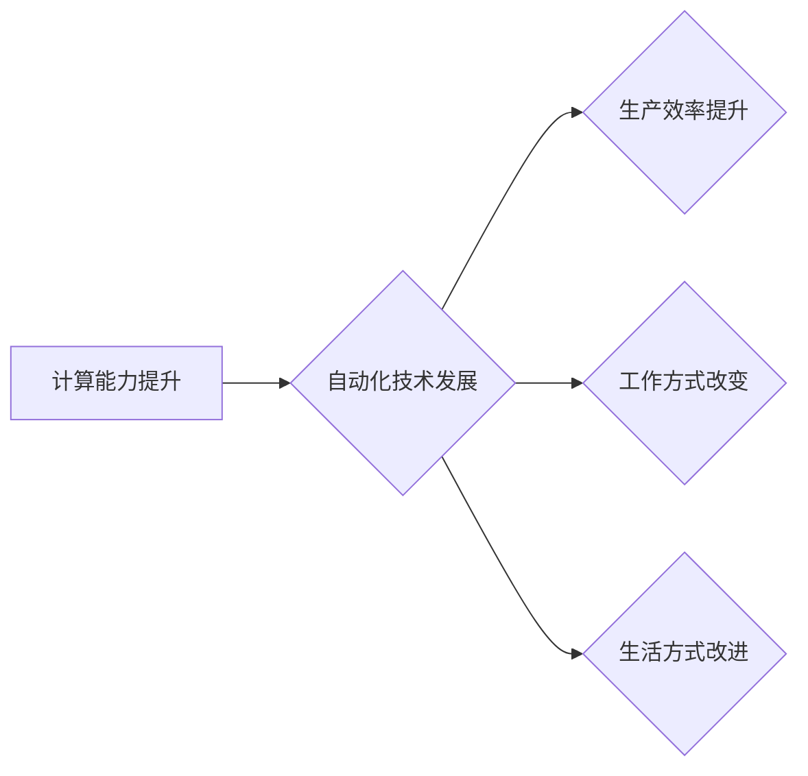

> 计算变化、自动化技术、机器学习、深度学习、流程自动化、软件开发、效率提升、未来趋势

## 1. 背景介绍

在当今数字化时代，计算能力的飞速发展和自动化技术的日益成熟，正在深刻地改变着我们的生活和工作方式。从智能手机到自动驾驶汽车，从个性化推荐到医疗诊断，自动化技术正在无处不在，为我们带来前所未有的便利和效率。

然而，自动化技术的发展也带来了新的挑战和机遇。如何更好地利用自动化技术，推动计算变化，并应对随之而来的伦理和社会问题，是需要我们认真思考和探索的课题。

## 2. 核心概念与联系

**2.1 计算变化**

计算变化是指计算能力的不断提升和应用范围的不断扩展，对社会、经济、文化等各个领域产生深远影响的过程。

**2.2 自动化技术**

自动化技术是指利用计算机和控制系统，对生产、工作或生活中的某些过程进行自动控制和执行的技术。

**2.3 联系**

计算变化和自动化技术是相互促进、相互依存的关系。计算能力的提升为自动化技术的实现提供了基础，而自动化技术的应用则进一步推动了计算能力的扩展和应用范围的拓展。

**2.4 流程图**



## 3. 核心算法原理 & 具体操作步骤

**3.1 算法原理概述**

自动化技术的核心是算法，算法是解决特定问题的一系列步骤或规则。常见的自动化算法包括：

* **机器学习算法:** 能够从数据中学习并不断改进的算法，例如监督学习、无监督学习、强化学习等。
* **深度学习算法:** 基于神经网络的机器学习算法，能够处理更复杂的数据和任务，例如图像识别、自然语言处理等。
* **流程自动化算法:** 用于自动化执行重复性任务的算法，例如机器人流程自动化 (RPA) 等。

**3.2 算法步骤详解**

以机器学习算法为例，其基本步骤包括：

1. **数据收集和预处理:** 收集相关数据并进行清洗、转换、特征提取等预处理工作。
2. **模型选择:** 根据具体任务选择合适的机器学习模型。
3. **模型训练:** 使用训练数据训练模型，调整模型参数，使其能够准确地预测或分类。
4. **模型评估:** 使用测试数据评估模型的性能，例如准确率、召回率、F1-score等。
5. **模型部署:** 将训练好的模型部署到实际应用场景中，用于预测或分类新的数据。

**3.3 算法优缺点**

不同的自动化算法具有不同的优缺点，需要根据具体任务选择合适的算法。例如，机器学习算法能够自动学习和改进，但需要大量的训练数据；深度学习算法能够处理更复杂的数据，但训练成本更高。

**3.4 算法应用领域**

自动化算法广泛应用于各个领域，例如：

* **医疗保健:** 疾病诊断、药物研发、个性化治疗等。
* **金融服务:** 风险管理、欺诈检测、投资决策等。
* **制造业:** 自动化生产、质量控制、 predictive maintenance 等。
* **零售业:** 个性化推荐、库存管理、客户服务等。

## 4. 数学模型和公式 & 详细讲解 & 举例说明

**4.1 数学模型构建**

机器学习算法的训练过程可以看作是一个优化问题，目标是找到最优的模型参数，使得模型在训练数据上的性能达到最大。常用的数学模型包括：

* **线性回归模型:** 用于预测连续数值，其目标函数是最小化预测值与真实值的平方差。
* **逻辑回归模型:** 用于分类问题，其目标函数是最大化正确分类样本的概率。
* **神经网络模型:** 能够处理更复杂的数据，其目标函数是通过反向传播算法最小化预测误差。

**4.2 公式推导过程**

例如，线性回归模型的目标函数为：

$$
J(\theta) = \frac{1}{2m} \sum_{i=1}^{m} (h_\theta(x^{(i)}) - y^{(i)})^2
$$

其中：

* $J(\theta)$ 是损失函数，表示模型预测误差。
* $\theta$ 是模型参数。
* $m$ 是训练样本数量。
* $h_\theta(x^{(i)})$ 是模型预测值。
* $y^{(i)}$ 是真实值。

**4.3 案例分析与讲解**

假设我们有一个数据集，包含房屋面积和房屋价格的信息。我们可以使用线性回归模型来预测房屋价格。

训练模型后，我们可以得到一个线性方程，例如：

$$
y = 20000x + 100000
$$

其中：

* $y$ 是房屋价格。
* $x$ 是房屋面积。

这个方程表示，房屋面积每增加1平方米，房屋价格就会增加20000元。

## 5. 项目实践：代码实例和详细解释说明

**5.1 开发环境搭建**

可以使用Python语言和相关的机器学习库，例如Scikit-learn，TensorFlow等，来实现自动化项目。

**5.2 源代码详细实现**

```python
from sklearn.linear_model import LinearRegression

# 数据集
X = [[100], [150], [200], [250], [300]]
y = [120000, 170000, 220000, 270000, 320000]

# 创建线性回归模型
model = LinearRegression()

# 训练模型
model.fit(X, y)

# 预测新数据
new_data = [[180]]
prediction = model.predict(new_data)

# 打印预测结果
print(f"预测价格: {prediction[0]}")
```

**5.3 代码解读与分析**

这段代码实现了简单的线性回归模型训练和预测。

* 首先，我们定义了数据集，包含房屋面积和房屋价格的信息。
* 然后，我们创建了一个线性回归模型对象。
* 接着，我们使用`fit()`方法训练模型，将数据集作为输入。
* 最后，我们使用`predict()`方法预测新数据的房屋价格。

**5.4 运行结果展示**

运行这段代码后，会输出预测价格为190000元。

## 6. 实际应用场景

**6.1 自动化生产线**

在制造业中，自动化技术可以用于构建自动化生产线，提高生产效率和产品质量。例如，机器人可以代替人工完成重复性操作，例如焊接、喷漆等。

**6.2 智能客服系统**

在服务业中，自动化技术可以用于构建智能客服系统，例如聊天机器人，可以自动回答客户常见问题，提高客户服务效率。

**6.3 个性化推荐系统**

在电商领域，自动化技术可以用于构建个性化推荐系统，根据用户的购买历史和浏览记录，推荐用户可能感兴趣的商品。

**6.4 未来应用展望**

随着计算能力和自动化技术的不断发展，未来自动化技术将应用于更多领域，例如：

* **自动驾驶汽车:** 自动化技术可以用于开发自动驾驶汽车，提高交通安全和效率。
* **医疗诊断:** 自动化技术可以用于辅助医生进行医疗诊断，提高诊断准确率。
* **个性化教育:** 自动化技术可以用于提供个性化教育，根据学生的学习进度和能力，定制学习方案。

## 7. 工具和资源推荐

**7.1 学习资源推荐**

* **在线课程:** Coursera、edX、Udacity等平台提供丰富的机器学习和深度学习课程。
* **书籍:** 《深度学习》、《机器学习实战》等书籍是学习自动化技术的经典教材。
* **开源项目:** TensorFlow、PyTorch等开源项目提供了丰富的代码示例和学习资源。

**7.2 开发工具推荐**

* **Python:** Python是一种流行的编程语言，广泛应用于机器学习和深度学习开发。
* **Scikit-learn:** Scikit-learn是一个用于机器学习的Python库，提供了丰富的算法和工具。
* **TensorFlow:** TensorFlow是一个用于深度学习的开源框架，支持多种硬件平台。

**7.3 相关论文推荐**

* **《ImageNet Classification with Deep Convolutional Neural Networks》**
* **《Attention Is All You Need》**
* **《BERT: Pre-training of Deep Bidirectional Transformers for Language Understanding》**

## 8. 总结：未来发展趋势与挑战

**8.1 研究成果总结**

近年来，自动化技术取得了长足的进步，在各个领域都取得了显著的应用成果。

**8.2 未来发展趋势**

未来自动化技术将朝着以下几个方向发展：

* **更智能化:** 自动化系统将更加智能化，能够更好地理解和响应人类的需求。
* **更通用化:** 自动化技术将更加通用化，能够应用于更多领域和任务。
* **更安全可靠:** 自动化系统将更加安全可靠，能够更好地应对各种突发事件。

**8.3 面临的挑战**

自动化技术的发展也面临着一些挑战：

* **伦理问题:** 自动化技术可能会带来一些伦理问题，例如算法偏见、数据隐私等。
* **社会影响:** 自动化技术可能会导致部分工作岗位被取代，需要考虑社会影响和应对措施。
* **技术瓶颈:** 自动化技术的发展还面临着一些技术瓶颈，例如模型复杂度、数据获取等。

**8.4 研究展望**

未来，我们需要继续加强对自动化技术的研发和应用，并积极应对其带来的挑战，推动自动化技术朝着更加智能、通用、安全可靠的方向发展，为人类社会创造更多价值。

## 9. 附录：常见问题与解答

**9.1 如何选择合适的自动化算法？**

选择合适的自动化算法需要根据具体任务和数据特点进行考虑。例如，对于分类问题，可以考虑使用逻辑回归模型或支持向量机模型；对于回归问题，可以考虑使用线性回归模型或决策树模型。

**9.2 如何解决自动化算法的偏见问题？**

自动化算法的偏见问题可以通过以下方法解决：

* 使用更加公平的数据集进行训练。
* 使用算法调优技术，减少算法的偏见。
* 对算法的输出结果进行人工审核，纠正算法的偏见。

**9.3 自动化技术会取代所有工作吗？**

自动化技术可能会导致部分工作岗位被取代，但同时也创造了新的工作机会。我们需要积极适应自动化技术的发展，不断学习新的技能，才能在未来竞争中保持优势。


作者：禅与计算机程序设计艺术 / Zen and the Art of Computer Programming 
<end_of_turn>