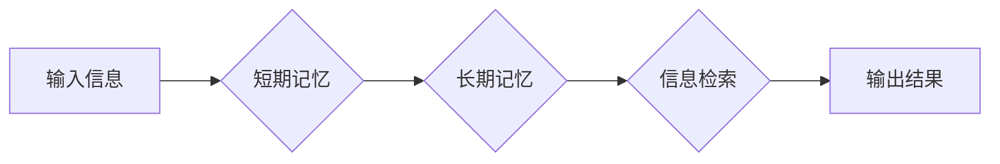

> 记忆，短期记忆，长期记忆，神经网络，深度学习，知识表示，检索，存储，遗忘

## 1. 背景介绍

在信息爆炸的时代，人类对信息的存储和检索能力面临着前所未有的挑战。从古至今，记忆一直是人类最重要的认知功能之一，它让我们能够学习、思考、创造，并与世界互动。然而，人类的记忆并非完美无缺，它存在着局限性，例如容量有限、易于遗忘等问题。

近年来，人工智能技术取得了长足的进步，特别是深度学习的兴起，为模拟和理解人类记忆提供了新的可能性。深度学习模型能够学习复杂的模式和关系，并表现出惊人的记忆能力。例如，在图像识别、自然语言处理等领域，深度学习模型已经超越了人类水平。

## 2. 核心概念与联系

### 2.1 短期记忆与长期记忆

短期记忆和长期记忆是人类记忆的两个主要组成部分。

* **短期记忆** 是一种短暂的记忆形式，能够存储少量信息，通常持续时间在几秒到几分钟之间。它类似于计算机的缓存，用于临时存储正在处理的信息。
* **长期记忆** 是一种持久性的记忆形式，能够存储大量信息，持续时间可以长达数年甚至一生。它类似于计算机的硬盘，用于长期存储信息。

### 2.2 神经网络与记忆

神经网络是一种模仿人类大脑结构和功能的计算模型。它由大量的 interconnected 节点（神经元）组成，这些节点通过连接和权重相互传递信息。

神经网络能够通过学习大量的训练数据，调整连接权重，从而实现对信息的存储和检索。

**Mermaid 流程图**



## 3. 核心算法原理 & 具体操作步骤

### 3.1 算法原理概述

深度学习模型中常用的记忆算法包括：

* **反向传播算法 (Backpropagation)**：用于训练神经网络，通过调整连接权重，最小化模型预测误差。
* **长短期记忆网络 (LSTM)**：一种专门用于处理序列数据的循环神经网络，能够学习长期依赖关系，并有效地解决梯度消失问题。
* **记忆网络 (Memory Network)**：一种能够存储和检索外部知识的网络结构，通过将外部知识融入到模型中，提高了模型的记忆能力和泛化能力。

### 3.2 算法步骤详解

以 LSTM 算法为例，其具体操作步骤如下：

1. **输入序列**: 将输入序列逐个单元地输入到 LSTM 网络中。
2. **隐藏状态**: LSTM 网络维护一个隐藏状态，用于存储当前输入序列的信息。
3. **门控机制**: LSTM 网络使用三个门控机制 (输入门、遗忘门、输出门) 来控制信息的流动，从而实现对信息的存储和检索。
4. **更新隐藏状态**: 根据门控机制和当前输入信息，更新隐藏状态。
5. **输出结果**: 根据隐藏状态和输出门控机制，生成输出结果。

### 3.3 算法优缺点

**LSTM 算法的优点**:

* 能够学习长期依赖关系。
* 能够有效地解决梯度消失问题。

**LSTM 算法的缺点**:

* 计算复杂度较高。
* 训练时间较长。

### 3.4 算法应用领域

LSTM 算法广泛应用于以下领域:

* 自然语言处理 (NLP)：例如机器翻译、文本摘要、情感分析等。
* 语音识别：例如语音转文本、语音助手等。
* 时间序列预测：例如股票价格预测、天气预报等。

## 4. 数学模型和公式 & 详细讲解 & 举例说明

### 4.1 数学模型构建

LSTM 网络的数学模型可以表示为以下方程组:

* **输入门**: $i_t = \sigma(W_{xi}x_t + W_{hi}h_{t-1} + b_i)$
* **遗忘门**: $f_t = \sigma(W_{xf}x_t + W_{hf}h_{t-1} + b_f)$
* **候选细胞状态**: $\tilde{C}_t = \tanh(W_{xc}x_t + W_{hc}h_{t-1} + b_c)$
* **细胞状态**: $C_t = f_t * C_{t-1} + i_t * \tilde{C}_t$
* **输出门**: $o_t = \sigma(W_{xo}x_t + W_{ho}h_{t-1} + b_o)$
* **输出**: $h_t = o_t * \tanh(C_t)$

其中:

* $x_t$ 是当前时间步的输入向量。
* $h_t$ 是当前时间步的隐藏状态向量。
* $C_t$ 是当前时间步的细胞状态向量。
* $W_{ij}$ 是连接层 $i$ 和层 $j$ 的权重矩阵。
* $b_i$ 是连接层 $i$ 的偏置向量。
* $\sigma$ 是 sigmoid 函数。
* $\tanh$ 是 hyperbolic tangent 函数。

### 4.2 公式推导过程

上述公式的推导过程基于以下几个关键点:

* **门控机制**: LSTM 网络使用三个门控机制来控制信息的流动，分别为输入门、遗忘门和输出门。
* **细胞状态**: 细胞状态用于存储长期依赖关系的信息。
* **隐藏状态**: 隐藏状态用于表示当前时间步的网络状态。

通过对这些关键点的分析和数学建模，可以得到上述公式。

### 4.3 案例分析与讲解

以机器翻译为例，LSTM 网络可以用于学习语言之间的映射关系。

在训练过程中，LSTM 网络会输入源语言的句子，并输出目标语言的句子。通过反向传播算法，LSTM 网络会调整连接权重，使得输出的句子与真实的目标句子越接近。

在翻译过程中，LSTM 网络会将源语言的句子输入到网络中，并根据学习到的映射关系，生成目标语言的句子。

## 5. 项目实践：代码实例和详细解释说明

### 5.1 开发环境搭建

* 操作系统: Ubuntu 20.04
* Python 版本: 3.8
* 深度学习框架: TensorFlow 2.x

### 5.2 源代码详细实现

```python
import tensorflow as tf

# 定义 LSTM 模型
model = tf.keras.Sequential([
    tf.keras.layers.Embedding(input_dim=vocab_size, output_dim=embedding_dim),
    tf.keras.layers.LSTM(units=lstm_units),
    tf.keras.layers.Dense(units=vocab_size, activation='softmax')
])

# 编译模型
model.compile(optimizer='adam',
              loss='sparse_categorical_crossentropy',
              metrics=['accuracy'])

# 训练模型
model.fit(x_train, y_train, epochs=epochs)

# 评估模型
loss, accuracy = model.evaluate(x_test, y_test)
print('Loss:', loss)
print('Accuracy:', accuracy)

# 生成文本
text = 'This is a'
for _ in range(max_length):
    prediction = model.predict(tf.expand_dims(text, 0))
    predicted_index = tf.argmax(prediction[0]).numpy()
    text += tokenizer.index_word[predicted_index]
    print(text, end='')
```

### 5.3 代码解读与分析

* **Embedding 层**: 将单词转换为稠密的向量表示。
* **LSTM 层**: 学习单词之间的上下文关系。
* **Dense 层**: 将 LSTM 输出转换为概率分布，预测下一个单词。
* **编译模型**: 指定优化器、损失函数和评价指标。
* **训练模型**: 使用训练数据训练模型。
* **评估模型**: 使用测试数据评估模型性能。
* **生成文本**: 根据训练好的模型，生成新的文本。

### 5.4 运行结果展示

运行代码后，会输出模型的训练和评估结果，以及根据模型生成的文本。

## 6. 实际应用场景

### 6.1 自然语言处理

* **机器翻译**: 将一种语言翻译成另一种语言。
* **文本摘要**: 将长篇文本压缩成短篇摘要。
* **情感分析**: 分析文本中的情感倾向。
* **对话系统**: 创建能够与人类进行自然对话的系统。

### 6.2 其他领域

* **时间序列预测**: 预测未来时间段的数值变化趋势。
* **图像识别**: 将图像分类或识别出其中的物体。
* **语音识别**: 将语音转换为文本。

### 6.4 未来应用展望

随着深度学习技术的不断发展，记忆算法在未来将有更广泛的应用场景，例如:

* **个性化教育**: 根据学生的学习情况，提供个性化的学习内容和教学方法。
* **医疗诊断**: 辅助医生进行疾病诊断和治疗方案制定。
* **智能家居**: 创建能够理解和响应用户指令的智能家居系统。

## 7. 工具和资源推荐

### 7.1 学习资源推荐

* **书籍**:
    * 《深度学习》 by Ian Goodfellow, Yoshua Bengio, and Aaron Courville
    * 《神经网络与深度学习》 by Michael Nielsen
* **在线课程**:
    * Coursera: Deep Learning Specialization
    * Udacity: Deep Learning Nanodegree

### 7.2 开发工具推荐

* **TensorFlow**: 一个开源的深度学习框架。
* **PyTorch**: 另一个开源的深度学习框架。
* **Keras**: 一个基于 TensorFlow 或 Theano 的高层深度学习 API。

### 7.3 相关论文推荐

* **Long Short-Term Memory** by Hochreiter and Schmidhuber (1997)
* **Memory Networks** by West et al. (2015)

## 8. 总结：未来发展趋势与挑战

### 8.1 研究成果总结

近年来，深度学习模型在模拟和理解人类记忆方面取得了长足的进步。LSTM 网络和记忆网络等算法能够学习复杂的模式和关系，并表现出惊人的记忆能力。

### 8.2 未来发展趋势

未来，记忆算法的研究将朝着以下几个方向发展:

* **更强大的记忆能力**: 开发能够存储和检索更大规模信息的记忆模型。
* **更灵活的记忆机制**: 设计更灵活的记忆机制，能够适应不同的任务和数据类型。
* **更可解释的记忆模型**: 提高记忆模型的可解释性，以便更好地理解其工作原理。

### 8.3 面临的挑战

记忆算法仍然面临着一些挑战:

* **数据效率**: 训练大型记忆模型需要大量的训练数据。
* **计算复杂度**: 训练和推理大型记忆模型需要大量的计算资源。
* **可解释性**: 记忆模型的决策过程往往难以理解。

### 8.4 研究展望

尽管面临着挑战，但记忆算法的研究前景依然广阔。随着人工智能技术的不断发展，相信未来我们将能够开发出更强大、更灵活、更可解释的记忆模型，从而更好地理解和模拟人类记忆。

## 9. 附录：常见问题与解答

### 9.1 如何选择合适的记忆算法?

选择合适的记忆算法取决于具体的应用场景和数据特点。

* **短期记忆**: 对于需要处理短序列数据的任务，可以使用简单的循环神经网络 (RNN) 或 LSTM 网络。
* **长期记忆**: 对于需要处理长序列数据的任务，可以使用更复杂的 LSTM 网络或记忆网络。

### 9.2 如何训练记忆模型?

训练记忆模型需要使用大量的训练数据和强大的计算资源。常用的训练方法包括反向传播算法和强化学习。

### 9.3 如何评估记忆模型的性能?

评估记忆模型的性能可以使用各种指标，例如准确率、召回率、F1-score 等。

### 9.4 如何解释记忆模型的决策过程?

解释记忆模型的决策过程是一个复杂的问题，目前还没有完美的解决方案。一些常用的方法包括可视化隐藏状态、分析权重矩阵、使用注意力机制等。


作者：禅与计算机程序设计艺术 / Zen and the Art of Computer