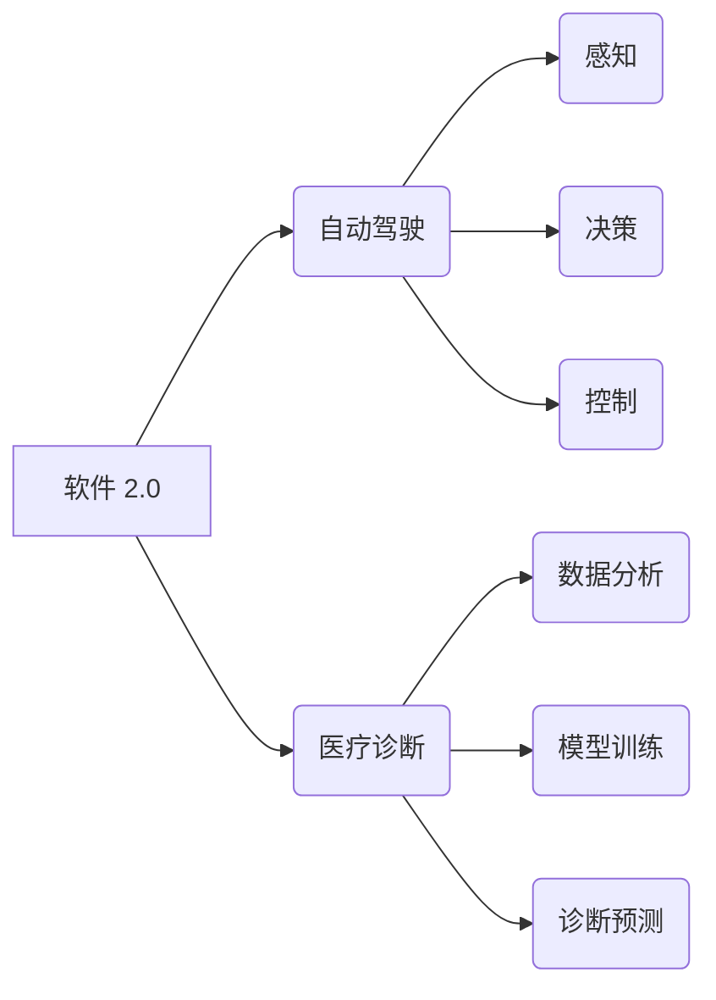

> 软件 2.0, 自动驾驶, 医疗诊断, 深度学习, 机器学习, 算法, 模型, 应用场景

## 1. 背景介绍

软件 2.0 时代正在到来，它标志着软件从传统的静态代码向动态、智能、自适应的进化。与第一代软件相比，软件 2.0 更注重学习、适应和自我改进的能力，其核心是将人工智能（AI）技术深度融入软件开发和运行流程。

自动驾驶和医疗诊断是软件 2.0 的两个重要应用场景，它们都面临着复杂、多变的环境和海量数据处理的挑战。软件 2.0 的智能化特性为解决这些挑战提供了强大的工具和手段。

**自动驾驶** 旨在让车辆能够感知周围环境、做出决策并自动行驶，从而实现无人驾驶的目标。这需要车辆具备强大的感知能力、决策能力和控制能力。

**医疗诊断** 旨在利用人工智能技术辅助医生进行疾病诊断，提高诊断的准确性和效率。这需要模型能够从海量医疗数据中学习疾病特征，并能够准确识别和预测疾病。

## 2. 核心概念与联系

软件 2.0 的核心概念包括：

* **机器学习（ML）:**  使软件能够从数据中学习，并根据学习到的知识进行预测或决策。
* **深度学习（DL）:**  一种更高级的机器学习方法，利用多层神经网络模拟人类大脑的学习过程。
* **强化学习（RL）:**  一种使软件能够通过与环境交互学习的算法，通过奖励和惩罚机制来优化行为。
* **自适应性:**  软件能够根据环境变化和用户需求进行调整和优化。

**软件 2.0 与自动驾驶和医疗诊断的关系:**



## 3. 核心算法原理 & 具体操作步骤

### 3.1  算法原理概述

自动驾驶和医疗诊断中常用的核心算法包括：

* **卷积神经网络（CNN）:**  擅长处理图像数据，常用于自动驾驶中的目标识别和医疗诊断中的病灶检测。
* **循环神经网络（RNN）:**  擅长处理序列数据，常用于自动驾驶中的路径规划和医疗诊断中的疾病预测。
* **强化学习算法:**  常用于自动驾驶中的决策控制和医疗诊断中的个性化治疗方案制定。

### 3.2  算法步骤详解

**以 CNN 在自动驾驶中的目标识别为例:**

1. **数据采集:**  收集大量包含车辆、行人、交通信号灯等目标的图像数据。
2. **数据预处理:**  对图像数据进行裁剪、缩放、增强等处理，使其更适合模型训练。
3. **模型构建:**  设计 CNN 模型结构，包括卷积层、池化层、全连接层等。
4. **模型训练:**  利用训练数据训练 CNN 模型，调整模型参数，使其能够准确识别目标。
5. **模型评估:**  使用测试数据评估模型的识别准确率，并进行调优。
6. **模型部署:**  将训练好的模型部署到自动驾驶系统中，用于实时目标识别。

### 3.3  算法优缺点

**CNN:**

* **优点:**  识别精度高，能够提取图像特征。
* **缺点:**  训练数据量大，计算量大。

**RNN:**

* **优点:**  处理序列数据能力强，能够捕捉时间依赖关系。
* **缺点:**  训练难度大，容易出现梯度消失问题。

**强化学习算法:**

* **优点:**  能够学习复杂的决策策略，适应动态环境。
* **缺点:**  训练时间长，需要大量的交互数据。

### 3.4  算法应用领域

* **自动驾驶:**  目标识别、路径规划、决策控制。
* **医疗诊断:**  病灶检测、疾病预测、个性化治疗方案制定。
* **金融领域:**  欺诈检测、风险评估、投资决策。
* **自然语言处理:**  机器翻译、文本摘要、情感分析。

## 4. 数学模型和公式 & 详细讲解 & 举例说明

### 4.1  数学模型构建

**CNN 模型的数学模型:**

CNN 模型的核心是卷积层和池化层。卷积层使用卷积核对输入图像进行卷积运算，提取图像特征。池化层对卷积层的输出进行降维操作，减少计算量。

**卷积运算公式:**

$$
y_{i,j} = \sum_{m=0}^{M-1} \sum_{n=0}^{N-1} x_{i+m,j+n} * w_{m,n} + b
$$

其中：

* $y_{i,j}$ 是卷积核输出的像素值。
* $x_{i+m,j+n}$ 是输入图像的像素值。
* $w_{m,n}$ 是卷积核的权重值。
* $b$ 是偏置值。

**池化运算公式:**

$$
y_{i,j} = \max(x_{i,j}, x_{i+1,j}, x_{i,j+1}, x_{i+1,j+1})
$$

其中：

* $y_{i,j}$ 是池化层的输出像素值。
* $x_{i,j}$ 是卷积层的输出像素值。

### 4.2  公式推导过程

卷积运算公式的推导过程是基于线性代数和微积分的知识。

池化运算公式的推导过程是基于最大值函数的性质。

### 4.3  案例分析与讲解

**CNN 在自动驾驶中的目标识别案例:**

使用 CNN 模型识别道路上的车辆。

1. **数据:**  收集大量包含车辆的图像数据。
2. **模型:**  设计 CNN 模型结构，包括卷积层、池化层、全连接层等。
3. **训练:**  利用训练数据训练 CNN 模型，调整模型参数。
4. **测试:**  使用测试数据评估模型的识别准确率。

## 5. 项目实践：代码实例和详细解释说明

### 5.1  开发环境搭建

* 操作系统: Ubuntu 20.04
* Python 版本: 3.8
* 深度学习框架: TensorFlow 2.0

### 5.2  源代码详细实现

```python
import tensorflow as tf

# 定义 CNN 模型结构
model = tf.keras.models.Sequential([
    tf.keras.layers.Conv2D(32, (3, 3), activation='relu', input_shape=(64, 64, 3)),
    tf.keras.layers.MaxPooling2D((2, 2)),
    tf.keras.layers.Conv2D(64, (3, 3), activation='relu'),
    tf.keras.layers.MaxPooling2D((2, 2)),
    tf.keras.layers.Flatten(),
    tf.keras.layers.Dense(10, activation='softmax')
])

# 编译模型
model.compile(optimizer='adam',
              loss='sparse_categorical_crossentropy',
              metrics=['accuracy'])

# 训练模型
model.fit(x_train, y_train, epochs=10)

# 评估模型
loss, accuracy = model.evaluate(x_test, y_test)
print('Test loss:', loss)
print('Test accuracy:', accuracy)
```

### 5.3  代码解读与分析

* **模型定义:**  使用 `tf.keras.models.Sequential` 创建一个顺序模型，并添加卷积层、池化层、全连接层等。
* **模型编译:**  使用 `adam` 优化器、`sparse_categorical_crossentropy` 损失函数和 `accuracy` 评价指标编译模型。
* **模型训练:**  使用 `model.fit` 方法训练模型，输入训练数据和标签，设置训练轮数。
* **模型评估:**  使用 `model.evaluate` 方法评估模型，输入测试数据和标签，输出测试损失和准确率。

### 5.4  运行结果展示

训练完成后，可以查看模型的测试准确率，并使用模型对新的图像数据进行预测。

## 6. 实际应用场景

### 6.1  自动驾驶

* **感知:**  利用 CNN 模型识别道路上的车辆、行人、交通信号灯等目标。
* **决策:**  利用 RNN 模型预测车辆行驶路径，并根据环境变化做出决策。
* **控制:**  利用强化学习算法控制车辆的加速、减速、转向等动作。

### 6.2  医疗诊断

* **病灶检测:**  利用 CNN 模型检测医学图像中的病灶，例如 X 光片中的肺结核、CT 图像中的肿瘤。
* **疾病预测:**  利用 RNN 模型分析患者的病史、症状、检查结果等数据，预测患者患病风险。
* **个性化治疗方案制定:**  利用强化学习算法根据患者的个体特征和疾病情况，制定个性化的治疗方案。

### 6.4  未来应用展望

软件 2.0 的应用场景将更加广泛，例如：

* **智能家居:**  通过 AI 技术，实现家居设备的智能化控制和自动化。
* **个性化教育:**  根据学生的学习情况和需求，提供个性化的学习方案和辅导。
* **金融科技:**  利用 AI 技术，提高金融服务的效率和精准度。

## 7. 工具和资源推荐

### 7.1  学习资源推荐

* **书籍:**
    * 《深度学习》
    * 《机器学习实战》
    * 《Python机器学习》
* **在线课程:**
    * Coursera: 深度学习
    * edX: 机器学习
    * Udacity: 自动驾驶工程师

### 7.2  开发工具推荐

* **Python:**  通用编程语言，广泛应用于 AI 开发。
* **TensorFlow:**  开源深度学习框架，提供丰富的 API 和工具。
* **PyTorch:**  开源深度学习框架，以其灵活性和易用性而闻名。
* **Keras:**  高层深度学习 API，可以运行在 TensorFlow、Theano 或 CNTK 后端。

### 7.3  相关论文推荐

* **《ImageNet Classification with Deep Convolutional Neural Networks》**
* **《Attention Is All You Need》**
* **《Deep Reinforcement Learning》**

## 8. 总结：未来发展趋势与挑战

### 8.1  研究成果总结

软件 2.0 的研究取得了显著成果，例如：

* **深度学习算法的不断发展:**  模型精度不断提高，应用场景不断扩展。
* **硬件技术的进步:**  GPU 和 TPU 等加速器的发展，使得深度学习模型训练速度更快。
* **开源工具和资源的丰富:**  开源框架、数据集和模型，降低了 AI 开发的门槛。

### 8.2  未来发展趋势

* **模型更加智能化:**  研究更强大的 AI 模型，例如通用人工智能 (AGI)。
* **模型更加可解释性:**  研究如何解释 AI 模型的决策过程，提高模型的信任度。
* **模型更加安全可靠:**  研究如何防止 AI 模型被攻击和滥用。

### 8.3  面临的挑战

* **数据获取和标注:**  训练高质量的 AI 模型需要大量的数据，数据获取和标注成本高。
* **模型训练效率:**  训练大型 AI 模型需要大量的计算资源和时间。
* **模型部署和维护:**  将 AI 模型部署到实际应用场景中，并进行维护和更新，需要克服技术和成本挑战。

### 8.4  研究展望

未来，软件 2.0 将继续推动人工智能技术的发展，并应用于更多领域，为人类社会带来更多福祉。


## 9. 附录：常见问题与解答

**Q1: 软件 2.0 和传统软件有什么区别？**

**A1:** 软件 2