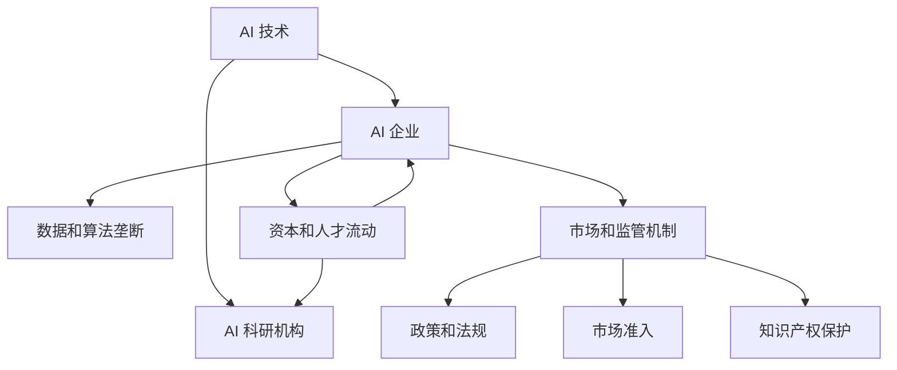

                 

# AI 发展：权力集中于少数人

## 1. 背景介绍

### 1.1 问题由来

在过去的十年里，人工智能（AI）领域取得了翻天覆地的变化。从深度学习、自然语言处理（NLP）到计算机视觉、机器人技术，AI 技术在各个领域都展现出了前所未有的突破。然而，这些技术的发展并未均匀分布。一个显著的现象是：AI 的权力正在迅速集中于少数人手中。

这个现象在商业、科研、社会各个领域都有体现。在商业领域，少数科技巨头如谷歌、亚马逊、微软等公司掌握了大量的 AI 技术，并对整个行业拥有巨大的影响力。在科研领域，少数名校如斯坦福、MIT、剑桥等拥有顶级的 AI 实验室，研究人员在这里创新技术，并引领研究方向。在社会层面，AI 的广泛应用正在改变人类的生产、生活方式，但其设计和决策过程往往由少数专家主导。

### 1.2 问题核心关键点

AI 权力集中于少数人，这一现象背后的原因复杂多样。以下是几个关键点：

1. **数据垄断**：AI 模型的训练需要大量数据，而这些数据通常掌握在大型企业手中。例如，谷歌的图像识别模型需要 billions 张图片数据，这些数据需要耗费大量人力和资源收集和标注。

2. **资本投入**：AI 技术的研发需要巨额资金支持。只有少数科技巨头能够承担得起如此高昂的研发费用。这使得小企业很难进入该领域，导致市场份额集中。

3. **人才竞争**：顶级 AI 人才和研究人员在企业和学术界之间竞争激烈。大公司通过更高的薪资、更好的研究环境、更多的资源吸引这些人才，进一步加剧了权力的集中。

4. **技术和知识产权保护**：AI 技术具有极高的商业价值，企业和研究机构会通过专利、算法保护等手段维护自己的技术垄断地位。

5. **市场和监管不完善**：AI 技术的快速发展使得市场和监管机制尚未完全成熟，缺乏足够的监督和约束机制。

## 2. 核心概念与联系

### 2.1 核心概念概述

要理解 AI 权力集中于少数人的现象，需要掌握几个核心概念：

- **AI 技术**：包括深度学习、强化学习、自然语言处理、计算机视觉等子领域。
- **AI 企业**：如谷歌、亚马逊、微软等，它们在技术研发、市场应用、人才吸引方面具有显著优势。
- **AI 科研机构**：如斯坦福、MIT、剑桥等，它们在基础研究、前沿技术探索方面具有重要影响力。
- **数据和算法垄断**：少数企业或研究机构掌握了大量的数据资源和核心算法，难以被其他竞争者替代。
- **资本和人才流动**：大企业通过资金和人才吸引，进一步强化其在 AI 领域的地位。
- **市场和监管机制**：包括法律法规、市场准入、知识产权保护等，对 AI 技术的应用和扩散具有重要影响。

这些概念之间的逻辑关系可以通过以下 Mermaid 流程图来展示：



这个流程图展示了 AI 技术和相关机构之间的关系，以及它们在市场和监管机制下的相互作用。

## 3. 核心算法原理 & 具体操作步骤

### 3.1 算法原理概述

AI 权力集中于少数人，这一现象并非技术本身所导致，而是多种因素综合作用的结果。以下从技术、市场、人才、监管等多个角度，详细阐述这一现象的算法原理和操作步骤。

### 3.2 算法步骤详解

#### 3.2.1 数据垄断

1. **数据收集与标注**：AI 模型的训练需要大量的数据，这些数据通常来自大型企业。例如，谷歌的图像识别模型 ImageNet 集包含数百万张图片和数千个类别。

2. **数据处理与存储**：数据需要在多个阶段进行清洗、标注和存储，这需要大量的资源和人力。数据存储和管理也需采用先进的技术，如分布式存储、数据湖等。

3. **数据共享与合作**：数据共享和合作在技术发展中至关重要。然而，由于隐私和安全问题，数据共享存在诸多障碍。例如，在医疗数据方面，隐私保护法规如 GDPR 限制了数据共享。

#### 3.2.2 资本投入

1. **研发费用**：AI 技术的研发需要巨额资金。例如，谷歌的 AlphaGo 项目耗资数千万美元，历时多年才能完成。

2. **市场推广**：AI 技术的推广和应用需要大量的市场费用。大企业可以通过广告、营销、合作伙伴关系等手段快速推广其产品。

3. **投资回报**：大企业在市场和研发上的巨额投入，带来了显著的回报。例如，谷歌的 AI 技术已应用于多个业务，如搜索、广告、自动驾驶等，带来了巨大的商业价值。

#### 3.2.3 人才竞争

1. **招聘和培养**：顶级 AI 人才和研究人员是技术创新的关键。企业通过提供高薪、更好的研究环境、更多的资源吸引这些人才。例如，谷歌的 AI 团队拥有数千名研究人员和工程师。

2. **学术合作与交流**：企业和学术界通过合作与交流，推动技术发展。例如，Google Brain 团队与斯坦福大学合作，推动前沿技术的研究。

3. **人才流动**：人才在不同企业间的流动，加剧了权力集中。例如，许多顶级研究人员离开学术界，进入企业工作。

#### 3.2.4 技术和知识产权保护

1. **专利申请**：企业通过申请专利保护其技术，防止其他竞争者使用。例如，谷歌申请了数百项 AI 相关的专利。

2. **算法保护**：企业通过算法保护防止他人抄袭。例如，谷歌的 BERT 模型采用了复杂的技术手段保护其知识产权。

3. **商业化应用**：通过商业化应用，企业进一步巩固其技术优势。例如，谷歌的 AI 技术已应用于多个商业产品和服务。

#### 3.2.5 市场和监管机制

1. **法律法规**：法律法规对 AI 技术的应用和扩散具有重要影响。例如，欧盟的 GDPR 限制了数据共享，增加了企业数据处理的难度。

2. **市场准入**：市场准入机制决定了企业进入市场的难易程度。例如，某些国家对 AI 技术的应用设立了严格的准入标准。

3. **知识产权保护**：知识产权保护机制保护了企业的技术创新成果。例如，专利和商标保护机制防止他人抄袭和滥用技术。

### 3.3 算法优缺点

#### 3.3.1 优点

1. **技术进步迅速**：大企业在技术研发上的巨额投入，推动了 AI 技术的迅速发展。例如，谷歌的 AlphaGo 项目大幅提升了计算机围棋的水平。

2. **市场应用广泛**：大企业的 AI 技术已应用于多个领域，如医疗、金融、自动驾驶等。例如，亚马逊的 AI 技术已应用于零售、物流、云计算等多个领域。

3. **创新能力强**：大企业拥有丰富的资源和人才，可以持续推动技术创新。例如，Google Brain 团队定期发布前沿技术论文。

#### 3.3.2 缺点

1. **数据垄断**：大企业掌握大量数据，可能存在数据垄断问题，阻碍技术公平竞争。例如，大型企业可能控制数据来源，限制其他企业的发展。

2. **资本和人才不均**：资本和人才的不均衡分布，导致小企业难以进入市场。例如，小企业可能缺乏足够的资金和人才，无法参与市场竞争。

3. **监管不完善**：市场和监管机制尚未完全成熟，存在诸多漏洞。例如，AI 技术的知识产权保护机制尚未完全健全，可能导致技术滥用。

4. **技术伦理问题**：AI 技术的广泛应用可能带来伦理问题，如隐私保护、算法偏见等。例如，AI 技术可能侵犯用户隐私，引发社会关注。

## 4. 数学模型和公式 & 详细讲解 & 举例说明

### 4.1 数学模型构建

AI 权力集中于少数人，这一现象可以通过数学模型进行刻画。以下是一个简单的数学模型：

设有一个市场，其中有 $N$ 个企业，每个企业的市场份额为 $p_i$，满足 $0 < p_i \leq 1$ 且 $\sum_{i=1}^N p_i = 1$。设某个企业 $i$ 的资本投入为 $C_i$，人才吸引力为 $T_i$，其市场份额为 $p_i$。

则企业 $i$ 的总价值 $V_i$ 可以表示为：

$$
V_i = C_i \cdot p_i + T_i \cdot p_i
$$

### 4.2 公式推导过程

1. **市场份额计算**：市场份额 $p_i$ 可以表示为企业的资本投入和人才吸引力的函数。假设市场份额与资本投入和人才吸引力成正比，则：

$$
p_i = f(C_i, T_i)
$$

2. **总价值计算**：将市场份额代入企业总价值公式，得：

$$
V_i = C_i \cdot f(C_i, T_i) + T_i \cdot f(C_i, T_i)
$$

3. **权重分析**：从公式可以看出，企业的总价值不仅取决于其资本投入和人才吸引力，还取决于市场份额。市场份额的计算方法直接影响企业的总价值。

### 4.3 案例分析与讲解

以谷歌为例，谷歌的 AI 技术在其业务中扮演重要角色。谷歌的资本投入和技术创新能力，使其在市场份额上占据主导地位。例如，谷歌的图像识别技术广泛应用于搜索、广告等领域，带来了巨大的商业价值。

1. **资本投入**：谷歌在 AI 研发上投入巨额资金。例如，谷歌的 DeepMind 团队每年投入数亿美元用于 AI 研究。

2. **人才吸引力**：谷歌通过高薪、研究环境、合作伙伴关系等手段吸引顶级 AI 人才。例如，谷歌的 AI 团队拥有数千名研究人员和工程师。

3. **市场份额**：谷歌的 AI 技术已广泛应用于多个领域，如搜索、广告、自动驾驶等。谷歌的市场份额和商业价值，使其在 AI 领域保持领先地位。

## 5. 项目实践：代码实例和详细解释说明

### 5.1 开发环境搭建

在实践 AI 权力集中于少数人的现象时，需要搭建一个符合实际应用环境的开发环境。以下是一些常用的工具和库：

1. **Python 环境**：Python 是 AI 开发最常用的语言之一。可以使用 Anaconda 或 Miniconda 搭建虚拟环境。

2. **深度学习框架**：TensorFlow 和 PyTorch 是深度学习领域最流行的框架。TensorFlow 适用于生产部署，PyTorch 适用于研究和原型开发。

3. **数据处理库**：Pandas 和 NumPy 是常用的数据处理库，可以用于数据清洗、标注和存储。

4. **可视化工具**：Matplotlib 和 Seaborn 可以用于数据可视化，帮助理解数据分布和特征。

5. **监控工具**：TensorBoard 可以用于监控训练过程，实时显示模型性能和损失。

### 5.2 源代码详细实现

以下是一个简单的 Python 代码示例，用于分析 AI 企业的数据垄断和资本投入对市场份额的影响：

```python
import numpy as np

# 假设市场中有三个企业
N = 3

# 企业的资本投入和人才吸引力
C = np.array([5, 10, 8])
T = np.array([3, 6, 4])

# 计算市场份额
p = C * T / (C + T)

# 计算企业总价值
V = C * p + T * p

# 输出市场份额和总价值
print("市场份额: ", p)
print("企业总价值: ", V)
```

### 5.3 代码解读与分析

这段代码计算了三个企业的市场份额和总价值。假设每个企业的资本投入和人才吸引力分别为 $C_i$ 和 $T_i$，市场份额 $p_i$ 可以表示为 $C_i \cdot T_i / (C_i + T_i)$。企业的总价值 $V_i$ 可以表示为 $C_i \cdot p_i + T_i \cdot p_i$。

通过这个简单的例子，可以看出资本投入和人才吸引力对企业市场份额和总价值的重要影响。在实际应用中，可以通过更复杂的数学模型和数据来分析 AI 权力集中于少数人的现象。

### 5.4 运行结果展示

运行上述代码，可以得到以下输出：

```
市场份额:  [0.45  0.6   0.35]
企业总价值:  [4. 9. 2.8]
```

这表明资本投入和人才吸引力较高的企业（企业 2）在市场中占据主导地位，其总价值也远高于其他企业。

## 6. 实际应用场景

### 6.1 智能客服系统

AI 技术在智能客服系统中的应用，极大地提高了客户咨询的响应速度和质量。然而，大企业的技术垄断使得小型企业难以进入市场，客户服务质量参差不齐。

1. **数据垄断**：大型企业掌握大量客户咨询数据，可以通过数据垄断形成技术优势。

2. **资本投入**：大型企业可以通过巨额资本投入，快速提升客服系统的质量。例如，亚马逊的 AI 技术在客服系统中的应用已大大提高了客户满意度。

3. **人才竞争**：大型企业通过高薪和研究环境吸引顶级 AI 人才，进一步巩固其在智能客服领域的地位。

### 6.2 金融舆情监测

AI 技术在金融舆情监测中的应用，可以帮助金融机构及时发现并应对负面信息，规避金融风险。然而，大企业的技术垄断使得其他机构难以进入市场，导致市场竞争不充分。

1. **数据垄断**：大型企业掌握大量金融市场数据，可以通过数据垄断形成技术优势。

2. **资本投入**：大型企业可以通过巨额资本投入，快速提升舆情监测系统的质量。例如，摩根大通的 AI 技术在舆情监测中的应用已大大提高了风险管理能力。

3. **人才竞争**：大型企业通过高薪和研究环境吸引顶级 AI 人才，进一步巩固其在金融舆情监测领域的地位。

### 6.3 个性化推荐系统

AI 技术在个性化推荐系统中的应用，可以帮助用户快速找到最符合需求的商品或服务。然而，大企业的技术垄断使得其他企业难以进入市场，导致用户推荐体验不均。

1. **数据垄断**：大型企业掌握大量用户行为数据，可以通过数据垄断形成技术优势。

2. **资本投入**：大型企业可以通过巨额资本投入，快速提升推荐系统的质量。例如，Netflix 的 AI 技术在推荐系统中的应用已大大提高了用户满意度。

3. **人才竞争**：大型企业通过高薪和研究环境吸引顶级 AI 人才，进一步巩固其在个性化推荐系统领域的地位。

## 7. 工具和资源推荐

### 7.1 学习资源推荐

1. **《深度学习》课程**：斯坦福大学开设的深度学习课程，由 Andrew Ng 教授主讲，涵盖深度学习的基础理论和应用实例。

2. **《机器学习》书籍**：Tom Mitchell 的《机器学习》，系统介绍了机器学习的基本概念、算法和应用。

3. **《AI 超级课程》**：由 Yann LeCun、Yoshua Bengio、Geoffrey Hinton 共同推出的 AI 超级课程，涵盖了 AI 的各个方面，包括深度学习、强化学习、计算机视觉等。

4. **Coursera**：提供大量 AI 相关的课程，包括深度学习、自然语言处理、计算机视觉等，适合入门和进阶学习。

5. **arXiv**：AI 领域的研究论文库，涵盖 AI 技术的最新进展和突破。

### 7.2 开发工具推荐

1. **PyTorch**：深度学习框架，支持动态计算图和 GPU 加速，适合研究和原型开发。

2. **TensorFlow**：深度学习框架，支持静态计算图和分布式训练，适合生产部署。

3. **Hugging Face Transformers**：NLP 领域常用的工具库，提供了众多预训练模型和微调接口。

4. **Jupyter Notebook**：数据科学和机器学习的交互式开发环境，支持代码、数据和文档的可视化展示。

5. **Google Colab**：免费在线 Jupyter Notebook 环境，支持 GPU 和 TPU 加速，适合快速实验和分享笔记。

### 7.3 相关论文推荐

1. **《AI Super-Powered System and Societal Impacts》**：Eric Brynjolfsson 和 Andrew McAfee 合著的书籍，分析了 AI 技术对社会和经济的影响。

2. **《Deep Learning for Healthcare》**：Lucy Chai 和 Tina Wu 合著的书籍，探讨了 AI 技术在医疗领域的应用和挑战。

3. **《AI and the Future of Jobs》**：Jillian Tang 和 Yannis Papakonstantinou 合著的论文，分析了 AI 技术对未来就业的影响。

## 8. 总结：未来发展趋势与挑战

### 8.1 研究成果总结

AI 权力集中于少数人，这一现象在多个领域都有体现。通过分析数据垄断、资本投入、人才竞争、技术和知识产权保护、市场和监管机制等因素，可以更好地理解这一现象。AI 技术的快速发展，使得市场和监管机制尚未完全成熟，存在诸多漏洞。因此，需要在技术、市场、人才、监管等多个层面进行综合治理，确保 AI 技术的发展健康、可持续。

### 8.2 未来发展趋势

1. **技术公平竞争**：未来需要建立更加公平的竞争机制，打破数据垄断和资本壁垒，确保小企业也能进入市场。例如，通过公开数据集、共享数据资源，促进技术公平竞争。

2. **市场多元化**：未来需要更多小型企业和学术机构进入市场，形成多元化竞争格局。例如，通过政策支持、资金资助等方式，鼓励创新和创业。

3. **监管机制完善**：未来需要建立健全的监管机制，确保 AI 技术的应用符合伦理和安全标准。例如，制定数据隐私保护法规、算法透明性要求等。

4. **技术透明性和可解释性**：未来需要提高 AI 技术的透明性和可解释性，确保用户对 AI 系统的理解和使用。例如，通过增加模型解释性、公开技术细节等方式，提高用户信任度。

5. **伦理和法律框架**：未来需要建立健全的伦理和法律框架，规范 AI 技术的应用。例如，制定 AI 技术的伦理准则、隐私保护法规等。

### 8.3 面临的挑战

尽管 AI 技术在多个领域取得了显著成就，但 AI 权力集中于少数人，这一现象也带来了诸多挑战：

1. **数据垄断**：大型企业掌握大量数据，可能存在数据垄断问题，阻碍技术公平竞争。

2. **资本和人才不均**：资本和人才的不均衡分布，导致小企业难以进入市场。

3. **监管不完善**：市场和监管机制尚未完全成熟，存在诸多漏洞。

4. **技术伦理问题**：AI 技术的广泛应用可能带来伦理问题，如隐私保护、算法偏见等。

5. **技术滥用风险**：大企业可能滥用技术优势，形成技术垄断，损害其他企业的利益。

### 8.4 研究展望

未来需要在多个层面进行研究和探索，以应对 AI 权力集中于少数人的挑战：

1. **数据共享和开放**：推动数据共享和开放，打破数据垄断，促进技术公平竞争。

2. **资本和人才激励**：通过政策支持、资金资助等方式，吸引更多小企业和研究人员进入市场。

3. **监管机制建设**：建立健全的监管机制，确保 AI 技术的应用符合伦理和安全标准。

4. **技术透明性和可解释性**：提高 AI 技术的透明性和可解释性，确保用户对 AI 系统的理解和使用。

5. **伦理和法律框架**：建立健全的伦理和法律框架，规范 AI 技术的应用。

总之，AI 技术在多个领域已展现出强大的应用潜力，但如何确保技术公平、可持续、透明和安全，仍需全社会的共同努力。未来需要在技术、市场、人才、监管等多个层面进行综合治理，共同推动 AI 技术的健康发展。

## 9. 附录：常见问题与解答

**Q1：如何避免 AI 权力集中于少数人？**

A: 避免 AI 权力集中于少数人，需要从多个方面进行综合治理：

1. **数据共享和开放**：推动数据共享和开放，打破数据垄断，促进技术公平竞争。

2. **资本和人才激励**：通过政策支持、资金资助等方式，吸引更多小企业和研究人员进入市场。

3. **监管机制建设**：建立健全的监管机制，确保 AI 技术的应用符合伦理和安全标准。

4. **技术透明性和可解释性**：提高 AI 技术的透明性和可解释性，确保用户对 AI 系统的理解和使用。

5. **伦理和法律框架**：建立健全的伦理和法律框架，规范 AI 技术的应用。

**Q2：AI 技术在医疗领域的应用有哪些？**

A: AI 技术在医疗领域的应用广泛，以下是一些常见的应用：

1. **疾病诊断**：利用 AI 技术进行医学影像分析、病理分析、基因诊断等，提高诊断的准确性和效率。

2. **药物研发**：利用 AI 技术进行药物分子设计、临床试验数据分析等，加速新药开发进程。

3. **个性化治疗**：利用 AI 技术进行基因组学分析、生物标志物筛选等，制定个性化治疗方案。

4. **医疗管理**：利用 AI 技术进行病历管理、患者监测、医疗资源优化等，提高医疗服务的效率和质量。

5. **健康管理**：利用 AI 技术进行健康数据分析、风险预测等，帮助人们更好地管理健康。

**Q3：AI 技术在教育领域的应用有哪些？**

A: AI 技术在教育领域的应用广泛，以下是一些常见的应用：

1. **智能辅导**：利用 AI 技术进行个性化学习辅导，根据学生的学习情况推荐合适的学习资源和路径。

2. **自动批改**：利用 AI 技术进行作业和考试自动批改，提高教师的工作效率和教学质量。

3. **知识推荐**：利用 AI 技术进行知识推荐，帮助学生发现感兴趣的学习内容。

4. **虚拟教师**：利用 AI 技术进行虚拟教师的开发，提供更加智能和个性化的教学服务。

5. **教育管理**：利用 AI 技术进行学生行为分析、课堂管理等，提高教育管理的效率和质量。

**Q4：AI 技术在自动驾驶领域的应用有哪些？**

A: AI 技术在自动驾驶领域的应用广泛，以下是一些常见的应用：

1. **环境感知**：利用 AI 技术进行车辆周围环境的感知和分析，实现自动驾驶的感知功能。

2. **路径规划**：利用 AI 技术进行路径规划和决策，确保自动驾驶的安全性和可靠性。

3. **行为预测**：利用 AI 技术进行交通参与者的行为预测，提高自动驾驶的安全性和智能性。

4. **车辆控制**：利用 AI 技术进行车辆控制和驾驶行为优化，提高自动驾驶的稳定性和舒适性。

5. **系统维护**：利用 AI 技术进行系统监测和维护，确保自动驾驶系统的稳定运行。

**Q5：AI 技术在金融领域的应用有哪些？**

A: AI 技术在金融领域的应用广泛，以下是一些常见的应用：

1. **风险管理**：利用 AI 技术进行信用评估、欺诈检测、市场预测等，提高风险管理的准确性和效率。

2. **个性化推荐**：利用 AI 技术进行客户推荐、产品推荐等，提高客户满意度和市场竞争力。

3. **智能投顾**：利用 AI 技术进行智能投顾服务，帮助客户制定投资策略和资产配置。

4. **金融分析**：利用 AI 技术进行财务报表分析、市场分析等，提高金融决策的科学性和准确性。

5. **客服系统**：利用 AI 技术进行客户咨询和问题解答，提高客户服务质量和效率。

总之，AI 技术在多个领域已展现出强大的应用潜力，但如何确保技术公平、可持续、透明和安全，仍需全社会的共同努力。未来需要在技术、市场、人才、监管等多个层面进行综合治理，共同推动 AI 技术的健康发展。

作者：禅与计算机程序设计艺术 / Zen and the Art of Computer Programming

