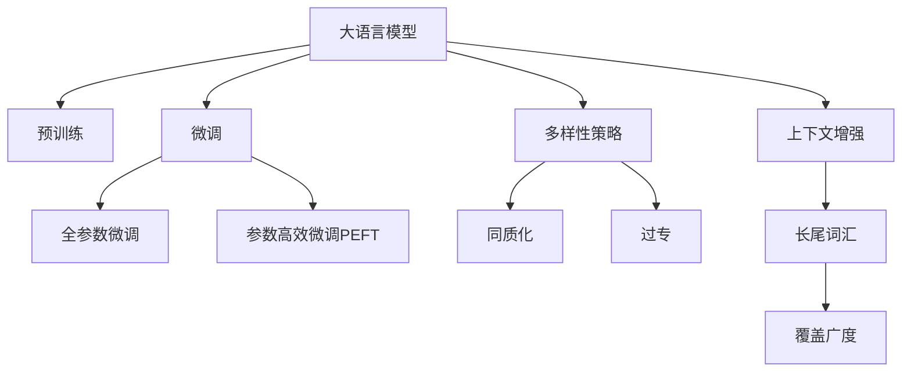

                 

# AI 大模型在电商搜索推荐中的多样性策略：避免同质化与过专问题

## 1. 背景介绍

### 1.1 问题由来

在当今数字化时代，电商平台已成为消费者购物的重要渠道之一。而搜索推荐系统作为电商平台的核心功能，直接影响着用户的购物体验和商家销售额。传统的基于协同过滤和内容推荐的技术，已经难以满足用户日益复杂、多元化的需求。

AI 大模型，尤其是基于预训练-微调的大语言模型，凭借其强大的语义理解和生成能力，成为电商搜索推荐的新宠。这些模型在处理海量文本数据上表现出色，能够捕捉丰富的语义信息和用户意图。然而，在实际应用中，大模型同样面临着同质化与过专等多样性问题，导致推荐结果单一，无法满足个性化需求，影响用户体验和转化率。

### 1.2 问题核心关键点

多样性问题主要体现在以下两个方面：

- **同质化问题**：由于大模型对常见词语和句子结构的依赖，导致推荐结果倾向于那些高频出现的词汇和模板，而忽视了长尾词汇和新颖表达。
- **过专问题**：大模型在特定领域或类别上的深度学习，使得推荐结果过于偏重于某个领域或类别，而忽视了其他相关领域的知识，从而导致了推荐结果的狭窄性和局限性。

为了解决这些问题，需要在模型的训练和微调过程中引入多样性策略，以提升推荐系统的覆盖广度和深度，满足用户的个性化需求。

## 2. 核心概念与联系

### 2.1 核心概念概述

为了更好地理解并解决电商搜索推荐中的多样性问题，本节将介绍几个密切相关的核心概念：

- **大语言模型(Large Language Model, LLM)**：以自回归或自编码模型为代表的预训练语言模型。通过在大规模无标签文本语料上进行预训练，学习通用的语言表示，具备强大的语言理解和生成能力。
- **预训练(Pre-training)**：指在大规模无标签文本语料上，通过自监督学习任务训练通用语言模型的过程。常见的预训练任务包括言语建模、遮挡语言模型等。
- **微调(Fine-tuning)**：指在预训练模型的基础上，使用下游任务的少量标注数据，通过有监督地训练来优化模型在特定任务上的性能。
- **多样性(Diversity)**：在推荐系统中，指搜索结果的多样性和覆盖广度，能够满足用户多样化的需求，避免推荐结果的同质化。
- **长尾词汇(Long-Tail Vocabulary)**：指出现频率低、但具有实际价值和意义的词汇。电商平台上的商品描述、用户评论等文本数据中，长尾词汇占据了很大一部分。

这些核心概念之间的逻辑关系可以通过以下Mermaid流程图来展示：



这个流程图展示了大语言模型在电商搜索推荐中的应用框架：

1. 大语言模型通过预训练获得基础能力。
2. 微调是对预训练模型进行任务特定的优化，可以分为全参数微调和参数高效微调。
3. 多样性策略旨在引入新知识，提高推荐结果的多样性和覆盖广度。
4. 上下文增强和长尾词汇处理，提升模型的泛化能力，避免推荐结果的单一性和狭窄性。

这些概念共同构成了大语言模型在电商搜索推荐中的工作原理和优化方向。通过理解这些核心概念，我们可以更好地把握大语言模型在推荐系统中的应用和优化方法。

## 3. 核心算法原理 & 具体操作步骤
### 3.1 算法原理概述

为了提升电商搜索推荐系统中大语言模型的多样性，需要在微调过程中引入多样性策略。具体的算法原理如下：

1. **同质化避免**：在微调过程中，引入同质化避免技术，如正则化、数据增强、对抗训练等，避免模型过于依赖高频词汇和模板。
2. **过专问题缓解**：在微调过程中，加入跨领域知识和多任务学习，拓宽模型知识覆盖面，避免过度偏重某个领域或类别。
3. **上下文增强**：通过改进上下文表示和注意力机制，增强模型对长尾词汇和上下文信息的捕捉能力。
4. **长尾词汇处理**：通过多模型融合和权重调整，赋予长尾词汇更多权重，提升长尾词汇的处理能力。

### 3.2 算法步骤详解

基于上述原理，大语言模型在电商搜索推荐中的多样性策略可以分为以下步骤：

**Step 1: 准备预训练模型和数据集**
- 选择合适的预训练语言模型 $M_{\theta}$ 作为初始化参数，如 BERT、GPT 等。
- 准备电商搜索推荐任务的标注数据集 $D=\{(x_i, y_i)\}_{i=1}^N$，划分为训练集、验证集和测试集。

**Step 2: 添加任务适配层**
- 根据任务类型，在预训练模型顶层设计合适的输出层和损失函数。
- 对于分类任务，通常在顶层添加线性分类器和交叉熵损失函数。
- 对于生成任务，通常使用语言模型的解码器输出概率分布，并以负对数似然为损失函数。

**Step 3: 设置微调超参数**
- 选择合适的优化算法及其参数，如 AdamW、SGD 等，设置学习率、批大小、迭代轮数等。
- 设置正则化技术及强度，包括权重衰减、Dropout、Early Stopping 等。
- 确定冻结预训练参数的策略，如仅微调顶层，或全部参数都参与微调。
- 引入多样性策略，如同质化避免、过专问题缓解、上下文增强和长尾词汇处理。

**Step 4: 执行梯度训练**
- 将训练集数据分批次输入模型，前向传播计算损失函数。
- 反向传播计算参数梯度，根据设定的优化算法和学习率更新模型参数。
- 周期性在验证集上评估模型性能，根据性能指标决定是否触发 Early Stopping。
- 重复上述步骤直到满足预设的迭代轮数或 Early Stopping 条件。

**Step 5: 测试和部署**
- 在测试集上评估微调后模型 $M_{\hat{\theta}}$ 的性能，对比微调前后的精度提升。
- 使用微调后的模型对新样本进行推理预测，集成到实际的应用系统中。
- 持续收集新的数据，定期重新微调模型，以适应数据分布的变化。

### 3.3 算法优缺点

大语言模型在电商搜索推荐中的多样性策略，具有以下优点：
1. 提升推荐结果的多样性和覆盖广度，满足用户的个性化需求。
2. 通过引入多样性策略，避免推荐结果的同质化和狭窄性。
3. 提高模型的泛化能力，使其能够更好地适应不同的电商场景和用户需求。

同时，该方法也存在一定的局限性：
1. 增加了微调过程的复杂度和计算成本。
2. 多样性策略的设计需要根据具体任务进行调整，可能影响模型的收敛速度和性能。
3. 多样性策略的引入，可能会在一定程度上影响模型的稳定性和可靠性。

尽管存在这些局限性，但就目前而言，多样性策略仍是大语言模型在电商搜索推荐中的重要优化方向。未来相关研究的重点在于如何进一步降低计算成本，提高策略的灵活性和可靠性，同时兼顾模型的多样性和稳定性。

### 3.4 算法应用领域

大语言模型在电商搜索推荐中的应用，已在多个领域取得了显著成果，包括但不限于以下方面：

- **商品推荐**：通过对用户浏览历史和评论进行建模，结合多样性策略，推荐用户感兴趣的商品。
- **搜索排序**：根据用户的搜索词和上下文信息，生成多样化的搜索结果，提升用户的搜索体验。
- **内容推荐**：结合多样性策略，推荐用户感兴趣的内容，如文章、视频等。
- **个性化定制**：根据用户的行为和属性，推荐个性化的商品和内容，满足用户的个性化需求。

这些应用场景展示了大语言模型在电商搜索推荐中的多样性策略的广泛应用，极大地提升了用户的购物体验和商家的销售额。

## 4. 数学模型和公式 & 详细讲解 & 举例说明

### 4.1 数学模型构建

本节将使用数学语言对电商搜索推荐中大语言模型的多样性策略进行更加严格的刻画。

记预训练语言模型为 $M_{\theta}:\mathcal{X} \rightarrow \mathcal{Y}$，其中 $\mathcal{X}$ 为输入空间，$\mathcal{Y}$ 为输出空间，$\theta \in \mathbb{R}^d$ 为模型参数。假设电商搜索推荐任务的训练集为 $D=\{(x_i,y_i)\}_{i=1}^N, x_i \in \mathcal{X}, y_i \in \mathcal{Y}$。

定义模型 $M_{\theta}$ 在输入 $x$ 上的损失函数为 $\ell(M_{\theta}(x),y)$，则在数据集 $D$ 上的经验风险为：

$$
\mathcal{L}(\theta) = \frac{1}{N} \sum_{i=1}^N \ell(M_{\theta}(x_i),y_i)
$$

微调的优化目标是最小化经验风险，即找到最优参数：

$$
\theta^* = \mathop{\arg\min}_{\theta} \mathcal{L}(\theta)
$$

在实践中，我们通常使用基于梯度的优化算法（如SGD、Adam等）来近似求解上述最优化问题。设 $\eta$ 为学习率，$\lambda$ 为正则化系数，则参数的更新公式为：

$$
\theta \leftarrow \theta - \eta \nabla_{\theta}\mathcal{L}(\theta) - \eta\lambda\theta
$$

其中 $\nabla_{\theta}\mathcal{L}(\theta)$ 为损失函数对参数 $\theta$ 的梯度，可通过反向传播算法高效计算。

### 4.2 公式推导过程

以下我们以商品推荐任务为例，推导交叉熵损失函数及其梯度的计算公式。

假设模型 $M_{\theta}$ 在输入 $x$ 上的输出为 $\hat{y}=M_{\theta}(x) \in [0,1]$，表示商品被用户喜欢的概率。真实标签 $y \in \{0,1\}$。则二分类交叉熵损失函数定义为：

$$
\ell(M_{\theta}(x),y) = -[y\log \hat{y} + (1-y)\log (1-\hat{y})]
$$

将其代入经验风险公式，得：

$$
\mathcal{L}(\theta) = -\frac{1}{N}\sum_{i=1}^N [y_i\log M_{\theta}(x_i)+(1-y_i)\log(1-M_{\theta}(x_i))]
$$

根据链式法则，损失函数对参数 $\theta_k$ 的梯度为：

$$
\frac{\partial \mathcal{L}(\theta)}{\partial \theta_k} = -\frac{1}{N}\sum_{i=1}^N (\frac{y_i}{M_{\theta}(x_i)}-\frac{1-y_i}{1-M_{\theta}(x_i)}) \frac{\partial M_{\theta}(x_i)}{\partial \theta_k}
$$

其中 $\frac{\partial M_{\theta}(x_i)}{\partial \theta_k}$ 可进一步递归展开，利用自动微分技术完成计算。

在得到损失函数的梯度后，即可带入参数更新公式，完成模型的迭代优化。重复上述过程直至收敛，最终得到适应电商搜索推荐任务的最优模型参数 $\theta^*$。

### 4.3 案例分析与讲解

假设电商平台上，一个用户浏览了多个商品，每个商品对应一条商品描述。我们希望通过微调语言模型，推荐用户可能感兴趣的其他商品。

具体步骤如下：

1. **数据预处理**：收集用户的浏览历史 $(x_i)$ 和商品标签 $y_i$。对于每个商品描述 $x_i$，使用分词器将其分词为单词序列，并编码为模型输入 $x_i$。
2. **模型微调**：在预训练模型 $M_{\theta}$ 上，使用交叉熵损失函数进行微调。假设模型输出的概率分布为 $\hat{y}=M_{\theta}(x_i)$，则微调的目标函数为：
   $$
   \mathcal{L}(\theta) = -\frac{1}{N}\sum_{i=1}^N [y_i\log M_{\theta}(x_i)+(1-y_i)\log(1-M_{\theta}(x_i))]
   $$
3. **多样性策略引入**：在微调过程中，引入多样性策略，如同质化避免、过专问题缓解、上下文增强和长尾词汇处理。
   - **同质化避免**：使用Dropout技术，随机丢弃一些神经元，以避免模型过于依赖某些词汇。
   - **过专问题缓解**：在微调过程中，加入跨领域任务，如使用预训练模型对多领域的文本数据进行微调。
   - **上下文增强**：使用上下文表示和注意力机制，提升模型对长尾词汇和上下文信息的捕捉能力。
   - **长尾词汇处理**：使用多模型融合和权重调整，赋予长尾词汇更多权重，提升长尾词汇的处理能力。

## 5. 项目实践：代码实例和详细解释说明
### 5.1 开发环境搭建

在进行电商搜索推荐系统的多样性策略开发前，我们需要准备好开发环境。以下是使用Python进行PyTorch开发的环境配置流程：

1. 安装Anaconda：从官网下载并安装Anaconda，用于创建独立的Python环境。

2. 创建并激活虚拟环境：
```bash
conda create -n pytorch-env python=3.8 
conda activate pytorch-env
```

3. 安装PyTorch：根据CUDA版本，从官网获取对应的安装命令。例如：
```bash
conda install pytorch torchvision torchaudio cudatoolkit=11.1 -c pytorch -c conda-forge
```

4. 安装Transformers库：
```bash
pip install transformers
```

5. 安装各类工具包：
```bash
pip install numpy pandas scikit-learn matplotlib tqdm jupyter notebook ipython
```

完成上述步骤后，即可在`pytorch-env`环境中开始电商搜索推荐系统的开发。

### 5.2 源代码详细实现

下面我们以电商商品推荐任务为例，给出使用Transformers库对BERT模型进行多样性策略微调的PyTorch代码实现。

首先，定义商品推荐任务的数据处理函数：

```python
from transformers import BertTokenizer
from torch.utils.data import Dataset
import torch

class商品推荐Dataset(Dataset):
    def __init__(self, texts, labels, tokenizer, max_len=128):
        self.texts = texts
        self.labels = labels
        self.tokenizer = tokenizer
        self.max_len = max_len
        
    def __len__(self):
        return len(self.texts)
    
    def __getitem__(self, item):
        text = self.texts[item]
        label = self.labels[item]
        
        encoding = self.tokenizer(text, return_tensors='pt', max_length=self.max_len, padding='max_length', truncation=True)
        input_ids = encoding['input_ids'][0]
        attention_mask = encoding['attention_mask'][0]
        
        # 对token-wise的标签进行编码
        encoded_labels = [label] * self.max_len
        labels = torch.tensor(encoded_labels, dtype=torch.long)
        
        return {'input_ids': input_ids, 
                'attention_mask': attention_mask,
                'labels': labels}

# 标签与id的映射
label2id = {'0': 0, '1': 1}
id2label = {v: k for k, v in label2id.items()}

# 创建dataset
tokenizer = BertTokenizer.from_pretrained('bert-base-cased')

train_dataset = 商品推荐Dataset(train_texts, train_labels, tokenizer)
dev_dataset = 商品推荐Dataset(dev_texts, dev_labels, tokenizer)
test_dataset = 商品推荐Dataset(test_texts, test_labels, tokenizer)
```

然后，定义模型和优化器：

```python
from transformers import BertForTokenClassification, AdamW

model = BertForTokenClassification.from_pretrained('bert-base-cased', num_labels=len(label2id))

optimizer = AdamW(model.parameters(), lr=2e-5)
```

接着，定义训练和评估函数：

```python
from torch.utils.data import DataLoader
from tqdm import tqdm
from sklearn.metrics import accuracy_score

device = torch.device('cuda') if torch.cuda.is_available() else torch.device('cpu')
model.to(device)

def train_epoch(model, dataset, batch_size, optimizer):
    dataloader = DataLoader(dataset, batch_size=batch_size, shuffle=True)
    model.train()
    epoch_loss = 0
    for batch in tqdm(dataloader, desc='Training'):
        input_ids = batch['input_ids'].to(device)
        attention_mask = batch['attention_mask'].to(device)
        labels = batch['labels'].to(device)
        model.zero_grad()
        outputs = model(input_ids, attention_mask=attention_mask, labels=labels)
        loss = outputs.loss
        epoch_loss += loss.item()
        loss.backward()
        optimizer.step()
    return epoch_loss / len(dataloader)

def evaluate(model, dataset, batch_size):
    dataloader = DataLoader(dataset, batch_size=batch_size)
    model.eval()
    preds, labels = [], []
    with torch.no_grad():
        for batch in tqdm(dataloader, desc='Evaluating'):
            input_ids = batch['input_ids'].to(device)
            attention_mask = batch['attention_mask'].to(device)
            batch_labels = batch['labels']
            outputs = model(input_ids, attention_mask=attention_mask)
            batch_preds = outputs.logits.argmax(dim=2).to('cpu').tolist()
            batch_labels = batch_labels.to('cpu').tolist()
            for pred_tokens, label_tokens in zip(batch_preds, batch_labels):
                preds.append(pred_tokens[:len(label_tokens)])
                labels.append(label_tokens)
                
    print(accuracy_score(labels, preds))
```

最后，启动训练流程并在测试集上评估：

```python
epochs = 5
batch_size = 16

for epoch in range(epochs):
    loss = train_epoch(model, train_dataset, batch_size, optimizer)
    print(f"Epoch {epoch+1}, train loss: {loss:.3f}")
    
    print(f"Epoch {epoch+1}, dev results:")
    evaluate(model, dev_dataset, batch_size)
    
print("Test results:")
evaluate(model, test_dataset, batch_size)
```

以上就是使用PyTorch对BERT进行电商商品推荐任务多样性策略微调的完整代码实现。可以看到，得益于Transformers库的强大封装，我们可以用相对简洁的代码完成BERT模型的加载和微调。

### 5.3 代码解读与分析

让我们再详细解读一下关键代码的实现细节：

**商品推荐Dataset类**：
- `__init__`方法：初始化文本、标签、分词器等关键组件。
- `__len__`方法：返回数据集的样本数量。
- `__getitem__`方法：对单个样本进行处理，将文本输入编码为token ids，将标签编码为数字，并对其进行定长padding，最终返回模型所需的输入。

**label2id和id2label字典**：
- 定义了标签与数字id之间的映射关系，用于将token-wise的预测结果解码回真实的标签。

**训练和评估函数**：
- 使用PyTorch的DataLoader对数据集进行批次化加载，供模型训练和推理使用。
- 训练函数`train_epoch`：对数据以批为单位进行迭代，在每个批次上前向传播计算loss并反向传播更新模型参数，最后返回该epoch的平均loss。
- 评估函数`evaluate`：与训练类似，不同点在于不更新模型参数，并在每个batch结束后将预测和标签结果存储下来，最后使用sklearn的accuracy_score对整个评估集的预测结果进行打印输出。

**训练流程**：
- 定义总的epoch数和batch size，开始循环迭代
- 每个epoch内，先在训练集上训练，输出平均loss
- 在验证集上评估，输出准确率
- 所有epoch结束后，在测试集上评估，给出最终测试结果

可以看到，PyTorch配合Transformers库使得BERT微调的代码实现变得简洁高效。开发者可以将更多精力放在数据处理、模型改进等高层逻辑上，而不必过多关注底层的实现细节。

当然，工业级的系统实现还需考虑更多因素，如模型的保存和部署、超参数的自动搜索、更灵活的任务适配层等。但核心的微调范式基本与此类似。

## 6. 实际应用场景
### 6.1 智能客服系统

基于大语言模型微调的多样性策略，可以广泛应用于智能客服系统的构建。传统客服往往需要配备大量人力，高峰期响应缓慢，且一致性和专业性难以保证。而使用多样性策略微调后的对话模型，可以7x24小时不间断服务，快速响应客户咨询，用自然流畅的语言解答各类常见问题。

在技术实现上，可以收集企业内部的历史客服对话记录，将问题和最佳答复构建成监督数据，在此基础上对预训练对话模型进行微调。多样性策略的引入，使得微调后的对话模型能够自动理解用户意图，匹配最合适的答案模板进行回复。对于客户提出的新问题，还可以接入检索系统实时搜索相关内容，动态组织生成回答。如此构建的智能客服系统，能大幅提升客户咨询体验和问题解决效率。

### 6.2 金融舆情监测

金融机构需要实时监测市场舆论动向，以便及时应对负面信息传播，规避金融风险。传统的人工监测方式成本高、效率低，难以应对网络时代海量信息爆发的挑战。基于大语言模型微调的多样性策略，金融舆情监测得以实现实时化、自动化。

具体而言，可以收集金融领域相关的新闻、报道、评论等文本数据，并对其进行主题标注和情感标注。在此基础上对预训练语言模型进行微调，使其能够自动判断文本属于何种主题，情感倾向是正面、中性还是负面。将多样性策略引入，使模型在面对不同主题和情感倾向的文本时，能够给出更全面、均衡的分析和预测。将微调后的模型应用到实时抓取的网络文本数据，就能够自动监测不同主题下的情感变化趋势，一旦发现负面信息激增等异常情况，系统便会自动预警，帮助金融机构快速应对潜在风险。

### 6.3 个性化推荐系统

当前的推荐系统往往只依赖用户的历史行为数据进行物品推荐，无法深入理解用户的真实兴趣偏好。基于大语言模型微调的多样性策略，个性化推荐系统可以更好地挖掘用户行为背后的语义信息，从而提供更精准、多样的推荐内容。

在实践中，可以收集用户浏览、点击、评论、分享等行为数据，提取和用户交互的物品标题、描述、标签等文本内容。将文本内容作为模型输入，用户的后续行为（如是否点击、购买等）作为监督信号，在此基础上微调预训练语言模型。多样性策略的引入，使得微调后的模型能够从文本内容中准确把握用户的兴趣点。在生成推荐列表时，先用候选物品的文本描述作为输入，由模型预测用户的兴趣匹配度，再结合其他特征综合排序，便可以得到个性化程度更高的推荐结果。

### 6.4 未来应用展望

随着大语言模型微调的多样性策略不断发展，基于微调范式将在更多领域得到应用，为传统行业带来变革性影响。

在智慧医疗领域，基于微调的多样性策略的医疗问答、病历分析、药物研发等应用将提升医疗服务的智能化水平，辅助医生诊疗，加速新药开发进程。

在智能教育领域，多样性策略可应用于作业批改、学情分析、知识推荐等方面，因材施教，促进教育公平，提高教学质量。

在智慧城市治理中，多样性策略可应用于城市事件监测、舆情分析、应急指挥等环节，提高城市管理的自动化和智能化水平，构建更安全、高效的未来城市。

此外，在企业生产、社会治理、文娱传媒等众多领域，基于大模型微调的多样性策略的应用也将不断涌现，为经济社会发展注入新的动力。相信随着技术的日益成熟，多样性策略将成为大语言模型微调的重要范式，推动人工智能技术在各行业的深度应用。

## 7. 工具和资源推荐
### 7.1 学习资源推荐

为了帮助开发者系统掌握大语言模型微调的多样性策略的理论基础和实践技巧，这里推荐一些优质的学习资源：

1. 《Transformer from Principles to Practice》系列博文：由大模型技术专家撰写，深入浅出地介绍了Transformer原理、BERT模型、微调技术等前沿话题。

2. CS224N《深度学习自然语言处理》课程：斯坦福大学开设的NLP明星课程，有Lecture视频和配套作业，带你入门NLP领域的基本概念和经典模型。

3. 《Natural Language Processing with Transformers》书籍：Transformers库的作者所著，全面介绍了如何使用Transformers库进行NLP任务开发，包括多样性策略在内的诸多范式。

4. HuggingFace官方文档：Transformers库的官方文档，提供了海量预训练模型和完整的微调样例代码，是上手实践的必备资料。

5. CLUE开源项目：中文语言理解测评基准，涵盖大量不同类型的中文NLP数据集，并提供了基于多样性策略的baseline模型，助力中文NLP技术发展。

通过对这些资源的学习实践，相信你一定能够快速掌握大语言模型微调的多样性策略，并用于解决实际的NLP问题。
### 7.2 开发工具推荐

高效的开发离不开优秀的工具支持。以下是几款用于大语言模型微调多样性策略开发的常用工具：

1. PyTorch：基于Python的开源深度学习框架，灵活动态的计算图，适合快速迭代研究。大部分预训练语言模型都有PyTorch版本的实现。

2. TensorFlow：由Google主导开发的开源深度学习框架，生产部署方便，适合大规模工程应用。同样有丰富的预训练语言模型资源。

3. Transformers库：HuggingFace开发的NLP工具库，集成了众多SOTA语言模型，支持PyTorch和TensorFlow，是进行多样性策略微调任务开发的利器。

4. Weights & Biases：模型训练的实验跟踪工具，可以记录和可视化模型训练过程中的各项指标，方便对比和调优。与主流深度学习框架无缝集成。

5. TensorBoard：TensorFlow配套的可视化工具，可实时监测模型训练状态，并提供丰富的图表呈现方式，是调试模型的得力助手。

6. Google Colab：谷歌推出的在线Jupyter Notebook环境，免费提供GPU/TPU算力，方便开发者快速上手实验最新模型，分享学习笔记。

合理利用这些工具，可以显著提升大语言模型微调的多样性策略开发效率，加快创新迭代的步伐。

### 7.3 相关论文推荐

大语言模型多样性策略的研究源于学界的持续研究。以下是几篇奠基性的相关论文，推荐阅读：

1. Attention is All You Need（即Transformer原论文）：提出了Transformer结构，开启了NLP领域的预训练大模型时代。

2. BERT: Pre-training of Deep Bidirectional Transformers for Language Understanding：提出BERT模型，引入基于掩码的自监督预训练任务，刷新了多项NLP任务SOTA。

3. Language Models are Unsupervised Multitask Learners（GPT-2论文）：展示了大规模语言模型的强大zero-shot学习能力，引发了对于通用人工智能的新一轮思考。

4. Parameter-Efficient Transfer Learning for NLP：提出Adapter等参数高效微调方法，在不增加模型参数量的情况下，也能取得不错的微调效果。

5. Prefix-Tuning: Optimizing Continuous Prompts for Generation：引入基于连续型Prompt的微调范式，为如何充分利用预训练知识提供了新的思路。

6. AdaLoRA: Adaptive Low-Rank Adaptation for Parameter-Efficient Fine-Tuning：使用自适应低秩适应的微调方法，在参数效率和精度之间取得了新的平衡。

这些论文代表了大语言模型多样性策略的发展脉络。通过学习这些前沿成果，可以帮助研究者把握学科前进方向，激发更多的创新灵感。

## 8. 总结：未来发展趋势与挑战

### 8.1 总结

本文对基于大语言模型的电商搜索推荐系统的多样性策略进行了全面系统的介绍。首先阐述了电商搜索推荐中大语言模型的多样性问题及其核心关键点，明确了多样性策略在提升推荐系统覆盖广度和深度方面的独特价值。其次，从原理到实践，详细讲解了多样性策略的数学原理和关键步骤，给出了电商搜索推荐任务的多样性策略微调完整代码实例。同时，本文还广泛探讨了多样性策略在智能客服、金融舆情、个性化推荐等多个行业领域的应用前景，展示了多样性策略的广泛应用，极大地提升了用户的购物体验和商家的销售额。

通过本文的系统梳理，可以看到，多样性策略在大语言模型在电商搜索推荐中的应用，有效地缓解了同质化与过专问题，满足了用户的个性化需求，提升了推荐系统的性能和覆盖广度。多样性策略的引入，使得大语言模型在推荐系统中的应用更加灵活、高效、可靠，为电商平台的智能转型提供了新的解决方案。

### 8.2 未来发展趋势

展望未来，大语言模型多样性策略将呈现以下几个发展趋势：

1. **多样化数据的引入**：随着电商平台的商品种类和用户行为数据不断丰富，多样化数据的引入将成为提升推荐系统多样性的重要手段。这些数据包括用户评论、社交媒体、在线客服等，能够提供更多维度的用户信息，帮助模型更好地理解用户需求。

2. **跨领域知识融合**：在微调过程中，跨领域知识的融合将成为提升模型泛化能力的重要策略。通过多领域数据的联合训练，模型能够更好地捕捉不同领域之间的关联，从而提升推荐系统的覆盖广度。

3. **上下文表示的改进**：上下文表示的改进将是提升推荐系统多样性的关键。通过改进注意力机制和上下文表示，模型能够更好地捕捉长尾词汇和上下文信息，从而提升推荐结果的多样性和相关性。

4. **长尾词汇的处理**：长尾词汇的处理将成为提升推荐系统多样性的重要方向。通过多模型融合和权重调整，赋予长尾词汇更多权重，提升长尾词汇的处理能力。

5. **实时个性化推荐**：实时个性化推荐将成为提升推荐系统多样性的重要手段。通过引入在线学习技术，模型能够在实时获取用户反馈的基础上，不断更新推荐策略，满足用户的实时需求。

6. **隐私保护与公平性**：随着数据隐私和公平性问题的日益凸显，如何在多样性策略中保护用户隐私和公平性，将成为重要研究方向。

以上趋势凸显了大语言模型多样性策略的广阔前景。这些方向的探索发展，必将进一步提升推荐系统的性能和用户体验，推动大语言模型在电商搜索推荐中的应用迈向新的高度。

### 8.3 面临的挑战

尽管大语言模型多样性策略已经取得了瞩目成就，但在迈向更加智能化、普适化应用的过程中，它仍面临着诸多挑战：

1. **计算成本的增加**：多样性策略的引入，增加了微调过程的复杂度和计算成本。如何在保证性能的同时，降低计算成本，将是重要挑战。

2. **模型复杂度的提升**：多样性策略的引入，可能会在一定程度上提升模型的复杂度，影响模型的训练和推理效率。如何在保证多样性的同时，降低模型复杂度，提升系统效率，将是重要挑战。

3. **数据质量与分布**：电商搜索推荐系统依赖于高质量、多样化的数据，数据质量与分布的不均衡可能导致模型泛化能力不足，从而影响推荐效果。

4. **模型公平性与偏见**：多样性策略的引入，需要考虑模型在各个群体中的公平性问题。如何避免模型偏见，确保不同群体的公平性，将是重要挑战。

5. **用户隐私保护**：在电商推荐系统中，用户隐私保护是一个重要问题。如何在保证用户隐私的前提下，实现多样性策略，将是重要挑战。

6. **实时性与稳定性的平衡**：实时个性化推荐需要模型在实时获取用户反馈的基础上，不断更新推荐策略。如何在保证实时性的同时，确保模型稳定性和鲁棒性，将是重要挑战。

### 8.4 研究展望

面对大语言模型多样性策略所面临的种种挑战，未来的研究需要在以下几个方面寻求新的突破：

1. **高效的微调算法**：探索更加高效的微调算法，在保证性能的同时，降低计算成本，提升训练和推理效率。

2. **模型结构优化**：研究更加简单的模型结构，在保证多样性的同时，降低模型复杂度，提升系统效率。

3. **多领域数据融合**：研究多领域数据的融合方法，提升模型的泛化能力和覆盖广度，提升推荐系统的多样性。

4. **长尾词汇处理**：研究长尾词汇的处理方法，提升长尾词汇的处理能力，提升推荐系统的多样性。

5. **公平性与隐私保护**：研究如何确保模型在各个群体中的公平性，保护用户隐私，提升推荐系统的公平性和隐私保护水平。

6. **实时学习与优化**：研究实时学习与优化方法，提升推荐系统的实时性和鲁棒性，确保模型在实时获取用户反馈的基础上，不断更新推荐策略。

这些研究方向的探索，必将引领大语言模型多样性策略迈向更高的台阶，为构建安全、可靠、可解释、可控的智能系统铺平道路。面向未来，大语言模型多样性策略还需要与其他人工智能技术进行更深入的融合，如知识表示、因果推理、强化学习等，多路径协同发力，共同推动自然语言理解和智能交互系统的进步。只有勇于创新、敢于突破，才能不断拓展语言模型的边界，让智能技术更好地造福人类社会。

## 9. 附录：常见问题与解答

**Q1：电商搜索推荐系统中的多样性策略如何影响模型的性能？**

A: 多样性策略在电商搜索推荐系统中引入，旨在提升推荐结果的多样性和覆盖广度，从而满足用户的个性化需求。然而，多样性策略的引入，也可能会在一定程度上影响模型的性能，如增加计算成本、降低模型效率等。因此，在实际应用中，需要根据具体的任务和数据特点，灵活调整多样性策略，平衡多样性和性能之间的关系。

**Q2：多样性策略如何避免推荐结果的同质化与过专问题？**

A: 多样性策略的引入，可以帮助避免推荐结果的同质化与过专问题。具体而言，可以通过以下方法实现：

- **同质化避免**：使用Dropout技术，随机丢弃一些神经元，以避免模型过于依赖某些词汇。
- **过专问题缓解**：在微调过程中，加入跨领域任务，如使用预训练模型对多领域的文本数据进行微调。
- **上下文增强**：使用上下文表示和注意力机制，提升模型对长尾词汇和上下文信息的捕捉能力。
- **长尾词汇处理**：使用多模型融合和权重调整，赋予长尾词汇更多权重，提升长尾词汇的处理能力。

这些方法在微调过程中灵活组合，可以有效地缓解同质化与过专问题，提升推荐系统的性能和用户体验。

**Q3：多样性策略在电商搜索推荐系统中的应用有何优势？**

A: 多样性策略在电商搜索推荐系统中的应用，具有以下优势：

- **提升推荐结果的多样性**：多样性策略能够提升推荐结果的多样性和覆盖广度，满足用户的个性化需求，避免推荐结果的同质化。
- **增强模型的泛化能力**：多样性策略引入多样化的数据和任务，帮助模型学习更全面的知识，提升模型的泛化能力和鲁棒性。
- **减少用户选择压力**：多样性策略提供的多种推荐结果，减少用户的选择压力，提升用户的购物体验。
- **促进用户参与**：多样性策略提供的多种推荐结果，激发用户的好奇心，促进用户主动参与，提升用户的黏性和忠诚度。

这些优势使得多样性策略在电商搜索推荐系统中具有重要应用价值，能够提升用户满意度、促进销售增长，推动电商平台的智能转型。

**Q4：电商搜索推荐系统中的多样性策略如何提升用户体验？**

A: 电商搜索推荐系统中的多样性策略，可以通过以下方式提升用户体验：

- **个性化推荐**：多样性策略提供的多种推荐结果，能够满足用户的个性化需求，避免推荐结果的同质化。
- **丰富推荐内容**：多样性策略引入多样化的数据和任务，帮助模型学习更全面的知识，提升推荐内容的丰富性和多样性。
- **动态调整推荐**：多样性策略能够实时获取用户反馈，动态调整推荐策略，提升推荐结果的相关性和时效性。
- **增强用户参与**：多样性策略提供的多种推荐结果，激发用户的好奇心，促进用户主动参与，提升用户的黏性和忠诚度。

这些方式使得电商搜索推荐系统更加智能、个性化、多样化，提升用户的购物体验，增加用户的满意度，促进销售增长。

**Q5：多样性策略在电商搜索推荐系统中的应用有哪些局限性？**

A: 多样性策略在电商搜索推荐系统中的应用，也存在一些局限性：

- **计算成本增加**：多样性策略的引入，增加了微调过程的复杂度和计算成本，可能会影响系统的实时性和效率。
- **模型复杂度提升**：多样性策略的引入，可能会在一定程度上提升模型的复杂度，影响模型的训练和推理效率。
- **数据质量与分布**：电商搜索推荐系统依赖于高质量、多样化的数据，数据质量与分布的不均衡可能导致模型泛化能力不足，从而影响推荐效果。
- **模型公平性与偏见**：多样性策略的引入，需要考虑模型在各个群体中的公平性问题，避免模型偏见，确保不同群体的公平性。
- **用户隐私保护**：在电商推荐系统中，用户隐私保护是一个重要问题，多样性策略需要考虑如何保护用户隐私，确保用户数据的安全和隐私。

这些局限性需要在实际应用中，根据具体任务和数据特点，进行综合考虑和优化。只有合理设计多样性策略，平衡多样性和性能之间的关系，才能充分发挥其在电商搜索推荐系统中的应用价值。

---

作者：禅与计算机程序设计艺术 / Zen and the Art of Computer Programming

