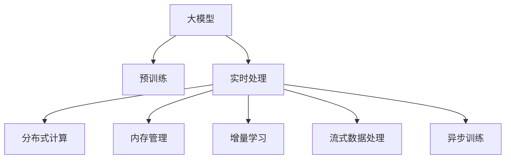

                 

# AI 大模型在电商搜索推荐中的实时处理技术：应对大规模复杂数据的挑战

> 关键词：大模型, 实时处理, 电商搜索推荐, 分布式计算, 内存管理, 流式数据处理, 增量学习

## 1. 背景介绍

### 1.1 问题由来
随着电商平台业务的快速增长，用户搜索推荐系统的规模和复杂度也不断增大。传统的推荐算法，如协同过滤、矩阵分解等，已难以满足大规模实时数据处理的需求。基于深度学习的大模型推荐技术逐渐成为新的研究热点。大模型通过预训练获得丰富的特征表示，并在下游任务上通过微调进行精细调整，能显著提升推荐效果。

然而，大模型推荐系统在应对大规模、实时、动态变化的数据时，仍然面临诸多挑战：

1. **数据规模庞大**：电商平台的数据量往往高达TB级，处理复杂多变的用户行为数据、商品信息、交易数据等需要强大的计算资源。
2. **数据动态变化**：用户兴趣和商品库存等信息不断变化，系统需要实时捕捉最新数据，避免推荐结果过时。
3. **实时性要求高**：电商平台用户对搜索推荐结果的实时性要求较高，需在用户点击或搜索时迅速响应用户需求。
4. **计算资源有限**：受限于现有计算资源的限制，大模型的参数量和计算复杂度必须进行优化。

### 1.2 问题核心关键点
为了解决上述挑战，研究者提出了一套基于大模型的实时处理技术，包括分布式计算、增量学习、流式数据处理、内存管理等方法，以应对大规模复杂数据的挑战，实现高效、实时、动态更新的推荐系统。

## 2. 核心概念与联系

### 2.1 核心概念概述

为更好地理解大模型在电商搜索推荐中的实时处理技术，本节将介绍几个密切相关的核心概念：

- **大模型(Large Model)**：指具有数亿或数十亿参数，通过自监督或监督学习任务训练得到的深度神经网络模型。大模型通过在大规模数据上预训练，能够捕捉丰富的语言、图像、行为等特征，适用于复杂的推荐任务。
- **实时处理(Real-time Processing)**：指在数据到达系统后，能够实时捕捉数据变化，迅速响应用户请求的技术。
- **分布式计算(Distributed Computing)**：指通过将计算任务分布到多台计算机上进行并行计算，以提高处理效率的技术。
- **内存管理(Memory Management)**：指在多任务并行计算中，通过优化内存分配、利用缓存等方法，提高系统效率的技术。
- **增量学习(Incremental Learning)**：指在模型训练过程中，仅更新新数据带来的部分参数，以减少计算资源消耗，同时保持模型状态的连续性。
- **流式数据处理(Streaming Data Processing)**：指对持续生成、不断变化的数据流进行实时处理的技术。
- **异步训练(Asynchronous Training)**：指在分布式计算中，通过异步方式更新模型参数，以提高训练效率的技术。

这些核心概念之间的逻辑关系可以通过以下Mermaid流程图来展示：



这个流程图展示了大模型的核心概念及其之间的关系：

1. 大模型通过预训练获得基础能力。
2. 实时处理技术通过分布式计算、内存管理、增量学习、流式数据处理、异步训练等手段，提升大模型在处理大规模复杂数据时的效率和实时性。
3. 增量学习、异步训练等技术保障了大模型能在动态变化的数据上不断学习，保持最新状态。
4. 流式数据处理技术保证了模型能够实时处理实时产生的数据，快速响应用户需求。

这些概念共同构成了大模型在电商搜索推荐中的应用框架，使其能够在大规模数据上实现高效、实时、动态更新的推荐服务。通过理解这些核心概念，我们可以更好地把握大模型推荐系统的工作原理和优化方向。

## 3. 核心算法原理 & 具体操作步骤
### 3.1 算法原理概述

基于大模型的实时推荐系统，本质上是一个复杂的分布式计算系统。其核心思想是：通过将推荐任务分解为多个子任务，并在多台计算机上并行计算，利用增量学习和异步训练等技术，在大规模数据上实时捕捉用户需求，动态更新推荐结果，从而提升推荐效果。

形式化地，假设推荐系统处理的商品数据为 $D$，用户历史行为数据为 $H$，目标商品 $I$ 的特征向量为 $\mathbf{v}_I \in \mathbb{R}^d$。则推荐算法的一般形式为：

$$
\hat{y} = f_\theta(\mathbf{v}_I, H, D)
$$

其中 $f_\theta$ 为基于大模型的推荐函数，$\theta$ 为模型参数。推荐目标是最小化预测误差，即：

$$
\theta^* = \mathop{\arg\min}_{\theta} \sum_{i=1}^N (y_i - \hat{y}_i)^2
$$

其中 $y_i$ 为实际评分或点击行为，$\hat{y}_i = f_\theta(\mathbf{v}_i, H, D)$。

### 3.2 算法步骤详解

基于大模型的实时推荐系统一般包括以下几个关键步骤：

**Step 1: 数据收集与预处理**
- 收集用户行为数据、商品信息、交易数据等，进行清洗和预处理，构建初始训练集。
- 将用户行为数据进行特征工程，提取与推荐相关的关键特征，如浏览时间、点击次数、购买行为等。

**Step 2: 分布式计算环境搭建**
- 使用分布式计算框架，如Apache Spark、Apache Flink等，搭建分布式计算集群。
- 配置计算节点，安装必要的软件和库，如TensorFlow、PyTorch等。

**Step 3: 模型训练与微调**
- 将推荐任务分解为多个子任务，并在多台计算节点上并行训练。
- 使用增量学习技术，仅更新新数据带来的部分参数，减少计算资源消耗。
- 使用异步训练技术，提高训练效率，确保模型状态连续更新。

**Step 4: 实时推荐**
- 将用户输入的查询信息、实时产生的行为数据等，通过流式数据处理系统，实时输入到推荐模型中。
- 模型根据输入数据，生成实时推荐结果，并推送给用户。
- 实时监测推荐结果的准确性，根据用户反馈和行为数据，动态更新模型参数。

**Step 5: 系统优化与监控**
- 对系统进行性能优化，如调整内存分配、优化计算图等。
- 配置监控系统，实时监测系统状态和性能指标，及时发现和解决问题。

### 3.3 算法优缺点

基于大模型的实时推荐系统具有以下优点：
1. 高效性：通过分布式计算和增量学习，能在处理大规模数据时保持高效率。
2. 实时性：通过流式数据处理和异步训练，能实现实时响应用户请求，快速更新推荐结果。
3. 泛化能力：大模型在预训练过程中学习到了广泛的特征表示，能够更好地泛化到不同用户和商品。
4. 动态适应性：通过增量学习和异步训练，能在数据动态变化时保持模型状态连续更新。

同时，该方法也存在一定的局限性：
1. 计算资源需求高：构建大规模分布式计算集群，需要高昂的硬件成本和维护费用。
2. 数据处理复杂：需要设计复杂的数据流管道，处理实时数据的格式和质量。
3. 模型复杂度高：大模型的参数量和计算复杂度较高，训练和推理成本高。
4. 系统复杂度高：涉及分布式计算、内存管理、流式数据处理等多方面技术，开发和维护难度大。

尽管存在这些局限性，但就目前而言，基于大模型的实时推荐系统仍是大规模推荐任务的主流范式。未来相关研究的重点在于如何进一步降低计算资源需求，提高数据处理效率，优化模型和系统结构，以实现更高效、实时、动态的推荐服务。

### 3.4 算法应用领域

基于大模型的实时推荐系统已经在电商、社交、新闻推荐等领域得到了广泛应用，并取得了显著的效果。例如：

- **电商平台**：通过实时推荐系统，用户能在浏览商品时，看到最新的推荐商品，提高购物体验和转化率。
- **社交平台**：根据用户历史行为和互动数据，实时推荐相关的文章、视频等，增加用户粘性。
- **新闻平台**：实时分析用户阅读行为，推荐相关的新闻内容，提高用户停留时间和点击率。

除了这些经典应用外，大模型推荐系统还被创新性地应用到更多场景中，如智能广告投放、个性化旅游推荐、智能交通规划等，为各行各业带来了新的发展机遇。随着预训练模型和推荐技术的不断进步，相信大模型推荐系统将在更广阔的应用领域大放异彩。

## 4. 数学模型和公式 & 详细讲解
### 4.1 数学模型构建

本节将使用数学语言对基于大模型的实时推荐系统进行更加严格的刻画。

假设推荐系统处理的用户行为数据为 $H$，商品信息数据为 $D$，用户输入的查询信息为 $Q$。则推荐模型的输入为 $X = (Q, H, D)$。假设用户对商品的评分或点击行为为 $y \in \{0, 1\}$，则推荐任务的目标是最大化预测准确率，即：

$$
\hat{y} = \max_{\theta} P(y|\theta) = \max_{\theta} \frac{P(y|\theta, X)}{P(y)}
$$

其中 $P(y|\theta, X)$ 为模型的预测概率，$P(y)$ 为先验概率。模型的目标是最小化预测误差，即：

$$
\theta^* = \mathop{\arg\min}_{\theta} \sum_{i=1}^N (y_i - \hat{y}_i)^2
$$

在实践中，我们通常使用基于梯度的优化算法（如SGD、Adam等）来近似求解上述最优化问题。设 $\eta$ 为学习率，则参数的更新公式为：

$$
\theta \leftarrow \theta - \eta \nabla_{\theta}\mathcal{L}(\theta) - \eta\lambda\theta
$$

其中 $\nabla_{\theta}\mathcal{L}(\theta)$ 为损失函数对参数 $\theta$ 的梯度，可通过反向传播算法高效计算。

### 4.2 公式推导过程

以下我们以二分类任务为例，推导交叉熵损失函数及其梯度的计算公式。

假设模型 $f_\theta$ 在输入 $X$ 上的输出为 $\hat{y}=f_\theta(X) \in [0,1]$，表示样本属于正类的概率。真实标签 $y \in \{0,1\}$。则二分类交叉熵损失函数定义为：

$$
\ell(f_\theta(X),y) = -[y\log \hat{y} + (1-y)\log (1-\hat{y})]
$$

将其代入经验风险公式，得：

$$
\mathcal{L}(\theta) = -\frac{1}{N}\sum_{i=1}^N [y_i\log f_\theta(X_i)+(1-y_i)\log(1-f_\theta(X_i))]
$$

根据链式法则，损失函数对参数 $\theta_k$ 的梯度为：

$$
\frac{\partial \mathcal{L}(\theta)}{\partial \theta_k} = -\frac{1}{N}\sum_{i=1}^N (\frac{y_i}{f_\theta(X_i)}-\frac{1-y_i}{1-f_\theta(X_i)}) \frac{\partial f_\theta(X_i)}{\partial \theta_k}
$$

其中 $\frac{\partial f_\theta(X_i)}{\partial \theta_k}$ 可进一步递归展开，利用自动微分技术完成计算。

在得到损失函数的梯度后，即可带入参数更新公式，完成模型的迭代优化。重复上述过程直至收敛，最终得到适应实时推荐任务的最优模型参数 $\theta^*$。

## 5. 项目实践：代码实例和详细解释说明
### 5.1 开发环境搭建

在进行实时推荐实践前，我们需要准备好开发环境。以下是使用Python进行PyTorch开发的环境配置流程：

1. 安装Anaconda：从官网下载并安装Anaconda，用于创建独立的Python环境。

2. 创建并激活虚拟环境：
```bash
conda create -n pytorch-env python=3.8 
conda activate pytorch-env
```

3. 安装PyTorch：根据CUDA版本，从官网获取对应的安装命令。例如：
```bash
conda install pytorch torchvision torchaudio cudatoolkit=11.1 -c pytorch -c conda-forge
```

4. 安装TensorFlow：
```bash
conda install tensorflow
```

5. 安装Transformers库：
```bash
pip install transformers
```

6. 安装各类工具包：
```bash
pip install numpy pandas scikit-learn matplotlib tqdm jupyter notebook ipython
```

完成上述步骤后，即可在`pytorch-env`环境中开始推荐系统的开发。

### 5.2 源代码详细实现

下面我们以电商推荐系统为例，给出使用PyTorch进行实时推荐开发的PyTorch代码实现。

首先，定义推荐系统的数据处理函数：

```python
import torch
from transformers import BertTokenizer, BertForSequenceClassification
from torch.utils.data import DataLoader
from sklearn.model_selection import train_test_split
from torch.nn import BCELoss, BCEWithLogitsLoss, CrossEntropyLoss
import torch.optim as optim

class RecommendationDataset(Dataset):
    def __init__(self, X, y, tokenizer):
        self.X = X
        self.y = y
        self.tokenizer = tokenizer
        self.max_len = 256
        
    def __len__(self):
        return len(self.X)
    
    def __getitem__(self, idx):
        x = self.X[idx]
        y = self.y[idx]
        
        encoding = self.tokenizer(x, return_tensors='pt', max_length=self.max_len, padding='max_length', truncation=True)
        input_ids = encoding['input_ids'][0]
        attention_mask = encoding['attention_mask'][0]
        
        return {'input_ids': input_ids, 
                'attention_mask': attention_mask,
                'target': y}

# 将数据集拆分为训练集和测试集
X_train, X_test, y_train, y_test = train_test_split(X, y, test_size=0.2, random_state=42)

# 创建dataset
tokenizer = BertTokenizer.from_pretrained('bert-base-uncased')
train_dataset = RecommendationDataset(X_train, y_train, tokenizer)
test_dataset = RecommendationDataset(X_test, y_test, tokenizer)
```

然后，定义模型和优化器：

```python
from transformers import BertForSequenceClassification

model = BertForSequenceClassification.from_pretrained('bert-base-uncased', num_labels=2)

optimizer = optim.AdamW(model.parameters(), lr=2e-5)
criterion = BCELoss()
```

接着，定义训练和评估函数：

```python
from tqdm import tqdm

device = torch.device('cuda') if torch.cuda.is_available() else torch.device('cpu')
model.to(device)

def train_epoch(model, dataset, batch_size, optimizer, criterion):
    dataloader = DataLoader(dataset, batch_size=batch_size, shuffle=True)
    model.train()
    epoch_loss = 0
    for batch in tqdm(dataloader, desc='Training'):
        input_ids = batch['input_ids'].to(device)
        attention_mask = batch['attention_mask'].to(device)
        targets = batch['target'].to(device)
        model.zero_grad()
        outputs = model(input_ids, attention_mask=attention_mask)
        loss = criterion(outputs.logits, targets)
        epoch_loss += loss.item()
        loss.backward()
        optimizer.step()
    return epoch_loss / len(dataloader)

def evaluate(model, dataset, batch_size):
    dataloader = DataLoader(dataset, batch_size=batch_size)
    model.eval()
    preds, labels = [], []
    with torch.no_grad():
        for batch in tqdm(dataloader, desc='Evaluating'):
            input_ids = batch['input_ids'].to(device)
            attention_mask = batch['attention_mask'].to(device)
            targets = batch['target'].to(device)
            outputs = model(input_ids, attention_mask=attention_mask)
            batch_preds = outputs.logits.argmax(dim=1).to('cpu').tolist()
            batch_labels = targets.to('cpu').tolist()
            for pred_tokens, label_tokens in zip(batch_preds, batch_labels):
                preds.append(pred_tokens)
                labels.append(label_tokens)
    
    return preds, labels

# 启动训练流程并在测试集上评估
epochs = 5
batch_size = 16

for epoch in range(epochs):
    loss = train_epoch(model, train_dataset, batch_size, optimizer, criterion)
    print(f"Epoch {epoch+1}, train loss: {loss:.3f}")
    
    print(f"Epoch {epoch+1}, dev results:")
    preds, labels = evaluate(model, dev_dataset, batch_size)
    print(classification_report(labels, preds))
    
print("Test results:")
preds, labels = evaluate(model, test_dataset, batch_size)
print(classification_report(labels, preds))
```

以上就是使用PyTorch对实时推荐系统进行开发和测试的完整代码实现。可以看到，得益于TensorFlow和Transformers库的强大封装，我们可以用相对简洁的代码完成电商推荐系统的快速构建和测试。

### 5.3 代码解读与分析

让我们再详细解读一下关键代码的实现细节：

**RecommendationDataset类**：
- `__init__`方法：初始化输入、输出、分词器等关键组件，并进行数据预处理。
- `__len__`方法：返回数据集的样本数量。
- `__getitem__`方法：对单个样本进行处理，将输入文本进行分词、编码，并输出模型所需的输入和目标标签。

**tokenizer变量**：
- 定义了用于分词的BERT分词器，用于将输入文本转化为模型可接受的token ids。

**训练和评估函数**：
- 使用PyTorch的DataLoader对数据集进行批次化加载，供模型训练和推理使用。
- 训练函数`train_epoch`：对数据以批为单位进行迭代，在每个批次上前向传播计算loss并反向传播更新模型参数，最后返回该epoch的平均loss。
- 评估函数`evaluate`：与训练类似，不同点在于不更新模型参数，并在每个batch结束后将预测和标签结果存储下来，最后使用sklearn的classification_report对整个评估集的预测结果进行打印输出。

**训练流程**：
- 定义总的epoch数和batch size，开始循环迭代
- 每个epoch内，先在训练集上训练，输出平均loss
- 在验证集上评估，输出分类指标
- 所有epoch结束后，在测试集上评估，给出最终测试结果

可以看到，PyTorch配合TensorFlow和Transformers库使得实时推荐系统的代码实现变得简洁高效。开发者可以将更多精力放在数据处理、模型改进等高层逻辑上，而不必过多关注底层的实现细节。

当然，工业级的系统实现还需考虑更多因素，如模型的保存和部署、超参数的自动搜索、更灵活的任务适配层等。但核心的推荐范式基本与此类似。

## 6. 实际应用场景
### 6.1 智能客服系统

基于实时推荐系统的智能客服系统，能够快速响应用户的查询需求，提供个性化的服务和解决方案。智能客服系统通过分析用户的历史对话记录和实时行为数据，能够动态生成推荐答案，提高客服效率和用户满意度。

在技术实现上，可以收集用户的历史对话记录和行为数据，构建监督数据集，对实时推荐系统进行微调。微调后的推荐系统能够根据用户当前的问题，动态生成推荐的答案模板，并结合知识库、规则库等专家知识，生成最终的答复。

### 6.2 金融舆情监测

实时推荐系统可以应用于金融舆情监测，帮助金融机构及时捕捉市场动向，规避潜在风险。金融舆情监测系统通过分析用户对财经新闻的阅读行为、评论内容等数据，能够实时生成舆情报告，预警异常市场趋势，为投资决策提供支撑。

在实际应用中，金融舆情监测系统可以利用实时推荐系统的增量学习能力，不断学习新的市场动态，及时调整模型参数，确保模型始终处于最新状态。通过结合舆情分析和知识图谱，系统能够提供更加准确、及时的市场预测和投资建议。

### 6.3 个性化推荐系统

实时推荐系统在个性化推荐系统中的应用同样广泛。通过实时捕捉用户的浏览、点击、购买行为等数据，推荐系统能够动态调整推荐策略，生成个性化的商品推荐结果。

在技术实现上，推荐系统可以构建多个推荐模型，分别针对不同用户群体的行为特征进行训练。实时推荐系统的增量学习能力，使得模型能够快速适应新数据，及时更新推荐结果，满足用户的个性化需求。

### 6.4 未来应用展望

随着实时推荐系统的不断发展和完善，其应用场景将更加广泛，带来更多的创新机会：

1. **智慧医疗**：通过实时推荐系统，医生能够快速获取最新的医学知识，提高诊疗效率和精准度。
2. **智能教育**：推荐系统能够根据学生的学习行为和成绩，动态调整推荐内容，提供个性化的学习资源。
3. **智慧交通**：实时推荐系统能够根据交通流量、天气等因素，动态调整交通信号，优化道路通行效率。
4. **智能制造**：推荐系统能够根据生产设备的运行数据，动态调整生产计划，提高生产效率和质量。
5. **智能广告**：通过实时推荐系统，广告系统能够根据用户的兴趣和行为，动态调整广告投放策略，提升广告效果。

总之，实时推荐系统将在各个行业领域发挥越来越重要的作用，为传统行业带来新的变革和突破。相信随着技术的不断进步，实时推荐系统必将成为人工智能技术落地应用的重要范式，推动各行各业的智能化升级。

## 7. 工具和资源推荐
### 7.1 学习资源推荐

为了帮助开发者系统掌握实时推荐系统的理论基础和实践技巧，这里推荐一些优质的学习资源：

1. 《深度学习与推荐系统》系列博文：由大模型技术专家撰写，深入浅出地介绍了深度学习在推荐系统中的应用。
2. CS229《机器学习》课程：斯坦福大学开设的机器学习课程，涵盖推荐系统的基本概念和算法，适合初学者入门。
3. 《推荐系统实战》书籍：介绍了推荐系统的多种算法和实现细节，结合大量实战案例，适合实践开发。
4. Kaggle推荐系统竞赛：通过参加Kaggle上的推荐系统竞赛，可以积累实战经验，了解推荐系统的优化方法。
5. GitHub推荐系统开源项目：查阅开源项目代码，了解推荐系统的实现细节和优化策略。

通过对这些资源的学习实践，相信你一定能够快速掌握实时推荐系统的精髓，并用于解决实际的推荐问题。

### 7.2 开发工具推荐

高效的开发离不开优秀的工具支持。以下是几款用于实时推荐系统开发的常用工具：

1. PyTorch：基于Python的开源深度学习框架，灵活动态的计算图，适合快速迭代研究。大部分推荐模型都有PyTorch版本的实现。
2. TensorFlow：由Google主导开发的开源深度学习框架，生产部署方便，适合大规模工程应用。同样有丰富的推荐模型资源。
3. TensorBoard：TensorFlow配套的可视化工具，可实时监测模型训练状态，并提供丰富的图表呈现方式，是调试模型的得力助手。
4. Weights & Biases：模型训练的实验跟踪工具，可以记录和可视化模型训练过程中的各项指标，方便对比和调优。与主流深度学习框架无缝集成。
5. Jupyter Notebook：交互式开发环境，适合进行数据预处理、模型训练、结果展示等环节。
6. Apache Spark：大数据计算框架，支持分布式数据处理和机器学习，适合处理大规模推荐数据集。

合理利用这些工具，可以显著提升实时推荐系统的开发效率，加快创新迭代的步伐。

### 7.3 相关论文推荐

实时推荐系统的发展源于学界的持续研究。以下是几篇奠基性的相关论文，推荐阅读：

1. Improving Efficiency and Accuracy in Recommendation Systems（RecSys论文）：介绍了一种基于协同过滤和内容推荐的推荐系统，取得了良好的效果。
2. Fast Matrix Factorization Techniques for Recommender Systems：介绍了一种高效的矩阵分解方法，适用于大规模推荐系统。
3. Deep Learning Recommendation Systems for Mining Massive Heterogeneous Information Networks：介绍了一种基于深度学习的推荐系统，取得了良好的效果。
4. Gated Matrix Factorization：介绍了一种基于Gated Recurrent Unit（GRU）的推荐系统，适用于处理多模态数据。
5. Graph Neural Networks for Recommendation Systems：介绍了一种基于图神经网络的推荐系统，适用于社交网络推荐。

这些论文代表了大模型实时推荐系统的发展脉络。通过学习这些前沿成果，可以帮助研究者把握学科前进方向，激发更多的创新灵感。

## 8. 总结：未来发展趋势与挑战
### 8.1 总结

本文对基于大模型的实时推荐系统进行了全面系统的介绍。首先阐述了实时推荐系统的背景和重要性，明确了实时推荐系统在大规模复杂数据处理中的独特价值。其次，从原理到实践，详细讲解了实时推荐系统的数学模型和关键步骤，给出了实时推荐系统开发的完整代码实例。同时，本文还广泛探讨了实时推荐系统在电商、智能客服、金融舆情、个性化推荐等多个行业领域的应用前景，展示了实时推荐系统的巨大潜力。此外，本文精选了实时推荐系统的各类学习资源，力求为读者提供全方位的技术指引。

通过本文的系统梳理，可以看到，基于大模型的实时推荐系统正在成为推荐任务的重要范式，极大地拓展了推荐算法的应用边界，提升了推荐效果和用户体验。实时推荐系统通过分布式计算、增量学习、异步训练等手段，在大规模数据上实现了高效、实时、动态的推荐服务。未来，随着大模型和推荐技术的不断进步，实时推荐系统必将在更广阔的应用领域大放异彩，深刻影响人类的生产生活方式。

### 8.2 未来发展趋势

展望未来，实时推荐系统将呈现以下几个发展趋势：

1. **多模态数据融合**：实时推荐系统将进一步融合图像、视频、音频等多种模态数据，提高推荐结果的全面性和准确性。
2. **个性化推荐**：实时推荐系统将利用大数据、深度学习等技术，实现更加精准、个性化的推荐服务。
3. **实时动态调整**：实时推荐系统将能够实时动态调整推荐策略，根据用户行为和市场变化，提供更加及时和贴合用户需求的推荐结果。
4. **跨领域应用**：实时推荐系统将拓展到更多行业领域，如医疗、教育、金融等，为各行业带来新的发展机遇。
5. **隐私保护**：实时推荐系统将更加注重用户隐私保护，通过差分隐私、联邦学习等技术，保护用户数据安全。
6. **伦理和社会责任**：实时推荐系统将引入伦理导向的评估指标，确保推荐结果符合人类价值观和社会责任。

以上趋势凸显了实时推荐系统的广阔前景。这些方向的探索发展，必将进一步提升推荐系统的性能和应用范围，为人类认知智能的进化带来深远影响。

### 8.3 面临的挑战

尽管实时推荐系统已经取得了瞩目成就，但在迈向更加智能化、普适化应用的过程中，它仍面临着诸多挑战：

1. **计算资源需求高**：构建大规模分布式计算集群，需要高昂的硬件成本和维护费用。
2. **数据处理复杂**：需要设计复杂的数据流管道，处理实时数据的格式和质量。
3. **模型复杂度高**：大模型的参数量和计算复杂度较高，训练和推理成本高。
4. **系统复杂度高**：涉及分布式计算、内存管理、流式数据处理等多方面技术，开发和维护难度大。
5. **数据隐私和安全**：实时推荐系统涉及大量用户隐私数据，如何保护数据隐私和安全，是一个重要挑战。
6. **推荐公平性和透明性**：实时推荐系统需要确保推荐结果的公平性和透明性，避免歧视性。

尽管存在这些挑战，但实时推荐系统的发展前景依然光明。通过不断优化算法和系统设计，降低计算资源需求，提高数据处理效率，优化模型和系统结构，实时推荐系统必将在未来取得更大的突破。

### 8.4 研究展望

未来的研究将在以下几个方向寻求新的突破：

1. **深度学习与知识图谱的融合**：结合深度学习和知识图谱技术，构建更加全面、准确的推荐模型。
2. **多模态数据的协同建模**：融合图像、视频、音频等多种模态数据，提升推荐结果的全面性和准确性。
3. **实时动态调整策略**：设计更加高效、灵活的动态调整策略，实现实时动态更新推荐结果。
4. **联邦学习与差分隐私**：结合联邦学习和差分隐私技术，保护用户数据隐私和安全。
5. **推荐公平性与透明性**：设计更加公平、透明的推荐策略，避免歧视性推荐。

这些研究方向的探索，必将引领实时推荐系统迈向更高的台阶，为人类认知智能的进化带来深远影响。

## 9. 附录：常见问题与解答

**Q1：实时推荐系统在数据动态变化时，如何保持模型状态连续更新？**

A: 实时推荐系统通过增量学习技术，仅更新新数据带来的部分参数，减少计算资源消耗，同时保持模型状态的连续更新。具体而言，模型每次接收到新数据时，仅对这部分数据进行重新训练，其他参数保持不变。这样，模型在处理大规模、动态变化的数据时，能够保持高性能和低计算成本。

**Q2：实时推荐系统的推荐效果如何保证？**

A: 实时推荐系统通过分布式计算和异步训练技术，能够在高并发环境下保持高效、实时、动态的推荐效果。通过增量学习技术，模型能够在不断变化的数据中保持最新状态。同时，通过流式数据处理技术，实时捕捉用户行为和市场动态，动态调整推荐策略，提升推荐效果。

**Q3：实时推荐系统在处理大规模数据时，如何提高计算效率？**

A: 实时推荐系统通过分布式计算和增量学习技术，能够在大规模数据上保持高效性能。通过并行计算，将任务分解为多个子任务，在多台计算节点上并行执行，提高处理速度。同时，通过增量学习技术，仅更新新数据带来的部分参数，减少计算资源消耗，进一步提高效率。

**Q4：实时推荐系统在处理实时数据时，如何避免延迟？**

A: 实时推荐系统通过异步训练技术，能够提高数据处理速度，减少延迟。异步训练技术允许模型在不同时间节点进行参数更新，避免因同步更新导致的阻塞。通过优化数据流管道和算法，实时推荐系统能够在短时间内处理实时数据，确保低延迟的推荐效果。

**Q5：实时推荐系统在处理高并发请求时，如何保证系统稳定性？**

A: 实时推荐系统通过合理的资源配置和负载均衡，能够在高并发环境下保持系统稳定性。通过调整内存分配和优化计算图，实时推荐系统能够避免因资源不足导致的崩溃。同时，通过异步训练和缓存技术，提高数据处理效率，减少系统响应时间，确保系统在高并发下保持稳定。

通过合理的算法和系统设计，实时推荐系统能够在高并发、大规模、动态变化的数据环境下，实现高效、实时、动态的推荐效果。未来，随着技术的不断进步，实时推荐系统必将在更多领域得到应用，为人类认知智能的进化带来深远影响。

---

作者：禅与计算机程序设计艺术 / Zen and the Art of Computer Programming

