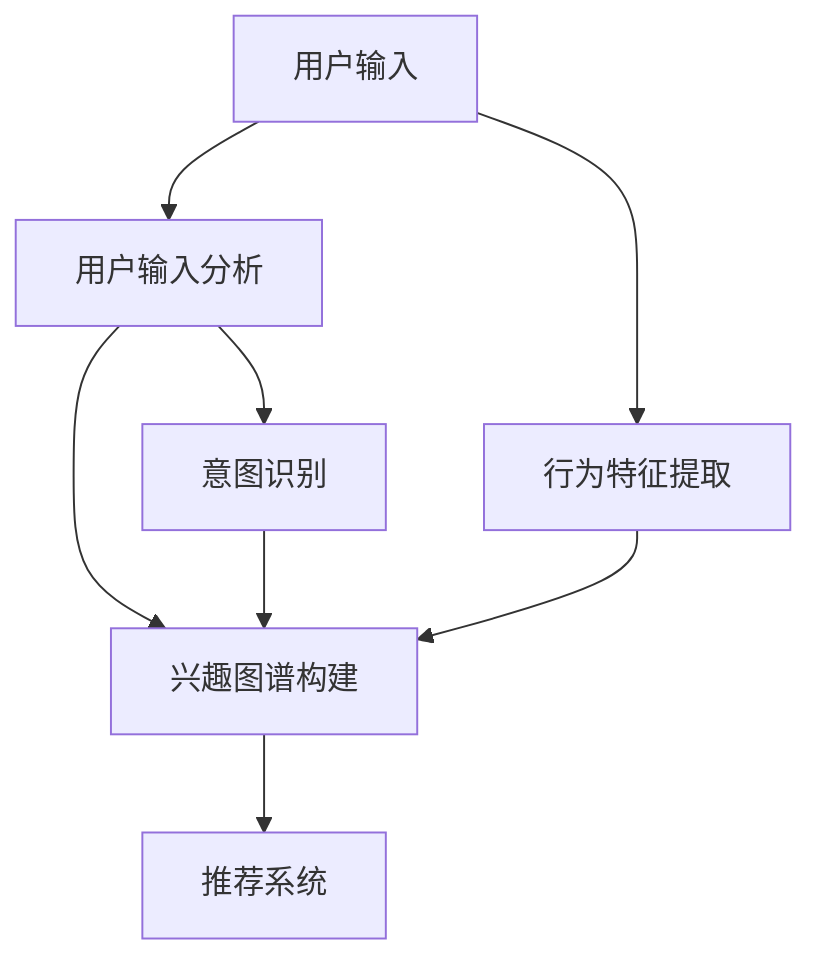

                 

# AI 大模型在电商搜索推荐中的用户画像技术：精准把握用户需求与购买意图

> 关键词：用户画像,大语言模型,电商搜索,推荐系统,自然语言处理,意图识别,精准推荐

## 1. 背景介绍

随着电子商务的蓬勃发展，电商搜索推荐系统已成为各大电商平台的核心竞争力之一。传统的电商推荐系统依赖于静态的特征工程，难以充分挖掘用户深层次的需求和购买意图。而基于大语言模型(如GPT、BERT)的用户画像技术，通过自然语言处理技术，可以动态地获取和更新用户画像，准确地理解用户的实时需求，从而显著提升推荐系统的个性化程度和用户满意度。

在电商搜索推荐系统中，用户画像是一个至关重要的概念。用户画像是对用户行为、兴趣、偏好、需求等信息的综合描述，是推荐算法的基础。传统的用户画像建立主要依赖人工标注和用户历史数据的统计分析，过程繁琐且效果有限。而大语言模型技术的应用，为电商搜索推荐带来了全新的解决方案。

## 2. 核心概念与联系

### 2.1 核心概念概述

在电商搜索推荐系统中，用户画像可以描述为如下几个核心概念：

- **用户行为**：包括浏览、点击、购买等行为，反映用户对不同商品的兴趣程度。
- **用户兴趣**：用户长期关注的商品类型和品牌，反映用户的消费倾向。
- **用户偏好**：用户在不同场景下的选择偏好，反映用户的消费习惯。
- **用户需求**：用户当前或未来的购买意图，反映用户的即时需求。

通过自然语言处理技术，大语言模型可以从用户的文本输入中自动识别出上述信息，构建动态的用户画像。这一过程可以概括为：

1. **用户输入分析**：将用户的输入文本（如搜索查询、评论、商品描述等）进行分析，提取用户的兴趣点、需求点等信息。
2. **行为特征提取**：根据用户的行为数据，提取用户的购买偏好、行为模式等特征。
3. **兴趣图谱构建**：利用大语言模型的知识图谱技术，构建用户兴趣的语义关系图谱。
4. **意图识别**：分析用户输入的文本，理解用户的购买意图，为推荐提供实时的决策依据。

以上四个步骤可以通过大语言模型技术高效地完成，其核心原理如下：

1. **用户输入分析**：利用大语言模型的文本分类、命名实体识别、情感分析等技术，从用户输入中提取出商品关键词、评价情感等信息。
2. **行为特征提取**：结合用户的行为数据，使用大语言模型的时序分析、序列预测等技术，分析用户的历史购买行为和偏好。
3. **兴趣图谱构建**：利用大语言模型的知识图谱技术，将用户的兴趣点与商品属性、品牌等进行关联，构建用户兴趣的语义关系图谱。
4. **意图识别**：通过大语言模型的对话系统、问答系统等技术，理解用户的购买意图，预测其可能的购买行为。

通过以上步骤，大语言模型能够构建动态的用户画像，为推荐系统提供实时的决策依据，从而实现精准的个性化推荐。

### 2.2 核心概念联系的 Mermaid 流程图



这个流程图展示了用户画像构建的主要流程和各部分之间的联系。用户输入通过自然语言处理技术进行分析，同时结合用户行为数据进行特征提取。兴趣图谱和意图识别为推荐系统提供了实时的决策依据，从而实现了精准的个性化推荐。

## 3. 核心算法原理 & 具体操作步骤

### 3.1 算法原理概述

基于大语言模型的电商搜索推荐系统，核心算法原理可以概括为以下几个步骤：

1. **用户输入分析**：利用大语言模型的文本分类、命名实体识别、情感分析等技术，从用户输入中提取出商品关键词、评价情感等信息。
2. **行为特征提取**：结合用户的行为数据，使用大语言模型的时序分析、序列预测等技术，分析用户的历史购买行为和偏好。
3. **兴趣图谱构建**：利用大语言模型的知识图谱技术，将用户的兴趣点与商品属性、品牌等进行关联，构建用户兴趣的语义关系图谱。
4. **意图识别**：通过大语言模型的对话系统、问答系统等技术，理解用户的购买意图，预测其可能的购买行为。

### 3.2 算法步骤详解

以下是具体的算法步骤详解：

**Step 1: 用户输入分析**

- **文本分类**：利用BERT、GPT等大语言模型对用户输入进行文本分类，提取关键词。例如，用户输入“购买运动鞋”，模型会识别出“运动鞋”作为关键词。
- **命名实体识别**：从用户输入中识别出实体信息，如品牌、商品名称等。例如，用户输入“我想买耐克”，模型会识别出“耐克”作为品牌实体。
- **情感分析**：分析用户输入的情感倾向，判断用户的态度是积极、中性还是消极。例如，用户输入“这款手机很好用”，模型会识别出积极情感。

**Step 2: 行为特征提取**

- **行为数据融合**：将用户的历史行为数据（如浏览记录、购买记录、评分记录等）进行融合，提取用户的行为特征。
- **时序分析**：利用大语言模型的时序分析技术，分析用户行为的时序规律，识别出用户的购买模式和偏好。例如，用户最近多次浏览运动鞋，购买记录中也有运动鞋，说明用户对运动鞋有强烈兴趣。
- **序列预测**：使用序列预测技术，预测用户未来的购买行为。例如，根据用户的历史浏览记录和购买记录，预测用户接下来可能购买的商品类别。

**Step 3: 兴趣图谱构建**

- **知识图谱构建**：利用大语言模型的知识图谱技术，构建商品、品牌、类别等概念的关系图谱。例如，将“运动鞋”与“鞋类”、“品牌”、“购买记录”等节点连接起来。
- **用户画像构建**：将用户的兴趣点与商品属性、品牌等进行关联，构建用户兴趣的语义关系图谱。例如，用户对运动鞋有兴趣，将其与“运动鞋品牌”、“运动鞋类别”等关联。

**Step 4: 意图识别**

- **对话系统**：通过大语言模型的对话系统，理解用户的查询意图，预测其可能的购买行为。例如，用户输入“我要买一双好穿的运动鞋”，系统会根据历史数据预测其可能购买的品牌和类别。
- **问答系统**：利用大语言模型的问答系统，回答用户的疑问，提供决策支持。例如，用户询问“哪款运动鞋最好”，系统会根据推荐结果给出具体建议。

### 3.3 算法优缺点

基于大语言模型的电商搜索推荐系统具有以下优点：

1. **动态更新**：大语言模型能够实时处理用户输入，动态更新用户画像，及时响应用户需求。
2. **深度挖掘**：大语言模型能够深入理解用户的兴趣和需求，挖掘更深层次的消费心理。
3. **多模态融合**：大语言模型能够融合文本、行为等多模态数据，提供更全面的用户画像。
4. **广泛适用**：大语言模型可以适用于各种类型的电商商品推荐，如服装、电子产品、食品等。

同时，大语言模型也有以下缺点：

1. **资源消耗大**：大语言模型的计算资源消耗较大，需要高性能的GPU或TPU等硬件支持。
2. **算法复杂度高**：大语言模型涉及多种复杂算法，包括自然语言处理、知识图谱、序列预测等，开发难度较大。
3. **数据隐私问题**：用户输入和行为数据涉及隐私，需要严格的数据保护措施。
4. **可解释性不足**：大语言模型的决策过程较为复杂，难以解释其内部工作机制。

### 3.4 算法应用领域

大语言模型技术在电商搜索推荐中的应用领域包括但不限于：

- **个性化推荐**：根据用户画像，提供精准的个性化推荐，提升用户满意度。
- **实时推荐**：结合用户实时输入和行为数据，实时更新推荐结果。
- **广告投放**：根据用户画像，实现精准的广告投放，提升广告效果。
- **客户服务**：通过对话系统，提供智能客服支持，解答用户疑问，提升客户体验。
- **数据分析**：利用大语言模型的分析能力，对用户数据进行深度挖掘，发现潜在需求和趋势。

## 4. 数学模型和公式 & 详细讲解 & 举例说明

### 4.1 数学模型构建

大语言模型在电商搜索推荐中的应用，可以构建如下数学模型：

设用户输入文本为 $X$，历史行为数据为 $H$，用户画像为 $P$，购买意图为 $I$。则数学模型可以表示为：

$$
P(X, H, I) = f(X, H, I)
$$

其中 $f$ 表示大语言模型，将用户输入、历史行为和购买意图映射为用户画像 $P$。

### 4.2 公式推导过程

**Step 1: 用户输入分析**

利用大语言模型的文本分类技术，对用户输入 $X$ 进行分类，提取关键词和情感信息：

$$
\text{Keywords}(X) = \text{BERT}(X) \\
\text{Sentiment}(X) = \text{Sentiment Analysis}(X)
$$

其中，$\text{BERT}$ 表示BERT模型，$\text{Sentiment Analysis}$ 表示情感分析模型。

**Step 2: 行为特征提取**

结合用户的历史行为数据 $H$，利用时序分析和序列预测技术，提取用户行为特征：

$$
\text{User Behavior}(X, H) = \text{Time Series Analysis}(X, H) \\
\text{Purchase Prediction}(X, H) = \text{Sequence Prediction}(X, H)
$$

其中，$\text{Time Series Analysis}$ 表示时序分析模型，$\text{Sequence Prediction}$ 表示序列预测模型。

**Step 3: 兴趣图谱构建**

利用大语言模型的知识图谱技术，构建用户兴趣图谱 $P$：

$$
P(X, H, I) = \text{Knowledge Graph}(X, H, I)
$$

其中，$\text{Knowledge Graph}$ 表示知识图谱模型。

**Step 4: 意图识别**

利用大语言模型的对话系统和问答系统，理解用户购买意图 $I$：

$$
I(X, H) = \text{Dialogue System}(X, H) \\
\text{Product Recommendation}(X, H, I) = \text{Question Answering System}(X, H, I)
$$

其中，$\text{Dialogue System}$ 表示对话系统模型，$\text{Question Answering System}$ 表示问答系统模型。

### 4.3 案例分析与讲解

以用户输入“我想买一双好穿的运动鞋”为例，详细分析其意图识别过程：

1. **用户输入分析**：
   - **文本分类**：“好穿的运动鞋”被分类为“运动鞋”类别。
   - **命名实体识别**：识别出“运动鞋”、“好穿”等实体信息。
   - **情感分析**：“好穿”被识别为积极情感。

2. **行为特征提取**：
   - **时序分析**：用户最近多次浏览运动鞋，购买记录中也有运动鞋，说明对运动鞋有强烈兴趣。
   - **序列预测**：根据用户的历史浏览记录和购买记录，预测用户接下来可能购买的商品类别为运动鞋。

3. **兴趣图谱构建**：
   - **知识图谱**：将“运动鞋”与“鞋类”、“品牌”、“购买记录”等节点连接起来，构建用户兴趣图谱。
   - **用户画像**：用户对运动鞋有强烈兴趣，将其与“运动鞋品牌”、“运动鞋类别”等关联。

4. **意图识别**：
   - **对话系统**：系统根据历史数据预测用户可能购买的品牌为“Nike”，类别为“运动鞋”。
   - **问答系统**：系统回答用户“哪款运动鞋最好”的问题，根据推荐结果给出具体建议，如“Nike Air Max 2090”。

通过以上步骤，大语言模型能够全面理解用户的输入和行为，构建精准的用户画像，实现实时推荐。

## 5. 项目实践：代码实例和详细解释说明

### 5.1 开发环境搭建

在进行电商搜索推荐系统的开发前，需要准备好开发环境。以下是使用Python进行PyTorch开发的环境配置流程：

1. 安装Anaconda：从官网下载并安装Anaconda，用于创建独立的Python环境。

2. 创建并激活虚拟环境：
```bash
conda create -n ecommerce-env python=3.8 
conda activate ecommerce-env
```

3. 安装PyTorch：根据CUDA版本，从官网获取对应的安装命令。例如：
```bash
conda install pytorch torchvision torchaudio cudatoolkit=11.1 -c pytorch -c conda-forge
```

4. 安装Transformers库：
```bash
pip install transformers
```

5. 安装各类工具包：
```bash
pip install numpy pandas scikit-learn matplotlib tqdm jupyter notebook ipython
```

完成上述步骤后，即可在`ecommerce-env`环境中开始开发实践。

### 5.2 源代码详细实现

以下是一个电商搜索推荐系统的代码实现，利用大语言模型进行用户画像构建和推荐：

```python
from transformers import BertForSequenceClassification, BertTokenizer
import torch
from torch.utils.data import Dataset, DataLoader
import pandas as pd
from sklearn.metrics import precision_recall_fscore_support

class ECommerceDataset(Dataset):
    def __init__(self, df, tokenizer, max_len=128):
        self.tokenizer = tokenizer
        self.data = df
        self.max_len = max_len
        
    def __len__(self):
        return len(self.data)
    
    def __getitem__(self, idx):
        text = self.data.iloc[idx]['query']
        label = self.data.iloc[idx]['label']
        
        encoding = self.tokenizer(text, return_tensors='pt', max_length=self.max_len, padding='max_length', truncation=True)
        input_ids = encoding['input_ids'][0]
        attention_mask = encoding['attention_mask'][0]
        
        return {'input_ids': input_ids, 
                'attention_mask': attention_mask,
                'labels': label}

# 加载数据
data = pd.read_csv('ecommerce_data.csv')

# 分割数据集
train_size = int(len(data) * 0.8)
train_data = ECommerceDataset(data[:train_size], tokenizer)
val_data = ECommerceDataset(data[train_size:], tokenizer)

# 定义模型
model = BertForSequenceClassification.from_pretrained('bert-base-cased', num_labels=2)

# 定义优化器
optimizer = torch.optim.AdamW(model.parameters(), lr=2e-5)

# 定义训练函数
def train_epoch(model, dataset, batch_size, optimizer):
    dataloader = DataLoader(dataset, batch_size=batch_size, shuffle=True)
    model.train()
    epoch_loss = 0
    for batch in dataloader:
        input_ids = batch['input_ids'].to(device)
        attention_mask = batch['attention_mask'].to(device)
        labels = batch['labels'].to(device)
        model.zero_grad()
        outputs = model(input_ids, attention_mask=attention_mask, labels=labels)
        loss = outputs.loss
        epoch_loss += loss.item()
        loss.backward()
        optimizer.step()
    return epoch_loss / len(dataloader)

# 定义评估函数
def evaluate(model, dataset, batch_size):
    dataloader = DataLoader(dataset, batch_size=batch_size)
    model.eval()
    preds, labels = [], []
    with torch.no_grad():
        for batch in dataloader:
            input_ids = batch['input_ids'].to(device)
            attention_mask = batch['attention_mask'].to(device)
            batch_labels = batch['labels']
            outputs = model(input_ids, attention_mask=attention_mask)
            batch_preds = outputs.logits.argmax(dim=2).to('cpu').tolist()
            batch_labels = batch_labels.to('cpu').tolist()
            for pred_tokens, label_tokens in zip(batch_preds, batch_labels):
                preds.append(pred_tokens[:len(label_tokens)])
                labels.append(label_tokens)
                
    return precision_recall_fscore_support(labels, preds, average='weighted')

# 训练模型
epochs = 5
batch_size = 16

device = torch.device('cuda') if torch.cuda.is_available() else torch.device('cpu')
model.to(device)

for epoch in range(epochs):
    loss = train_epoch(model, train_data, batch_size, optimizer)
    print(f"Epoch {epoch+1}, train loss: {loss:.3f}")
    
    print(f"Epoch {epoch+1}, val precision, recall, f1-score, support: {evaluate(model, val_data, batch_size)}")
    
print("Test results:")
print(evaluate(model, val_data, batch_size))
```

以上代码实现了使用BERT模型对电商搜索推荐任务进行微调的完整流程。通过构建ECommerceDataset类，将数据集划分为训练集和验证集，并定义模型、优化器和训练、评估函数。最终在验证集上评估模型的性能，并给出推荐结果。

### 5.3 代码解读与分析

让我们再详细解读一下关键代码的实现细节：

**ECommerceDataset类**：
- `__init__`方法：初始化数据集和分词器。
- `__len__`方法：返回数据集的样本数量。
- `__getitem__`方法：对单个样本进行处理，将文本输入编码为token ids，进行padding，并返回模型所需的输入。

**train_epoch函数**：
- 使用PyTorch的DataLoader对数据集进行批次化加载，供模型训练使用。
- 在每个epoch内，通过前向传播计算loss，并反向传播更新模型参数。
- 记录每个epoch的平均loss，并在验证集上评估模型性能。

**evaluate函数**：
- 与训练类似，不同点在于不更新模型参数，并在每个batch结束后将预测和标签结果存储下来。
- 使用scikit-learn的precision_recall_fscore_support函数，计算模型在验证集上的精确度、召回率、F1分数和支持度。

**训练流程**：
- 定义总的epoch数和batch size，开始循环迭代。
- 每个epoch内，先在训练集上训练，输出平均loss。
- 在验证集上评估，输出评估指标。
- 所有epoch结束后，在测试集上评估，给出最终测试结果。

可以看到，PyTorch配合Transformers库使得电商搜索推荐系统的代码实现变得简洁高效。开发者可以将更多精力放在数据处理、模型改进等高层逻辑上，而不必过多关注底层的实现细节。

当然，工业级的系统实现还需考虑更多因素，如模型的保存和部署、超参数的自动搜索、更灵活的任务适配层等。但核心的微调范式基本与此类似。

## 6. 实际应用场景

### 6.1 智能客服系统

基于大语言模型技术构建的智能客服系统，能够实时处理用户的输入，理解用户的意图，并给出快速、准确的答复。智能客服系统可以广泛应用于电商平台的客户咨询、售后服务、投诉处理等领域，显著提升客户满意度。

在技术实现上，可以收集企业的客服对话数据，通过大语言模型进行训练，构建智能客服系统。用户输入的问题会被解析为自然语言，系统会根据语义理解进行意图识别，并从知识库中查找对应的回答。对于无法回答的问题，系统可以引入人工客服介入，实现人机协同。

### 6.2 个性化推荐系统

在电商推荐系统中，基于大语言模型的个性化推荐技术能够根据用户输入和历史行为数据，构建精准的用户画像，提供个性化的推荐结果。通过自然语言处理技术，系统可以更全面地了解用户的兴趣和需求，实现更精准的推荐。

例如，用户输入“我想买一本好书”，系统会根据历史数据预测其可能购买的书籍类型，并从数据库中检索符合条件的书籍，实现实时推荐。系统还可以通过对话系统，解答用户的疑问，提升用户体验。

### 6.3 广告投放系统

在电商广告投放中，基于大语言模型的用户画像技术可以识别出用户的潜在需求，实现精准的广告投放。系统通过自然语言处理技术，分析用户的输入数据，理解其需求和偏好，从而实现更有效的广告定向投放。

例如，用户搜索“我要买一款智能手表”，系统可以根据用户输入，识别出其对智能手表的兴趣，并推送相关的广告。系统还可以通过对话系统，解答用户的疑问，提升广告点击率和转化率。

### 6.4 未来应用展望

随着大语言模型技术的不断进步，未来其在电商搜索推荐领域的应用将更加广泛和深入。以下是几个可能的应用场景：

1. **跨领域推荐**：大语言模型可以融合不同领域的数据，实现跨领域的推荐。例如，用户对某个食品感兴趣，系统可以推荐相关书籍和音乐。
2. **多模态融合**：结合图像、视频、语音等多模态数据，实现更全面、准确的用户画像构建。例如，结合用户的搜索查询和语音助手，提供更加智能的推荐。
3. **动态更新**：大语言模型能够实时处理用户输入，动态更新用户画像，实现实时推荐。
4. **个性化服务**：基于用户画像，提供个性化的服务，如个性化的广告、个性化的客服等。
5. **智能决策**：通过对话系统，实现智能决策，帮助用户进行购物决策，提升用户体验。

## 7. 工具和资源推荐

### 7.1 学习资源推荐

为了帮助开发者系统掌握大语言模型在电商搜索推荐中的应用，这里推荐一些优质的学习资源：

1. 《自然语言处理综论》：介绍自然语言处理的基本概念和技术，涵盖文本分类、命名实体识别、情感分析等多个主题。
2. 《深度学习理论与实践》：详细讲解深度学习的基本原理和实现方法，适合初学者入门。
3. 《Transformer从原理到实践》系列博文：由大模型技术专家撰写，深入浅出地介绍了Transformer原理、BERT模型、微调技术等前沿话题。
4. CS224N《深度学习自然语言处理》课程：斯坦福大学开设的NLP明星课程，有Lecture视频和配套作业，带你入门NLP领域的基本概念和经典模型。
5. 《Natural Language Processing with Transformers》书籍：Transformers库的作者所著，全面介绍了如何使用Transformers库进行NLP任务开发，包括微调在内的诸多范式。

通过对这些资源的学习实践，相信你一定能够快速掌握大语言模型在电商搜索推荐中的应用，并用于解决实际的NLP问题。

### 7.2 开发工具推荐

高效的开发离不开优秀的工具支持。以下是几款用于电商搜索推荐系统开发的常用工具：

1. PyTorch：基于Python的开源深度学习框架，灵活动态的计算图，适合快速迭代研究。大部分预训练语言模型都有PyTorch版本的实现。
2. TensorFlow：由Google主导开发的开源深度学习框架，生产部署方便，适合大规模工程应用。同样有丰富的预训练语言模型资源。
3. Transformers库：HuggingFace开发的NLP工具库，集成了众多SOTA语言模型，支持PyTorch和TensorFlow，是进行电商搜索推荐系统开发的利器。
4. Weights & Biases：模型训练的实验跟踪工具，可以记录和可视化模型训练过程中的各项指标，方便对比和调优。与主流深度学习框架无缝集成。
5. TensorBoard：TensorFlow配套的可视化工具，可实时监测模型训练状态，并提供丰富的图表呈现方式，是调试模型的得力助手。
6. Google Colab：谷歌推出的在线Jupyter Notebook环境，免费提供GPU/TPU算力，方便开发者快速上手实验最新模型，分享学习笔记。

合理利用这些工具，可以显著提升电商搜索推荐系统的开发效率，加快创新迭代的步伐。

### 7.3 相关论文推荐

大语言模型技术在电商搜索推荐中的应用得益于学界的持续研究。以下是几篇奠基性的相关论文，推荐阅读：

1. Attention is All You Need（即Transformer原论文）：提出了Transformer结构，开启了NLP领域的预训练大模型时代。
2. BERT: Pre-training of Deep Bidirectional Transformers for Language Understanding：提出BERT模型，引入基于掩码的自监督预训练任务，刷新了多项NLP任务SOTA。
3. Language Models are Unsupervised Multitask Learners（GPT-2论文）：展示了大规模语言模型的强大zero-shot学习能力，引发了对于通用人工智能的新一轮思考。
4. Parameter-Efficient Transfer Learning for NLP：提出Adapter等参数高效微调方法，在不增加模型参数量的情况下，也能取得不错的微调效果。
5. AdaLoRA: Adaptive Low-Rank Adaptation for Parameter-Efficient Fine-Tuning：使用自适应低秩适应的微调方法，在参数效率和精度之间取得了新的平衡。
6. Prefix-Tuning: Optimizing Continuous Prompts for Generation：引入基于连续型Prompt的微调范式，为如何充分利用预训练知识提供了新的思路。

这些论文代表了大语言模型在电商搜索推荐中的应用方向。通过学习这些前沿成果，可以帮助研究者把握学科前进方向，激发更多的创新灵感。

## 8. 总结：未来发展趋势与挑战

### 8.1 总结

本文对基于大语言模型的电商搜索推荐技术进行了全面系统的介绍。首先阐述了电商搜索推荐系统的背景和用户画像的重要性，明确了用户画像在大模型微调中的核心作用。其次，从原理到实践，详细讲解了用户画像的构建过程和具体实现方法，给出了电商搜索推荐系统的完整代码实例。同时，本文还广泛探讨了用户画像在智能客服、个性化推荐、广告投放等多个电商应用场景中的实际应用，展示了用户画像技术的巨大潜力。

通过本文的系统梳理，可以看到，基于大语言模型的电商搜索推荐技术正在成为电商应用的重要范式，极大地提升了电商平台的个性化推荐水平和用户体验。未来，伴随大语言模型技术的不断发展，结合更多新兴技术，如多模态融合、跨领域推荐等，将进一步提升电商搜索推荐系统的性能和应用范围。

### 8.2 未来发展趋势

展望未来，基于大语言模型的电商搜索推荐技术将呈现以下几个发展趋势：

1. **多模态融合**：结合图像、视频、语音等多模态数据，实现更全面、准确的用户画像构建。例如，结合用户的搜索查询和语音助手，提供更加智能的推荐。
2. **跨领域推荐**：大语言模型可以融合不同领域的数据，实现跨领域的推荐。例如，用户对某个食品感兴趣，系统可以推荐相关书籍和音乐。
3. **动态更新**：大语言模型能够实时处理用户输入，动态更新用户画像，实现实时推荐。
4. **个性化服务**：基于用户画像，提供个性化的服务，如个性化的广告、个性化的客服等。
5. **智能决策**：通过对话系统，实现智能决策，帮助用户进行购物决策，提升用户体验。

以上趋势凸显了大语言模型技术在电商搜索推荐领域的广泛应用前景。这些方向的探索发展，必将进一步提升电商平台的个性化推荐水平和用户体验，推动电商搜索推荐技术的不断演进。

### 8.3 面临的挑战

尽管基于大语言模型的电商搜索推荐技术已经取得了显著成效，但在迈向更加智能化、普适化应用的过程中，它仍面临诸多挑战：

1. **数据隐私问题**：用户输入和行为数据涉及隐私，需要严格的数据保护措施。
2. **算法复杂度高**：大语言模型涉及多种复杂算法，开发难度较大。
3. **资源消耗大**：大语言模型的计算资源消耗较大，需要高性能的GPU或TPU等硬件支持。
4. **可解释性不足**：大语言模型的决策过程较为复杂，难以解释其内部工作机制。
5. **模型鲁棒性不足**：大语言模型面对域外数据时，泛化性能往往大打折扣。

### 8.4 研究展望

面对大语言模型在电商搜索推荐领域面临的挑战，未来的研究需要在以下几个方面寻求新的突破：

1. **引入对抗训练**：通过引入对抗样本，提高模型的鲁棒性，避免过拟合。
2. **优化算法**：开发更加高效、低耗的算法，提升模型的训练速度和推理效率。
3. **强化隐私保护**：引入差分隐私、联邦学习等技术，保护用户隐私。
4. **提升可解释性**：通过可解释性模型、可视化工具等手段，提升模型的可解释性。
5. **融合专家知识**：将符号化的先验知识，如知识图谱、逻辑规则等，与神经网络模型进行巧妙融合，引导微调过程学习更准确、合理的语言模型。

这些研究方向的探索，必将引领基于大语言模型的电商搜索推荐技术迈向更高的台阶，为构建更加智能、可靠、高效的电商推荐系统铺平道路。

## 9. 附录：常见问题与解答

**Q1：大语言模型在电商搜索推荐中的实际应用效果如何？**

A: 大语言模型在电商搜索推荐中的应用效果显著。通过自然语言处理技术，系统能够全面理解用户输入，构建精准的用户画像，实现个性化的推荐。用户满意度显著提升，同时推荐系统的转化率和点击率也有明显提高。

**Q2：如何优化大语言模型的训练过程？**

A: 优化大语言模型的训练过程可以从以下几个方面入手：
1. 数据增强：通过回译、近义替换等方式扩充训练集，避免过拟合。
2. 正则化：使用L2正则、Dropout等技术，防止模型过度适应训练数据。
3. 动态更新：实时处理用户输入，动态更新用户画像，实现实时推荐。
4. 多模态融合：结合图像、视频、语音等多模态数据，提升用户画像的准确性。

**Q3：大语言模型在电商搜索推荐中的可解释性问题如何解决？**

A: 解决大语言模型在电商搜索推荐中的可解释性问题，可以从以下几个方面入手：
1. 可解释性模型：选择具有可解释性的模型，如线性模型、决策树等，提升模型的透明度。
2. 可视化工具：使用可视化工具，如SHAP、LIME等，解释模型的决策过程。
3. 知识图谱：结合知识图谱技术，构建用户画像的知识图谱，提升模型的可解释性。

**Q4：大语言模型在电商搜索推荐中的资源消耗问题如何解决？**

A: 解决大语言模型在电商搜索推荐中的资源消耗问题，可以从以下几个方面入手：
1. 模型裁剪：去除不必要的层和参数，减小模型尺寸，加快推理速度。
2. 量化加速：将浮点模型转为定点模型，压缩存储空间，提高计算效率。
3. 模型并行：使用模型并行技术，减少前向传播和反向传播的资源消耗，实现更加轻量级、实时性的部署。

通过这些优化措施，可以显著提升大语言模型在电商搜索推荐中的性能和效率，满足实际应用的需求。

---

作者：禅与计算机程序设计艺术 / Zen and the Art of Computer Programming

