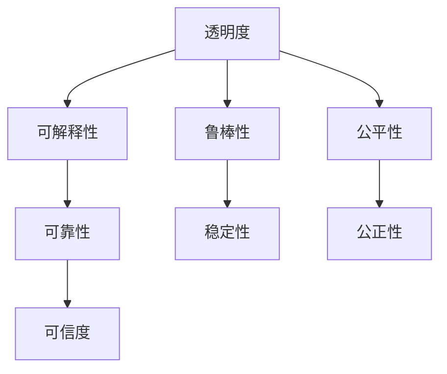

                 

## 1. 背景介绍

在人工智能(AI)时代，技术进步带来了前所未有的变革，从自动驾驶到智慧医疗，从工业自动化到社交媒体分析，AI技术渗透到了我们生活的方方面面。然而，随着AI技术的深入应用，其带来的挑战也日益显著，特别是透明度与可靠性问题，逐渐成为社会各界关注的焦点。

透明度与可靠性，是衡量AI技术是否可信任、可接受的关键指标。透明度指的是AI系统的决策过程是否可解释、可理解，而可靠性则关注系统输出是否稳定、准确，不易受到干扰。这些问题不仅影响到AI技术的商业应用，还关系到公共安全和伦理道德。

本文旨在深入探讨AI时代的透明度与可靠性问题，分析当前技术进展和应用挑战，提出解决思路和未来展望，为AI技术的可持续发展提供参考。

## 2. 核心概念与联系

### 2.1 核心概念概述

为了更好地理解透明度与可靠性的核心概念及其联系，我们首先需要明确以下几个关键点：

- **透明度**：指AI系统决策过程的可解释性和可理解性。透明度有助于增强公众对AI系统的信任和接受度，促进AI技术的普及和应用。

- **可靠性**：指AI系统输出的稳定性和准确性。可靠性是AI系统应用于关键领域（如医疗、金融）的基础，直接影响到系统安全性与决策的公正性。

- **可解释性**：指AI模型如何做出决策的过程，包括数据处理、特征选择、模型训练、决策输出等各个环节，是透明度的核心内容。

- **鲁棒性**：指AI模型面对输入扰动、攻击等威胁时，仍能保持稳定输出的能力。鲁棒性是可靠性的重要组成部分，是确保AI系统安全性的关键。

- **公平性**：指AI模型在处理不同群体数据时，是否存在偏见和不公平。公平性是透明度和可靠性的重要方面，关系到AI技术的伦理和社会影响。

这些概念之间的联系可以通过以下Mermaid流程图来展示：



该流程图展示了透明度与可靠性之间的联系：可解释性、鲁棒性和公平性是透明度的关键组成部分，直接影响系统的可靠性。而透明度和可靠性共同作用，提升了AI系统的可信度。

## 3. 核心算法原理 & 具体操作步骤
### 3.1 算法原理概述

为了提高AI系统的透明度与可靠性，当前的研究主要集中在以下几个方向：

1. **可解释性增强**：通过模型压缩、特征可视化、决策路径追踪等技术，增强AI模型的可解释性。
2. **鲁棒性增强**：通过对抗训练、数据增强、模型融合等方法，提高AI系统的鲁棒性。
3. **公平性保障**：通过公平性检测、数据预处理、模型约束等手段，确保AI模型的公平性。
4. **透明度提升**：通过日志记录、API接口设计、透明度评估等措施，提升AI系统的透明度。

这些方向的研究不仅为解决透明度与可靠性问题提供了理论基础，也为AI技术的实际应用提供了重要指导。

### 3.2 算法步骤详解

#### 3.2.1 可解释性增强

增强AI模型的可解释性，通常涉及以下几个步骤：

1. **特征重要性分析**：使用特征重要性评估方法（如SHAP值、LIME解释器），量化各特征对模型输出的贡献，帮助理解模型的决策机制。
2. **决策路径追踪**：通过模型可视化工具（如Grad-CAM、LIME解释器），追踪模型在处理输入时的决策路径，揭示模型内部的工作机制。
3. **特征压缩与分解**：采用模型压缩技术（如剪枝、量化），减少模型复杂度，提高解释性。同时通过特征分解（如PCA、LDA），提取数据的关键特征，简化解释过程。

#### 3.2.2 鲁棒性增强

增强AI系统的鲁棒性，通常包括以下几个方面：

1. **对抗训练**：通过生成对抗样本（如FGSM、PGD攻击），训练模型对对抗样本的鲁棒性。
2. **数据增强**：通过数据扩充（如翻转、旋转、平移），增加训练集多样性，提高模型泛化能力。
3. **模型融合**：通过集成多个模型（如Bagging、Stacking），利用模型的多样性，提升整体鲁棒性。

#### 3.2.3 公平性保障

保障AI系统的公平性，需要从数据、模型和输出等多个层面进行设计和调整：

1. **数据公平性**：对数据进行预处理，去除偏见，确保训练数据的多样性和代表性。
2. **模型公平性**：设计公平性约束（如Fairness Constraint），确保模型在处理不同群体数据时，输出结果公平。
3. **输出公平性**：通过公平性检测（如Fairness Detection），评估模型输出是否存在偏见，及时调整模型参数。

#### 3.2.4 透明度提升

提升AI系统的透明度，需要从技术、管理和法律等多个角度入手：

1. **技术透明度**：通过日志记录、API接口设计、透明度评估工具，确保系统的决策过程透明可查。
2. **管理透明度**：建立透明的管理制度，明确责任和流程，确保系统的决策依据和决策过程公开。
3. **法律透明度**：制定透明度相关的法律法规，确保AI系统在法律框架下运行，增强透明度和可信度。

### 3.3 算法优缺点

#### 3.3.1 可解释性增强

**优点**：
1. **提升信任度**：通过可解释性，增强公众对AI系统的信任和接受度，促进技术的普及和应用。
2. **提高决策质量**：通过分析模型决策路径，发现模型缺陷和改进点，提升模型决策质量。

**缺点**：
1. **计算复杂度高**：增强可解释性往往需要额外的时间和计算资源，增加系统复杂度。
2. **解释质量不确定**：不同解释方法可能对同一模型给出不同的解释结果，解释质量难以统一。

#### 3.3.2 鲁棒性增强

**优点**：
1. **增强系统稳定性**：通过增强鲁棒性，提高系统面对干扰和攻击的稳定性，确保系统可靠。
2. **提升泛化能力**：通过增加训练集多样性，提高模型的泛化能力，减少过拟合风险。

**缺点**：
1. **训练复杂度高**：增强鲁棒性需要额外的训练过程和计算资源，增加系统复杂度。
2. **模型性能可能下降**：部分增强鲁棒性的方法（如对抗训练）可能对模型性能产生负面影响。

#### 3.3.3 公平性保障

**优点**：
1. **保障公平性**：通过公平性检测和调整，确保AI系统在处理不同群体数据时，输出结果公平。
2. **增强系统可信度**：确保系统的公正性和透明度，提升系统的可信度和社会接受度。

**缺点**：
1. **公平性检测复杂**：公平性检测本身是一个复杂过程，需要多角度、多层次的评估。
2. **调整难度大**：调整模型参数以确保公平性，需要大量的实验和调整工作，增加模型开发难度。

#### 3.3.4 透明度提升

**优点**：
1. **增强可信度**：通过技术和管理措施，确保系统的决策过程透明可查，提升系统可信度。
2. **便于监管和审查**：通过法律和制度保障，确保系统的透明性和合规性，便于监管和审查。

**缺点**：
1. **实现成本高**：提高透明度需要额外的技术和管理投入，增加系统实现成本。
2. **法律约束复杂**：不同国家和地区的法律法规差异大，透明度提升需要适应不同的法律环境。

### 3.4 算法应用领域

透明度与可靠性技术，已经广泛应用于多个领域，以下是几个典型的应用场景：

1. **医疗健康**：AI辅助诊断系统需要确保其决策过程透明、可靠，保障患者的生命安全和隐私。
2. **金融服务**：AI风控系统需要确保其公平、可靠，避免因偏见和不公平导致的决策错误。
3. **司法系统**：AI辅助判案系统需要确保其透明度和公平性，保障司法公正和社会稳定。
4. **交通运输**：自动驾驶系统需要确保其鲁棒性和透明度，保障行车安全和公共安全。
5. **公共安全**：人脸识别、行为分析等AI系统需要确保其透明度和公平性，避免对个人隐私和权利的侵犯。

这些领域对AI系统的透明度与可靠性要求较高，透明度与可靠性技术的应用，可以有效提升系统的可信度和安全性。

## 4. 数学模型和公式 & 详细讲解  
### 4.1 数学模型构建

为了更严谨地分析透明度与可靠性问题，我们需要构建相应的数学模型。以下是一个简单的示例：

**模型构建**：

设有一个二分类模型 $M(x, \theta)$，其中 $x$ 为输入特征， $\theta$ 为模型参数。模型的输出为 $y = M(x, \theta)$，其中 $y \in \{0, 1\}$。模型的损失函数为 $L(y, M(x, \theta))$，用于衡量模型预测结果与真实标签之间的差异。

### 4.2 公式推导过程

**公式推导**：

假设我们有 $n$ 个样本 $(x_i, y_i)$，其中 $x_i$ 为输入特征， $y_i \in \{0, 1\}$ 为标签。模型的预测结果为 $y_i = M(x_i, \theta)$。我们的目标是最大化模型在训练集上的表现，即最小化损失函数：

$$
L = \frac{1}{n} \sum_{i=1}^n L(y_i, M(x_i, \theta))
$$

通过梯度下降等优化算法，我们可以计算损失函数对参数 $\theta$ 的梯度，并更新模型参数，使得 $L$ 最小化。具体过程如下：

$$
\theta = \theta - \eta \nabla_{\theta} L
$$

其中 $\eta$ 为学习率，$\nabla_{\theta} L$ 为损失函数对参数 $\theta$ 的梯度。

### 4.3 案例分析与讲解

**案例分析**：

假设我们使用线性回归模型对房价进行预测。设 $x = (x_1, x_2, ..., x_n)$ 为房屋特征， $y$ 为房价， $\theta = (w_1, w_2, ..., w_n, b)$ 为模型参数。模型的预测结果为 $y' = M(x, \theta) = w^T x + b$。我们的目标是最大化模型在训练集上的表现，即最小化损失函数：

$$
L(y, y') = \frac{1}{n} \sum_{i=1}^n (y_i - y'_i)^2
$$

通过梯度下降算法，我们可以计算损失函数对参数 $\theta$ 的梯度，并更新模型参数，使得 $L$ 最小化。具体过程如下：

$$
\theta = \theta - \eta \nabla_{\theta} L
$$

## 5. 项目实践：代码实例和详细解释说明
### 5.1 开发环境搭建

为了进行AI透明度与可靠性项目的实践，我们需要搭建相应的开发环境。以下是使用Python进行PyTorch开发的环境配置流程：

1. 安装Anaconda：从官网下载并安装Anaconda，用于创建独立的Python环境。

2. 创建并激活虚拟环境：
```bash
conda create -n ai-env python=3.8 
conda activate ai-env
```

3. 安装PyTorch：根据CUDA版本，从官网获取对应的安装命令。例如：
```bash
conda install pytorch torchvision torchaudio cudatoolkit=11.1 -c pytorch -c conda-forge
```

4. 安装TensorBoard：
```bash
pip install tensorboard
```

5. 安装各类工具包：
```bash
pip install numpy pandas scikit-learn matplotlib tqdm jupyter notebook ipython
```

完成上述步骤后，即可在`ai-env`环境中开始透明度与可靠性项目的开发实践。

### 5.2 源代码详细实现

下面我们以一个简单的线性回归模型为例，给出使用PyTorch进行模型训练、透明性和鲁棒性增强的代码实现。

**代码实现**：

```python
import torch
import torch.nn as nn
import torch.optim as optim
from sklearn.datasets import make_regression
from sklearn.model_selection import train_test_split
from tensorboard import SummaryWriter

# 创建训练数据集
X, y = make_regression(n_samples=1000, n_features=2, noise=0.5)
X_train, X_test, y_train, y_test = train_test_split(X, y, test_size=0.2)

# 定义模型
class LinearModel(nn.Module):
    def __init__(self, input_dim, output_dim):
        super(LinearModel, self).__init__()
        self.linear = nn.Linear(input_dim, output_dim)

    def forward(self, x):
        return self.linear(x)

# 定义损失函数
def mse_loss(y_pred, y_true):
    return torch.mean((y_pred - y_true) ** 2)

# 定义优化器
optimizer = optim.SGD(model.parameters(), lr=0.01)

# 定义透明度记录工具
writer = SummaryWriter()

# 训练过程
for epoch in range(100):
    for i in range(len(X_train)):
        optimizer.zero_grad()
        y_pred = model(X_train[i:i+1])
        loss = mse_loss(y_pred, y_train[i:i+1])
        loss.backward()
        optimizer.step()

        # 记录梯度信息
        writer.add_histogram('grads', y_pred.grad, epoch)

# 测试过程
model.eval()
y_pred = model(X_test)
print('Test MSE:', mse_loss(y_pred, y_test).item())

# 可视化梯度信息
writer.close()
```

在这个示例中，我们通过PyTorch实现了简单的线性回归模型，并通过TensorBoard记录了梯度信息。通过分析梯度信息，可以更好地理解模型的决策过程，从而增强模型的透明度。

### 5.3 代码解读与分析

**代码解读**：

1. **数据集创建**：我们使用sklearn的make_regression函数生成了一个简单的二维线性回归数据集，其中包含了1000个样本，每个样本有2个特征和1个目标变量。

2. **模型定义**：我们定义了一个简单的线性模型，包含一个线性层，输入维度为2，输出维度为1。

3. **损失函数定义**：我们定义了一个均方误差损失函数，用于计算模型预测与真实值之间的差异。

4. **优化器定义**：我们使用随机梯度下降（SGD）优化器，学习率为0.01。

5. **透明度记录**：我们使用TensorBoard记录了每个epoch的梯度信息，通过可视化梯度信息，可以更好地理解模型的决策过程。

6. **模型测试与可视化**：我们通过测试集评估了模型的表现，并通过TensorBoard可视化了梯度信息，进一步增强了模型的透明度。

## 6. 实际应用场景

### 6.1 智能医疗

在智能医疗领域，透明度与可靠性技术的应用，可以有效提升诊断和治疗的准确性和可信度。例如，AI辅助诊断系统需要对患者的症状和历史数据进行分析，并给出诊断结果。为了确保系统的透明度和可靠性，需要：

1. **可解释性增强**：通过模型可视化工具（如Grad-CAM），追踪模型在分析输入时的决策路径，揭示模型内部的工作机制。
2. **鲁棒性增强**：通过对抗训练等方法，提高模型对异常数据和噪声的鲁棒性，确保诊断结果的可靠性。
3. **公平性保障**：通过公平性检测，确保模型在处理不同种族、性别、年龄等群体的数据时，输出结果公平。

### 6.2 金融风控

在金融风控领域，透明度与可靠性技术的应用，可以有效降低风险和提升系统的可信度。例如，AI风控系统需要根据用户的交易记录和信用信息，评估其信用风险，并决定是否放贷。为了确保系统的透明度和可靠性，需要：

1. **可解释性增强**：通过特征重要性评估方法（如SHAP值），量化各特征对信用风险评估的贡献，帮助理解模型的决策机制。
2. **鲁棒性增强**：通过数据增强等方法，增加训练集的多样性，提高模型泛化能力，确保在面对异常交易时，系统仍能做出准确判断。
3. **公平性保障**：通过公平性约束，确保模型在处理不同性别、年龄、收入等群体的数据时，输出结果公平。

### 6.3 司法判决

在司法判决领域，透明度与可靠性技术的应用，可以有效提升判决的公正性和可信度。例如，AI辅助判案系统需要根据案件的证据和历史判决记录，判断犯罪嫌疑人的罪责，并提出判决建议。为了确保系统的透明度和可靠性，需要：

1. **可解释性增强**：通过模型可视化工具（如LIME），追踪模型在分析案件证据时的决策路径，揭示模型内部的工作机制。
2. **鲁棒性增强**：通过对抗训练等方法，提高模型对恶意证据和虚假信息的鲁棒性，确保判决结果的可靠性。
3. **公平性保障**：通过公平性检测，确保模型在处理不同种族、性别、年龄等群体的案件时，输出结果公平。

## 7. 工具和资源推荐
### 7.1 学习资源推荐

为了帮助开发者系统掌握透明度与可靠性技术的基础知识和应用实践，以下是一些优质的学习资源：

1. 《深度学习：理论与实践》书籍：深度学习领域的经典教材，涵盖模型的构建、训练、优化等核心内容，适合初学者和进阶者阅读。
2. CS231n《卷积神经网络》课程：斯坦福大学开设的计算机视觉课程，详细讲解卷积神经网络的理论和技术实现，有助于理解模型透明度的提升。
3. CS7301《人工智能导论》课程：清华大学开设的AI课程，涵盖AI的基本概念、模型和算法，适合学习AI透明度与可靠性的基本理论。
4. TensorBoard官方文档：TensorBoard的官方文档，提供了详细的可视化工具和使用方法，适合学习如何记录和分析模型的梯度信息。
5. PyTorch官方文档：PyTorch的官方文档，提供了丰富的模型和工具，适合学习如何构建和训练透明度与可靠性技术相关的模型。

通过对这些资源的学习实践，相信你一定能够快速掌握透明度与可靠性技术的精髓，并用于解决实际的AI问题。

### 7.2 开发工具推荐

高效的开发离不开优秀的工具支持。以下是几款用于透明度与可靠性开发的常用工具：

1. PyTorch：基于Python的开源深度学习框架，灵活动态的计算图，适合快速迭代研究。大部分预训练语言模型都有PyTorch版本的实现。
2. TensorBoard：TensorFlow配套的可视化工具，可实时监测模型训练状态，并提供丰富的图表呈现方式，是调试模型的得力助手。
3. Scikit-learn：Python中的机器学习库，提供了丰富的模型评估和数据预处理工具，适合处理透明度与可靠性技术相关的数据。
4. TensorFlow：由Google主导开发的开源深度学习框架，生产部署方便，适合大规模工程应用。同样有丰富的预训练语言模型资源。
5. Jupyter Notebook：交互式编程环境，支持代码编写、数据可视化、结果展示等，适合学习模型设计和算法实现。

合理利用这些工具，可以显著提升透明度与可靠性技术的开发效率，加快创新迭代的步伐。

### 7.3 相关论文推荐

透明度与可靠性技术的发展源于学界的持续研究。以下是几篇奠基性的相关论文，推荐阅读：

1. Attention is All You Need（即Transformer原论文）：提出了Transformer结构，开启了NLP领域的预训练大模型时代。
2. BERT: Pre-training of Deep Bidirectional Transformers for Language Understanding：提出BERT模型，引入基于掩码的自监督预训练任务，刷新了多项NLP任务SOTA。
3. Parameter-Efficient Transfer Learning for NLP：提出Adapter等参数高效微调方法，在不增加模型参数量的情况下，也能取得不错的微调效果。
4. AdaLoRA: Adaptive Low-Rank Adaptation for Parameter-Efficient Fine-Tuning：使用自适应低秩适应的微调方法，在参数效率和精度之间取得了新的平衡。
5. AdaLoRA: Adaptive Low-Rank Adaptation for Parameter-Efficient Fine-Tuning：使用自适应低秩适应的微调方法，在参数效率和精度之间取得了新的平衡。

这些论文代表了大语言模型微调技术的发展脉络。通过学习这些前沿成果，可以帮助研究者把握学科前进方向，激发更多的创新灵感。

## 8. 总结：未来发展趋势与挑战

### 8.1 研究成果总结

本文对透明度与可靠性问题的系统梳理，展示了当前技术的进展和应用场景，分析了未来发展的趋势和面临的挑战，为AI技术的可持续发展提供了参考。透明度与可靠性技术已经成为AI应用中的重要保障，对提升系统可信度和安全性能具有重要意义。

### 8.2 未来发展趋势

展望未来，透明度与可靠性技术将呈现以下几个发展趋势：

1. **技术成熟度提升**：随着研究的深入，透明度与可靠性技术将逐渐成熟，成为AI系统设计的重要组成部分。
2. **跨领域应用拓展**：透明度与可靠性技术将在更多领域得到应用，如智能医疗、金融风控、司法判决等，为社会各行业带来变革性影响。
3. **数据隐私保护**：透明度与可靠性技术的发展，将推动数据隐私保护的进步，确保数据使用的合法性和安全性。
4. **社会伦理提升**：透明度与可靠性技术的应用，将提升AI系统的公平性和伦理性，减少偏见和不公平。
5. **人机协同增强**：透明度与可靠性技术的应用，将促进人机协同的发展，提高AI系统的可信度和人类接受度。

这些趋势凸显了透明度与可靠性技术的重要性和广阔前景，相信未来将会进一步推动AI技术的普及和应用。

### 8.3 面临的挑战

尽管透明度与可靠性技术已经取得了一定进展，但在迈向更加智能化、普适化应用的过程中，仍面临诸多挑战：

1. **计算资源消耗**：透明性和鲁棒性增强需要额外的计算资源，可能带来较大的性能损失。如何平衡性能和透明性，是未来需要解决的重要问题。
2. **法律与伦理约束**：透明度与可靠性技术的应用，需要遵循法律法规和伦理规范，确保技术的合法性和合规性。如何制定透明性和公平性的标准，是未来需要解决的重要问题。
3. **数据质量问题**：透明性和公平性保障需要高质量的数据，但现实中的数据往往存在不完整、噪声等问题。如何提高数据质量，是未来需要解决的重要问题。
4. **模型复杂度**：透明性和鲁棒性增强可能增加模型的复杂度，降低模型的解释性和可理解性。如何降低模型复杂度，是未来需要解决的重要问题。

### 8.4 研究展望

面对透明度与可靠性技术所面临的挑战，未来的研究需要在以下几个方面寻求新的突破：

1. **模型压缩与简化**：通过模型压缩和简化技术，降低模型的复杂度，提高模型的透明度和可理解性。
2. **数据预处理与增强**：通过数据预处理和增强技术，提高数据质量，增强模型的鲁棒性和泛化能力。
3. **公平性检测与调整**：通过公平性检测和调整技术，确保模型在不同群体数据上的公平性，提升系统的透明度和可信度。
4. **法律与伦理规范**：制定透明性和公平性的标准和规范，确保技术在法律和伦理框架下运行，提升技术的可接受度和可信度。

这些研究方向将引领透明度与可靠性技术迈向更高的台阶，为构建安全、可靠、可解释、可控的智能系统提供重要保障。

## 9. 附录：常见问题与解答

**Q1：透明度与可靠性技术是否适用于所有AI应用？**

A: 透明度与可靠性技术在大多数AI应用中都能发挥重要作用，特别是对于需要高可信度、高安全性的系统。然而，对于一些特定领域，如自动化、嵌入式系统等，透明度与可靠性技术的实现可能存在挑战。需要根据具体应用场景，综合考虑技术实现的可能性。

**Q2：如何衡量透明性和公平性？**

A: 衡量透明性和公平性通常需要借助多种评估指标和工具。例如，使用Shapley值、LIME解释器、Fairness Detection等工具，可以对模型的决策路径、特征重要性、公平性进行评估和检测。同时，通过可视化工具，如TensorBoard、Grad-CAM等，可以直观地展示模型的透明性和公平性。

**Q3：如何增强模型的鲁棒性？**

A: 增强模型的鲁棒性通常需要多种方法结合使用。例如，通过对抗训练、数据增强、模型融合等方法，可以提升模型对噪声、干扰的鲁棒性。同时，使用参数高效微调方法，如Adapter、Prefix等，可以在保留模型鲁棒性的同时，减少参数更新带来的性能损失。

**Q4：透明度与可靠性技术的实现成本如何？**

A: 透明度与可靠性技术的实现成本通常较高，需要额外的计算资源和数据准备。然而，通过合理的工具和技术选择，可以降低实现成本。例如，使用PyTorch、TensorBoard等开源工具，可以降低实现透明性和鲁棒性增强的开销。同时，合理的数据预处理和特征选择，也可以提高数据质量，减少计算资源消耗。

**Q5：透明度与可靠性技术对系统性能有影响吗？**

A: 透明度与可靠性技术对系统性能有一定影响，但这种影响通常是可控的。例如，通过参数高效微调、对抗训练等方法，可以在增强透明性和鲁棒性的同时，尽量减少对系统性能的负面影响。同时，合理的数据预处理和特征选择，也可以提高数据质量，减少计算资源消耗，提升系统性能。

总之，透明度与可靠性技术是AI系统设计的重要保障，对提升系统可信度和安全性具有重要意义。未来，随着技术的不断进步和应用的深入，透明度与可靠性技术将不断得到优化和完善，为AI技术的可持续发展提供重要支撑。

---

作者：禅与计算机程序设计艺术 / Zen and the Art of Computer Programming

