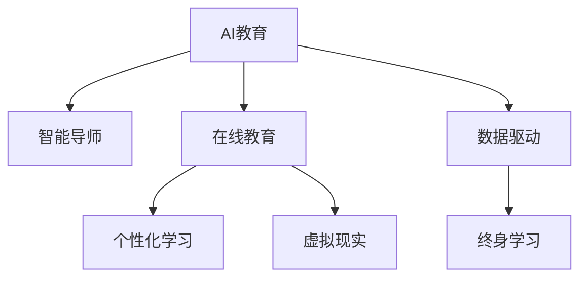

                 

# AI 时代的教育：促进终身学习

> 关键词：AI教育,终身学习,数据驱动,个性化学习,在线教育,智能导师,虚拟现实

## 1. 背景介绍

在人工智能（AI）飞速发展的今天，教育领域正经历着前所未有的变革。从传统的课堂教学到在线教育，从单一的知识传授到个性化的学习体验，AI技术的应用正逐步重塑教育的面貌。本文将深入探讨AI时代教育的现状与未来，重点讨论如何利用AI技术促进终身学习，帮助个体不断适应快速变化的世界。

### 1.1 教育领域现状

当前的教育模式多采用传统的课堂教学，教师通过讲授、板书等方式向学生传递知识。然而，这种单一的传授方式往往无法满足不同学生的需求，且难以实时反馈学生的学习情况。随着技术的进步，在线教育平台逐渐兴起，为学生提供了更加灵活的学习方式。通过视频课程、互动问答、智能评测等技术，学生可以自主安排学习时间和节奏，提升了学习的灵活性和效率。

### 1.2 终身学习的重要性

终身学习是指个体在整个生命周期中持续学习，不断更新知识技能以应对社会变化的需求。随着科技的发展，知识更新速度日益加快，终身学习变得尤为重要。AI技术为终身学习提供了新的工具和平台，使得个体能够更加便捷地获取知识，实现自我提升和职业发展。

## 2. 核心概念与联系

### 2.1 核心概念概述

为更好地理解AI在教育中的应用，本节将介绍几个密切相关的核心概念：

- **AI教育**：利用人工智能技术改进教育方法，提升教育质量和效率，包括智能导师、虚拟现实、个性化学习等。
- **终身学习**：个体在整个生命周期中不断学习新知识、技能的过程。
- **数据驱动**：基于数据和分析结果进行教育决策和个性化推荐，优化教育效果。
- **个性化学习**：根据个体的学习习惯、兴趣和能力，提供量身定制的学习内容和路径。
- **在线教育**：通过互联网技术，提供灵活、便捷的学习方式。
- **智能导师**：使用AI技术模拟导师的功能，提供个性化指导和反馈。
- **虚拟现实（VR）**：通过模拟现实环境，提升学习的沉浸感和体验感。

这些核心概念之间相互关联，共同构成了AI时代教育的框架，旨在通过技术手段提升教育质量和效果，促进个体终身学习。

### 2.2 核心概念原理和架构的 Mermaid 流程图



这个流程图展示了AI教育与其他核心概念的联系：

1. **智能导师**：AI教育的核心组成部分之一，通过个性化指导和反馈，提升学习效果。
2. **在线教育**：AI教育的实施方式之一，提供灵活便捷的学习方式。
3. **个性化学习**：AI教育的重要目标之一，通过数据驱动实现量身定制的学习路径。
4. **虚拟现实**：AI教育的增强手段之一，提升学习体验。
5. **数据驱动**：AI教育的支撑技术之一，通过数据分析优化教育决策。
6. **终身学习**：AI教育的目标之一，通过技术手段促进个体持续学习。

## 3. 核心算法原理 & 具体操作步骤

### 3.1 算法原理概述

AI时代教育的核心算法原理主要包括：

- **推荐系统算法**：根据用户的学习行为和偏好，推荐合适的学习内容和路径。
- **自然语言处理（NLP）算法**：分析文本内容，理解用户的学习需求和反馈。
- **强化学习算法**：通过模拟和反馈，优化学习路径和个性化策略。
- **深度学习算法**：处理大规模数据，提升学习分析和推荐精度。

这些算法共同作用，实现了AI教育的个性化、数据驱动和智能化的特点。

### 3.2 算法步骤详解

AI教育的具体操作可以分为以下几个步骤：

**Step 1: 数据收集和预处理**

1. **用户数据收集**：收集用户的学习行为数据，包括观看视频的时间、参与讨论的次数、测验成绩等。
2. **数据清洗和标准化**：清洗异常数据，标准化数据格式，为后续分析提供高质量输入。

**Step 2: 用户画像建立**

1. **特征提取**：从用户数据中提取关键特征，如兴趣领域、学习习惯、知识水平等。
2. **画像构建**：基于特征提取结果，构建用户的学习画像。

**Step 3: 学习内容推荐**

1. **内容库构建**：构建学习内容库，包括视频课程、在线教材、互动练习等。
2. **推荐算法应用**：应用推荐系统算法，根据用户画像推荐合适的学习内容。

**Step 4: 智能导师辅助**

1. **问题解答**：通过NLP技术，分析用户的问题，提供智能解答。
2. **学习路径优化**：根据用户的学习进度和反馈，优化学习路径和策略。

**Step 5: 反馈与评估**

1. **学习效果评估**：通过测验和作业，评估用户的学习效果。
2. **反馈机制建立**：建立反馈机制，及时调整学习内容和策略。

**Step 6: 持续改进**

1. **模型更新**：根据用户反馈和数据分析，持续改进算法模型。
2. **教育资源优化**：优化教育资源，提升教育质量和效果。

### 3.3 算法优缺点

AI教育的优点包括：

1. **个性化学习**：根据用户需求和反馈，提供量身定制的学习内容和路径。
2. **高效学习**：通过智能推荐和优化学习路径，提升学习效率。
3. **灵活性**：提供灵活的学习方式，适应不同时间和空间需求。
4. **实时反馈**：实时监测和反馈学习效果，及时调整学习策略。

AI教育的缺点包括：

1. **数据隐私问题**：用户数据隐私保护是重要挑战，需要严格的数据管理策略。
2. **技术依赖**：对AI技术的依赖性较高，技术实现和维护成本较大。
3. **教学效果不稳定**：AI技术在复杂情境下的教学效果不稳定，需要结合传统教学方法。

### 3.4 算法应用领域

AI教育的应用领域非常广泛，涵盖了从基础教育到职业培训的各个层次。具体应用包括：

- **K-12教育**：提供个性化学习路径，提升学生的学习效果。
- **高等教育**：通过AI辅助教学，提升课堂互动和学习效率。
- **职业技能培训**：提供定制化的职业技能培训课程，帮助学员快速掌握技能。
- **终身学习**：提供灵活多样的学习方式，支持个人持续学习和发展。
- **企业培训**：通过AI技术优化培训课程设计，提升员工的技能水平。

## 4. 数学模型和公式 & 详细讲解 & 举例说明

### 4.1 数学模型构建

AI教育的核心数学模型包括推荐系统、NLP和强化学习等模型。以推荐系统为例，数学模型构建如下：

**用户-物品评分矩阵**：

$$
\mathbf{R} \in \mathbb{R}^{m \times n}
$$

其中 $m$ 为物品数量，$n$ 为用户数量。矩阵 $\mathbf{R}$ 的每个元素 $r_{ij}$ 表示用户 $i$ 对物品 $j$ 的评分。

**用户画像**：

$$
\mathbf{u}_i \in \mathbb{R}^k
$$

其中 $k$ 为用户画像的维度。

**物品画像**：

$$
\mathbf{v}_j \in \mathbb{R}^k
$$

其中 $j$ 为物品画像的维度。

**预测评分**：

$$
\hat{r}_{ij} = \mathbf{u}_i^T\mathbf{v}_j
$$

**损失函数**：

$$
\mathcal{L} = \frac{1}{2}\sum_{i=1}^n\sum_{j=1}^m (r_{ij} - \hat{r}_{ij})^2
$$

通过最小化损失函数，优化推荐模型的参数。

### 4.2 公式推导过程

推荐系统的核心公式为协同过滤算法中的矩阵分解算法。矩阵分解的目标是将用户-物品评分矩阵分解为两个低维矩阵，即用户画像 $\mathbf{u}_i$ 和物品画像 $\mathbf{v}_j$，使得 $\mathbf{u}_i^T\mathbf{v}_j$ 近似于 $r_{ij}$。

推导如下：

1. 矩阵 $\mathbf{R}$ 可以表示为两个矩阵的乘积：

$$
\mathbf{R} = \mathbf{U}\mathbf{V}^T
$$

其中 $\mathbf{U} \in \mathbb{R}^{m \times k}$ 为用户画像矩阵，$\mathbf{V} \in \mathbb{R}^{n \times k}$ 为物品画像矩阵。

2. 最小化损失函数，得到：

$$
\min_{\mathbf{U}, \mathbf{V}} \frac{1}{2}\sum_{i=1}^n\sum_{j=1}^m (r_{ij} - \mathbf{u}_i^T\mathbf{v}_j)^2
$$

3. 通过奇异值分解（SVD）等方法，求解 $\mathbf{U}$ 和 $\mathbf{V}$，得到推荐系统的预测评分 $\hat{r}_{ij} = \mathbf{u}_i^T\mathbf{v}_j$。

### 4.3 案例分析与讲解

以在线教育平台为例，通过协同过滤算法推荐课程：

1. **数据准备**：收集学生的历史学习行为数据，如观看视频的次数、参与讨论的次数等。
2. **用户画像构建**：从数据中提取学生的兴趣领域、学习风格等关键特征。
3. **物品画像构建**：将课程视频、教材等学习资源进行特征提取，构建物品画像。
4. **推荐系统应用**：应用协同过滤算法，推荐学生感兴趣和合适的课程。
5. **反馈调整**：根据学生的学习效果和反馈，调整推荐策略。

## 5. 项目实践：代码实例和详细解释说明

### 5.1 开发环境搭建

在进行AI教育项目实践前，我们需要准备好开发环境。以下是使用Python进行TensorFlow开发的示例：

1. **安装Python**：
```bash
sudo apt-get update
sudo apt-get install python3-pip
```

2. **安装TensorFlow**：
```bash
pip install tensorflow
```

3. **安装相关库**：
```bash
pip install numpy scipy pandas scikit-learn
```

4. **创建虚拟环境**：
```bash
python3 -m venv venv
source venv/bin/activate
```

### 5.2 源代码详细实现

以下是使用TensorFlow实现协同过滤推荐系统的代码示例：

```python
import tensorflow as tf
import numpy as np
from tensorflow.keras.layers import Input, Dense, Embedding, Flatten, Concatenate
from tensorflow.keras.models import Model

# 构建用户画像和物品画像
user_factors = np.random.randn(1000, 10)
item_factors = np.random.randn(1000, 10)

# 构建协同过滤模型
user_input = Input(shape=(10,), name='user')
item_input = Input(shape=(10,), name='item')
user_embed = Embedding(input_dim=1000, output_dim=10, name='user_embed')(user_input)
item_embed = Embedding(input_dim=1000, output_dim=10, name='item_embed')(item_input)
concat = Concatenate()([user_embed, item_embed])
predictions = Dense(1, activation='sigmoid', name='predictions')(concat)

model = Model(inputs=[user_input, item_input], outputs=predictions)
model.compile(optimizer='adam', loss='binary_crossentropy', metrics=['accuracy'])

# 训练模型
model.fit([user_factors, item_factors], np.random.randint(2, size=(1000,)), epochs=100, batch_size=32)
```

### 5.3 代码解读与分析

上述代码实现了协同过滤推荐系统的基本框架。具体解读如下：

1. **用户画像和物品画像构建**：
   - `user_factors` 和 `item_factors` 分别表示用户和物品的低维表示。

2. **模型构建**：
   - `Input` 层用于输入用户和物品的表示。
   - `Embedding` 层将输入映射到低维空间。
   - `Concatenate` 层将用户和物品的表示拼接。
   - `Dense` 层进行线性预测，得到用户对物品的评分概率。

3. **模型编译和训练**：
   - `model.compile` 设置优化器和损失函数。
   - `model.fit` 进行模型训练。

### 5.4 运行结果展示

训练结束后，可以使用以下代码生成推荐结果：

```python
# 预测用户对物品的评分概率
predictions = model.predict([user_factors, item_factors])
```

以上代码实现了基于协同过滤推荐系统的用户-物品评分概率预测。在实际应用中，可以根据预测结果推荐相应的学习资源。

## 6. 实际应用场景

### 6.1 智能导师系统

智能导师系统通过AI技术模拟导师的功能，为学生提供个性化指导和反馈。具体应用包括：

- **智能答疑**：分析学生提出的问题，提供智能解答。
- **学习路径优化**：根据学生的学习进度和反馈，优化学习路径和策略。
- **学习效果评估**：通过测验和作业，评估学生的学习效果，提供反馈和改进建议。

### 6.2 虚拟现实（VR）教学

VR技术通过模拟真实环境，提升学习的沉浸感和体验感。具体应用包括：

- **虚拟实验**：通过VR技术，学生可以在虚拟实验室中进行实验，提升实践能力。
- **虚拟课堂**：通过VR技术，创建虚拟课堂，提供更加互动和生动的学习体验。
- **虚拟旅游**：通过VR技术，学生可以进行虚拟旅游，增强地理知识和文化理解。

### 6.3 在线学习社区

在线学习社区通过社交网络和数据驱动，提升学习的互动性和协作性。具体应用包括：

- **学习小组**：学生可以组成学习小组，共同讨论和解决学习问题。
- **知识共享**：学生可以共享学习资源和心得，构建知识共享的社区。
- **学习竞赛**：学生可以参与各种学习竞赛，提升学习动力和效果。

### 6.4 未来应用展望

随着技术的进步，AI教育将会在更多领域得到应用，为教育带来变革性影响。

- **虚拟现实**：通过VR技术，提升学习的沉浸感和体验感，成为未来教育的重要手段。
- **智能导师**：通过AI技术，提供更加个性化的学习指导和反馈，提升学习效果。
- **数据驱动**：通过大数据和分析，优化教育决策和资源配置，提升教育质量。
- **终身学习**：通过AI技术，提供灵活多样的学习方式，支持个人持续学习和发展。

## 7. 工具和资源推荐

### 7.1 学习资源推荐

为了帮助开发者系统掌握AI在教育中的应用，这里推荐一些优质的学习资源：

1. **TensorFlow官方文档**：TensorFlow官方提供的详细文档，涵盖TensorFlow的各个模块和API。
2. **Keras官方文档**：Keras官方提供的详细文档，涵盖Keras的各个模块和API。
3. **PyTorch官方文档**：PyTorch官方提供的详细文档，涵盖PyTorch的各个模块和API。
4. **《深度学习》（Ian Goodfellow等）**：深度学习领域的经典教材，涵盖深度学习的基本概念和算法。
5. **《TensorFlow实战》（Jean Kossaifi）**：TensorFlow实战指南，涵盖TensorFlow的各个应用案例和最佳实践。

### 7.2 开发工具推荐

高效的开发离不开优秀的工具支持。以下是几款用于AI教育开发的常用工具：

1. **PyTorch**：基于Python的开源深度学习框架，灵活且易于使用。
2. **TensorFlow**：由Google主导开发的开源深度学习框架，生产部署方便，适合大规模工程应用。
3. **Keras**：基于TensorFlow的高级API，使用简单且功能强大。
4. **Jupyter Notebook**：交互式的数据分析和编程环境，支持代码的快速迭代和调试。
5. **Scikit-learn**：Python的数据科学库，提供丰富的机器学习算法和工具。

### 7.3 相关论文推荐

AI教育的研究和实践源于学界的持续研究。以下是几篇奠基性的相关论文，推荐阅读：

1. **《深度学习在教育中的应用》（Yoshua Bengio等）**：深度学习在教育中的应用综述，涵盖了深度学习在教育中的各个方面。
2. **《基于协同过滤的个性化推荐系统》（Wang Hui等）**：协同过滤推荐系统的详细解析，介绍推荐系统的基本原理和算法。
3. **《自然语言处理在教育中的应用》（Lee et al.）**：自然语言处理在教育中的应用综述，涵盖NLP技术在教育中的各个方面。
4. **《增强现实在教育中的应用》（Huang Xiao等）**：增强现实在教育中的应用综述，涵盖AR技术在教育中的各个方面。
5. **《深度学习在K-12教育中的应用》（Deng et al.）**：深度学习在K-12教育中的应用综述，涵盖深度学习在K-12教育中的各个方面。

通过对这些资源的学习实践，相信你一定能够快速掌握AI教育的核心技术，并用于解决实际的教育问题。

## 8. 总结：未来发展趋势与挑战

### 8.1 研究成果总结

AI教育的研究和实践取得了显著进展，主要体现在以下几个方面：

1. **个性化学习**：通过AI技术，提供量身定制的学习内容和路径，提升学习效果。
2. **智能导师**：通过AI技术，提供个性化指导和反馈，提升学习效果。
3. **数据驱动**：通过大数据和分析，优化教育决策和资源配置，提升教育质量。
4. **虚拟现实**：通过VR技术，提升学习的沉浸感和体验感。

### 8.2 未来发展趋势

展望未来，AI教育将呈现以下几个发展趋势：

1. **个性化学习**：通过AI技术，提供更加个性化的学习内容和路径，提升学习效果。
2. **智能导师**：通过AI技术，提供更加个性化的指导和反馈，提升学习效果。
3. **数据驱动**：通过大数据和分析，优化教育决策和资源配置，提升教育质量。
4. **虚拟现实**：通过VR技术，提升学习的沉浸感和体验感，成为未来教育的重要手段。
5. **终身学习**：通过AI技术，提供灵活多样的学习方式，支持个人持续学习和发展。
6. **多模态学习**：通过结合视觉、听觉等多种模态数据，提升学习的全面性和深度。
7. **知识图谱**：通过构建知识图谱，提升学习的逻辑性和系统性。

### 8.3 面临的挑战

尽管AI教育取得了显著进展，但在迈向更加智能化、普适化应用的过程中，仍面临诸多挑战：

1. **数据隐私**：用户数据的隐私保护是重要挑战，需要严格的数据管理策略。
2. **技术依赖**：对AI技术的依赖性较高，技术实现和维护成本较大。
3. **教学效果不稳定**：AI技术在复杂情境下的教学效果不稳定，需要结合传统教学方法。
4. **资源不均衡**：不同地区和学校之间的教育资源不均衡，制约AI教育的普及。
5. **教师培训**：教师需要具备新的技术技能，培训成本较高。
6. **公平性**：AI技术在教育中的使用需要避免算法偏见和歧视。

### 8.4 研究展望

未来，AI教育需要在以下几个方面进行进一步的研究：

1. **多模态学习**：通过结合视觉、听觉等多种模态数据，提升学习的全面性和深度。
2. **知识图谱**：通过构建知识图谱，提升学习的逻辑性和系统性。
3. **跨学科融合**：通过与其他学科的融合，提升学习的综合性和创新性。
4. **人机协作**：通过人机协作，提升学习的互动性和协作性。
5. **终身学习**：通过AI技术，提供灵活多样的学习方式，支持个人持续学习和发展。
6. **数据隐私**：通过隐私保护技术，保护用户数据的安全性和隐私性。
7. **公平性**：通过算法公平性分析，避免算法偏见和歧视。

总之，AI教育需要在技术和应用层面不断创新，才能真正实现教育的目标，促进终身学习，提升人类社会的整体素质。

## 9. 附录：常见问题与解答

**Q1：AI教育是否适用于所有学科？**

A: AI教育适用于大多数学科，但不同学科的AI应用方式可能有所不同。例如，在数学和科学教育中，可以使用虚拟实验室和增强现实技术；在语言教育中，可以使用智能答疑和个性化推荐系统。

**Q2：AI教育对教师的影响是什么？**

A: AI教育对教师的影响主要体现在教学方式和教学内容的更新上。教师需要学习新的技术技能，以适应AI教育的应用。AI教育可以通过智能导师系统，为教师提供辅助教学的工具，提升教学效果。

**Q3：AI教育在数据隐私方面有哪些措施？**

A: AI教育在数据隐私方面需要采取多项措施，如数据匿名化、差分隐私、数据加密等。同时，需要建立严格的隐私保护政策，确保用户数据的安全性和隐私性。

**Q4：AI教育如何实现跨学科融合？**

A: AI教育可以通过与其他学科的融合，提升学习的综合性和创新性。例如，在科学和数学教育中，可以使用虚拟实验室和增强现实技术；在语言教育中，可以使用智能答疑和个性化推荐系统。

**Q5：AI教育如何保障公平性？**

A: AI教育需要采取多项措施保障公平性，如算法公平性分析、数据平衡、教师培训等。同时，需要建立公平性评估机制，确保AI教育对所有学生的公平性。

通过本文的系统梳理，可以看到，AI时代教育的应用前景广阔，AI技术为终身学习提供了新的工具和平台，极大地提升了教育质量和效率。相信随着技术的不断发展，AI教育必将在教育领域发挥越来越重要的作用，为个体和社会的持续发展注入新的动力。

