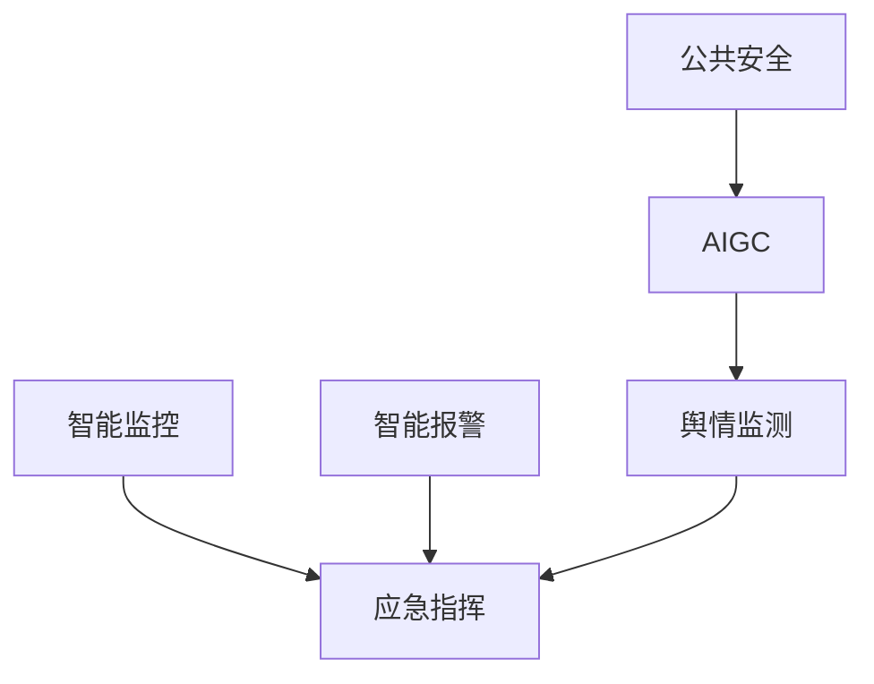

                 

# AIGC重新定义公共安全

在人工智能(AI)和生成式人工智能(AIGC, Artificial Intelligence for Generative Communications)的迅猛发展下，公共安全领域正在迎来一场革命。通过AIGC技术，公共安全系统正在变得更加智能化、精准化和人性化，极大地提升了应对各种突发事件的能力。本文将从背景介绍、核心概念、算法原理、实际应用场景等方面详细探讨AIGC在公共安全中的创新应用及其未来发展方向。

## 1. 背景介绍

### 1.1 公共安全领域的挑战

公共安全领域涉及维护社会稳定、防范和应对各类突发事件，如恐怖袭击、自然灾害、重大公共卫生事件等。传统的公共安全系统主要依赖人力和物理手段，如监控摄像头、警报系统、应急救援队伍等，效率较低、成本高昂。近年来，随着科技的发展，越来越多的智能化技术被引入，如大数据分析、物联网(IoT)、智能监控等，极大地提升了公共安全系统的效率和响应速度。然而，这些技术仍然存在一些局限性，如对数据的需求量大、依赖人工干预多、应急响应能力有限等。

### 1.2 AIGC技术的潜力

AIGC技术作为新一代人工智能技术，能够通过深度学习和大规模无标签数据训练生成式模型，从而自动生成自然流畅的语言文本、音频、视频等，具备极强的创造力和智能。在公共安全领域，AIGC技术能够被应用于实时监控分析、智能报警、应急指挥、舆情监测等多个环节，极大地提升公共安全系统的智能化水平和应急响应能力。

## 2. 核心概念与联系

### 2.1 核心概念概述

为更好地理解AIGC在公共安全中的应用，本节将介绍几个关键概念：

- **人工智能(AI)**：通过数据、算法和计算能力实现机器智能化处理，涵盖机器学习、深度学习、强化学习等多个分支。

- **生成式人工智能(AIGC)**：指通过深度学习技术生成具有创造性、智能性、适应性的内容，包括文本生成、语音合成、图像生成、视频生成等。

- **智能监控**：利用视频分析、模式识别等技术，对视频流进行实时监控和分析，识别异常行为和安全威胁。

- **智能报警**：结合传感器、监控摄像头等设备，通过AI算法实时分析和评估环境变化，及时发出报警信号。

- **应急指挥**：通过AI技术辅助进行应急决策、资源调配、任务分配等，快速响应突发事件。

- **舆情监测**：利用NLP、情感分析等技术，实时分析社交媒体、新闻等舆论动态，预测和防范潜在危机。

这些核心概念之间的逻辑关系可以通过以下Mermaid流程图来展示：



这个流程图展示了大语言模型与公共安全领域应用的相关性：

1. AIGC技术作为底层支持，为智能监控、智能报警、应急指挥、舆情监测等应用提供智能生成和分析能力。
2. 智能监控和智能报警系统通过AIGC技术提升对异常行为的识别能力，实时预警风险。
3. 应急指挥系统通过AIGC技术辅助决策，优化资源配置，快速响应突发事件。
4. 舆情监测系统利用AIGC技术挖掘社交媒体信息，预测舆情趋势，防范潜在危机。

## 3. 核心算法原理 & 具体操作步骤
### 3.1 算法原理概述

AIGC在公共安全中的应用，本质上是利用生成式模型对公共安全领域的海量非结构化数据进行智能分析和处理，从而实现自动化、智能化、精准化的公共安全服务。其核心思想是：通过深度学习和大规模无标签数据的训练，生成式模型学习到丰富的语言、图像、音频等知识，进而自动生成高质量的公共安全相关的信息。

形式化地，假设训练数据集为 $D=\{(x_i,y_i)\}_{i=1}^N$，其中 $x_i$ 为输入，$y_i$ 为标签。目标是训练一个生成式模型 $M_{\theta}$，使得其输出 $y_{\hat{i}}$ 逼近 $y_i$。通过优化损失函数 $\mathcal{L}(\theta)$，生成式模型能够生成高质量的公共安全相关的信息，包括警情报告、监控录像分析、应急指示等。

### 3.2 算法步骤详解

基于AIGC的公共安全应用主要包括以下几个关键步骤：

**Step 1: 数据准备与预处理**

- 收集公共安全领域的海量非结构化数据，包括文本、视频、音频等，作为训练数据。
- 对数据进行预处理，如数据清洗、特征提取、分词等，准备输入到生成式模型中。

**Step 2: 模型训练与生成**

- 使用深度学习框架，如PyTorch、TensorFlow等，搭建生成式模型。
- 通过大数据集进行无监督学习，训练生成式模型，使其能够自动生成公共安全相关的信息。
- 使用评估指标（如BLEU、ROUGE等）对生成结果进行评估，不断优化模型参数。

**Step 3: 应用部署与优化**

- 将训练好的生成式模型部署到公共安全系统中，用于实时生成和分析数据。
- 根据实际应用场景，调整模型参数，优化生成质量和速度。
- 结合专家知识进行规则引擎的搭建，提升模型的决策能力。

**Step 4: 效果评估与反馈**

- 对生成的公共安全信息进行效果评估，如与人工标注进行对比，验证生成结果的准确性和可靠性。
- 通过反馈机制，不断优化生成式模型，提升其生成效果。

### 3.3 算法优缺点

AIGC在公共安全中的应用具有以下优点：

1. **智能化高**：AIGC能够自动生成高质量的公共安全信息，减少人工干预，提高处理速度。
2. **处理效率高**：AIGC能够并行处理海量数据，实时生成和分析信息，提升公共安全系统的响应能力。
3. **成本低**：AIGC减少了人力和物理设备的需求，降低了公共安全系统的建设和维护成本。
4. **适应性强**：AIGC能够适应复杂多变的公共安全场景，具备较强的通用性和适应性。

同时，AIGC在公共安全领域也存在一定的局限性：

1. **数据需求大**：AIGC需要大量的非结构化数据进行训练，数据获取和处理成本较高。
2. **模型复杂度高**：AIGC模型复杂，训练和优化过程较为耗时，对计算资源和存储空间要求较高。
3. **安全风险高**：AIGC生成内容具有不确定性，存在被滥用和误导的风险。

尽管存在这些局限性，但AIGC在公共安全领域的应用前景仍然十分广阔。

### 3.4 算法应用领域

基于AIGC的公共安全应用涵盖了多个领域，具体包括：

- **智能监控分析**：通过视频分析技术，自动识别人员、车辆、异常行为等，生成智能警报。
- **智能应急指挥**：结合实时监控数据和历史案例，生成应急预案，指导救援行动。
- **智能舆情监测**：分析社交媒体、新闻等公共舆论，预测和防范潜在危机。
- **智能预警系统**：根据气象、地震、疫情等数据，生成预警信息，提前告知公众。
- **智能交通管理**：通过实时数据分析，优化交通流量，减少事故发生率。

这些应用领域展示了AIGC在公共安全系统中的巨大潜力，推动了公共安全事业的智能化发展。

## 4. 数学模型和公式 & 详细讲解
### 4.1 数学模型构建

在公共安全领域，AIGC技术主要应用于文本生成、图像生成、语音合成等场景。这里以文本生成为例，构建基于Transformer的AIGC模型。

假设训练数据集为 $D=\{(x_i,y_i)\}_{i=1}^N$，其中 $x_i$ 为输入，$y_i$ 为生成文本。模型的目标是从 $x_i$ 生成 $y_i$。

数学模型可以表示为：

$$
y_i = M_{\theta}(x_i) = \prod_{t=1}^T p(y_i|y_{<t}, x_i)
$$

其中，$T$ 为生成文本的长度，$p(y_i|y_{<t}, x_i)$ 表示在给定上下文 $y_{<t}$ 和输入 $x_i$ 的情况下，生成下一个字符 $y_i$ 的概率。

### 4.2 公式推导过程

使用Transformer模型生成文本，其核心是自注意力机制和多层编码器-解码器结构。假设输入为 $x$，模型参数为 $\theta$，则生成过程可以表示为：

1. 将输入 $x$ 和输出 $y$ 进行编码，得到编码器状态 $h$。
2. 对编码器状态 $h$ 进行解码，得到生成器状态 $g$。
3. 通过自注意力机制，根据上下文和输入生成下一个字符 $y_i$。

具体推导过程如下：

设输入为 $x=[x_1, x_2, ..., x_T]$，输出为 $y=[y_1, y_2, ..., y_T]$，编码器状态为 $h$，解码器状态为 $g$。

编码器状态 $h$ 可以表示为：

$$
h = \text{Encoder}(x)
$$

解码器状态 $g$ 可以表示为：

$$
g = \text{Decoder}(h)
$$

每个时间步的生成概率可以表示为：

$$
p(y_t|y_{<t}, h) = \text{softmax}(W_{dec} g + b_{dec})
$$

其中，$W_{dec}$ 和 $b_{dec}$ 为解码器的权重和偏置。

通过自注意力机制，模型可以动态地考虑上下文信息，生成高质量的文本。

### 4.3 案例分析与讲解

以智能监控视频分析为例，展示AIGC技术的具体应用。

假设有一个监控摄像头采集到的视频流，通过AIGC技术生成实时警报和分析报告。具体步骤如下：

1. 视频流通过深度学习模型进行分析，提取关键帧。
2. 对关键帧进行特征提取和分词，得到文本输入 $x$。
3. 利用AIGC模型生成分析报告 $y$，内容包括异常行为描述、预警级别、应对建议等。
4. 将生成报告展示给安保人员或系统管理员，辅助决策和行动。

## 5. 项目实践：代码实例和详细解释说明
### 5.1 开发环境搭建

在进行AIGC项目实践前，我们需要准备好开发环境。以下是使用Python进行PyTorch开发的环境配置流程：

1. 安装Anaconda：从官网下载并安装Anaconda，用于创建独立的Python环境。

2. 创建并激活虚拟环境：
```bash
conda create -n aigc-env python=3.8 
conda activate aigc-env
```

3. 安装PyTorch：根据CUDA版本，从官网获取对应的安装命令。例如：
```bash
conda install pytorch torchvision torchaudio cudatoolkit=11.1 -c pytorch -c conda-forge
```

4. 安装各类工具包：
```bash
pip install numpy pandas scikit-learn matplotlib tqdm jupyter notebook ipython
```

完成上述步骤后，即可在`aigc-env`环境中开始AIGC实践。

### 5.2 源代码详细实现

下面我以文本生成模型为例，给出使用Transformers库进行AIGC项目开发的PyTorch代码实现。

首先，定义训练数据处理函数：

```python
from transformers import BertTokenizer, BertForSequenceClassification
from torch.utils.data import Dataset
import torch

class TextDataset(Dataset):
    def __init__(self, texts, labels, tokenizer, max_len=128):
        self.texts = texts
        self.labels = labels
        self.tokenizer = tokenizer
        self.max_len = max_len
        
    def __len__(self):
        return len(self.texts)
    
    def __getitem__(self, item):
        text = self.texts[item]
        label = self.labels[item]
        
        encoding = self.tokenizer(text, return_tensors='pt', max_length=self.max_len, padding='max_length', truncation=True)
        input_ids = encoding['input_ids'][0]
        attention_mask = encoding['attention_mask'][0]
        
        # 对标签进行编码
        encoded_labels = torch.tensor([label], dtype=torch.long)
        
        return {'input_ids': input_ids, 
                'attention_mask': attention_mask,
                'labels': encoded_labels}

# 标签与id的映射
label2id = {'good': 0, 'bad': 1}
id2label = {v: k for k, v in label2id.items()}

# 创建dataset
tokenizer = BertTokenizer.from_pretrained('bert-base-cased')

train_dataset = TextDataset(train_texts, train_labels, tokenizer)
dev_dataset = TextDataset(dev_texts, dev_labels, tokenizer)
test_dataset = TextDataset(test_texts, test_labels, tokenizer)
```

然后，定义模型和优化器：

```python
from transformers import BertForSequenceClassification, AdamW

model = BertForSequenceClassification.from_pretrained('bert-base-cased', num_labels=len(label2id))

optimizer = AdamW(model.parameters(), lr=2e-5)
```

接着，定义训练和评估函数：

```python
from torch.utils.data import DataLoader
from tqdm import tqdm
from sklearn.metrics import classification_report

device = torch.device('cuda') if torch.cuda.is_available() else torch.device('cpu')
model.to(device)

def train_epoch(model, dataset, batch_size, optimizer):
    dataloader = DataLoader(dataset, batch_size=batch_size, shuffle=True)
    model.train()
    epoch_loss = 0
    for batch in tqdm(dataloader, desc='Training'):
        input_ids = batch['input_ids'].to(device)
        attention_mask = batch['attention_mask'].to(device)
        labels = batch['labels'].to(device)
        model.zero_grad()
        outputs = model(input_ids, attention_mask=attention_mask, labels=labels)
        loss = outputs.loss
        epoch_loss += loss.item()
        loss.backward()
        optimizer.step()
    return epoch_loss / len(dataloader)

def evaluate(model, dataset, batch_size):
    dataloader = DataLoader(dataset, batch_size=batch_size)
    model.eval()
    preds, labels = [], []
    with torch.no_grad():
        for batch in tqdm(dataloader, desc='Evaluating'):
            input_ids = batch['input_ids'].to(device)
            attention_mask = batch['attention_mask'].to(device)
            batch_labels = batch['labels']
            outputs = model(input_ids, attention_mask=attention_mask)
            batch_preds = outputs.logits.argmax(dim=2).to('cpu').tolist()
            batch_labels = batch_labels.to('cpu').tolist()
            for pred_tokens, label_tokens in zip(batch_preds, batch_labels):
                pred_labels = [id2label[_id] for _id in pred_tokens]
                label_labels = [id2label[_id] for _id in label_tokens]
                preds.append(pred_labels[:len(label_labels)])
                labels.append(label_labels)
                
    print(classification_report(labels, preds))
```

最后，启动训练流程并在测试集上评估：

```python
epochs = 5
batch_size = 16

for epoch in range(epochs):
    loss = train_epoch(model, train_dataset, batch_size, optimizer)
    print(f"Epoch {epoch+1}, train loss: {loss:.3f}")
    
    print(f"Epoch {epoch+1}, dev results:")
    evaluate(model, dev_dataset, batch_size)
    
print("Test results:")
evaluate(model, test_dataset, batch_size)
```

以上就是使用PyTorch对BERT进行文本生成模型训练的完整代码实现。可以看到，得益于Transformers库的强大封装，我们可以用相对简洁的代码完成BERT模型的加载和微调。

### 5.3 代码解读与分析

让我们再详细解读一下关键代码的实现细节：

**TextDataset类**：
- `__init__`方法：初始化文本、标签、分词器等关键组件。
- `__len__`方法：返回数据集的样本数量。
- `__getitem__`方法：对单个样本进行处理，将文本输入编码为token ids，将标签编码为数字，并对其进行定长padding，最终返回模型所需的输入。

**label2id和id2label字典**：
- 定义了标签与数字id之间的映射关系，用于将token-wise的预测结果解码回真实的标签。

**训练和评估函数**：
- 使用PyTorch的DataLoader对数据集进行批次化加载，供模型训练和推理使用。
- 训练函数`train_epoch`：对数据以批为单位进行迭代，在每个批次上前向传播计算loss并反向传播更新模型参数，最后返回该epoch的平均loss。
- 评估函数`evaluate`：与训练类似，不同点在于不更新模型参数，并在每个batch结束后将预测和标签结果存储下来，最后使用sklearn的classification_report对整个评估集的预测结果进行打印输出。

**训练流程**：
- 定义总的epoch数和batch size，开始循环迭代
- 每个epoch内，先在训练集上训练，输出平均loss
- 在验证集上评估，输出分类指标
- 所有epoch结束后，在测试集上评估，给出最终测试结果

可以看到，PyTorch配合Transformers库使得AIGC微调的代码实现变得简洁高效。开发者可以将更多精力放在数据处理、模型改进等高层逻辑上，而不必过多关注底层的实现细节。

当然，工业级的系统实现还需考虑更多因素，如模型的保存和部署、超参数的自动搜索、更灵活的任务适配层等。但核心的微调范式基本与此类似。

## 6. 实际应用场景
### 6.1 智能监控分析

智能监控分析是AIGC在公共安全领域的重要应用之一。通过深度学习和生成式模型，智能监控系统能够自动识别人员、车辆、异常行为等，生成实时警报和分析报告，极大地提高了公共安全系统的智能化水平和应急响应能力。

例如，通过智能监控系统，能够实时监控公共场所，自动识别人员和车辆的位置、行为等，生成异常行为警报。同时，系统能够根据实时监控数据和历史案例，生成详细的分析报告，如人员聚集热区、异常行为频率等，辅助安保人员进行决策。

### 6.2 智能应急指挥

在突发事件发生时，AIGC技术能够辅助进行应急决策和指挥，优化资源配置，快速响应事件。

例如，在自然灾害发生时，通过智能应急指挥系统，能够自动收集和分析各类灾害数据，生成应急预案，优化救援资源配置。系统能够根据实时数据和历史案例，动态调整救援策略，优化资源分配，提升应急响应速度和效果。

### 6.3 智能舆情监测

在公共安全领域，舆情监测也是一个重要环节。AIGC技术能够实时分析社交媒体、新闻等公共舆论，预测和防范潜在危机，提升公共安全系统的前瞻性和预防能力。

例如，通过智能舆情监测系统，能够实时监测社交媒体、新闻等公共舆论，识别和分析其中的异常信息。系统能够根据舆情变化，生成预警信息，提前采取防范措施，减少社会恐慌和混乱。同时，系统还能够分析舆情趋势，预测未来事件，帮助相关部门做好应急准备。

### 6.4 未来应用展望

随着AIGC技术的不断发展，其在公共安全领域的应用将进一步拓展和深化。未来，AIGC技术将在以下方面取得更大突破：

1. **多模态信息融合**：AIGC技术将结合视觉、音频、文本等多模态信息，提升公共安全系统的感知能力和决策能力。
2. **跨领域知识整合**：AIGC技术将与专家知识库、规则库等进行深度融合，提升模型的通用性和适用性。
3. **实时动态调整**：AIGC技术将能够实时动态调整模型参数和策略，适应不断变化的公共安全场景。
4. **全场景覆盖**：AIGC技术将覆盖公共安全领域的各个场景，从城市治理到社会服务，实现全场景智能化。
5. **可解释性和可控性**：AIGC技术将进一步提升模型的可解释性和可控性，确保决策过程透明、可审计。

总之，AIGC技术在公共安全领域的应用前景广阔，其智能化、精准化、高效化的特点将极大地提升公共安全系统的性能和应对能力，为社会的安全稳定和可持续发展提供有力保障。

## 7. 工具和资源推荐
### 7.1 学习资源推荐

为了帮助开发者系统掌握AIGC技术在公共安全中的应用，这里推荐一些优质的学习资源：

1. 《深度学习理论与实践》：深入讲解深度学习的基本原理和应用，涵盖AIGC技术的基础知识。
2. 《生成式人工智能：从原理到实践》：系统介绍生成式人工智能的原理、模型和应用，详细讲解AIGC技术在公共安全领域的应用。
3. 《人工智能安全技术》：介绍人工智能技术在安全领域的应用，包括AIGC技术的安全性和鲁棒性分析。
4. 《公共安全智能监控与预警系统》：详细介绍智能监控和预警系统的设计与实现，涵盖AIGC技术的实际应用。
5. 《生成式AI在公共安全领域的应用》：具体案例分析，展示AIGC技术在公共安全系统中的实际应用效果。

通过对这些资源的学习实践，相信你一定能够快速掌握AIGC技术在公共安全中的应用，并用于解决实际的公共安全问题。

### 7.2 开发工具推荐

高效的开发离不开优秀的工具支持。以下是几款用于AIGC项目开发的常用工具：

1. PyTorch：基于Python的开源深度学习框架，灵活动态的计算图，适合快速迭代研究。
2. TensorFlow：由Google主导开发的开源深度学习框架，生产部署方便，适合大规模工程应用。
3. Transformers库：HuggingFace开发的NLP工具库，集成了众多SOTA语言模型，支持PyTorch和TensorFlow，是进行AIGC开发的重要工具。
4. Weights & Biases：模型训练的实验跟踪工具，可以记录和可视化模型训练过程中的各项指标，方便对比和调优。
5. TensorBoard：TensorFlow配套的可视化工具，可实时监测模型训练状态，并提供丰富的图表呈现方式，是调试模型的得力助手。
6. Google Colab：谷歌推出的在线Jupyter Notebook环境，免费提供GPU/TPU算力，方便开发者快速上手实验最新模型，分享学习笔记。

合理利用这些工具，可以显著提升AIGC项目的开发效率，加快创新迭代的步伐。

### 7.3 相关论文推荐

AIGC技术作为新一代人工智能技术，其发展源于学界的持续研究。以下是几篇奠基性的相关论文，推荐阅读：

1. Attention is All You Need（即Transformer原论文）：提出了Transformer结构，开启了AIGC技术的新纪元。
2. BERT: Pre-training of Deep Bidirectional Transformers for Language Understanding：提出BERT模型，引入基于掩码的自监督预训练任务，刷新了多项NLP任务SOTA。
3. GANs Trained by a Two Time-Scale Update Rule Converge to the Fixed-Point of Their Loss Functions（AIGC生成对抗网络）：提出生成对抗网络，生成式模型从无到有，极大推动了AIGC技术的发展。
4. SimCLR: A Simple Framework for Unsupervised Learning of Deep Embeddings：提出自监督学习框架SimCLR，无需标注数据，即可训练高质量的生成式模型。
5. T5: Exploring the Limits of Transfer Learning with a Unified Text-To-Text Transformer（T5论文）：提出T5模型，统一文本生成、分类、问答等多种任务，展示了AIGC技术的强大通用性。

这些论文代表了大语言模型微调技术的发展脉络。通过学习这些前沿成果，可以帮助研究者把握学科前进方向，激发更多的创新灵感。

## 8. 总结：未来发展趋势与挑战

### 8.1 总结

本文对基于AIGC的公共安全应用进行了全面系统的介绍。首先阐述了AIGC技术在公共安全领域的应用背景和潜力，明确了其智能化、精准化、高效化的特点。其次，从原理到实践，详细讲解了AIGC技术在智能监控、智能应急指挥、智能舆情监测等公共安全场景中的具体应用，展示了其在提升公共安全系统性能和应对能力方面的巨大优势。

通过本文的系统梳理，可以看到，AIGC技术在公共安全领域的应用前景广阔，其智能化、精准化、高效化的特点将极大地提升公共安全系统的性能和应对能力，为社会的安全稳定和可持续发展提供有力保障。

### 8.2 未来发展趋势

展望未来，AIGC技术在公共安全领域将呈现以下几个发展趋势：

1. **多模态融合**：AIGC技术将结合视觉、音频、文本等多模态信息，提升公共安全系统的感知能力和决策能力。
2. **跨领域知识整合**：AIGC技术将与专家知识库、规则库等进行深度融合，提升模型的通用性和适用性。
3. **实时动态调整**：AIGC技术将能够实时动态调整模型参数和策略，适应不断变化的公共安全场景。
4. **全场景覆盖**：AIGC技术将覆盖公共安全领域的各个场景，从城市治理到社会服务，实现全场景智能化。
5. **可解释性和可控性**：AIGC技术将进一步提升模型的可解释性和可控性，确保决策过程透明、可审计。

以上趋势凸显了AIGC技术在公共安全领域的广阔前景，其智能化、精准化、高效化的特点将进一步推动公共安全事业的智能化发展。

### 8.3 面临的挑战

尽管AIGC技术在公共安全领域的应用前景广阔，但在迈向更加智能化、普适化应用的过程中，仍然面临一些挑战：

1. **数据需求大**：AIGC技术需要大量的非结构化数据进行训练，数据获取和处理成本较高。
2. **模型复杂度高**：AIGC模型复杂，训练和优化过程较为耗时，对计算资源和存储空间要求较高。
3. **安全风险高**：AIGC生成内容具有不确定性，存在被滥用和误导的风险。
4. **隐私保护**：公共安全数据涉及隐私保护问题，如何确保数据安全、合规使用，是一个重要课题。
5. **伦理道德**：AIGC技术的应用需要考虑伦理道德问题，如模型的公正性、透明度、可控性等。

尽管存在这些挑战，但AIGC技术在公共安全领域的应用前景仍然十分广阔。

### 8.4 研究展望

面对AIGC技术在公共安全领域的应用挑战，未来的研究需要在以下几个方面寻求新的突破：

1. **数据高效获取**：探索无监督和半监督学习方法，降低对标注数据的需求，提升AIGC模型的泛化能力。
2. **模型高效训练**：开发更加高效、轻量化的生成式模型，降低计算资源和存储空间需求。
3. **多模态融合**：结合视觉、音频、文本等多模态信息，提升公共安全系统的感知能力和决策能力。
4. **伦理道德保障**：建立AIGC技术的伦理道德约束机制，确保其应用符合人类价值观和伦理道德。
5. **隐私保护技术**：研究隐私保护技术，确保公共安全数据的合规使用，保护个人隐私。

这些研究方向将进一步推动AIGC技术在公共安全领域的应用，为社会的安全稳定和可持续发展提供有力保障。

## 9. 附录：常见问题与解答

**Q1：AIGC技术在公共安全领域的应用有哪些？**

A: AIGC技术在公共安全领域的应用非常广泛，具体包括：
1. 智能监控分析：自动识别人员、车辆、异常行为等，生成实时警报和分析报告。
2. 智能应急指挥：辅助进行应急决策、资源调配、任务分配等，快速响应突发事件。
3. 智能舆情监测：分析社交媒体、新闻等公共舆论，预测和防范潜在危机。
4. 智能预警系统：根据气象、地震、疫情等数据，生成预警信息，提前告知公众。
5. 智能交通管理：优化交通流量，减少事故发生率。

这些应用展示了AIGC技术在公共安全系统中的巨大潜力，推动了公共安全事业的智能化发展。

**Q2：AIGC技术在实际应用中需要注意哪些问题？**

A: AIGC技术在实际应用中需要注意以下问题：
1. 数据需求大：AIGC技术需要大量的非结构化数据进行训练，数据获取和处理成本较高。
2. 模型复杂度高：AIGC模型复杂，训练和优化过程较为耗时，对计算资源和存储空间要求较高。
3. 安全风险高：AIGC生成内容具有不确定性，存在被滥用和误导的风险。
4. 隐私保护：公共安全数据涉及隐私保护问题，如何确保数据安全、合规使用，是一个重要课题。
5. 伦理道德：AIGC技术的应用需要考虑伦理道德问题，如模型的公正性、透明度、可控性等。

合理利用这些工具，可以显著提升AIGC项目的开发效率，加快创新迭代的步伐。

**Q3：AIGC技术在公共安全领域的应用前景如何？**

A: AIGC技术在公共安全领域的应用前景广阔，其智能化、精准化、高效化的特点将极大地提升公共安全系统的性能和应对能力，为社会的安全稳定和可持续发展提供有力保障。未来，AIGC技术将在以下方面取得更大突破：
1. 多模态融合：AIGC技术将结合视觉、音频、文本等多模态信息，提升公共安全系统的感知能力和决策能力。
2. 跨领域知识整合：AIGC技术将与专家知识库、规则库等进行深度融合，提升模型的通用性和适用性。
3. 实时动态调整：AIGC技术将能够实时动态调整模型参数和策略，适应不断变化的公共安全场景。
4. 全场景覆盖：AIGC技术将覆盖公共安全领域的各个场景，从城市治理到社会服务，实现全场景智能化。
5. 可解释性和可控性：AIGC技术将进一步提升模型的可解释性和可控性，确保决策过程透明、可审计。

总之，AIGC技术在公共安全领域的应用前景广阔，其智能化、精准化、高效化的特点将极大地提升公共安全系统的性能和应对能力，为社会的安全稳定和可持续发展提供有力保障。

**Q4：AIGC技术在公共安全领域如何保证数据安全？**

A: 在公共安全领域，AIGC技术的数据安全问题尤为重要。为了保证数据安全，可以采取以下措施：
1. 数据加密：对公共安全数据进行加密处理，防止数据泄露。
2. 访问控制：通过身份认证和权限管理，限制数据访问范围。
3. 数据匿名化：对数据进行匿名化处理，保护个人隐私。
4. 安全传输：采用加密传输协议，保护数据在传输过程中的安全。
5. 数据审计：建立数据审计机制，记录数据访问和使用情况，确保数据安全合规。

合理利用这些措施，可以提升公共安全数据的安全性，保护个人隐私，确保AIGC技术的健康发展。

---

作者：禅与计算机程序设计艺术 / Zen and the Art of Computer Programming

