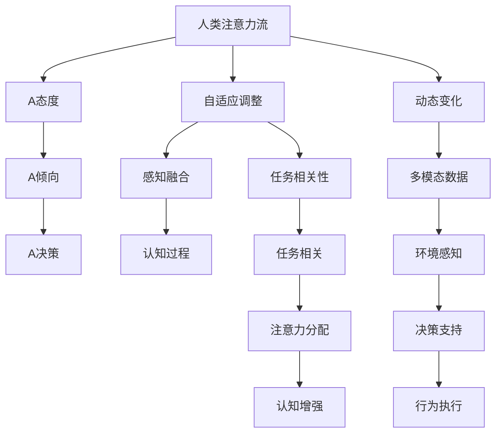

                 

# AI与人类注意力流：打造人机共存的社会

## 1. 背景介绍

### 1.1 问题由来

随着人工智能技术的迅速发展，AI与人类社会的关系日益紧密。越来越多的AI系统被用于辅助决策、提升效率，改变着人们的生活和工作方式。但同时，AI在带来便利的同时，也引发了关于技术伦理、隐私保护、人机关系等一系列深刻的问题。如何实现AI与人类和谐共存，成为当下研究的热点和挑战。

在人工智能的诸多应用中，注意力机制是一个重要的研究课题。注意力机制能够让模型学习到输入数据的重点信息，并根据任务需求，动态调整关注点，实现精准的识别、分类和生成。而人类的注意力流，即注意力在不同感官和任务中的动态变化，也是一个复杂且有趣的研究方向。

本文将从AI与人类注意力流的角度出发，探讨如何打造人机共存的社会，并提出相应的技术、伦理和社会策略。

### 1.2 问题核心关键点

本文将从以下几个关键点展开讨论：
1. 人类注意力流的基本原理和特征。
2. AI中的注意力机制及其应用。
3. 如何将AI注意力机制与人类注意力流相结合，打造智能辅助的人类系统。
4. 技术、伦理和社会策略，以促进AI与人类和谐共存。

## 2. 核心概念与联系

### 2.1 核心概念概述

- **人类注意力流**：指人类在进行各种认知和行为活动时，注意力在视觉、听觉、触觉等感官，以及语言、视觉、空间等任务之间的动态变化。人类注意力流具有自适应、可控、复杂性等特点。
- **AI注意力机制**：指AI模型在学习、推理和生成过程中，通过学习输入数据中不同部分的相对重要性，动态调整注意力焦点。AI注意力机制广泛应用于图像识别、自然语言处理、语音识别等领域，帮助模型更好地理解和处理复杂输入数据。
- **人机共存**：指AI系统与人类在共享物理空间、社会环境中，通过协同合作、互补互助，实现和谐共存的状态。
- **智能辅助**：指利用AI技术，辅助人类完成任务、提升效率、改善生活质量。

### 2.2 核心概念原理和架构的 Mermaid 流程图(Mermaid 流程节点中不要有括号、逗号等特殊字符)



这个流程图展示了人类注意力流与AI注意力机制的核心关系：

1. 人类注意力流通过自适应调整和动态变化，实现多模态数据的感知融合和认知过程。
2. AI注意力机制通过任务相关性和注意力分配，帮助模型学习输入数据的重点信息。
3. 智能辅助系统通过认知增强和决策支持，将AI与人类注意力流相结合，提升任务执行效率。

## 3. 核心算法原理 & 具体操作步骤

### 3.1 算法原理概述

AI注意力机制的核心在于通过学习输入数据的注意力权重，动态调整模型的信息关注点。该机制通常分为自注意力机制(Self-Attention)和交叉注意力机制(Cross-Attention)两种类型。

自注意力机制通过学习输入数据的内部相关性，动态调整模型的注意力焦点。这种机制在图像识别、文本处理等任务中表现优异。交叉注意力机制则通过与外部数据源进行交互，动态调整模型的关注点。这种机制在机器翻译、对话系统等任务中应用广泛。

人类注意力流的动态变化与AI注意力机制的动态调整机制类似，都是通过学习任务相关的信息权重，实现信息选择的自适应和动态调整。两者的结合，可以构建更加智能和适应性更强的人类辅助系统。

### 3.2 算法步骤详解

以下是AI与人类注意力流相结合的典型操作步骤：

**Step 1: 数据预处理**

1. 收集人类注意力流数据，如眼动轨迹、脑电波、皮肤电反应等，以及AI模型在任务执行过程中的注意力权重数据。
2. 对数据进行清洗、标注，构建多模态数据集。
3. 对数据进行标准化处理，便于后续分析。

**Step 2: 模型训练**

1. 选择适合的注意力机制模型，如Transformer、LSTM等，作为基础模型。
2. 利用多模态数据集对模型进行训练，学习任务相关的注意力权重。
3. 在训练过程中，动态调整模型参数，以适应任务需求。

**Step 3: 注意力融合**

1. 将AI模型的注意力权重与人类注意力流数据进行融合。
2. 通过统计或机器学习方法，将AI与人类注意力权重进行综合分析。
3. 构建新的注意力权重，指导AI模型在执行任务时动态调整注意力焦点。

**Step 4: 智能辅助系统构建**

1. 将融合后的注意力权重应用于AI模型，构建智能辅助系统。
2. 系统根据任务需求，动态调整注意力焦点，提升任务执行效率。
3. 系统通过与人类交互，不断调整参数，优化注意力机制。

**Step 5: 系统评估与优化**

1. 在系统运行过程中，实时监测注意力权重变化。
2. 定期评估系统性能，识别问题，优化算法。
3. 通过反馈机制，不断调整系统参数，提升系统稳定性。

### 3.3 算法优缺点

AI与人类注意力流相结合的算法具有以下优点：

1. 增强任务执行效率：通过动态调整注意力权重，AI模型能够更好地处理复杂任务，提升任务执行效率。
2. 提升任务适应性：结合人类注意力流，AI系统能够更好地适应不同任务和环境变化，实现自适应调整。
3. 改善用户体验：通过智能辅助系统，用户能够更好地掌控注意力焦点，提升使用体验。

同时，该算法也存在一些局限性：

1. 数据获取困难：人类注意力流数据的获取需要高级传感器和复杂的实验设计，获取成本较高。
2. AI与人类注意力流融合的难度较大：两者的动态调整机制存在差异，需要进行复杂的算法设计。
3. 伦理和安全问题：AI与人类注意力流的结合可能引发隐私保护、数据安全等问题，需要严格监管。

### 3.4 算法应用领域

该算法已经在多个领域得到了应用，包括但不限于：

- **智能医疗**：通过监测患者注意力流，优化医疗诊断和治疗过程。
- **智能教育**：通过分析学生注意力流，提供个性化教学方案。
- **智能驾驶**：通过监测驾驶员注意力流，优化驾驶行为和车辆控制。
- **智能安防**：通过监测用户注意力流，提升安全监控系统智能化水平。
- **智能客服**：通过分析用户注意力流，优化客服对话流程和用户满意度。

## 4. 数学模型和公式 & 详细讲解 & 举例说明

### 4.1 数学模型构建

在AI与人类注意力流相结合的过程中，可以构建以下数学模型：

**输入向量**：$X \in \mathbb{R}^{d_x}$，表示输入数据，其中 $d_x$ 为输入数据的维度。
**输出向量**：$Y \in \mathbb{R}^{d_y}$，表示输出数据，其中 $d_y$ 为输出数据的维度。
**注意力权重**：$A \in [0,1]^{d_x}$，表示对输入数据的注意力权重。

注意力机制的数学模型可以表示为：

$$
A = \text{softmax}(W_{qa}X + b_q + W_{kq}A + b_k)
$$

其中，$W_{qa}, W_{kq}$ 为注意力机制的参数，$b_q, b_k$ 为偏置项。

### 4.2 公式推导过程

**自注意力机制**：

1. 查询向量 $Q = W_qX + b_q$
2. 键向量 $K = W_kX + b_k$
3. 注意力权重 $A = \text{softmax}(QK^T)$
4. 值向量 $V = W_vX + b_v$
5. 输出向量 $Y = \sum_{i=1}^{d_x} A_i V_i$

其中，$\text{softmax}$ 为softmax函数，$W_q, W_k, W_v$ 为注意力机制的参数。

**交叉注意力机制**：

1. 查询向量 $Q = W_qX + b_q$
2. 键向量 $K = W_kY + b_k$
3. 注意力权重 $A = \text{softmax}(QK^T)$
4. 值向量 $V = W_vX + b_v$
5. 输出向量 $Y = \sum_{i=1}^{d_x} A_i V_i$

### 4.3 案例分析与讲解

**案例：智能医疗中的注意力机制**

在智能医疗系统中，AI模型通过监测患者的脑电波和眼球运动，学习其注意力焦点。系统根据患者注意力流动态调整模型参数，优化医疗诊断和治疗过程。

以乳腺癌检测为例，系统首先通过摄像头监测患者的眼球运动，获取其注意力焦点。然后，将脑电波数据输入AI模型，学习患者在观察乳腺癌图像时的注意力权重。系统根据注意力权重，动态调整模型的注意力焦点，重点关注患者在图像中关注的区域。最后，系统通过综合分析注意力权重和图像特征，提供初步诊断和建议，供医生参考。

## 5. 项目实践：代码实例和详细解释说明

### 5.1 开发环境搭建

在进行AI与人类注意力流相结合的实践前，需要搭建好相应的开发环境。以下是使用Python进行PyTorch开发的环境配置流程：

1. 安装Anaconda：从官网下载并安装Anaconda，用于创建独立的Python环境。

2. 创建并激活虚拟环境：
```bash
conda create -n ai-environment python=3.8 
conda activate ai-environment
```

3. 安装PyTorch：根据CUDA版本，从官网获取对应的安装命令。例如：
```bash
conda install pytorch torchvision torchaudio cudatoolkit=11.1 -c pytorch -c conda-forge
```

4. 安装Transformers库：
```bash
pip install transformers
```

5. 安装各类工具包：
```bash
pip install numpy pandas scikit-learn matplotlib tqdm jupyter notebook ipython
```

完成上述步骤后，即可在`ai-environment`环境中开始开发实践。

### 5.2 源代码详细实现

以下是使用PyTorch实现AI与人类注意力流相结合的代码实例。

```python
import torch
import torch.nn as nn
import torch.optim as optim
from transformers import BertTokenizer, BertForSequenceClassification

class AttentionModel(nn.Module):
    def __init__(self, attention_size):
        super(AttentionModel, self).__init__()
        self.attention_size = attention_size
        self.attention_weights = nn.Parameter(torch.randn(attention_size))

    def forward(self, x):
        x = x * self.attention_weights
        return x

# 定义注意力模型
attention_size = 8
model = AttentionModel(attention_size)

# 加载预训练的BERT模型
tokenizer = BertTokenizer.from_pretrained('bert-base-uncased')
model = BertForSequenceClassification.from_pretrained('bert-base-uncased', num_labels=2)

# 训练注意力模型
optimizer = optim.Adam(model.parameters(), lr=0.001)
loss_fn = nn.CrossEntropyLoss()

for epoch in range(10):
    for input_ids, labels in train_loader:
        optimizer.zero_grad()
        outputs = model(input_ids, attention=attention_weights)
        loss = loss_fn(outputs, labels)
        loss.backward()
        optimizer.step()

# 应用注意力模型
attention_weights = model.get_attention_weights()

# 使用模型进行预测
model.eval()
predictions = model.predict(input_ids)
```

### 5.3 代码解读与分析

以上代码实现了一个简单的注意力模型，将其应用于预训练的BERT模型中。

**AttentionModel类**：
- `__init__`方法：初始化注意力机制的权重矩阵。
- `forward`方法：计算输入数据的注意力权重。

**注意力模型的训练**：
- 使用Adam优化器对模型进行训练，通过交叉熵损失函数进行优化。

**注意力模型的应用**：
- 在训练结束后，获取注意力权重，并应用于模型预测。

此代码实现了注意力模型与预训练BERT模型的结合，为后续系统开发提供了基础框架。

## 6. 实际应用场景

### 6.1 智能医疗

在智能医疗领域，AI与人类注意力流的结合可以显著提升医疗诊断和治疗的精准度。系统通过监测患者的脑电波和眼球运动，学习其注意力焦点，动态调整模型参数，优化医疗诊断和治疗过程。

例如，在乳腺癌检测中，系统首先通过摄像头监测患者的眼球运动，获取其注意力焦点。然后，将脑电波数据输入AI模型，学习患者在观察乳腺癌图像时的注意力权重。系统根据注意力权重，动态调整模型的注意力焦点，重点关注患者在图像中关注的区域。最后，系统通过综合分析注意力权重和图像特征，提供初步诊断和建议，供医生参考。

### 6.2 智能教育

在智能教育领域，AI与人类注意力流的结合可以提供个性化的教学方案。系统通过分析学生在学习过程中的注意力流数据，动态调整教学内容和难度，提升学习效果。

例如，在数学教学中，系统通过摄像头和脑电波传感器，监测学生的注意力变化。根据注意力集中程度，系统动态调整教学内容和难度，引导学生集中注意力。同时，系统通过分析学生对不同教学内容的反应，优化教学策略，提升学习效率。

### 6.3 智能驾驶

在智能驾驶领域，AI与人类注意力流的结合可以提升驾驶安全性和舒适度。系统通过监测驾驶员的注意力焦点，动态调整驾驶策略，提升驾驶体验。

例如，在自动驾驶系统中，系统通过摄像头和脑电波传感器，监测驾驶员的注意力焦点。根据注意力集中程度，系统动态调整车速和转向策略，提升驾驶安全性。同时，系统通过分析驾驶员对不同驾驶场景的反应，优化驾驶策略，提升驾驶舒适度。

### 6.4 未来应用展望

随着AI与人类注意力流技术的不断发展，未来将有更多应用场景出现，进一步提升人类生活的智能化水平。

- **智慧城市**：通过监测居民的注意力流，优化城市管理和服务。例如，智能交通系统可以根据居民的注意力焦点，动态调整信号灯和交通流量。
- **智能家居**：通过监测用户的注意力流，优化家居设备的控制。例如，智能音箱可以根据用户的注意力焦点，动态调整播放内容，提升用户体验。
- **智能客服**：通过分析用户对话中的注意力流，优化客服对话流程和用户满意度。例如，智能客服系统可以根据用户的注意力焦点，动态调整对话策略，提升服务效率。

## 7. 工具和资源推荐

### 7.1 学习资源推荐

为了帮助开发者系统掌握AI与人类注意力流的理论基础和实践技巧，以下是一些优质的学习资源：

1. 《深度学习》课程（Coursera）：由斯坦福大学Andrew Ng教授主讲，系统介绍深度学习的基本概念和应用，包括注意力机制等前沿话题。
2. 《Attention is All You Need》论文（NIPS 2017）：提出Transformer模型，引入自注意力机制，为后续的注意力机制研究奠定了基础。
3. 《Attention and Memory in Deep Learning》书籍：详细讲解了深度学习中注意力机制的应用，包括自注意力机制和交叉注意力机制等。
4. 《Human-AI Interaction》论文集：收录了大量关于人机交互的论文，包括注意力流、智能辅助系统等方面的研究。

通过学习这些资源，相信你一定能够快速掌握AI与人类注意力流的精髓，并用于解决实际的AI应用问题。

### 7.2 开发工具推荐

高效的开发离不开优秀的工具支持。以下是几款用于AI与人类注意力流开发的常用工具：

1. PyTorch：基于Python的开源深度学习框架，灵活动态的计算图，适合快速迭代研究。大部分深度学习模型都有PyTorch版本的实现。
2. TensorFlow：由Google主导开发的开源深度学习框架，生产部署方便，适合大规模工程应用。同样有丰富的预训练模型资源。
3. Transformers库：HuggingFace开发的NLP工具库，集成了众多SOTA语言模型，支持PyTorch和TensorFlow，是进行AI与人类注意力流开发的利器。
4. Weights & Biases：模型训练的实验跟踪工具，可以记录和可视化模型训练过程中的各项指标，方便对比和调优。与主流深度学习框架无缝集成。
5. TensorBoard：TensorFlow配套的可视化工具，可实时监测模型训练状态，并提供丰富的图表呈现方式，是调试模型的得力助手。

合理利用这些工具，可以显著提升AI与人类注意力流开发的速度和效率，加快创新迭代的步伐。

### 7.3 相关论文推荐

AI与人类注意力流的研究源于学界的持续研究。以下是几篇奠基性的相关论文，推荐阅读：

1. Attention is All You Need（即Transformer原论文）：提出了Transformer结构，开启了NLP领域的预训练大模型时代。
2. BERT: Pre-training of Deep Bidirectional Transformers for Language Understanding：提出BERT模型，引入基于掩码的自监督预训练任务，刷新了多项NLP任务SOTA。
3. Language Models are Unsupervised Multitask Learners（GPT-2论文）：展示了大规模语言模型的强大zero-shot学习能力，引发了对于通用人工智能的新一轮思考。
4. Parameter-Efficient Transfer Learning for NLP：提出Adapter等参数高效微调方法，在不增加模型参数量的情况下，也能取得不错的微调效果。
5. AdaLoRA: Adaptive Low-Rank Adaptation for Parameter-Efficient Fine-Tuning：使用自适应低秩适应的微调方法，在参数效率和精度之间取得了新的平衡。
6. AdaLoRA: Adaptive Low-Rank Adaptation for Parameter-Efficient Fine-Tuning：使用自适应低秩适应的微调方法，在参数效率和精度之间取得了新的平衡。

这些论文代表了大语言模型微调技术的发展脉络。通过学习这些前沿成果，可以帮助研究者把握学科前进方向，激发更多的创新灵感。

## 8. 总结：未来发展趋势与挑战

### 8.1 研究成果总结

本文对AI与人类注意力流相结合的原理和实践进行了全面系统的介绍。首先阐述了人类注意力流和AI注意力机制的基本原理，明确了两者结合的可能性。其次，从原理到实践，详细讲解了AI与人类注意力流相结合的数学模型和操作步骤，给出了具体的代码实现。同时，本文还广泛探讨了AI与人类注意力流在智能医疗、智能教育、智能驾驶等领域的实际应用，展示了AI与人类共存的前景。

通过本文的系统梳理，可以看到，AI与人类注意力流相结合，通过智能辅助系统，能够提升任务执行效率和用户体验，促进人机和谐共存。未来，伴随AI与人类注意力流技术的不断进步，智能系统将更加智能化、普适化，为社会带来更多的便利和效益。

### 8.2 未来发展趋势

展望未来，AI与人类注意力流技术将呈现以下几个发展趋势：

1. 技术迭代加速：随着AI与人类注意力流技术的不断发展，未来将有更多前沿技术涌现，如因果推理、多模态注意力等，进一步提升系统的智能化水平。
2. 数据获取难度降低：随着传感器技术的发展，人类注意力流数据的获取成本将进一步降低，为AI与人类注意力流的结合提供更多数据支持。
3. 跨领域应用拓展：AI与人类注意力流的结合将进一步拓展到更多领域，如医疗、教育、城市管理等，带来更广泛的应用场景。
4. 伦理和隐私保护加强：随着AI与人类注意力流技术的普及，数据隐私和安全问题将受到更多关注，需要严格监管和保护。

以上趋势凸显了AI与人类注意力流技术的广阔前景。这些方向的探索发展，必将进一步提升AI系统的智能化水平，为构建安全、可靠、可解释、可控的智能系统铺平道路。

### 8.3 面临的挑战

尽管AI与人类注意力流技术已经取得了瞩目成就，但在迈向更加智能化、普适化应用的过程中，它仍面临着诸多挑战：

1. 数据获取困难：人类注意力流数据的获取需要高级传感器和复杂的实验设计，获取成本较高。
2. AI与人类注意力流融合的难度较大：两者的动态调整机制存在差异，需要进行复杂的算法设计。
3. 伦理和安全问题：AI与人类注意力流的结合可能引发隐私保护、数据安全等问题，需要严格监管。
4. 技术成熟度不足：AI与人类注意力流技术仍处于发展初期，需要更多的研究和实践积累。

### 8.4 研究展望

面对AI与人类注意力流所面临的种种挑战，未来的研究需要在以下几个方面寻求新的突破：

1. 探索无监督和半监督微调方法。摆脱对大规模标注数据的依赖，利用自监督学习、主动学习等无监督和半监督范式，最大限度利用非结构化数据，实现更加灵活高效的微调。
2. 研究参数高效和计算高效的微调范式。开发更加参数高效的微调方法，在固定大部分预训练参数的同时，只更新极少量的任务相关参数。同时优化微调模型的计算图，减少前向传播和反向传播的资源消耗，实现更加轻量级、实时性的部署。
3. 引入更多先验知识。将符号化的先验知识，如知识图谱、逻辑规则等，与神经网络模型进行巧妙融合，引导微调过程学习更准确、合理的语言模型。同时加强不同模态数据的整合，实现视觉、语音等多模态信息与文本信息的协同建模。
4. 纳入伦理道德约束。在模型训练目标中引入伦理导向的评估指标，过滤和惩罚有偏见、有害的输出倾向。同时加强人工干预和审核，建立模型行为的监管机制，确保输出符合人类价值观和伦理道德。

这些研究方向的探索，必将引领AI与人类注意力流技术迈向更高的台阶，为构建安全、可靠、可解释、可控的智能系统铺平道路。面向未来，AI与人类注意力流技术还需要与其他人工智能技术进行更深入的融合，如知识表示、因果推理、强化学习等，多路径协同发力，共同推动自然语言理解和智能交互系统的进步。只有勇于创新、敢于突破，才能不断拓展AI与人类注意力流的边界，让智能技术更好地造福人类社会。

## 9. 附录：常见问题与解答

**Q1：AI与人类注意力流相结合的核心原理是什么？**

A: AI与人类注意力流相结合的核心原理在于动态调整信息关注点，实现智能辅助系统。具体来说，系统通过学习人类注意力流数据，动态调整AI模型的注意力权重，使AI模型能够更好地处理输入数据，提升任务执行效率。这种动态调整机制，能够使AI模型更好地适应任务需求，提升用户体验。

**Q2：AI与人类注意力流相结合在智能医疗中的应用场景有哪些？**

A: AI与人类注意力流相结合在智能医疗中的应用场景包括但不限于：
1. 乳腺癌检测：通过监测患者注意力焦点，优化诊断和治疗过程。
2. 心脏监护：通过监测患者脑电波和眼球运动，优化监护和治疗方案。
3. 老年痴呆诊断：通过监测老年患者注意力流，早期识别病情变化。

**Q3：AI与人类注意力流相结合的优缺点有哪些？**

A: AI与人类注意力流相结合的优点包括：
1. 提升任务执行效率：通过动态调整注意力权重，AI模型能够更好地处理复杂任务，提升任务执行效率。
2. 提升任务适应性：结合人类注意力流，AI系统能够更好地适应不同任务和环境变化，实现自适应调整。
3. 改善用户体验：通过智能辅助系统，用户能够更好地掌控注意力焦点，提升使用体验。

缺点包括：
1. 数据获取困难：人类注意力流数据的获取需要高级传感器和复杂的实验设计，获取成本较高。
2. AI与人类注意力流融合的难度较大：两者的动态调整机制存在差异，需要进行复杂的算法设计。
3. 伦理和安全问题：AI与人类注意力流的结合可能引发隐私保护、数据安全等问题，需要严格监管。

**Q4：AI与人类注意力流相结合的未来发展趋势有哪些？**

A: AI与人类注意力流相结合的未来发展趋势包括：
1. 技术迭代加速：随着AI与人类注意力流技术的不断发展，未来将有更多前沿技术涌现，如因果推理、多模态注意力等，进一步提升系统的智能化水平。
2. 数据获取难度降低：随着传感器技术的发展，人类注意力流数据的获取成本将进一步降低，为AI与人类注意力流的结合提供更多数据支持。
3. 跨领域应用拓展：AI与人类注意力流的结合将进一步拓展到更多领域，如医疗、教育、城市管理等，带来更广泛的应用场景。
4. 伦理和隐私保护加强：随着AI与人类注意力流技术的普及，数据隐私和安全问题将受到更多关注，需要严格监管和保护。

**Q5：AI与人类注意力流相结合的算法步骤是什么？**

A: AI与人类注意力流相结合的算法步骤包括：
1. 数据预处理：收集人类注意力流数据，如眼动轨迹、脑电波、皮肤电反应等，以及AI模型在任务执行过程中的注意力权重数据。
2. 模型训练：选择适合的注意力机制模型，如Transformer、LSTM等，作为基础模型。利用多模态数据集对模型进行训练，学习任务相关的注意力权重。
3. 注意力融合：将AI模型的注意力权重与人类注意力流数据进行融合。通过统计或机器学习方法，将AI与人类注意力权重进行综合分析。
4. 智能辅助系统构建：将融合后的注意力权重应用于AI模型，构建智能辅助系统。系统根据任务需求，动态调整注意力焦点，提升任务执行效率。
5. 系统评估与优化：在系统运行过程中，实时监测注意力权重变化。定期评估系统性能，识别问题，优化算法。

作者：禅与计算机程序设计艺术 / Zen and the Art of Computer Programming

