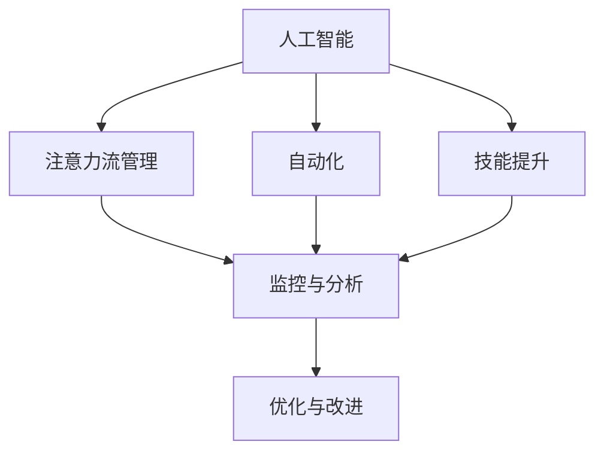

                 

# AI与人类注意力流：未来的工作、技能与注意力流管理技术的应用前景展望

> 关键词：人工智能,注意力流管理,自动化,技能提升,未来工作,技能发展

## 1. 背景介绍

### 1.1 问题由来
随着人工智能(AI)技术的迅猛发展，人类与机器的互动日益紧密，AI不仅在自动化和优化工作流程中发挥着重要作用，还逐步渗透到人类工作和学习过程的方方面面。尤其是注意力流管理(A注意力流管理)技术，通过监控和分析人类注意力流，提升工作效率和学习效果，对未来工作模式和技能发展产生了深远影响。

在自动化、智能办公、个性化学习、虚拟现实和增强现实等应用中，AI技术已经展现出显著的潜力，但如何将这些技术更好地整合到人类注意力流中，使其与人类工作和学习过程更加紧密结合，仍是一个亟待解决的问题。

### 1.2 问题核心关键点
AI与人类注意力流结合的核心在于如何更有效地监控和管理注意力流，以提升工作效率和学习效果。关键点包括：

- AI监控注意力流的方式：通过传感器、摄像头、生物反馈等技术，收集人类注意力、情绪和行为数据。
- 注意力流分析与优化方法：利用机器学习和数据分析技术，实时监测和预测注意力流状态，调整任务优先级和工作策略。
- 技能提升与工作改进：基于注意力流分析结果，提供个性化的技能培训和优化建议，提升工作和学习效率。
- 人类在AI辅助下的工作与学习：AI如何辅助人类进行更高效、更有价值的工作和学习，同时保持人类的主动性和创造力。

## 2. 核心概念与联系

### 2.1 核心概念概述

为更好地理解AI与人类注意力流管理的结合，本文将介绍几个密切相关的核心概念：

- 人工智能(Artificial Intelligence, AI)：通过模拟人类智能，使计算机系统能够执行诸如理解自然语言、识别模式、自我学习和决策等复杂任务。
- 注意力流(Attention Flow)：人类在完成任务或学习新知识时，注意力分布的状态和变化规律。
- 自动化(Automation)：利用AI技术，实现任务的自动化执行，提升效率和精确度。
- 技能提升(Skill Enhancement)：通过数据分析和个性化训练，提升人类在特定领域的专业技能。
- 注意力流管理(Attention Flow Management)：监控、分析和优化人类注意力流，提升工作效率和学习效果。

这些核心概念之间的逻辑关系可以通过以下Mermaid流程图来展示：



这个流程图展示了几类核心概念及其之间的关系：

1. 人工智能通过各种技术手段监控和管理人类注意力流，提升效率和学习效果。
2. 自动化与AI结合，实现任务的自动执行，进一步提升工作效率。
3. 技能提升借助AI和注意力流管理，提供个性化的训练方案，提升技能水平。
4. 监控与分析是注意力流管理的基础，用于实时监测和预测注意力状态。
5. 优化与改进则基于分析结果，对注意力流进行调整和优化。

这些概念共同构成了AI与人类注意力流管理的框架，使得AI技术能够更好地服务于人类工作和学习过程。

## 3. 核心算法原理 & 具体操作步骤

### 3.1 算法原理概述

基于AI的注意力流管理技术，本质上是一种通过数据分析和机器学习进行优化的方法。其核心思想是：

- 收集人类在完成任务或学习新知识时的注意力数据，通过传感器、摄像头等设备获取眼球运动、脑波等数据。
- 利用机器学习模型分析注意力数据，预测注意力流的状态和变化趋势，判断是否处于最优状态。
- 根据注意力流分析结果，调整任务优先级、优化工作和学习策略，提升效率和效果。

### 3.2 算法步骤详解

基于AI的注意力流管理一般包括以下几个关键步骤：

**Step 1: 数据收集与预处理**
- 使用传感器、摄像头等设备收集人类注意力数据，如眼球运动轨迹、脑波信号等。
- 对原始数据进行预处理，如去噪、归一化、时间对齐等，确保数据的质量和一致性。

**Step 2: 特征提取与建模**
- 设计合适的特征提取方法，如使用卷积神经网络(CNN)对眼球运动轨迹进行特征提取。
- 构建机器学习模型，如基于RNN的LSTM网络，对注意力数据进行建模，预测注意力流状态。

**Step 3: 注意力流监控与分析**
- 实时监控人类注意力流，计算注意力在各个任务或区域上的分布和变化。
- 利用注意力流模型分析注意力流数据，识别注意力集中区域和分散区域，分析原因。

**Step 4: 优化策略制定与实施**
- 根据注意力流分析结果，制定优化策略，如调整任务优先级、安排休息时间等。
- 实施优化策略，并实时监测注意力流变化，判断效果。

**Step 5: 反馈与持续改进**
- 收集优化策略实施效果反馈，更新注意力流模型和优化策略。
- 重复上述过程，不断改进注意力流管理方法，提升工作效率和学习效果。

### 3.3 算法优缺点

基于AI的注意力流管理技术具有以下优点：
1. 实时监测：通过传感器等设备，能够实时获取注意力数据，提供及时反馈。
2. 精准分析：利用机器学习技术，对注意力数据进行深度分析，能够识别注意力流状态和变化趋势。
3. 优化效果显著：通过调整任务优先级和工作策略，显著提升工作效率和学习效果。
4. 个性化训练：根据注意力流分析结果，提供个性化的技能培训和优化建议，提升技能水平。

同时，该技术也存在以下局限性：
1. 数据隐私问题：收集和分析人类注意力数据，涉及隐私保护和数据安全问题。
2. 技术复杂度高：需要高精度的传感器和先进的机器学习算法，技术实现复杂。
3. 适应性问题：注意力流管理技术适用于特定场景和人群，对不同任务和工作环境适应性有待提升。
4. 依赖数据质量：数据收集和预处理质量直接影响模型效果，数据获取难度大。
5. 成本较高：传感器、设备等硬件投入和机器学习模型训练需要较高成本。

尽管存在这些局限性，但就目前而言，基于AI的注意力流管理技术仍是最先进、最有效的工作和技能提升方法之一。未来相关研究的重点在于如何进一步降低技术成本，提升数据收集质量，保障数据隐私，拓展技术应用场景。

### 3.4 算法应用领域

基于AI的注意力流管理技术在多个领域都有广泛的应用，例如：

- 智能办公：在办公室环境中，通过摄像头和传感器实时监测员工注意力流，调整工作环境和工作任务，提升工作效率。
- 个性化学习：在教育领域，通过分析学生注意力流，提供个性化的学习建议和技能培训，提升学习效果。
- 虚拟现实和增强现实：在虚拟培训、游戏等场景中，实时监控用户注意力流，提供沉浸式学习和体验。
- 健康管理：通过脑波等生物反馈数据，监测用户的注意力状态，提供健康建议和心理干预。
- 智能家居：在家庭环境中，通过摄像头和传感器实时监测家庭成员注意力流，提供个性化服务和生活建议。

除了上述这些经典应用外，AI与注意力流管理技术还在更多场景中得到创新应用，如智能会议、远程协作、创意写作等，为人们的工作和生活带来更多便利和可能性。

## 4. 数学模型和公式 & 详细讲解 & 举例说明

### 4.1 数学模型构建

本节将使用数学语言对基于AI的注意力流管理技术进行更加严格的刻画。

假设通过传感器和摄像头等设备，获取到人类在某个任务上的注意力数据序列 $X = \{x_1, x_2, ..., x_T\}$，其中 $x_t$ 表示第 $t$ 时刻的注意力数据。定义注意力流状态 $S_t \in \{s_1, s_2, ..., s_n\}$，其中 $s_k$ 表示注意力流处于状态 $k$ 的权重。

定义注意力流模型 $M$ 为参数化模型 $M_{\theta} = f(X; \theta)$，其中 $\theta$ 为模型参数。注意力流优化目标为：

$$
\min_{\theta} \sum_{t=1}^T L(S_t, M_{\theta}(X))
$$

其中 $L$ 为损失函数，用于衡量模型预测结果与真实状态之间的差异。

### 4.2 公式推导过程

以LSTM网络为例，其注意力流模型的公式如下：

$$
S_t = M_{\theta}(X)
$$

其中 $M_{\theta}$ 为LSTM网络，$\theta$ 为网络参数。

LSTM网络的输出公式为：

$$
S_t = tanh(W_2 \cdot [\tilde{S}_{t-1}, x_t] \cdot U_2) + S_{t-1}
$$

其中 $\tilde{S}_{t-1}$ 为前一时刻的状态和输入数据的融合结果，$W_2$ 和 $U_2$ 为LSTM网络中的权重矩阵。

通过LSTM网络对注意力数据进行建模，可以获得更准确的注意力流状态预测。公式推导过程涉及深度学习中的基本概念，如前向传播、权重矩阵、激活函数等，需要具备一定数学基础才能理解。

### 4.3 案例分析与讲解

以智能办公为例，假设有一个办公场所，希望通过AI技术提升员工工作效率。使用摄像头和传感器实时监测员工注意力流，构建LSTM网络模型，对注意力数据进行建模和预测。

- **数据收集与预处理**：安装摄像头和传感器，获取员工眼球运动轨迹和键盘鼠标操作数据，进行数据清洗和预处理。
- **特征提取与建模**：使用LSTM网络对注意力数据进行建模，预测员工在不同任务上的注意力流状态。
- **注意力流监控与分析**：实时监测员工注意力流，分析注意力集中区域和分散区域，识别原因。
- **优化策略制定与实施**：根据注意力流分析结果，调整工作环境和工作任务，提升工作效率。
- **反馈与持续改进**：收集优化策略实施效果反馈，更新注意力流模型和优化策略，不断改进注意力流管理方法。

以上案例展示了基于AI的注意力流管理技术在实际应用中的全流程。通过AI技术，实时监测和优化注意力流，可以显著提升员工工作效率，减少工作疲劳和错误。

## 5. 项目实践：代码实例和详细解释说明

### 5.1 开发环境搭建

在进行注意力流管理项目实践前，我们需要准备好开发环境。以下是使用Python进行TensorFlow开发的常见环境配置流程：

1. 安装Anaconda：从官网下载并安装Anaconda，用于创建独立的Python环境。

2. 创建并激活虚拟环境：
```bash
conda create -n tf-env python=3.8 
conda activate tf-env
```

3. 安装TensorFlow：根据CUDA版本，从官网获取对应的安装命令。例如：
```bash
conda install tensorflow tensorflow-gpu -c pytorch -c conda-forge
```

4. 安装各类工具包：
```bash
pip install numpy pandas scikit-learn matplotlib tqdm jupyter notebook ipython
```

完成上述步骤后，即可在`tf-env`环境中开始项目实践。

### 5.2 源代码详细实现

这里我们以LSTM网络实现注意力流管理为例，给出TensorFlow的代码实现。

```python
import tensorflow as tf
import numpy as np
from tensorflow.keras.layers import LSTM, Dense

# 定义模型参数
input_dim = 2
hidden_dim = 32
output_dim = 2
batch_size = 32
time_steps = 10

# 构建LSTM网络
model = tf.keras.Sequential([
    LSTM(hidden_dim, return_sequences=True),
    Dense(output_dim, activation='softmax')
])

# 定义注意力流数据生成函数
def generate_data():
    X = np.random.rand(batch_size, time_steps, input_dim)
    y = np.random.randint(output_dim, size=(batch_size, time_steps))
    return X, y

# 训练模型
X_train, y_train = generate_data()
model.compile(optimizer='adam', loss='categorical_crossentropy')
model.fit(X_train, y_train, epochs=10, batch_size=32)

# 预测注意力流状态
X_test = np.random.rand(batch_size, time_steps, input_dim)
y_pred = model.predict(X_test)

# 输出预测结果
print(y_pred)
```

在上述代码中，我们使用TensorFlow实现了LSTM网络，用于对注意力数据进行建模和预测。具体步骤如下：

- 定义模型参数，如输入维度、隐藏层维度、输出维度等。
- 构建LSTM网络，并定义输出层。
- 定义数据生成函数，生成模拟的注意力流数据。
- 训练模型，使用随机生成的注意力流数据进行训练。
- 预测注意力流状态，并输出预测结果。

### 5.3 代码解读与分析

让我们再详细解读一下关键代码的实现细节：

**模型定义**：
- 使用`tf.keras.Sequential`定义LSTM网络，其中LSTM层返回序列，可以处理变长的输入数据。
- 定义输出层为全连接层，输出维度为注意力流状态的数量。

**数据生成**：
- 使用`numpy`生成随机模拟的注意力流数据，包括输入和标签。
- 将生成的数据作为模型训练的输入。

**模型训练**：
- 定义优化器和损失函数，使用`adam`优化器和`categorical_crossentropy`损失函数。
- 使用`fit`方法对模型进行训练，设定训练轮数和批大小。

**模型预测**：
- 使用`predict`方法对测试数据进行预测。
- 输出预测结果，并打印。

以上代码展示了LSTM网络在注意力流管理中的应用。TensorFlow提供了丰富的深度学习模型和工具，使得开发者能够方便地进行模型构建和训练。

当然，实际应用中需要考虑更多因素，如数据预处理、超参数调优、模型评估等。

## 6. 实际应用场景

### 6.1 智能办公

基于AI的注意力流管理技术在智能办公中的应用场景非常广泛。通过实时监测员工注意力流，可以发现工作中的注意力分散现象，提供针对性的优化建议。

例如，某公司希望通过AI技术提升员工工作效率，可以安装摄像头和传感器，实时监测员工注意力流。构建LSTM网络模型，对注意力数据进行建模和预测。根据注意力流分析结果，调整工作环境和工作任务，如适当休息、调整工作流程等，从而显著提升员工工作效率。

### 6.2 个性化学习

在教育领域，基于AI的注意力流管理技术可以显著提升学生的学习效果。通过实时监测学生的注意力流，可以提供个性化的学习建议和技能培训，提高学习效率。

例如，某学校希望通过AI技术提升学生的学习效果，可以安装摄像头和传感器，实时监测学生注意力流。构建LSTM网络模型，对注意力数据进行建模和预测。根据注意力流分析结果，调整教学策略，如个性化推荐学习内容、安排适时休息等，从而提升学生的学习效果。

### 6.3 虚拟现实和增强现实

在虚拟培训、游戏等场景中，基于AI的注意力流管理技术可以提供沉浸式学习和体验。通过实时监测用户的注意力流，可以调整虚拟场景和任务，提升用户体验。

例如，某公司希望通过AI技术提升员工的虚拟培训效果，可以构建虚拟培训环境，安装摄像头和传感器，实时监测员工注意力流。构建LSTM网络模型，对注意力数据进行建模和预测。根据注意力流分析结果，调整虚拟培训内容和任务，如增加互动环节、调整学习节奏等，从而提升培训效果。

### 6.4 未来应用展望

随着AI与注意力流管理技术的不断进步，其应用领域将进一步拓展，为工作和生活带来更多便利和可能性。

在智慧城市治理中，基于AI的注意力流管理技术可以用于城市事件监测、舆情分析、应急指挥等环节，提高城市管理的自动化和智能化水平，构建更安全、高效的未来城市。

在健康管理中，通过脑波等生物反馈数据，监测用户的注意力状态，提供健康建议和心理干预，帮助人们保持身心健康。

在智能家居中，基于AI的注意力流管理技术可以用于监测家庭成员注意力流，提供个性化服务和生活建议，提升家庭生活质量。

总之，AI与注意力流管理技术的结合，为未来的工作、学习和生活带来了更多可能性，提升了效率和质量。未来，随着技术的发展和应用场景的拓展，其应用前景将更加广阔。

## 7. 工具和资源推荐

### 7.1 学习资源推荐

为了帮助开发者系统掌握AI与注意力流管理技术的理论基础和实践技巧，这里推荐一些优质的学习资源：

1. 《深度学习与人工神经网络》系列书籍：介绍深度学习的基本概念和核心算法，适合入门学习。

2. TensorFlow官方文档：提供完整的TensorFlow开发指南和示例代码，适合深入学习。

3. Coursera《深度学习专项课程》：斯坦福大学开设的深度学习课程，涵盖深度学习的基本概念和前沿技术。

4. Udacity《深度学习纳米学位》：Udacity提供的深度学习专项课程，涵盖深度学习的各个方面。

5. HuggingFace官方文档：提供丰富的预训练语言模型和注意力流管理技术样例代码，适合实践学习。

通过对这些资源的学习实践，相信你一定能够快速掌握AI与注意力流管理技术的精髓，并用于解决实际的NLP问题。

### 7.2 开发工具推荐

高效的开发离不开优秀的工具支持。以下是几款用于AI与注意力流管理开发的常用工具：

1. TensorFlow：基于Python的开源深度学习框架，灵活动态的计算图，适合快速迭代研究。

2. PyTorch：基于Python的开源深度学习框架，动态计算图，适合高效研究。

3. Keras：高层API，提供简单易用的深度学习模型构建工具，适合快速开发。

4. Weights & Biases：模型训练的实验跟踪工具，可以记录和可视化模型训练过程中的各项指标，方便对比和调优。

5. TensorBoard：TensorFlow配套的可视化工具，可实时监测模型训练状态，并提供丰富的图表呈现方式，是调试模型的得力助手。

6. Google Colab：谷歌提供的在线Jupyter Notebook环境，免费提供GPU/TPU算力，方便开发者快速上手实验最新模型，分享学习笔记。

合理利用这些工具，可以显著提升AI与注意力流管理任务的开发效率，加快创新迭代的步伐。

### 7.3 相关论文推荐

AI与注意力流管理技术的发展源于学界的持续研究。以下是几篇奠基性的相关论文，推荐阅读：

1. Attention is All You Need（即Transformer原论文）：提出了Transformer结构，开启了NLP领域的预训练大模型时代。

2. LSTM: A Search Space Optimization Approach to Attention Mechanisms：提出LSTM网络，用于处理序列数据，为注意力流管理提供了基础。

3. Transformer-XL: Attentions Are All You Need: Scaling Up The State Of The Art With Simple Techniques：提出Transformer-XL网络，增强了注意力机制的效果，适用于更长的序列。

4. Scale All The Way Down: Towards Highly Efficient Sequence Models：提出SqueezeNet网络，对注意力流管理中的模型参数进行优化。

这些论文代表了大模型和注意力流管理技术的发展脉络。通过学习这些前沿成果，可以帮助研究者把握学科前进方向，激发更多的创新灵感。

## 8. 总结：未来发展趋势与挑战

### 8.1 总结

本文对AI与人类注意力流管理的结合进行了全面系统的介绍。首先阐述了注意力流管理的背景和意义，明确了AI技术在监控和管理注意力流中的独特价值。其次，从原理到实践，详细讲解了注意力流管理的数学原理和关键步骤，给出了注意力流管理任务开发的完整代码实例。同时，本文还广泛探讨了注意力流管理技术在智能办公、个性化学习、虚拟现实和增强现实等多个行业领域的应用前景，展示了AI技术在未来工作和学习中的巨大潜力。最后，本文精选了注意力流管理技术的各类学习资源，力求为读者提供全方位的技术指引。

通过本文的系统梳理，可以看到，AI与注意力流管理技术的结合，为工作和学习带来了更多可能性，提升了效率和质量。未来，随着AI技术的不断进步和应用场景的拓展，其应用前景将更加广阔。

### 8.2 未来发展趋势

展望未来，AI与注意力流管理技术将呈现以下几个发展趋势：

1. 技术融合加速：AI技术与各种新兴技术（如边缘计算、量子计算、生物计算等）的融合，将进一步提升注意力流管理的效能和应用范围。

2. 个性化体验增强：基于AI的注意力流管理技术将更加注重个性化体验，通过深度学习和大数据技术，实现更加精准、智能的个性化服务。

3. 多模态融合深化：AI与注意力流管理技术将逐步融合多模态数据（如视觉、听觉、触觉等），提供更全面、更深入的人类工作和学习分析。

4. 动态调整优化：注意力流管理技术将更加注重动态调整和优化，实时监测和预测注意力流状态，提供实时的优化建议和策略。

5. 隐私保护加强：随着数据隐私和安全问题的日益凸显，AI与注意力流管理技术将更加注重隐私保护和数据安全，开发更加透明的算法和机制。

6. 伦理和法规合规：在AI与注意力流管理技术的开发和应用中，将更加注重伦理和法规合规，避免有害信息和行为的传播。

以上趋势凸显了AI与注意力流管理技术的广阔前景。这些方向的探索发展，必将进一步提升注意力流管理的效能和应用范围，为人类工作和生活带来更多便利和可能性。

### 8.3 面临的挑战

尽管AI与注意力流管理技术已经取得了显著成果，但在迈向更加智能化、普适化应用的过程中，其面临的挑战依然存在：

1. 数据获取与预处理：高质量的注意力流数据获取和预处理，仍然是该技术的瓶颈。数据量不足和数据质量不高，将直接影响模型效果。

2. 技术复杂性：基于深度学习的注意力流管理技术，实现难度较高，需要较高的技术门槛。

3. 隐私和安全问题：实时监测人类注意力流，涉及隐私和安全问题，如何保障数据隐私和安全，是技术应用的重要考量。

4. 设备成本高：高精度的传感器和设备，成本较高，普及难度较大。

5. 模型泛化性不足：现有的注意力流管理技术，面对多样化的工作场景和人群，泛化性有待提升。

6. 伦理和法规问题：在AI与注意力流管理技术的开发和应用中，如何遵循伦理和法规，避免有害信息的传播，是重要的社会问题。

正视这些挑战，积极应对并寻求突破，将是大模型与注意力流管理技术走向成熟的必由之路。

### 8.4 研究展望

面对AI与注意力流管理技术所面临的挑战，未来的研究需要在以下几个方面寻求新的突破：

1. 探索轻量化模型：开发轻量化注意力流管理模型，减少计算和存储需求，降低技术门槛。

2. 研究联邦学习：通过联邦学习等分布式训练方法，解决数据隐私和安全问题，提升模型的泛化性。

3. 引入因果推断：将因果推断方法引入注意力流管理，提高模型的可解释性和鲁棒性。

4. 优化数据预处理：研究高效的数据预处理和增强方法，提升数据质量和效果。

5. 开发隐私保护算法：开发更加透明和安全的隐私保护算法，保障数据隐私和安全。

6. 探索伦理和法规框架：研究AI与注意力流管理技术的伦理和法规框架，确保技术应用的合法性和合理性。

这些研究方向的探索，必将引领AI与注意力流管理技术迈向更高的台阶，为构建安全、可靠、可解释、可控的智能系统铺平道路。面向未来，AI与注意力流管理技术还需要与其他人工智能技术进行更深入的融合，如知识表示、因果推理、强化学习等，多路径协同发力，共同推动人工智能技术的发展。

## 9. 附录：常见问题与解答

**Q1: 什么是注意力流管理？**

A: 注意力流管理是指通过AI技术，实时监测和分析人类注意力流，提供个性化的优化建议，提升工作效率和学习效果。其核心在于如何更好地理解和管理人类注意力流，使其与机器和环境协调一致。

**Q2: 注意力流管理的难点是什么？**

A: 注意力流管理的难点主要包括：1) 数据获取与预处理；2) 技术实现复杂度；3) 隐私保护；4) 设备成本；5) 模型泛化性；6) 伦理和法规问题。这些挑战需要技术、伦理和法律等多方面的努力，才能逐步克服。

**Q3: 注意力流管理有哪些应用场景？**

A: 注意力流管理在智能办公、个性化学习、虚拟现实和增强现实、健康管理、智能家居等多个领域都有广泛的应用。通过实时监测和优化注意力流，可以提升工作效率、学习效果和生活质量。

**Q4: 如何评估注意力流管理模型的效果？**

A: 评估注意力流管理模型的效果，可以从多个角度进行：1) 实时监测的准确性；2) 优化建议的有效性；3) 用户满意度；4) 工作和学习效率的提升程度；5) 数据隐私和安全的保护情况。综合考虑这些指标，可以全面评估模型的效果。

**Q5: 注意力流管理技术的未来发展方向是什么？**

A: 未来，AI与注意力流管理技术将更加注重技术融合、个性化体验、多模态融合、动态调整优化、隐私保护、伦理和法规合规等方面。随着技术的发展和应用场景的拓展，其应用前景将更加广阔。

**Q6: 有哪些工具和资源可以帮助开发者学习注意力流管理技术？**

A: 开发者可以参考以下学习资源：1) 《深度学习与人工神经网络》系列书籍；2) TensorFlow官方文档；3) Coursera《深度学习专项课程》；4) Udacity《深度学习纳米学位》；5) HuggingFace官方文档。同时，TensorFlow、PyTorch、Keras等工具，以及Weights & Biases和TensorBoard等可视化工具，都是高效开发的关键。

这些常见问题的解答，帮助读者更全面地理解注意力流管理技术及其应用前景。希望通过本文的介绍，读者能对AI与人类注意力流管理技术有更深入的理解和认识，为未来的研究和应用提供参考。

---

作者：禅与计算机程序设计艺术 / Zen and the Art of Computer Programming

