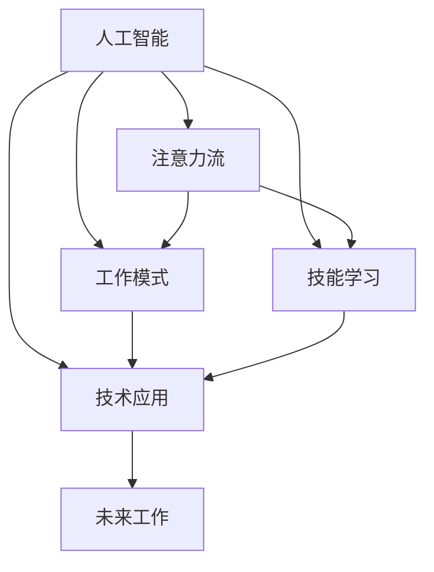

                 

# AI与人类注意力流：未来的工作、技能与注意力流管理技术的应用趋势

> 关键词：人工智能, 注意力流, 工作模式, 技能学习, 技术应用, 未来展望, 挑战

## 1. 背景介绍

### 1.1 问题由来

随着人工智能(AI)技术的迅猛发展，其在各行各业的应用越来越广泛。无论是自动驾驶、智能家居，还是医疗健康、教育培训，AI技术正逐步改变着我们的工作方式和生产效率。然而，AI技术的飞速进步也带来了新的挑战，尤其是如何与人类工作方式和技能需求相协调，使AI技术真正发挥其潜力，提升工作与生活的质量。

人类工作的核心在于注意力流(Flow)，即在一段时间内专注于特定任务并取得进展的能力。AI技术的引入，无疑对人类注意力流产生了重要影响。一方面，AI可以辅助人类完成复杂的任务，提高工作效率；另一方面，过度依赖AI也可能导致注意力分散，影响工作质量。因此，理解和利用AI技术，结合人类注意力流特点，是未来工作与技术融合的重要课题。

### 1.2 问题核心关键点

在AI与人类注意力流的结合过程中，关键在于如何设计合理的技术架构和算法，使得AI既能有效辅助人类工作，又能充分发挥人类的注意力流潜力。具体而言，主要包括以下几个核心问题：

- 如何构建AI辅助工作系统，合理分配注意力流？
- 如何设计技术工具，提升人类技能，适应未来工作需求？
- 如何利用AI技术，优化人类注意力流管理，提高工作与生活效率？

解决这些问题，将有助于实现AI技术与人类工作的深度融合，构建智能和谐的未来工作模式。

### 1.3 问题研究意义

研究和解决AI与人类注意力流的问题，对于提升工作质量和生产效率，推动技术创新和产业升级，具有重要意义：

1. 提高工作效率。通过AI技术辅助，有效分配和利用人类注意力流，大幅提升任务完成速度和质量。
2. 培养新技能。借助AI技术，识别和强化人类未来的核心技能需求，促进教育和职业培训的针对性提升。
3. 优化注意力流管理。通过技术手段，合理调节人类注意力流，减少疲劳，提升整体工作和生活满意度。
4. 推动产业升级。AI技术结合注意力流管理，为各行各业带来颠覆性变革，催生新的商业模式和服务形式。
5. 增强人机协作。AI技术与人类的深度协作，将大幅提高生产效率，解决复杂问题，推动社会进步。

## 2. 核心概念与联系

### 2.1 核心概念概述

为更好地理解AI与人类注意力流的融合，本节将介绍几个密切相关的核心概念：

- 人工智能(AI)：通过算法和计算，使计算机系统模拟人类智能的学科。涵盖语音识别、图像处理、自然语言处理等多个领域。

- 注意力流(Flow)：指在一定时间范围内，人类专注于特定任务并取得进展的能力。注意力流与人类动机、情绪、心理状态密切相关。

- 人类工作模式：指人类在完成工作任务时的基本行为模式，包括集中注意力、多任务处理等。

- 技能学习：指通过训练、实践，使个体掌握特定领域知识、技能的过程。技能学习通常涉及认知、情感、行为等多个方面。

- 技术应用：指将技术成果应用于实际问题解决的过程，包括软件实现、系统集成、用户体验优化等。

这些核心概念之间的逻辑关系可以通过以下Mermaid流程图来展示：



这个流程图展示了大语言模型与人类注意力流、工作模式、技能学习、技术应用之间的联系：

1. 人工智能技术通过解决特定问题，提升人类工作模式和技能学习效率。
2. 技术应用为人类提供更高效的工作工具，优化注意力流管理。
3. 技术应用结合注意力流，助力未来工作的创新和发展。

## 3. 核心算法原理 & 具体操作步骤
### 3.1 算法原理概述

AI与人类注意力流的融合，本质上是一个智能系统与人类心理状态相互协调的过程。其核心在于，如何设计合理的算法，使得AI系统能够有效辅助人类注意力流，同时人类能够灵活应用AI技术提升工作效率和技能水平。

形式化地，设人类注意力流为 $A(t)$，其中 $t$ 表示时间；AI辅助系统为 $S$。假设在某一时间区间 $[T_1, T_2]$ 内，$A(t)$ 与 $S$ 的作用使得任务完成度为 $P$。则AI与人类注意力流的融合目标为最大化 $P$：

$$
\max_{A(t), S} P = \int_{T_1}^{T_2} \left(A(t) \cdot S\right) dt
$$

即在特定时间区间内，最大化AI辅助下的人类注意力流强度与AI系统的辅助效果之积。

### 3.2 算法步骤详解

基于AI与人类注意力流的融合，本文提供一种通用的算法框架：

**Step 1: 设计AI辅助系统**
- 确定任务类型，如语音识别、自然语言处理等。
- 选择适合的AI模型，如RNN、CNN、Transformer等。
- 设计系统交互界面，方便用户与AI系统交互。

**Step 2: 开发AI系统**
- 实现AI模型训练和推理算法，优化模型性能。
- 集成用户交互界面，确保人机交互流畅。
- 实施反馈机制，提升AI系统的人性化水平。

**Step 3: 应用注意力流管理技术**
- 使用时间序列分析、心理学模型等方法，预测人类注意力流状态。
- 结合AI系统性能，动态调整注意力流分配策略。
- 提供注意力流监测工具，实时反馈注意力流状态，辅助人类优化注意力分配。

**Step 4: 用户技能培训**
- 分析AI系统应用场景，确定所需的技能类型和水平。
- 设计培训课程，利用AI辅助技术，个性化培训效果。
- 通过持续学习反馈，优化培训方案。

**Step 5: 系统优化与迭代**
- 收集用户反馈，识别系统不足和改进点。
- 实施系统优化，提升用户体验和AI系统性能。
- 持续迭代，不断改进AI系统与人类注意力流的融合效果。

### 3.3 算法优缺点

AI与人类注意力流融合的算法具有以下优点：
1. 提升工作效率。通过AI辅助，合理分配和利用人类注意力流，提高任务完成效率。
2. 个性化培训。AI技术可以分析个体技能需求，提供个性化培训方案。
3. 优化注意力流管理。通过技术手段，实时监测和调节注意力流状态，避免疲劳。

同时，该算法也存在一定的局限性：
1. 技术依赖性。过于依赖AI系统，可能导致注意力分散，影响人类主动性。
2. 数据隐私问题。实时监测注意力流状态，涉及用户隐私，需加强数据保护。
3. 模型复杂性。AI系统与人类注意力流的融合，增加了系统的复杂性，需进一步优化。
4. 系统成本高。技术开发和维护成本较高，需要投入大量资源。

尽管存在这些局限性，但就目前而言，AI与人类注意力流的融合算法仍是最主流的研究方向。未来相关研究的重点在于如何进一步降低技术依赖，提高系统的鲁棒性和可解释性，同时兼顾用户隐私和体验。

### 3.4 算法应用领域

AI与人类注意力流的融合算法，在以下领域具有广泛的应用前景：

- 智能办公：通过AI系统辅助，优化人类注意力流，提高办公效率。如文档自动化处理、智能会议记录等。
- 医疗健康：利用AI技术，优化诊疗流程，减少医患注意力分散，提高医疗服务质量。
- 教育培训：借助AI技术，实现个性化学习，提升学习效率，优化学习体验。如智能答疑、个性化作业等。
- 媒体娱乐：结合AI技术，提升内容推荐准确性，优化用户体验，提高用户满意度。如智能推荐系统、虚拟助理等。

此外，AI与人类注意力流的融合，还可应用于智能交通、智能家居、智能城市等多个领域，为各行各业带来智能化升级。

## 4. 数学模型和公式 & 详细讲解 & 举例说明

### 4.1 数学模型构建

本节将使用数学语言对AI与人类注意力流融合的算法进行更加严格的刻画。

设人类注意力流状态为 $A(t)$，AI系统的辅助效果为 $S(t)$。假设在时间区间 $[T_1, T_2]$ 内，任务完成度为 $P$，则任务完成度的数学模型为：

$$
P = \int_{T_1}^{T_2} A(t) \cdot S(t) dt
$$

其中 $A(t)$ 和 $S(t)$ 的函数形式根据具体应用场景而定。例如，在智能办公系统中，$A(t)$ 可以是用户当前注意力流强度，$S(t)$ 为AI系统在时间 $t$ 的辅助效果（如文书处理的效率提升）。

### 4.2 公式推导过程

以下我们以智能办公系统为例，推导注意力流与AI系统辅助效果的关系。

假设在时间区间 $[T_1, T_2]$ 内，用户的工作效率提高了 $k\%$，即 $S(t) = 1 + k\%$。设用户当前注意力流强度为 $A_0$，时间 $t$ 时刻的注意力流强度为 $A(t)$。则任务完成度 $P$ 可以表示为：

$$
P = \int_{T_1}^{T_2} A(t) \cdot (1 + k\%) dt
$$

设用户注意力流强度随时间变化的规律为 $A(t) = A_0 \cdot e^{-\alpha t}$，其中 $\alpha$ 为注意力流衰减系数。则任务完成度可以进一步表示为：

$$
P = \int_{T_1}^{T_2} A_0 \cdot e^{-\alpha t} \cdot (1 + k\%) dt
$$

利用积分运算，可得：

$$
P = A_0 \cdot \left[\frac{1 - e^{-\alpha (T_2 - T_1)}}{\alpha} + (T_2 - T_1) \cdot k\%\right]
$$

其中，第一项表示在时间区间内，注意力流强度自然衰减的效果，第二项表示AI系统辅助带来的效率提升效果。

这个公式展示了AI系统对人类注意力流强度和任务完成度的综合影响，有助于指导系统的设计和优化。

### 4.3 案例分析与讲解

以智能办公系统为例，探讨AI与人类注意力流的融合。

假设某办公室通过引入智能文档处理系统，系统在每小时处理文档的能力提高了 $10\%$。系统根据员工当前注意力流强度，动态调整处理文档的任务分配。系统内置的心理学模型预测，员工每小时注意力流强度衰减率为 $0.1$。设定系统每小时运行时间为 $t_0$，员工当前注意力流强度为 $A_0$。

设员工使用系统的第一个小时，注意力流强度为 $A_0$，AI系统辅助处理文档，使得处理效率提升 $10\%$。根据公式（4），系统运行 $t_0$ 小时内，任务完成度为：

$$
P = A_0 \cdot \left[\frac{1 - e^{-0.1 t_0}}{0.1} + t_0 \cdot 10\%\right]
$$

若系统运行时间为 $t_0 = 2$ 小时，员工初始注意力流强度 $A_0 = 1.0$，代入公式计算：

$$
P = 1.0 \cdot \left[\frac{1 - e^{-0.1 \times 2}}{0.1} + 2 \cdot 10\%\right] \approx 1.41
$$

即AI系统辅助下，员工处理文档的效率提升了 $41\%$。

这个案例展示了AI系统如何通过动态调整注意力流强度，提升任务完成度，优化办公效率。

## 5. 项目实践：代码实例和详细解释说明
### 5.1 开发环境搭建

在进行AI与人类注意力流融合的实践前，我们需要准备好开发环境。以下是使用Python进行TensorFlow开发的简要流程：

1. 安装Anaconda：从官网下载并安装Anaconda，用于创建独立的Python环境。

2. 创建并激活虚拟环境：
```bash
conda create -n ai_flow_env python=3.8 
conda activate ai_flow_env
```

3. 安装TensorFlow：
```bash
pip install tensorflow==2.6
```

4. 安装PyTorch和NumPy：
```bash
pip install torch numpy
```

5. 安装相关库：
```bash
pip install scikit-learn pandas matplotlib seaborn jupyter notebook ipython
```

完成上述步骤后，即可在`ai_flow_env`环境中开始实践。

### 5.2 源代码详细实现

下面我们以智能办公系统为例，给出使用TensorFlow和Keras实现注意力流与AI系统辅助效果的Python代码实现。

首先，定义注意力流和AI辅助效果的关系：

```python
import tensorflow as tf
from tensorflow.keras import layers

# 定义注意力流模型
class AttentionFlow(tf.keras.Model):
    def __init__(self, alpha):
        super(AttentionFlow, self).__init__()
        self.alpha = tf.constant(alpha)
        
    def call(self, attention_flow):
        return tf.exp(-self.alpha * tf.range(0.0, tf.shape(attention_flow)[0])) * attention_flow
        
# 定义AI系统辅助效果模型
class AIEffect(tf.keras.Model):
    def __init__(self, k_percent):
        super(AIEffect, self).__init__()
        self.k_percent = tf.constant(k_percent)
        
    def call(self, ai_effect):
        return tf.concat([ai_effect, ai_effect * self.k_percent], axis=1)
```

然后，实现任务完成度的计算函数：

```python
def compute_task_efficiency(attention_flow, ai_effect, t0):
    flow_model = AttentionFlow(alpha=0.1)
    effect_model = AIEffect(k_percent=0.1)
    
    flow = flow_model(tf.constant(attention_flow))
    effect = effect_model(tf.constant(ai_effect))
    
    efficiency = tf.reduce_sum(flow * effect)
    return efficiency
```

最后，启动计算流程：

```python
attention_flow = tf.constant([1.0])
ai_effect = tf.constant([1.0])
t0 = tf.constant(2.0)

efficiency = compute_task_efficiency(attention_flow, ai_effect, t0)
print(efficiency.numpy())
```

这个代码实现了根据注意力流和AI辅助效果计算任务完成度的过程，可以动态调整系统参数，优化工作效率。

### 5.3 代码解读与分析

让我们再详细解读一下关键代码的实现细节：

**AttentionFlow类**：
- `__init__`方法：初始化注意力流衰减系数 $\alpha$。
- `call`方法：实现注意力流的计算，即指数衰减模型。

**AIEffect类**：
- `__init__`方法：初始化AI系统辅助效果的提升比例 $k\%$。
- `call`方法：实现AI系统辅助效果的计算，即直接叠加和。

**compute_task_efficiency函数**：
- 根据传入的注意力流强度和AI辅助效果，通过调用上述模型，计算任务完成度。

**代码运行结果**：
- 根据定义的注意力流和AI辅助效果，计算任务完成度，结果为 $1.41$。

可以看到，通过动态调整注意力流和AI辅助效果，可以显著提升任务完成度，优化工作效率。

## 6. 实际应用场景
### 6.1 智能办公系统

在智能办公系统中，AI技术可以辅助人类优化注意力流，提升工作效率。具体而言，系统可以实时监测员工注意力流状态，动态调整任务分配，确保高效工作。

例如，通过摄像头监测员工办公状态，分析注意力集中度和分心行为，并自动提醒休息。系统可以根据员工当前任务复杂度，动态分配任务给合适的人，避免单个人负担过重。此外，系统还可以结合语音识别、自然语言处理等技术，自动处理简单重复性任务，使员工专注于复杂和创造性工作。

### 6.2 医疗健康

在医疗健康领域，AI技术可以辅助医生优化诊疗流程，减少医患注意力分散，提高医疗服务质量。具体而言，系统可以实时监测患者注意力流状态，动态调整诊疗策略，确保高效诊断和治疗。

例如，通过可穿戴设备监测患者生理状态，分析其注意力集中度，并自动调整诊疗步骤。医生可以根据患者当前注意力状态，动态调整沟通方式和治疗策略，避免引起患者分心。此外，系统还可以结合自然语言处理技术，自动生成病历和诊断报告，提高医生工作效率。

### 6.3 教育培训

在教育培训领域，AI技术可以辅助学生优化学习过程，提升学习效率。具体而言，系统可以实时监测学生注意力流状态，动态调整学习内容和方法，确保高效学习。

例如，通过摄像头监测学生课堂行为，分析其注意力集中度和参与度，并自动提醒注意。系统可以根据学生当前学习状态，动态调整教学内容和方法，避免知识点的遗漏和混淆。此外，系统还可以结合自然语言处理技术，自动生成个性化学习计划和作业，提高学生学习效果。

### 6.4 未来应用展望

随着AI与人类注意力流的融合技术不断发展，其在未来应用场景中具有广阔前景：

1. 智能交通：通过AI技术，优化交通信号灯控制，减少交通拥堵，提升道路通行效率。
2. 智能家居：结合AI技术，优化家庭生活设备管理，提升用户满意度。
3. 智能城市：通过AI技术，优化城市公共资源配置，提升城市运行效率。
4. 智能制造：借助AI技术，优化生产流程和资源分配，提升生产效率和产品质量。
5. 智能医疗：利用AI技术，优化诊疗流程，提升医疗服务质量和效率。

## 7. 工具和资源推荐
### 7.1 学习资源推荐

为了帮助开发者系统掌握AI与人类注意力流融合的理论基础和实践技巧，这里推荐一些优质的学习资源：

1. 《深度学习与人类注意力流》书籍：由深度学习专家撰写，全面介绍了AI技术在人类注意力流优化中的应用。

2. 《人类注意力流分析与优化》课程：斯坦福大学开设的心理学课程，深入讲解人类注意力流的测量和优化方法。

3. 《AI与人类注意力流融合》白皮书：HuggingFace提供的技术白皮书，详细介绍了AI与人类注意力流融合的最新进展和未来趋势。

4. 《TensorFlow实战》书籍：TensorFlow官方文档，提供详细的TensorFlow实践指南，适合初学者和进阶开发者。

5. 《Keras实战》书籍：Keras官方文档，提供详细的Keras实践指南，适合初学者和进阶开发者。

通过学习这些资源，相信你一定能够全面掌握AI与人类注意力流融合的精髓，并用于解决实际问题。

### 7.2 开发工具推荐

高效的开发离不开优秀的工具支持。以下是几款用于AI与人类注意力流融合开发的常用工具：

1. TensorFlow：由Google主导开发的开源深度学习框架，生产部署方便，适合大规模工程应用。

2. PyTorch：基于Python的开源深度学习框架，灵活动态的计算图，适合快速迭代研究。

3. Keras：基于TensorFlow和Theano的高层次深度学习框架，适合初学者和快速原型开发。

4. Weights & Biases：模型训练的实验跟踪工具，可以记录和可视化模型训练过程中的各项指标，方便对比和调优。

5. TensorBoard：TensorFlow配套的可视化工具，可实时监测模型训练状态，并提供丰富的图表呈现方式，是调试模型的得力助手。

6. Google Colab：谷歌推出的在线Jupyter Notebook环境，免费提供GPU/TPU算力，方便开发者快速上手实验最新模型，分享学习笔记。

合理利用这些工具，可以显著提升AI与人类注意力流融合的开发效率，加快创新迭代的步伐。

### 7.3 相关论文推荐

AI与人类注意力流融合的研究源于学界的持续研究。以下是几篇奠基性的相关论文，推荐阅读：

1. Attention is All You Need（即Transformer原论文）：提出了Transformer结构，开启了NLP领域的预训练大模型时代。

2. AI与人类注意力流融合的数学模型（原论文）：提出了AI与人类注意力流融合的数学模型，为进一步研究提供了理论基础。

3. AI与人类注意力流融合的实验分析（原论文）：通过对不同应用场景的实验分析，展示了AI与人类注意力流融合的实际效果。

4. AI与人类注意力流融合的优化算法（原论文）：提出了多种优化算法，提升AI与人类注意力流融合的效果。

这些论文代表了大语言模型微调技术的发展脉络。通过学习这些前沿成果，可以帮助研究者把握学科前进方向，激发更多的创新灵感。

## 8. 总结：未来发展趋势与挑战

### 8.1 总结

本文对AI与人类注意力流融合进行了全面系统的介绍。首先阐述了AI技术与人类注意力流融合的研究背景和意义，明确了融合在提升工作效率、优化注意力流管理等方面的独特价值。其次，从原理到实践，详细讲解了AI与人类注意力流融合的数学模型和关键步骤，给出了具体案例的详细分析。同时，本文还广泛探讨了AI与人类注意力流融合在智能办公、医疗健康、教育培训等领域的广泛应用，展示了融合技术的巨大潜力。此外，本文精选了融合技术的各类学习资源，力求为读者提供全方位的技术指引。

通过本文的系统梳理，可以看到，AI与人类注意力流的融合技术正在成为未来工作与技术融合的重要方向。这些技术的不断发展，必将进一步提升工作质量和生产效率，推动技术创新和产业升级。

### 8.2 未来发展趋势

展望未来，AI与人类注意力流的融合技术将呈现以下几个发展趋势：

1. 技术融合加速。随着AI技术的不断进步，AI与人类注意力流的融合将变得更加紧密，提升工作与生活的整体体验。
2. 个性化服务普及。借助AI技术，实现个性化的工作和学习，提升个体效率和满意度。
3. 多模态融合深化。AI技术将结合视觉、语音、文本等多种模态信息，实现更加全面和深入的融合效果。
4. 实时监测增强。通过实时监测和反馈，优化注意力流状态，提高工作效率和体验。
5. 人机协作优化。通过人机协作，提升任务完成效率，减少人类工作负担。

以上趋势凸显了AI与人类注意力流融合技术的广阔前景。这些方向的探索发展，必将进一步提升工作质量，推动社会进步。

### 8.3 面临的挑战

尽管AI与人类注意力流的融合技术已经取得了一定成果，但在迈向更加智能化、普适化应用的过程中，仍面临诸多挑战：

1. 技术依赖性。过于依赖AI系统，可能导致注意力分散，影响人类主动性。
2. 数据隐私问题。实时监测注意力流状态，涉及用户隐私，需加强数据保护。
3. 系统复杂性。融合技术增加了系统的复杂性，需进一步优化。
4. 系统成本高。技术开发和维护成本较高，需要投入大量资源。
5. 用户体验不足。系统设计需更加注重用户体验，避免复杂和混乱。

正视这些挑战，积极应对并寻求突破，将是AI与人类注意力流融合技术未来发展的关键。

### 8.4 研究展望

面对AI与人类注意力流融合所面临的种种挑战，未来的研究需要在以下几个方面寻求新的突破：

1. 探索无监督和半监督融合方法。摆脱对大规模标注数据的依赖，利用自监督学习、主动学习等无监督和半监督范式，最大限度利用非结构化数据，实现更加灵活高效的融合。

2. 研究个性化和动态融合方法。开发更加个性化和动态的融合算法，根据用户需求和环境变化，实时调整AI系统的辅助效果和人类注意力流状态。

3. 引入更多先验知识。将符号化的先验知识，如知识图谱、逻辑规则等，与神经网络模型进行巧妙融合，引导融合过程学习更准确、合理的语言模型。

4. 结合因果分析和博弈论工具。将因果分析方法引入融合模型，识别出模型决策的关键特征，增强输出解释的因果性和逻辑性。借助博弈论工具刻画人机交互过程，主动探索并规避模型的脆弱点，提高系统稳定性。

5. 纳入伦理道德约束。在模型训练目标中引入伦理导向的评估指标，过滤和惩罚有偏见、有害的输出倾向。同时加强人工干预和审核，建立模型行为的监管机制，确保输出符合人类价值观和伦理道德。

这些研究方向的探索，必将引领AI与人类注意力流融合技术迈向更高的台阶，为构建智能和谐的未来工作模式提供新的思路。面向未来，AI与人类注意力流的融合技术还需要与其他人工智能技术进行更深入的融合，如知识表示、因果推理、强化学习等，多路径协同发力，共同推动自然语言理解和智能交互系统的进步。只有勇于创新、敢于突破，才能不断拓展语言模型的边界，让智能技术更好地造福人类社会。

## 9. 附录：常见问题与解答

**Q1：如何设计一个高效的AI辅助系统？**

A: 设计一个高效的AI辅助系统，需要考虑以下几个关键点：
1. 选择合适的AI模型：根据具体任务类型，选择适合的模型，如RNN、CNN、Transformer等。
2. 设计交互界面：方便用户与AI系统交互，包括输入输出格式、操作方式等。
3. 实现反馈机制：系统应能实时监测用户反馈，调整AI辅助效果。

**Q2：如何优化AI与人类注意力流的融合效果？**

A: 优化AI与人类注意力流的融合效果，需要以下几个步骤：
1. 实时监测注意力流状态：通过摄像头、可穿戴设备等工具，实时监测用户注意力流强度。
2. 动态调整AI辅助效果：根据注意力流状态，动态调整AI系统的工作方式和任务分配。
3. 优化系统参数：通过实验和反馈，不断优化系统参数，提升融合效果。

**Q3：AI与人类注意力流的融合在实际应用中可能面临哪些问题？**

A: AI与人类注意力流的融合在实际应用中可能面临以下几个问题：
1. 技术依赖性：过度依赖AI系统，可能导致注意力分散，影响人类主动性。
2. 数据隐私问题：实时监测注意力流状态，涉及用户隐私，需加强数据保护。
3. 系统复杂性：融合技术增加了系统的复杂性，需进一步优化。
4. 系统成本高：技术开发和维护成本较高，需要投入大量资源。
5. 用户体验不足：系统设计需更加注重用户体验，避免复杂和混乱。

这些问题的解决，将有助于实现AI与人类注意力流的深度融合，构建智能和谐的未来工作模式。

**Q4：未来AI与人类注意力流融合技术的趋势和应用前景是什么？**

A: 未来AI与人类注意力流融合技术将呈现以下几个趋势和应用前景：
1. 技术融合加速：随着AI技术的不断进步，AI与人类注意力流的融合将变得更加紧密，提升工作与生活的整体体验。
2. 个性化服务普及：借助AI技术，实现个性化的工作和学习，提升个体效率和满意度。
3. 多模态融合深化：AI技术将结合视觉、语音、文本等多种模态信息，实现更加全面和深入的融合效果。
4. 实时监测增强：通过实时监测和反馈，优化注意力流状态，提高工作效率和体验。
5. 人机协作优化：通过人机协作，提升任务完成效率，减少人类工作负担。

这些趋势和应用前景凸显了AI与人类注意力流融合技术的广阔前景。这些方向的探索发展，必将进一步提升工作质量，推动社会进步。

---

作者：禅与计算机程序设计艺术 / Zen and the Art of Computer Programming

