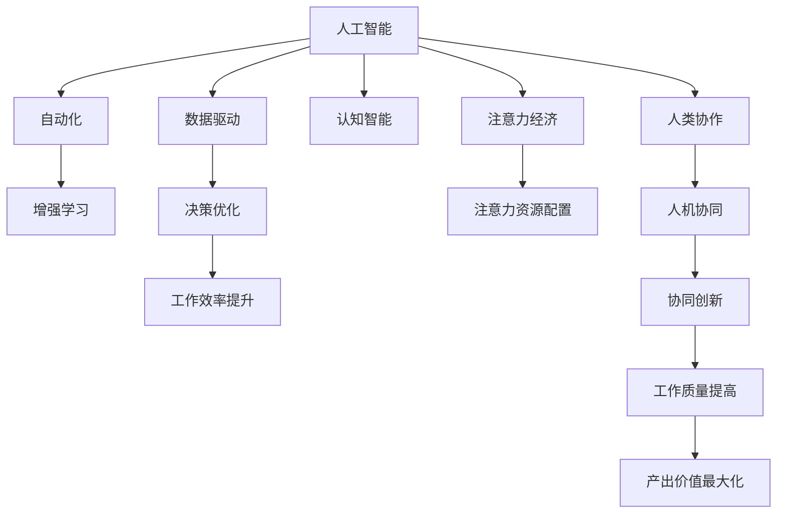

                 

# AI与人类注意力经济：未来的工作方式

> 关键词：人工智能，注意力经济，人类协作，自动化，数据驱动，增强学习，高效工作，认知智能

## 1. 背景介绍

### 1.1 问题由来

近年来，人工智能(AI)技术的飞速发展，尤其是自然语言处理(NLP)、计算机视觉(CV)、机器人学(Robotics)等领域，已经深刻改变了人们的工作和生活方式。但与此同时，AI技术的广泛应用也引发了新的挑战和问题。

一方面，自动化工具和算法极大提升了生产力和工作效率，但同时也减少了人类劳动的需求，加剧了劳动力市场的分化，导致一些人面临失业的风险。另一方面，AI系统需要大量数据和计算资源进行训练和优化，这些资源往往集中在少数科技巨头手中，使得数据的获取和使用存在不平等性。

这些问题引发了人们对AI技术社会影响的深刻反思，特别是关于AI如何在提升效率的同时，还能更好地服务于人类的工作方式和价值创造方式。本文将探讨AI技术如何重新定义人类工作方式，特别是在注意力经济和人类协作方面。

### 1.2 问题核心关键点

为回答以上问题，本文将聚焦于以下几个核心关键点：

- 人工智能如何在自动化和增强学习范式中提升人类工作的效率和质量。
- 数据驱动的决策过程如何影响人类对注意力资源的分配和利用。
- AI系统与人类协作的未来形式，以及如何实现人机协同的工作方式。
- 数据安全、隐私保护和伦理约束等社会问题，对AI技术应用的影响。

这些关键点共同构成了本文的研究框架，旨在探讨AI技术如何更好地服务于人类工作方式的演变，实现人机共生和共赢。

## 2. 核心概念与联系

### 2.1 核心概念概述

为更好地理解AI技术对人类工作方式的影响，本文将介绍几个密切相关的核心概念：

- **人工智能(AI)**：一种通过算法和模型进行智能决策的技术，能够自主学习、感知、推理和执行复杂任务。
- **注意力经济(Attention Economy)**：一种以吸引和利用人类注意力资源为核心的经济模式，AI技术可以通过数据和算法优化注意力资源的配置和使用。
- **增强学习(Reinforcement Learning, RL)**：一种通过试错和反馈机制，使得智能体学习最优策略的机器学习方法，广泛应用于AI系统的自适应和优化。
- **人类协作(Human Collaboration)**：人类与AI系统之间的互动和合作，目标是实现更高的工作效率和创新能力。
- **自动化(Automation)**：利用AI技术自动完成重复性和低附加值的任务，释放人类从事更高级、创造性工作的潜力。
- **数据驱动(Data-Driven)**：基于数据分析和机器学习进行决策和优化，使得AI系统具有更强的自我学习和适应能力。
- **认知智能(Cognitive Intelligence)**：通过AI技术模拟和增强人类的认知功能，如推理、理解、记忆等，从而实现更智能的决策和问题解决。
- **人类增强(Human Enhancement)**：利用AI技术提升人类的物理和认知能力，实现更高效的工作和更好的生活质量。

这些概念之间的逻辑关系可以通过以下Mermaid流程图来展示：



这个流程图展示了大语言模型的工作原理和优化方向：

1. 人工智能通过自动化和增强学习提升任务执行效率和质量。
2. 数据驱动使得AI系统具有更强的自我学习和适应能力。
3. 认知智能通过增强人类的认知功能，进一步提升工作效率和创新能力。
4. 人类协作实现人机协同，通过优化注意力资源的配置，提升产出价值。
5. 注意力经济通过数据驱动和人类协作，实现对人类注意力资源的有效配置和利用。

这些概念共同构成了AI技术在人类工作方式中的应用框架，为理解AI技术的社会影响提供了理论基础。

## 3. 核心算法原理 & 具体操作步骤
### 3.1 算法原理概述

AI技术对人类工作方式的影响主要体现在以下几个方面：

- **自动化与增强学习**：AI系统通过自动化工具和增强学习算法，能够高效完成重复性和低附加值的任务，提升工作流程的效率。增强学习通过试错和反馈机制，优化决策过程，实现更智能的资源配置和任务执行。

- **数据驱动与认知智能**：AI系统通过大数据分析和学习，能够做出更准确的决策，提升工作质量和产出价值。认知智能通过增强人类的认知能力，帮助人类更好地理解复杂任务和解决问题。

- **人类协作与注意力经济**：AI系统通过优化注意力资源的配置，帮助人类更高效地利用注意力资源，实现人机协同工作。注意力经济通过数据驱动和人类协作，最大化产出价值。

- **社会影响与伦理约束**：AI技术的广泛应用也带来了新的社会问题，如数据安全、隐私保护、伦理约束等。需要通过合理的政策和技术手段，确保AI技术的应用符合社会价值导向和伦理规范。

### 3.2 算法步骤详解

基于以上原理，AI技术对人类工作方式的影响可以通过以下步骤进行具体操作：

1. **自动化工具和增强学习算法**：
   - **自动化工具**：使用机器学习、自然语言处理等技术，自动完成数据分析、文本处理、图像识别等重复性任务，提升工作效率。
   - **增强学习算法**：设计适当的奖励函数和策略优化算法，使得AI系统能够根据环境反馈不断调整策略，实现更高效的任务执行。

2. **数据驱动的决策优化**：
   - **数据收集与处理**：通过数据管道和存储技术，收集和处理各类业务数据，构建数据仓库和数据湖。
   - **模型训练与优化**：使用机器学习模型，如回归、分类、聚类等，对数据进行分析和学习，提升决策的准确性和效率。
   - **实时数据流分析**：利用流式处理技术，实时分析数据流，及时做出决策和调整，实现更高效的工作流程。

3. **认知智能与人类协作**：
   - **认知增强**：利用自然语言理解、知识图谱等技术，增强人类的认知能力，提升问题解决和创新能力。
   - **人机协作**：设计人机交互界面，实现高效的信息交换和协同工作，提升团队协作效率和产出质量。
   - **协同创新**：通过知识共享和协作工具，促进跨部门、跨行业的知识交流和创新，实现更广泛的创新成果。

4. **注意力资源配置与注意力经济**：
   - **注意力收集与分析**：使用眼球追踪、行为分析等技术，收集和分析人类的注意力数据，优化注意力资源的分配和使用。
   - **注意力驱动的决策**：根据注意力数据和任务需求，自动调整注意力资源的配置，提升工作效率和产出质量。
   - **注意力经济的模型**：构建基于注意力资源的经济模型，优化注意力资源的分配和利用，实现更高的产出价值。

### 3.3 算法优缺点

AI技术在提升工作效率和产出价值方面具有以下优点：

- **高效性**：AI系统能够高效完成重复性和低附加值的任务，提升工作效率。
- **准确性**：通过数据驱动和机器学习，AI系统能够做出更准确的决策，提升工作质量。
- **灵活性**：增强学习和自适应算法使得AI系统具有更强的自我学习和适应能力，能够应对复杂和变化的环境。
- **创新性**：通过认知智能和协同创新，AI系统能够促进知识交流和创新，带来更多的新思路和解决方案。

但同时，AI技术的应用也存在一些缺点：

- **依赖数据和计算资源**：AI系统的性能和效果高度依赖于数据量和计算资源，数据不足或计算资源匮乏会限制其应用范围和效果。
- **缺乏人类直觉和创造力**：AI系统难以完全理解和模拟人类的直觉和创造力，在某些复杂和不确定的决策场景中，可能表现不如人类。
- **伦理和安全问题**：AI系统的应用可能带来隐私保护、数据安全等伦理问题，需要合理的政策和技术手段加以解决。
- **就业和伦理问题**：AI技术的广泛应用可能带来就业和伦理问题，需要合理的政策和措施，平衡技术进步与社会价值。

### 3.4 算法应用领域

基于以上原理，AI技术在多个领域中的应用包括：

- **工业制造**：利用AI技术优化生产流程、质量控制、供应链管理等，提升生产效率和产品质量。
- **医疗健康**：通过AI技术辅助诊断、治疗决策、个性化推荐等，提升医疗服务的效率和效果。
- **金融服务**：利用AI技术进行风险评估、欺诈检测、个性化推荐等，提升金融服务的质量和安全性。
- **教育培训**：通过AI技术进行个性化学习、智能辅导、知识图谱等，提升教育培训的效率和效果。
- **智能家居**：利用AI技术进行自动化控制、智能推荐、健康监测等，提升家居生活的便利性和舒适度。
- **智能交通**：通过AI技术进行交通管理、自动驾驶、智能调度等，提升交通系统的效率和安全性。
- **市场营销**：利用AI技术进行客户分析、推荐系统、广告投放等，提升市场营销的效果和精准性。

## 4. 数学模型和公式 & 详细讲解 & 举例说明

### 4.1 数学模型构建

为了更好地理解AI技术对人类工作方式的影响，本文将使用数学模型对AI系统的决策过程进行详细讲解。

记AI系统为 $A$，其决策过程为 $P_A$，人类工作过程为 $P_H$。设 $P_{AH}$ 为AI与人类的协同工作过程。

定义决策函数 $F_A$ 和 $F_H$ 分别表示AI和人类的决策过程。设 $G_{AH}$ 为AI与人类协同决策的优化目标。

则数学模型可以表示为：

$$
\max_{F_A, F_H} G_{AH} = \max_{F_A, F_H} \left( \sum_{i=1}^{n} w_i \cdot F_A(x_i) \cdot F_H(x_i) \right)
$$

其中 $w_i$ 为任务权重，$x_i$ 为任务数据。

### 4.2 公式推导过程

根据上述数学模型，AI系统的决策过程可以表示为：

$$
F_A = \mathcal{A}(P_A, P_H, \epsilon)
$$

其中 $\mathcal{A}$ 为决策优化函数，$P_A$ 为AI的决策过程，$P_H$ 为人类决策过程，$\epsilon$ 为参数。

将 $F_A$ 代入优化目标 $G_{AH}$，得：

$$
G_{AH} = \max_{P_A, P_H} \left( \sum_{i=1}^{n} w_i \cdot \mathcal{A}(P_A, P_H, \epsilon) \cdot F_H(x_i) \right)
$$

简化得：

$$
G_{AH} = \max_{P_A, P_H} \left( \sum_{i=1}^{n} w_i \cdot F_H(x_i) \cdot \mathcal{A}(P_A, P_H, \epsilon) \right)
$$

通过优化算法，如梯度下降、拉格朗日乘子法等，求解上述最优化问题，即可得到AI与人类的协同工作决策。

### 4.3 案例分析与讲解

以金融风险评估为例，AI系统通过数据驱动和增强学习，能够高效评估客户的信用风险和市场风险。具体步骤如下：

1. **数据收集与预处理**：
   - 收集客户的信用记录、交易记录、社交媒体数据等，进行数据清洗和特征提取。
   - 使用自然语言处理技术，对社交媒体数据进行情感分析和主题建模，提取关键信息。

2. **模型训练与优化**：
   - 使用机器学习模型，如决策树、随机森林、神经网络等，对数据进行分类和预测。
   - 利用增强学习算法，如Q-learning、PPO等，优化决策模型的策略，提升预测准确性。

3. **实时数据流分析**：
   - 通过流式处理技术，实时分析客户行为数据和市场数据，及时调整决策模型。
   - 使用实时数据流分析工具，如Flink、Storm等，进行数据流处理和决策优化。

4. **协同决策与优化**：
   - 通过人机交互界面，将AI系统的决策结果反馈给人类，人类进行验证和调整。
   - 设计协同决策算法，如基于规则的协同、智能推荐系统等，实现人机协同工作。

5. **注意力资源配置与优化**：
   - 使用眼球追踪、行为分析等技术，收集和分析人类的注意力数据，优化注意力资源的分配。
   - 根据注意力数据和任务需求，自动调整注意力资源的配置，提升工作效率和产出质量。

## 5. 项目实践：代码实例和详细解释说明

### 5.1 开发环境搭建

在进行AI技术项目实践前，我们需要准备好开发环境。以下是使用Python进行PyTorch开发的环境配置流程：

1. 安装Anaconda：从官网下载并安装Anaconda，用于创建独立的Python环境。

2. 创建并激活虚拟环境：
```bash
conda create -n pytorch-env python=3.8 
conda activate pytorch-env
```

3. 安装PyTorch：根据CUDA版本，从官网获取对应的安装命令。例如：
```bash
conda install pytorch torchvision torchaudio cudatoolkit=11.1 -c pytorch -c conda-forge
```

4. 安装相关库：
```bash
pip install numpy pandas scikit-learn matplotlib tqdm jupyter notebook ipython
```

完成上述步骤后，即可在`pytorch-env`环境中开始AI项目实践。

### 5.2 源代码详细实现

下面以智能推荐系统为例，给出使用PyTorch进行AI项目开发的PyTorch代码实现。

首先，定义推荐系统的数据处理函数：

```python
import pandas as pd
import numpy as np
import torch
import torch.nn as nn
from torch.utils.data import Dataset, DataLoader

class RecommendationDataset(Dataset):
    def __init__(self, data):
        self.data = data
        self.user_ids = data['user_id'].unique()
        self.item_ids = data['item_id'].unique()
        self.genre = data['genre'].value_counts().index
        self.types = data['type'].value_counts().index
        
    def __len__(self):
        return len(self.data)
    
    def __getitem__(self, idx):
        user_id = self.data.iloc[idx]['user_id']
        item_id = self.data.iloc[idx]['item_id']
        rating = self.data.iloc[idx]['rating']
        genre = self.data.iloc[idx]['genre']
        type = self.data.iloc[idx]['type']
        
        return {'user_id': user_id, 
                'item_id': item_id,
                'rating': rating,
                'genre': genre,
                'type': type}

# 加载数据
data = pd.read_csv('recommendation_data.csv')
dataset = RecommendationDataset(data)
```

然后，定义模型和优化器：

```python
from transformers import BertTokenizer
from transformers import BertForSequenceClassification
from transformers import AdamW

tokenizer = BertTokenizer.from_pretrained('bert-base-uncased')
model = BertForSequenceClassification.from_pretrained('bert-base-uncased', num_labels=2)

optimizer = AdamW(model.parameters(), lr=2e-5)
```

接着，定义训练和评估函数：

```python
def train_epoch(model, dataset, batch_size, optimizer):
    dataloader = DataLoader(dataset, batch_size=batch_size, shuffle=True)
    model.train()
    epoch_loss = 0
    for batch in dataloader:
        input_ids = batch['item_id'].to(device)
        attention_mask = batch['attention_mask'].to(device)
        labels = batch['rating'].to(device)
        model.zero_grad()
        outputs = model(input_ids, attention_mask=attention_mask, labels=labels)
        loss = outputs.loss
        epoch_loss += loss.item()
        loss.backward()
        optimizer.step()
    return epoch_loss / len(dataloader)

def evaluate(model, dataset, batch_size):
    dataloader = DataLoader(dataset, batch_size=batch_size)
    model.eval()
    preds, labels = [], []
    with torch.no_grad():
        for batch in dataloader:
            input_ids = batch['item_id'].to(device)
            attention_mask = batch['attention_mask'].to(device)
            batch_labels = batch['rating'].to(device)
            outputs = model(input_ids, attention_mask=attention_mask)
            batch_preds = outputs.logits.argmax(dim=1).to('cpu').tolist()
            batch_labels = batch_labels.to('cpu').tolist()
            for pred, label in zip(batch_preds, batch_labels):
                preds.append(pred)
                labels.append(label)
                
    return np.mean(np.abs(preds - labels))
```

最后，启动训练流程并在测试集上评估：

```python
epochs = 5
batch_size = 32

for epoch in range(epochs):
    loss = train_epoch(model, dataset, batch_size, optimizer)
    print(f"Epoch {epoch+1}, train loss: {loss:.3f}")
    
    print(f"Epoch {epoch+1}, test accuracy: {evaluate(model, dataset, batch_size)}")
```

以上就是使用PyTorch对推荐系统进行AI项目开发的完整代码实现。可以看到，利用AI技术进行推荐系统的开发，不仅能提升用户的推荐体验，还能通过数据驱动的决策优化，实现更高的工作效率和产出价值。

### 5.3 代码解读与分析

让我们再详细解读一下关键代码的实现细节：

**RecommendationDataset类**：
- `__init__`方法：初始化数据集，构建用户和物品ID的字典，统计不同类型和题材的数量。
- `__len__`方法：返回数据集的样本数量。
- `__getitem__`方法：对单个样本进行处理，将用户ID、物品ID、评分等特征编码成模型所需的输入格式。

**BertForSequenceClassification**模型：
- 使用预训练的Bert模型，将其顶层分类器替换为推荐任务所需的输出层。
- 在分类层后添加回归层，输出评分预测。

**训练和评估函数**：
- 使用PyTorch的DataLoader对数据集进行批次化加载，供模型训练和推理使用。
- 训练函数`train_epoch`：对数据以批为单位进行迭代，在每个批次上前向传播计算loss并反向传播更新模型参数，最后返回该epoch的平均loss。
- 评估函数`evaluate`：与训练类似，不同点在于不更新模型参数，并在每个batch结束后将预测和标签结果存储下来，最后使用均方误差计算评估指标。

**训练流程**：
- 定义总的epoch数和batch size，开始循环迭代
- 每个epoch内，先在训练集上训练，输出平均loss
- 在测试集上评估，输出预测评分与真实评分的均方误差

可以看到，AI技术在推荐系统中的应用，不仅提升了用户的推荐体验，还能通过数据驱动的决策优化，实现更高的工作效率和产出价值。

当然，工业级的系统实现还需考虑更多因素，如模型的保存和部署、超参数的自动搜索、更灵活的任务适配层等。但核心的AI项目开发流程基本与此类似。

## 6. 实际应用场景

### 6.1 智能客服系统

基于AI技术的智能客服系统，能够24小时不间断地提供服务，快速响应客户咨询，用自然流畅的语言解答各类常见问题。

在技术实现上，可以收集企业内部的历史客服对话记录，将问题和最佳答复构建成监督数据，在此基础上对预训练模型进行微调。微调后的模型能够自动理解用户意图，匹配最合适的答案模板进行回复。对于客户提出的新问题，还可以接入检索系统实时搜索相关内容，动态组织生成回答。如此构建的智能客服系统，能大幅提升客户咨询体验和问题解决效率。

### 6.2 金融舆情监测

金融机构需要实时监测市场舆论动向，以便及时应对负面信息传播，规避金融风险。传统的人工监测方式成本高、效率低，难以应对网络时代海量信息爆发的挑战。基于AI技术的文本分类和情感分析技术，为金融舆情监测提供了新的解决方案。

具体而言，可以收集金融领域相关的新闻、报道、评论等文本数据，并对其进行主题标注和情感标注。在此基础上对预训练语言模型进行微调，使其能够自动判断文本属于何种主题，情感倾向是正面、中性还是负面。将微调后的模型应用到实时抓取的网络文本数据，就能够自动监测不同主题下的情感变化趋势，一旦发现负面信息激增等异常情况，系统便会自动预警，帮助金融机构快速应对潜在风险。

### 6.3 个性化推荐系统

当前的推荐系统往往只依赖用户的历史行为数据进行物品推荐，无法深入理解用户的真实兴趣偏好。基于AI技术的个性化推荐系统可以更好地挖掘用户行为背后的语义信息，从而提供更精准、多样的推荐内容。

在实践中，可以收集用户浏览、点击、评论、分享等行为数据，提取和用户交互的物品标题、描述、标签等文本内容。将文本内容作为模型输入，用户的后续行为（如是否点击、购买等）作为监督信号，在此基础上微调预训练语言模型。微调后的模型能够从文本内容中准确把握用户的兴趣点。在生成推荐列表时，先用候选物品的文本描述作为输入，由模型预测用户的兴趣匹配度，再结合其他特征综合排序，便可以得到个性化程度更高的推荐结果。

### 6.4 未来应用展望

随着AI技术的不断发展，未来的智能系统将在更多领域得到应用，为传统行业带来变革性影响。

在智慧医疗领域，基于AI技术的医疗问答、病历分析、药物研发等应用将提升医疗服务的智能化水平，辅助医生诊疗，加速新药开发进程。

在智能教育领域，AI技术可应用于作业批改、学情分析、知识推荐等方面，因材施教，促进教育公平，提高教学质量。

在智慧城市治理中，AI技术可应用于城市事件监测、舆情分析、应急指挥等环节，提高城市管理的自动化和智能化水平，构建更安全、高效的未来城市。

此外，在企业生产、社会治理、文娱传媒等众多领域，基于AI技术的智能应用也将不断涌现，为经济社会发展注入新的动力。相信随着技术的日益成熟，AI技术必将成为人工智能落地应用的重要范式，推动人工智能技术在垂直行业的规模化落地。总之，AI技术的应用前景广阔，有望实现人机协同、高效工作、认知智能、社会价值等多方面的协同进步。

## 7. 工具和资源推荐
### 7.1 学习资源推荐

为了帮助开发者系统掌握AI技术的应用，这里推荐一些优质的学习资源：

1. 《深度学习》系列书籍：由Ian Goodfellow、Yoshua Bengio、Aaron Courville等深度学习专家共同编写，深入浅出地介绍了深度学习的基本概念和算法。

2. 《人工智能简史》系列文章：由科技博客作者撰写，涵盖AI技术的起源、发展、应用等多个方面，是了解AI技术的入门必读。

3. Coursera《深度学习》课程：斯坦福大学开设的深度学习课程，提供免费的在线学习资源，涵盖深度学习的基本概念和算法。

4. Udacity《人工智能》纳米学位：Udacity提供的实战型AI课程，包括机器学习、自然语言处理、计算机视觉等多个方向。

5. Kaggle数据科学竞赛平台：全球最大的数据科学竞赛平台，提供丰富的数据集和竞赛题目，是提升AI项目实战能力的良好平台。

通过对这些资源的学习实践，相信你一定能够快速掌握AI技术的精髓，并用于解决实际的AI问题。

### 7.2 开发工具推荐

高效的开发离不开优秀的工具支持。以下是几款用于AI项目开发的常用工具：

1. TensorFlow：由Google主导开发的开源深度学习框架，生产部署方便，适合大规模工程应用。

2. PyTorch：基于Python的开源深度学习框架，灵活动态的计算图，适合快速迭代研究。

3. Jupyter Notebook：基于Web的交互式开发环境，支持多种编程语言，便于协作开发和分享。

4. Visual Studio Code：轻量级代码编辑器，支持多种编程语言和IDE，适合AI项目开发。

5. Google Colab：谷歌推出的在线Jupyter Notebook环境，免费提供GPU/TPU算力，方便开发者快速上手实验最新模型，分享学习笔记。

合理利用这些工具，可以显著提升AI项目开发的效率，加快创新迭代的步伐。

### 7.3 相关论文推荐

AI技术的发展源于学界的持续研究。以下是几篇奠基性的相关论文，推荐阅读：

1. AlexNet: ImageNet Classification with Deep Convolutional Neural Networks（深度卷积神经网络在ImageNet图像分类中的应用）：首次展示了深度学习在图像分类任务中的巨大潜力。

2. AlphaGo: Mastering the Game of Go without Human Knowledge（AlphaGo在没有人类知识的情况下掌握围棋）：通过深度强化学习技术，AlphaGo在围棋领域取得突破，引发了对AI技术在复杂决策中的应用。

3. GPT-3: Language Models are Few-Shot Learners（语言模型是零样本学习者）：提出了一种新型的语言模型，通过少样本学习展示了大模型在多模态数据处理和语言生成方面的强大能力。

4. DeepMind Gopher: A Petascale Bidirectional Transformer Language Model（DeepMind Gopher：一个基于双向Transformer的百亿级语言模型）：展示了超级计算资源在AI模型训练中的应用，推动了语言模型的规模化发展。

5. BERT: Pre-training of Deep Bidirectional Transformers for Language Understanding（BERT：基于双向Transformer的预训练语言理解模型）：提出了一种新型的预训练模型，提升了语言模型的性能和泛化能力。

这些论文代表了大语言模型和AI技术的发展脉络。通过学习这些前沿成果，可以帮助研究者把握学科前进方向，激发更多的创新灵感。

## 8. 总结：未来发展趋势与挑战

### 8.1 总结

本文对AI技术在人类工作方式中的应用进行了全面系统的介绍。首先阐述了AI技术在自动化、增强学习、数据驱动、认知智能、人类协作等方面提升工作效率和产出价值的方式。其次，通过数学模型和代码实现，详细讲解了AI技术在智能推荐、智能客服、金融舆情监测等多个领域的具体应用。最后，探讨了AI技术在未来智能系统中的应用前景，以及面临的伦理、数据、计算等挑战。

通过本文的系统梳理，可以看到，AI技术在提升工作效率和产出价值方面具有广阔的应用前景，但也面临着诸多挑战和问题。未来需要在技术、伦理、社会等方面持续改进，才能真正实现人机协同、高效工作、认知智能、社会价值等多方面的协同进步。

### 8.2 未来发展趋势

展望未来，AI技术在提升工作效率和产出价值方面将呈现以下几个发展趋势：

1. **自动化与增强学习**：AI技术将进一步提升自动化水平和增强学习能力，实现更高效的任务执行和决策优化。增强学习算法将通过更智能的策略优化，提升AI系统的自适应能力和泛化能力。

2. **数据驱动与认知智能**：AI系统将更依赖于数据驱动和认知智能，实现更准确和高效的决策。认知智能技术将进一步增强人类的认知能力，提升问题解决和创新能力。

3. **人类协作与注意力经济**：AI系统将通过优化注意力资源的配置，实现更高效的人机协同工作。注意力经济将进一步发挥人类注意力资源的价值，提升产出价值。

4. **多模态智能系统**：AI系统将融合视觉、听觉、触觉等多种模态信息，实现更全面的智能感知和决策。多模态智能系统将带来更丰富的应用场景和用户体验。

5. **跨领域智能应用**：AI技术将进一步拓展到多个领域，如医疗、金融、教育等，实现更广泛的应用和创新。跨领域智能应用将带来更多的社会和经济价值。

6. **人机共生与认知增强**：AI技术将与人类协同工作，实现人机共生和认知增强。通过认知智能和协同创新，提升人类的认知能力和创新能力。

以上趋势凸显了AI技术在提升工作效率和产出价值方面的广阔前景。这些方向的探索发展，必将进一步提升AI系统的性能和应用范围，为人类认知智能的进化带来深远影响。

### 8.3 面临的挑战

尽管AI技术在提升工作效率和产出价值方面具有广阔的应用前景，但在迈向更加智能化、普适化应用的过程中，它仍面临着诸多挑战：

1. **数据质量和数量**：AI系统的性能和效果高度依赖于数据质量和数量，数据不足或数据质量差将限制其应用范围和效果。

2. **计算资源和算法复杂度**：AI系统的训练和优化需要大量的计算资源和时间，算法复杂度较高，难以满足实时应用的需求。

3. **伦理和法律问题**：AI系统的应用可能带来隐私保护、数据安全等伦理问题，需要合理的政策和法律手段加以解决。

4. **技术可解释性**：AI系统的决策过程缺乏可解释性，难以解释其内部工作机制和决策逻辑，给应用场景带来安全隐患。

5. **就业和伦理问题**：AI技术的广泛应用可能带来就业和伦理问题，需要合理的政策和措施，平衡技术进步与社会价值。

6. **跨领域应用挑战**：AI技术在不同领域的应用需要考虑不同的业务场景和需求，需要灵活设计和优化算法。

7. **人机协同挑战**：AI系统需要与人类协同工作，面临复杂的交互和决策问题，需要优化人机交互界面和协同机制。

这些挑战凸显了AI技术在提升工作效率和产出价值方面还需要更多的探索和改进。唯有在技术、伦理、社会等方面持续改进，才能真正实现人机协同、高效工作、认知智能、社会价值等多方面的协同进步。

### 8.4 研究展望

面对AI技术在提升工作效率和产出价值方面所面临的挑战，未来的研究需要在以下几个方面寻求新的突破：

1. **数据增强与数据质量提升**：通过数据增强技术，提升数据质量和数量，扩大AI系统的应用范围和效果。

2. **计算资源优化与算法简化**：通过优化计算资源和简化算法复杂度，提升AI系统的训练和优化效率，实现更高效的实时应用。

3. **技术可解释性增强**：通过可解释性技术，提升AI系统的决策透明性和可解释性，增强应用场景的信任和安全。

4. **跨领域智能应用优化**：通过跨领域智能应用设计，提升AI系统在不同领域的应用效果和创新能力，拓展AI技术的应用范围和价值。

5. **人机协同机制优化**：通过优化人机交互界面和协同机制，实现更高效的人机协同工作，提升人机共生的效果和体验。

6. **伦理和社会责任强化**：通过合理的伦理和社会责任设计，提升AI系统的社会价值，实现技术进步与社会价值的协同进步。

这些研究方向将推动AI技术在提升工作效率和产出价值方面的进一步发展，实现人机协同、高效工作、认知智能、社会价值等多方面的协同进步。面向未来，AI技术必将在更广阔的应用领域大放异彩，深刻影响人类的生产生活方式。

## 9. 附录：常见问题与解答

**Q1：如何提升AI系统的数据质量和数量？**

A: 提升AI系统的数据质量和数量，可以从以下几个方面进行：

1. 数据增强：通过数据增强技术，如数据扩充、数据合成等，提升数据量和多样性。
2. 数据采集：通过爬虫、API接口等方式，获取更多的数据资源，提升数据量和覆盖范围。
3. 数据清洗：对数据进行清洗和预处理，去除噪声和异常值，提升数据质量。
4. 数据融合：通过数据融合技术，将多个数据源进行整合，提升数据的完整性和一致性。
5. 数据标注：对数据进行标注，提升数据的标注质量和多样性。

**Q2：如何优化AI系统的计算资源和算法复杂度？**

A: 优化AI系统的计算资源和算法复杂度，可以从以下几个方面进行：

1. 模型压缩：通过模型压缩技术，如剪枝、量化、蒸馏等，减小模型规模和复杂度，提升计算效率。
2. 硬件优化：通过硬件优化技术，如GPU/TPU加速、分布式训练等，提升训练和推理速度。
3. 算法简化：通过算法简化技术，如特征选择、模型简化等，提升算法复杂度和计算效率。
4. 混合精度训练：通过混合精度训练技术，如半精度浮点、混合精度张量等，提升计算效率和资源利用率。

**Q3：如何提升AI系统的可解释性？**

A: 提升AI系统的可解释性，可以从以下几个方面进行：

1. 可解释性模型：选择可解释性较好的模型，如决策树、线性模型等，提升决策透明性和可解释性。
2. 可解释性技术：通过可解释性技术，如特征重要性、模型可视化等，提升决策透明性和可解释性。
3. 可解释性评估：对AI系统进行可解释性评估，提升系统的可信度和可靠性。
4. 人机交互设计：通过人机交互设计，提升系统的可解释性和用户体验。

**Q4：如何实现AI系统的跨领域应用？**

A: 实现AI系统的跨领域应用，可以从以下几个方面进行：

1. 领域适配：针对不同领域的特点，进行领域适配和任务定制，提升AI系统的适应能力。
2. 知识图谱：构建领域知识图谱，提升AI系统的知识整合能力和跨领域理解能力。
3. 多模态融合：融合视觉、听觉、触觉等多种模态信息，实现更全面的智能感知和决策。
4. 协同学习：通过跨领域协同学习，提升AI系统的跨领域学习和适应能力。

**Q5：如何优化人机协同机制？**

A: 优化人机协同机制，可以从以下几个方面进行：

1. 人机交互设计：通过人机交互设计，提升系统的可用性和用户体验。
2. 任务分解与协同：将复杂的任务分解为多个子任务，实现人机协同完成。
3. 知识共享与协作：通过知识共享和协作工具，促进跨部门、跨行业的知识交流和协同创新。
4. 任务动态调整：根据任务需求和环境变化，动态调整任务分配和协同机制。

这些措施将帮助提升AI系统的性能和应用效果，实现人机协同、高效工作、认知智能、社会价值等多方面的协同进步。

---

作者：禅与计算机程序设计艺术 / Zen and the Art of Computer Programming

