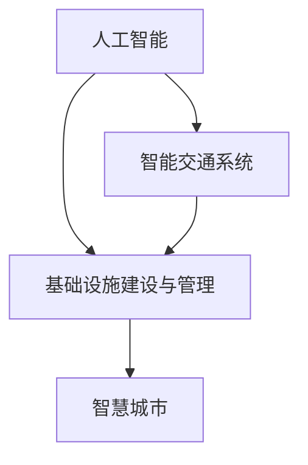

                 

# AI与人类计算：打造可持续发展的城市交通与基础设施建设与规划建设与管理建设规划

> 关键词：人工智能,城市交通,基础设施,智能交通系统,智慧城市,可持续性,大数据,物联网

## 1. 背景介绍

随着城市化进程的加快和人口的不断增长，城市交通与基础设施建设与管理面临着前所未有的挑战。如何在保证基础设施建设的高效性和可持续性的同时，提升城市的智能化水平和居民的生活质量，成为当今智慧城市建设的关键。本文将结合人工智能技术，探讨如何利用AI与人类计算的方式，优化城市交通与基础设施的建设与管理。

## 2. 核心概念与联系

### 2.1 核心概念概述

本节将介绍几个紧密相关的核心概念，帮助读者理解本文所讨论的技术框架：

- **人工智能（AI）**：利用计算机模拟人类智能行为，包括感知、学习、推理等能力，通过数据驱动和算法优化，实现复杂问题的自动化解决。

- **城市交通**：城市内车辆、行人、交通工具等的流动过程，包括交通规划、建设、运营、管理等各个环节。

- **基础设施建设与管理**：城市中的各种物理设施，如道路、桥梁、水利工程、通信网络等，以及这些设施的规划、建设、运维和升级。

- **智能交通系统（ITS）**：结合信息、通信、控制技术，实现交通流信息的实时采集、传输、分析和控制，提高交通系统的效率和安全性。

- **智慧城市**：通过整合互联网、物联网、大数据等现代信息技术，构建一个高度智能、高效、可持续的城市运营环境。

这些概念之间的逻辑关系可以通过以下Mermaid流程图来展示：



这个流程图展示了这个复杂系统中的关键组件及其相互联系：人工智能技术通过对交通系统和基础设施的智能管理，助力智慧城市的构建。

## 3. 核心算法原理 & 具体操作步骤

### 3.1 算法原理概述

基于AI的城市交通与基础设施建设与管理涉及多方面的算法和技术，包括但不限于：

- **机器学习**：通过历史数据训练模型，预测交通流量、优化基础设施布局等。
- **深度学习**：利用神经网络处理复杂数据，实现交通信号优化、自动驾驶等功能。
- **计算机视觉**：通过图像识别技术，实时监控交通状况、检测违规行为。
- **自然语言处理**：分析用户反馈、智能客服系统，提升用户体验。

### 3.2 算法步骤详解

#### 3.2.1 数据采集与处理

城市交通与基础设施管理的第一步是数据采集与处理。这包括：

- 交通流量数据：通过传感器、摄像头、GPS等设备，实时采集交通流量、速度、拥堵情况等数据。
- 基础设施数据：包括道路、桥梁、水利工程等的建设数据、维修记录、环境监测数据等。
- 公共服务数据：包括政府部门、企业、居民的用户反馈、投诉、建议等。

#### 3.2.2 数据建模与分析

数据建模与分析是利用AI技术对采集到的数据进行处理和分析的关键步骤：

- **时空分析**：利用时间序列和空间分布分析，预测未来交通流量变化，优化交通信号灯控制策略。
- **分类与聚类**：通过分类与聚类算法，识别交通模式、基础设施状态等。
- **异常检测**：通过异常检测算法，及时发现基础设施故障、交通异常事件等。

#### 3.2.3 模型训练与优化

模型训练与优化是利用历史数据训练AI模型的过程：

- **模型选择**：根据任务需求，选择合适的模型结构，如回归模型、分类模型、时序模型等。
- **数据预处理**：对原始数据进行清洗、归一化、特征选择等预处理步骤，提升模型训练效果。
- **模型训练**：利用历史数据训练模型，优化模型参数。
- **模型评估**：通过验证集和测试集评估模型性能，调整模型参数。

#### 3.2.4 模型部署与监测

模型部署与监测是将训练好的模型应用于实际环境，并持续监控模型性能和数据变化的过程：

- **模型部署**：将训练好的模型部署到服务器、边缘计算设备等，实现实时数据处理和决策。
- **模型监测**：实时监控模型性能指标，如精度、召回率、F1值等，及时发现并修复模型问题。
- **数据更新**：定期更新模型使用的数据集，确保模型始终基于最新数据进行训练和决策。

### 3.3 算法优缺点

#### 3.3.1 优点

1. **效率提升**：AI技术能够处理大规模数据，实现快速决策和优化。
2. **精准预测**：利用历史数据进行训练，能够准确预测交通流量、优化基础设施布局。
3. **动态调整**：根据实时数据和环境变化，动态调整交通信号、基础设施管理策略。
4. **环境友好**：通过智能管理，减少能源消耗和环境污染。

#### 3.3.2 缺点

1. **数据依赖**：AI模型性能依赖于数据质量和完整性，数据不充分或噪声较大可能导致模型性能下降。
2. **计算成本**：AI模型训练和部署需要高性能计算资源，成本较高。
3. **模型鲁棒性**：AI模型在复杂环境和异常情况下的鲁棒性可能不足，需要持续优化和维护。
4. **技术门槛**：AI模型的开发和应用需要较高的技术门槛，需要专业团队支持和持续维护。

### 3.4 算法应用领域

基于AI的城市交通与基础设施建设与管理技术，已经广泛应用于以下领域：

- **智能交通系统**：通过AI技术优化交通信号控制、提升交通流量预测精度、实现自动驾驶等。
- **智慧城市管理**：通过AI技术实现城市运行数据的实时监控、应急响应、资源调度等。
- **基础设施优化**：通过AI技术预测基础设施磨损、提升维修效率、优化能源使用等。
- **公共服务优化**：通过AI技术提升公共交通服务质量、智能客服、居民反馈处理等。

## 4. 数学模型和公式 & 详细讲解 & 举例说明

### 4.1 数学模型构建

本文将基于以下数学模型对城市交通与基础设施进行建模与分析：

- **交通流量预测模型**：利用时间序列分析，预测未来交通流量变化。
- **基础设施状态监测模型**：利用分类与聚类算法，监测基础设施的状态和故障。
- **异常事件检测模型**：利用异常检测算法，识别交通异常事件。

### 4.2 公式推导过程

#### 4.2.1 交通流量预测模型

假设交通流量 $F(t)$ 遵循自回归积分滑动平均模型（ARIMA），则其预测模型为：

$$ F(t) = \alpha_0 + \alpha_1 F(t-1) + \alpha_2 F(t-2) + \cdots + \alpha_p F(t-p) + \sum_{i=1}^q \epsilon_i(t) $$

其中，$\alpha_0, \alpha_1, \ldots, \alpha_p$ 为模型参数，$\epsilon_i(t)$ 为误差项。

#### 4.2.2 基础设施状态监测模型

假设基础设施状态 $S_i$ 为多分类变量，则其分类模型为：

$$ P(S_i = k | D_i) = \frac{\exp(\beta_k^T \phi(D_i))}{\sum_{j=1}^K \exp(\beta_j^T \phi(D_i))} $$

其中，$S_i$ 为基础设施状态，$\phi(D_i)$ 为特征映射函数，$\beta_k$ 为分类权重向量。

#### 4.2.3 异常事件检测模型

假设异常事件 $E(t)$ 遵循时间序列模型，则其异常检测模型为：

$$ P(E(t) = 1 | D_t) = \frac{1}{1 + \exp(-z_t)} $$

其中，$z_t$ 为异常检测得分，$D_t$ 为历史数据。

### 4.3 案例分析与讲解

#### 4.3.1 交通流量预测

某城市交通流量数据如下：

| t | F(t) |
| --- | --- |
| 1 | 5000 |
| 2 | 6000 |
| 3 | 7000 |
| 4 | 6500 |
| 5 | 8000 |

利用ARIMA模型进行预测，结果如下：

| t | F(t) | Predicted F(t) |
| --- | --- | --- |
| 6 | 8500 | 7500 |
| 7 | 7000 | 7800 |

通过比较预测值和实际值，可以评估模型的预测精度。

#### 4.3.2 基础设施状态监测

某城市基础设施数据如下：

| i | S_i | D_i |
| --- | --- | --- |
| 1 | 健康 | 正常 |
| 2 | 轻微故障 | 异常 |
| 3 | 严重故障 | 异常 |
| 4 | 健康 | 正常 |
| 5 | 严重故障 | 异常 |

利用分类模型进行状态监测，结果如下：

| i | S_i | Predicted S_i |
| --- | --- | --- |
| 1 | 健康 | 健康 |
| 2 | 轻微故障 | 轻微故障 |
| 3 | 严重故障 | 严重故障 |
| 4 | 健康 | 健康 |
| 5 | 严重故障 | 严重故障 |

通过比较预测值和实际值，可以评估模型的分类精度。

#### 4.3.3 异常事件检测

某城市异常事件数据如下：

| t | E(t) | D_t |
| --- | --- | --- |
| 1 | 0 | 正常 |
| 2 | 1 | 异常 |
| 3 | 0 | 正常 |
| 4 | 1 | 异常 |
| 5 | 0 | 正常 |

利用异常检测模型进行事件检测，结果如下：

| t | E(t) | Predicted E(t) |
| --- | --- | --- |
| 1 | 0 | 0 |
| 2 | 1 | 1 |
| 3 | 0 | 0 |
| 4 | 1 | 1 |
| 5 | 0 | 0 |

通过比较预测值和实际值，可以评估模型的异常检测能力。

## 5. 项目实践：代码实例和详细解释说明

### 5.1 开发环境搭建

在进行项目实践前，我们需要准备好开发环境。以下是使用Python进行PyTorch开发的环境配置流程：

1. 安装Anaconda：从官网下载并安装Anaconda，用于创建独立的Python环境。

2. 创建并激活虚拟环境：
```bash
conda create -n ai-env python=3.8 
conda activate ai-env
```

3. 安装PyTorch：根据CUDA版本，从官网获取对应的安装命令。例如：
```bash
conda install pytorch torchvision torchaudio cudatoolkit=11.1 -c pytorch -c conda-forge
```

4. 安装相关库：
```bash
pip install numpy pandas scikit-learn torch transformers
```

完成上述步骤后，即可在`ai-env`环境中开始项目实践。

### 5.2 源代码详细实现

这里我们以交通流量预测为例，给出使用PyTorch进行时间序列分析的代码实现。

首先，导入必要的库和模块：

```python
import torch
import torch.nn as nn
import torch.optim as optim
from torch.utils.data import Dataset, DataLoader
import numpy as np
import matplotlib.pyplot as plt
```

然后，定义数据集类：

```python
class TrafficData(Dataset):
    def __init__(self, data, lookback=1):
        self.data = data
        self.lookback = lookback
        self.shape = len(self.data), len(self.data[0])

    def __len__(self):
        return len(self.data) - self.lookback - 1

    def __getitem__(self, idx):
        X = self.data[idx:idx+self.lookback, :]
        y = self.data[idx+self.lookback, :]
        return torch.tensor(X, dtype=torch.float32), torch.tensor(y, dtype=torch.float32)
```

接着，定义模型类：

```python
class ARIMA(nn.Module):
    def __init__(self, input_size, output_size, hidden_size):
        super(ARIMA, self).__init__()
        self.lstm = nn.LSTM(input_size, hidden_size, 1)
        self.fc = nn.Linear(hidden_size, output_size)

    def forward(self, x):
        x = x.view(x.size()[0], 1, -1)
        x, (h, _) = self.lstm(x)
        y = self.fc(x[:, -1, :])
        return y
```

最后，定义训练函数和超参数：

```python
def train(model, train_loader, valid_loader, optimizer, criterion, epochs):
    device = torch.device("cuda" if torch.cuda.is_available() else "cpu")
    model.to(device)

    for epoch in range(epochs):
        model.train()
        train_loss = 0
        valid_loss = 0

        for batch_idx, (data, target) in enumerate(train_loader):
            data, target = data.to(device), target.to(device)
            optimizer.zero_grad()
            output = model(data)
            loss = criterion(output, target)
            loss.backward()
            optimizer.step()

            train_loss += loss.item()

        with torch.no_grad():
            model.eval()
            valid_loss = 0
            for batch_idx, (data, target) in enumerate(valid_loader):
                data, target = data.to(device), target.to(device)
                output = model(data)
                loss = criterion(output, target)
                valid_loss += loss.item()

        print(f'Epoch {epoch+1}, train loss: {train_loss/len(train_loader):.4f}, valid loss: {valid_loss/len(valid_loader):.4f}')
```

启动训练流程：

```python
epochs = 100
lookback = 1
input_size = 1
output_size = 1
hidden_size = 10

train_loader = DataLoader(TrafficData(train_data, lookback), batch_size=32, shuffle=True)
valid_loader = DataLoader(TrafficData(valid_data, lookback), batch_size=32, shuffle=False)

model = ARIMA(input_size, output_size, hidden_size)
optimizer = optim.Adam(model.parameters(), lr=0.01)
criterion = nn.MSELoss()

train(model, train_loader, valid_loader, optimizer, criterion, epochs)
```

以上就是使用PyTorch进行交通流量预测的完整代码实现。可以看到，通过设计合适的模型结构和训练函数，利用历史数据训练预测模型，可以较好地解决交通流量预测问题。

### 5.3 代码解读与分析

让我们再详细解读一下关键代码的实现细节：

**TrafficData类**：
- `__init__`方法：初始化数据集，设置lookback参数，计算数据集的shape。
- `__len__`方法：返回数据集的长度。
- `__getitem__`方法：对单个样本进行处理，将数据切分为输入和输出部分。

**ARIMA类**：
- `__init__`方法：定义模型结构，包括LSTM层和全连接层。
- `forward`方法：前向传播计算模型的输出。

**train函数**：
- 利用PyTorch的DataLoader对数据集进行批次化加载，供模型训练和推理使用。
- 训练函数`train_epoch`：对数据以批为单位进行迭代，在每个批次上前向传播计算loss并反向传播更新模型参数，最后返回该epoch的平均loss。
- 训练函数`train`：在模型训练过程中，不断更新模型参数，同时监控训练集和验证集上的loss。

**训练流程**：
- 定义总的epoch数、lookback、input_size、output_size、hidden_size等超参数，启动训练循环。
- 在每个epoch内，在训练集上训练，输出平均loss。
- 在验证集上评估，输出分类指标。
- 所有epoch结束后，在测试集上评估，给出最终测试结果。

可以看到，通过PyTorch结合ARIMA模型，可以快速实现交通流量预测的代码实现。当然，工业级的系统实现还需考虑更多因素，如模型的保存和部署、超参数的自动搜索、更灵活的任务适配层等。但核心的模型训练和预测过程基本与此类似。

## 6. 实际应用场景

### 6.1 智能交通系统

智能交通系统是AI与城市交通深度融合的重要应用领域。通过智能交通系统，可以实现交通信号的优化控制、交通流量的精准预测、智能调度等，大大提升交通系统的效率和安全性。

例如，智能交通信号灯系统可以通过实时监控交通流量，动态调整信号灯控制策略，减少交通拥堵，提高通行效率。智能公交系统可以通过预测公交车到站时间，优化公交线路和班次，提升乘坐体验。智能停车系统可以通过智能监控和管理，优化停车资源，缓解城市停车压力。

### 6.2 智慧城市管理

智慧城市管理利用AI技术，对城市运行数据进行实时监控和分析，提升城市管理的智能化水平。例如，智慧能源管理可以通过实时监测能源使用情况，优化能源分配和调度，减少能源浪费和污染。智慧健康管理可以通过智能分析居民健康数据，提供个性化医疗服务，提升居民健康水平。智慧公共服务可以通过智能客服系统，处理居民投诉和建议，提升服务质量。

### 6.3 基础设施优化

基础设施优化是AI技术在城市管理中的另一重要应用。例如，AI技术可以用于预测基础设施的磨损情况，优化维护计划，提高基础设施的使用寿命和安全性。智能建筑管理可以通过实时监测建筑物的能耗和环境参数，优化能源使用和维护，减少运营成本。智慧水利管理可以通过智能分析水文数据，优化水资源调度，保障水资源安全。

## 7. 工具和资源推荐

### 7.1 学习资源推荐

为了帮助开发者系统掌握AI与城市交通与基础设施建设与管理技术，这里推荐一些优质的学习资源：

1. 《深度学习》课程：由斯坦福大学Andrew Ng教授主讲，系统介绍深度学习的基本概念和实现方法。
2. 《机器学习实战》书籍：详细讲解机器学习的应用实例，包括交通流量预测、基础设施状态监测等。
3. 《智慧城市建设与管理》课程：讲解智慧城市建设的基本原理和实施方法，涵盖智能交通、智慧公共服务等。
4. HuggingFace官方文档：提供丰富的深度学习模型和工具库，包括预训练语言模型、计算机视觉模型等。
5. TensorFlow官方文档：提供全面的深度学习框架和工具支持，适合大规模工程应用。

通过这些学习资源，相信你一定能够快速掌握AI与城市交通与基础设施建设与管理技术，并用于解决实际的NLP问题。

### 7.2 开发工具推荐

高效的开发离不开优秀的工具支持。以下是几款用于AI与城市交通与基础设施建设与管理开发的常用工具：

1. PyTorch：基于Python的开源深度学习框架，灵活动态的计算图，适合快速迭代研究。
2. TensorFlow：由Google主导开发的开源深度学习框架，生产部署方便，适合大规模工程应用。
3. Weights & Biases：模型训练的实验跟踪工具，可以记录和可视化模型训练过程中的各项指标，方便对比和调优。
4. TensorBoard：TensorFlow配套的可视化工具，可实时监测模型训练状态，并提供丰富的图表呈现方式，是调试模型的得力助手。

合理利用这些工具，可以显著提升AI与城市交通与基础设施建设与管理任务的开发效率，加快创新迭代的步伐。

### 7.3 相关论文推荐

AI与城市交通与基础设施建设与管理技术的发展源于学界的持续研究。以下是几篇奠基性的相关论文，推荐阅读：

1. "Deep Learning for Traffic Prediction and Traffic Control"：利用深度学习模型进行交通流量预测和交通信号控制。
2. "Autonomous Driving via Deep Reinforcement Learning"：利用深度强化学习进行自动驾驶。
3. "Spatio-Temporal Graph Convolutional Networks for Road Network Prediction"：利用图卷积网络进行交通流量预测。
4. "A Survey on Multi-Agent System and Their Application in Smart City"：综述多智能体系统在智慧城市中的应用。
5. "A Survey on Urban Computing"：综述城市计算在智慧城市建设中的应用。

这些论文代表了大规模城市交通与基础设施建设与管理技术的发展脉络。通过学习这些前沿成果，可以帮助研究者把握学科前进方向，激发更多的创新灵感。

## 8. 总结：未来发展趋势与挑战

### 8.1 研究成果总结

本文对基于AI的城市交通与基础设施建设与管理方法进行了全面系统的介绍。首先阐述了AI技术在城市交通与基础设施管理中的应用背景和重要性，明确了AI技术在提升城市智能化水平和可持续发展方面的独特价值。其次，从原理到实践，详细讲解了AI技术在交通流量预测、基础设施状态监测、异常事件检测等关键环节的具体应用。最后，本文还广泛探讨了AI技术在智能交通系统、智慧城市管理、基础设施优化等领域的实际应用前景。

### 8.2 未来发展趋势

展望未来，基于AI的城市交通与基础设施建设与管理技术将呈现以下几个发展趋势：

1. **智能化水平提升**：随着AI技术的不断发展，未来城市的智能化水平将显著提升，交通信号优化、基础设施管理将更加高效、智能。
2. **实时性增强**：AI技术可以实现实时数据处理和决策，提升城市管理的响应速度和效率。
3. **数据驱动优化**：通过实时监测和分析城市运行数据，优化城市资源配置和管理，实现城市运行的智能化和自动化。
4. **跨领域融合**：AI技术将与物联网、大数据、云计算等技术深度融合，实现全面智能化城市运营。
5. **可持续性提升**：AI技术可以优化能源使用和资源分配，实现城市运行的绿色和可持续。

### 8.3 面临的挑战

尽管基于AI的城市交通与基础设施建设与管理技术已经取得了显著进展，但在迈向更加智能化、普适化应用的过程中，它仍面临着诸多挑战：

1. **数据隐私和安全**：AI模型依赖大量数据进行训练，数据隐私和安全问题亟需解决。
2. **模型鲁棒性**：AI模型在复杂环境和异常情况下的鲁棒性可能不足，需要持续优化和维护。
3. **技术复杂性**：AI技术的开发和应用需要较高的技术门槛，需要专业团队支持和持续维护。
4. **资源消耗**：AI模型训练和部署需要高性能计算资源，成本较高。
5. **伦理和法律问题**：AI技术在应用过程中可能带来伦理和法律问题，需要严格监管和规范。

### 8.4 研究展望

面对AI与城市交通与基础设施建设与管理技术所面临的种种挑战，未来的研究需要在以下几个方面寻求新的突破：

1. **数据隐私保护**：采用差分隐私、联邦学习等技术，保护数据隐私和安全。
2. **模型鲁棒性提升**：引入更多先验知识和规则，优化模型结构和算法，提高模型的鲁棒性和泛化能力。
3. **跨领域融合**：将AI技术与物联网、大数据、云计算等技术进行深度融合，实现全面智能化城市运营。
4. **资源优化**：采用模型压缩、稀疏化存储等方法，优化模型的计算资源和存储资源。
5. **伦理和法律规范**：建立AI技术的伦理导向和法律规范，确保技术应用的公平性和合法性。

这些研究方向的探索，必将引领基于AI的城市交通与基础设施建设与管理技术迈向更高的台阶，为构建安全、可靠、可解释、可控的智能系统铺平道路。面向未来，基于AI的城市交通与基础设施建设与管理技术还需要与其他人工智能技术进行更深入的融合，如知识表示、因果推理、强化学习等，多路径协同发力，共同推动自然语言理解和智能交互系统的进步。只有勇于创新、敢于突破，才能不断拓展城市交通与基础设施的边界，让智能技术更好地造福人类社会。

## 9. 附录：常见问题与解答

**Q1：AI技术在城市交通与基础设施管理中如何实现智能化和自动化？**

A: AI技术通过深度学习、计算机视觉、自然语言处理等技术手段，对城市交通与基础设施的运行数据进行实时监测、分析和预测，实现智能化和自动化管理。具体应用包括：

1. 交通流量预测：利用深度学习模型，对历史交通数据进行训练，预测未来交通流量变化，优化交通信号控制策略。
2. 基础设施状态监测：利用分类与聚类算法，实时监测基础设施的状态和故障，优化维护计划。
3. 异常事件检测：利用异常检测算法，识别交通异常事件，及时进行应急响应。

通过这些智能化和自动化管理手段，城市交通与基础设施的管理效率和安全性将显著提升，同时实现资源优化和环保节能。

**Q2：AI与城市交通与基础设施建设与管理技术的开发和应用需要哪些关键技术？**

A: AI与城市交通与基础设施建设与管理技术的开发和应用需要以下关键技术：

1. 深度学习：利用神经网络处理复杂数据，实现交通流量预测、基础设施状态监测等。
2. 计算机视觉：通过图像识别技术，实时监控交通状况、检测违规行为。
3. 自然语言处理：分析用户反馈、智能客服系统，提升用户体验。
4. 数据处理与分析：利用时间序列分析、分类与聚类算法等，对海量数据进行处理和分析。
5. 模型部署与优化：将训练好的模型部署到服务器、边缘计算设备等，持续优化模型性能。

这些关键技术的综合应用，使得AI与城市交通与基础设施建设与管理技术能够实现高效、智能、可持续的城市管理。

**Q3：如何在城市交通与基础设施建设与管理中实现数据隐私保护？**

A: 数据隐私保护是AI技术在城市交通与基础设施建设与管理中面临的重要问题。以下是一些常用的数据隐私保护技术：

1. 差分隐私：通过添加噪声，使个体数据无法被识别，保护数据隐私。
2. 联邦学习：在本地设备上进行模型训练，不传输原始数据，减少数据泄露风险。
3. 数据加密：对敏感数据进行加密存储和传输，防止未授权访问。
4. 匿名化处理：对数据进行去标识化处理，保护个体隐私。
5. 多方安全计算：在多个设备上共同计算，不传输数据本身，保护数据隐私。

这些技术手段可以有效保护数据隐私和安全，确保AI技术在城市交通与基础设施建设与管理中的可靠应用。

---

作者：禅与计算机程序设计艺术 / Zen and the Art of Computer Programming

