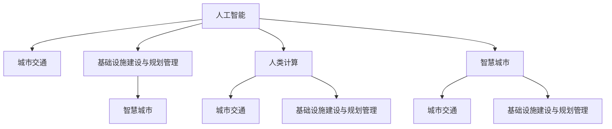
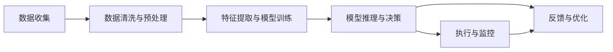

                 

# AI与人类计算：打造可持续发展的城市交通与基础设施建设与规划管理

> 关键词：人工智能,城市交通,基础设施,智慧城市,计算模型,智能决策,环境影响评估,交通仿真,城市规划,优化算法

## 1. 背景介绍

在快速发展的城市化进程中，交通拥堵、环境污染、基础设施不足等城市问题日益凸显。为了应对这些挑战，城市管理者亟需利用最新的技术手段，实现高效、智能、可持续的城市交通与基础设施建设与规划管理。人工智能（AI）作为现代科技的前沿领域，为解决这些复杂问题提供了新的视角和方法。本文旨在探讨如何利用AI技术，尤其是人类计算范式，提升城市交通与基础设施建设的效率和质量，推动智慧城市的可持续发展。

## 2. 核心概念与联系

### 2.1 核心概念概述

本节将介绍几个核心概念，这些概念构成了AI与人类计算在城市交通与基础设施规划管理中的应用基础：

- **人工智能（AI）**：使用计算机算法模拟人类智能行为的技术，涵盖机器学习、深度学习、自然语言处理、计算机视觉等多个领域。

- **人类计算（Human Computation）**：利用人类智慧和经验进行复杂计算和问题解决的过程。在城市管理中，人类计算可以理解为利用城市居民的日常行为数据和社区参与，辅助决策和规划。

- **城市交通**：涉及城市内部的公共交通、私人交通、非机动车交通等的规划、建设与运营管理。

- **基础设施建设与规划管理**：包括城市道路、桥梁、公共设施等的建设规划与维护管理。

- **智慧城市**：通过信息通信技术（ICT）和AI技术的应用，实现城市运行的智能化、自动化和可持续发展。

这些概念之间的联系可以通过以下Mermaid流程图来展示：



这个流程图展示了AI、人类计算、城市交通、基础设施建设与规划管理、智慧城市之间的关系：

1. AI技术可以为城市交通和基础设施的智能化建设提供技术支持。
2. 人类计算可以辅助AI技术，利用城市居民的行为数据和社区参与，提升决策的科学性和合理性。
3. 智慧城市依托于AI技术和人类计算，实现城市运行的智能化。

### 2.2 核心概念原理和架构的 Mermaid 流程图

下面是一个简化的 Mermaid 流程图，展示了一个基于AI和人类计算的城市交通与基础设施规划管理系统的大致架构：



在这个流程图中，各环节依次描述了从数据收集到模型优化，再到执行与监控的全过程。数据收集与预处理环节主要涉及交通流量、天气、居民出行数据等；特征提取与模型训练环节通过AI算法，如深度学习模型，学习数据中的复杂模式；模型推理与决策环节则是将训练好的模型应用于实时场景，辅助决策；执行与监控环节涉及模型输出结果的实际落地应用；反馈与优化环节则通过实时监控和居民反馈，不断优化模型。

## 3. 核心算法原理 & 具体操作步骤

### 3.1 算法原理概述

利用AI和人类计算打造可持续发展的城市交通与基础设施建设与规划管理系统，主要涉及以下几个算法原理：

1. **数据驱动的决策支持**：通过收集和分析大量的交通与基础设施数据，利用AI算法辅助决策。
2. **模拟仿真与优化算法**：运用交通仿真与优化算法，预测交通流量变化，优化基础设施布局。
3. **智能预测与预警**：利用时间序列分析等技术，对未来交通与基础设施运行情况进行预测与预警。
4. **实时监测与反馈机制**：通过传感器、摄像头等设备实时监测交通与基础设施状态，实现动态调整。
5. **人机协同的决策过程**：结合AI算法和人类专家的智慧，进行复杂问题的综合决策。

### 3.2 算法步骤详解

#### 3.2.1 数据收集与预处理

数据收集与预处理是AI和人类计算在城市管理中的应用起点。主要步骤如下：

1. **数据来源**：通过传感器、监控设备、居民问卷等多种渠道，收集交通流量、天气、居民出行等数据。
2. **数据清洗**：对原始数据进行去重、缺失值处理、异常值检测等预处理操作。
3. **数据融合**：将来自不同渠道的数据进行融合，形成统一的数据集。

#### 3.2.2 特征提取与模型训练

特征提取与模型训练是AI算法的核心环节，主要步骤如下：

1. **特征工程**：选择和构造有助于模型训练的特征，如交通流量、道路拥堵情况、天气条件等。
2. **模型选择**：根据具体任务选择适合的AI算法，如深度学习、决策树、支持向量机等。
3. **模型训练**：使用历史数据训练AI模型，调整模型参数以优化性能。

#### 3.2.3 模型推理与决策

模型推理与决策是将训练好的AI模型应用于实际场景的关键步骤。主要步骤如下：

1. **模型部署**：将训练好的模型部署到城市管理系统中。
2. **实时推理**：在实时场景中，使用AI模型进行预测和决策。
3. **结果应用**：根据AI模型的输出结果，调整交通信号灯、优化道路布局等。

#### 3.2.4 执行与监控

执行与监控环节确保了AI决策的实际落地应用。主要步骤如下：

1. **执行操作**：根据AI模型的输出，进行实际调整和优化操作。
2. **实时监测**：使用传感器、摄像头等设备实时监测交通与基础设施状态。
3. **反馈机制**：通过居民反馈、系统自动检测等手段，收集执行效果和问题，形成反馈闭环。

#### 3.2.5 反馈与优化

反馈与优化环节对AI模型进行持续改进。主要步骤如下：

1. **反馈收集**：收集执行效果和居民反馈信息。
2. **数据分析**：对反馈数据进行分析，识别模型问题和优化方向。
3. **模型优化**：根据分析结果，调整模型参数或重新训练模型。

### 3.3 算法优缺点

#### 3.3.1 优点

1. **效率提升**：AI和人类计算的结合，可以大幅提升决策的效率和准确性。
2. **智能化应用**：AI技术可以处理复杂的交通与基础设施数据，提供智能化解决方案。
3. **成本降低**：通过优化模型参数和调整基础设施布局，可以降低城市管理的运营成本。
4. **弹性调整**：实时监测和反馈机制，使得系统可以动态调整，适应各种突发情况。

#### 3.3.2 缺点

1. **数据依赖**：AI模型依赖高质量的数据，数据不完整或不准确会影响模型性能。
2. **模型复杂性**：AI算法通常较复杂，需要大量计算资源和时间进行训练和优化。
3. **用户接受度**：AI决策可能缺乏直观的解释，用户对新系统的接受度较低。
4. **安全问题**：AI系统可能受到恶意攻击，影响城市运行安全。

### 3.4 算法应用领域

基于AI和人类计算的城市交通与基础设施建设与规划管理系统，可以在多个领域得到应用：

1. **交通流量预测与优化**：利用AI模型预测交通流量，优化交通信号灯设置，减少拥堵。
2. **基础设施布局优化**：通过模拟仿真，优化道路、桥梁等基础设施布局，提升通行效率。
3. **环境影响评估**：评估基础设施建设对环境的影响，辅助决策。
4. **智能决策支持**：在城市规划、应急响应、资源配置等方面提供智能决策支持。

## 4. 数学模型和公式 & 详细讲解 & 举例说明

### 4.1 数学模型构建

假设城市交通系统由n个交叉口和m条路段组成，交通流量由速度和密度决定。设每个交叉口在t时刻的交通流量为$x_i$，路段长度为$l$，路段容量为$C$。模型的目标是预测t+1时刻的交通流量$x_i^{t+1}$，并优化交通信号灯设置和基础设施布局。

数学模型可以描述为：
$$
x_i^{t+1} = f(x_i^t, l, C)
$$

其中，$f$为交通流量的动态变化函数。

### 4.2 公式推导过程

利用交通仿真模型（如VISSIM、SIMULINK等），可以建立交通流量的动态变化函数$f$。以下以VISSIM模型为例，推导交通流量的动态变化过程。

1. **交通流动态方程**：
   $$
   x_i^{t+1} = x_i^t + v_i^t \Delta t - l_i^t \frac{v_i^t}{C}
   $$
   其中，$v_i^t$为交叉口i在t时刻的平均车速，$l_i^t$为交叉口i在t时刻的实际占用车道长度。

2. **车辆到达过程**：
   假设车辆到达率为$\lambda$，则每个交叉口i在t时刻到达的车辆数为$\lambda \Delta t$。

3. **车辆离开过程**：
   每个交叉口i的车辆流出率为$\frac{v_i^t}{C}$，则在t时刻流出i的车辆数为$\frac{v_i^t}{C} \Delta t$。

4. **车辆排队与延误**：
   假设交叉口i的车辆在t时刻的排队长度为$L_i^t$，则每个交叉口的延误时间为$d_i^t = L_i^t v_i^t$。

结合以上公式，可以建立交通流量的动态变化函数$f$：
$$
f(x_i^t, l, C) = \begin{cases}
x_i^t + \lambda \Delta t - \frac{v_i^t}{C} \Delta t - d_i^t, & x_i^t < C \\
x_i^t - l_i^t \frac{v_i^t}{C} + d_i^t, & x_i^t \geq C
\end{cases}
$$

### 4.3 案例分析与讲解

#### 案例一：交通流量预测与优化

假设某城市有20个交叉口，每个交叉口的容量为2000辆/小时。现有20天交通流量数据，需要预测未来一周每天的交通流量。

1. **数据预处理**：对20天的交通流量数据进行清洗和预处理，去除异常值和缺失值。
2. **特征选择**：选择交通流量、车速、天气等特征作为模型输入。
3. **模型训练**：使用深度学习模型，如RNN、LSTM，进行交通流量预测。
4. **模型评估**：在验证集上评估模型的性能，选择预测精度较高的模型。
5. **模型应用**：将训练好的模型应用于未来一周的交通流量预测，并根据预测结果优化交通信号灯设置。

#### 案例二：基础设施布局优化

假设某城市计划新建一条连接市区与郊区的高速公路，需要优化道路布局以减少拥堵。

1. **数据收集**：收集当前道路交通流量、路段长度、车辆到达率等数据。
2. **模型选择**：选择交通仿真模型，如SIMULINK，模拟新道路的交通情况。
3. **模拟仿真**：在新道路不同布局下，模拟交通流量的变化情况。
4. **优化分析**：对仿真结果进行分析，选择最优的道路布局方案。
5. **方案评估**：评估不同方案的优缺点，选择最佳的实施方案。

## 5. 项目实践：代码实例和详细解释说明

### 5.1 开发环境搭建

要进行AI和人类计算在城市交通与基础设施建设与规划管理中的应用开发，需要搭建相应的开发环境。以下是Python环境搭建的步骤：

1. **安装Python**：从官网下载并安装Python，建议使用最新版本。
2. **安装相关库**：安装必要的Python库，如NumPy、Pandas、SciPy等。
3. **安装AI库**：安装TensorFlow、PyTorch等AI库，用于构建和训练模型。
4. **安装可视化工具**：安装Matplotlib、Seaborn等可视化工具，用于数据可视化。

### 5.2 源代码详细实现

#### 5.2.1 数据预处理

以下是一个简单的Python代码示例，用于处理交通流量数据：

```python
import pandas as pd
import numpy as np

# 读取交通流量数据
data = pd.read_csv('traffic_data.csv')

# 数据清洗
data = data.dropna()
data = data[data['traffic'] > 0]

# 特征工程
data['day'] = data['date'].apply(lambda x: x.day)
data['month'] = data['date'].apply(lambda x: x.month)

# 数据可视化
import matplotlib.pyplot as plt
plt.scatter(data['traffic'], data['temperature'], alpha=0.5)
plt.xlabel('Traffic')
plt.ylabel('Temperature')
plt.show()
```

#### 5.2.2 特征提取与模型训练

以下是一个使用TensorFlow构建深度学习模型的Python代码示例：

```python
import tensorflow as tf
from tensorflow.keras import layers, models

# 定义模型
model = models.Sequential([
    layers.Dense(64, activation='relu', input_shape=(2,)),
    layers.Dense(32, activation='relu'),
    layers.Dense(1, activation='sigmoid')
])

# 编译模型
model.compile(optimizer=tf.keras.optimizers.Adam(0.01),
              loss='mse',
              metrics=['mae'])

# 训练模型
model.fit(x_train, y_train, epochs=100, validation_data=(x_test, y_test))
```

#### 5.2.3 模型推理与决策

以下是一个简单的Python代码示例，用于实时监测交通流量：

```python
import pandas as pd
import matplotlib.pyplot as plt

# 读取交通流量数据
data = pd.read_csv('traffic_data.csv')

# 实时监测
while True:
    data = pd.read_csv('traffic_data.csv')
    plt.scatter(data['traffic'], data['temperature'], alpha=0.5)
    plt.show()
    time.sleep(10)
```

### 5.3 代码解读与分析

#### 5.3.1 数据预处理

数据预处理环节主要是对原始数据进行清洗和预处理，以提高数据的质量和一致性。常见的预处理操作包括去重、缺失值处理、异常值检测等。

#### 5.3.2 特征提取与模型训练

特征提取与模型训练环节主要涉及模型的选择和训练。通过选择合适的特征和算法，利用历史数据训练模型，以获取更准确的预测结果。

#### 5.3.3 模型推理与决策

模型推理与决策环节主要涉及模型的实时应用。通过部署训练好的模型，实时获取预测结果，辅助决策。

### 5.4 运行结果展示

运行结果展示环节主要涉及模型预测结果的展示和反馈。通过可视化工具，展示模型预测的交通流量和实际数据的对比，识别模型性能。

## 6. 实际应用场景

### 6.1 智能交通信号灯系统

智能交通信号灯系统通过实时监测交通流量，自动调整信号灯配时，减少拥堵和等待时间。AI模型可以在大规模数据集上训练，学习交通流量的动态变化规律，从而优化信号灯配时，提升交通效率。

### 6.2 基础设施建设与优化

基础设施建设与优化涉及道路、桥梁、公共交通等的规划和布局。AI和人类计算可以结合，利用数据分析和专家经验，优化基础设施的建设与运营。例如，AI模型可以预测新道路的交通流量，辅助优化道路布局；人类计算可以结合专家的城市规划经验，辅助决策。

### 6.3 智慧城市综合管理

智慧城市综合管理涉及城市运行的各个方面，包括交通、能源、环境、公共安全等。AI和人类计算可以结合，构建综合智能管理系统，提升城市管理的智能化水平。例如，AI模型可以预测能源需求，优化能源分配；人类计算可以结合社区参与，优化公共服务的配置。

## 7. 工具和资源推荐

### 7.1 学习资源推荐

为了帮助开发者系统掌握AI和人类计算在城市交通与基础设施建设与规划管理中的应用，这里推荐一些优质的学习资源：

1. **深度学习入门教程**：《Deep Learning with Python》等书籍，系统介绍了深度学习的基本原理和应用场景。
2. **交通仿真工具**：《VISSIM交通仿真》等书籍，介绍了交通仿真的基本原理和实践方法。
3. **智慧城市规划与建设**：《Smart Cities: Foundations and Future Directions》等书籍，介绍了智慧城市的基本概念和应用场景。
4. **人工智能与人类计算**：《Human-Computer Interaction in AI and Robotics》等书籍，介绍了AI和人类计算的结合方式和应用案例。
5. **在线课程**：Coursera、edX等平台提供的相关课程，系统介绍了AI和人类计算在城市管理中的应用。

通过对这些资源的学习实践，相信你一定能够快速掌握AI和人类计算在城市交通与基础设施建设与规划管理中的应用，为实际问题提供解决方案。

### 7.2 开发工具推荐

高效的开发离不开优秀的工具支持。以下是几款用于AI和人类计算在城市交通与基础设施建设与规划管理中的应用开发的常用工具：

1. **Python**：作为数据科学和AI开发的主流语言，Python拥有丰富的库和框架支持。
2. **TensorFlow**：由Google主导开发的开源深度学习框架，生产部署方便，适合大规模工程应用。
3. **PyTorch**：Facebook开源的深度学习框架，灵活动态的计算图，适合快速迭代研究。
4. **Jupyter Notebook**：交互式的Python开发环境，支持代码块和可视化工具的集成，方便学习和调试。
5. **Gephi**：社交网络分析工具，可以用于分析交通网络、基础设施布局等。

合理利用这些工具，可以显著提升AI和人类计算在城市交通与基础设施建设与规划管理中的应用开发效率，加快创新迭代的步伐。

### 7.3 相关论文推荐

AI和人类计算在城市交通与基础设施建设与规划管理中的应用，源于学界的持续研究。以下是几篇奠基性的相关论文，推荐阅读：

1. **智能交通系统**：《Intelligent Transportation Systems: A Comprehensive Review》。
2. **基础设施优化**：《Optimizing Urban Infrastructure with Machine Learning》。
3. **智慧城市**：《Building Smart Cities with AI and IoT》。
4. **人类计算**：《Human Computation in AI and Robotics: Opportunities and Challenges》。
5. **多模态融合**：《Multi-modal Integration in Smart Cities》。

这些论文代表了大规模数据驱动的城市交通与基础设施规划管理的研究方向，通过学习这些前沿成果，可以帮助研究者把握学科前进方向，激发更多的创新灵感。

## 8. 总结：未来发展趋势与挑战

### 8.1 总结

本文对利用AI和人类计算打造可持续发展的城市交通与基础设施建设与规划管理进行了全面系统的介绍。首先阐述了AI和人类计算在城市管理中的重要性与必要性，明确了其对城市交通与基础设施建设与规划管理的潜在贡献。其次，从原理到实践，详细讲解了AI和人类计算的数学模型和关键步骤，给出了实际应用的代码实例。同时，本文还探讨了AI和人类计算在多个行业领域的应用前景，展示了其广泛的应用价值。

通过本文的系统梳理，可以看到，AI和人类计算在城市交通与基础设施建设与规划管理中的应用，不仅有助于解决传统城市管理的难题，还能推动智慧城市的可持续发展。AI技术为数据驱动的城市管理提供了新的思路和方法，人类计算则为AI决策提供了丰富的背景知识和经验支持。

### 8.2 未来发展趋势

展望未来，AI和人类计算在城市交通与基础设施建设与规划管理中的应用将呈现以下几个发展趋势：

1. **智能化应用扩展**：AI技术将在城市交通与基础设施管理的各个环节得到更广泛的应用，包括交通流量预测、基础设施布局优化、智慧城市综合管理等。
2. **数据驱动决策**：利用大数据和AI算法，提供更科学、智能的城市管理决策，优化资源配置和运营效率。
3. **跨领域融合**：AI和人类计算将与其他新兴技术如物联网、区块链等结合，形成更全面、智能的城市管理系统。
4. **公众参与与透明**：引入公众参与机制，提高城市管理的透明度和信任度，促进城市治理的民主化和科学化。
5. **可持续性评估**：通过环境影响评估等技术，优化城市建设方案，实现可持续发展的目标。

以上趋势凸显了AI和人类计算在城市交通与基础设施建设与规划管理中的广阔前景。这些方向的探索发展，必将进一步提升城市管理的智能化、自动化和可持续性，推动智慧城市的建设进程。

### 8.3 面临的挑战

尽管AI和人类计算在城市交通与基础设施建设与规划管理中的应用前景广阔，但在实际应用中仍面临诸多挑战：

1. **数据质量与隐私**：高质量的数据是AI和人类计算应用的基础，数据获取和处理过程中存在数据不完整、数据隐私等问题。
2. **模型复杂性与可解释性**：AI模型通常较为复杂，难以解释模型的内部决策过程，缺乏透明性和可解释性。
3. **技术集成与兼容性**：不同领域的技术和系统间存在兼容性问题，需要技术集成和标准化。
4. **利益冲突与伦理问题**：城市管理的智能化过程中，可能存在利益冲突和伦理问题，需要合理的政策法规保障。
5. **安全性与韧性**：城市管理系统的安全性与韧性问题，如网络攻击、系统故障等，需要全面考虑和应对。

### 8.4 研究展望

面对AI和人类计算在城市交通与基础设施建设与规划管理中的应用所面临的挑战，未来的研究需要在以下几个方面寻求新的突破：

1. **数据质量与隐私保护**：通过数据清洗、数据共享等手段，提高数据质量和可用性，保护数据隐私。
2. **模型透明性与可解释性**：开发可解释的AI模型，提高模型的透明性和可解释性，增强公众对AI决策的信任。
3. **技术集成与标准化**：推动技术标准化和集成，建立统一的智能城市管理平台。
4. **利益冲突与伦理问题**：制定合理的政策法规，平衡各利益相关方的需求，保障公平性。
5. **安全性与韧性建设**：加强系统安全性与韧性设计，提高系统的鲁棒性和恢复能力。

这些研究方向的探索，必将引领AI和人类计算在城市交通与基础设施建设与规划管理中的应用迈向成熟，为智慧城市的可持续发展提供坚实的技术保障。面向未来，AI和人类计算将在构建智能、绿色、可持续的城市环境中发挥重要作用，推动人类社会的进步与发展。

## 9. 附录：常见问题与解答

**Q1：AI和人类计算在城市交通与基础设施建设与规划管理中的应用主要面临哪些挑战？**

A: AI和人类计算在城市交通与基础设施建设与规划管理中的应用主要面临以下挑战：

1. **数据质量与隐私问题**：高质量的数据是AI和人类计算应用的基础，数据获取和处理过程中存在数据不完整、数据隐私等问题。
2. **模型复杂性与可解释性**：AI模型通常较为复杂，难以解释模型的内部决策过程，缺乏透明性和可解释性。
3. **技术集成与兼容性**：不同领域的技术和系统间存在兼容性问题，需要技术集成和标准化。
4. **利益冲突与伦理问题**：城市管理的智能化过程中，可能存在利益冲突和伦理问题，需要合理的政策法规保障。
5. **安全性与韧性问题**：城市管理系统的安全性与韧性问题，如网络攻击、系统故障等，需要全面考虑和应对。

**Q2：如何应对数据质量与隐私问题？**

A: 应对数据质量与隐私问题的主要方法包括：

1. **数据清洗与预处理**：对原始数据进行清洗和预处理，去除异常值和缺失值。
2. **数据共享与合作**：建立跨部门、跨领域的数据共享机制，通过合作提高数据质量和可用性。
3. **数据匿名化与隐私保护**：采用数据匿名化、差分隐私等技术，保护数据隐私。

**Q3：如何提高AI模型的透明性与可解释性？**

A: 提高AI模型的透明性与可解释性的方法包括：

1. **模型简化**：通过简化模型结构，降低模型的复杂度，提高模型的可解释性。
2. **可解释性模型**：使用可解释性模型，如决策树、规则模型等，提高模型的透明性。
3. **解释性工具**：利用解释性工具，如LIME、SHAP等，分析模型的决策过程，提高模型的可解释性。

**Q4：如何实现技术集成与标准化？**

A: 实现技术集成与标准化的主要方法包括：

1. **统一数据格式**：采用统一的数据格式，提高数据之间的兼容性。
2. **接口标准化**：制定统一的技术接口标准，促进不同系统之间的集成。
3. **开源项目与社区合作**：参与开源项目和社区合作，推动技术标准化。

**Q5：如何应对利益冲突与伦理问题？**

A: 应对利益冲突与伦理问题的主要方法包括：

1. **政策法规制定**：制定合理的政策法规，平衡各利益相关方的需求，保障公平性。
2. **公众参与机制**：引入公众参与机制，提高城市管理的透明度和信任度。
3. **伦理审查**：建立伦理审查机制，对AI和人类计算的应用进行伦理审查。

**Q6：如何提高城市管理系统的安全性与韧性？**

A: 提高城市管理系统的安全性与韧性的方法包括：

1. **安全策略与措施**：制定全面的安全策略和措施，防范网络攻击和系统故障。
2. **数据备份与恢复**：建立数据备份与恢复机制，保障数据的完整性和可用性。
3. **灾备演练与应急预案**：开展灾备演练与应急预案，提高系统的鲁棒性和恢复能力。

通过合理应对这些挑战，AI和人类计算在城市交通与基础设施建设与规划管理中的应用将更加广泛和深入，为智慧城市的可持续发展提供坚实的技术保障。

---

作者：禅与计算机程序设计艺术 / Zen and the Art of Computer Programming

