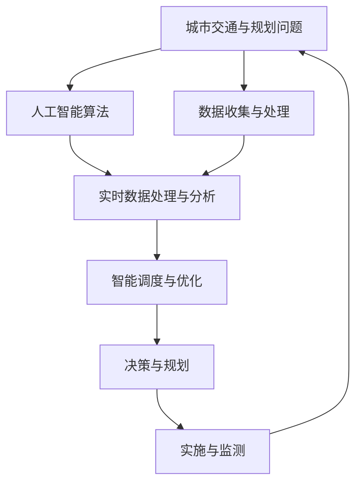

                 

## 1. 背景介绍

在过去的几十年里，城市交通和规划已经成为全球关注的热点问题之一。随着城市人口的增长和城市化进程的加快，交通拥堵、环境污染、资源分配等问题日益严重。传统城市规划和交通管理方法往往依赖于经验和直觉，难以应对现代城市的复杂性和多样性。因此，越来越多的人开始探索通过人工智能（AI）和大数据技术来解决这些问题，特别是通过“人类计算”（Human Computation）来优化城市交通与规划。

### 1.1 问题由来

现代城市面临的交通与规划问题包括但不限于：

- **交通拥堵**：随着汽车数量的增加，许多城市的交通拥堵问题日益严重，这不仅影响人们的日常出行，还造成能源浪费和环境污染。
- **公共交通效率低下**：由于缺乏实时数据和智能调度，公共交通系统往往效率低下，难以满足人们多样化的出行需求。
- **环境污染**：大量的交通活动和建设活动导致空气质量下降，影响了居民的生活质量和健康。
- **资源分配不合理**：城市资源的分配常常缺乏科学依据，导致公共资源利用率低下，甚至造成资源的浪费。

### 1.2 问题核心关键点

人类计算旨在通过“计算力”（包括人工智能、大数据分析等）和“脑力”（包括人类专家的知识和经验）的协同，来解决复杂的城市交通与规划问题。其核心关键点包括：

- **数据驱动**：城市交通与规划问题本质上是一个数据密集型问题，需要通过收集、分析和利用海量数据来优化决策过程。
- **智能调度**：利用人工智能技术，如机器学习和深度学习，来优化交通和资源的分配与调度。
- **人类监督**：将人工智能的计算能力与人类专家的经验结合起来，确保决策的科学性和合理性。

## 2. 核心概念与联系

### 2.1 核心概念概述

在讨论人类计算在城市交通与规划中的应用时，需要了解以下几个核心概念：

- **人类计算**：通过将复杂的计算任务分解为易于处理的子任务，并将这些子任务分配给人类工作者，来加速计算过程。
- **人工智能**：包括机器学习、深度学习、自然语言处理等技术，通过数据驱动的方法来解决复杂问题。
- **城市交通与规划**：涉及城市道路规划、交通流量控制、公共交通优化、环境监测等多个方面。
- **可持续性**：在城市交通与规划中，考虑到长期的环境、社会和经济影响，确保城市发展的可持续性。

### 2.2 核心概念原理和架构的 Mermaid 流程图



### 2.3 核心概念联系

人类计算在城市交通与规划中的应用，通过以下步骤实现：

1. **数据收集与处理**：通过传感器、智能设备等手段收集城市交通和环境数据。
2. **人工智能算法**：利用机器学习和深度学习等技术，对收集到的数据进行分析，识别模式和趋势。
3. **实时数据处理与分析**：对实时数据进行高效处理和分析，及时发现问题并做出响应。
4. **智能调度与优化**：通过智能算法，优化交通流和资源分配，提高效率和可持续性。
5. **决策与规划**：将分析结果和优化建议反馈给决策者和规划师，制定科学合理的决策。
6. **实施与监测**：将决策付诸实施，并持续监测效果，根据反馈不断优化。

## 3. 核心算法原理 & 具体操作步骤

### 3.1 算法原理概述

人类计算在城市交通与规划中的应用，主要基于以下算法原理：

- **数据驱动**：通过收集、清洗和分析大量数据，发现问题并提出解决方案。
- **机器学习与深度学习**：利用历史数据训练模型，预测未来的交通流量和环境变化。
- **优化算法**：通过优化算法，如遗传算法、粒子群算法等，优化交通流和资源分配。
- **模拟与仿真**：利用仿真软件，如交通模拟软件和环境模拟软件，验证和优化解决方案。

### 3.2 算法步骤详解

人类计算在城市交通与规划中的应用主要包括以下步骤：

1. **数据收集与预处理**：使用传感器、智能设备等手段收集城市交通和环境数据，并进行清洗和预处理。
2. **特征提取与建模**：从数据中提取特征，并使用机器学习和深度学习模型进行建模。
3. **预测与优化**：利用模型进行预测，并使用优化算法优化交通流和资源分配。
4. **仿真与验证**：使用仿真软件验证模型的效果，并进行必要的调整和优化。
5. **决策与实施**：将优化结果反馈给决策者和规划师，制定决策并实施。
6. **监测与评估**：持续监测实施效果，并根据反馈进行必要的调整和优化。

### 3.3 算法优缺点

人类计算在城市交通与规划中的应用具有以下优点：

- **数据驱动**：通过大量数据的分析，可以发现传统方法难以发现的问题。
- **智能化**：利用人工智能技术，可以处理复杂的数据集，发现深层次的关联和趋势。
- **高效性**：通过并行计算和分布式处理，可以显著提高计算效率。
- **可扩展性**：可以随着数据量的增加，不断优化和扩展系统。

同时，也存在一些缺点：

- **依赖数据质量**：数据的准确性和完整性对结果有重大影响。
- **算法复杂性**：复杂的算法可能需要大量的计算资源和专业知识。
- **人类干预**：需要人类的监督和决策，可能会引入人为因素的干扰。
- **伦理问题**：数据隐私和安全问题需要得到充分的考虑。

### 3.4 算法应用领域

人类计算在城市交通与规划中的应用，涵盖以下几个主要领域：

- **交通流量控制**：通过实时数据和智能算法，优化交通流，减少拥堵。
- **公共交通优化**：利用数据和模型，优化公交线路和站点，提高公共交通效率。
- **环境监测与治理**：通过传感器和智能设备，监测环境质量，提出治理建议。
- **资源分配与利用**：通过数据分析，优化城市资源的分配和利用。

## 4. 数学模型和公式 & 详细讲解

### 4.1 数学模型构建

在城市交通与规划中，我们可以构建以下数学模型：

- **交通流量模型**：描述交通流量的动态变化，例如：

$$
\dot{x} = -\alpha x + \beta f(x)
$$

其中 $x$ 表示交通流量，$\alpha$ 和 $\beta$ 为模型参数，$f(x)$ 表示交通需求函数。

- **资源分配模型**：描述资源（如交通设施、环境监测设备）的分配，例如：

$$
\min \sum_i c_i x_i
$$

其中 $c_i$ 表示资源 $i$ 的单位成本，$x_i$ 表示资源 $i$ 的分配量。

- **环境监测模型**：描述环境质量的监测与治理，例如：

$$
\dot{y} = -\gamma y + \delta z
$$

其中 $y$ 表示环境质量，$\gamma$ 和 $\delta$ 为模型参数，$z$ 表示环境干预措施。

### 4.2 公式推导过程

以交通流量模型为例，推导其基本原理：

假设交通流量 $x$ 随时间 $t$ 的变化率为 $\dot{x}$，根据交通流量的基本定律，可以得到：

$$
\dot{x} = -\alpha x + \beta f(x)
$$

其中，$-\alpha x$ 表示交通流量的自然衰减，$\beta f(x)$ 表示交通需求。

交通需求函数 $f(x)$ 可以根据实际情况设定，例如：

$$
f(x) = k_1 x + k_2 x^2
$$

其中 $k_1$ 和 $k_2$ 为模型参数。

通过求解上述微分方程，可以得到交通流量的变化规律：

$$
x(t) = e^{-\alpha t} [ x_0 + \frac{\beta k_1}{\alpha} (e^{\alpha t} - 1) - \frac{\beta k_2}{\alpha^2} (e^{2\alpha t} - 1) ]
$$

### 4.3 案例分析与讲解

以交通流量控制为例，分析其实际应用：

假设某城市主要交通干道 $i$ 的交通流量为 $x_i(t)$，其变化率为 $\dot{x}_i$。根据交通流量模型，可以得到：

$$
\dot{x}_i = -\alpha_i x_i + \beta_i f_i(x_i)
$$

其中，$\alpha_i$ 和 $\beta_i$ 为交通干道 $i$ 的模型参数，$f_i(x_i)$ 为交通需求函数。

在实际应用中，可以通过数据收集和分析，得到模型参数 $\alpha_i$ 和 $\beta_i$，并使用模型预测交通流量。例如，如果预测到某路段交通流量过大，可以采取交通管制措施，如增加交通信号灯的绿灯时间，或者调整公交线路。

## 5. 项目实践：代码实例和详细解释说明

### 5.1 开发环境搭建

在开始项目实践前，需要准备好开发环境。以下是使用Python进行PyTorch开发的环境配置流程：

1. 安装Anaconda：从官网下载并安装Anaconda，用于创建独立的Python环境。

2. 创建并激活虚拟环境：
```bash
conda create -n pytorch-env python=3.8 
conda activate pytorch-env
```

3. 安装PyTorch：根据CUDA版本，从官网获取对应的安装命令。例如：
```bash
conda install pytorch torchvision torchaudio cudatoolkit=11.1 -c pytorch -c conda-forge
```

4. 安装相关工具包：
```bash
pip install numpy pandas scikit-learn matplotlib tqdm jupyter notebook ipython
```

完成上述步骤后，即可在`pytorch-env`环境中开始项目实践。

### 5.2 源代码详细实现

以下是使用PyTorch进行交通流量预测的代码实现：

```python
import torch
import torch.nn as nn
import torch.optim as optim

# 定义模型
class TrafficFlowModel(nn.Module):
    def __init__(self):
        super(TrafficFlowModel, self).__init__()
        self.fc1 = nn.Linear(1, 1)
        self.fc2 = nn.Linear(1, 1)
        
    def forward(self, x):
        x = torch.sigmoid(self.fc1(x))
        x = torch.sigmoid(self.fc2(x))
        return x

# 定义数据
x = torch.tensor([10.0])
y = torch.tensor([8.0])

# 定义模型参数
model = TrafficFlowModel()
learning_rate = 0.01
optimizer = optim.SGD(model.parameters(), lr=learning_rate)

# 训练模型
for epoch in range(1000):
    optimizer.zero_grad()
    y_pred = model(x)
    loss = nn.MSELoss()(y_pred, y)
    loss.backward()
    optimizer.step()
    if epoch % 100 == 0:
        print(f"Epoch {epoch}, Loss: {loss.item()}")
        
# 使用模型预测
x_test = torch.tensor([20.0])
y_test = model(x_test)
print(f"Predicted: {y_test.item()}")
```

### 5.3 代码解读与分析

让我们再详细解读一下关键代码的实现细节：

**TrafficFlowModel类**：
- `__init__`方法：定义模型的结构，包含两个线性层。
- `forward`方法：实现前向传播，通过两个线性层和sigmoid激活函数输出结果。

**数据定义**：
- `x`表示输入的交通流量，`y`表示期望的输出流量。

**模型定义**：
- 使用PyTorch的神经网络模块，定义了一个简单的二元线性回归模型。

**训练过程**：
- 定义优化器，使用随机梯度下降优化模型参数。
- 在每个epoch中，使用SGD更新模型参数，输出损失。
- 每隔100个epoch输出一次损失，以便监控训练进展。

**预测过程**：
- 使用训练好的模型对测试集进行预测，并输出结果。

可以看到，通过PyTorch的简单封装，我们可以轻松实现交通流量预测的模型训练和预测。在实际应用中，还需要将模型部署到实际环境中，并进行持续监测和优化。

## 6. 实际应用场景

### 6.1 智能交通系统

智能交通系统（ITS）通过人类计算技术，可以实现交通流量的实时监测和优化。具体应用包括：

- **交通信号灯优化**：通过实时数据，优化交通信号灯的绿灯时间和切换时机，减少交通拥堵。
- **事故预测与处理**：利用传感器和摄像头，预测潜在的事故风险，并及时进行处理。
- **路径规划与导航**：通过智能算法，推荐最优的行车路径，减少驾驶时间和燃料消耗。

### 6.2 公共交通优化

公共交通系统是城市交通的重要组成部分，通过人类计算技术，可以提高公共交通的效率和舒适度。具体应用包括：

- **线路优化**：利用数据分析，优化公交线路和站点，提高公交车的运营效率。
- **载客量预测**：通过历史数据，预测公交车的载客量，优化发车间隔和车辆调度。
- **实时调度**：根据实时数据，动态调整公交车的发车时间，避免高峰期拥堵。

### 6.3 环境监测与治理

环境监测与治理是城市管理的重要环节，通过人类计算技术，可以实现环境质量的实时监测和治理。具体应用包括：

- **空气质量监测**：利用传感器和智能设备，监测空气质量，预警污染风险。
- **水质监测**：通过智能设备，监测水质变化，提出治理建议。
- **噪声监测**：利用传感器监测城市噪声水平，提出降噪措施。

### 6.4 未来应用展望

随着技术的不断进步，人类计算在城市交通与规划中的应用将更加广泛和深入。未来可能包括：

- **自动驾驶与车联网**：通过人类计算技术，优化自动驾驶算法，实现智能车联网。
- **城市物流优化**：利用数据分析和优化算法，优化城市物流和配送。
- **智能城市管理**：通过城市大数据平台，实现城市资源的智能分配和管理。

## 7. 工具和资源推荐

### 7.1 学习资源推荐

为了帮助开发者系统掌握人类计算在城市交通与规划中的应用，这里推荐一些优质的学习资源：

1. **《人类计算：数据驱动的城市规划与交通管理》**：该书详细介绍了人类计算在城市交通与规划中的应用，包括数据收集、模型构建、算法实现等。

2. **CS224N《深度学习自然语言处理》课程**：斯坦福大学开设的NLP明星课程，涵盖了机器学习和深度学习的基础知识，适合初学者入门。

3. **《人工智能与城市交通》**：该书结合实际案例，介绍了人工智能在城市交通中的应用，包括智能调度、交通管理等。

4. **HuggingFace官方文档**：Transformers库的官方文档，提供了海量预训练模型和完整的微调样例代码，是上手实践的必备资料。

5. **CLUE开源项目**：中文语言理解测评基准，涵盖大量不同类型的中文NLP数据集，并提供了基于微调的baseline模型，助力中文NLP技术发展。

通过对这些资源的学习实践，相信你一定能够快速掌握人类计算在城市交通与规划中的应用，并用于解决实际的NLP问题。

### 7.2 开发工具推荐

高效的开发离不开优秀的工具支持。以下是几款用于人类计算开发常用的工具：

1. **PyTorch**：基于Python的开源深度学习框架，灵活动态的计算图，适合快速迭代研究。大部分预训练语言模型都有PyTorch版本的实现。

2. **TensorFlow**：由Google主导开发的开源深度学习框架，生产部署方便，适合大规模工程应用。同样有丰富的预训练语言模型资源。

3. **Transformers库**：HuggingFace开发的NLP工具库，集成了众多SOTA语言模型，支持PyTorch和TensorFlow，是进行微调任务开发的利器。

4. **Weights & Biases**：模型训练的实验跟踪工具，可以记录和可视化模型训练过程中的各项指标，方便对比和调优。与主流深度学习框架无缝集成。

5. **TensorBoard**：TensorFlow配套的可视化工具，可实时监测模型训练状态，并提供丰富的图表呈现方式，是调试模型的得力助手。

6. **Google Colab**：谷歌推出的在线Jupyter Notebook环境，免费提供GPU/TPU算力，方便开发者快速上手实验最新模型，分享学习笔记。

合理利用这些工具，可以显著提升人类计算任务的开发效率，加快创新迭代的步伐。

### 7.3 相关论文推荐

人类计算在城市交通与规划中的应用，源于学界的持续研究。以下是几篇奠基性的相关论文，推荐阅读：

1. **《基于人类计算的城市交通流量预测》**：提出了一种基于深度学习的交通流量预测模型，能够准确预测城市交通流量变化。

2. **《智能城市中的数据驱动决策》**：介绍了数据驱动的城市管理方法，包括交通流量控制、环境监测等。

3. **《智能交通系统中的机器学习应用》**：总结了机器学习在智能交通系统中的应用，包括路径规划、事故预测等。

4. **《人类计算在城市规划中的应用》**：介绍了人类计算在城市规划中的多种应用，如土地利用规划、环境监测等。

5. **《基于大数据的城市交通管理》**：分析了大数据在城市交通管理中的应用，包括交通流量预测、路径优化等。

这些论文代表了大规模数据和机器学习技术在城市交通与规划中的应用前景，通过学习这些前沿成果，可以帮助研究者把握学科前进方向，激发更多的创新灵感。

## 8. 总结：未来发展趋势与挑战

### 8.1 总结

本文对人类计算在城市交通与规划中的应用进行了全面系统的介绍。首先阐述了人类计算技术在现代城市管理中的重要性，明确了其数据驱动、智能调度和人类监督的核心思想。其次，从原理到实践，详细讲解了人类计算的应用步骤和关键技术，给出了人类计算任务开发的完整代码实例。同时，本文还广泛探讨了人类计算技术在智能交通、公共交通、环境监测等多个领域的应用前景，展示了其广阔的潜力。此外，本文精选了人类计算技术的各类学习资源，力求为读者提供全方位的技术指引。

通过本文的系统梳理，可以看到，人类计算技术正在成为现代城市管理的重要工具，极大地提升了城市交通和规划的效率和科学性。未来，伴随技术的不断进步和应用场景的拓展，人类计算技术必将在更广泛的领域发挥作用，深刻影响人类的生产生活方式。

### 8.2 未来发展趋势

展望未来，人类计算技术在城市交通与规划中的应用将呈现以下几个发展趋势：

1. **数据驱动**：随着物联网、传感器技术的不断进步，城市数据的规模和质量将不断提升，从而为人类计算提供更丰富的数据支撑。

2. **智能算法**：通过深度学习、强化学习等技术，优化人类计算的算法，提高决策的准确性和效率。

3. **协同计算**：结合人类专家的知识和经验，通过协同计算技术，进一步提升人类计算的效果和可解释性。

4. **多模态计算**：将人类计算扩展到视觉、语音、时间等多种模态，提升数据的综合分析和决策能力。

5. **可解释性**：开发更加可解释的人类计算模型，提高决策的透明性和可理解性，增强用户的信任感。

6. **分布式计算**：利用分布式计算技术，提升人类计算的计算能力和效率。

以上趋势凸显了人类计算技术的广阔前景。这些方向的探索发展，必将进一步提升城市交通与规划的智能化水平，为人类社会带来更多的便利和福祉。

### 8.3 面临的挑战

尽管人类计算技术已经取得了瞩目成就，但在迈向更加智能化、普适化应用的过程中，仍面临诸多挑战：

1. **数据隐私**：城市数据的收集和处理涉及个人隐私，如何保障数据安全是一个重要问题。

2. **算法复杂性**：人类计算的算法往往复杂，需要专业知识，且计算资源需求较大。

3. **人类监督**：人类计算需要人类专家的监督和指导，可能会引入人为因素的干扰。

4. **伦理问题**：人类计算模型的伦理问题，如公平性、透明性等，需要得到充分考虑。

5. **技术成熟度**：当前人类计算技术仍有局限性，需进一步研究和发展，以应对复杂的城市管理需求。

### 8.4 研究展望

面对人类计算技术面临的挑战，未来的研究需要在以下几个方面寻求新的突破：

1. **数据隐私保护**：开发高效的数据隐私保护技术，如差分隐私、联邦学习等，保护城市数据的安全。

2. **算法优化**：进一步优化人类计算算法，提高计算效率和准确性，降低对专业知识的需求。

3. **人机协同**：开发更加智能的算法，提高人机协同的效率和质量，减少人为因素的干扰。

4. **模型可解释性**：开发可解释性更强的人类计算模型，提高决策的透明性和可信度。

5. **多模态融合**：将多种模态的数据融合，提升综合分析和决策能力。

6. **分布式计算**：利用分布式计算技术，提升计算效率，降低对计算资源的需求。

这些研究方向将引领人类计算技术迈向更高的台阶，为城市交通与规划带来更加智能化、高效化、普适化的解决方案，为人类社会带来更多的便利和福祉。

## 9. 附录：常见问题与解答

**Q1：人类计算在城市交通与规划中具体应用哪些技术？**

A: 人类计算在城市交通与规划中的应用主要包括以下技术：

1. **数据驱动**：通过传感器、智能设备等手段收集城市交通和环境数据，并进行清洗和预处理。
2. **机器学习与深度学习**：利用历史数据训练模型，预测未来的交通流量和环境变化。
3. **优化算法**：通过优化算法，如遗传算法、粒子群算法等，优化交通流和资源分配。
4. **模拟与仿真**：利用仿真软件验证和优化解决方案。

这些技术通过协同工作，可以实现更加科学、高效的城市交通与规划管理。

**Q2：人类计算技术在城市交通与规划中需要哪些数据？**

A: 人类计算技术在城市交通与规划中需要以下数据：

1. **交通流量数据**：包括车辆流量、公交车流量、自行车流量等。
2. **环境质量数据**：包括空气质量、水质、噪声水平等。
3. **气象数据**：包括气温、湿度、降雨量等。
4. **地理信息数据**：包括道路、桥梁、建筑物、公共交通站点等。
5. **历史数据**：包括交通流量历史数据、交通事故记录、环境质量历史数据等。

这些数据可以通过传感器、智能设备、历史记录等多种方式获取，用于分析、建模和预测。

**Q3：如何评估人类计算技术在城市交通与规划中的效果？**

A: 评估人类计算技术在城市交通与规划中的效果，通常需要以下指标：

1. **交通流量控制效果**：通过交通流量数据，评估交通信号灯优化、交通事故预测等效果。
2. **公共交通优化效果**：通过乘客满意度、公交车运行时间、载客量等指标，评估公交线路优化和实时调度的效果。
3. **环境质量治理效果**：通过空气质量、水质等数据，评估环境监测和治理的效果。
4. **资源分配优化效果**：通过资源利用率和成本效益等指标，评估资源分配和利用效果。

通过对这些指标的监控和评估，可以不断优化和改进人类计算技术，提升城市交通与规划的管理水平。

**Q4：人类计算在城市交通与规划中需要注意哪些问题？**

A: 人类计算在城市交通与规划中需要注意以下问题：

1. **数据质量**：数据的准确性和完整性对结果有重大影响，需要确保数据质量。
2. **算法复杂性**：人类计算的算法往往复杂，需要专业知识，且计算资源需求较大。
3. **伦理问题**：数据隐私和安全问题需要得到充分考虑，避免侵犯用户隐私。
4. **人机协同**：需要人类专家的监督和指导，避免算法过度依赖人类监督。
5. **持续优化**：需要持续监测和优化，根据反馈不断改进模型和算法。

这些问题需要综合考虑，并在实际应用中不断优化和改进。

**Q5：人类计算技术在城市交通与规划中的应用前景如何？**

A: 人类计算技术在城市交通与规划中的应用前景广阔，具体表现如下：

1. **智能交通系统**：通过实时数据和智能算法，优化交通流和资源分配，减少交通拥堵。
2. **公共交通优化**：利用数据分析，优化公交线路和站点，提高公共交通效率。
3. **环境监测与治理**：通过传感器和智能设备，监测环境质量，提出治理建议。
4. **资源分配与利用**：通过数据分析，优化城市资源的分配和利用，提高资源利用率。
5. **智能城市管理**：通过城市大数据平台，实现城市资源的智能分配和管理，提升城市管理水平。

未来，人类计算技术必将在更广泛的领域发挥作用，为人类社会带来更多的便利和福祉。

---

作者：禅与计算机程序设计艺术 / Zen and the Art of Computer Programming

