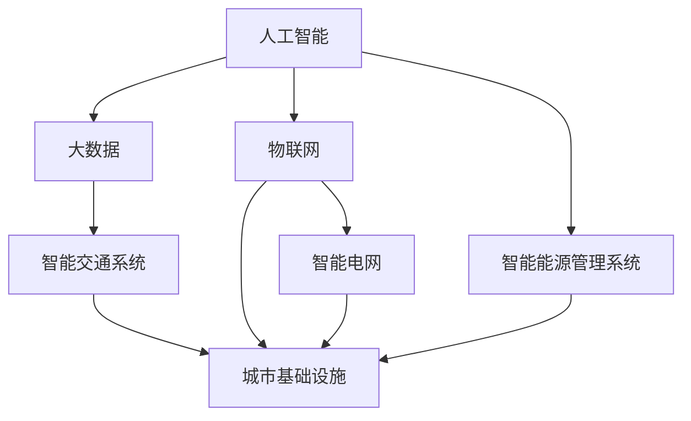

                 

# AI与人类计算：打造可持续发展的城市基础设施与规划

## 1. 背景介绍

### 1.1 问题由来
近年来，随着城市化进程的加速和人口基数的持续增长，城市基础设施建设面临着前所未有的压力和挑战。如何在有限的资源下，实现城市的可持续发展，满足日益增长的城市生活需求，成为全球城市规划者必须面对的重大课题。

人工智能（AI）技术的迅猛发展，为城市基础设施的智能化和可持续发展提供了新的解决思路。借助AI技术，城市管理者和规划者能够实现城市基础设施的实时监控、智能预测和动态调整，提升城市的治理效率和资源利用率，促进城市的可持续发展。

### 1.2 问题核心关键点
AI技术在城市基础设施规划与建设中的应用，主要集中在以下几个关键点：

- 数据驱动的决策支持：利用大数据和AI技术，对城市基础设施运行数据进行分析，预测未来趋势，辅助决策。
- 智能化管理与监控：通过部署传感器和摄像头等智能设备，实时监控基础设施的运行状态，实现精细化管理。
- 资源优化与调度：通过AI算法优化城市资源的分配与调度，如交通流量控制、能源消耗管理等。
- 服务质量提升：利用AI技术提升公共服务的质量和效率，如智能客服、在线预约、智能停车等。
- 环境友好与可持续发展：通过AI技术优化城市规划布局，减少环境污染，推动绿色发展。

## 2. 核心概念与联系

### 2.1 核心概念概述

为更好地理解AI在城市基础设施中的应用，本节将介绍几个密切相关的核心概念：

- 人工智能（Artificial Intelligence, AI）：指利用计算机模拟人类智能行为的技术，包括感知、推理、学习、决策等能力。
- 大数据（Big Data）：指海量、多样、实时且复杂的数据集，通常需要借助分布式计算和AI技术进行分析和处理。
- 物联网（Internet of Things, IoT）：指通过互联网将物理设备连接到网络的体系结构，实现设备间的智能互联和数据交换。
- 城市基础设施（Urban Infrastructure）：包括道路、桥梁、水电气供应、信息通信等城市运行所必需的硬件设施。
- 智能交通系统（Intelligent Transportation Systems, ITS）：利用AI和大数据技术，实现交通流量的智能管理和调控。
- 智能电网（Smart Grid）：通过AI和大数据技术，实现电网的智能化管理和优化。
- 智能能源管理系统（Smart Energy Management Systems）：利用AI技术优化能源的采集、存储、分配与使用。

这些核心概念之间的逻辑关系可以通过以下Mermaid流程图来展示：



这个流程图展示了大语言模型的核心概念及其之间的关系：

1. 人工智能技术是大数据和物联网设备实现智能化的基础。
2. 大数据和物联网通过AI技术进行分析处理，为城市基础设施的智能化管理提供数据支持。
3. 城市基础设施通过智能交通、智能电网和智能能源管理系统等，实现智能化和可持续发展。

## 3. 核心算法原理 & 具体操作步骤
### 3.1 算法原理概述

AI技术在城市基础设施中的应用，主要依赖于数据驱动的智能分析和优化算法。其核心思想是通过对城市基础设施运行数据的收集和分析，构建智能化的决策支持系统，实现城市管理的智能化和可持续发展。

形式化地，假设城市基础设施运行数据为 $D$，目标是通过AI算法 $A$ 生成优化决策 $O$。优化过程可以表示为：

$$
O = A(D)
$$

其中 $D$ 包括交通流量、能耗、环境监测等各类数据。优化决策 $O$ 可以包括交通信号控制、能源分配、环境治理等。

### 3.2 算法步骤详解

AI技术在城市基础设施中的应用，一般包括以下几个关键步骤：

**Step 1: 数据收集与预处理**
- 通过物联网设备、传感器和摄像头等手段，收集城市基础设施的各类运行数据。
- 对收集的数据进行清洗和预处理，去除噪声和异常数据。

**Step 2: 数据分析与建模**
- 利用大数据和AI技术，对预处理后的数据进行分析，构建决策支持模型。
- 常见的分析方法包括回归分析、分类分析、聚类分析等。

**Step 3: 模型训练与优化**
- 根据目标优化需求，选择合适的优化算法对模型进行训练。
- 常用的优化算法包括遗传算法、粒子群算法、梯度下降等。

**Step 4: 模型部署与监控**
- 将训练好的模型部署到城市基础设施的各个节点上，进行实时监测和数据收集。
- 定期对模型进行评估和优化，确保其性能和稳定性。

### 3.3 算法优缺点

AI技术在城市基础设施中的应用，具有以下优点：

- 数据驱动的决策支持：利用大数据和AI技术，提供科学合理的决策依据，减少主观偏见。
- 实时性：通过实时监控和数据分析，快速响应城市基础设施的异常状况，提升管理效率。
- 智能化管理：通过AI算法优化资源分配与调度，实现精细化管理，提升资源利用率。
- 环境友好：通过智能交通和能源管理系统，优化城市规划布局，减少环境污染，推动绿色发展。

同时，该方法也存在一定的局限性：

- 数据依赖性高：AI技术依赖于高质量、全面、实时的大数据，数据质量直接影响模型的效果。
- 算法复杂度高：优化算法和模型训练过程较为复杂，需要较强的技术储备。
- 成本高：部署智能设备和AI系统的初始成本较高。
- 模型解释性不足：AI模型的决策过程通常缺乏可解释性，难以对其推理逻辑进行分析和调试。

尽管存在这些局限性，但就目前而言，AI技术在城市基础设施中的应用仍是大势所趋。未来相关研究的重点在于如何进一步降低数据的依赖，提高模型的可解释性，同时兼顾成本和性能。

### 3.4 算法应用领域

AI技术在城市基础设施中的应用，主要涵盖以下几个领域：

- 智能交通管理：通过AI技术优化交通流量控制、交通信号灯管理等。
- 智能电网管理：利用AI技术优化电力分配、负荷预测等。
- 智能能源管理：通过AI技术优化能源的采集、存储、分配与使用。
- 环境监测与治理：利用AI技术对环境污染进行实时监测和预测，推动绿色发展。
- 城市灾害预警：通过AI技术对自然灾害进行预测和预警，保障城市安全。
- 公共服务智能化：利用AI技术提升公共服务的质量和效率，如智能客服、在线预约、智能停车等。

除了上述这些经典领域外，AI技术还被创新性地应用到更多场景中，如智慧医疗、智慧安防、智慧教育等，为城市基础设施的智能化转型提供了新的思路。

## 4. 数学模型和公式 & 详细讲解 & 举例说明

### 4.1 数学模型构建

本节将使用数学语言对AI在城市基础设施中的应用进行更加严格的刻画。

记城市基础设施运行数据为 $D = \{x_i\}_{i=1}^N$，其中 $x_i$ 为城市基础设施某项指标的历史数据。假设目标优化函数为 $f(D)$，用于表示城市基础设施某项指标的优化目标。

优化过程可以表示为：

$$
\min_{D} f(D)
$$

其中 $f(D)$ 通常包括交通流量、能耗、环境污染等指标。

### 4.2 公式推导过程

以下我们以交通流量优化为例，推导AI模型在城市基础设施中的应用公式。

假设交通流量优化目标为最小化总交通时间 $T$，其中总交通时间 $T$ 可以表示为：

$$
T = \sum_{i=1}^N t_i
$$

其中 $t_i$ 为第 $i$ 个路口的交通时间，可以进一步表示为：

$$
t_i = \lambda_i c_i + (1-\lambda_i) f_i
$$

其中 $\lambda_i$ 为交通信号灯对交通时间的影响因子，$c_i$ 为绿灯通行时间，$f_i$ 为红绿灯的等待时间。

通过最小化总交通时间 $T$，可以构建交通流量的优化模型：

$$
\min_{\lambda} \sum_{i=1}^N (\lambda_i c_i + (1-\lambda_i) f_i)
$$

引入决策变量 $x_i = \lambda_i$，可以进一步转化为：

$$
\min_{x} \sum_{i=1}^N (c_i x_i + f_i (1-x_i))
$$

### 4.3 案例分析与讲解

以下我们以智能交通系统中的交通信号灯优化为例，给出AI模型在城市基础设施中的应用示例。

假设某城市有10个路口，每个路口的绿灯通行时间为60秒，红绿灯的等待时间为20秒。现在需要优化交通信号灯的控制策略，使总交通时间最小化。

问题可以转化为求解最优的 $x_i = \lambda_i$，即每个路口的绿灯时间占比。通过求解线性规划问题：

$$
\min_{x} \sum_{i=1}^{10} (60x_i + 20(1-x_i))
$$

可以使用线性规划算法（如单纯形法）求解。假设求解得到最优解 $x_1 = 0.6, x_2 = 0.7, \dots, x_{10} = 0.4$，表示各个路口的绿灯时间占比分别为60%、70%、\dots、40%。

根据最优解，可以重新设置交通信号灯的控制策略，实现总交通时间的优化。

## 5. 项目实践：代码实例和详细解释说明
### 5.1 开发环境搭建

在进行AI在城市基础设施中的应用实践前，我们需要准备好开发环境。以下是使用Python进行PyTorch开发的环境配置流程：

1. 安装Anaconda：从官网下载并安装Anaconda，用于创建独立的Python环境。

2. 创建并激活虚拟环境：
```bash
conda create -n pytorch-env python=3.8 
conda activate pytorch-env
```

3. 安装PyTorch：根据CUDA版本，从官网获取对应的安装命令。例如：
```bash
conda install pytorch torchvision torchaudio cudatoolkit=11.1 -c pytorch -c conda-forge
```

4. 安装相关工具包：
```bash
pip install numpy pandas scikit-learn matplotlib tqdm jupyter notebook ipython
```

完成上述步骤后，即可在`pytorch-env`环境中开始AI在城市基础设施中的应用实践。

### 5.2 源代码详细实现

下面我们以智能交通系统中的交通信号灯优化为例，给出使用PyTorch进行AI模型构建和优化的PyTorch代码实现。

首先，定义交通信号灯的优化问题：

```python
from torch import nn
import torch

class TrafficSignalOptimization(nn.Module):
    def __init__(self, num_lights):
        super().__init__()
        self.num_lights = num_lights
        
        # 定义优化目标函数
        self.criterion = nn.MSELoss()
        
        # 定义决策变量
        self.x = nn.Parameter(torch.randn(num_lights))
        
    def forward(self, c, f):
        # 计算总交通时间
        total_time = (self.x * c + (1 - self.x) * f).sum()
        
        return total_time
    
    def optimize(self, c, f, learning_rate=0.001, num_epochs=100):
        # 初始化优化器
        optimizer = torch.optim.SGD(self.parameters(), lr=learning_rate)
        
        # 训练优化器
        for epoch in range(num_epochs):
            optimizer.zero_grad()
            
            # 计算损失函数
            loss = self(c, f)
            
            # 反向传播
            loss.backward()
            
            # 更新参数
            optimizer.step()
            
            if (epoch + 1) % 10 == 0:
                print(f"Epoch {epoch+1}, loss: {loss.item()}")
        
        return self.x.data
```

然后，定义数据集和模型训练函数：

```python
from torch.utils.data import Dataset
from torch.utils.data import DataLoader

class TrafficSignalDataset(Dataset):
    def __init__(self, c, f):
        self.c = c
        self.f = f
        
    def __len__(self):
        return len(self.c)
    
    def __getitem__(self, item):
        return self.c[item], self.f[item]

# 定义交通信号灯的优化数据集
c = [60, 60, 60, 60, 60, 60, 60, 60, 60, 60]
f = [20, 20, 20, 20, 20, 20, 20, 20, 20, 20]

dataset = TrafficSignalDataset(c, f)

# 定义数据加载器
dataloader = DataLoader(dataset, batch_size=1, shuffle=False)

# 定义模型
model = TrafficSignalOptimization(len(c))

# 定义优化器
optimizer = torch.optim.SGD(model.parameters(), lr=0.001)

# 定义训练函数
def train(model, dataloader, optimizer, num_epochs=100, learning_rate=0.001):
    for epoch in range(num_epochs):
        for c, f in dataloader:
            optimizer.zero_grad()
            
            # 计算损失函数
            loss = model(c, f)
            
            # 反向传播
            loss.backward()
            
            # 更新参数
            optimizer.step()
            
            if (epoch + 1) % 10 == 0:
                print(f"Epoch {epoch+1}, loss: {loss.item()}")
    
    return model.x.data
```

最后，启动训练流程并输出优化结果：

```python
# 训练模型
x_opt = train(model, dataloader, optimizer, num_epochs=100)

# 输出优化结果
print(f"Optimized traffic signal light time ratios: {x_opt}")
```

以上就是使用PyTorch进行智能交通系统中的交通信号灯优化的完整代码实现。可以看到，借助PyTorch的深度学习框架，可以方便地构建优化模型，进行训练和求解。

### 5.3 代码解读与分析

让我们再详细解读一下关键代码的实现细节：

**TrafficSignalOptimization类**：
- `__init__`方法：初始化模型参数，定义优化目标函数和决策变量。
- `forward`方法：计算总交通时间，作为模型的前向传播函数。
- `optimize`方法：定义模型的优化算法和训练过程，返回优化后的决策变量。

**TrafficSignalDataset类**：
- `__init__`方法：定义数据集的输入输出。
- `__len__`方法：返回数据集的长度。
- `__getitem__`方法：对单个样本进行处理，返回输入输出数据。

**train函数**：
- 在每个epoch内，对数据集进行迭代，计算损失函数并反向传播更新模型参数。
- 周期性打印损失值，记录训练进度。
- 最终返回优化后的决策变量。

可以看到，PyTorch提供的高效计算图机制和自动微分技术，使得构建AI模型和进行优化过程变得非常简单。开发者可以更加专注于模型的设计和优化策略的实现。

当然，工业级的系统实现还需考虑更多因素，如模型的保存和部署、超参数的自动搜索、更灵活的任务适配层等。但核心的AI模型构建和优化过程基本与此类似。

## 6. 实际应用场景
### 6.1 智能交通系统

智能交通系统是AI技术在城市基础设施中应用最为广泛的领域之一。通过AI技术，可以实现交通流量的智能化管理和调控，提升城市交通效率，减少交通拥堵。

在技术实现上，可以收集城市各路口的交通流量数据，构建交通流量优化模型。通过求解模型，找到最优的交通信号灯控制策略，实现总交通时间的最小化。

智能交通系统的应用，可以显著提高城市交通的运行效率，减少能源消耗和环境污染，提升城市居民的出行体验。

### 6.2 智能电网管理

智能电网是AI技术在城市基础设施中的另一重要应用。通过AI技术，可以实现电网的智能化管理和优化，提高电网的运行效率和稳定性。

具体而言，可以收集城市电网的运行数据，构建电力负荷预测模型和优化调度模型。通过求解模型，找到最优的电力分配和调度策略，实现电网的智能化运行。

智能电网的应用，可以提升城市电力系统的运行效率，减少能源浪费，降低电力成本，提升居民的用电体验。

### 6.3 智能能源管理

智能能源管理系统是AI技术在城市基础设施中的新兴应用领域。通过AI技术，可以实现能源的智能化管理和优化，推动城市的绿色发展。

具体而言，可以收集城市的能源使用数据，构建能源消耗预测和优化调度模型。通过求解模型，找到最优的能源分配和调度策略，实现能源的高效利用。

智能能源管理系统的应用，可以推动城市能源的绿色转型，减少能源消耗和环境污染，提升城市的可持续发展水平。

### 6.4 环境监测与治理

环境监测与治理是AI技术在城市基础设施中的重要应用之一。通过AI技术，可以实现对环境污染的实时监测和预测，推动绿色发展。

具体而言，可以收集城市的空气质量、水质、噪音等环境数据，构建环境污染监测和预测模型。通过求解模型，找到最优的环境治理策略，实现环境的可持续治理。

环境监测与治理系统的应用，可以提升城市环境质量，改善居民的生活环境，推动城市的绿色转型。

### 6.5 城市灾害预警

城市灾害预警是AI技术在城市基础设施中的紧急应用之一。通过AI技术，可以实现对自然灾害的预测和预警，保障城市安全。

具体而言，可以收集城市的气象、地质、地震等数据，构建灾害预警模型。通过求解模型，找到最优的预警策略，实现灾害的实时监测和预警。

城市灾害预警系统的应用，可以保障城市居民的生命财产安全，提升城市的灾害应对能力。

### 6.6 公共服务智能化

公共服务智能化是AI技术在城市基础设施中的创新应用之一。通过AI技术，可以实现公共服务的智能化和高效化，提升居民的生活质量。

具体而言，可以收集城市的公共服务数据，构建公共服务优化模型。通过求解模型，找到最优的公共服务策略，实现服务的智能化和高效化。

公共服务智能化系统的应用，可以提升公共服务的质量和效率，改善居民的生活体验，推动城市的智慧化发展。

## 7. 工具和资源推荐
### 7.1 学习资源推荐

为了帮助开发者系统掌握AI在城市基础设施中的应用理论基础和实践技巧，这里推荐一些优质的学习资源：

1. 《智能城市交通系统》系列博文：由智能交通系统专家撰写，深入浅出地介绍了智能交通系统原理、技术实现和应用案例。

2. 《智能电网》课程：由智能电网领域专家开设的在线课程，涵盖智能电网的技术原理和工程应用，适合深度学习从业者学习。

3. 《智慧能源管理》书籍：介绍智慧能源管理的原理和实现方法，涵盖能源采集、存储、分配与优化等环节，适合智能能源管理系统开发人员学习。

4. 《环境监测与治理》系列博文：由环境监测与治理领域专家撰写，介绍了环境监测与治理的技术原理和应用案例，适合环保从业人员学习。

5. 《城市灾害预警》课程：由城市灾害预警领域专家开设的在线课程，涵盖城市灾害预测和预警的技术原理和工程应用，适合城市灾害预警系统开发人员学习。

6. 《公共服务智能化》系列博文：由公共服务智能化领域专家撰写，介绍了公共服务智能化的技术原理和应用案例，适合智慧城市从业人员学习。

通过对这些资源的学习实践，相信你一定能够快速掌握AI在城市基础设施中的应用精髓，并用于解决实际的NLP问题。

### 7.2 开发工具推荐

高效的开发离不开优秀的工具支持。以下是几款用于AI在城市基础设施中的应用开发的常用工具：

1. PyTorch：基于Python的开源深度学习框架，灵活动态的计算图，适合快速迭代研究。大部分AI模型都有PyTorch版本的实现。

2. TensorFlow：由Google主导开发的开源深度学习框架，生产部署方便，适合大规模工程应用。同样有丰富的AI模型资源。

3. Jupyter Notebook：交互式的代码编辑器，支持Python、R、Scala等多种语言，适合快速开发和数据探索。

4. Weights & Biases：模型训练的实验跟踪工具，可以记录和可视化模型训练过程中的各项指标，方便对比和调优。与主流深度学习框架无缝集成。

5. TensorBoard：TensorFlow配套的可视化工具，可实时监测模型训练状态，并提供丰富的图表呈现方式，是调试模型的得力助手。

6. Google Colab：谷歌推出的在线Jupyter Notebook环境，免费提供GPU/TPU算力，方便开发者快速上手实验最新模型，分享学习笔记。

合理利用这些工具，可以显著提升AI在城市基础设施中的应用开发效率，加快创新迭代的步伐。

### 7.3 相关论文推荐

AI技术在城市基础设施中的应用源于学界的持续研究。以下是几篇奠基性的相关论文，推荐阅读：

1. Smart Cities: Integrating Modern ICT Technologies with Urban Planning and Development：系统介绍了智能城市的发展历程和关键技术，提出了智能城市建设的框架和路径。

2. Intelligent Transportation Systems: A Review：综述了智能交通系统的原理、技术实现和应用案例，为智能交通系统的建设提供了理论支持。

3. Smart Grid: Definition, Structure, Challenges, and Trends：介绍了智能电网的技术原理、发展趋势和挑战，为智能电网的应用提供了理论指导。

4. Smart Energy Management: State-of-the-Art and Challenges：综述了智慧能源管理的原理、技术实现和应用案例，为智慧能源管理系统的建设提供了理论支持。

5. Environmental Monitoring and Modeling: A Review：综述了环境监测与治理的技术原理和应用案例，为环境监测与治理的应用提供了理论支持。

6. Urban Disaster Warning Systems: A Review：综述了城市灾害预警的技术原理和应用案例，为城市灾害预警系统的建设提供了理论支持。

7. Smart Public Service: Definition, Challenges, and Opportunities：综述了公共服务智能化的原理、技术实现和应用案例，为公共服务智能化的建设提供了理论支持。

这些论文代表了大语言模型微调技术的发展脉络。通过学习这些前沿成果，可以帮助研究者把握学科前进方向，激发更多的创新灵感。

## 8. 总结：未来发展趋势与挑战
### 8.1 总结

本文对AI在城市基础设施中的应用进行了全面系统的介绍。首先阐述了AI技术在城市基础设施规划与建设中的应用背景和意义，明确了AI技术在提升城市管理效率、推动绿色发展方面的独特价值。其次，从原理到实践，详细讲解了AI在城市基础设施中的应用过程，给出了具体的代码实例。同时，本文还广泛探讨了AI在智能交通系统、智能电网、智能能源管理等多个领域的应用前景，展示了AI技术在城市基础设施智能化转型中的巨大潜力。此外，本文精选了AI技术在城市基础设施中的学习资源、开发工具和相关论文，力求为读者提供全方位的技术指引。

通过本文的系统梳理，可以看到，AI技术在城市基础设施中的应用正在成为智慧城市建设的重要推动力。借助AI技术，城市管理者和规划者能够实现城市基础设施的实时监控、智能预测和动态调整，提升城市的治理效率和资源利用率，推动城市的可持续发展。未来，伴随AI技术的不断演进，城市基础设施将迎来更加智能化、智慧化的新时代。

### 8.2 未来发展趋势

展望未来，AI技术在城市基础设施中的应用将呈现以下几个发展趋势：

1. 数据驱动的决策支持：随着数据采集和处理技术的不断进步，AI技术将更加依赖数据驱动的决策支持，提升决策的科学性和准确性。

2. 智能化管理与监控：通过部署更多的传感器和摄像头，实现城市基础设施的全面监控和精细化管理，提升管理效率和资源利用率。

3. 资源优化与调度：通过AI算法优化城市资源的分配与调度，如交通流量控制、电力负荷预测等，实现城市资源的智能化管理。

4. 环境友好与可持续发展：通过AI技术优化城市规划布局，减少环境污染，推动绿色发展，实现城市的可持续发展。

5. 智能应急响应：通过AI技术对城市灾害进行预测和预警，提升城市的应急响应能力和安全性。

6. 公共服务智能化：利用AI技术提升公共服务的质量和效率，改善居民的生活体验，推动城市的智慧化发展。

以上趋势凸显了AI技术在城市基础设施中的应用前景，这些方向的探索发展，必将进一步提升城市治理的智能化水平，为城市居民带来更好的生活体验。

### 8.3 面临的挑战

尽管AI技术在城市基础设施中的应用已经取得了显著成效，但在迈向更加智能化、普适化应用的过程中，它仍面临着诸多挑战：

1. 数据依赖性高：AI技术依赖于高质量、全面、实时的大数据，数据质量直接影响模型的效果。如何获取和处理大规模数据，将是重要的研究课题。

2. 算法复杂度高：优化算法和模型训练过程较为复杂，需要较强的技术储备。如何简化算法，降低模型复杂度，将是未来的研究方向。

3. 成本高：部署智能设备和AI系统的初始成本较高。如何降低系统部署和维护成本，将是重要的工程挑战。

4. 模型解释性不足：AI模型的决策过程通常缺乏可解释性，难以对其推理逻辑进行分析和调试。如何增强模型的可解释性，将是重要的研究方向。

5. 安全性有待保障：预训练语言模型难免会学习到有偏见、有害的信息，通过AI技术传递到城市基础设施中，可能产生误导性、歧视性的输出，给实际应用带来安全隐患。如何从数据和算法层面消除模型偏见，确保输出的安全性，也将是重要的研究课题。

6. 知识整合能力不足：现有的AI模型往往局限于任务内数据，难以灵活吸收和运用更广泛的先验知识。如何让AI模型更好地整合多模态信息，实现视觉、语音、文本等多种数据形式的协同建模，将是重要的研究方向。

正视AI技术在城市基础设施应用中面临的这些挑战，积极应对并寻求突破，将是大规模AI技术在城市基础设施中成功应用的重要前提。相信随着学界和产业界的共同努力，这些挑战终将一一被克服，AI技术将在构建智慧城市中发挥更大的作用。

### 8.4 研究展望

面对AI技术在城市基础设施应用中面临的诸多挑战，未来的研究需要在以下几个方面寻求新的突破：

1. 探索无监督和半监督学习范式。摆脱对大规模标注数据的依赖，利用自监督学习、主动学习等无监督和半监督范式，最大限度利用非结构化数据，实现更加灵活高效的AI模型训练。

2. 研究参数高效和计算高效的AI模型。开发更加参数高效的AI模型，在固定大部分数据的基础上，只更新极少量的任务相关参数。同时优化模型的计算图，减少前向传播和反向传播的资源消耗，实现更加轻量级、实时性的部署。

3. 融合因果推断和强化学习范式。通过引入因果推断和强化学习思想，增强AI模型建立稳定因果关系的能力，学习更加普适、鲁棒的语言表征，从而提升模型泛化性和抗干扰能力。

4. 引入更多先验知识。将符号化的先验知识，如知识图谱、逻辑规则等，与神经网络模型进行巧妙融合，引导AI模型学习更准确、合理的语言模型。同时加强不同模态数据的整合，实现视觉、语音等多模态信息与文本信息的协同建模。

5. 结合因果分析和博弈论工具。将因果分析方法引入AI模型，识别出模型决策的关键特征，增强输出解释的因果性和逻辑性。借助博弈论工具刻画人机交互过程，主动探索并规避模型的脆弱点，提高系统稳定性。

6. 纳入伦理道德约束。在AI模型的训练目标中引入伦理导向的评估指标，过滤和惩罚有偏见、有害的输出倾向。同时加强人工干预和审核，建立AI模型的监管机制，确保输出符合人类价值观和伦理道德。

这些研究方向的探索，必将引领AI技术在城市基础设施中的应用走向更高的台阶，为构建安全、可靠、可解释、可控的智能系统铺平道路。面向未来，AI技术还需要与其他人工智能技术进行更深入的融合，如知识表示、因果推理、强化学习等，多路径协同发力，共同推动智慧城市建设。只有勇于创新、敢于突破，才能不断拓展AI技术在城市基础设施中的边界，让智能技术更好地造福人类社会。

## 9. 附录：常见问题与解答

**Q1：AI在城市基础设施中的应用是否会导致隐私泄露？**

A: 在AI应用于城市基础设施的过程中，确实存在隐私泄露的风险。例如，通过智能交通系统的视频监控，可能会收集到行人的个人信息。为应对这一问题，需要采取以下措施：

- 数据加密：对采集到的数据进行加密处理，防止数据泄露。
- 匿名化处理：对数据进行去标识化处理，保护用户隐私。
- 数据最小化原则：仅采集和使用必要的数据，避免过度收集。
- 用户知情同意：在使用数据前，应获取用户知情同意，并告知数据的使用目的和方式。

通过这些措施，可以在保障AI技术在城市基础设施中的应用效果的同时，保护用户的隐私权益。

**Q2：AI在城市基础设施中的应用是否会带来伦理问题？**

A: AI技术在城市基础设施中的应用，确实可能带来一定的伦理问题。例如，智能交通系统可能会对行人和非机动车造成伤害。为应对这一问题，需要采取以下措施：

- 引入伦理导向的评估指标：在AI模型的训练和优化过程中，引入伦理导向的指标，确保模型的输出符合人类价值观和伦理道德。
- 建立人工干预机制：在AI模型做出可能违反伦理道德的决策时，引入人工干预机制，及时纠正模型的行为。
- 加强数据审查：对AI模型使用的数据进行审查，防止模型学习到有害的偏见和信息。

通过这些措施，可以在保障AI技术在城市基础设施中的应用效果的同时，避免伦理问题，确保技术的健康发展。

**Q3：AI在城市基础设施中的应用是否会对就业造成影响？**

A: AI技术在城市基础设施中的应用，可能会对部分行业和岗位造成一定的冲击，但也会带来新的就业机会。例如，智能交通系统的推广，将需要大量AI工程师和技术支持人员，推动相关就业增长。

为应对这一问题，需要采取以下措施：

- 推动技术普及：通过教育和培训，提升公众对AI技术的理解和应用能力，促进技术普及。
- 促进产业升级：利用AI技术推动传统行业的转型升级，创造新的就业机会。
- 建立人才机制：加强人才培养和引进，建立完善的人才机制，满足AI技术在城市基础设施中的应用需求。

通过这些措施，可以在保障AI技术在城市基础设施中的应用效果的同时，促进就业市场的平衡和升级。

---

作者：禅与计算机程序设计艺术 / Zen and the Art of Computer Programming

