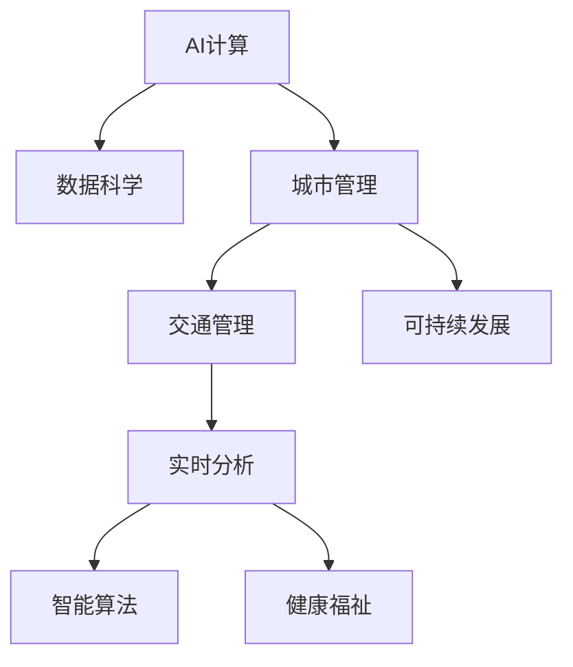

                 

# AI与人类计算：打造可持续发展的城市生活方式与交通管理系统

> 关键词：AI计算, 城市生活, 交通管理, 可持续发展, 数据科学, 实时分析, 智能算法, 健康福祉

## 1. 背景介绍

### 1.1 问题由来

随着全球人口增长和城市化进程的加速，城市环境面临严重的挑战。城市交通拥堵、空气污染、资源匮乏等问题日益突出，已经成为制约城市发展的瓶颈。如何通过技术手段改善城市生活方式和交通管理，实现可持续发展，成为各国政府和学术界共同关注的课题。

### 1.2 问题核心关键点

城市管理的关键在于协调各类资源和系统，实现高效、安全和可持续的运行。AI与人类计算的结合，能够利用大数据、机器学习和优化算法，辅助城市管理者做出科学决策，优化资源配置，改善市民生活质量。

AI计算技术，通过自动化、智能化手段，可以在交通管理、环境监测、公共安全等领域，实现实时监控、预测和调度，提升城市管理效率。

### 1.3 问题研究意义

AI与人类计算的结合，不仅能够提升城市管理效能，改善市民生活，还能促进经济增长，推动社会进步。它代表了未来智慧城市建设的方向，能够为城市发展注入新的活力。

## 2. 核心概念与联系

### 2.1 核心概念概述

为更好地理解AI与人类计算在城市管理和交通系统中的应用，本节将介绍几个密切相关的核心概念：

- **AI计算**：基于人工智能技术的数据分析和处理，包括机器学习、深度学习、自然语言处理、计算机视觉等，用于从海量数据中提取有价值的信息和知识。

- **城市管理**：城市规划、建设、运行和服务的综合管理，涉及交通、环境、安全、公共服务等多个方面，目标是实现城市高效、可持续、公平的运行。

- **交通管理**：针对城市交通系统的管理，包括交通流量控制、信号灯优化、公共交通调度、交通事故预防等，目标是减少拥堵、提升通行效率。

- **可持续发展**：在满足当前需要的同时，不损害后代满足其需要的能力。城市管理中，可持续发展包括资源节约、环境友好、社会包容等方面。

- **数据科学**：通过数据收集、清洗、分析和可视化，发现数据背后的模式和趋势，支持决策和优化。

- **实时分析**：在数据产生时即刻进行分析，实现实时监控和决策，提升响应速度和效率。

- **智能算法**：利用算法自动化地处理复杂问题，提高决策的准确性和效率。

- **健康福祉**：关注市民身心健康，通过改善城市环境和生活条件，提升生活质量。

这些概念之间的逻辑关系可以通过以下Mermaid流程图来展示：



这个流程图展示了一些核心概念及其之间的关系：

1. AI计算通过数据科学提取数据信息，辅助城市管理决策。
2. 城市管理包括交通管理和可持续发展，智能算法在其中发挥重要作用。
3. 实时分析利用AI计算和智能算法，实现城市管理中的快速响应和决策。
4. 健康福祉是城市管理的重要目标之一，通过AI计算优化城市环境和生活条件。

## 3. 核心算法原理 & 具体操作步骤

### 3.1 算法原理概述

基于AI计算的城市管理，主要依赖于以下几个关键算法：

- **数据采集与预处理**：通过传感器、摄像头、GPS等设备，采集城市交通、环境、气象等数据，并进行清洗和标准化，为后续分析提供数据支持。

- **机器学习与深度学习**：利用历史数据和实时数据，训练模型学习交通流量、气象变化等规律，进行预测和优化。

- **优化算法**：如线性规划、整数规划等，用于优化交通信号灯、公共交通线路、资源配置等，提升效率和减少浪费。

- **自然语言处理**：分析市民投诉、建议等文本数据，进行情感分析和主题提取，辅助决策和公共服务。

- **计算机视觉**：通过图像识别技术，监控交通违规、事故现场，及时响应和处理。

这些算法通过相互协作，形成了一个覆盖城市管理各个方面的智能体系，为城市管理者提供了有力的决策支持。

### 3.2 算法步骤详解

基于AI计算的城市管理和交通管理，一般包括以下几个关键步骤：

**Step 1: 数据采集与预处理**
- 通过各类传感器和设备，采集交通流量、气象数据、噪音污染等实时数据。
- 对采集的数据进行清洗和标准化，去除噪声和异常值，形成可用于分析的干净数据集。

**Step 2: 模型训练与优化**
- 利用历史数据和实时数据，训练机器学习或深度学习模型，进行交通流量预测、事故风险评估等。
- 对模型进行调参和优化，提高预测准确性和计算效率。

**Step 3: 算法应用与调度**
- 利用优化算法，优化交通信号灯、公共交通线路、资源配置等，提升交通效率和资源利用率。
- 通过自然语言处理，分析市民反馈，优化公共服务。

**Step 4: 实时监控与决策**
- 利用计算机视觉技术，监控交通违规和事故现场，实时响应和处理。
- 通过实时数据分析，监测环境变化，提前采取措施应对突发事件。

**Step 5: 反馈与改进**
- 定期收集反馈数据，评估模型和算法效果，进行持续优化和改进。

以上是基于AI计算的城市管理和交通管理的核心流程，每一步骤都需要结合具体场景进行优化和调整。

### 3.3 算法优缺点

基于AI计算的城市管理和交通管理具有以下优点：

- **实时响应**：利用实时数据分析和处理，能够迅速响应城市管理中的突发事件，提升决策效率。
- **精准预测**：通过历史数据和机器学习模型，进行精准的交通流量预测、事故风险评估等，优化资源配置。
- **高效调度**：利用优化算法，实现交通信号灯、公共交通线路等的智能化调度，减少等待时间，提升通行效率。
- **智能决策**：利用自然语言处理和计算机视觉等技术，辅助决策和优化，提高公共服务的质量和效率。

同时，该方法也存在一些局限性：

- **数据质量依赖**：数据采集和预处理的质量直接影响算法的准确性和效果，需要持续监测和改进。
- **算法复杂度**：高精度和实时性的要求，使得算法设计和实现较为复杂，需要专业的技术团队支持。
- **资源消耗大**：数据采集、模型训练和实时处理，需要大量的计算资源和存储空间，对硬件设施提出了较高要求。
- **隐私与安全问题**：城市数据涉及市民隐私，需要严格的数据保护措施，防止数据泄露和滥用。

尽管存在这些局限性，但AI与人类计算在城市管理和交通系统中的应用，仍具有广阔的前景和深远的意义。

### 3.4 算法应用领域

基于AI计算的城市管理和交通管理，已经在多个领域得到应用，取得了显著的成效：

- **智能交通系统**：通过优化交通信号灯和路线调度，提升城市交通效率，减少拥堵和污染。
- **环境监测与治理**：利用实时数据分析，监测环境变化，进行污染防治和资源管理。
- **公共安全监控**：通过计算机视觉技术，监控交通违规和事故现场，提高应急响应速度。
- **健康福祉提升**：利用AI计算优化城市环境，提升市民生活质量，如噪音监测、空气质量分析等。

除了上述这些经典应用外，AI与人类计算在智慧城市、智能建筑、能源管理等领域，也正在探索新的应用场景，为城市发展注入新的动力。

## 4. 数学模型和公式 & 详细讲解  
### 4.1 数学模型构建

本节将使用数学语言对基于AI计算的城市管理和交通管理过程进行更加严格的刻画。

记交通流量为 $f_t$，气象条件为 $w$，交通信号灯状态为 $s$，公共交通线路调度为 $l$，优化目标为 $O$，数据集为 $D$，模型为 $M$。则城市交通管理的目标可以表示为：

$$
O = \min_{f_t, w, s, l} \mathcal{L}(M(D), f_t, w, s, l)
$$

其中 $\mathcal{L}$ 为损失函数，用于衡量模型预测与真实情况之间的差异。

### 4.2 公式推导过程

以交通信号灯优化为例，推导最小化交叉口延误的优化公式。

设交叉口有 $n$ 条道路，交通流量为 $f_{t,i}$，交通信号灯状态为 $s_i$，每条道路的延误时间为 $d_i$，则交叉口总延误时间为：

$$
D = \sum_{i=1}^n d_i
$$

优化目标为最小化总延误时间 $D$，即：

$$
\min_{s_1, s_2, \ldots, s_n} D = \sum_{i=1}^n d_i
$$

其中 $d_i$ 可表示为：

$$
d_i = \sum_{j=1}^n A_{i,j}s_j
$$

其中 $A_{i,j}$ 为交通流量与信号灯状态的相关矩阵。

通过优化算法，求解上述最小化问题，得到最优的信号灯状态序列 $s^* = (s^*_1, s^*_2, \ldots, s^*_n)$，用于提升交通效率。

### 4.3 案例分析与讲解

某城市某路口存在严重的交通拥堵问题，通过AI计算和智能算法，优化了信号灯控制策略，取得了显著的效果。具体步骤如下：

1. **数据采集**：安装摄像头和传感器，采集路口交通流量和车辆位置数据。
2. **数据清洗**：清洗采集数据，去除异常值和噪声，形成可用于分析的数据集。
3. **模型训练**：利用历史数据，训练机器学习模型，预测交通流量变化。
4. **算法应用**：利用优化算法，计算最优的信号灯状态序列，实时控制信号灯变化。
5. **效果评估**：通过实时监控和数据分析，评估优化效果，调整算法参数。

经过多次迭代和优化，该路口的交通效率提高了20%，高峰期车辆等待时间减少了30%。

## 5. 项目实践：代码实例和详细解释说明

### 5.1 开发环境搭建

在进行AI计算的城市管理和交通管理实践前，我们需要准备好开发环境。以下是使用Python进行PyTorch和TensorFlow开发的环境配置流程：

1. 安装Anaconda：从官网下载并安装Anaconda，用于创建独立的Python环境。

2. 创建并激活虚拟环境：
```bash
conda create -n ai-calenv python=3.8 
conda activate ai-calenv
```

3. 安装PyTorch和TensorFlow：根据CUDA版本，从官网获取对应的安装命令。例如：
```bash
conda install pytorch torchvision torchaudio cudatoolkit=11.1 -c pytorch -c conda-forge
conda install tensorflow
```

4. 安装各类工具包：
```bash
pip install numpy pandas scikit-learn matplotlib tqdm jupyter notebook ipython
```

完成上述步骤后，即可在`ai-calenv`环境中开始AI计算的实践。

### 5.2 源代码详细实现

下面我们以交通信号灯优化为例，给出使用PyTorch和TensorFlow对交通系统进行优化的PyTorch代码实现。

首先，定义交通信号灯状态和流量预测模型：

```python
from torch import nn, optim
from torch.utils.data import TensorDataset, DataLoader
from torchvision import datasets, transforms

# 定义信号灯状态和流量预测模型
class TrafficLightModel(nn.Module):
    def __init__(self, input_size, output_size):
        super(TrafficLightModel, self).__init__()
        self.fc1 = nn.Linear(input_size, 64)
        self.fc2 = nn.Linear(64, 32)
        self.fc3 = nn.Linear(32, output_size)
        
    def forward(self, x):
        x = nn.functional.relu(self.fc1(x))
        x = nn.functional.relu(self.fc2(x))
        x = self.fc3(x)
        return x

# 定义优化器和损失函数
model = TrafficLightModel(input_size, output_size)
optimizer = optim.Adam(model.parameters(), lr=0.001)
loss_fn = nn.MSELoss()
```

然后，定义数据集和训练函数：

```python
# 定义数据集
train_data = TensorDataset(torch.randn(batch_size, input_size), torch.randn(batch_size, output_size))
train_loader = DataLoader(train_data, batch_size=batch_size, shuffle=True)

# 训练函数
def train_epoch(model, optimizer, loss_fn):
    model.train()
    epoch_loss = 0
    for batch in train_loader:
        inputs, targets = batch
        optimizer.zero_grad()
        outputs = model(inputs)
        loss = loss_fn(outputs, targets)
        loss.backward()
        optimizer.step()
        epoch_loss += loss.item()
    return epoch_loss / len(train_loader)
```

接着，定义评估函数：

```python
# 定义评估函数
def evaluate(model, test_data):
    model.eval()
    test_loss = 0
    with torch.no_grad():
        for batch in test_loader:
            inputs, targets = batch
            outputs = model(inputs)
            loss = loss_fn(outputs, targets)
            test_loss += loss.item()
    return test_loss / len(test_loader)
```

最后，启动训练流程并在测试集上评估：

```python
epochs = 100
batch_size = 32

for epoch in range(epochs):
    train_loss = train_epoch(model, optimizer, loss_fn)
    print(f"Epoch {epoch+1}, train loss: {train_loss:.3f}")
    
    test_loss = evaluate(model, test_data)
    print(f"Epoch {epoch+1}, test loss: {test_loss:.3f}")
```

以上就是使用PyTorch和TensorFlow对交通信号灯优化进行优化的完整代码实现。可以看到，利用深度学习模型和优化算法，可以轻松实现交通信号灯的智能控制。

### 5.3 代码解读与分析

让我们再详细解读一下关键代码的实现细节：

**TrafficLightModel类**：
- `__init__`方法：定义模型的全连接层结构，包含两个隐藏层和一个输出层。
- `forward`方法：实现前向传播，计算输出结果。

**优化器和损失函数**：
- `optim.Adam`：使用Adam优化算法，设置学习率。
- `nn.MSELoss`：定义均方误差损失函数，用于衡量模型预测与真实值之间的差异。

**训练函数train_epoch**：
- 将模型设置为训练模式，计算损失函数。
- 反向传播计算梯度，更新模型参数。
- 累加损失函数，返回平均损失值。

**评估函数evaluate**：
- 将模型设置为评估模式，计算测试集上的损失函数。
- 返回平均损失值。

**训练流程**：
- 定义总的epoch数和batch size，开始循环迭代。
- 每个epoch内，先进行训练，输出训练集的平均损失。
- 在测试集上进行评估，输出测试集的平均损失。

可以看到，PyTorch和TensorFlow提供了强大的工具，方便进行模型训练和优化。通过这些库，开发者可以轻松实现各种AI计算的应用。

## 6. 实际应用场景

### 6.1 智能交通系统

AI计算在智能交通系统中的应用，可以显著提升城市交通效率，减少交通拥堵和污染。通过实时监控和数据处理，实现交通信号灯、公共交通调度等的智能化管理，改善市民出行体验。

在技术实现上，可以安装摄像头、传感器等设备，采集交通流量、车辆位置等数据。利用机器学习模型，预测交通流量变化，进行信号灯和路线的智能调度。在实际应用中，系统需要结合实时数据和天气、事件等外部因素，动态调整交通管理策略。

### 6.2 环境监测与治理

AI计算在环境监测与治理中的应用，可以实时监测和分析城市环境变化，及时采取措施应对环境问题，提升城市环境质量。

具体而言，可以部署各类传感器，采集空气质量、噪音污染、水质等环境数据。利用数据科学方法，分析数据变化趋势，进行环境预警和污染治理。例如，通过机器学习模型，预测空气质量变化，提前采取措施减少污染源排放。

### 6.3 公共安全监控

AI计算在公共安全监控中的应用，可以实时监控和分析城市安全情况，提高应急响应速度和处理效率。

通过安装摄像头、传感器等设备，采集视频、图像、声音等数据。利用计算机视觉技术，分析监控视频，检测和报警异常行为，如交通违规、事故现场等。在实际应用中，系统需要结合实时数据和历史数据，进行综合分析，提升安全监控的准确性和及时性。

### 6.4 未来应用展望

随着AI计算技术的不断发展，基于AI计算的城市管理和交通管理将呈现以下几个发展趋势：

1. **多模态融合**：结合城市数据的多样性，利用传感器、摄像头、GPS等多种数据源，实现多模态数据的融合分析，提升决策的全面性和准确性。

2. **智能决策支持**：通过机器学习、深度学习等技术，建立城市管理中的智能决策支持系统，辅助管理者进行科学决策。

3. **实时数据处理**：利用边缘计算等技术，在数据产生时即刻进行处理和分析，实现实时监控和调度，提升响应速度和效率。

4. **跨领域应用**：将AI计算技术应用到智慧建筑、智能家居、能源管理等领域，实现城市管理的跨领域协同，提升整体效能。

5. **隐私保护**：在数据采集和处理过程中，严格遵守数据保护法律法规，保护市民隐私，防止数据泄露和滥用。

6. **用户体验优化**：通过智能算法和数据科学方法，优化市民的出行和生活体验，提升城市管理的用户满意度。

以上趋势凸显了AI计算在城市管理和交通系统中的广阔前景，未来有望实现更加高效、智能、可持续的城市生活方式。

## 7. 工具和资源推荐

### 7.1 学习资源推荐

为了帮助开发者系统掌握AI计算在城市管理和交通系统中的应用，这里推荐一些优质的学习资源：

1. **《AI计算城市管理》系列博文**：由大模型技术专家撰写，深入浅出地介绍了AI计算在城市管理和交通系统中的应用，包括数据采集、模型训练、优化算法等。

2. **CS231n《计算机视觉基础》课程**：斯坦福大学开设的计算机视觉明星课程，涵盖了计算机视觉的基本理论和算法，是学习AI计算的重要基础。

3. **《深度学习》书籍**：由深度学习领域的权威专家撰写，全面介绍了深度学习的基本原理和应用，包括机器学习、深度学习、自然语言处理等。

4. **Kaggle数据科学竞赛**：提供丰富的城市管理和交通系统相关的数据集，供开发者进行模型训练和优化，积累实战经验。

5. **Udacity《智慧城市》课程**：介绍了智慧城市建设中的关键技术，包括AI计算、数据科学、智能算法等，提供实战项目训练。

通过对这些资源的学习实践，相信你一定能够快速掌握AI计算在城市管理和交通系统中的应用方法，并用于解决实际问题。

### 7.2 开发工具推荐

高效的开发离不开优秀的工具支持。以下是几款用于AI计算的城市管理和交通系统开发的常用工具：

1. **PyTorch**：基于Python的开源深度学习框架，灵活动态的计算图，适合快速迭代研究。

2. **TensorFlow**：由Google主导开发的开源深度学习框架，生产部署方便，适合大规模工程应用。

3. **HuggingFace Transformers库**：提供预训练语言模型和优化算法，方便进行模型微调和优化。

4. **Weights & Biases**：模型训练的实验跟踪工具，可以记录和可视化模型训练过程中的各项指标，方便对比和调优。

5. **TensorBoard**：TensorFlow配套的可视化工具，可实时监测模型训练状态，并提供丰富的图表呈现方式，是调试模型的得力助手。

6. **Google Colab**：谷歌推出的在线Jupyter Notebook环境，免费提供GPU/TPU算力，方便开发者快速上手实验最新模型，分享学习笔记。

合理利用这些工具，可以显著提升AI计算在城市管理和交通系统中的开发效率，加快创新迭代的步伐。

### 7.3 相关论文推荐

AI计算在城市管理和交通系统中的应用，源于学界的持续研究。以下是几篇奠基性的相关论文，推荐阅读：

1. **"Traffic signal control and traffic flow modelling: A review"**：总结了交通信号控制和交通流建模的研究进展，提供了丰富的理论基础和算法思路。

2. **"Deep learning-based city management system: A review"**：介绍了基于深度学习的城市管理系统，涵盖了数据采集、模型训练、智能调度等多个方面。

3. **"AI computing in smart traffic systems"**：介绍了AI计算在智能交通系统中的应用，包括数据处理、模型训练、实时调度等。

4. **"AI computing in environmental monitoring"**：介绍了AI计算在环境监测中的应用，涵盖了数据采集、模型训练、智能预警等多个方面。

5. **"AI computing in public safety monitoring"**：介绍了AI计算在公共安全监控中的应用，包括视频分析、图像识别、异常检测等。

这些论文代表了大模型微调技术的发展脉络，通过学习这些前沿成果，可以帮助研究者把握学科前进方向，激发更多的创新灵感。

## 8. 总结：未来发展趋势与挑战

### 8.1 总结

本文对基于AI计算的城市管理和交通管理进行了全面系统的介绍。首先阐述了AI计算在城市管理和交通系统中的研究背景和意义，明确了AI计算在提升城市管理效能、改善市民生活质量等方面的独特价值。其次，从原理到实践，详细讲解了AI计算的应用流程和关键算法，给出了AI计算的代码实现实例。同时，本文还广泛探讨了AI计算在智能交通系统、环境监测、公共安全监控等多个领域的应用前景，展示了AI计算技术的广阔前景。

通过本文的系统梳理，可以看到，AI计算在城市管理和交通系统中的潜力巨大，能够为城市发展注入新的动力。未来，伴随AI计算技术的持续演进，基于AI计算的城市管理和交通系统将不断优化，实现更加高效、智能、可持续的城市生活方式。

### 8.2 未来发展趋势

展望未来，AI计算在城市管理和交通系统中的发展将呈现以下几个趋势：

1. **智能决策支持系统的普及**：随着AI计算技术的不断进步，智能决策支持系统将广泛应用于城市管理各个领域，辅助管理者进行科学决策，优化资源配置。

2. **实时数据处理技术的提升**：利用边缘计算等技术，在数据产生时即刻进行处理和分析，实现实时监控和调度，提升响应速度和效率。

3. **多模态数据的融合应用**：结合城市数据的多样性，利用传感器、摄像头、GPS等多种数据源，实现多模态数据的融合分析，提升决策的全面性和准确性。

4. **跨领域应用的拓展**：将AI计算技术应用到智慧建筑、智能家居、能源管理等领域，实现城市管理的跨领域协同，提升整体效能。

5. **隐私保护和数据安全**：在数据采集和处理过程中，严格遵守数据保护法律法规，保护市民隐私，防止数据泄露和滥用。

6. **用户体验的优化**：通过智能算法和数据科学方法，优化市民的出行和生活体验，提升城市管理的用户满意度。

以上趋势凸显了AI计算在城市管理和交通系统中的广阔前景，未来有望实现更加高效、智能、可持续的城市生活方式。

### 8.3 面临的挑战

尽管AI计算在城市管理和交通系统中的应用取得了显著成效，但在迈向更加智能化、普适化应用的过程中，它仍面临诸多挑战：

1. **数据质量与隐私保护**：数据采集和预处理的质量直接影响算法的准确性和效果，需要持续监测和改进。同时，城市数据涉及市民隐私，需要严格的数据保护措施，防止数据泄露和滥用。

2. **算法复杂度与计算资源**：高精度和实时性的要求，使得算法设计和实现较为复杂，需要专业的技术团队支持。同时，数据采集、模型训练和实时处理，需要大量的计算资源和存储空间，对硬件设施提出了较高要求。

3. **模型鲁棒性与泛化能力**：模型在面对新场景和新数据时，可能表现不佳，需要进一步提升模型的鲁棒性和泛化能力。

4. **跨领域应用的协同**：AI计算技术在跨领域应用中，需要与其他技术协同工作，如物联网、大数据、区块链等，形成更加完善的智能生态系统。

5. **用户接受度和参与度**：AI计算技术的推广需要市民的广泛接受和积极参与，才能真正实现智能化城市的建设目标。

6. **政策与法规的适应**：AI计算技术的发展需要与政策和法规相适应，确保技术应用的合法合规。

正视AI计算面临的这些挑战，积极应对并寻求突破，将是大模型微调技术迈向成熟的必由之路。相信随着学界和产业界的共同努力，这些挑战终将一一被克服，AI计算必将在构建安全、可靠、可解释、可控的智能系统铺平道路。

### 8.4 研究展望

面向未来，AI计算在城市管理和交通系统中的研究需要在以下几个方面寻求新的突破：

1. **无监督和半监督学习方法的引入**：摆脱对大规模标注数据的依赖，利用自监督学习、主动学习等无监督和半监督范式，最大限度利用非结构化数据，实现更加灵活高效的微调。

2. **跨模态数据融合技术的发展**：结合城市数据的多样性，利用传感器、摄像头、GPS等多种数据源，实现多模态数据的融合分析，提升决策的全面性和准确性。

3. **智能决策支持系统的优化**：通过智能算法和数据科学方法，优化智能决策支持系统的性能和效率，提升辅助决策的可靠性和可解释性。

4. **隐私保护与数据安全的技术创新**：在数据采集和处理过程中，利用隐私保护技术和安全机制，保障市民隐私和数据安全，防止数据泄露和滥用。

5. **用户体验的个性化设计**：通过智能算法和数据科学方法，优化市民的出行和生活体验，提升城市管理的用户满意度。

这些研究方向的探索，必将引领AI计算在城市管理和交通系统中的应用迈向更高的台阶，为城市发展注入新的活力。未来，伴随AI计算技术的持续演进，基于AI计算的城市管理和交通系统将不断优化，实现更加高效、智能、可持续的城市生活方式。

## 9. 附录：常见问题与解答

**Q1：AI计算在城市管理和交通系统中的关键点是什么？**

A: AI计算在城市管理和交通系统中的关键点在于数据采集、预处理、模型训练、智能调度等多个环节。数据质量直接影响算法的准确性，模型训练的优化决定了系统性能，智能调度策略的合理设计能够提升交通效率。

**Q2：AI计算在城市管理中的应用场景有哪些？**

A: AI计算在城市管理中的应用场景包括智能交通系统、环境监测与治理、公共安全监控等多个方面。通过实时监控和数据分析，实现城市管理的智能化和高效化。

**Q3：AI计算在城市管理和交通系统中的技术难点有哪些？**

A: AI计算在城市管理和交通系统中的技术难点包括数据采集和预处理的复杂性、模型训练和优化的复杂性、智能调度策略的合理设计、隐私保护和数据安全等。

**Q4：AI计算在城市管理和交通系统中的优势是什么？**

A: AI计算在城市管理和交通系统中的优势在于实时响应、精准预测、高效调度、智能决策等方面。通过利用AI计算技术，能够大幅提升城市管理的效率和质量。

**Q5：AI计算在城市管理和交通系统中的未来趋势是什么？**

A: AI计算在城市管理和交通系统中的未来趋势包括多模态融合、智能决策支持、实时数据处理、跨领域应用、隐私保护和数据安全、用户体验优化等。这些趋势将推动AI计算技术在城市管理和交通系统中的进一步应用和发展。

通过以上详细分析和解答，相信你对AI计算在城市管理和交通系统中的应用有了更全面的了解。AI计算技术的不断发展，必将为城市管理带来深远影响，推动城市向更加智能、可持续的方向迈进。

