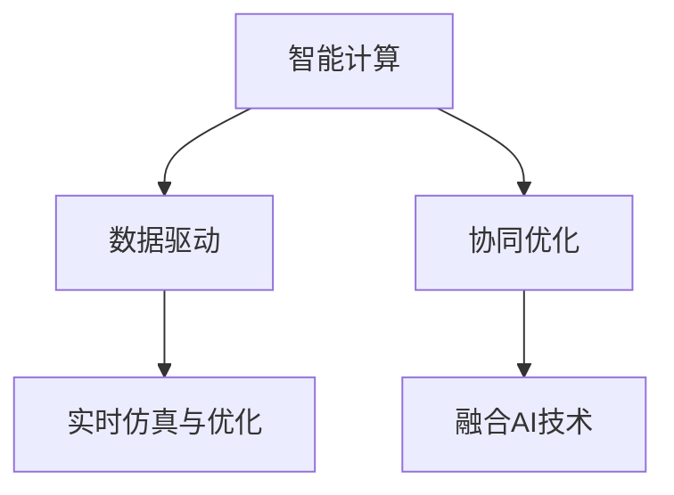

                 

## 1. 背景介绍

### 1.1 问题由来

随着城市化进程的加速和人口的迅速增长，传统交通系统面临着严峻挑战。交通拥堵、空气污染、资源浪费等问题日益凸显，对城市居民的生活质量和可持续发展构成了严重威胁。与此同时，人工智能（AI）技术的飞速发展，为解决这些复杂问题提供了新的可能。

### 1.2 问题核心关键点

城市交通系统是一个高度复杂、多变的系统，涵盖多个子系统，如道路交通、公共交通、共享出行、物流配送等。其核心在于如何实现人-车-路-环境之间的良性互动，实现交通流的高效运行、资源的高效利用，以及环境友好。AI技术的引入，尤其是智能计算和数据驱动的决策支持，为城市交通系统的智能化转型提供了新思路。

## 2. 核心概念与联系

### 2.1 核心概念概述

为更好地理解AI在城市交通系统中的应用，本节将介绍几个密切相关的核心概念：

- **智能计算（Smart Computing）**：利用AI技术对复杂系统和海量数据进行建模、分析和预测，支持高效、智能的决策制定。

- **数据驱动（Data-Driven）**：通过收集、处理和分析城市交通系统的各类数据，构建数字化、智能化的交通管理平台。

- **协同优化（Collaborative Optimization）**：多子系统之间的协同合作，实现交通系统的整体最优运行。

- **实时仿真与优化（Real-time Simulation and Optimization）**：通过实时仿真，对交通系统进行动态调整和优化，确保其在多变环境下的稳定运行。

- **融合AI技术（AI Integration）**：将AI技术与现有交通系统有机结合，实现系统的智能化升级和转型。

这些核心概念之间的逻辑关系可以通过以下Mermaid流程图来展示：



这个流程图展示出智能计算在城市交通系统中的应用框架：

1. 智能计算通过建模和分析，提供决策支持。
2. 数据驱动以城市交通数据为核心，实现数字化管理。
3. 协同优化和多子系统间的合作，确保整体最优运行。
4. 实时仿真与优化在动态环境中持续调整系统。
5. 融合AI技术实现系统的智能化升级。

## 3. 核心算法原理 & 具体操作步骤
### 3.1 算法原理概述

AI在城市交通系统中的应用，本质上是将智能计算和数据驱动技术应用于交通管理各个环节，通过多层次、多维度的建模与优化，实现交通流的智能调控。具体来说，AI在交通系统中的应用包括：

- **交通预测与规划**：利用历史数据和实时数据，通过机器学习模型预测交通流量，并根据预测结果优化路径规划和信号控制。
- **智能调度与运营**：通过优化算法实现车辆调度、公交路线、共享出行等智能调度，提升运营效率。
- **环境监测与预警**：利用传感器和AI技术，实时监测交通环境，及时预警交通拥堵、事故等突发情况。
- **交通信号优化**：基于实时数据和预测模型，动态调整交通信号，缓解拥堵，提高通行效率。

### 3.2 算法步骤详解

基于AI的城市交通系统优化一般包括以下几个关键步骤：

**Step 1: 数据收集与预处理**

- 收集城市交通系统各环节的数据，包括交通流量、车辆位置、天气状况、公共交通时间表等。
- 对收集的数据进行清洗和预处理，去除噪音，填补缺失值，并进行特征工程，提取关键特征。

**Step 2: 建模与训练**

- 选择合适的AI模型，如深度学习、强化学习、随机优化等，进行建模和训练。
- 利用历史数据训练模型，获取模型的预测和优化能力。
- 模型训练过程中，采用交叉验证等技术，确保模型的泛化能力。

**Step 3: 仿真与优化**

- 在仿真平台上模拟交通系统的运行，评估模型的预测和优化效果。
- 利用仿真结果，对交通系统进行优化调整，如调整交通信号灯周期、优化公交线路、改进共享出行策略等。
- 动态更新模型，保持模型预测与现实环境的一致性。

**Step 4: 部署与监控**

- 将优化后的模型部署到实际交通系统中，实时监测和反馈模型的运行效果。
- 根据反馈结果，定期更新和优化模型，确保其适应环境变化。
- 设置监控系统，确保AI模型在实际运行中的稳定性和可靠性。

### 3.3 算法优缺点

基于AI的城市交通系统优化方法具有以下优点：

- **高效性**：通过数据驱动和实时仿真，能够快速响应交通环境变化，提升系统效率。
- **灵活性**：AI模型具有自适应能力，可以根据环境变化进行动态调整。
- **智能化**：利用深度学习等先进技术，实现对复杂交通系统的精确建模和预测。
- **低成本**：AI技术的应用减少了对人工干预的需求，降低了运营成本。

同时，该方法也存在一定的局限性：

- **数据依赖**：AI模型依赖高质量的数据，数据收集和处理成本较高。
- **模型复杂性**：AI模型通常较为复杂，需要较高的计算资源和专业知识。
- **解释性不足**：AI模型的决策过程较为“黑箱”，难以解释其内部工作机制。
- **伦理与安全性**：AI模型的应用可能带来隐私泄露、公平性等问题，需重视伦理与安全监管。

尽管存在这些局限性，但就目前而言，基于AI的交通系统优化方法已在大规模城市中得到广泛应用，显著提升了交通系统的效率和安全性。未来相关研究的重点在于如何进一步降低对数据的依赖，提高模型的解释性和公平性，同时兼顾可解释性和伦理安全性等因素。

### 3.4 算法应用领域

基于AI的城市交通系统优化方法，在城市交通系统的各个子领域中得到了广泛的应用，例如：

- **智能交通信号控制**：利用AI模型实时分析交通流量，动态调整信号灯周期，缓解交通拥堵。
- **智能公交系统**：通过AI优化公交线路和班次调度，提升公交服务效率和准点率。
- **共享出行服务**：结合AI和大数据分析，优化共享单车、共享汽车等服务的覆盖和调度。
- **智能停车管理**：利用AI技术优化停车场的空位检测和管理，提升停车场利用率。
- **物流配送优化**：通过AI模型优化配送路线和物流调度，提升配送效率和降低能耗。

除了上述这些经典应用外，AI技术还被创新性地应用于城市交通规划、应急管理、城市动态监测等领域，为城市交通的智能化转型提供了新的突破点。随着AI技术的不断发展，相信AI将在更广泛的领域中发挥作用，为城市交通系统的可持续发展注入新的活力。

## 4. 数学模型和公式 & 详细讲解 & 举例说明

### 4.1 数学模型构建

本节将使用数学语言对基于AI的城市交通系统优化过程进行更加严格的刻画。

记城市交通系统为 $T$，包含 $N$ 个子系统，如道路交通、公共交通、共享出行等。设 $S_t$ 为时间 $t$ 的交通状态，包括道路流量、车辆位置、公交班次等。城市交通系统的优化目标为最大化系统效率和安全性，可以定义如下目标函数：

$$
\min_{S_t} \left\{ \sum_{i=1}^N f_i(S_t) \right\}
$$

其中 $f_i$ 为第 $i$ 个子系统的目标函数，如交通拥堵、事故率、能耗等。

### 4.2 公式推导过程

以下我们以智能交通信号控制为例，推导最小化交通拥堵的目标函数及其梯度计算公式。

假设交通信号灯周期为 $T$，红绿灯交替时间分别为 $t_r$ 和 $t_g$，并假设交通流的概率分布符合泊松过程。设 $\rho$ 为车辆到达率，$k$ 为车辆通过信号灯的概率。交通信号的周期损失函数可以表示为：

$$
L(S_t) = \sum_{i=1}^N c_i(T) \rho_i (t_r + t_g)
$$

其中 $c_i$ 为第 $i$ 个子系统的车辆延迟成本，$\rho_i$ 为子系统的车辆到达率。

目标函数为最小化总周期损失函数 $L(S_t)$，通过梯度下降等优化算法，求解最优的交通信号周期。

### 4.3 案例分析与讲解

以智能交通信号控制为例，以下是完整的优化流程：

1. **数据收集**：通过传感器和摄像头收集交通流量数据、车辆位置数据等。
2. **模型构建**：利用机器学习算法构建交通流量预测模型，预测每个路口的流量。
3. **优化求解**：通过仿真平台，实时调整信号灯周期，最小化总周期损失函数。
4. **效果评估**：评估优化后的信号控制效果，如交通拥堵率、通行时间等指标。

## 5. 项目实践：代码实例和详细解释说明

### 5.1 开发环境搭建

在进行交通系统优化实践前，我们需要准备好开发环境。以下是使用Python进行开发的环境配置流程：

1. 安装Anaconda：从官网下载并安装Anaconda，用于创建独立的Python环境。

2. 创建并激活虚拟环境：
```bash
conda create -n traffic-env python=3.8 
conda activate traffic-env
```

3. 安装必要的Python库：
```bash
conda install numpy scipy pandas matplotlib scikit-learn pytorch torchvision transformers
```

4. 安装相关的仿真和优化库：
```bash
pip install SUMO OpenDynPY
```

完成上述步骤后，即可在`traffic-env`环境中开始优化实践。

### 5.2 源代码详细实现

下面我们以智能交通信号控制为例，给出使用SUMO进行优化仿真的PyTorch代码实现。

```python
import sumo as SUMO
import matplotlib.pyplot as plt
from sumo.tools import Vehicle

def traffic_simulation():
    # 初始化Sumo仿真
    sumo_process = SUMO.start('sumo.out', config='config.sumocfg')
    
    # 构建交通网络
    network = SUMO.NTNet.read('net.net.xml')
    
    # 加载交通信号灯配置
    traffic_light = SUMO.NL.read('tl.tl.xml')
    
    # 创建车辆并添加到网络
    vehicles = []
    for _ in range(100):
        vehicle = Vehicle('car')
        network.addVehicle(vehicle)
    
    # 运行仿真并获取结果
    SUMO.run(300)
    results = SUMO.inflows.getResults('sumo.out')
    
    # 可视化结果
    plt.plot(results)
    plt.title('Traffic Flow over Time')
    plt.xlabel('Time (s)')
    plt.ylabel('Traffic Flow (veh/hour)')
    plt.show()

# 运行交通模拟
traffic_simulation()
```

### 5.3 代码解读与分析

让我们再详细解读一下关键代码的实现细节：

**traffic_simulation函数**：
- 使用SUMO库启动交通仿真，并读取配置文件。
- 加载交通网络配置和信号灯配置。
- 创建多辆车辆，并添加到网络中。
- 运行仿真300秒，并获取流量结果。
- 使用Matplotlib可视化流量结果。

**SUMO库的使用**：
- SUMO是荷兰的交通仿真软件，提供了丰富的交通仿真功能，包括交通网络构建、交通信号控制、车辆仿真等。
- SUMO支持多种交通模型，如自适应交通模型、跟驰模型等，能够模拟不同交通场景下的车辆行为。

**交通信号控制优化**：
- 交通信号灯优化通常需要考虑到交叉口的交通流量、车辆到达率等因素，通过优化算法寻找最优的信号周期。
- 优化算法通常基于历史流量数据，使用机器学习模型预测未来流量，并优化信号周期。
- 在实践中，还可以结合实时数据，动态调整信号周期，进一步提高交通系统效率。

## 6. 实际应用场景

### 6.1 智能交通信号控制

智能交通信号控制是AI在城市交通系统中应用最为广泛的技术之一。通过AI技术，可以实现交通信号的动态调整，缓解交通拥堵，提升通行效率。

具体实现中，可以使用机器学习模型预测各交叉口的流量，并通过优化算法动态调整信号周期。例如，当某个交叉口流量较大时，可以延长绿灯时间，允许更多车辆通过。当流量较小时，可以缩短绿灯时间，避免交通拥堵。

### 6.2 智能公交系统

AI技术在智能公交系统中也有着广泛应用。通过AI技术，可以实现公交路线的优化调度，提升公交服务的效率和准点率。

具体实现中，可以使用AI技术分析公交车的运行数据，预测乘客的出行需求，并优化公交线路和班次调度。例如，在高峰期增加班次频次，减少等待时间；在非高峰期调整班次，提高资源利用率。

### 6.3 共享出行服务

共享出行服务，如共享单车、共享汽车等，也是AI技术的重要应用场景。通过AI技术，可以实现车辆的智能调度，提升服务的覆盖和效率。

具体实现中，可以使用AI技术分析用户需求和车辆分布情况，优化共享出行的调度和车辆投放。例如，在需求旺盛的地区增加车辆投放，在需求较少的地区减少投放；通过路径规划算法，优化车辆行驶路径，减少行驶时间和成本。

### 6.4 智能停车管理

智能停车管理也是AI技术的重要应用之一。通过AI技术，可以实现停车场空位检测和动态管理，提升停车场的利用率。

具体实现中，可以使用AI技术分析停车场的车辆进出数据，实时检测空位，并动态调整停车场的管理策略。例如，在停车场入口处安装摄像头和传感器，实时监测停车场空位情况；通过智能调度算法，优化车辆进出顺序，减少等待时间。

### 6.5 物流配送优化

物流配送优化也是AI技术的重要应用场景。通过AI技术，可以实现配送路线的优化，提升配送效率和降低能耗。

具体实现中，可以使用AI技术分析配送需求和路况信息，优化配送路线的选择和调度。例如，在配送时选择最短的路径，减少行驶时间和能耗；在道路拥堵时，动态调整配送路线，避免交通拥堵。

## 7. 工具和资源推荐

### 7.1 学习资源推荐

为了帮助开发者系统掌握AI在城市交通系统中的应用理论基础和实践技巧，这里推荐一些优质的学习资源：

1. 《智能交通系统设计与实现》：介绍智能交通系统的基本概念、设计方法和实现技术，适合初学者入门。

2. 《深度学习理论与实践》：介绍深度学习在交通系统中的各种应用，如交通预测、信号控制等，适合进阶学习。

3. 《OpenDynPY用户手册》：提供基于OpenDyn的交通仿真工具的详细使用说明，适合仿真实践。

4. 《SUMO用户手册》：提供SUMO仿真软件的详细使用说明，适合交通仿真实践。

5. 《交通系统优化与控制》：介绍交通系统优化和控制的基本原理和算法，适合深入学习。

通过对这些资源的学习实践，相信你一定能够快速掌握AI在城市交通系统中的应用精髓，并用于解决实际的交通问题。

### 7.2 开发工具推荐

高效的开发离不开优秀的工具支持。以下是几款用于交通系统优化开发的常用工具：

1. SUMO：荷兰的交通仿真软件，提供了丰富的交通仿真功能，包括交通网络构建、交通信号控制、车辆仿真等。

2. OpenDynPY：基于OpenDyn的交通仿真工具，支持多种交通模型，能够模拟不同交通场景下的车辆行为。

3. PyTorch：基于Python的开源深度学习框架，灵活的计算图设计，适合快速迭代研究。

4. TensorFlow：由Google主导开发的开源深度学习框架，生产部署方便，适合大规模工程应用。

5. Weights & Biases：模型训练的实验跟踪工具，可以记录和可视化模型训练过程中的各项指标，方便对比和调优。

6. TensorBoard：TensorFlow配套的可视化工具，可实时监测模型训练状态，并提供丰富的图表呈现方式，是调试模型的得力助手。

合理利用这些工具，可以显著提升交通系统优化任务的开发效率，加快创新迭代的步伐。

### 7.3 相关论文推荐

AI在交通系统中的应用源于学界的持续研究。以下是几篇奠基性的相关论文，推荐阅读：

1. Revisiting Roadway Traffic Control Through Adaptive Traffic Light Systems（《重新审视基于自适应信号灯系统的道路交通控制》）：提出基于AI的交通信号控制算法，并应用于实际道路测试。

2. Sarchical Recurrent Deep Neural Networks for Traffic Signals Control（《层级递归深度神经网络用于交通信号控制》）：提出层级递归深度神经网络模型，用于交通信号的优化控制。

3. Dare to Explore: A Meta-Learning Approach to Autonomous Traffic Signal Control（《敢于探索：一种元学习用于自动交通信号控制的方法》）：提出元学习算法，优化交通信号控制，实现自适应调整。

4. Road Traffic Control Using Distributed Artificial Neural Networks（《使用分布式人工神经网络的道路交通控制》）：提出分布式神经网络模型，优化交通信号控制，提高系统效率。

5. Modeling and Optimizing Urban Road Network Operation by Deep Learning-based Reinforcement Learning（《基于深度学习强化学习的城市道路网络运行建模与优化》）：提出基于深度学习的强化学习模型，优化城市道路网络运行。

这些论文代表了大规模交通系统AI应用的发展脉络。通过学习这些前沿成果，可以帮助研究者把握学科前进方向，激发更多的创新灵感。

## 8. 总结：未来发展趋势与挑战

### 8.1 总结

本文对基于AI的城市交通系统优化方法进行了全面系统的介绍。首先阐述了AI在城市交通系统中的应用背景和意义，明确了优化在提高交通效率、降低能耗、减少排放等方面的独特价值。其次，从原理到实践，详细讲解了交通系统优化的数学原理和关键步骤，给出了交通系统优化的完整代码实例。同时，本文还广泛探讨了交通系统优化在智能交通信号控制、智能公交系统、共享出行服务、智能停车管理、物流配送优化等多个领域的应用前景，展示了AI技术的巨大潜力。此外，本文精选了交通系统优化的各类学习资源，力求为读者提供全方位的技术指引。

通过本文的系统梳理，可以看到，基于AI的交通系统优化方法正在成为城市交通管理的重要范式，极大地提升了交通系统的效率和安全性。未来，伴随AI技术的不断发展，AI将在更广泛的领域中发挥作用，为城市交通系统的可持续发展注入新的活力。

### 8.2 未来发展趋势

展望未来，AI在交通系统中的应用将呈现以下几个发展趋势：

1. **智能化与自动化**：AI技术将进一步深入交通系统的各个环节，实现智能化和自动化的管理，提升系统的运行效率和稳定性。

2. **动态性与自适应性**：交通系统将具备更强的动态性和自适应性，能够实时响应交通环境的变化，优化系统运行。

3. **数据驱动与精准预测**：AI系统将更加依赖数据驱动，通过精准的预测和决策支持，提升系统的运行效率和可靠性。

4. **多模态融合**：AI技术将进一步融合多模态信息，如车辆位置、环境状况、用户需求等，实现更全面、精准的系统优化。

5. **跨界融合与创新**：AI技术将与物联网、区块链、边缘计算等技术融合，推动交通系统的创新应用，如智能基础设施、智慧城市等。

6. **可持续发展**：AI技术将助力交通系统的绿色低碳转型，减少能耗和排放，促进可持续发展。

以上趋势凸显了AI在交通系统中的应用前景。这些方向的探索发展，必将进一步提升交通系统的智能化水平，为城市交通的可持续发展注入新的活力。

### 8.3 面临的挑战

尽管AI在交通系统中的应用已取得显著成效，但在迈向更加智能化、普适化应用的过程中，仍面临诸多挑战：

1. **数据隐私与安全**：交通系统涉及大量个人和车辆数据，数据隐私和安全问题需高度重视。

2. **模型复杂性与可解释性**：AI模型的复杂性及其“黑箱”特性，使得模型的可解释性不足，难以满足伦理和安全监管要求。

3. **计算资源与成本**：AI技术的应用需要大量的计算资源和存储资源，成本较高。

4. **跨系统协同**：交通系统涉及多个子系统，系统间的协同与整合问题需解决。

5. **技术标准与规范**：交通系统的标准化和规范制定，需加快推进。

6. **伦理与法律问题**：AI技术的应用可能带来伦理和法律问题，需加强监管和规范。

这些挑战亟需解决，以确保AI技术在交通系统中的应用安全和稳定。只有克服这些挑战，AI技术才能在交通系统中发挥更大的作用，为城市交通的可持续发展提供有力支持。

### 8.4 研究展望

面对AI在交通系统中的应用挑战，未来的研究需要在以下几个方面寻求新的突破：

1. **隐私保护技术**：开发高效的数据加密、匿名化技术，保护交通数据的隐私和安全。

2. **模型可解释性**：探索模型的可解释性和透明性，开发可解释的AI模型，满足伦理和安全监管要求。

3. **计算资源优化**：研究高效的模型压缩、量化等技术，降低计算资源和存储成本。

4. **跨系统协同**：开发跨系统的协同框架和标准，实现不同子系统间的无缝对接和合作。

5. **标准化与规范**：推动交通系统的标准化和规范化，建立统一的通信协议和数据格式。

6. **伦理与法律研究**：加强AI技术的伦理和法律研究，建立相关的法规和标准。

这些研究方向的探索，必将推动AI技术在交通系统中的应用不断深入，为城市交通的可持续发展提供有力支持。面向未来，AI技术将在交通系统的智能化转型中扮演越来越重要的角色，为实现可持续发展的城市交通系统贡献力量。

## 9. 附录：常见问题与解答

**Q1：AI技术在交通系统中如何实现精准预测？**

A: AI技术在交通系统中实现精准预测，主要依赖于高质量的数据收集和处理，以及先进的机器学习算法。以下是关键步骤：

1. **数据收集**：通过传感器、摄像头、GPS等多种方式，收集交通流量、车辆位置、路况等信息。

2. **数据清洗与预处理**：对收集的数据进行清洗，去除噪音，填补缺失值，并进行特征工程，提取关键特征。

3. **模型训练**：利用历史数据训练机器学习模型，如回归模型、时间序列模型、深度学习模型等。

4. **模型验证与优化**：通过交叉验证等技术，评估模型性能，并进行模型优化。

5. **实时预测**：利用训练好的模型，对实时数据进行预测，输出交通流量、拥堵情况等指标。

**Q2：智能交通系统优化中如何处理多子系统的协同问题？**

A: 智能交通系统优化中处理多子系统的协同问题，需要考虑各子系统间的信息交互和资源共享，以实现整体最优运行。以下是关键步骤：

1. **系统建模**：建立多子系统的数学模型，描述各子系统间的交互关系。

2. **协同优化算法**：设计协同优化算法，如分布式优化、联合优化等，实现各子系统的协同优化。

3. **通信协议与数据格式**：制定统一的通信协议和数据格式，确保各子系统间的信息交互。

4. **实时监测与反馈**：建立实时监测系统，收集各子系统的运行数据，及时反馈优化结果。

5. **动态调整**：根据实时反馈结果，动态调整各子系统的运行参数，实现整体最优运行。

**Q3：AI在交通系统中面临的主要数据隐私和安全问题有哪些？**

A: AI在交通系统中面临的主要数据隐私和安全问题包括：

1. **数据隐私**：交通数据涉及个人和车辆的隐私信息，需要采取数据加密、匿名化等技术，保护数据隐私。

2. **数据安全**：交通系统中的数据可能被恶意攻击或篡改，需要建立安全的数据传输和存储机制。

3. **算法公平性**：AI模型可能存在偏见或歧视，需要开发公平的算法，避免对特定群体的不公待遇。

4. **模型鲁棒性**：AI模型需要具备鲁棒性，能够抵御恶意攻击和数据噪音。

5. **合规性**：AI技术的应用需遵守相关法律法规，如隐私保护、数据安全等。

这些数据隐私和安全问题需要得到高度重视，通过技术手段和政策法规，确保AI技术在交通系统中的应用安全和可靠。

**Q4：交通信号控制的AI优化算法有哪些？**

A: 交通信号控制的AI优化算法主要包括：

1. **基于规则的算法**：如信号灯周期固定算法、时间分裂控制算法等，适用于较为简单的交通场景。

2. **基于机器学习的算法**：如线性回归、决策树、随机森林等，能够根据实时数据进行动态调整。

3. **基于强化学习的算法**：如Q-learning、深度强化学习等，能够通过模拟试验，优化信号灯周期。

4. **基于神经网络的算法**：如多层感知器、卷积神经网络等，能够学习交通流特征，进行信号控制。

5. **混合算法**：将多种算法结合使用，综合考虑不同因素，优化信号控制。

这些算法各有优劣，根据具体场景和需求选择合适的算法，能够有效提升交通信号控制的效果。

**Q5：AI技术在交通系统中如何实现资源优化？**

A: AI技术在交通系统中实现资源优化，主要依赖于交通流的预测和优化算法。以下是关键步骤：

1. **交通流预测**：利用历史数据和实时数据，预测交通流的变化趋势。

2. **资源配置**：根据交通流预测结果，调整交通信号灯周期、公交线路、共享出行服务等资源配置。

3. **实时调整**：利用实时数据，动态调整资源配置，优化系统运行。

4. **仿真验证**：通过仿真平台，验证资源优化方案的效果，并进行优化调整。

5. **持续优化**：根据实际运行数据，持续优化资源配置策略，提高系统效率。

**Q6：智能交通系统中如何保障系统安全？**

A: 智能交通系统中保障系统安全，主要依赖于多层次的安全机制和技术手段。以下是关键措施：

1. **数据加密与匿名化**：对交通数据进行加密和匿名化处理，保护数据隐私和安全。

2. **访问控制**：对系统进行严格的访问控制，限制未授权用户的访问。

3. **异常监测与预警**：建立异常监测系统，实时监测系统运行状态，及时预警潜在风险。

4. **模型鲁棒性**：开发鲁棒性强的AI模型，避免模型被恶意攻击或数据噪音影响。

5. **安全测试**：进行系统的安全测试和漏洞扫描，确保系统的安全性。

通过这些措施，可以有效保障智能交通系统的安全，确保系统的稳定运行。

---

作者：禅与计算机程序设计艺术 / Zen and the Art of Computer Programming

