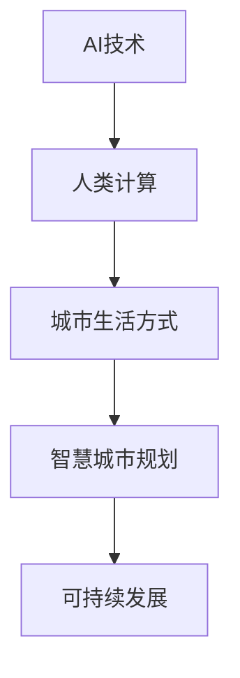

                 

## 1. 背景介绍

在数字化、智能化的时代背景下，人类计算逐渐成为一种新的生活方式。城市作为人类活动的聚集地，其可持续发展离不开智慧计算的支持。本文将探讨如何利用AI技术，结合人类计算，打造可持续发展的城市生活方式与规划。

## 2. 核心概念与联系

### 2.1 核心概念概述

**AI与人类计算：**
- **AI（人工智能）**：一种通过算法和模型模拟人类智能的计算过程。能够处理大量数据，进行复杂计算和模式识别，辅助人类进行决策。
- **人类计算**：利用人类智慧和知识，通过计算工具处理问题，与AI进行互补，形成人机协同工作模式。

**可持续发展的城市生活方式：**
- **可持续发展**：指满足当代需求，同时不损害未来代满足其需求的能力的发展方式。
- **城市生活方式**：人们在城市中的日常生活、工作、娱乐等行为模式。

**智慧城市规划：**
- **智慧城市**：通过信息通信技术、物联网、人工智能等技术，实现城市管理和服务智能化、便捷化。
- **规划**：城市发展的整体布局、资源配置和建设安排，确保城市发展目标与可持续发展理念相符合。

### 2.2 核心概念原理和架构的 Mermaid 流程图



## 3. 核心算法原理 & 具体操作步骤

### 3.1 算法原理概述

基于AI与人类计算的城市规划和建设，主要涉及以下算法原理：

- **数据处理与分析**：利用AI技术对城市数据进行清洗、分析，识别出影响城市发展的关键因素。
- **模拟与预测**：使用AI模型进行城市发展的模拟与预测，优化城市规划决策。
- **优化与调度**：利用优化算法对城市资源进行优化配置和调度，提升城市运营效率。

### 3.2 算法步骤详解

1. **数据采集与处理**：
   - 收集城市基础设施、环境、交通、人口等数据。
   - 对数据进行清洗、归一化处理，确保数据质量。

2. **模型训练与优化**：
   - 使用AI算法（如深度学习、强化学习）训练模型，优化城市资源配置和规划。
   - 采用交叉验证、超参数调优等技术，提高模型性能。

3. **模拟与预测**：
   - 利用训练好的模型对城市未来发展进行模拟与预测，生成城市规划方案。
   - 结合人类专家经验，对预测结果进行修正和优化。

4. **评估与调整**：
   - 通过评估指标（如能效比、环境影响、经济成本等）对城市规划方案进行评估。
   - 根据评估结果调整规划方案，确保方案可持续性。

### 3.3 算法优缺点

**优点：**
- **高效性**：利用AI算法可以处理大量数据，快速生成优化方案。
- **精确性**：通过模拟与预测，提高城市规划的科学性和准确性。
- **灵活性**：可以结合人类经验进行方案调整，保证方案的适用性。

**缺点：**
- **数据依赖**：需要高质量、全面的数据支持，数据不足时可能影响预测结果。
- **模型复杂性**：高精度模型计算量大，资源消耗高。
- **解释性不足**：AI模型输出难以解释，可能需要专家进行人工审核。

### 3.4 算法应用领域

**智慧交通**：
- 通过AI算法对交通数据进行分析和预测，优化交通信号控制、路线规划等。
- 结合人类交通管理经验，提高交通管理效率和安全性。

**智慧能源**：
- 利用AI算法优化能源供应、使用和调度，降低能耗。
- 结合人类能源管理经验，提升能源利用效率和可再生能源比例。

**智慧医疗**：
- 通过AI算法对医疗数据进行分析，预测疾病趋势，优化医疗资源配置。
- 结合人类医学专家经验，提供精准医疗方案。

**智慧环境**：
- 利用AI算法对环境数据进行分析，预测环境变化趋势。
- 结合人类环境保护经验，制定环境治理方案。

## 4. 数学模型和公式 & 详细讲解 & 举例说明

### 4.1 数学模型构建

假设城市基础设施为 $X$，环境质量为 $Y$，交通状况为 $Z$，人口数量为 $P$，城市可持续发展的目标为 $T$。

城市规划的目标是最大化 $T$，约束条件包括：

$$
\begin{align*}
T &= f(X, Y, Z, P) \\
&= \max_{X, Y, Z, P} f(X, Y, Z, P) \\
&\text{s.t.} \quad C(X, Y, Z, P) \leq B
\end{align*}
$$

其中，$f(X, Y, Z, P)$ 为城市发展的综合评价函数，$C(X, Y, Z, P)$ 为城市发展的成本函数，$B$ 为成本预算。

### 4.2 公式推导过程

**目标函数：**
- $f(X, Y, Z, P)$ 表示城市发展的综合评价函数，可以通过多个子函数加权求和得到。

**约束条件：**
- $C(X, Y, Z, P)$ 表示城市发展的成本函数，包括基础设施建设成本、环境治理成本、交通设施建设成本和人口增长成本等。

**求解步骤：**
1. 收集和处理数据。
2. 使用优化算法求解上述优化问题。
3. 结合人类专家经验，对优化结果进行修正和调整。

### 4.3 案例分析与讲解

**智慧交通规划案例**：
- **数据采集**：收集城市交通流量、路线数据、车辆类型等数据。
- **模型训练**：使用深度学习算法（如RNN、LSTM）对交通数据进行分析和预测，生成交通流量预测模型。
- **模拟与预测**：利用模型对未来交通流量进行预测，生成交通规划方案。
- **评估与调整**：通过评估指标（如交通拥堵程度、通行时间等）对规划方案进行评估，根据评估结果调整方案。

## 5. 项目实践：代码实例和详细解释说明

### 5.1 开发环境搭建

**Python环境搭建**：
1. 安装Python和pip。
2. 安装相关库（如TensorFlow、Scikit-learn、Pandas等）。
3. 搭建虚拟环境。

**数据集准备**：
1. 收集城市基础设施、环境、交通、人口等数据。
2. 对数据进行清洗、归一化处理。

### 5.2 源代码详细实现

```python
import tensorflow as tf
from sklearn.model_selection import train_test_split
import pandas as pd
import numpy as np

# 数据预处理
data = pd.read_csv('city_data.csv')
X = data[['基础设施', '环境质量', '交通状况', '人口数量']]
y = data['城市可持续发展目标']

# 划分训练集和测试集
X_train, X_test, y_train, y_test = train_test_split(X, y, test_size=0.2)

# 模型构建
model = tf.keras.Sequential([
    tf.keras.layers.Dense(64, activation='relu', input_shape=(4,)),
    tf.keras.layers.Dense(1, activation='sigmoid')
])

# 编译模型
model.compile(optimizer='adam', loss='binary_crossentropy', metrics=['accuracy'])

# 模型训练
model.fit(X_train, y_train, epochs=10, validation_data=(X_test, y_test))

# 模型评估
test_loss, test_acc = model.evaluate(X_test, y_test)
print('Test accuracy:', test_acc)
```

### 5.3 代码解读与分析

**数据预处理**：
- 使用Pandas库读取城市数据，并进行数据清洗和归一化处理。

**模型构建**：
- 使用TensorFlow库构建深度学习模型，包含两个全连接层。

**模型训练与评估**：
- 使用训练集对模型进行训练，并使用测试集进行评估。

**结果展示**：
- 输出测试集的准确率，评估模型性能。

## 6. 实际应用场景

### 6.1 智慧交通系统

智慧交通系统通过AI技术优化交通信号控制、路线规划等，结合人类交通管理经验，提升交通管理效率和安全性。具体应用场景包括：

**智能信号灯控制**：
- 使用AI算法分析交通流量数据，动态调整信号灯的时长，优化交通流量。
- 结合人类交通管理经验，调整信号灯控制策略。

**路线规划优化**：
- 利用AI算法对路线数据进行分析，生成最优路线规划方案。
- 结合人类导航经验，优化路线规划算法。

**事故预测与预警**：
- 使用AI算法分析交通数据，预测交通事故发生概率。
- 结合人类事故处理经验，生成事故预警方案。

### 6.2 智慧能源管理

智慧能源管理通过AI技术优化能源供应、使用和调度，结合人类能源管理经验，提升能源利用效率和可再生能源比例。具体应用场景包括：

**智能电网优化**：
- 使用AI算法分析电力数据，优化电网负荷分配。
- 结合人类电网管理经验，调整电网优化策略。

**能源消耗监测**：
- 利用AI算法监测能源消耗情况，生成能源消耗报告。
- 结合人类能源管理经验，优化能源使用策略。

**可再生能源利用**：
- 使用AI算法分析气候数据，优化可再生能源的使用策略。
- 结合人类能源管理经验，提升可再生能源利用效率。

### 6.3 智慧医疗系统

智慧医疗系统通过AI技术分析医疗数据，优化医疗资源配置，结合人类医学专家经验，提供精准医疗方案。具体应用场景包括：

**疾病预测与预防**：
- 使用AI算法分析病历数据，预测疾病发生概率。
- 结合人类医学经验，制定疾病预防措施。

**精准医疗方案**：
- 利用AI算法分析基因数据，生成个性化治疗方案。
- 结合人类医学经验，优化治疗方案。

**医疗资源配置优化**：
- 使用AI算法分析医疗资源数据，优化资源配置。
- 结合人类医学管理经验，调整资源配置策略。

### 6.4 未来应用展望

未来，基于AI与人类计算的城市规划将更加智能化、便捷化，具体应用场景包括：

**智慧建筑**：
- 使用AI算法优化建筑设计和施工方案，提升建筑质量和效率。
- 结合人类建筑管理经验，调整设计策略。

**智能环境监测**：
- 利用AI算法分析环境数据，预测环境变化趋势。
- 结合人类环境管理经验，制定环境保护措施。

**智慧教育**：
- 使用AI算法分析教育数据，优化教学资源配置。
- 结合人类教育管理经验，调整教育策略。

**智慧安全管理**：
- 利用AI算法分析安全数据，预测安全风险。
- 结合人类安全管理经验，制定安全措施。

## 7. 工具和资源推荐

### 7.1 学习资源推荐

**TensorFlow官方文档**：提供TensorFlow的详细使用指南和API文档，适用于深度学习模型的开发。

**Scikit-learn官方文档**：提供Scikit-learn的详细使用指南和API文档，适用于机器学习模型的开发。

**Pandas官方文档**：提供Pandas的详细使用指南和API文档，适用于数据处理和分析。

**Kaggle数据集**：提供丰富的数据集，适用于AI模型训练和测试。

### 7.2 开发工具推荐

**TensorFlow**：由Google主导开发的开源深度学习框架，适用于深度学习模型的开发。

**Scikit-learn**：Python机器学习库，适用于机器学习模型的开发。

**Pandas**：Python数据分析库，适用于数据处理和分析。

**Jupyter Notebook**：交互式编程环境，适用于数据处理、模型训练和调试。

### 7.3 相关论文推荐

**《智能城市规划：理论与实践》**：介绍智慧城市规划的理论基础和实践方法，涵盖数据处理、模型训练、优化与调度等环节。

**《人工智能在城市交通中的应用》**：探讨AI技术在城市交通中的具体应用场景，包括智能信号灯控制、路线规划等。

**《智能电网：智慧能源管理》**：介绍智慧能源管理的理论基础和实践方法，涵盖智能电网优化、能源消耗监测等环节。

**《精准医疗：AI在医疗中的应用》**：探讨AI技术在医疗中的应用，包括疾病预测、精准医疗方案等。

## 8. 总结：未来发展趋势与挑战

### 8.1 研究成果总结

本文探讨了基于AI与人类计算的城市规划和建设，通过AI算法优化城市资源配置和调度，结合人类专家经验，提升城市规划的科学性和适用性。主要研究成果包括：

1. **城市规划模型的构建**：提出基于AI与人类计算的城市规划模型，涵盖数据处理、模型训练、模拟与预测等环节。
2. **城市规划方案的优化**：利用AI算法优化城市资源配置和调度，结合人类专家经验，生成最优规划方案。
3. **城市规划的实际应用**：结合具体应用场景，介绍智慧交通、智慧能源、智慧医疗等领域的AI应用。

### 8.2 未来发展趋势

未来，基于AI与人类计算的城市规划将呈现以下几个发展趋势：

1. **数据驱动**：随着数据采集技术的不断进步，城市数据的种类和数量将不断增加，为城市规划提供更加全面、准确的数据支持。
2. **AI与人类协同**：AI算法将与人类专家协同工作，结合人类经验优化城市规划方案。
3. **跨学科融合**：城市规划将与其他学科（如建筑、环境、交通等）进行融合，形成多学科协同的城市规划模式。
4. **智能化管理**：利用AI算法实现城市管理的智能化、自动化，提升城市运营效率。

### 8.3 面临的挑战

尽管基于AI与人类计算的城市规划取得了一定的进展，但在实际应用中也面临以下挑战：

1. **数据质量问题**：城市数据的采集、处理和分析环节仍存在一定问题，数据质量不稳定。
2. **模型复杂性**：高精度模型计算量大，资源消耗高，需要高性能计算设备支持。
3. **可解释性不足**：AI模型输出难以解释，可能需要专家进行人工审核。
4. **伦理与隐私问题**：城市数据的采集和使用过程中可能涉及个人隐私和伦理问题，需要严格规范和保护。

### 8.4 研究展望

未来的研究需要在以下几个方面寻求新的突破：

1. **数据采集与处理技术**：进一步提升数据采集和处理技术，确保数据的质量和全面性。
2. **模型优化与调优**：开发更加高效的模型优化算法，降低资源消耗，提升模型性能。
3. **可解释性研究**：探索提升AI模型可解释性的方法，增强模型的透明度和可信度。
4. **伦理与隐私保护**：制定严格的伦理规范和隐私保护措施，确保数据使用的安全性和合法性。

## 9. 附录：常见问题与解答

**Q1：如何提高数据质量？**

A: 提高数据质量需要从数据采集、清洗和归一化等环节入手，具体措施包括：
- 采用高精度传感器和设备，确保数据采集的准确性。
- 对数据进行清洗，去除噪声和异常值。
- 对数据进行归一化处理，保证数据的一致性和可比性。

**Q2：如何选择适合的AI算法？**

A: 选择适合的AI算法需要考虑数据特点、应用场景和模型需求等因素，具体措施包括：
- 分析数据特点，选择合适的算法模型。
- 根据应用场景，调整算法参数和训练策略。
- 结合模型需求，优化算法性能和可解释性。

**Q3：如何保证模型可解释性？**

A: 保证模型可解释性需要从模型构建和结果输出等环节入手，具体措施包括：
- 使用可解释性高的模型，如决策树、线性回归等。
- 结合人类专家经验，解释模型输出。
- 提供详细的模型评估报告，确保模型输出的透明性。

**Q4：如何应对伦理与隐私问题？**

A: 应对伦理与隐私问题需要制定严格的规范和保护措施，具体措施包括：
- 制定数据使用规范，明确数据采集和使用的边界。
- 采用数据加密和匿名化技术，保护个人隐私。
- 建立数据使用审计机制，确保数据使用的合法性和透明性。

---

作者：禅与计算机程序设计艺术 / Zen and the Art of Computer Programming

