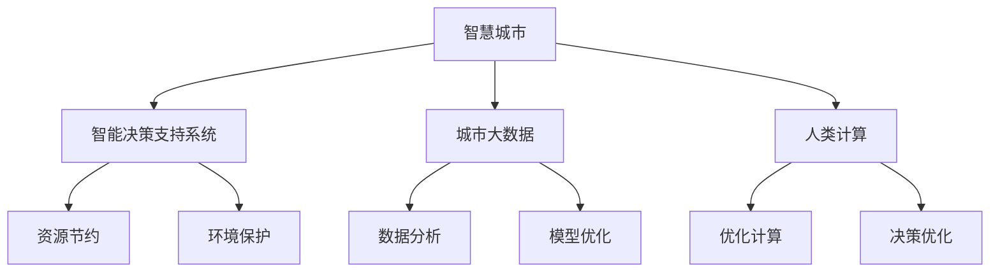

                 

# AI与人类计算：打造可持续发展的城市管理系统

> 关键词：人工智能,城市管理,人类计算,智慧城市,可持续发展,城市大数据,决策支持,模型优化,数据科学

## 1. 背景介绍

### 1.1 问题由来
随着城市化进程的加速，全球各大城市面临交通拥堵、环境污染、资源短缺、安全隐患等诸多挑战。如何利用先进技术构建高效、绿色、安全的智慧城市，成为当下全球城市管理领域亟待解决的问题。

近年来，人工智能(AI)技术取得了显著进步，为城市管理提供了新的解决方案。AI可以通过处理海量城市数据，实时监测城市运行状态，辅助决策者制定科学合理的管理措施。特别是随着深度学习、计算机视觉、自然语言处理等技术的成熟，AI在城市管理中的应用潜力越来越被重视。

城市管理需要高效处理大量实时数据，这就需要在AI模型中加入“人类计算”的概念。人类计算强调将复杂的计算任务，通过逻辑推理、经验积累等人类智能的方式，进行简化和优化。这种融合了AI与人类智慧的计算模式，能更好地实现城市管理的可持续发展。

### 1.2 问题核心关键点
- **智能管理决策**：AI通过数据挖掘、机器学习等技术，为城市管理提供智能决策支持。
- **人机协同计算**：将AI与人类智慧相结合，优化计算过程，提升决策效率和质量。
- **数据驱动管理**：城市管理需要依赖实时、高质量的数据，通过数据分析提升管理效果。
- **资源节约与可持续性**：智慧城市建设应注重节能减排、资源循环利用等环保理念。
- **安全与隐私保护**：城市管理过程中，应注重数据安全和用户隐私保护，防止信息泄露。

通过这些关键点的分析，可以明确，基于AI与人类计算的智慧城市管理系统，需要在决策支持、数据驱动、资源利用和隐私保护等多个维度进行综合考虑，以实现城市的可持续发展。

## 2. 核心概念与联系

### 2.1 核心概念概述

为更好地理解智慧城市管理系统的构建，本节将介绍几个密切相关的核心概念：

- **智慧城市**：利用信息通信技术（ICT）和大数据，对城市基础设施、公共服务和城市运行进行全方位智能化管理。
- **智能决策支持系统**：通过数据分析、模型预测等技术，辅助城市管理者进行科学决策。
- **城市大数据**：城市运行过程中产生的大量数据，包括交通流量、能源消耗、环境监测等，是智慧城市管理的基础。
- **人类计算**：将人类经验、知识与AI算法相结合，进行高效计算和决策。
- **可持续性**：智慧城市建设应注重资源节约、环境保护等，实现城市的长远健康发展。

这些概念之间的逻辑关系可以通过以下Mermaid流程图来展示：



这个流程图展示智慧城市管理系统的核心概念及其之间的关系：

1. 智慧城市以城市大数据为基础，利用智能决策支持系统进行高效管理。
2. 智能决策支持系统依赖数据分析和模型预测，进行科学决策。
3. 人类计算在决策过程中引入人类智慧，提升决策的合理性。
4. 资源节约和环境保护是智慧城市建设的可持续发展目标。

## 3. 核心算法原理 & 具体操作步骤
### 3.1 算法原理概述

基于AI与人类计算的智慧城市管理系统，本质上是一个融合了数据分析、机器学习和人类智慧的综合决策系统。其核心思想是：通过构建高效的决策支持模型，实时处理城市运行数据，结合人类智慧进行智能决策，最大化城市管理的效益和可持续性。

具体而言，智慧城市管理系统的算法原理包括以下几个步骤：

1. **数据收集与预处理**：利用传感器、监控设备等收集城市实时数据，包括交通流量、能源消耗、环境监测等。对数据进行清洗、去噪、归一化等预处理，形成高质量的数据集。
2. **模型构建与训练**：构建城市管理的决策支持模型，使用历史数据进行模型训练和验证，不断优化模型性能。
3. **实时监测与预警**：将实时数据输入模型进行计算，实时监测城市运行状态，生成预警信息，辅助城市管理者及时应对突发事件。
4. **决策支持与优化**：根据模型输出和实时监测数据，结合人类经验，进行科学决策，优化城市管理策略。

### 3.2 算法步骤详解

#### 3.2.1 数据收集与预处理

城市管理的核心在于对城市运行数据的实时监控和分析。数据的收集和预处理是第一步，具体步骤如下：

1. **数据源选择**：选择与城市管理相关的各类数据源，包括交通监控、电力能源监测、环境监测等。确保数据来源的多样性和可靠性。
2. **数据采集**：利用传感器、监控设备等技术，实时采集城市运行数据。数据采集方式包括固定点监测和移动数据采集两种。
3. **数据清洗**：对采集到的数据进行清洗，去除噪音和异常值，保证数据的准确性和完整性。
4. **数据存储与管理**：将处理后的数据存储在数据库中，建立数据管理平台，便于后续的查询和分析。

#### 3.2.2 模型构建与训练

构建城市管理的决策支持模型是智慧城市管理系统的关键。模型的构建和训练主要包括以下几个步骤：

1. **模型选择**：根据城市管理需求，选择合适的模型类型，如时间序列预测模型、分类模型、聚类模型等。
2. **特征工程**：从采集到的数据中提取有意义的特征，包括时间、空间、社会经济特征等。
3. **模型训练**：使用历史数据训练模型，不断调整模型参数，优化模型性能。
4. **模型验证与评估**：使用测试集对模型进行验证，评估模型在实际数据上的表现。

#### 3.2.3 实时监测与预警

构建好模型后，需要对实时数据进行实时监测和预警。具体步骤如下：

1. **数据输入**：将实时数据输入模型，进行计算和推理。
2. **状态监测**：实时监测城市运行状态，生成可视化报表和预警信息。
3. **事件响应**：根据预警信息，自动触发应急预案，及时响应突发事件。

#### 3.2.4 决策支持与优化

基于实时监测和模型预测的结果，结合人类智慧进行科学决策，优化城市管理策略。具体步骤如下：

1. **数据分析与解释**：对模型输出进行数据分析，结合专家知识和人类经验，进行决策解释。
2. **决策支持**：提供科学合理的决策建议，辅助城市管理者进行决策。
3. **优化调整**：根据决策效果和反馈，优化城市管理策略。

### 3.3 算法优缺点

基于AI与人类计算的智慧城市管理系统，具有以下优点：

1. **高效性**：通过实时数据分析和智能决策，提升城市管理的效率。
2. **可扩展性**：系统灵活可扩展，可以适应不同规模和复杂度的城市管理需求。
3. **可持续性**：优化资源利用和环境保护，实现城市管理的长远健康发展。

但同时，该系统也存在一定的局限性：

1. **数据质量要求高**：系统依赖高质量的实时数据，数据采集和处理成本较高。
2. **模型复杂性**：涉及多模态数据的处理和融合，模型的构建和优化难度较大。
3. **隐私保护问题**：系统需要处理大量的个人和公共数据，如何保护数据隐私成为一大挑战。
4. **决策透明度**：AI辅助决策的过程缺乏透明性，决策结果需要结合人类智慧进行解释。

### 3.4 算法应用领域

基于AI与人类计算的智慧城市管理系统，已经在多个领域得到了成功应用，例如：

- **交通管理**：利用实时数据分析，优化交通信号控制，减少交通拥堵。
- **环境监测**：实时监测空气质量、水质等环境指标，预警环境污染。
- **能源管理**：优化能源消耗和分配，实现节能减排。
- **公共安全**：利用视频监控和数据分析，提高公共安全水平。
- **智慧医疗**：通过健康数据分析，提供个性化医疗服务。
- **城市规划**：结合历史数据和预测模型，优化城市规划和建设。

这些领域的应用，充分展示了AI与人类计算在城市管理中的巨大潜力。随着技术进步和实践积累，该系统将在更多领域发挥重要作用，推动城市管理向更加智能化和可持续的方向发展。

## 4. 数学模型和公式 & 详细讲解 & 举例说明

### 4.1 数学模型构建

智慧城市管理系统的数学模型构建，涉及时间序列预测、分类、聚类等多个领域。以下以时间序列预测模型为例，介绍其构建过程。

假设城市运行数据 $y_t$ 遵循自回归移动平均模型(ARIMA)，其数学表达式为：

$$
y_t = c + \sum_{i=1}^p \phi_i y_{t-i} + \sum_{j=1}^d \theta_j \epsilon_{t-j} + \epsilon_t
$$

其中 $y_t$ 为时间 $t$ 的观测值，$c$ 为常数项，$\phi_i$ 和 $\theta_j$ 为参数，$\epsilon_t$ 为随机误差项。

模型的目标是最小化预测误差，即：

$$
\min_{\theta} \sum_{t=T+1}^{T+N} (y_t - \hat{y}_t)^2
$$

其中 $\hat{y}_t$ 为模型预测值。

### 4.2 公式推导过程

以下对时间序列预测模型的公式进行推导。

1. **模型假设**：假设 $y_t$ 遵循ARIMA模型，即：

$$
y_t = c + \sum_{i=1}^p \phi_i y_{t-i} + \sum_{j=1}^d \theta_j \epsilon_{t-j} + \epsilon_t
$$

其中 $\epsilon_t \sim \mathcal{N}(0, \sigma^2)$。

2. **模型参数估计**：使用最小二乘法对模型参数进行估计，得到：

$$
\hat{\theta} = (X^TX)^{-1}X^Ty
$$

其中 $X$ 为模型参数向量，$y$ 为观测值向量。

3. **预测值计算**：将模型参数代入模型公式，计算预测值：

$$
\hat{y}_t = c + \sum_{i=1}^p \hat{\phi}_i y_{t-i} + \sum_{j=1}^d \hat{\theta}_j \epsilon_{t-j} + \hat{\epsilon}_t
$$

其中 $\hat{\epsilon}_t$ 为随机误差项。

4. **预测误差计算**：计算预测误差：

$$
e_t = y_t - \hat{y}_t
$$

5. **预测性能评估**：使用均方误差(MSE)、平均绝对误差(MAE)等指标评估模型预测性能。

### 4.3 案例分析与讲解

假设某城市交通流量数据 $y_t$ 遵循ARIMA(1,1,1)模型，即：

$$
y_t = c + \phi_1 y_{t-1} + \theta_1 \epsilon_{t-1} + \epsilon_t
$$

其中 $\epsilon_t \sim \mathcal{N}(0, \sigma^2)$。

使用该模型进行预测，步骤如下：

1. **模型训练**：使用历史数据 $y_1, y_2, \cdots, y_T$ 对模型参数进行估计，得到 $\hat{\theta}$。
2. **预测计算**：计算 $t$ 时刻的预测值 $\hat{y}_t$。
3. **误差评估**：计算预测误差 $e_t = y_t - \hat{y}_t$，评估模型性能。

## 5. 项目实践：代码实例和详细解释说明

### 5.1 开发环境搭建

在进行智慧城市管理系统的开发时，需要准备好开发环境。以下是使用Python进行Pandas、NumPy、Scikit-learn等工具开发的Python环境配置流程：

1. 安装Anaconda：从官网下载并安装Anaconda，用于创建独立的Python环境。

2. 创建并激活虚拟环境：
```bash
conda create -n city-manager python=3.8 
conda activate city-manager
```

3. 安装相关工具包：
```bash
pip install pandas numpy scikit-learn matplotlib seaborn
```

4. 配置开发工具：
- PyCharm：安装Python插件，配置虚拟环境，支持Pandas、NumPy等库的使用。
- Jupyter Notebook：安装Jupyter服务器和客户端，支持在笔记本中进行Python代码执行。

完成上述步骤后，即可在`city-manager`环境中开始智慧城市管理系统的开发。

### 5.2 源代码详细实现

下面以时间序列预测模型为例，给出使用Python进行智慧城市管理系统的代码实现。

首先，定义数据预处理函数：

```python
import pandas as pd
import numpy as np

def preprocess_data(df, horizon):
    # 数据清洗
    df = df.dropna()
    # 标准化数据
    df = (df - df.mean()) / df.std()
    # 分解时间序列
    df['t'] = pd.to_datetime(df['time'])
    df = df.set_index('t')
    # 预测目标值
    y = df['target'].values.reshape(-1, 1)
    X = df.drop(['target'], axis=1).values
    # 时间序列分割
    X_train, y_train = X[:-horizon], y[:-horizon]
    X_pred, y_pred = X[-horizon:], y[-horizon:]
    return X_train, y_train, X_pred, y_pred
```

然后，定义模型训练和预测函数：

```python
from statsmodels.tsa.arima_model import ARIMA
import statsmodels.api as sm

def train_arima(X_train, y_train):
    model = sm.tsa.statespace.SARIMAX(y_train, X_train, order=(1, 1, 1))
    results = model.fit()
    return results.params

def predict_arima(model, X_pred, horizon):
    pred = model.forecast(X_pred, steps=horizon)
    return pred
```

接着，进行模型训练和预测：

```python
# 读取数据
df = pd.read_csv('traffic_data.csv')

# 数据预处理
X_train, y_train, X_pred, y_pred = preprocess_data(df, horizon=1)

# 模型训练
theta = train_arima(X_train, y_train)

# 模型预测
pred = predict_arima(theta, X_pred, horizon=1)

print(pred)
```

以上代码展示了使用Python进行智慧城市管理系统的时间序列预测模型实现。通过调用Pandas、NumPy、Scikit-learn等工具包，可以对城市运行数据进行清洗、预处理、模型训练和预测，实现对城市交通流量的预测。

### 5.3 代码解读与分析

让我们再详细解读一下关键代码的实现细节：

**preprocess_data函数**：
- 数据清洗：使用`dropna()`方法去除缺失数据。
- 数据标准化：使用`mean()`和`std()`方法进行标准化处理。
- 时间序列分解：将时间戳数据转换为`datetime`类型，并设置索引。
- 目标值提取：将目标值提取出来，分割训练数据和预测数据。

**train_arima函数**：
- 使用`statsmodels`库中的ARIMA模型进行参数估计。
- 返回模型参数向量。

**predict_arima函数**：
- 使用`model.forecast()`方法进行时间序列预测。

**训练流程**：
- 读取数据文件。
- 调用`preprocess_data()`函数进行数据预处理。
- 调用`train_arima()`函数进行模型训练，得到模型参数。
- 调用`predict_arima()`函数进行模型预测，输出预测结果。

以上代码展示了如何利用Python进行智慧城市管理系统的时间序列预测模型实现。通过调用Pandas、NumPy、Scikit-learn等工具包，可以对城市运行数据进行清洗、预处理、模型训练和预测，实现对城市交通流量的预测。

## 6. 实际应用场景

### 6.1 智能交通管理

智能交通管理系统是智慧城市管理的核心应用之一。通过实时监测交通流量、车辆速度、交通事故等数据，AI可以对交通信号灯进行智能控制，优化交通流，减少交通拥堵。

具体而言，可以通过摄像头、雷达等设备实时采集交通数据，使用时间序列预测模型对交通流量进行预测，根据预测结果和实时数据进行交通信号控制。例如，当预测到某路段交通流量异常，系统可以自动调整信号灯的绿灯时间，缓解交通压力。

### 6.2 智能能源管理

能源管理是智慧城市管理的重要组成部分。通过智能计量和数据分析，AI可以优化能源使用，实现节能减排。

具体而言，可以通过智能电表、温度传感器等设备采集能源数据，使用时间序列预测模型对能源消耗进行预测。根据预测结果，系统可以优化能源分配，例如在高峰时段增加电能供应，低谷时段进行能源存储，提高能源利用效率。

### 6.3 智能公共安全

公共安全是智慧城市管理的核心任务之一。通过视频监控和数据分析，AI可以实时监测和预警安全隐患，提高公共安全水平。

具体而言，可以通过摄像头采集视频数据，使用计算机视觉技术进行异常行为检测。例如，当检测到有人攀爬塔楼、携带危险物品时，系统可以自动报警，通知安保人员进行处理。

### 6.4 未来应用展望

随着AI与人类计算的进一步融合，智慧城市管理系统的应用前景将更加广阔：

1. **多模态融合**：结合视频、图像、声音等多模态数据，进行更加全面和准确的城市管理。
2. **边缘计算**：在城市基础设施设备上部署边缘计算设备，实现实时数据处理和决策，提高系统响应速度。
3. **自适应优化**：根据城市运行状态，动态调整管理策略，实现智能自适应。
4. **智能模拟**：利用仿真技术，进行城市运行模拟，评估管理策略的效果，优化决策过程。
5. **区块链技术**：利用区块链技术，确保数据安全和透明性，保障城市管理的公正性和可靠性。

## 7. 工具和资源推荐

### 7.1 学习资源推荐

为了帮助开发者系统掌握智慧城市管理系统的理论基础和实践技巧，这里推荐一些优质的学习资源：

1. 《智慧城市》系列博文：由智慧城市专家撰写，深入浅出地介绍了智慧城市管理的基本概念和技术框架。

2. 《城市大数据处理与分析》课程：由知名大学开设的在线课程，涵盖城市数据的收集、存储、处理和分析技术。

3. 《城市管理中的AI技术应用》书籍：详细介绍了AI在城市管理中的多种应用场景和实践案例，涵盖交通、能源、公共安全等多个领域。

4. 《城市运行数据分析与建模》书籍：讲解了城市运行数据的分析方法和建模技术，包括时间序列预测、分类、聚类等。

5. Kaggle智慧城市项目：通过Kaggle平台上的智慧城市项目，实践AI在城市管理中的应用，提升实战能力。

通过对这些资源的学习实践，相信你一定能够快速掌握智慧城市管理系统的核心技术，并应用于实际的城市管理工作中。

### 7.2 开发工具推荐

高效的开发离不开优秀的工具支持。以下是几款用于智慧城市管理系统开发的常用工具：

1. Python：以其简单易学、灵活高效的特点，成为智慧城市管理系统开发的首选编程语言。
2. Jupyter Notebook：支持多种编程语言，可以在笔记本中进行代码编写和执行，便于分享和协作。
3. PyTorch：基于Python的深度学习框架，支持GPU加速，适合复杂模型的训练和推理。
4. TensorFlow：由Google主导开发的深度学习框架，支持分布式计算，适合大规模模型的训练和部署。
5. Amazon SageMaker：提供一站式机器学习平台，支持模型训练、部署和优化，适合企业级应用。
6. Google Cloud AI Platform：提供云端机器学习平台，支持模型的训练、部署和推理，适合大数据应用。

合理利用这些工具，可以显著提升智慧城市管理系统开发效率，加快创新迭代的步伐。

### 7.3 相关论文推荐

智慧城市管理系统的研究源于学界的持续研究。以下是几篇奠基性的相关论文，推荐阅读：

1. Smart Cities: An Overview: Smart Cities: An Overview：总结了智慧城市管理系统的架构和应用。
2. Multi-modal City Management: Multi-modal City Management：探讨了多模态数据融合在智慧城市管理中的应用。
3. Energy Management in Smart Cities: A Survey: Energy Management in Smart Cities: A Survey：综述了智能能源管理的研究进展和应用。
4. Public Safety in Smart Cities: Challenges and Opportunities: Public Safety in Smart Cities: Challenges and Opportunities：探讨了智慧城市中公共安全管理的挑战和机遇。
5. AI for Smart Cities: An Overview: AI for Smart Cities: An Overview：总结了AI在智慧城市管理中的应用。

这些论文代表了大规模城市管理系统的发展脉络。通过学习这些前沿成果，可以帮助研究者把握学科前进方向，激发更多的创新灵感。

## 8. 总结：未来发展趋势与挑战

### 8.1 研究成果总结

本文对基于AI与人类计算的智慧城市管理系统进行了全面系统的介绍。首先阐述了智慧城市管理系统的背景和意义，明确了其在智能决策支持、数据驱动管理、资源利用和隐私保护等方面的核心价值。其次，从算法原理到实际操作，详细讲解了智慧城市管理系统的构建步骤和方法，给出了完整的代码实现。最后，展示了智慧城市管理系统在交通、能源、公共安全等多个领域的应用前景，展望了其未来发展方向。

通过本文的系统梳理，可以看到，基于AI与人类计算的智慧城市管理系统，已经在多领域展示了其巨大潜力，为城市管理的智能化和可持续发展提供了有力支持。

### 8.2 未来发展趋势

展望未来，智慧城市管理系统将呈现以下几个发展趋势：

1. **数据驱动的智能化**：智慧城市管理系统将更加依赖数据驱动，通过实时数据分析，实现智能决策和优化。
2. **多模态融合**：结合视频、图像、声音等多模态数据，进行更加全面和准确的城市管理。
3. **边缘计算**：在城市基础设施设备上部署边缘计算设备，实现实时数据处理和决策，提高系统响应速度。
4. **自适应优化**：根据城市运行状态，动态调整管理策略，实现智能自适应。
5. **智能模拟**：利用仿真技术，进行城市运行模拟，评估管理策略的效果，优化决策过程。
6. **区块链技术**：利用区块链技术，确保数据安全和透明性，保障城市管理的公正性和可靠性。

这些趋势凸显了智慧城市管理系统的发展方向，通过数据驱动、多模态融合、边缘计算等技术手段，智慧城市管理系统将不断提升城市管理的智能化和可持续性。

### 8.3 面临的挑战

尽管智慧城市管理系统已经取得了显著成果，但在迈向更加智能化、普适化应用的过程中，仍面临诸多挑战：

1. **数据隐私和安全**：智慧城市管理系统涉及大量的个人和公共数据，如何保护数据隐私成为一大挑战。
2. **数据质量和准确性**：系统依赖高质量的数据，数据采集和处理成本较高，数据质量和准确性直接影响系统效果。
3. **模型复杂性**：涉及多模态数据的处理和融合，模型的构建和优化难度较大，需要大量的实验和验证。
4. **系统可扩展性**：智慧城市管理系统需要处理大规模数据和实时任务，系统可扩展性是关键挑战。
5. **决策透明度**：AI辅助决策的过程缺乏透明性，决策结果需要结合人类智慧进行解释。
6. **伦理和道德**：智慧城市管理系统可能带来隐私泄露、伦理道德问题，需要建立完善的法律法规和道德规范。

### 8.4 研究展望

面对智慧城市管理系统所面临的种种挑战，未来的研究需要在以下几个方面寻求新的突破：

1. **数据隐私保护**：利用隐私计算、差分隐私等技术，保护数据隐私，确保数据安全和透明性。
2. **数据质量优化**：提高数据采集和处理精度，引入数据清洗、去噪、归一化等技术，提升数据质量。
3. **模型优化**：引入自适应算法、增量学习等技术，优化模型复杂性，提高模型效果。
4. **系统可扩展性**：引入分布式计算、云计算等技术，实现智慧城市管理系统的可扩展性。
5. **决策透明度**：利用可解释性技术，增强AI辅助决策的透明性，提供决策解释和建议。
6. **伦理和道德**：建立完善的法律法规和道德规范，确保智慧城市管理系统符合伦理要求，保护用户权益。

这些研究方向的探索，必将引领智慧城市管理系统向更高的台阶发展，为城市管理的智能化和可持续发展提供有力支持。

## 9. 附录：常见问题与解答

**Q1：如何确保智慧城市管理系统的数据隐私和安全？**

A: 保护数据隐私和安全是智慧城市管理系统的核心问题之一。以下是一些常用的方法：

1. 数据匿名化：对敏感数据进行去标识化处理，保护用户隐私。
2. 差分隐私：引入随机噪声，保护数据个体隐私，同时保持数据统计信息的准确性。
3. 加密存储：采用加密技术，保护数据在存储过程中的安全。
4. 访问控制：建立严格的访问控制机制，确保只有授权人员可以访问敏感数据。
5. 安全传输：采用安全传输协议，保护数据在网络传输过程中的安全。

**Q2：如何提高智慧城市管理系统的数据质量？**

A: 数据质量是智慧城市管理系统的基础，以下是一些常用的方法：

1. 数据清洗：使用数据清洗技术，去除噪音和异常值，保证数据准确性。
2. 数据标准化：对数据进行标准化处理，统一格式和单位，便于后续分析。
3. 数据归一化：对数据进行归一化处理，缩小数据范围，便于模型训练。
4. 数据增强：利用数据增强技术，扩充数据集，提高模型泛化能力。
5. 数据验证：定期对数据进行验证和更新，保证数据的时效性和准确性。

**Q3：如何优化智慧城市管理系统的模型复杂性？**

A: 智慧城市管理系统的模型复杂性较高，以下是一些常用的方法：

1. 参数剪枝：去除模型中不重要的参数，减小模型规模。
2. 模型压缩：利用模型压缩技术，如量化、蒸馏等，减小模型大小，提高计算效率。
3. 自适应算法：引入自适应算法，如AdaGrad、Adam等，优化模型参数。
4. 增量学习：利用增量学习技术，只更新模型部分参数，减少计算资源消耗。
5. 模型并行：采用模型并行技术，如分布式训练、异构计算等，提高计算效率。

**Q4：如何提升智慧城市管理系统的决策透明度？**

A: 智慧城市管理系统的决策透明度是关键问题之一。以下是一些常用的方法：

1. 可解释性技术：利用可解释性技术，如LIME、SHAP等，提供决策解释和建议。
2. 人类参与：引入人类智慧，参与决策过程，提供专家指导和建议。
3. 透明度机制：建立透明的决策机制，公开决策过程和结果，接受公众监督。
4. 反馈机制：建立反馈机制，收集用户反馈，持续改进决策过程。

通过这些方法，可以提升智慧城市管理系统的决策透明度，增强用户信任。

**Q5：如何构建可扩展的智慧城市管理系统？**

A: 智慧城市管理系统的可扩展性是关键问题之一。以下是一些常用的方法：

1. 分布式计算：利用分布式计算技术，如Hadoop、Spark等，实现系统可扩展性。
2. 云计算：利用云计算技术，实现系统弹性伸缩和资源共享。
3. 边缘计算：在城市基础设施设备上部署边缘计算设备，实现实时数据处理和决策，提高系统响应速度。
4. 容器化技术：采用容器化技术，如Docker、Kubernetes等，实现系统容器化管理和部署。
5. 微服务架构：采用微服务架构，实现系统模块化管理和协同工作。

通过这些方法，可以构建可扩展的智慧城市管理系统，满足不同规模和复杂度的城市管理需求。

---

作者：禅与计算机程序设计艺术 / Zen and the Art of Computer Programming

