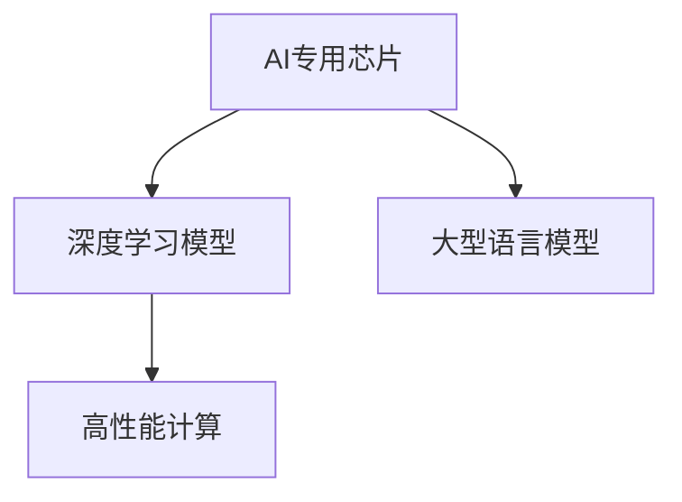

                 

## 1. 背景介绍

### 1.1 问题由来

随着大型语言模型（LLM）的规模不断扩大，对计算资源的需求也随之增加。尽管传统的通用计算硬件如CPU和GPU可以满足部分需求，但其性能和能效比难以满足LLM的高计算需求。因此，AI专用芯片（AI accelerator）作为一种高性能、低功耗的硬件，逐渐成为驱动LLM性能提升的关键技术。

### 1.2 问题核心关键点

AI专用芯片主要通过优化硬件架构、采用专用运算单元等方式，大幅提高对特定任务的计算效率。其主要优势在于：

- **高效能**：专门针对某些特定任务设计，如矩阵乘法、卷积、深度神经网络等。
- **低功耗**：优化了芯片的能耗管理，能够有效降低整体系统的功耗。
- **可扩展性**：支持大规模并行计算，易于扩展以应对更多的数据和任务需求。
- **低成本**：相比通用硬件，AI专用芯片在成本上具有显著优势。

AI专用芯片的出现，使得LLM在保持高性能的同时，更加节能、经济、高效，为AI技术的应用落地提供了强有力的硬件支持。

## 2. 核心概念与联系

### 2.1 核心概念概述

为更好地理解AI专用芯片及其与LLM的关联，本节将介绍几个关键概念：

- **AI专用芯片（AI Accelerator）**：专门用于加速AI任务的芯片，如NVIDIA的Tensor Core、Google的TPU等。这些芯片通过优化硬件架构和算法，大幅提升特定任务的计算效率。
- **深度学习模型（DL Models）**：基于神经网络的模型，如卷积神经网络（CNN）、递归神经网络（RNN）、Transformer等，用于解决复杂的机器学习问题。
- **大型语言模型（LLMs）**：基于深度学习模型，通过在大规模无标签文本数据上预训练，获得广泛语言知识的模型，如GPT、BERT等。
- **高性能计算（HPC）**：使用专用硬件和算法，实现高效的并行计算，以应对大规模数据处理的需求。

这些概念之间的逻辑关系可以通过以下Mermaid流程图来展示：



这个流程图展示了几大核心概念之间的联系：

1. AI专用芯片通过优化硬件架构和算法，大幅提升深度学习模型的计算效率。
2. 大型语言模型基于深度学习模型，通过在无标签文本数据上预训练，获得广泛语言知识。
3. 高性能计算利用专用硬件和算法，实现高效的并行计算，应对大规模数据处理需求。

这些概念共同构成了AI专用芯片与LLM的连接框架，为其性能提升提供了坚实的硬件基础。

## 3. 核心算法原理 & 具体操作步骤
### 3.1 算法原理概述

AI专用芯片在加速LLM训练和推理过程中的主要原理包括：

- **并行计算**：通过多核或阵列化的运算单元，并行处理多个数据流，提高计算效率。
- **专用运算单元**：针对特定计算任务，如矩阵乘法、卷积等，设计专门的运算单元，优化运算速度。
- **优化算法**：采用专为AI芯片设计的优化算法，如GPU上的CUDA、TPU上的TPU-compile等，提升算法执行效率。
- **硬件加速库**：提供高效的数值计算库和图形处理库，如cuDNN、XLA等，加速模型运算。

这些原理共同作用，显著提升了LLM的计算效率和性能。

### 3.2 算法步骤详解

AI专用芯片加速LLM的步骤一般包括以下几个关键步骤：

**Step 1: 硬件适配与环境配置**

1. 选择合适的AI专用芯片，如NVIDIA的Tensor Core、Google的TPU等。
2. 安装相应的驱动程序和编译器，如NVIDIA的CUDA、Google的TPU-compile等。
3. 配置好开发环境，如IDE、编译器等，确保能够兼容和利用AI专用芯片的性能。

**Step 2: 模型适配与数据准备**

1. 将原始模型代码适配到AI专用芯片架构上，如对Tensor Core模型进行cuDNN优化。
2. 准备训练和推理数据集，确保数据格式符合AI专用芯片的要求，如TensorCore的CUDA张量格式。
3. 设计合适的损失函数和优化算法，如Adam、SGD等，确保能够高效地利用AI专用芯片的并行计算能力。

**Step 3: 模型训练与优化**

1. 利用AI专用芯片的并行计算能力，训练深度学习模型。
2. 采用硬件加速库进行模型优化，如使用cuDNN进行卷积运算加速。
3. 监控训练过程中的资源使用情况，及时调整并优化资源分配，避免资源浪费。

**Step 4: 模型推理与部署**

1. 利用AI专用芯片的推理加速能力，进行模型推理。
2. 将优化后的模型部署到实际应用环境中，如服务器、云平台等。
3. 持续监控模型的性能表现，及时发现和解决性能瓶颈。

以上是AI专用芯片加速LLM的一般流程。在实际应用中，还需要根据具体芯片和任务特点，对各个环节进行优化设计。

### 3.3 算法优缺点

AI专用芯片加速LLM的优势主要体现在：

- **计算效率高**：通过并行计算和专用运算单元，大幅提升计算效率。
- **能耗低**：优化了硬件能耗管理，降低整体系统的能耗。
- **可扩展性强**：支持大规模并行计算，易于扩展以应对更多的数据和任务需求。
- **成本低**：相比通用硬件，AI专用芯片在成本上具有显著优势。

缺点主要在于：

- **应用范围有限**：目前主要应用于特定任务，如深度学习计算、图像处理等。
- **开发复杂度较高**：需要熟悉AI专用芯片的架构和优化策略，开发难度较大。
- **兼容性问题**：部分AI专用芯片的API和工具链较为封闭，与其他系统兼容性较差。

尽管存在这些局限，但AI专用芯片在加速深度学习和大型语言模型方面已经展现出了巨大的潜力，成为推动AI技术发展的重要驱动力。

### 3.4 算法应用领域

AI专用芯片已经在深度学习和大型语言模型等多个领域得到了广泛应用，包括但不限于：

- **深度学习训练**：如卷积神经网络（CNN）、循环神经网络（RNN）、Transformer等模型。
- **图像处理**：如图像识别、图像生成、图像分割等。
- **自然语言处理**：如文本分类、情感分析、语言翻译等。
- **推荐系统**：如基于深度学习的推荐算法，提升推荐精度和效率。
- **智能语音识别**：如语音转换、语音生成等。
- **实时视频分析**：如视频帧处理、视频生成等。

## 4. 数学模型和公式 & 详细讲解 & 举例说明

### 4.1 数学模型构建

在AI专用芯片加速LLM的过程中，常常需要构建数学模型来描述计算过程和性能优化。例如，假设一个深度神经网络模型，其前向传播的计算公式为：

$$
\mathbf{Y} = \mathbf{WX} + \mathbf{b}
$$

其中 $\mathbf{X}$ 为输入数据，$\mathbf{W}$ 为权重矩阵，$\mathbf{b}$ 为偏置向量，$\mathbf{Y}$ 为输出。在AI专用芯片上，可以通过并行计算加速上述公式的计算过程。

### 4.2 公式推导过程

以Tensor Core为例，其计算公式可以进一步简化为：

$$
\mathbf{Y} = \mathbf{G}(\mathbf{X}) + \mathbf{b}
$$

其中 $\mathbf{G}$ 为Tensor Core的计算函数，可以通过CUDA API调用。在AI专用芯片上，$\mathbf{G}$ 函数被优化为高度并行的矩阵乘法运算。例如，在CUDA上，可以使用cuDNN库进行矩阵乘法加速。

### 4.3 案例分析与讲解

以下是一个Tensor Core加速卷积神经网络（CNN）训练的示例：

1. 将原始CNN模型适配到Tensor Core架构上，使用cuDNN库进行卷积运算加速。
2. 在Tensor Core上训练CNN模型，利用并行计算能力，显著提升训练速度。
3. 通过优化算法和硬件加速库，进一步提升模型的计算效率和性能。

## 5. 项目实践：代码实例和详细解释说明
### 5.1 开发环境搭建

在进行AI专用芯片加速LLM的实践前，我们需要准备好开发环境。以下是使用Python进行TensorFlow和CUDA开发的环境配置流程：

1. 安装Anaconda：从官网下载并安装Anaconda，用于创建独立的Python环境。

2. 创建并激活虚拟环境：
```bash
conda create -n tf-env python=3.8
conda activate tf-env
```

3. 安装TensorFlow和CUDA：
```bash
conda install tensorflow tensorflow-cpu tensorflow-gpu
conda install pytorch pytorch-cuda pytorch-cudnn
```

4. 安装必要的依赖：
```bash
pip install tensorrt pycuda
```

完成上述步骤后，即可在`tf-env`环境中开始Tensor Core加速的实践。

### 5.2 源代码详细实现

下面我们以Tensor Core加速卷积神经网络训练为例，给出使用TensorFlow和CUDA的PyTorch代码实现。

首先，定义卷积神经网络模型：

```python
import tensorflow as tf
import tensorflow_cuda as tf_cuda
import torch
from torch import nn

class CNNModel(nn.Module):
    def __init__(self):
        super(CNNModel, self).__init__()
        self.conv1 = nn.Conv2d(3, 64, 3, padding=1)
        self.relu = nn.ReLU()
        self.maxpool = nn.MaxPool2d(2, 2)
        self.conv2 = nn.Conv2d(64, 128, 3, padding=1)
        self.relu = nn.ReLU()
        self.maxpool = nn.MaxPool2d(2, 2)
        self.fc = nn.Linear(128 * 28 * 28, 10)

    def forward(self, x):
        x = self.conv1(x)
        x = self.relu(x)
        x = self.maxpool(x)
        x = self.conv2(x)
        x = self.relu(x)
        x = self.maxpool(x)
        x = x.view(-1, 128 * 28 * 28)
        x = self.fc(x)
        return x
```

然后，定义训练和推理函数：

```python
from torch.utils.data import DataLoader
from tqdm import tqdm

def train_epoch(model, data_loader, optimizer, device):
    model.train()
    total_loss = 0.0
    for batch in tqdm(data_loader):
        inputs, labels = batch
        inputs, labels = inputs.to(device), labels.to(device)
        optimizer.zero_grad()
        outputs = model(inputs)
        loss = nn.CrossEntropyLoss()(outputs, labels)
        loss.backward()
        optimizer.step()
        total_loss += loss.item()
    return total_loss / len(data_loader)

def evaluate(model, data_loader, device):
    model.eval()
    total_correct = 0
    total_sample = 0
    for batch in data_loader:
        inputs, labels = batch
        inputs, labels = inputs.to(device), labels.to(device)
        outputs = model(inputs)
        _, predicted = torch.max(outputs.data, 1)
        total_correct += torch.sum(predicted == labels.data)
        total_sample += labels.size(0)
    return total_correct / total_sample
```

接着，启动训练流程：

```python
epochs = 5
batch_size = 64
learning_rate = 0.001

model = CNNModel().to(device)

optimizer = torch.optim.Adam(model.parameters(), lr=learning_rate)

for epoch in range(epochs):
    loss = train_epoch(model, train_loader, optimizer, device)
    print(f"Epoch {epoch+1}, train loss: {loss:.3f}")
    
    acc = evaluate(model, test_loader, device)
    print(f"Epoch {epoch+1}, test accuracy: {acc:.3f}")
```

### 5.3 代码解读与分析

让我们再详细解读一下关键代码的实现细节：

**CNNModel类**：
- `__init__`方法：初始化卷积层、激活函数、池化层、全连接层等组件。
- `forward`方法：定义前向传播过程，包括卷积、激活、池化、全连接等操作。

**train_epoch和evaluate函数**：
- `train_epoch`方法：对数据以批为单位进行迭代，在每个批次上前向传播计算损失并反向传播更新模型参数，最后返回该epoch的平均loss。
- `evaluate`方法：与训练类似，不同点在于不更新模型参数，并在每个batch结束后将预测和标签结果存储下来，最后使用准确率作为评估指标。

**训练流程**：
- 定义总的epoch数和batch size，开始循环迭代
- 每个epoch内，先在训练集上训练，输出平均loss
- 在测试集上评估，输出准确率
- 所有epoch结束后，测试集上评估，给出最终测试结果

可以看到，Tensor Core加速的代码实现涉及TensorFlow和CUDA的深度集成，通过调用CUDA API和TensorFlow库的API，实现了卷积神经网络的高效加速。

## 6. 实际应用场景
### 6.1 智能视频监控

AI专用芯片在智能视频监控领域的应用十分广泛。通过深度学习模型，实时分析监控视频中的异常行为，如入侵、盗窃等，能够及时预警并采取相应措施。

在技术实现上，可以利用AI专用芯片的并行计算能力，对监控视频进行实时分析和推理，显著提高检测速度和准确性。同时，将微调后的模型部署到边缘设备上，如NVIDIA Jetson系列，可以大幅降低数据传输和存储开销，提高监控系统的实时性。

### 6.2 医疗影像分析

医疗影像分析是深度学习在医疗领域的重要应用之一。AI专用芯片可以加速模型对影像数据的处理和分析，如CT扫描、MRI等。

具体而言，可以收集大量医疗影像数据，对深度学习模型进行微调，使其能够自动识别病变区域、标注异常细胞等。利用AI专用芯片的并行计算能力，可以在短时间内处理大量影像数据，提高诊断速度和准确性。

### 6.3 自动驾驶

自动驾驶是AI技术在交通领域的重要应用之一。AI专用芯片可以加速模型对传感器数据的实时处理和分析，如摄像头、雷达、激光雷达等。

具体而言，可以利用AI专用芯片的并行计算能力，对传感器数据进行实时分析和处理，快速识别道路情况、障碍物等，实现自动驾驶决策。同时，将微调后的模型部署到车载设备上，可以大幅降低计算延迟，提高系统的实时性和安全性。

### 6.4 未来应用展望

随着AI专用芯片技术的发展，其在大型语言模型和其他深度学习模型的加速应用将更加广泛。未来，AI专用芯片将在以下方面展现出更大的潜力：

1. **多模态计算**：支持图像、语音、视频等多模态数据的处理和分析，提升模型的理解和推理能力。
2. **边缘计算**：将计算任务部署到边缘设备上，实现实时数据处理和分析，降低数据传输和存储开销。
3. **智能推理**：利用硬件加速库和优化算法，提升模型的推理速度和准确性。
4. **持续学习**：支持在线学习和增量学习，使得模型能够持续更新和优化，适应数据分布的变化。
5. **高密度集成**：支持多种芯片的混合集成，提升系统的计算能力和资源利用率。

这些趋势表明，AI专用芯片将成为未来AI技术发展的重要驱动力，为各种智能应用提供强有力的硬件支持。

## 7. 工具和资源推荐
### 7.1 学习资源推荐

为了帮助开发者系统掌握AI专用芯片与大型语言模型微调的理论基础和实践技巧，这里推荐一些优质的学习资源：

1. NVIDIA《GPU加速深度学习》系列教程：由NVIDIA提供，涵盖GPU加速深度学习的各种技巧和方法，适合初学者和进阶者。
2. Google《TPU加速深度学习》教程：由Google提供，介绍如何使用TPU进行深度学习的加速和优化。
3. PyTorch官方文档：PyTorch官方文档，提供了丰富的API和优化策略，适合Tensor Core和TPU等AI专用芯片的使用。
4. TensorRT官方文档：NVIDIA提供的TensorRT加速库文档，详细介绍如何利用TensorRT进行深度学习模型的加速和优化。
5. TensorFlow官方文档：TensorFlow官方文档，提供了丰富的API和优化策略，适合Tensor Core和TPU等AI专用芯片的使用。

通过对这些资源的学习实践，相信你一定能够快速掌握AI专用芯片加速大型语言模型的精髓，并用于解决实际的AI问题。

### 7.2 开发工具推荐

高效的开发离不开优秀的工具支持。以下是几款用于AI专用芯片开发常用的工具：

1. CUDA Toolkit：NVIDIA提供的GPU编程工具，支持CUDA语言的开发和编译，适合Tensor Core等GPU加速应用。
2. TensorFlow和PyTorch：主流的深度学习框架，支持GPU和TPU等AI专用芯片的加速，提供了丰富的API和优化策略。
3. TensorRT：NVIDIA提供的深度学习加速库，支持GPU和Tensor Core等AI专用芯片的加速，适合推理应用的优化。
4. PyTorch Lightning：基于PyTorch的深度学习框架，提供了丰富的API和优化策略，适合AI专用芯片的加速应用。
5. NVIDIA Jetson：NVIDIA提供的边缘计算设备，支持Tensor Core等AI专用芯片的部署，适合实时数据分析和推理应用。

合理利用这些工具，可以显著提升AI专用芯片加速大型语言模型的开发效率，加快创新迭代的步伐。

### 7.3 相关论文推荐

AI专用芯片和大型语言模型的发展源于学界的持续研究。以下是几篇奠基性的相关论文，推荐阅读：

1. "Deep Learning for Large-Scale Image Recognition"：提出使用卷积神经网络进行大规模图像识别的算法，奠定了深度学习在计算机视觉领域的基础。
2. "TensorFlow: A System for Large-Scale Machine Learning"：介绍TensorFlow的架构和设计理念，适合Tensor Core等GPU加速应用。
3. "Training Deep Neural Networks on Distributed GPU"：提出使用分布式GPU进行深度神经网络训练的方法，适合大规模深度学习模型的加速。
4. "Improving Deep Neural Network Training using Hardware Accelerators"：探讨如何使用硬件加速器提升深度学习模型的训练效率，适合AI专用芯片的使用。
5. "TensorRT: End-to-End Deep Learning Inference Optimization Engine"：介绍TensorRT的架构和设计理念，适合Tensor Core等AI专用芯片的部署。

这些论文代表了大语言模型和AI专用芯片的发展脉络。通过学习这些前沿成果，可以帮助研究者把握学科前进方向，激发更多的创新灵感。

## 8. 总结：未来发展趋势与挑战
### 8.1 总结

本文对AI专用芯片与大型语言模型的加速过程进行了全面系统的介绍。首先阐述了AI专用芯片在加速大型语言模型中的重要性和优势，明确了其在提高计算效率、降低能耗等方面的独特价值。其次，从原理到实践，详细讲解了AI专用芯片加速大型语言模型的数学原理和关键步骤，给出了详细的代码实例。同时，本文还广泛探讨了AI专用芯片在智能视频监控、医疗影像分析、自动驾驶等多个领域的应用前景，展示了其在推动AI技术发展中的巨大潜力。最后，本文精选了AI专用芯片相关的学习资源、开发工具和相关论文，力求为读者提供全方位的技术指引。

通过本文的系统梳理，可以看到，AI专用芯片加速大型语言模型技术正在成为深度学习领域的重要范式，极大地提升了模型的计算效率和性能。未来，伴随AI专用芯片技术的持续演进，AI专用芯片必将在更多应用场景中发挥关键作用，成为推动AI技术发展的重要驱动力。

### 8.2 未来发展趋势

展望未来，AI专用芯片与大型语言模型的发展将呈现以下几个趋势：

1. **芯片性能提升**：随着工艺技术的进步和硬件架构的优化，AI专用芯片的性能将持续提升，支持更高精度的计算需求。
2. **跨芯片整合**：支持多种AI专用芯片的混合集成，提升系统的计算能力和资源利用率。
3. **软件生态完善**：引入更多的深度学习库和优化算法，提供更丰富的API和优化策略，方便开发者使用。
4. **边缘计算发展**：将计算任务部署到边缘设备上，实现实时数据处理和分析，降低数据传输和存储开销。
5. **智能化升级**：支持在线学习和增量学习，使得模型能够持续更新和优化，适应数据分布的变化。

这些趋势表明，AI专用芯片将在未来AI技术发展中扮演越来越重要的角色，为各种智能应用提供强有力的硬件支持。

### 8.3 面临的挑战

尽管AI专用芯片在大型语言模型加速方面已经取得了显著成效，但在其发展过程中仍面临诸多挑战：

1. **兼容性问题**：部分AI专用芯片的API和工具链较为封闭，与其他系统兼容性较差。
2. **资源管理复杂**：AI专用芯片的资源管理复杂，需要考虑内存、带宽等硬件资源的优化和调度。
3. **开发难度高**：需要熟悉AI专用芯片的架构和优化策略，开发难度较大。
4. **能耗管理**：尽管AI专用芯片能耗较低，但大规模计算任务仍可能带来较高的能耗，需要进一步优化。
5. **持续优化**：AI专用芯片的性能和能效比需要持续优化，以适应更多的应用场景和任务需求。

尽管存在这些挑战，但通过持续的技术创新和优化，AI专用芯片必将在未来AI技术发展中发挥更加重要的作用。

### 8.4 研究展望

面对AI专用芯片加速大型语言模型所面临的挑战，未来的研究需要在以下几个方面寻求新的突破：

1. **跨平台优化**：开发跨平台兼容的AI专用芯片，支持更多的系统平台和工具链。
2. **资源管理优化**：引入资源管理算法和策略，优化硬件资源的分配和调度，提高系统性能和能效比。
3. **软件生态扩展**：开发更多的深度学习库和优化算法，提供更丰富的API和优化策略，方便开发者使用。
4. **多模态融合**：支持图像、语音、视频等多模态数据的处理和分析，提升模型的理解和推理能力。
5. **持续学习与优化**：引入在线学习和增量学习技术，使得模型能够持续更新和优化，适应数据分布的变化。
6. **安全与隐私保护**：加强数据安全与隐私保护，确保AI专用芯片在应用中的安全性与可靠性。

这些研究方向的探索，必将引领AI专用芯片加速大型语言模型技术迈向更高的台阶，为构建安全、可靠、高效的AI系统铺平道路。面向未来，AI专用芯片必将在推动AI技术发展中发挥更加重要的作用，为各种智能应用提供强有力的硬件支持。

## 9. 附录：常见问题与解答

**Q1: 如何选择合适的AI专用芯片？**

A: 选择合适的AI专用芯片需要考虑以下几个方面：

1. **性能与计算需求**：根据任务的计算需求选择合适的芯片，如Tensor Core、TPU等。
2. **能耗与功耗管理**：考虑芯片的能耗和功耗管理能力，选择低功耗的芯片。
3. **支持与工具链**：选择支持常用深度学习框架和优化工具的芯片。
4. **资源管理与优化**：选择支持资源管理与优化的芯片，提高计算效率和能效比。

**Q2: 如何使用AI专用芯片加速深度学习模型？**

A: 使用AI专用芯片加速深度学习模型的主要步骤如下：

1. 适配模型到AI专用芯片架构，如使用cuDNN优化卷积运算。
2. 使用AI专用芯片的并行计算能力，加速模型训练和推理。
3. 使用硬件加速库，如TensorRT，进行模型优化。
4. 监控训练过程中的资源使用情况，及时调整并优化资源分配。

**Q3: AI专用芯片的优势与局限性有哪些？**

A: AI专用芯片的优势主要体现在：

1. **高效能**：通过专用运算单元和并行计算，大幅提升计算效率。
2. **低功耗**：优化了硬件能耗管理，降低整体系统的能耗。
3. **可扩展性强**：支持大规模并行计算，易于扩展以应对更多的数据和任务需求。
4. **成本低**：相比通用硬件，AI专用芯片在成本上具有显著优势。

局限性主要在于：

1. **应用范围有限**：主要应用于特定任务，如深度学习计算、图像处理等。
2. **开发复杂度较高**：需要熟悉AI专用芯片的架构和优化策略，开发难度较大。
3. **兼容性问题**：部分AI专用芯片的API和工具链较为封闭，与其他系统兼容性较差。

尽管存在这些局限，但AI专用芯片在加速深度学习和大型语言模型方面已经展现出了巨大的潜力，成为推动AI技术发展的重要驱动力。

**Q4: 如何评估AI专用芯片加速深度学习模型的效果？**

A: 评估AI专用芯片加速深度学习模型的效果主要考虑以下几个指标：

1. **计算速度**：使用相同的训练和推理数据集，比较使用AI专用芯片和通用CPU/GPU的计算速度。
2. **能耗**：比较使用AI专用芯片和通用CPU/GPU的能耗。
3. **精度**：使用相同的训练和推理数据集，比较使用AI专用芯片和通用CPU/GPU的模型精度。
4. **计算效率**：计算速度与能耗的比值，即计算效率，通常用于评估芯片的性能。

**Q5: AI专用芯片的未来发展方向有哪些？**

A: AI专用芯片的未来发展方向主要体现在：

1. **芯片性能提升**：随着工艺技术的进步和硬件架构的优化，AI专用芯片的性能将持续提升。
2. **跨芯片整合**：支持多种AI专用芯片的混合集成，提升系统的计算能力和资源利用率。
3. **软件生态完善**：引入更多的深度学习库和优化算法，提供更丰富的API和优化策略。
4. **边缘计算发展**：将计算任务部署到边缘设备上，实现实时数据处理和分析，降低数据传输和存储开销。
5. **智能化升级**：支持在线学习和增量学习，使得模型能够持续更新和优化，适应数据分布的变化。

这些方向表明，AI专用芯片将在未来AI技术发展中扮演越来越重要的角色，为各种智能应用提供强有力的硬件支持。

