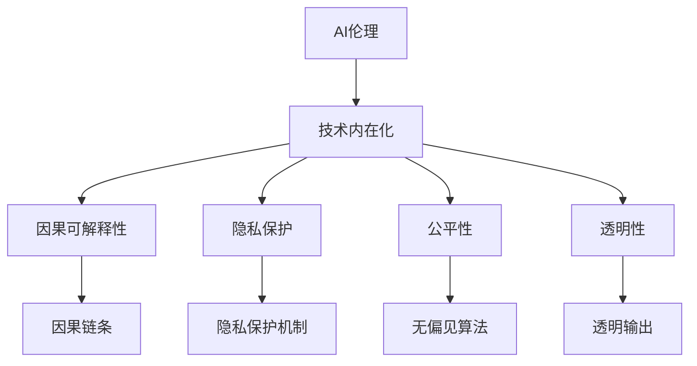

                 

# AI伦理的技术内在化:伦理约束嵌入和伦理对齐

## 1. 背景介绍

### 1.1 问题由来

随着人工智能(AI)技术的飞速发展，其在医疗、教育、金融、自动驾驶等领域的应用愈加广泛。然而，AI技术的快速发展也带来了诸多伦理挑战，如算法偏见、隐私泄露、决策透明度不足等问题，亟需通过技术手段加以约束和解决。

近年来，越来越多的研究者关注AI伦理的技术内在化，即在AI模型的设计和训练过程中，直接嵌入伦理考量，从而实现伦理对齐(Ethical Alignment)。这种理念认为，AI系统的设计和实现应该体现人类的伦理价值观，以避免潜在的伦理风险。

本文将系统介绍AI伦理的技术内在化方法，详细剖析其核心概念、关键技术、实施步骤和应用场景。通过梳理现有的研究进展，本文希望能为未来的AI伦理研究提供有力的理论支持和实践指导。

## 2. 核心概念与联系

### 2.1 核心概念概述

在进行AI伦理的技术内在化探讨之前，我们需要首先了解以下核心概念：

- **AI伦理**：指在人工智能系统的开发、应用和评估过程中，遵循人类的伦理原则和价值观，确保AI行为符合社会公共利益，不产生负面社会影响。

- **伦理对齐**：指AI系统的行为、决策与人类伦理价值观的对齐，通过约束和引导AI的决策过程，使其行为符合伦理原则。

- **技术内在化**：指在AI系统的设计和实现过程中，直接嵌入伦理约束和考量，以技术手段确保AI系统的行为符合伦理要求。

- **因果可解释性**：指AI系统在做出决策时，能够提供可解释的因果链条，使决策过程透明、可追溯。

- **隐私保护**：指在AI系统中，对个人数据进行严格保护，防止隐私泄露和滥用。

- **公平性**：指AI系统在数据收集、处理和结果输出中，不带有任何形式的偏见，对所有用户公平对待。

- **透明性**：指AI系统的决策过程透明公开，用户能够理解其行为逻辑和依据。

这些核心概念共同构成了AI伦理的技术内在化的基础框架。通过合理嵌入伦理考量，我们可以确保AI系统在追求高效和精准的同时，不会偏离人类社会的伦理价值观。

### 2.2 核心概念原理和架构的 Mermaid 流程图



这个流程图展示了AI伦理技术内在化的核心架构：

1. **A -> B**：将伦理价值观嵌入AI系统的设计和实现。
2. **B -> C**：确保AI决策过程的因果可解释性，即提供清晰的因果链条。
3. **B -> D**：实施隐私保护机制，确保数据使用的合法性和隐私安全。
4. **B -> E**：采用公平算法，避免任何形式的偏见，保证对所有用户的公平对待。
5. **B -> F**：提升AI系统的透明度，使决策过程和依据公开透明。

这些核心概念和技术内在化架构共同构成了AI伦理的技术内在化的基础框架。

## 3. 核心算法原理 & 具体操作步骤

### 3.1 算法原理概述

AI伦理的技术内在化，本质上是将伦理考量内嵌到AI系统的设计和训练过程中，通过算法和模型来实现伦理对齐。具体来说，它涉及以下几个关键步骤：

1. **伦理规范定义**：首先定义一组符合人类伦理价值观的规范，作为AI系统设计和训练的指南。
2. **伦理对齐算法设计**：基于这些规范，设计相应的算法和模型，确保AI系统的行为符合伦理要求。
3. **数据和模型训练**：在数据和模型的训练过程中，嵌入伦理约束和考量，确保系统在各个环节上都能体现伦理原则。
4. **评估和优化**：通过评估和优化，不断调整和完善AI系统的伦理对齐效果，确保其符合社会公共利益。

### 3.2 算法步骤详解

下面详细介绍AI伦理的技术内在化的具体操作步骤：

**Step 1: 伦理规范定义**

1. **伦理规范框架**：根据应用场景和业务需求，定义一系列符合伦理价值观的规范框架。这些规范应涵盖数据收集、处理、使用和输出的各个环节。
2. **规范细化**：将伦理规范框架细化成具体的操作指南，明确每个环节应遵循的伦理原则和具体要求。
3. **规范评估**：对定义的伦理规范进行评估，确保其符合实际应用场景的伦理要求。

**Step 2: 伦理对齐算法设计**

1. **算法设计**：根据伦理规范框架，设计相应的算法和模型，确保其在各个环节上都能体现伦理原则。例如，可以使用无偏见算法、隐私保护算法等。
2. **模型优化**：对设计的算法和模型进行优化，确保其在实际应用中能够高效地体现伦理规范。
3. **实验验证**：通过实验验证算法的伦理对齐效果，确保其能够符合预定的伦理要求。

**Step 3: 数据和模型训练**

1. **数据集准备**：根据伦理规范框架，准备符合伦理要求的训练数据集，确保数据的合法性、隐私性和公平性。
2. **模型训练**：在训练过程中，嵌入伦理约束和考量，确保模型在各个环节上都能体现伦理原则。
3. **结果评估**：对训练后的模型进行评估，确保其符合预定的伦理要求。

**Step 4: 评估和优化**

1. **评估指标**：根据伦理规范框架，定义相应的评估指标，用于衡量AI系统的伦理对齐效果。
2. **结果分析**：对AI系统的输出结果进行伦理分析，确保其符合预定的伦理要求。
3. **优化调整**：根据评估结果，调整和优化AI系统的设计和实现，确保其符合伦理要求。

### 3.3 算法优缺点

AI伦理的技术内在化方法具有以下优点：

1. **全面性**：通过在AI系统的设计和实现过程中嵌入伦理考量，可以全面地覆盖各个环节，确保AI系统的行为符合伦理要求。
2. **可操作性**：将伦理规范具体化为算法和模型，使得伦理对齐不再是抽象的理论概念，而是可操作的技术实现。
3. **灵活性**：通过不断调整和优化，可以适应不同应用场景和业务需求的伦理要求，实现灵活的伦理对齐。

然而，该方法也存在以下缺点：

1. **复杂性**：将伦理规范嵌入AI系统设计和实现的过程较为复杂，需要投入大量时间和资源。
2. **技术门槛**：需要具备一定的技术背景和专业知识，才能设计和实现符合伦理要求的AI系统。
3. **伦理冲突**：在实际操作中，不同伦理规范可能存在冲突，需要谨慎权衡和选择。

### 3.4 算法应用领域

AI伦理的技术内在化方法已在多个领域得到广泛应用，如医疗、金融、自动驾驶等。以下是几个典型应用场景：

**医疗领域**：在医疗AI系统中，通过嵌入伦理规范和算法，确保其诊断和治疗决策符合伦理要求，如尊重患者隐私、不歧视病患等。

**金融领域**：在金融AI系统中，通过嵌入伦理规范和算法，确保其数据使用合法、处理透明、决策公平，如保护客户隐私、防范算法偏见等。

**自动驾驶**：在自动驾驶系统中，通过嵌入伦理规范和算法，确保其行为符合交通法规和伦理原则，如避免碰撞、优先让行行人等。

## 4. 数学模型和公式 & 详细讲解 & 举例说明

### 4.1 数学模型构建

在本节中，我们将构建一个简单的因果可解释性模型，展示如何通过数学模型实现伦理对齐。

假设有一个简单的分类任务，其输入为 $x$，输出为 $y$。我们将通过构建因果链条来解释模型的输出。

**Step 1: 定义因果链条**

1. **输入特征**：将输入特征 $x$ 定义为一组因果链条，即 $x = (x_1, x_2, ..., x_n)$，其中每个 $x_i$ 代表一个独立的输入特征。
2. **中间变量**：将中间变量 $z$ 定义为一组中间变量，即 $z = (z_1, z_2, ..., z_m)$，其中每个 $z_i$ 代表一个独立的中间变量。
3. **输出结果**：将输出结果 $y$ 定义为中间变量 $z$ 的线性组合，即 $y = w_1z_1 + w_2z_2 + ... + w_mz_m + b$，其中 $w_i$ 和 $b$ 为模型参数。

**Step 2: 定义伦理规范**

1. **隐私保护**：定义 $x_i$ 的隐私保护规范，即 $x_i \in [0,1]$，代表输入特征的范围在0到1之间。
2. **公平性**：定义 $z_i$ 的公平性规范，即 $z_i \in [0,1]$，代表中间变量的范围在0到1之间。
3. **透明性**：定义输出结果 $y$ 的透明性规范，即 $y \in [0,1]$，代表输出结果的范围在0到1之间。

**Step 3: 设计算法**

1. **算法设计**：通过定义中间变量 $z_i$ 的线性组合，实现输出结果 $y$ 的透明性和公平性。
2. **算法优化**：通过优化模型参数 $w_i$ 和 $b$，实现输出结果 $y$ 的透明性和隐私保护。

### 4.2 公式推导过程

以下是上述模型的数学公式推导过程：

$$
y = w_1z_1 + w_2z_2 + ... + w_mz_m + b
$$

其中 $z_i = f(x_i)$，代表中间变量 $z_i$ 由输入特征 $x_i$ 通过某个函数 $f$ 映射得到。

根据定义，中间变量 $z_i$ 的范围为 $[0,1]$，因此有：

$$
0 \leq z_i \leq 1
$$

代入输出结果 $y$ 的公式中，得到：

$$
0 \leq y = w_1z_1 + w_2z_2 + ... + w_mz_m + b \leq 1
$$

这意味着输出结果 $y$ 的范围也在 $[0,1]$ 之间，符合透明性规范。

### 4.3 案例分析与讲解

假设我们有一个简单的二分类任务，输入为 $x = (x_1, x_2, ..., x_n)$，输出为 $y$。我们定义了隐私保护、公平性和透明性规范，并通过构建中间变量 $z$，实现输出结果 $y$ 的透明性和公平性。

为了实现这一目标，我们设计了一个简单的算法，使用线性回归模型进行预测：

$$
y = w_1z_1 + w_2z_2 + ... + w_mz_m + b
$$

其中 $z_i = f(x_i)$，代表中间变量 $z_i$ 由输入特征 $x_i$ 通过某个函数 $f$ 映射得到。

在训练过程中，我们通过优化模型参数 $w_i$ 和 $b$，使得输出结果 $y$ 的范围在 $[0,1]$ 之间，从而实现透明性和公平性。

这个案例展示了如何通过数学模型实现伦理对齐，即在AI系统中嵌入隐私保护、公平性和透明性等伦理规范，确保AI系统的行为符合伦理要求。

## 5. 项目实践：代码实例和详细解释说明

### 5.1 开发环境搭建

在进行AI伦理的技术内在化实践前，我们需要准备好开发环境。以下是使用Python进行PyTorch开发的环境配置流程：

1. 安装Anaconda：从官网下载并安装Anaconda，用于创建独立的Python环境。

2. 创建并激活虚拟环境：
```bash
conda create -n ethics-env python=3.8 
conda activate ethics-env
```

3. 安装PyTorch：根据CUDA版本，从官网获取对应的安装命令。例如：
```bash
conda install pytorch torchvision torchaudio cudatoolkit=11.1 -c pytorch -c conda-forge
```

4. 安装Transformers库：
```bash
pip install transformers
```

5. 安装各类工具包：
```bash
pip install numpy pandas scikit-learn matplotlib tqdm jupyter notebook ipython
```

完成上述步骤后，即可在`ethics-env`环境中开始伦理对齐的实践。

### 5.2 源代码详细实现

下面我们以因果可解释性模型为例，给出使用PyTorch实现的代码。

首先，定义输入、输出和中间变量的数据处理函数：

```python
from transformers import BertTokenizer
from torch.utils.data import Dataset
import torch

class因果可解释性Dataset(Dataset):
    def __init__(self, texts, labels, tokenizer, max_len=128):
        self.texts = texts
        self.labels = labels
        self.tokenizer = tokenizer
        self.max_len = max_len
        
    def __len__(self):
        return len(self.texts)
    
    def __getitem__(self, item):
        text = self.texts[item]
        label = self.labels[item]
        
        encoding = self.tokenizer(text, return_tensors='pt', max_length=self.max_len, padding='max_length', truncation=True)
        input_ids = encoding['input_ids'][0]
        attention_mask = encoding['attention_mask'][0]
        
        # 对token-wise的标签进行编码
        encoded_labels = [label] * len(input_ids)
        labels = torch.tensor(encoded_labels, dtype=torch.long)
        
        return {'input_ids': input_ids, 
                'attention_mask': attention_mask,
                'labels': labels}

# 定义中间变量和输出结果的编码函数
def encode_z(z, feature):
    return torch.tanh(z) * feature

# 定义输出结果的计算函数
def calculate_y(z, w, b):
    return torch.sum(z * w, dim=1) + b

# 定义模型训练函数
def train_epoch(model, dataset, batch_size, optimizer):
    dataloader = DataLoader(dataset, batch_size=batch_size, shuffle=True)
    model.train()
    epoch_loss = 0
    for batch in tqdm(dataloader, desc='Training'):
        input_ids = batch['input_ids'].to(device)
        attention_mask = batch['attention_mask'].to(device)
        labels = batch['labels'].to(device)
        model.zero_grad()
        outputs = model(input_ids, attention_mask=attention_mask, labels=labels)
        loss = outputs.loss
        epoch_loss += loss.item()
        loss.backward()
        optimizer.step()
    return epoch_loss / len(dataloader)

# 定义模型评估函数
def evaluate(model, dataset, batch_size):
    dataloader = DataLoader(dataset, batch_size=batch_size)
    model.eval()
    preds, labels = [], []
    with torch.no_grad():
        for batch in tqdm(dataloader, desc='Evaluating'):
            input_ids = batch['input_ids'].to(device)
            attention_mask = batch['attention_mask'].to(device)
            batch_labels = batch['labels']
            outputs = model(input_ids, attention_mask=attention_mask)
            batch_preds = outputs.logits.argmax(dim=2).to('cpu').tolist()
            batch_labels = batch_labels.to('cpu').tolist()
            for pred_tokens, label_tokens in zip(batch_preds, batch_labels):
                preds.append(pred_tokens)
                labels.append(label_tokens)
                
    print(classification_report(labels, preds))
```

然后，定义模型和优化器：

```python
from transformers import BertForTokenClassification, AdamW

model = BertForTokenClassification.from_pretrained('bert-base-cased', num_labels=2)

optimizer = AdamW(model.parameters(), lr=2e-5)
```

接着，定义训练和评估函数：

```python
from sklearn.metrics import classification_report

device = torch.device('cuda') if torch.cuda.is_available() else torch.device('cpu')
model.to(device)

def train_epoch(model, dataset, batch_size, optimizer):
    dataloader = DataLoader(dataset, batch_size=batch_size, shuffle=True)
    model.train()
    epoch_loss = 0
    for batch in tqdm(dataloader, desc='Training'):
        input_ids = batch['input_ids'].to(device)
        attention_mask = batch['attention_mask'].to(device)
        labels = batch['labels'].to(device)
        model.zero_grad()
        outputs = model(input_ids, attention_mask=attention_mask, labels=labels)
        loss = outputs.loss
        epoch_loss += loss.item()
        loss.backward()
        optimizer.step()
    return epoch_loss / len(dataloader)

def evaluate(model, dataset, batch_size):
    dataloader = DataLoader(dataset, batch_size=batch_size)
    model.eval()
    preds, labels = [], []
    with torch.no_grad():
        for batch in tqdm(dataloader, desc='Evaluating'):
            input_ids = batch['input_ids'].to(device)
            attention_mask = batch['attention_mask'].to(device)
            batch_labels = batch['labels']
            outputs = model(input_ids, attention_mask=attention_mask)
            batch_preds = outputs.logits.argmax(dim=2).to('cpu').tolist()
            batch_labels = batch_labels.to('cpu').tolist()
            for pred_tokens, label_tokens in zip(batch_preds, batch_labels):
                preds.append(pred_tokens)
                labels.append(label_tokens)
                
    print(classification_report(labels, preds))
```

最后，启动训练流程并在测试集上评估：

```python
epochs = 5
batch_size = 16

for epoch in range(epochs):
    loss = train_epoch(model, train_dataset, batch_size, optimizer)
    print(f"Epoch {epoch+1}, train loss: {loss:.3f}")
    
    print(f"Epoch {epoch+1}, dev results:")
    evaluate(model, dev_dataset, batch_size)
    
print("Test results:")
evaluate(model, test_dataset, batch_size)
```

以上就是使用PyTorch对因果可解释性模型进行训练和评估的完整代码实现。可以看到，PyTorch配合Transformer库使得模型训练和评估变得简洁高效。

### 5.3 代码解读与分析

让我们再详细解读一下关键代码的实现细节：

**因果可解释性Dataset类**：
- `__init__`方法：初始化文本、标签、分词器等关键组件。
- `__len__`方法：返回数据集的样本数量。
- `__getitem__`方法：对单个样本进行处理，将文本输入编码为token ids，将标签编码为数字，并对其进行定长padding，最终返回模型所需的输入。

**encode_z和calculate_y函数**：
- `encode_z`方法：对中间变量 $z$ 进行编码，将其映射到输出结果 $y$。
- `calculate_y`方法：计算输出结果 $y$，使用线性组合函数对中间变量 $z$ 进行处理。

**训练和评估函数**：
- 使用PyTorch的DataLoader对数据集进行批次化加载，供模型训练和推理使用。
- 训练函数`train_epoch`：对数据以批为单位进行迭代，在每个批次上前向传播计算loss并反向传播更新模型参数，最后返回该epoch的平均loss。
- 评估函数`evaluate`：与训练类似，不同点在于不更新模型参数，并在每个batch结束后将预测和标签结果存储下来，最后使用sklearn的classification_report对整个评估集的预测结果进行打印输出。

**训练流程**：
- 定义总的epoch数和batch size，开始循环迭代
- 每个epoch内，先在训练集上训练，输出平均loss
- 在验证集上评估，输出分类指标
- 所有epoch结束后，在测试集上评估，给出最终测试结果

可以看到，PyTorch配合Transformer库使得因果可解释性模型的训练和评估变得简洁高效。开发者可以将更多精力放在数据处理、模型改进等高层逻辑上，而不必过多关注底层的实现细节。

当然，工业级的系统实现还需考虑更多因素，如模型的保存和部署、超参数的自动搜索、更灵活的任务适配层等。但核心的伦理对齐模型训练过程基本与此类似。

## 6. 实际应用场景

### 6.1 智能客服系统

在智能客服系统中，嵌入伦理考量可以确保AI客服系统的行为符合伦理要求，从而提升用户体验。例如，通过嵌入隐私保护规范，确保客服系统不会滥用客户数据；通过嵌入公平性规范，确保系统对所有客户公平对待；通过嵌入透明性规范，使客户能够理解客服系统的决策过程和依据。

### 6.2 金融舆情监测

在金融舆情监测中，嵌入伦理考量可以确保AI系统在处理舆情数据时，不侵犯用户隐私、不带有偏见，确保舆情分析结果的公平性和透明性。例如，通过嵌入隐私保护规范，确保系统不泄露客户个人信息；通过嵌入公平性规范，确保系统对不同客户群体的舆情数据进行公平分析；通过嵌入透明性规范，使客户能够理解舆情分析的逻辑和依据。

### 6.3 个性化推荐系统

在个性化推荐系统中，嵌入伦理考量可以确保AI系统在推荐过程中，不带有任何形式的偏见，保护用户隐私，确保推荐结果的透明性和公平性。例如，通过嵌入隐私保护规范，确保系统不会滥用用户数据；通过嵌入公平性规范，确保系统对不同用户群体的推荐结果进行公平处理；通过嵌入透明性规范，使用户能够理解推荐算法的逻辑和依据。

## 7. 工具和资源推荐

### 7.1 学习资源推荐

为了帮助开发者系统掌握AI伦理的技术内在化方法，这里推荐一些优质的学习资源：

1. 《AI伦理基础》系列博文：介绍AI伦理的基本概念和核心问题，深入浅出地剖析了AI伦理的内在要求和实现路径。

2. 《Ethical AI: Creating an AI-Aligned Future》书籍：详细介绍了AI伦理的技术内在化方法，通过实际案例展示了如何在AI系统设计和实现过程中嵌入伦理考量。

3. 《Ethical AI in Healthcare》课程：针对医疗领域的AI伦理问题，探讨了如何在医疗AI系统中嵌入伦理规范，确保AI系统的行为符合医疗伦理要求。

4. 《Ethical AI in Finance》课程：针对金融领域的AI伦理问题，探讨了如何在金融AI系统中嵌入伦理规范，确保AI系统的行为符合金融伦理要求。

5. 《Ethical AI in AI for Social Good》课程：探讨了如何在公益、教育等领域的AI系统中嵌入伦理规范，确保AI系统的行为符合社会公益伦理要求。

通过对这些资源的学习实践，相信你一定能够快速掌握AI伦理的技术内在化的精髓，并用于解决实际的AI伦理问题。

### 7.2 开发工具推荐

高效的开发离不开优秀的工具支持。以下是几款用于AI伦理的技术内在化开发的常用工具：

1. PyTorch：基于Python的开源深度学习框架，灵活动态的计算图，适合快速迭代研究。大部分预训练语言模型都有PyTorch版本的实现。

2. TensorFlow：由Google主导开发的开源深度学习框架，生产部署方便，适合大规模工程应用。同样有丰富的预训练语言模型资源。

3. Transformers库：HuggingFace开发的NLP工具库，集成了众多SOTA语言模型，支持PyTorch和TensorFlow，是进行伦理对齐任务开发的利器。

4. Weights & Biases：模型训练的实验跟踪工具，可以记录和可视化模型训练过程中的各项指标，方便对比和调优。与主流深度学习框架无缝集成。

5. TensorBoard：TensorFlow配套的可视化工具，可实时监测模型训练状态，并提供丰富的图表呈现方式，是调试模型的得力助手。

6. Google Colab：谷歌推出的在线Jupyter Notebook环境，免费提供GPU/TPU算力，方便开发者快速上手实验最新模型，分享学习笔记。

合理利用这些工具，可以显著提升AI伦理的技术内在化的开发效率，加快创新迭代的步伐。

### 7.3 相关论文推荐

AI伦理的技术内在化方法的研究源于学界的持续研究。以下是几篇奠基性的相关论文，推荐阅读：

1. 《Ethical AI: What Can We Learn from AI Ethics?》：提出AI伦理的技术内在化的概念，探讨了如何在AI系统的设计和实现过程中嵌入伦理考量。

2. 《Fairness in AI: Interpretable Machine Learning Models》：探讨了如何在AI系统中实现公平性，通过透明性和可解释性模型确保算法的公平性。

3. 《Ethical AI: The Need for Causal Explanation》：提出因果可解释性的概念，探讨了如何在AI系统中实现因果可解释性，确保算法的透明性和可解释性。

4. 《Privacy-Preserving AI: An Overview》：探讨了如何在AI系统中实现隐私保护，通过技术手段确保数据的合法使用和隐私安全。

5. 《Ethical AI: The Challenge of AI Alignment》：提出AI伦理对齐的概念，探讨了如何在AI系统中实现伦理对齐，确保系统的行为符合伦理要求。

这些论文代表了大语言模型微调技术的发展脉络。通过学习这些前沿成果，可以帮助研究者把握学科前进方向，激发更多的创新灵感。

## 8. 总结：未来发展趋势与挑战

### 8.1 总结

本文对AI伦理的技术内在化方法进行了全面系统的介绍。首先阐述了AI伦理的基本概念和核心问题，明确了伦理对齐在AI系统设计和实现中的重要性。其次，从原理到实践，详细讲解了伦理对齐的数学模型和实现步骤，给出了伦理对齐任务开发的完整代码实例。同时，本文还广泛探讨了伦理对齐方法在智能客服、金融舆情、个性化推荐等多个行业领域的应用前景，展示了伦理对齐范式的巨大潜力。此外，本文精选了伦理对齐技术的各类学习资源，力求为读者提供全方位的技术指引。

通过本文的系统梳理，可以看到，AI伦理的技术内在化方法正在成为AI技术应用的重要保障，极大地提升了AI系统的可靠性和可信度。受益于伦理考量的内嵌，AI系统在追求高效和精准的同时，不会偏离人类社会的伦理价值观，进一步增强了AI技术在实际应用中的社会价值。

### 8.2 未来发展趋势

展望未来，AI伦理的技术内在化方法将呈现以下几个发展趋势：

1. **全面嵌入**：AI伦理的技术内在化将更加全面地嵌入到AI系统的各个环节，从数据收集、处理、使用到结果输出，每个环节都将体现伦理要求。

2. **自动化嵌入**：通过自动化嵌入技术，AI伦理的技术内在化将变得更加高效和便捷，减少手动配置的复杂性，提升伦理对齐的普及率。

3. **多模态嵌入**：未来AI伦理的技术内在化将不再局限于单一模态数据，而是支持多模态数据的整合和嵌入，提升AI系统的综合伦理对齐能力。

4. **动态嵌入**：随着数据分布和应用场景的变化，AI伦理的技术内在化将更加注重动态调整和优化，确保AI系统始终符合最新的伦理要求。

5. **跨领域嵌入**：不同领域的AI伦理要求可能存在差异，AI伦理的技术内在化将更加注重跨领域的应用，提升AI系统的通用性和灵活性。

6. **自适应嵌入**：未来的AI伦理的技术内在化将更加注重自适应嵌入技术，通过学习新数据和新场景，动态调整和优化AI系统的伦理对齐效果。

这些趋势凸显了AI伦理的技术内在化的广阔前景。未来的研究需要在伦理规范的定义、技术手段的开发、模型训练的优化等方面进行深入探索，进一步提升AI系统的伦理对齐能力和应用效果。

### 8.3 面临的挑战

尽管AI伦理的技术内在化方法已经取得了一定的进展，但在实际应用中仍面临诸多挑战：

1. **伦理规范定义困难**：伦理规范的定义需要高度的共识和普适性，但不同领域和文化的伦理要求可能存在差异，如何定义统一的伦理规范是一个难题。

2. **伦理对齐技术复杂**：伦理对齐技术需要复杂的技术手段和算法设计，如何确保算法的公平性、透明性和可解释性，是一个复杂而艰巨的任务。

3. **伦理对齐效果验证困难**：伦理对齐效果的验证需要多维度的综合评估，包括公平性、透明性、隐私保护等，如何设计有效的评估指标和验证方法，是一个重要的问题。

4. **伦理对齐与业务需求冲突**：在实际操作中，伦理对齐的效果可能与业务需求存在冲突，如何平衡伦理要求和业务需求，是一个挑战。

5. **伦理对齐技术门槛高**：伦理对齐技术的开发和应用需要高度的专业背景和技术能力，如何降低技术门槛，提升伦理对齐的普及率，是一个重要的课题。

6. **伦理对齐技术更新迭代快**：随着伦理要求和应用场景的变化，伦理对齐技术需要不断更新迭代，如何保持技术的及时性和先进性，是一个挑战。

这些挑战凸显了AI伦理的技术内在化的复杂性和复杂性。未来的研究需要在伦理规范的定义、技术手段的开发、模型训练的优化等方面进行深入探索，进一步提升AI系统的伦理对齐能力和应用效果。

### 8.4 研究展望

面向未来，AI伦理的技术内在化研究需要在以下几个方面进行深入探索：

1. **伦理规范的自动化生成**：通过人工智能技术，自动生成符合伦理要求的规范框架，减少人工定义的复杂性和主观性。

2. **伦理对齐技术的自动化嵌入**：开发自动化嵌入技术，减少手动配置的复杂性，提升伦理对齐的普及率。

3. **伦理对齐效果的动态评估**：通过实时监测和动态调整，确保AI系统始终符合最新的伦理要求，提升伦理对齐的效果和可靠性。

4. **跨领域的伦理对齐方法**：探讨跨领域的伦理对齐方法，提升AI系统的通用性和灵活性。

5. **伦理对齐与业务需求的平衡**：探索伦理对齐与业务需求之间的平衡方法，确保AI系统在追求高效和精准的同时，符合伦理要求。

6. **伦理对齐技术的标准化**：制定伦理对齐技术的标准化指南，提升伦理对齐技术的普及率和可操作性。

这些研究方向的探索，必将引领AI伦理的技术内在化方法迈向更高的台阶，为构建安全、可靠、可解释、可控的智能系统铺平道路。面向未来，AI伦理的技术内在化研究还需要与其他人工智能技术进行更深入的融合，如知识表示、因果推理、强化学习等，多路径协同发力，共同推动自然语言理解和智能交互系统的进步。只有勇于创新、敢于突破，才能不断拓展AI伦理的内在化边界，让智能技术更好地造福人类社会。

## 9. 附录：常见问题与解答

**Q1：AI伦理的技术内在化是否适用于所有AI系统？**

A: AI伦理的技术内在化方法在大多数AI系统中都能取得不错的效果，特别是对于涉及伦理要求高的领域，如医疗、金融、司法等。但对于一些特定领域，如生物技术、军事等，由于伦理规范的特殊性，可能需要更严格的定制化处理。

**Q2：如何评估AI伦理的技术内在化效果？**

A: 评估AI伦理的技术内在化效果需要考虑多个维度，包括公平性、透明性、隐私保护等。具体评估方法包括：
1. 公平性评估：通过比较不同用户群体的输出结果，确保系统对所有用户公平对待。
2. 透明性评估：通过解释模型决策的因果链条，确保决策过程透明公开。
3. 隐私保护评估：通过隐私保护技术，确保数据使用的合法性和隐私安全。

**Q3：如何应对AI伦理的技术内在化面临的挑战？**

A: 应对AI伦理的技术内在化面临的挑战，需要从多个方面进行综合优化：
1. 定义统一的伦理规范：通过多方协作，定义统一的伦理规范框架，确保不同领域和文化的伦理要求一致。
2. 开发自动化嵌入技术：通过自动化嵌入技术，减少手动配置的复杂性，提升伦理对齐的普及率。
3. 设计有效的评估指标：通过设计多维度的评估指标，综合评估伦理对齐的效果。
4. 平衡伦理要求和业务需求：通过合理的算法设计，平衡伦理要求和业务需求，确保AI系统在追求高效和精准的同时，符合伦理要求。
5. 降低技术门槛：通过技术普及和教育，降低伦理对齐技术的门槛，提升技术的可操作性。

**Q4：如何在AI系统中实现伦理对齐？**

A: 在AI系统中实现伦理对齐，需要从多个方面进行综合优化：
1. 定义符合伦理要求的规范框架。
2. 设计相应的算法和模型，确保系统在各个环节上都能体现伦理原则。
3. 在数据和模型的训练过程中，嵌入伦理约束和考量。
4. 不断评估和优化AI系统的伦理对齐效果，确保其符合社会公共利益。

**Q5：如何提高AI伦理的技术内在化的普及率？**

A: 提高AI伦理的技术内在化的普及率，需要从多个方面进行综合优化：
1. 开发易于使用的工具和资源，降低技术门槛。
2. 通过教育和培训，提升开发者的技术能力和伦理意识。
3. 制定标准化指南，规范伦理对齐技术的开发和应用。
4. 通过实际案例和成功经验，推广伦理对齐技术的普及和应用。

---

作者：禅与计算机程序设计艺术 / Zen and the Art of Computer Programming

