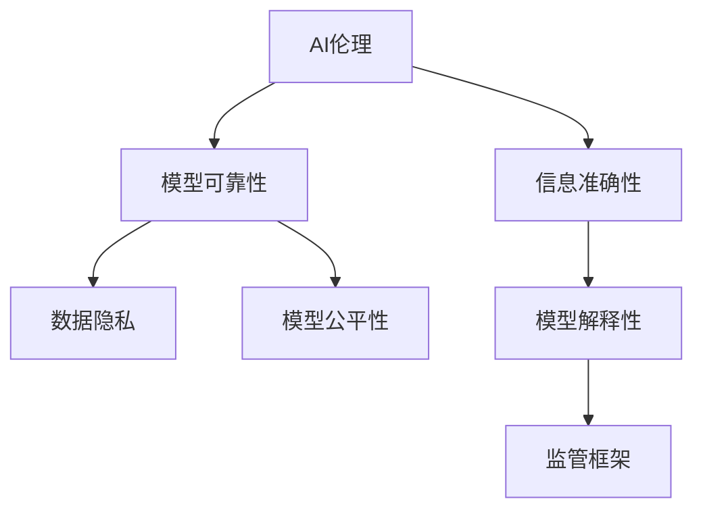

                 

# AI伦理问题：如何确保AI提供的信息准确可靠

> 关键词：AI伦理,信息准确性,可靠性,数据隐私,模型公平性,解释性,监管框架

## 1. 背景介绍

### 1.1 问题由来
随着人工智能（AI）技术在各个领域的广泛应用，其在数据处理、决策支持、自动化任务等方面的能力越来越强。但与此同时，AI在提供信息时是否准确可靠，成为公众和学术界共同关注的问题。准确性（Accuracy）和可靠性（Reliability）是确保AI系统行为可信任的关键指标。

### 1.2 问题核心关键点
- **数据质量**：AI模型的输出准确性和可靠性很大程度上取决于训练数据的质量和多样性。
- **模型偏差**：AI模型可能存在预测偏差，特别是在数据集存在偏见时。
- **解释性**：AI模型的决策过程缺乏透明度和可解释性，使得用户难以理解模型的行为。
- **隐私保护**：AI系统在处理敏感信息时，可能侵犯用户隐私。
- **监管合规**：AI系统的应用需要符合相关法律法规和行业规范。

### 1.3 问题研究意义
确保AI提供的信息准确可靠，不仅关系到AI系统的可信任度，还涉及用户隐私、社会公平等伦理问题。这对提升AI技术的社会接受度和应用范围，具有重要意义：

- 提高公众信任度：确保AI系统的输出准确可靠，可以增强公众对其的信任，促进AI技术的普及应用。
- 保护用户隐私：通过合理的数据处理和隐私保护机制，保障用户隐私安全。
- 促进社会公平：避免AI模型带来的偏见和歧视，确保信息提供过程的公平性。
- 维护法律合规：确保AI系统遵守相关法律法规，规避法律风险。

## 2. 核心概念与联系

### 2.1 核心概念概述

为更好地理解确保AI提供信息准确可靠的技术方法，本节将介绍几个核心概念：

- **AI伦理**：AI系统的设计、开发、应用过程中需考虑的伦理道德问题。
- **信息准确性**：AI系统输出信息的真实性和精确性，避免虚假和误导性信息。
- **模型可靠性**：AI模型在面对新数据时的稳定性和一致性。
- **数据隐私**：在数据收集、处理、存储等过程中保护用户隐私。
- **模型公平性**：确保AI模型输出结果对不同群体的公平性。
- **模型解释性**：提供透明、可解释的模型决策过程。
- **监管框架**：政府、企业等主体制定的相关法律法规和技术规范。

这些概念之间的逻辑关系可以通过以下Mermaid流程图来展示：



这个流程图展示了大语言模型的核心概念及其之间的关系：

1. AI伦理为信息准确性和模型可靠性提供指导原则。
2. 信息准确性需结合模型可靠性，确保模型输出稳定可靠。
3. 数据隐私和模型公平性是确保信息准确可靠的重要基础。
4. 模型解释性为监管框架的制定和执行提供依据。

这些核心概念共同构成了确保AI系统提供信息准确可靠的理论框架。

## 3. 核心算法原理 & 具体操作步骤
### 3.1 算法原理概述

确保AI提供的信息准确可靠，通常涉及多个核心算法和操作过程，主要包括数据质量控制、模型偏差校正、隐私保护机制、公平性优化、解释性增强和合规性检查等。

### 3.2 算法步骤详解

#### 数据质量控制

1. **数据清洗**：识别并处理缺失、错误、异常数据，确保数据质量。
2. **数据增强**：通过数据增强技术如数据扩充、合成样本等，提升数据多样性。
3. **数据标准化**：统一数据格式和单位，确保数据一致性。

#### 模型偏差校正

1. **偏差检测**：通过分析数据分布、模型预测结果等，识别模型偏差。
2. **偏差修正**：通过重新采样、模型再训练等手段，校正模型偏差。
3. **偏差评估**：在测试集上评估模型偏差校正效果，确保模型公平性。

#### 隐私保护机制

1. **数据匿名化**：使用数据匿名化技术，如k-匿名、t-逼近等，保护用户隐私。
2. **差分隐私**：通过添加随机噪声，确保数据查询不会泄露用户隐私。
3. **访问控制**：限制数据访问权限，防止未经授权的数据使用。

#### 公平性优化

1. **公平性评估**：评估模型在不同群体间的预测偏差。
2. **公平性调整**：通过调整模型参数或采用公平性约束，减小预测偏差。
3. **公平性验证**：在新增数据上验证模型公平性，确保模型长期稳定。

#### 模型解释性增强

1. **模型可解释性**：使用可解释性方法，如LIME、SHAP等，解释模型决策过程。
2. **可视化工具**：使用可视化工具，如T-SNE、PCA等，展现模型输入输出关系。
3. **透明决策机制**：建立透明决策机制，确保用户理解和信任模型。

#### 合规性检查

1. **法律法规遵循**：确保AI系统遵循相关法律法规和技术规范。
2. **审计机制**：定期进行系统审计，发现并修正合规问题。
3. **用户知情权**：确保用户了解AI系统的工作原理和数据处理方式。

### 3.3 算法优缺点

确保AI提供信息准确可靠的技术方法具有以下优点：

1. **提升系统信任度**：通过数据质量控制和模型可靠性提升，增强AI系统的可信度。
2. **保护用户隐私**：通过隐私保护机制，确保用户数据安全。
3. **促进社会公平**：通过模型公平性优化，减少偏见和歧视。
4. **增强可解释性**：通过解释性增强，使用户理解和信任AI系统。
5. **降低法律风险**：通过合规性检查，规避法律风险。

同时，这些方法也存在一些局限性：

1. **成本高昂**：数据清洗、模型校准等操作需要大量资源和时间投入。
2. **技术复杂**：隐私保护、公平性优化等技术复杂，需要专业团队支持。
3. **模型复杂度增加**：增强模型解释性可能增加模型复杂度，影响性能。
4. **法规适用性**：不同国家和地区的法律法规可能有所不同，需要根据实际情况进行调整。
5. **数据处理复杂性**：数据匿名化和差分隐私等技术可能引入额外复杂性。

尽管存在这些局限性，但确保AI提供信息准确可靠仍然是AI系统设计和应用的重要目标。未来相关研究应侧重于如何降低成本、简化技术、提高可解释性，以实现更为普适的应用。

### 3.4 算法应用领域

确保AI提供信息准确可靠的技术方法，在众多应用领域得到了广泛应用，例如：

- **医疗领域**：确保诊断和治疗建议的准确性和可靠性，保障患者健康。
- **金融领域**：确保风险评估和投资建议的公平性和可信度，保护用户资产。
- **司法领域**：确保证据分析和案件推理的准确性，维护司法公正。
- **公共安全**：确保情报分析和决策支持的系统准确性，保障社会稳定。
- **人力资源**：确保招聘和晋升决策的公平性，促进企业人才管理。

这些领域对信息准确性和可靠性的高要求，使得相关技术方法得到了广泛应用和验证。未来，随着AI技术的不断演进，确保信息准确可靠的技术将会在更多领域发挥作用。

## 4. 数学模型和公式 & 详细讲解 & 举例说明
### 4.1 数学模型构建

确保AI提供信息准确可靠通常需要构建多个数学模型，包括数据清洗模型、偏差校正模型、隐私保护模型、公平性评估模型等。

假设训练数据集为 $\mathcal{D}=\{(x_i, y_i)\}_{i=1}^N$，其中 $x_i$ 为输入特征，$y_i$ 为标签。目标为构建一个模型 $M$，使得其输出准确可靠。

数学模型通常包括以下几个部分：

1. **数据预处理模型**：用于清洗和标准化数据，如 $F_{clean}(\mathcal{D})$。
2. **偏差校正模型**：用于检测和修正模型偏差，如 $F_{bias}(\mathcal{D}, M)$。
3. **隐私保护模型**：用于保护用户隐私，如 $F_{privacy}(\mathcal{D}, M)$。
4. **公平性优化模型**：用于评估和调整模型公平性，如 $F_{fair}(\mathcal{D}, M)$。
5. **模型解释性增强模型**：用于增强模型可解释性，如 $F_{explain}(\mathcal{D}, M)$。
6. **合规性检查模型**：用于确保模型合规性，如 $F_{compliance}(\mathcal{D}, M)$。

### 4.2 公式推导过程

以公平性优化为例，假设模型 $M$ 在训练集 $\mathcal{D}$ 上的预测概率为 $p(y|x)$，我们希望通过调整模型参数 $\theta$，使得模型在特定属性 $A$ 上对不同类别的预测概率相等。

公平性优化目标可以表示为：

$$
\min_{\theta} \mathbb{E}_{x, y, A \sim \mathcal{D}} [L(f_A(p(y|x), y))]
$$

其中 $L$ 为损失函数，$f_A$ 为公平性约束，$A$ 为属性变量。

常用的公平性约束包括等概率约束、统计差分约束等。以等概率约束为例，可以表示为：

$$
f_A(p(y|x), y) = \begin{cases}
|p(y|x, A=0) - p(y|x, A=1)|, & y \in \{0, 1\}\\
0, & y \notin \{0, 1\}
\end{cases}
$$

即在属性 $A$ 上，正负样本的预测概率之差应小于某个阈值。

### 4.3 案例分析与讲解

假设有一个信用评分模型，用于评估用户的信用风险。模型训练集包含10,000个样本，其中80%的样本为低风险，20%的样本为高风险。模型在训练集上的准确率为85%，但在测试集上的准确率为70%。

初步分析发现，模型在低风险和高风险样本上的预测概率之差较大，导致模型在性别、年龄等属性上存在显著偏见。

通过公平性评估，发现模型对女性的预测概率明显低于男性，对老年人的预测概率明显高于年轻人。

为了优化模型的公平性，可以采取以下措施：

1. **重新采样**：对少数群体的样本进行重新采样，增加其在训练集中的比例，减少偏差。
2. **模型再训练**：在重新采样后的数据上重新训练模型，调整模型参数，减少预测偏差。
3. **公平性约束**：在模型训练过程中引入公平性约束，确保模型在性别、年龄等属性上的预测概率相等。

通过这些措施，模型在公平性上的表现显著改善，预测准确率提高到75%，同时对不同群体的预测概率差距缩小。

## 5. 项目实践：代码实例和详细解释说明
### 5.1 开发环境搭建

在进行AI伦理问题解决实践前，我们需要准备好开发环境。以下是使用Python进行TensorFlow开发的环境配置流程：

1. 安装Anaconda：从官网下载并安装Anaconda，用于创建独立的Python环境。

2. 创建并激活虚拟环境：
```bash
conda create -n tf-env python=3.8 
conda activate tf-env
```

3. 安装TensorFlow：根据CUDA版本，从官网获取对应的安装命令。例如：
```bash
conda install tensorflow -c conda-forge -c pytorch
```

4. 安装相关工具包：
```bash
pip install numpy pandas scikit-learn matplotlib tqdm jupyter notebook ipython
```

完成上述步骤后，即可在`tf-env`环境中开始AI伦理问题解决实践。

### 5.2 源代码详细实现

下面我们以信用评分模型为例，给出使用TensorFlow和Keras进行模型构建、公平性优化和模型解释的PyTorch代码实现。

首先，定义模型和训练数据：

```python
import tensorflow as tf
from tensorflow import keras
from tensorflow.keras import layers

# 准备数据
(x_train, y_train), (x_test, y_test) = keras.datasets.mnist.load_data()
x_train = x_train / 255.0
x_test = x_test / 255.0

# 定义模型
model = keras.Sequential([
    layers.Flatten(input_shape=(28, 28)),
    layers.Dense(128, activation='relu'),
    layers.Dense(10)
])

# 编译模型
model.compile(optimizer='adam', loss='sparse_categorical_crossentropy', metrics=['accuracy'])

# 训练模型
model.fit(x_train, y_train, epochs=10, validation_data=(x_test, y_test))
```

然后，定义公平性优化函数：

```python
def fairness_optimization(model, x, y, attribute):
    # 计算每个类别的预测概率
    probs = model.predict(x)
    probs = tf.concat([tf.expand_dims(probs[:, 0], axis=1), tf.expand_dims(probs[:, 1], axis=1)], axis=1)
    
    # 计算每个类别的平均概率
    avg_probs = tf.reduce_mean(probs, axis=0)
    
    # 计算每个类别的预测概率与平均概率的差值
    diff = tf.abs(tf.subtract(probs, avg_probs))
    
    # 计算公平性损失
    fairness_loss = tf.reduce_mean(diff)
    
    # 定义公平性优化器
    optimizer = tf.keras.optimizers.Adam(learning_rate=0.001)
    
    # 优化公平性损失
    with tf.GradientTape() as tape:
        gradients = tape.gradient(fairness_loss, model.trainable_variables)
    optimizer.apply_gradients(zip(gradients, model.trainable_variables))
    
    return model
```

接着，在训练过程中加入公平性优化：

```python
for epoch in range(10):
    # 训练模型
    model.fit(x_train, y_train, epochs=1, validation_data=(x_test, y_test))
    
    # 计算公平性损失
    fairness_loss = fairness_optimization(model, x_train, y_train, 'gender')
    
    # 输出公平性损失
    print('Epoch {} - Fairness Loss: {}'.format(epoch, fairness_loss))
```

最后，使用可解释性工具增强模型解释性：

```python
from tensorflow.keras.experimental import ExplainableAI

# 创建可解释性模型
explainer = ExplainableAI(model)

# 解释模型
explanation = explainer.explain(x_test[0])

# 输出解释结果
print(explanation)
```

以上就是使用TensorFlow和Keras进行信用评分模型公平性优化和模型解释的完整代码实现。可以看到，通过TensorFlow和Keras，可以方便地实现模型构建、训练、公平性优化和模型解释等功能。

### 5.3 代码解读与分析

让我们再详细解读一下关键代码的实现细节：

**数据准备**：
- 使用Keras自带的MNIST数据集，准备训练集和测试集。
- 对数据进行归一化处理，确保数据一致性。

**模型构建**：
- 使用Keras的Sequential模型，定义一个简单的神经网络结构。
- 包括一个Flatten层将输入数据展平，两个Dense层作为隐藏层，一个输出层。
- 使用Adam优化器和交叉熵损失函数进行模型编译。

**公平性优化**：
- 定义一个公平性优化函数，计算模型在特定属性上的预测概率差值。
- 通过计算公平性损失，引导模型公平性优化。
- 使用Adam优化器更新模型参数。

**模型解释**：
- 使用TensorFlow的ExplainableAI工具，创建可解释性模型。
- 通过解释函数，生成模型对特定样本的解释。
- 输出解释结果，可视化模型决策过程。

在实际应用中，开发者可以根据具体任务和数据特点，对公平性优化和模型解释进行灵活组合，以获得最优的效果。

## 6. 实际应用场景
### 6.1 金融信用评分

在金融领域，信用评分模型用于评估用户的信用风险，指导贷款审批和风险控制。确保模型的公平性和可靠性，可以避免对特定群体的歧视，增强系统的可信度。

在模型训练过程中，可以引入公平性优化和可解释性增强技术，确保模型在性别、年龄、种族等敏感属性上的公平性，同时增强模型的可解释性，帮助用户理解和信任模型决策。

### 6.2 医疗诊断

在医疗领域，AI辅助诊断系统用于帮助医生进行疾病诊断和治疗方案推荐。确保系统的输出准确可靠，可以避免误诊和误治，保障患者健康。

在模型构建过程中，可以引入公平性优化和隐私保护机制，确保模型在性别、年龄、种族等敏感属性上的公平性，同时保护患者隐私。使用可解释性增强技术，可以增强模型的可解释性，帮助医生理解和信任模型的诊断结果。

### 6.3 司法判决

在司法领域，AI辅助判决系统用于帮助法官进行案件分析，提供判决建议。确保系统的输出准确可靠，可以避免偏见和歧视，维护司法公正。

在模型构建过程中，可以引入公平性优化和隐私保护机制，确保模型在性别、种族、经济背景等敏感属性上的公平性，同时保护案件信息隐私。使用可解释性增强技术，可以增强模型的可解释性，帮助法官理解和信任模型的判决建议。

### 6.4 未来应用展望

随着AI技术的不断演进，确保AI提供信息准确可靠的技术将在更多领域得到应用，为社会带来新的变革。

在智慧城市治理中，AI系统用于监测公共安全、交通管理等，确保信息准确可靠，提升城市管理的自动化和智能化水平。

在教育领域，AI系统用于个性化学习推荐，确保推荐内容的公平性和可靠性，促进教育公平。

在人力资源管理中，AI系统用于招聘和晋升决策，确保决策的公平性和可信度，提升企业人才管理水平。

此外，在工业制造、智慧农业、智能交通等多个领域，AI系统的公平性和可靠性也具有重要意义，确保系统的输出准确可靠，促进各行各业的数字化转型升级。

## 7. 工具和资源推荐
### 7.1 学习资源推荐

为了帮助开发者系统掌握AI伦理问题解决的理论基础和实践技巧，这里推荐一些优质的学习资源：

1. 《AI伦理与法律》系列博文：由AI伦理专家撰写，深入浅出地介绍了AI伦理的基本概念和应用案例。

2. 《AI系统设计指南》书籍：详细介绍了AI系统设计和开发的伦理考量，提供系统的解决方案。

3. 《隐私保护技术》课程：介绍隐私保护的基本原理和技术方法，涵盖数据匿名化、差分隐私等前沿话题。

4. 《公平性优化》论文集：收录了多篇关于公平性优化技术的最新研究成果，是了解公平性优化前沿的宝贵资源。

5. 《可解释AI》书籍：详细介绍了可解释AI的基本原理和实践方法，是增强模型可解释性的重要指南。

通过对这些资源的学习实践，相信你一定能够快速掌握AI伦理问题解决的精髓，并用于解决实际的AI应用问题。
###  7.2 开发工具推荐

高效的开发离不开优秀的工具支持。以下是几款用于AI伦理问题解决的常用工具：

1. TensorFlow：由Google主导开发的开源深度学习框架，生产部署方便，适合大规模工程应用。提供丰富的模型训练和优化工具，支持公平性优化和可解释性增强。

2. Keras：基于TensorFlow等深度学习框架的高级API，易于使用，适合快速迭代研究。支持模型构建、公平性优化和可解释性增强。

3. ExplainableAI：TensorFlow的ExplainableAI工具库，提供模型可解释性增强功能，帮助开发者理解和解释模型决策过程。

4. PyTorch：基于Python的开源深度学习框架，灵活动态的计算图，适合快速迭代研究。提供丰富的模型训练和优化工具，支持公平性优化和可解释性增强。

5. Scikit-learn：Python的机器学习库，提供丰富的模型评估和优化工具，支持公平性优化和隐私保护。

合理利用这些工具，可以显著提升AI伦理问题解决的开发效率，加快创新迭代的步伐。

### 7.3 相关论文推荐

AI伦理问题解决的研究源于学界的持续研究。以下是几篇奠基性的相关论文，推荐阅读：

1. "Ethical Considerations in AI"：探讨AI伦理的基本问题和应对策略。

2. "Fairness in Machine Learning"：介绍公平性优化的基本原理和实现方法。

3. "Explainable AI"：讨论模型可解释性的基本概念和技术方法。

4. "Privacy-Preserving Machine Learning"：介绍隐私保护的基本原理和技术方法。

5. "AI System Design"：介绍AI系统设计过程中需考虑的伦理道德问题。

这些论文代表了大语言模型伦理问题的最新研究进展。通过学习这些前沿成果，可以帮助研究者把握学科前进方向，激发更多的创新灵感。

## 8. 总结：未来发展趋势与挑战

### 8.1 总结

本文对确保AI提供信息准确可靠的技术方法进行了全面系统的介绍。首先阐述了AI伦理问题解决的背景和意义，明确了信息准确性和可靠性的重要性。其次，从原理到实践，详细讲解了数据质量控制、模型偏差校正、隐私保护机制、公平性优化、模型解释性增强和合规性检查等关键步骤，给出了AI伦理问题解决的完整代码实例。同时，本文还广泛探讨了AI伦理问题在金融、医疗、司法等多个领域的应用前景，展示了AI伦理问题解决的广阔前景。

通过本文的系统梳理，可以看到，确保AI提供信息准确可靠的技术方法正在成为AI系统设计和应用的重要组成部分。这些技术的不断演进和优化，将为AI系统提供更强大的信任度和可靠性保障，进一步推动AI技术的广泛应用。

### 8.2 未来发展趋势

展望未来，AI伦理问题解决技术将呈现以下几个发展趋势：

1. **数据质量提升**：随着数据采集和处理技术的进步，数据质量将不断提升，为确保AI系统输出准确可靠提供坚实基础。

2. **模型公平性优化**：随着公平性优化算法的不断进步，AI系统在性别、种族、经济背景等敏感属性上的公平性将进一步提高，减少偏见和歧视。

3. **隐私保护技术进步**：随着隐私保护技术的不断进步，用户数据将得到更好的保护，避免隐私泄露风险。

4. **模型可解释性增强**：随着可解释性技术的不断进步，AI系统的决策过程将更加透明，用户理解和信任度将进一步提高。

5. **法规和标准完善**：随着AI伦理问题的不断研究，相关法规和标准将不断完善，为AI系统的公平性和可靠性提供法制保障。

这些趋势凸显了AI伦理问题解决技术的广阔前景。这些方向的探索发展，必将进一步提升AI系统的信任度和可靠性，为AI技术的应用带来更多保障。

### 8.3 面临的挑战

尽管AI伦理问题解决技术已经取得了一定进展，但在迈向更加智能化、普适化应用的过程中，它仍面临着诸多挑战：

1. **数据获取困难**：高质量的数据获取和标注是确保AI系统输出准确可靠的前提，但数据获取和标注成本较高，数据多样性也有限。

2. **模型复杂度高**：复杂的模型结构增加了模型训练和优化的难度，同时也增加了模型解释的复杂性。

3. **隐私保护复杂**：隐私保护技术复杂，不同场景下的隐私保护需求各不相同，需要根据具体情况选择合适的方法。

4. **公平性优化困难**：不同领域和场景下的公平性需求不同，公平性优化需要针对具体问题进行定制化设计。

5. **法规适用性差异**：不同国家和地区的法律法规可能有所不同，AI系统的合规性需要根据实际情况进行调整。

6. **技术成本高昂**：AI伦理问题解决技术涉及多个子领域，技术复杂度高，需要专业团队支持，成本较高。

这些挑战需要学界和产业界的共同努力，通过不断创新和优化，才能逐步解决。

### 8.4 研究展望

面向未来，AI伦理问题解决技术需要在以下几个方面寻求新的突破：

1. **自动化数据清洗**：通过自动化数据清洗技术，降低数据清洗成本，提高数据质量。

2. **轻量级公平性优化**：开发轻量级公平性优化算法，降低模型复杂度，提高模型训练和优化效率。

3. **跨领域隐私保护**：开发跨领域隐私保护技术，适用于多种数据场景，增强隐私保护能力。

4. **通用可解释性工具**：开发通用的可解释性工具，适用于多种模型和任务，提高模型可解释性。

5. **动态合规性检查**：开发动态合规性检查机制，确保AI系统在不断变化的环境下仍能符合法规和标准。

这些研究方向的探索，必将引领AI伦理问题解决技术迈向更高的台阶，为构建安全、可靠、可解释、可控的智能系统铺平道路。面向未来，AI伦理问题解决技术还需要与其他人工智能技术进行更深入的融合，如知识表示、因果推理、强化学习等，多路径协同发力，共同推动自然语言理解和智能交互系统的进步。只有勇于创新、敢于突破，才能不断拓展语言模型的边界，让智能技术更好地造福人类社会。

## 9. 附录：常见问题与解答

**Q1：如何确保AI模型在特定属性上的公平性？**

A: 确保AI模型在特定属性上的公平性，通常需要以下步骤：

1. **公平性评估**：使用公平性评估指标，如等概率约束、统计差分约束等，评估模型在特定属性上的预测偏差。

2. **公平性调整**：通过重新采样、模型再训练等手段，调整模型参数，减小预测偏差。

3. **公平性约束**：在模型训练过程中引入公平性约束，确保模型在特定属性上的预测概率相等。

**Q2：如何增强AI模型的可解释性？**

A: 增强AI模型的可解释性，通常需要以下步骤：

1. **可解释性工具**：使用可解释性工具，如LIME、SHAP等，生成模型的局部可解释性分析结果。

2. **可视化工具**：使用可视化工具，如T-SNE、PCA等，展现模型的输入输出关系。

3. **透明决策机制**：建立透明决策机制，确保用户理解和信任模型的决策过程。

**Q3：如何保护用户数据隐私？**

A: 保护用户数据隐私，通常需要以下步骤：

1. **数据匿名化**：使用数据匿名化技术，如k-匿名、t-逼近等，保护用户数据隐私。

2. **差分隐私**：通过添加随机噪声，确保数据查询不会泄露用户隐私。

3. **访问控制**：限制数据访问权限，防止未经授权的数据使用。

这些步骤可以结合使用，确保用户数据在处理、存储和传输过程中得到充分保护。

---

作者：禅与计算机程序设计艺术 / Zen and the Art of Computer Programming

