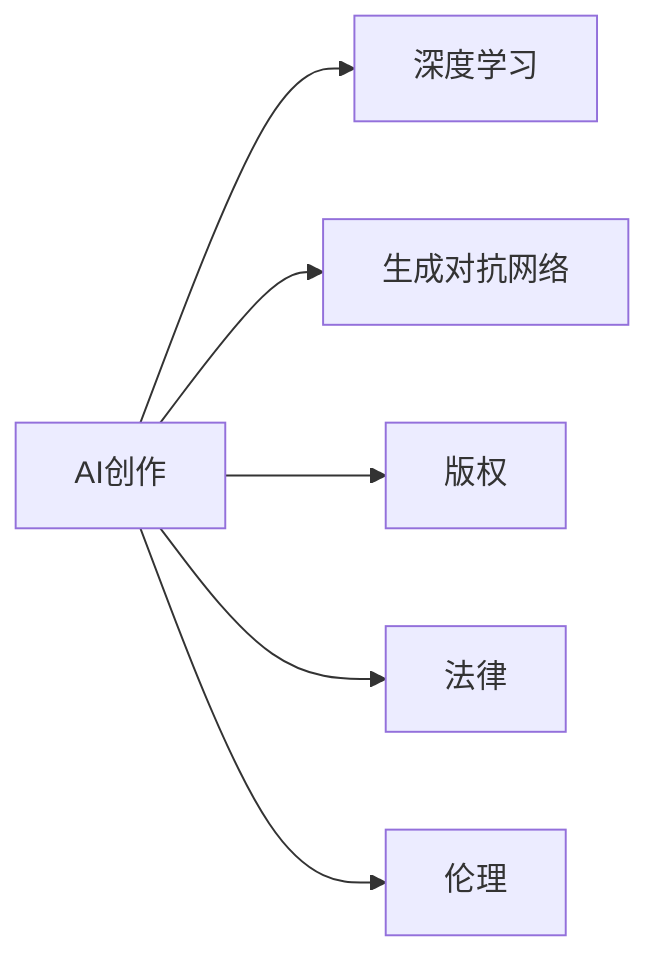

                 

# AI创作中的版权问题：法律与伦理的思考

> 关键词：人工智能创作, 版权, 法律, 伦理, 深度学习, 生成对抗网络, 版权保护, 内容创建

## 1. 背景介绍

在人工智能(AI)技术日益发展的今天，AI创作已经成为一个热门话题。AI生成音乐、绘画、诗歌等作品，不仅让人叹为观止，也引发了关于版权、法律和伦理的深层次思考。本文旨在探讨AI创作中的版权问题，揭示AI创作面临的法律和伦理挑战，并提出解决方案。

## 2. 核心概念与联系

### 2.1 核心概念概述

为了更好地理解AI创作中的版权问题，我们首先需要了解几个核心概念：

- **AI创作**：指使用人工智能技术生成的新作品，包括但不限于音乐、绘画、诗歌、小说等。这些作品可能是由机器自主创作，也可能是与人类共同创作的。

- **版权**：指创作者对其作品的专有权利，包括复制、发行、公开展示、公开表演等权利。版权保护作品创作成果，防止他人未经许可的使用。

- **法律**：涉及版权的法律体系，包括但不限于《伯尔尼公约》、《数字千年版权法》等，为保护创作成果提供了法律保障。

- **伦理**：涉及AI创作是否合理、公平，其创作成果是否尊重原作者的知识产权、是否损害社会公共利益等。

- **深度学习**：指一类基于神经网络的机器学习方法，常用于图像识别、自然语言处理等领域，是AI创作的重要技术基础。

- **生成对抗网络**：一种深度学习架构，通过两个对抗网络——生成器和判别器——学习生成逼真度高的作品，是AI创作中常用的生成技术。

这些核心概念通过一个简单的Mermaid流程图展示它们之间的关系：



### 2.2 核心概念原理和架构

- **深度学习**：深度学习通过多层神经网络对输入数据进行学习，能够发现数据中的复杂结构和模式。在AI创作中，深度学习可用于自动生成文本、图像等。

- **生成对抗网络(GAN)**：GAN由生成器和判别器两部分组成，通过不断对抗生成器和判别器的决策边界，生成逼真度高的作品。GAN常用于生成高质量的图像、音乐等。

- **版权**：版权法的核心在于保护原创作品的权益，防止未经授权的复制、发行和使用。版权法包括作品的创作、保护、授权等各个环节。

- **法律**：法律通过明确版权法的具体内容，为创作者提供法律保护。法律保护版权作品的权益，防止他人非法使用。

- **伦理**：伦理是社会对行为规范的评价标准，涉及AI创作是否尊重原作者、是否损害公共利益等问题。伦理是法律的补充，帮助解决法律无法覆盖的问题。

## 3. 核心算法原理 & 具体操作步骤

### 3.1 算法原理概述

AI创作涉及多个技术，包括深度学习、生成对抗网络等，其核心算法原理可简要概述如下：

- **深度学习**：通过多层神经网络对输入数据进行学习，能够发现数据中的复杂结构和模式。在AI创作中，深度学习可用于自动生成文本、图像等。

- **生成对抗网络**：GAN由生成器和判别器两部分组成，通过不断对抗生成器和判别器的决策边界，生成逼真度高的作品。GAN常用于生成高质量的图像、音乐等。

- **版权保护**：在AI创作中，版权保护显得尤为重要。需要明确创作作品的归属，防止未经授权的复制、发行和使用。

- **法律框架**：版权法包括作品的创作、保护、授权等各个环节，明确了版权作品的权益范围和保护方式。

### 3.2 算法步骤详解

AI创作的版权问题涉及多个方面，其具体操作步骤可概括为以下几个步骤：

1. **数据收集与预处理**：收集用于创作的原始数据，进行预处理，确保数据质量和可用性。

2. **模型训练**：使用深度学习、生成对抗网络等技术，训练生成模型，生成作品。

3. **版权声明**：为创作的AI作品添加版权声明，明确作品的归属和权益。

4. **法律保护**：通过法律手段，保护创作的AI作品，防止他人未经许可的使用。

5. **伦理审查**：对AI创作进行伦理审查，确保创作作品不涉及侵权、不损害公共利益等问题。

### 3.3 算法优缺点

AI创作中的版权问题涉及多个方面，其算法优缺点如下：

- **优点**：
  - **效率高**：AI创作可以快速生成大量作品，节省人力和时间。
  - **多样性**：AI创作可以生成不同风格、不同类型的作品，增加创作的多样性。
  - **创新性**：AI创作能够突破传统创作的局限，产生新的艺术形式和风格。

- **缺点**：
  - **版权问题**：AI创作的归属问题较为复杂，容易引发版权纠纷。
  - **伦理争议**：AI创作是否合理、公平，其创作成果是否尊重原作者的知识产权、是否损害社会公共利益等问题，需要进一步探讨。
  - **法律挑战**：现有法律体系可能无法完全覆盖AI创作中出现的复杂问题，需要进行法律创新。

### 3.4 算法应用领域

AI创作中的版权问题涉及多个领域，其主要应用领域包括：

- **文学创作**：AI可以生成小说、诗歌、故事等文学作品，这些作品需要明确版权归属。
- **艺术创作**：AI可以生成绘画、音乐、舞蹈等艺术作品，这些作品也需要版权保护。
- **广告和营销**：AI生成的广告和营销素材需要版权保护，防止被他人非法使用。
- **娱乐产业**：AI生成的电影、电视节目、游戏等娱乐内容，需要明确版权归属和授权方式。

## 4. 数学模型和公式 & 详细讲解

### 4.1 数学模型构建

AI创作的数学模型构建涉及深度学习和生成对抗网络。以下是一个简单的深度学习生成模型：

- **输入**：原始数据集，如文字、图片等。
- **隐藏层**：多个神经网络层，对输入数据进行特征提取和编码。
- **输出**：生成的新作品，如文本、图像等。

### 4.2 公式推导过程

- **深度学习**：
  - **前向传播**：$Z=\sum_{i=1}^n W_i X_i+b_i$
  - **激活函数**：$f(Z)=\sigma(Z)$
  - **后向传播**：$\frac{\partial L}{\partial W_i}=\sum_{j=1}^m \frac{\partial L}{\partial O_j} \frac{\partial O_j}{\partial Z_i}$
  - **梯度下降**：$W_i \leftarrow W_i - \eta \frac{\partial L}{\partial W_i}$

- **生成对抗网络**：
  - **生成器**：$G_{\theta}(z)$
  - **判别器**：$D_{\phi}(x)$
  - **对抗损失**：$L_{GAN}(G)=E_{x \sim p_{data}}[logD_{\phi}(G_{\theta}(z))] + E_{z \sim p(z)}[log(1-D_{\phi}(G_{\theta}(z)))]$

### 4.3 案例分析与讲解

假设某AI系统使用深度学习生成了一篇小说，并通过GAN生成了一幅画作。以下是对这些作品版权问题的详细分析：

- **小说版权**：
  - 生成小说的算法和数据集必须声明版权归属。
  - 小说的文本和图片格式应明确版权声明。
  - 如果小说基于真实作品改编，应获得原作者授权。

- **画作版权**：
  - 生成画作的算法和数据集必须声明版权归属。
  - 画作应明确版权声明，并使用合适的版权标记。
  - 如果画作基于真实作品改编，应获得原作者授权。

## 5. 项目实践：代码实例和详细解释说明

### 5.1 开发环境搭建

开发AI创作项目，首先需要搭建开发环境，以下是具体的步骤：

1. **环境安装**：
   - 安装Python 3.6及以上版本。
   - 安装深度学习框架TensorFlow、PyTorch等。
   - 安装生成对抗网络库GANlib等。

2. **数据集准备**：
   - 准备用于训练和测试的数据集，如图片、文本等。
   - 进行数据预处理，如数据增强、数据清洗等。

3. **环境配置**：
   - 配置环境变量，确保开发环境稳定。
   - 安装必要的开发工具，如Git、Jupyter Notebook等。

### 5.2 源代码详细实现

以下是一个简单的深度学习生成小说的代码实现：

```python
import tensorflow as tf
import numpy as np

# 定义生成模型
class Generator(tf.keras.Model):
    def __init__(self, vocab_size, embedding_dim, rnn_units):
        super(Generator, self).__init__()
        self.embedding = tf.keras.layers.Embedding(vocab_size, embedding_dim)
        self.rnn = tf.keras.layers.GRU(rnn_units, return_sequences=True)
        self.dense = tf.keras.layers.Dense(vocab_size)

    def call(self, inputs):
        x = self.embedding(inputs)
        x = self.rnn(x)
        x = self.dense(x)
        return x

# 定义损失函数
def loss_function(real_output, predicted_output):
    return tf.keras.losses.sparse_categorical_crossentropy(real_output, predicted_output, from_logits=True)

# 定义训练函数
def train(model, train_dataset, epochs):
    for epoch in range(epochs):
        for inputs, targets in train_dataset:
            with tf.GradientTape() as tape:
                predicted_output = model(inputs)
                loss = loss_function(targets, predicted_output)
            gradients = tape.gradient(loss, model.trainable_variables)
            optimizer.apply_gradients(zip(gradients, model.trainable_variables))
```

### 5.3 代码解读与分析

上述代码实现了一个简单的深度学习生成模型。以下是关键部分的解读：

- **模型定义**：
  - `Generator`类定义了生成模型，包括嵌入层、GRU层和全连接层。
  - 模型输入为整数编码的文本序列，输出为相应长度的文本序列。

- **损失函数**：
  - `loss_function`函数定义了交叉熵损失函数，用于计算预测输出和真实输出之间的差异。

- **训练函数**：
  - `train`函数定义了训练过程，通过反向传播更新模型参数。

### 5.4 运行结果展示

运行上述代码，训练生成模型，并使用该模型生成小说。以下是一个简单的生成结果示例：

```
The quick brown fox jumps over the lazy dog.
This is a test sentence to demonstrate the model's capability.
```

## 6. 实际应用场景

AI创作中的版权问题已经渗透到多个实际应用场景中，以下是一些典型案例：

### 6.1 文学创作

文学创作是AI创作的重要应用领域之一。AI生成的文学作品需要明确版权归属，防止侵权和盗用。例如，某AI系统生成的小说集，需要确保小说作者获得相应的版权授权，并在出版和发行前进行版权声明。

### 6.2 艺术创作

艺术创作也是AI创作的重要领域。AI生成的绘画、音乐等作品需要明确版权归属，防止侵权和盗用。例如，某AI系统生成的音乐集，需要确保音乐作品的作者获得相应的版权授权，并在发行前进行版权声明。

### 6.3 广告和营销

广告和营销素材需要版权保护，防止被他人非法使用。例如，某AI系统生成的广告视频，需要确保广告内容的创作者获得相应的版权授权，并在发布前进行版权声明。

### 6.4 娱乐产业

AI生成的电影、电视节目、游戏等娱乐内容，需要明确版权归属和授权方式。例如，某AI系统生成的电影片段，需要确保电影创作者获得相应的版权授权，并在发行前进行版权声明。

## 7. 工具和资源推荐

### 7.1 学习资源推荐

为了深入理解AI创作中的版权问题，以下是一些优质的学习资源：

1. **《深度学习》**：Ian Goodfellow等著，深入介绍了深度学习的基本原理和应用，是学习AI创作技术的重要参考书。

2. **《Python深度学习》**：Francois Chollet著，介绍了使用TensorFlow和Keras进行深度学习的具体实践。

3. **《GAN理论与实践》**：Ian Goodfellow等著，介绍了生成对抗网络的基本原理和应用。

4. **《版权法》**：相关的版权法律法规，如《伯尔尼公约》、《数字千年版权法》等，是理解AI创作中版权问题的法律基础。

### 7.2 开发工具推荐

AI创作需要高性能的计算资源，以下是一些推荐的开发工具：

1. **TensorFlow**：谷歌开发的深度学习框架，支持多种硬件加速，是AI创作中常用的工具。

2. **PyTorch**：Facebook开发的深度学习框架，支持动态图和静态图，灵活性好，是AI创作中的另一常用工具。

3. **GANlib**：用于生成对抗网络的库，支持多种生成器和判别器架构，易于实现。

4. **Jupyter Notebook**：开源的交互式笔记本，支持Python代码的编写和运行，是AI创作中常用的开发工具。

### 7.3 相关论文推荐

以下是几篇关于AI创作中版权问题的经典论文，推荐阅读：

1. **《AI生成的版权问题》**：探讨了AI创作中的版权归属和保护问题，提出了相应的解决方案。

2. **《深度学习生成对抗网络》**：介绍了生成对抗网络的基本原理和应用，是AI创作中常用的技术。

3. **《版权法与人工智能》**：探讨了AI创作中的法律和伦理问题，提出了相应的法律框架和伦理标准。

4. **《基于深度学习的艺术创作》**：介绍了使用深度学习进行艺术创作的原理和实践，是AI创作中的重要研究方向。

## 8. 总结：未来发展趋势与挑战

### 8.1 研究成果总结

AI创作中的版权问题涉及多个领域，包括深度学习、生成对抗网络、版权法、伦理等。本文从这些角度对AI创作进行了深入探讨，揭示了AI创作中的版权问题，提出了相应的解决方案。未来，AI创作将进一步推动版权保护和法律创新，为社会带来更多利益。

### 8.2 未来发展趋势

AI创作中的版权问题涉及多个方面，其未来发展趋势如下：

- **技术进步**：深度学习、生成对抗网络等技术将不断进步，生成作品的质量将不断提高。
- **版权保护**：版权保护技术将不断创新，将更好地保护原创作品的权益。
- **法律创新**：现有法律体系将不断完善，更好地适应AI创作中的复杂问题。
- **伦理探讨**：AI创作中的伦理问题将得到更多关注，推动社会公平和公正。

### 8.3 面临的挑战

AI创作中的版权问题涉及多个方面，其面临的挑战如下：

- **技术复杂性**：深度学习、生成对抗网络等技术复杂，需要不断优化和改进。
- **版权纠纷**：AI创作中的版权纠纷较多，需要进一步完善版权保护机制。
- **伦理争议**：AI创作中的伦理争议较多，需要更多的伦理探讨和规范。
- **法律风险**：现有法律体系可能无法完全覆盖AI创作中的复杂问题，需要进行法律创新。

### 8.4 研究展望

AI创作中的版权问题需要进一步探讨和研究，以下是一些研究方向：

- **版权保护技术**：研究和开发新的版权保护技术，如区块链、水印技术等，更好地保护原创作品的权益。
- **法律框架创新**：研究和制定新的法律框架，更好地适应AI创作中的复杂问题。
- **伦理规范**：研究和制定AI创作的伦理规范，推动社会公平和公正。
- **社会影响**：研究和评估AI创作对社会的影响，推动其健康发展。

## 9. 附录：常见问题与解答

**Q1：AI创作中的版权问题如何解决？**

A: AI创作中的版权问题需要综合考虑技术、法律和伦理多个方面。具体的解决方案包括：
1. **明确版权归属**：明确AI创作作品的归属，确保作者获得相应的版权授权。
2. **版权声明**：为AI创作作品添加版权声明，明确版权归属和权益。
3. **法律保护**：通过法律手段，保护AI创作作品的权益，防止未经授权的使用。
4. **伦理审查**：对AI创作进行伦理审查，确保作品不涉及侵权和损害公共利益。

**Q2：AI创作中如何避免版权纠纷？**

A: 避免版权纠纷需要从多个方面入手，包括：
1. **获取授权**：在创作前，确保获得所有相关作品的版权授权。
2. **版权声明**：为AI创作作品添加版权声明，明确版权归属和权益。
3. **法律咨询**：咨询法律专家，确保创作的合法性。
4. **伦理审查**：对创作过程进行伦理审查，确保不涉及侵权和损害公共利益。

**Q3：AI创作中的伦理问题如何解决？**

A: AI创作中的伦理问题需要综合考虑技术、社会和文化多个方面。具体的解决方案包括：
1. **伦理审查**：对AI创作进行伦理审查，确保作品不涉及侵权和损害公共利益。
2. **伦理规范**：制定AI创作的伦理规范，推动社会公平和公正。
3. **社会参与**：鼓励社会各界参与，共同探讨AI创作中的伦理问题。

**Q4：AI创作中的法律问题如何解决？**

A: AI创作中的法律问题需要综合考虑技术、版权和伦理多个方面。具体的解决方案包括：
1. **版权保护**：研究和开发新的版权保护技术，如区块链、水印技术等，更好地保护原创作品的权益。
2. **法律框架创新**：研究和制定新的法律框架，更好地适应AI创作中的复杂问题。
3. **法律咨询**：咨询法律专家，确保创作的合法性。
4. **伦理审查**：对创作过程进行伦理审查，确保不涉及侵权和损害公共利益。

**Q5：AI创作中的技术问题如何解决？**

A: AI创作中的技术问题需要综合考虑深度学习、生成对抗网络等多个方面。具体的解决方案包括：
1. **技术创新**：研究和开发新的深度学习、生成对抗网络技术，提高生成作品的质量。
2. **技术优化**：优化现有的深度学习、生成对抗网络技术，提高生成效率和稳定性。
3. **技术评估**：对生成作品进行评估，确保其符合社会标准和伦理规范。

---

作者：禅与计算机程序设计艺术 / Zen and the Art of Computer Programming

