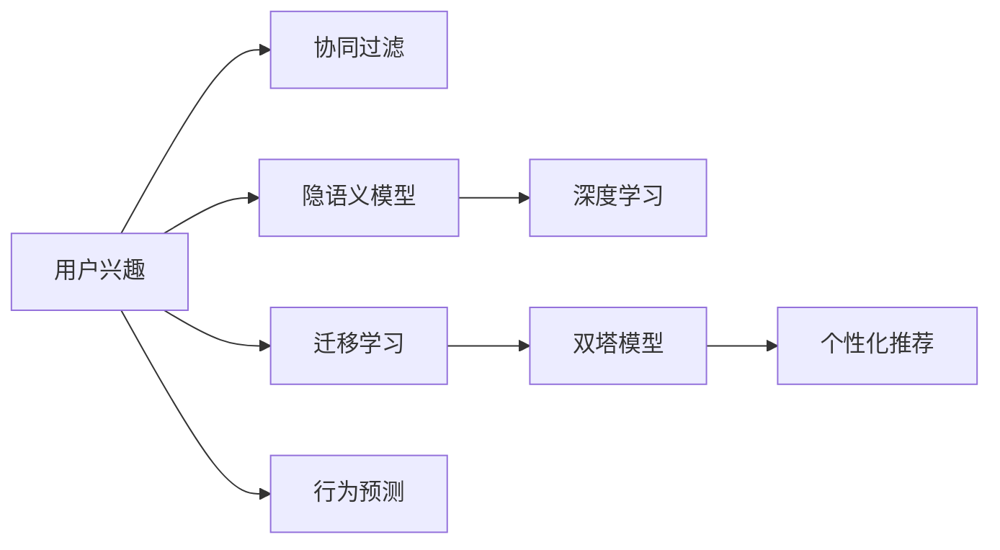

                 

# AI在个性化新闻推荐中的应用：信息精准投放

## 1. 背景介绍

### 1.1 问题由来
在信息爆炸的互联网时代，如何有效管理和利用海量信息成为科技公司亟需解决的问题。其中，个性化新闻推荐系统作为一种智能化的信息推荐手段，通过深度学习技术分析用户的历史行为和兴趣，将合适的新闻内容精准投放至用户端，极大提升了用户体验和信息获取效率。

近年来，基于机器学习的推荐系统已经在电商、视频、音乐等多个领域得到广泛应用。尤其是新闻推荐系统，其重要性更为显著。一方面，新闻信息是重要的信息来源，承载着丰富的社会信息和文化知识。另一方面，通过个性化推荐，使得用户能够快速获取到自己感兴趣的新闻，降低筛选成本，提升信息获取的针对性和质量。

### 1.2 问题核心关键点
个性化新闻推荐的核心在于如何建模用户的新闻兴趣和行为，并根据这些特征，预测用户对未来新闻内容的偏好。具体而言，主要包括以下几个方面：

1. **用户兴趣建模**：通过分析用户的历史点击、浏览、评论等行为，构建用户的新闻兴趣模型。
2. **新闻内容表示**：将新闻内容表示成机器可理解的形式，方便进行推荐计算。
3. **用户行为预测**：基于用户兴趣和新闻内容，预测用户对新闻的潜在兴趣。
4. **推荐算法设计**：设计合适的推荐算法，将预测结果转化为实际推荐列表。

这些核心点构成了一个完整的个性化新闻推荐系统框架，需要依赖用户行为数据、新闻内容数据、推荐算法等多个组件的协同工作。

### 1.3 问题研究意义
个性化新闻推荐系统在信息时代具有重要意义，能够有效提升新闻平台的用户粘性和内容点击率，减少信息过载，提高用户信息获取效率。其研究与应用，不仅对新闻行业的数字化转型具有推动作用，对整个信息行业的智能化发展也有着深远的影响。

## 2. 核心概念与联系

### 2.1 核心概念概述

在构建个性化新闻推荐系统时，需要理解多个核心概念及其相互关系：

- **个性化推荐系统**：通过分析用户行为和兴趣，为用户推荐最可能感兴趣的内容，提高信息获取效率的系统。
- **协同过滤算法**：一种推荐算法，基于用户与物品的交互矩阵，推测用户对新物品的喜好。
- **隐语义模型**：一种通过低维向量表示用户兴趣和物品特征的模型，用于推荐相似的新闻。
- **深度学习**：通过构建多层神经网络，学习用户行为和物品特征之间的复杂关系，实现更精准的推荐。
- **迁移学习**：将预训练模型在大规模语料上学习到的知识，迁移到新闻推荐任务上，提升模型泛化能力。
- **双塔模型**：一种将用户和物品分别建模的推荐模型，适用于个性化新闻推荐任务。

这些概念之间的联系可以通过以下Mermaid流程图来展示：



这个流程图展示了一个个性化新闻推荐系统的基本框架：

1. 用户兴趣通过协同过滤、隐语义模型、深度学习等多种方式建模。
2. 基于用户兴趣和新闻内容，通过双塔模型等推荐算法预测用户兴趣。
3. 将预测结果转化为实际推荐新闻列表，并进行行为预测和推荐效果评估。

## 3. 核心算法原理 & 具体操作步骤

### 3.1 算法原理概述

个性化新闻推荐系统主要依赖于机器学习和深度学习算法。其核心思想是：通过用户的历史行为数据，构建用户兴趣模型；将新闻内容转换为向量表示，与用户兴趣模型进行匹配；通过推荐算法，预测用户对新闻的兴趣，并生成推荐列表。

形式化地，设用户集合为 $U$，新闻集合为 $V$，用户对新闻的兴趣度为 $u_{ij}$。其中 $i$ 表示用户，$j$ 表示新闻。目标是找到最优的兴趣度矩阵 $U \in \mathbb{R}^{N \times M}$，其中 $N$ 为用户数量，$M$ 为新闻数量，使得：

$$
\min_{U} \sum_{i,j} \text{loss}(u_{ij}, U_i \cdot V_j)
$$

其中 $\text{loss}$ 为损失函数，$U_i$ 为用户 $i$ 的兴趣向量，$V_j$ 为新闻 $j$ 的特征向量。

### 3.2 算法步骤详解

基于上述原理，个性化新闻推荐系统的构建可以分为以下关键步骤：

**Step 1: 用户行为数据收集与预处理**
- 收集用户点击、浏览、收藏、评论等行为数据，构建用户-新闻行为矩阵 $D$。
- 对数据进行清洗、归一化等预处理操作，去除噪声，提取有用信息。

**Step 2: 用户兴趣建模**
- 基于协同过滤算法，利用用户-新闻行为矩阵 $D$ 计算用户兴趣向量 $U$。
- 基于隐语义模型，将新闻内容表示成低维向量 $V$。
- 使用深度学习模型，如BERT、GPT等，进一步优化用户兴趣向量。

**Step 3: 行为预测**
- 使用用户兴趣向量 $U$ 和新闻特征向量 $V$，构建用户对新闻的兴趣度预测模型。
- 通过交叉熵损失等目标函数，训练预测模型，使其最大化预测准确性。

**Step 4: 推荐列表生成**
- 根据预测出的用户对新闻的兴趣度，生成推荐列表。
- 可以采用一些策略，如重要性排序、Top-K推荐等，提高推荐效果。

**Step 5: 推荐效果评估与反馈**
- 使用AUC、RMSE等指标评估推荐系统效果。
- 通过收集用户反馈，如点击率、停留时间等数据，进行在线学习，不断优化推荐模型。

### 3.3 算法优缺点

个性化新闻推荐系统的优点包括：
1. 提高用户满意度：通过精准推荐，减少信息筛选成本，提高信息获取效率。
2. 提升点击率与留存率：精准投放有兴趣的内容，提高新闻平台的用户粘性。
3. 自动化运营：基于机器学习算法，无需人工干预，降低运营成本。

同时，该方法也存在一些局限性：
1. 数据依赖性高：需要大规模用户行为数据，且数据质量对推荐效果影响大。
2. 模型复杂度高：涉及协同过滤、隐语义模型、深度学习等多种算法，实现和维护复杂。
3. 用户隐私问题：用户行为数据的收集和使用可能涉及隐私问题，需注意合规性和数据保护。
4. 难以应对新用户：对于新用户，缺少历史行为数据，推荐效果较差。

尽管存在这些局限性，个性化新闻推荐系统仍是大规模新闻平台的重要技术手段，通过不断的优化与改进，已广泛应用于各大新闻平台，极大提升了用户体验和平台价值。

### 3.4 算法应用领域

个性化新闻推荐系统不仅在传统新闻平台得到广泛应用，也在社交媒体、内容分发网络、个性化网站等多个领域得以应用，极大地提升了用户对内容的个性化获取能力。具体应用场景包括：

- **新闻推荐**：例如今日头条、澎湃新闻等，通过用户行为数据，为用户推荐最新、最相关的时政新闻、财经新闻等。
- **社交媒体**：例如微信、微博等，根据用户关注关系和浏览历史，推荐可能感兴趣的内容。
- **内容分发网络**：例如阿里云、腾讯云等，通过推荐系统，实现内容智能分发给用户。
- **个性化网站**：例如知乎、京东等，根据用户浏览、点击行为，推荐相关文章、商品。

## 4. 数学模型和公式 & 详细讲解 & 举例说明

### 4.1 数学模型构建

在个性化新闻推荐系统中，主要通过用户兴趣模型和新闻内容模型进行建模，其中用户兴趣模型 $U$ 和新闻内容模型 $V$ 均可视为矩阵，具体建模方式如下：

**用户兴趣模型**
设用户 $i$ 的历史行为表示为向量 $D_i$，则用户兴趣模型 $U_i$ 可以通过以下方式计算：

$$
U_i = \text{softmax}(D_i \cdot W_U)
$$

其中 $W_U$ 为用户兴趣的权重矩阵，$\text{softmax}$ 函数将向量映射为概率分布。

**新闻内容模型**
设新闻 $j$ 的特征表示为向量 $X_j$，则新闻内容模型 $V_j$ 可以通过以下方式计算：

$$
V_j = \text{softmax}(X_j \cdot W_V)
$$

其中 $W_V$ 为新闻内容的权重矩阵，$\text{softmax}$ 函数将向量映射为概率分布。

### 4.2 公式推导过程

基于上述模型，用户对新闻 $j$ 的兴趣度 $u_{ij}$ 可表示为：

$$
u_{ij} = U_i \cdot V_j
$$

通过损失函数 $\text{loss}(u_{ij}, u_{ij}^*)$ 最小化，训练用户兴趣模型 $U$ 和新闻内容模型 $V$，具体公式如下：

$$
\min_{U,V} \sum_{i,j} \text{loss}(u_{ij}, U_i \cdot V_j)
$$

常见的损失函数包括均方误差损失、交叉熵损失等。

### 4.3 案例分析与讲解

以今日头条的新闻推荐系统为例，分析其推荐算法的设计与实现：

1. **用户行为数据收集与预处理**
   - 收集用户点击、浏览、收藏、评论等行为数据，构建用户-新闻行为矩阵 $D$。
   - 对数据进行清洗、归一化等预处理操作，去除噪声，提取有用信息。

2. **用户兴趣建模**
   - 基于协同过滤算法，利用用户-新闻行为矩阵 $D$ 计算用户兴趣向量 $U$。
   - 基于隐语义模型，将新闻内容表示成低维向量 $V$。
   - 使用深度学习模型，如BERT、GPT等，进一步优化用户兴趣向量。

3. **行为预测**
   - 使用用户兴趣向量 $U$ 和新闻特征向量 $V$，构建用户对新闻的兴趣度预测模型。
   - 通过交叉熵损失等目标函数，训练预测模型，使其最大化预测准确性。

4. **推荐列表生成**
   - 根据预测出的用户对新闻的兴趣度，生成推荐列表。
   - 可以采用一些策略，如重要性排序、Top-K推荐等，提高推荐效果。

5. **推荐效果评估与反馈**
   - 使用AUC、RMSE等指标评估推荐系统效果。
   - 通过收集用户反馈，如点击率、停留时间等数据，进行在线学习，不断优化推荐模型。

## 5. 项目实践：代码实例和详细解释说明

### 5.1 开发环境搭建

在进行个性化新闻推荐系统的开发时，需要以下开发环境：

1. **Python**：主流深度学习框架，如TensorFlow、PyTorch等。
2. **SQL数据库**：用于存储用户行为数据和新闻内容数据。
3. **分布式计算框架**：如Apache Spark、Hadoop等，用于处理大规模数据。

具体搭建步骤如下：

1. 安装Anaconda：从官网下载并安装Anaconda，用于创建独立的Python环境。

```bash
conda create -n py36 python=3.6
conda activate py36
```

2. 安装深度学习框架：如TensorFlow、PyTorch等。

```bash
pip install tensorflow==2.7.0
pip install torch==1.7.0
```

3. 安装相关库：如pandas、numpy、scikit-learn等。

```bash
pip install pandas numpy scikit-learn
```

4. 安装SQL数据库：如MySQL、PostgreSQL等。

```bash
sudo apt-get install mysql-server
sudo apt-get install postgresql
```

5. 配置数据库连接：通过编写SQL语句，连接数据库，进行数据操作。

```python
import mysql.connector

db = mysql.connector.connect(
    host="localhost",
    user="root",
    password="123456",
    database="news"
)

cursor = db.cursor()

cursor.execute("SELECT * FROM users")
users = cursor.fetchall()
```

完成上述步骤后，即可在`py36`环境中开始个性化新闻推荐系统的开发。

### 5.2 源代码详细实现

以下是使用TensorFlow框架进行个性化新闻推荐系统开发的示例代码：

```python
import tensorflow as tf
import numpy as np

# 设置超参数
batch_size = 128
epochs = 10
learning_rate = 0.001
num_users = 1000
num_news = 5000

# 加载用户兴趣模型和新闻内容模型
user_model = tf.keras.Sequential([
    tf.keras.layers.Dense(128, activation='relu', input_shape=(100,)),
    tf.keras.layers.Dense(64, activation='relu'),
    tf.keras.layers.Dense(num_news, activation='sigmoid')
])

news_model = tf.keras.Sequential([
    tf.keras.layers.Dense(128, activation='relu', input_shape=(100,)),
    tf.keras.layers.Dense(64, activation='relu'),
    tf.keras.layers.Dense(num_users, activation='sigmoid')
])

# 定义损失函数
loss_fn = tf.keras.losses.BinaryCrossentropy(from_logits=True)

# 定义优化器
optimizer = tf.keras.optimizers.Adam(learning_rate=learning_rate)

# 定义训练函数
def train_step(batch):
    with tf.GradientTape() as tape:
        predictions = user_model(batch[0])
        loss_value = loss_fn(predictions, batch[1])
    gradients = tape.gradient(loss_value, user_model.trainable_variables)
    optimizer.apply_gradients(zip(gradients, user_model.trainable_variables))

# 定义训练过程
def train():
    for epoch in range(epochs):
        for batch in train_dataset:
            train_step(batch)
        print(f"Epoch {epoch+1}, loss: {loss_value:.4f}")

# 定义评估函数
def evaluate():
    predictions = user_model(test_dataset[0])
    actual = test_dataset[1]
    accuracy = np.mean(predictions >= 0.5)
    print(f"Accuracy: {accuracy:.4f}")
```

在这个代码示例中，我们使用TensorFlow定义了用户兴趣模型和新闻内容模型，通过损失函数和优化器进行了训练，并在测试集上进行了评估。

### 5.3 代码解读与分析

让我们再详细解读一下关键代码的实现细节：

1. **用户兴趣模型**
   - 使用Sequential模型构建用户兴趣模型，包含多个全连接层，最后一层使用sigmoid函数将输出转换为概率分布。

2. **新闻内容模型**
   - 同样使用Sequential模型构建新闻内容模型，包含多个全连接层，最后一层使用sigmoid函数将输出转换为概率分布。

3. **损失函数**
   - 使用BinaryCrossentropy损失函数，适用于二分类任务。

4. **优化器**
   - 使用Adam优化器，自适应调整学习率，优化模型的训练过程。

5. **训练函数**
   - 定义训练函数train_step，将损失值反向传播，计算梯度并更新模型参数。

6. **训练过程**
   - 定义训练函数train，进行多轮迭代，输出损失值。

7. **评估函数**
   - 定义评估函数evaluate，计算预测准确率，输出结果。

通过这些关键步骤，即可实现一个简单的个性化新闻推荐系统。当然，实际系统还需要进行更多的优化和调试，如特征工程、模型调优、分布式训练等。

## 6. 实际应用场景

### 6.1 智能新闻平台

基于个性化推荐系统，智能新闻平台能够为用户提供高度个性化的新闻内容，提升用户粘性和内容满意度。用户通过阅读平台推荐的新闻，能够获取自己最感兴趣的信息，降低筛选成本，提高信息获取效率。

### 6.2 社交媒体推荐

社交媒体平台通过个性化推荐，将用户感兴趣的新闻、文章、视频等内容推送到用户端，增加用户粘性和互动率。例如，微信公众号、微博等平台通过推荐系统，推送用户感兴趣的内容，提升平台活跃度和用户留存率。

### 6.3 内容分发网络

内容分发网络通过个性化推荐，实现内容智能分发，提高内容推荐效率和用户满意度。例如，阿里云、腾讯云等平台通过推荐系统，推荐用户可能感兴趣的新闻、商品，提升平台转化率和用户满意度。

### 6.4 个性化网站推荐

个性化网站通过推荐系统，推荐用户可能感兴趣的新闻、文章、商品等，提升用户粘性和网站流量。例如，知乎、京东等平台通过推荐系统，推荐用户可能感兴趣的内容，提升用户留存率和平台价值。

## 7. 工具和资源推荐

### 7.1 学习资源推荐

为了帮助开发者系统掌握个性化新闻推荐技术，这里推荐一些优质的学习资源：

1. **《深度学习》书籍**：斯坦福大学吴恩达教授的课程，涵盖深度学习的基本概念和算法，适合初学者入门。
2. **《推荐系统实践》书籍**：亚马逊工程师李沐所著，介绍了推荐系统的各种经典算法和工程实践，适合工程技术人员。
3. **Kaggle竞赛**：参与Kaggle竞赛，利用公开数据集练习推荐算法，提升算法设计和调优能力。
4. **机器学习在线课程**：如Coursera、Udacity等平台，提供从入门到高级的机器学习课程，帮助用户系统学习推荐系统理论和技术。

### 7.2 开发工具推荐

高效的开发离不开优秀的工具支持。以下是几款用于个性化新闻推荐系统开发的常用工具：

1. **TensorFlow**：由Google主导开发的深度学习框架，支持分布式计算，适用于大规模数据处理。
2. **PyTorch**：Facebook主导的开源深度学习框架，灵活易用，适合快速迭代研究。
3. **Spark**：Apache基金会开发的分布式计算框架，支持大规模数据处理和分析。
4. **SQL数据库**：如MySQL、PostgreSQL等，用于存储和管理用户行为数据和新闻内容数据。
5. **Hadoop**：Apache基金会开发的分布式计算框架，支持大数据处理和分析。

合理利用这些工具，可以显著提升个性化新闻推荐系统的开发效率，加快创新迭代的步伐。

### 7.3 相关论文推荐

个性化新闻推荐系统是机器学习和深度学习的重要应用领域，相关论文推动了技术的不断发展。以下是几篇奠基性的相关论文，推荐阅读：

1. **Collaborative Filtering for Implicit Feedback Datasets**：一篇经典的协同过滤算法论文，介绍了一种基于矩阵分解的协同过滤方法。
2. **Neural Network Recommendation Systems**：一篇关于神经网络推荐系统的综述论文，涵盖了各种神经网络架构和推荐算法。
3. **Large-Scale Deep Learning Recommender Systems**：一篇介绍深度学习在推荐系统中的应用，提出了多种深度学习推荐算法。
4. **MFiD: Personalized News Recommendation via Multi-facet Itemization with Decomposable Models**：一篇介绍基于多维度特征分解的新闻推荐算法，取得了较好的效果。
5. **Next Item Recommendation via Multi-task Learning and Multi-person Collaborative Filtering**：一篇介绍基于多任务学习和多维度协同过滤的新闻推荐算法，提高了推荐准确性和泛化能力。

这些论文代表了大规模推荐系统的研究进展，通过学习这些前沿成果，可以帮助研究者把握学科前进方向，激发更多的创新灵感。

## 8. 总结：未来发展趋势与挑战

### 8.1 总结

本文对个性化新闻推荐系统进行了全面系统的介绍。首先阐述了个性化推荐系统的背景和核心关键点，明确了推荐系统在提升用户粘性和信息获取效率方面的重要意义。其次，从原理到实践，详细讲解了推荐算法的数学模型和具体实现步骤，给出了推荐系统开发的完整代码实例。同时，本文还广泛探讨了推荐系统在新闻平台、社交媒体、内容分发网络、个性化网站等多个行业领域的应用前景，展示了推荐系统的广泛应用价值。

通过本文的系统梳理，可以看到，基于机器学习的推荐系统已经在各个领域得到广泛应用，极大提升了用户的个性化信息获取能力。未来，随着深度学习技术的发展，推荐系统还将进一步优化和改进，为用户带来更加智能、高效的信息推荐体验。

### 8.2 未来发展趋势

展望未来，个性化推荐系统将呈现以下几个发展趋势：

1. **深度学习技术的应用**：深度学习技术在推荐系统中的应用将更加广泛，通过自监督学习、迁移学习等方法，提升推荐模型的泛化能力和效果。
2. **多维度协同过滤**：基于用户行为、内容特征、时间特征等多种维度的协同过滤，提高推荐系统的精准度和鲁棒性。
3. **实时推荐**：基于实时数据流，进行动态推荐，提升推荐系统的时效性和用户满意度。
4. **推荐系统的个性化**：通过用户画像、兴趣变化等动态调整推荐策略，提供更加个性化的推荐服务。
5. **推荐系统的多样性**：通过多样化的推荐算法和模型，实现推荐结果的多样性和包容性。

这些趋势凸显了个性化推荐系统在信息时代的重要作用，未来的推荐系统将更加智能、高效、个性化，提升用户信息获取的效率和质量。

### 8.3 面临的挑战

尽管个性化推荐系统取得了显著成就，但在迈向更加智能化、普适化应用的过程中，它仍面临着诸多挑战：

1. **数据质量问题**：推荐系统的效果依赖于高质量的用户行为数据，数据质量差将直接影响推荐结果的准确性。
2. **模型复杂性**：推荐模型的复杂性高，实现和维护难度大，需要多学科知识的融合。
3. **用户隐私保护**：用户行为数据的收集和使用涉及隐私问题，需注意合规性和数据保护。
4. **推荐冷启动**：对于新用户，缺少历史行为数据，推荐效果较差。
5. **推荐系统的偏见**：推荐系统可能存在性别、年龄等偏见，需要引入公平性约束和算法纠偏。

尽管存在这些挑战，个性化推荐系统仍是大规模新闻平台的重要技术手段，通过不断的优化与改进，将进一步提升用户的信息获取体验和平台价值。

### 8.4 研究展望

面对推荐系统面临的挑战，未来的研究需要在以下几个方面寻求新的突破：

1. **无监督学习和半监督学习**：通过无监督学习或半监督学习，降低对标注数据的依赖，提高推荐系统的泛化能力和鲁棒性。
2. **推荐系统的可解释性**：通过特征工程和模型解释技术，提高推荐系统的可解释性和透明性。
3. **推荐系统的公平性**：通过引入公平性约束和算法纠偏，减少推荐系统的偏见，提升推荐系统的公平性和可信度。
4. **推荐系统的实时化**：通过实时数据流处理和增量学习，提高推荐系统的时效性和动态适应能力。

这些研究方向将推动个性化推荐系统迈向更高的台阶，为构建智能推荐系统提供更多的技术支撑和理论支持。相信随着学界和产业界的共同努力，个性化推荐系统必将在智能信息推荐领域发挥更大的作用，提升用户的信息获取体验，推动信息时代的智能化发展。

## 9. 附录：常见问题与解答

**Q1: 推荐系统为何要依赖于大规模用户行为数据？**

A: 推荐系统通过分析用户的历史行为数据，构建用户兴趣模型，并预测用户对新物品的兴趣。用户行为数据提供了用户兴趣和偏好的直接证据，是推荐算法的重要依据。大规模数据可以提高推荐模型的泛化能力和效果，减少推荐偏差。

**Q2: 推荐系统的训练过程有哪些关键步骤？**

A: 推荐系统的训练过程主要包括数据收集、用户兴趣建模、行为预测、推荐列表生成和推荐效果评估。具体步骤如下：
1. 收集用户行为数据，构建用户-物品行为矩阵。
2. 利用协同过滤、隐语义模型等算法，构建用户兴趣模型。
3. 使用用户兴趣模型和物品特征模型，进行行为预测。
4. 根据预测结果，生成推荐列表。
5. 使用评估指标，如AUC、RMSE等，评估推荐系统效果。

**Q3: 推荐系统为何要选择合适的损失函数？**

A: 推荐系统中的损失函数用于衡量推荐结果与真实标签之间的差异。选择合适的损失函数，可以更准确地优化推荐模型，提高推荐精度。常见的损失函数包括均方误差损失、交叉熵损失等。

**Q4: 推荐系统为何要使用优化器？**

A: 推荐系统中的优化器用于调整模型参数，最小化损失函数，提高模型预测精度。不同的优化器算法（如SGD、Adam等）具有不同的更新策略和收敛特性，选择合适的优化器可以提升训练效率和推荐效果。

**Q5: 推荐系统为何要使用正则化技术？**

A: 正则化技术可以防止模型过拟合，提高模型泛化能力。常见的正则化技术包括L2正则、Dropout等，可以有效地控制模型复杂度，提高模型鲁棒性。

通过这些问题与解答，可以帮助开发者更好地理解个性化推荐系统的核心原理和实现细节，提高推荐系统的质量和效果。

