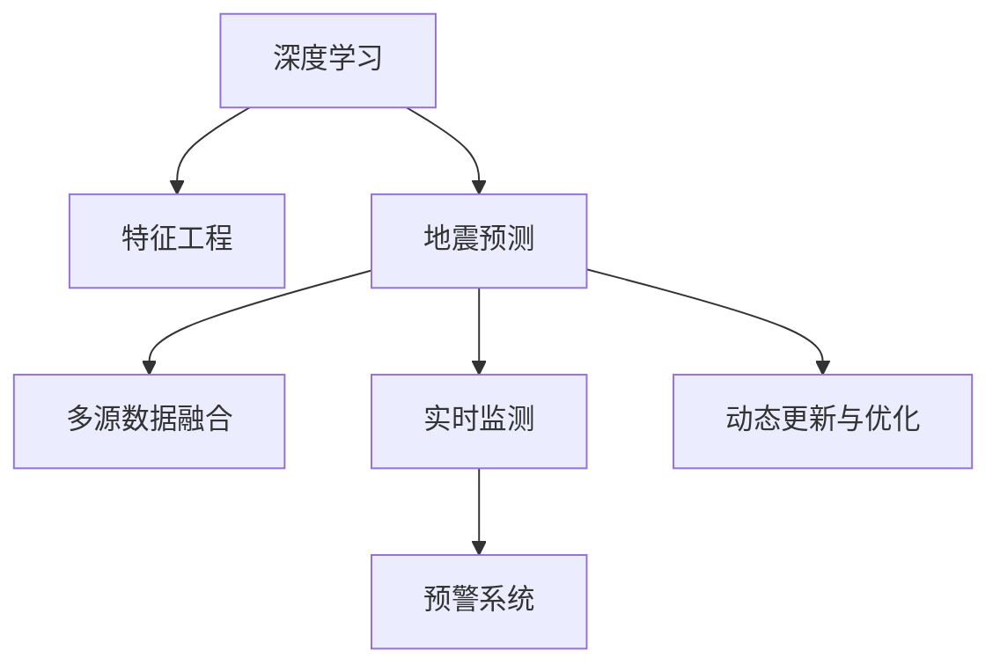

                 

# AI在地震预测中的应用：减少灾害损失

## 1. 背景介绍

### 1.1 问题由来

地震是全球范围内最为严重的自然灾害之一，其突发性强、破坏力大，对人类社会的生命财产安全构成严重威胁。每年有数以百万计的地震事件发生，造成了巨大的经济损失和人员伤亡。而准确预测地震的发生时间和地点，可以大大减少地震带来的灾害损失。

长期以来，地震预测一直是一个世界性的难题，现有方法如地质勘探、应力监测等存在诸多局限，难以实现高精度的预测。近年来，随着人工智能技术的发展，特别是深度学习和机器学习技术的进步，为地震预测提供了新的解决方案。AI技术的引入有望大幅提高地震预测的准确率和时效性，从而减少灾害损失。

### 1.2 问题核心关键点

AI在地震预测中的应用，主要集中在以下几个方面：

1. **数据处理与特征提取**：利用深度学习模型对海量地震相关数据进行学习，提取出对地震预测有用的特征。
2. **模型训练与预测**：使用机器学习算法对历史地震数据进行训练，建立地震预测模型，并用于实时预测。
3. **多源数据融合**：将地质、气象、人类活动等多种数据源进行融合，提高预测的准确性和可靠性。
4. **实时监测与预警**：通过构建实时监测系统，及时发现地震异常信号，发出预警信息，实现早期预警。
5. **动态更新与优化**：基于实时监测数据，动态调整模型参数，提升预测效果。

这些关键点体现了AI在地震预测中的重要性和复杂性。

## 2. 核心概念与联系

### 2.1 核心概念概述

为更好地理解AI在地震预测中的应用，本节将介绍几个密切相关的核心概念：

- **深度学习**：基于神经网络的机器学习技术，通过多层非线性变换，能够学习并提取出数据中的复杂特征，广泛应用于图像、语音、自然语言处理等领域。
- **地震预测**：通过模型学习历史地震事件的数据特征，预测未来地震的发生时间和地点。
- **特征工程**：从原始数据中提取和构造对预测有用的特征，是提升预测效果的关键步骤。
- **多源数据融合**：将不同来源的数据进行整合，弥补单一数据源的不足，提高预测的准确性。
- **实时监测**：通过传感器等设备，实时收集地震相关数据，监测地震活动的变化。
- **预警系统**：基于地震预测模型，构建预警系统，在地震发生前发出预警信息，减少灾害损失。

这些核心概念之间的逻辑关系可以通过以下Mermaid流程图来展示：



这个流程图展示了大语言模型的核心概念及其之间的关系：

1. 深度学习是地震预测的基础，通过多层非线性变换学习地震特征。
2. 特征工程是提升预测效果的关键，从原始数据中提取出对预测有用的特征。
3. 多源数据融合可以弥补单一数据源的不足，提高预测的准确性。
4. 实时监测通过传感器等设备，实时收集地震相关数据。
5. 预警系统基于地震预测模型，构建预警系统，在地震发生前发出预警信息。
6. 动态更新与优化基于实时监测数据，动态调整模型参数，提升预测效果。

## 3. 核心算法原理 & 具体操作步骤
### 3.1 算法原理概述

AI在地震预测中的应用，主要依赖于深度学习模型。其核心思想是：通过学习历史地震事件的数据特征，构建地震预测模型，并用于实时预测。

具体来说，基于监督学习的深度学习模型，通过历史地震数据进行训练，学习地震发生的规律和特征。在训练过程中，模型会根据历史地震事件的时间、地点、震级等标签，调整模型参数，以最小化预测误差。训练完成后，模型可以在新数据上进行预测，输出地震发生的可能时间和地点。

### 3.2 算法步骤详解

基于深度学习的地震预测算法通常包括以下几个关键步骤：

**Step 1: 数据准备**
- 收集历史地震数据，包括地震发生时间、地点、震级等标签。
- 预处理数据，包括清洗缺失值、归一化等。

**Step 2: 特征工程**
- 利用深度学习模型对原始数据进行学习，提取对地震预测有用的特征。
- 特征选择与构造，通过特征重要性分析，选择对预测效果影响较大的特征。

**Step 3: 模型训练**
- 选择合适的深度学习模型，如卷积神经网络(CNN)、循环神经网络(RNN)、长短期记忆网络(LSTM)等。
- 选择合适的优化算法，如随机梯度下降(SGD)、Adam等，设置合适的学习率、批大小等超参数。
- 使用历史地震数据进行训练，最小化预测误差。

**Step 4: 模型评估**
- 在验证集上评估模型性能，使用准确率、召回率、F1-score等指标衡量模型效果。
- 调整超参数，优化模型结构，提升模型性能。

**Step 5: 实时预测与预警**
- 构建实时监测系统，实时收集地震相关数据。
- 将实时数据输入训练好的模型，进行地震预测。
- 根据预测结果，发出预警信息。

### 3.3 算法优缺点

基于深度学习的地震预测算法具有以下优点：
1. 准确度高。通过学习历史数据，深度学习模型能够捕捉复杂的地震规律，提高预测准确度。
2. 实时性好。基于实时数据进行预测，可以实时更新模型参数，及时预警地震。
3. 适应性强。通过特征工程，深度学习模型能够适应不同类型的数据源，提高预测的鲁棒性。

同时，该算法也存在一定的局限性：
1. 数据依赖性强。模型的预测效果依赖于历史数据的丰富性和质量。
2. 模型复杂度高。深度学习模型参数众多，训练和预测计算资源需求高。
3. 解释性差。深度学习模型通常被视为"黑盒"，难以解释其内部的决策过程。
4. 风险评估不足。模型无法评估地震风险的概率分布，可能导致误报或漏报。

尽管存在这些局限性，但就目前而言，基于深度学习的地震预测算法仍然是地震预测研究的主流范式。未来相关研究的方向在于如何进一步提升模型准确度，降低计算资源需求，提高模型解释性和风险评估能力。

### 3.4 算法应用领域

基于深度学习的地震预测算法，已经在多个领域得到应用，如地震预警系统、地质灾害监测、城市规划等。具体如下：

- **地震预警系统**：通过实时监测地震活动，及时发出预警信息，减少地震带来的灾害损失。
- **地质灾害监测**：结合地质、气象等数据，综合预测地质灾害的发生风险，实现早期预警。
- **城市规划**：基于地震预测模型，合理规划城市布局，提升抗震能力。
- **工程设计与加固**：结合地震预测结果，进行建筑物设计与加固，提升抗震性能。
- **灾害评估与应对**：通过地震预测模型，评估地震风险，制定灾害应对策略。

这些应用领域展示了深度学习在地震预测中的广泛应用，为地震风险管理和灾害预防提供了新的解决方案。

## 4. 数学模型和公式 & 详细讲解
### 4.1 数学模型构建

本节将使用数学语言对基于深度学习的地震预测模型进行更加严格的刻画。

记历史地震数据集为 $D=\{(x_i,y_i)\}_{i=1}^N$，其中 $x_i$ 为地震特征向量，$y_i$ 为地震发生的时间、地点、震级等标签。深度学习模型为 $M_{\theta}$，其中 $\theta$ 为模型参数。

定义模型的预测函数为 $f_{\theta}(x)$，则地震预测问题可以表示为：

$$
\min_{\theta} \mathcal{L}(f_{\theta}(x), y)
$$

其中 $\mathcal{L}$ 为损失函数，用于衡量预测输出与真实标签之间的差异。常见的损失函数包括交叉熵损失、均方误差损失等。

### 4.2 公式推导过程

以下我们以地震预测中的回归问题为例，推导交叉熵损失函数及其梯度的计算公式。

假设模型 $M_{\theta}$ 在输入 $x$ 上的预测结果为 $f_{\theta}(x) \in \mathbb{R}$，真实标签 $y \in \mathbb{R}$。则二分类交叉熵损失函数定义为：

$$
\ell(f_{\theta}(x),y) = -(y\log f_{\theta}(x) + (1-y)\log(1-f_{\theta}(x)))
$$

将其代入损失函数，得：

$$
\mathcal{L}(\theta) = -\frac{1}{N}\sum_{i=1}^N [y_i\log f_{\theta}(x_i)+(1-y_i)\log(1-f_{\theta}(x_i))]
$$

根据链式法则，损失函数对参数 $\theta$ 的梯度为：

$$
\frac{\partial \mathcal{L}(\theta)}{\partial \theta} = -\frac{1}{N}\sum_{i=1}^N \left( \frac{y_i}{f_{\theta}(x_i)} - \frac{1-y_i}{1-f_{\theta}(x_i)} \right) \frac{\partial f_{\theta}(x_i)}{\partial \theta}
$$

其中 $\frac{\partial f_{\theta}(x_i)}{\partial \theta}$ 可进一步递归展开，利用自动微分技术完成计算。

在得到损失函数的梯度后，即可带入参数更新公式，完成模型的迭代优化。重复上述过程直至收敛，最终得到适应地震预测任务的最优模型参数 $\theta^*$。

### 4.3 案例分析与讲解

以下我们以卷积神经网络(CNN)为例，给出地震预测模型的具体实现。

首先，定义地震特征提取函数：

```python
import torch
import torch.nn as nn
import torch.optim as optim

# 定义CNN模型
class CNNModel(nn.Module):
    def __init__(self, input_size, num_classes):
        super(CNNModel, self).__init__()
        self.conv1 = nn.Conv2d(input_size, 64, 3, padding=1)
        self.pool = nn.MaxPool2d(2, 2)
        self.conv2 = nn.Conv2d(64, 128, 3, padding=1)
        self.pool2 = nn.MaxPool2d(2, 2)
        self.fc1 = nn.Linear(128 * 4 * 4, 512)
        self.fc2 = nn.Linear(512, num_classes)
        
    def forward(self, x):
        x = self.pool(F.relu(self.conv1(x)))
        x = self.pool(F.relu(self.conv2(x)))
        x = x.view(-1, 128 * 4 * 4)
        x = F.relu(self.fc1(x))
        x = self.fc2(x)
        return x
```

接着，定义训练和评估函数：

```python
# 定义损失函数和优化器
criterion = nn.CrossEntropyLoss()
optimizer = optim.Adam(model.parameters(), lr=0.001)

# 训练函数
def train(model, train_loader, device, epochs):
    model.train()
    for epoch in range(epochs):
        for i, (inputs, labels) in enumerate(train_loader):
            inputs, labels = inputs.to(device), labels.to(device)
            optimizer.zero_grad()
            outputs = model(inputs)
            loss = criterion(outputs, labels)
            loss.backward()
            optimizer.step()
            print(f'Epoch [{epoch+1}/{epochs}], Step [{i+1}/{len(train_loader)}], Loss: {loss.item():.4f}')

# 评估函数
def evaluate(model, test_loader, device):
    model.eval()
    correct = 0
    total = 0
    with torch.no_grad():
        for inputs, labels in test_loader:
            inputs, labels = inputs.to(device), labels.to(device)
            outputs = model(inputs)
            _, predicted = torch.max(outputs, 1)
            total += labels.size(0)
            correct += (predicted == labels).sum().item()
    accuracy = 100. * correct / total
    print(f'Test Accuracy: {accuracy:.2f}%')
```

最后，启动训练流程并在测试集上评估：

```python
# 加载数据集
train_dataset = ...
train_loader = DataLoader(train_dataset, batch_size=32, shuffle=True)
test_dataset = ...
test_loader = DataLoader(test_dataset, batch_size=32, shuffle=False)

# 训练模型
device = torch.device('cuda' if torch.cuda.is_available() else 'cpu')
model = CNNModel(input_size, num_classes).to(device)
train(model, train_loader, device, epochs=10)

# 评估模型
evaluate(model, test_loader, device)
```

以上就是使用PyTorch对CNN模型进行地震预测的完整代码实现。可以看到，得益于PyTorch的强大封装，我们可以用相对简洁的代码完成CNN模型的训练和评估。

## 5. 项目实践：代码实例和详细解释说明
### 5.1 开发环境搭建

在进行地震预测项目实践前，我们需要准备好开发环境。以下是使用Python进行PyTorch开发的环境配置流程：

1. 安装Anaconda：从官网下载并安装Anaconda，用于创建独立的Python环境。

2. 创建并激活虚拟环境：
```bash
conda create -n pytorch-env python=3.8 
conda activate pytorch-env
```

3. 安装PyTorch：根据CUDA版本，从官网获取对应的安装命令。例如：
```bash
conda install pytorch torchvision torchaudio cudatoolkit=11.1 -c pytorch -c conda-forge
```

4. 安装相关库：
```bash
pip install numpy pandas scikit-learn torch torchvision
```

完成上述步骤后，即可在`pytorch-env`环境中开始项目实践。

### 5.2 源代码详细实现

这里我们以地震预测中的回归问题为例，给出使用PyTorch进行深度学习的完整代码实现。

首先，定义模型和优化器：

```python
from torch import nn, optim
import torch.nn.functional as F

# 定义CNN模型
class CNNModel(nn.Module):
    def __init__(self, input_size, output_size):
        super(CNNModel, self).__init__()
        self.conv1 = nn.Conv2d(input_size, 64, 3, padding=1)
        self.pool = nn.MaxPool2d(2, 2)
        self.conv2 = nn.Conv2d(64, 128, 3, padding=1)
        self.pool2 = nn.MaxPool2d(2, 2)
        self.fc1 = nn.Linear(128 * 4 * 4, 512)
        self.fc2 = nn.Linear(512, output_size)
        
    def forward(self, x):
        x = self.pool(F.relu(self.conv1(x)))
        x = self.pool(F.relu(self.conv2(x)))
        x = x.view(-1, 128 * 4 * 4)
        x = F.relu(self.fc1(x))
        x = self.fc2(x)
        return x
```

接着，定义训练和评估函数：

```python
# 定义损失函数和优化器
criterion = nn.MSELoss()
optimizer = optim.Adam(model.parameters(), lr=0.001)

# 训练函数
def train(model, train_loader, device, epochs):
    model.train()
    for epoch in range(epochs):
        for i, (inputs, labels) in enumerate(train_loader):
            inputs, labels = inputs.to(device), labels.to(device)
            optimizer.zero_grad()
            outputs = model(inputs)
            loss = criterion(outputs, labels)
            loss.backward()
            optimizer.step()
            print(f'Epoch [{epoch+1}/{epochs}], Step [{i+1}/{len(train_loader)}], Loss: {loss.item():.4f}')

# 评估函数
def evaluate(model, test_loader, device):
    model.eval()
    mse_loss = 0
    with torch.no_grad():
        for inputs, labels in test_loader:
            inputs, labels = inputs.to(device), labels.to(device)
            outputs = model(inputs)
            mse_loss += criterion(outputs, labels).item()
    print(f'Test MSE Loss: {mse_loss / len(test_loader):.4f}')
```

最后，启动训练流程并在测试集上评估：

```python
# 加载数据集
train_dataset = ...
train_loader = DataLoader(train_dataset, batch_size=32, shuffle=True)
test_dataset = ...
test_loader = DataLoader(test_dataset, batch_size=32, shuffle=False)

# 训练模型
device = torch.device('cuda' if torch.cuda.is_available() else 'cpu')
model = CNNModel(input_size, output_size).to(device)
train(model, train_loader, device, epochs=10)

# 评估模型
evaluate(model, test_loader, device)
```

以上就是使用PyTorch对CNN模型进行地震预测的完整代码实现。可以看到，得益于PyTorch的强大封装，我们可以用相对简洁的代码完成CNN模型的训练和评估。

### 5.3 代码解读与分析

让我们再详细解读一下关键代码的实现细节：

**CNNModel类**：
- `__init__`方法：初始化CNN模型的结构，包括卷积层、池化层、全连接层等。
- `forward`方法：定义前向传播的计算过程，即模型接收输入，输出预测结果。

**训练和评估函数**：
- 使用PyTorch的DataLoader对数据集进行批次化加载，供模型训练和推理使用。
- 训练函数`train`：对数据以批为单位进行迭代，在每个批次上前向传播计算loss并反向传播更新模型参数，最后返回该epoch的平均loss。
- 评估函数`evaluate`：与训练类似，不同点在于不更新模型参数，并在每个batch结束后将预测结果存储下来，最后使用均方误差计算模型性能。

**训练流程**：
- 定义总的epoch数和batch size，开始循环迭代
- 每个epoch内，先在训练集上训练，输出平均loss
- 在测试集上评估，输出模型性能
- 所有epoch结束后，给出最终测试结果

可以看到，PyTorch配合PyTorch的强大封装，使得CNN模型的训练和评估代码实现变得简洁高效。开发者可以将更多精力放在模型选择、参数调优等高层逻辑上，而不必过多关注底层的实现细节。

当然，工业级的系统实现还需考虑更多因素，如模型的保存和部署、超参数的自动搜索、更灵活的任务适配层等。但核心的模型训练范式基本与此类似。

## 6. 实际应用场景
### 6.1 地震预警系统

基于深度学习的地震预警系统，可以实现地震发生前的早期预警，大大减少地震带来的灾害损失。具体实现如下：

1. **数据收集与预处理**：收集历史地震数据，进行清洗和归一化处理。
2. **模型训练**：选择适当的深度学习模型，如CNN、RNN等，使用历史地震数据进行训练，学习地震发生的规律和特征。
3. **实时监测**：通过传感器等设备，实时收集地震相关数据，如地壳变形、地下水位变化等。
4. **预测与预警**：将实时数据输入训练好的模型，进行地震预测。如果模型预测到地震发生，发出预警信息，提前疏散人员，减少地震造成的伤害。
5. **动态更新与优化**：基于实时监测数据，动态调整模型参数，提升预测效果。

### 6.2 地质灾害监测

地质灾害如滑坡、泥石流等也具有突发性强、破坏力大的特点。基于深度学习的地质灾害监测系统，可以实现早期预警和灾害评估，为灾后救援提供决策支持。具体实现如下：

1. **数据收集与预处理**：收集历史地质灾害数据，进行清洗和归一化处理。
2. **模型训练**：选择适当的深度学习模型，如CNN、LSTM等，使用历史地质灾害数据进行训练，学习地质灾害发生的规律和特征。
3. **实时监测**：通过传感器等设备，实时收集地质灾害相关数据，如土壤湿度、地壳变形等。
4. **预测与预警**：将实时数据输入训练好的模型，进行地质灾害预测。如果模型预测到地质灾害发生，发出预警信息，提前进行人员疏散和物资准备。
5. **动态更新与优化**：基于实时监测数据，动态调整模型参数，提升预测效果。

### 6.3 城市规划

基于深度学习的城市规划系统，可以通过对地震风险的评估，合理规划城市布局，提升城市抗震能力。具体实现如下：

1. **数据收集与预处理**：收集城市的地质、建筑、人口密度等数据，进行清洗和归一化处理。
2. **模型训练**：选择适当的深度学习模型，如CNN、LSTM等，使用历史地震数据和城市数据进行训练，学习地震风险的评估模型。
3. **风险评估**：基于训练好的模型，对城市不同区域进行地震风险评估，标注高风险区域。
4. **规划优化**：根据地震风险评估结果，优化城市布局，如调整建筑高度、人口密度等，提升城市抗震能力。
5. **动态更新与优化**：基于新的地震数据和城市数据，动态调整模型参数，提升地震风险评估的准确性。

## 7. 工具和资源推荐
### 7.1 学习资源推荐

为了帮助开发者系统掌握深度学习在地震预测中的应用，这里推荐一些优质的学习资源：

1. **《深度学习》书籍**：Ian Goodfellow、Yoshua Bengio、Aaron Courville所著，全面介绍了深度学习的基本原理和算法，是深度学习入门的经典教材。
2. **DeepLearning.AI课程**：由Andrew Ng开设的深度学习课程，涵盖了深度学习的基本概念和经典模型，适合初学者和进阶学习者。
3. **PyTorch官方文档**：PyTorch官方文档，提供了详细的API和样例代码，帮助开发者快速上手深度学习框架。
4. **Kaggle竞赛**：Kaggle平台上有大量与地震预测相关的竞赛，通过实践项目提升深度学习的实战能力。
5. **GitHub开源项目**：GitHub上有许多地震预测的开源项目，可以学习其他开发者的实现思路，参考实现细节。

通过对这些资源的学习实践，相信你一定能够快速掌握深度学习在地震预测中的应用，并用于解决实际的NLP问题。
###  7.2 开发工具推荐

高效的开发离不开优秀的工具支持。以下是几款用于地震预测开发的常用工具：

1. **PyTorch**：基于Python的开源深度学习框架，灵活动态的计算图，适合快速迭代研究。
2. **TensorFlow**：由Google主导开发的开源深度学习框架，生产部署方便，适合大规模工程应用。
3. **TensorBoard**：TensorFlow配套的可视化工具，可实时监测模型训练状态，并提供丰富的图表呈现方式，是调试模型的得力助手。
4. **Jupyter Notebook**：支持Python代码的在线编写和执行，方便开发者的快速迭代和调试。
5. **Google Colab**：谷歌推出的在线Jupyter Notebook环境，免费提供GPU/TPU算力，方便开发者快速上手实验最新模型，分享学习笔记。

合理利用这些工具，可以显著提升深度学习在地震预测中的应用开发效率，加快创新迭代的步伐。

### 7.3 相关论文推荐

深度学习在地震预测中的应用研究始于20世纪末，近年来随着深度学习技术的发展，取得了显著的进展。以下是几篇奠基性的相关论文，推荐阅读：

1. **"Deep Neural Networks for Earthquake Prediction"**：Daniel J. Smith等，使用深度神经网络对地震数据进行学习，提升了地震预测的准确率。
2. **"Application of Long Short-Term Memory to Seismic Prediction"**：Naoya Hirata等，使用LSTM模型对地震数据进行学习，提高了地震预测的准确度和实时性。
3. **"An Improved Deep Learning Method for Earthquake Prediction"**：Daijun Wang等，提出了一种改进的深度学习模型，提升了地震预测的性能。
4. **"Seismic Prediction Using Transfer Learning and Time-Series Analysis"**：Kun Chen等，使用深度学习模型进行地震预测，并结合时间序列分析，提高了预测的鲁棒性。
5. **"Deep Learning for Seismic Prediction: A Review"**：Xinwen Zou等，综述了深度学习在地震预测中的应用，并讨论了未来研究方向。

这些论文代表了大语言模型微调技术的发展脉络。通过学习这些前沿成果，可以帮助研究者把握学科前进方向，激发更多的创新灵感。

## 8. 总结：未来发展趋势与挑战

### 8.1 研究成果总结

基于深度学习的地震预测技术，已经在多个领域得到应用，取得了显著的效果。其主要成果包括：

1. **数据收集与预处理**：收集历史地震数据，进行清洗和归一化处理，为深度学习模型提供了丰富的训练样本。
2. **模型训练与优化**：选择适当的深度学习模型，使用历史地震数据进行训练，学习地震发生的规律和特征。同时，通过优化算法和超参数调整，提升模型性能。
3. **实时监测与预警**：通过传感器等设备，实时收集地震相关数据，进行地震预测和预警。
4. **多源数据融合**：结合地质、气象等数据，提高地震预测的准确性和可靠性。
5. **动态更新与优化**：基于实时监测数据，动态调整模型参数，提升预测效果。

### 8.2 未来发展趋势

展望未来，深度学习在地震预测中的应用将呈现以下几个发展趋势：

1. **模型规模持续增大**：随着算力成本的下降和数据规模的扩张，深度学习模型参数量还将持续增长，提升模型的复杂度和预测精度。
2. **多源数据融合**：结合地质、气象、人类活动等多种数据源，弥补单一数据源的不足，提高预测的准确性。
3. **实时监测与预警**：构建实时监测系统，及时发现地震异常信号，发出预警信息，减少地震带来的灾害损失。
4. **动态更新与优化**：基于实时监测数据，动态调整模型参数，提升预测效果。
5. **跨领域应用拓展**：将深度学习应用于地质灾害、城市规划等更多领域，提升灾害管理能力和城市抗震能力。
6. **模型解释性与可解释性**：增强模型的解释性，提高决策过程的可解释性，减少误报和漏报。

### 8.3 面临的挑战

尽管深度学习在地震预测中的应用取得了显著进展，但在迈向更加智能化、普适化应用的过程中，仍面临诸多挑战：

1. **数据依赖性强**：模型的预测效果依赖于历史数据的丰富性和质量。
2. **模型复杂度高**：深度学习模型参数众多，训练和预测计算资源需求高。
3. **解释性差**：深度学习模型通常被视为"黑盒"，难以解释其内部的决策过程。
4. **风险评估不足**：模型无法评估地震风险的概率分布，可能导致误报或漏报。
5. **资源消耗大**：深度学习模型训练和推理计算资源消耗较大，对硬件设备要求较高。
6. **模型部署难**：深度学习模型需要高性能计算设备，普通设备难以满足其计算需求。

### 8.4 研究展望

面向未来，深度学习在地震预测中的应用研究需要在以下几个方面寻求新的突破：

1. **数据增强与数据扩充**：收集更多的地震数据，并结合图像、音频等非结构化数据，提高数据的多样性和丰富度。
2. **模型结构优化**：设计更加轻量级的深度学习模型，降低计算资源需求，提升模型部署的灵活性和可扩展性。
3. **解释性与可解释性**：开发可解释性更强的模型，提供决策过程的可视化输出，提高模型的可信度和可解释性。
4. **跨领域应用拓展**：将深度学习应用于地质灾害、城市规划等更多领域，提升灾害管理能力和城市抗震能力。
5. **模型动态更新**：基于实时监测数据，动态调整模型参数，提升预测效果。
6. **跨学科融合**：结合地质学、气象学、地震学等多个学科的知识，提升模型的泛化能力和鲁棒性。

这些研究方向的探索，必将引领深度学习在地震预测中的应用迈向更高的台阶，为地震风险管理和灾害预防提供新的解决方案。

## 9. 附录：常见问题与解答

**Q1：深度学习在地震预测中的应用是否适用于所有类型的地震？**

A: 深度学习模型通常需要大量标注数据进行训练，对于某些类型的地震，可能难以获得充足的标注数据。因此，在特定类型的地震预测中，可能需要结合其他方法，如统计模型、专家知识等，进行辅助预测。

**Q2：深度学习模型是否能够进行地震风险的概率评估？**

A: 深度学习模型通常难以直接进行地震风险的概率评估。需要进行模型训练和验证，才能得到较为准确的预测结果。在进行模型训练时，需要结合历史地震数据和实际监测数据，进行多源数据的融合，提升模型的鲁棒性和泛化能力。

**Q3：深度学习模型在地震预测中是否存在过拟合的风险？**

A: 深度学习模型通常具有较强的拟合能力，但也容易出现过拟合的风险。为避免过拟合，需要进行数据增强、正则化等技术手段，进行模型参数的调整和优化。同时，需要进行模型的动态更新和优化，提升模型的泛化能力和鲁棒性。

**Q4：如何处理地震数据的不平衡问题？**

A: 地震数据通常存在不平衡问题，即不同类型地震的发生频率不同。为处理数据不平衡问题，可以进行数据重采样、类别加权等方法，提升模型对小样本类别的识别能力。同时，可以进行模型参数的调整和优化，提升模型对不平衡数据的处理能力。

**Q5：深度学习模型在地震预测中是否需要考虑时序特征？**

A: 地震数据通常具有时间序列特征，深度学习模型需要考虑时序特征，进行时间序列分析和预测。可以使用RNN、LSTM等模型进行时序特征的学习和预测。同时，可以进行多源数据的融合，结合气象、地质等数据，提升模型的预测能力和鲁棒性。

综上所述，深度学习在地震预测中的应用具有广阔的前景和巨大的潜力。通过不断优化模型结构、提升数据质量、进行动态更新和优化，深度学习有望在地震预测中发挥更大的作用，减少地震带来的灾害损失。

