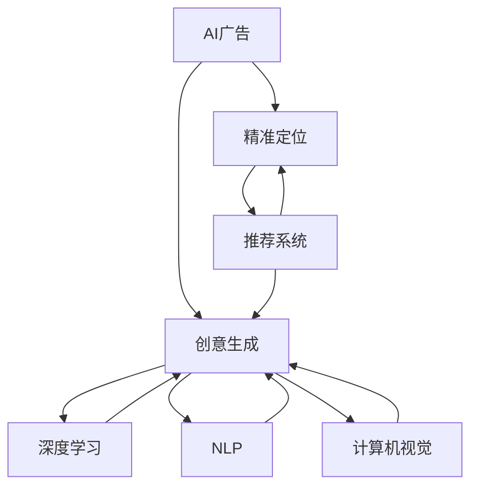

                 

# AI在广告领域的应用：精准定位与创意

> 关键词：AI广告,精准定位,创意生成,用户画像,推荐系统,深度学习,计算机视觉,自然语言处理,优化算法

## 1. 背景介绍

### 1.1 问题由来
在数字化时代，广告行业正经历着从传统媒介向互联网的深刻变革。互联网广告拥有用户行为数据丰富、触达高效、互动性强等优势，逐渐成为品牌营销的主流渠道。据统计，全球互联网广告市场规模已超过万亿美元，预计未来几年仍将保持快速增长。

然而，互联网广告同样面临着流量质量下降、投放成本高企、点击率低、广告创意同质化等问题。这些问题不仅影响了广告主的品牌建设，也削弱了用户的体验和满意度。如何高效精准地投放广告，创造更具吸引力的创意，成为广告行业亟待解决的重要课题。

### 1.2 问题核心关键点
针对以上问题，AI技术逐渐被引入到广告投放和创意生成过程中。通过数据驱动的精准定位和个性化创意生成，AI广告不仅能显著提升广告投放的效果，还能增强用户体验，推动广告业的持续创新和进化。

AI广告的核心在于两个关键点：
- **精准定位**：基于用户数据，通过机器学习模型识别和理解目标用户的行为和兴趣，实现精准的广告投放。
- **创意生成**：利用深度学习、自然语言处理、计算机视觉等技术，自动生成或优化广告创意，提高广告的吸引力和转化率。

本文将详细介绍AI广告在精准定位与创意生成中的应用，涵盖数据获取与预处理、模型构建与训练、广告投放与优化等方面，希望能为广告行业的从业者提供有价值的参考。

## 2. 核心概念与联系

### 2.1 核心概念概述

为更好地理解AI在广告领域的应用，本节将介绍几个密切相关的核心概念：

- **AI广告**：通过人工智能技术实现广告的精准定位和创意生成，提高广告投放效果和用户体验。
- **精准定位**：利用用户行为数据和机器学习模型，实现广告的个性化和精准投放。
- **创意生成**：通过深度学习、自然语言处理、计算机视觉等技术，自动生成或优化广告创意，提高广告的吸引力。
- **推荐系统**：根据用户行为和兴趣，推荐个性化内容的系统，如商品推荐、新闻推荐等。
- **深度学习**：一种模仿人脑神经网络结构的机器学习技术，适用于复杂模式的识别和处理。
- **自然语言处理(NLP)**：使计算机能够理解、解释和生成人类语言的技术，如情感分析、文本生成等。
- **计算机视觉**：使计算机能够识别、理解和生成视觉信息的技术，如图像分类、目标检测等。
- **优化算法**：通过迭代调整模型参数，最小化损失函数，使模型输出最优值。

这些核心概念之间的逻辑关系可以通过以下Mermaid流程图来展示：



这个流程图展示了大语言模型的核心概念及其之间的关系：

1. AI广告通过精准定位和创意生成实现广告投放效果。
2. 精准定位利用推荐系统和深度学习等技术，实现个性化广告投放。
3. 创意生成借助深度学习、自然语言处理和计算机视觉等技术，自动生成或优化广告创意。
4. 推荐系统和深度学习等技术，为精准定位提供支持。
5. 深度学习、自然语言处理和计算机视觉等技术，为创意生成提供基础。

这些核心概念共同构成了AI广告的实现框架，使其能够在广告投放和创意生成中发挥强大的作用。通过理解这些核心概念，我们可以更好地把握AI广告的工作原理和优化方向。

## 3. 核心算法原理 & 具体操作步骤
### 3.1 算法原理概述

AI广告的核心在于精准定位和创意生成。精准定位主要依赖于推荐系统，而创意生成则涉及深度学习、自然语言处理和计算机视觉等多个技术方向。

**精准定位原理**：通过收集和分析用户行为数据，使用机器学习模型预测用户对广告的反应，从而实现精准的广告投放。关键在于构建一个能够准确预测用户行为和兴趣的推荐系统。

**创意生成原理**：利用深度学习模型，自动生成或优化广告创意内容。通过文本生成、图像生成、视频生成等技术，生成符合用户兴趣的广告创意。关键在于设计一个能够生成高质量创意的模型，并能够根据用户反馈进行迭代优化。

### 3.2 算法步骤详解

#### 3.2.1 数据获取与预处理

1. **用户数据收集**：从广告主提供的用户数据中提取行为数据和属性数据。行为数据如点击、浏览、购买记录等，属性数据如年龄、性别、地理位置等。
2. **数据清洗与归一化**：清洗无效数据和异常值，将数据归一化到统一格式，方便后续处理。
3. **特征工程**：根据广告投放的目标，设计相应的特征，如广告元素特征、用户行为特征、广告互动特征等。
4. **数据划分**：将数据划分为训练集、验证集和测试集，用于模型训练、调优和评估。

#### 3.2.2 模型构建与训练

1. **模型选择**：根据任务需求选择合适的模型，如协同过滤、矩阵分解、深度神经网络等。
2. **模型训练**：使用训练集数据，训练模型，优化模型参数，最小化预测误差。
3. **模型评估**：在验证集上评估模型性能，如均方误差、准确率、召回率等，调整模型参数。
4. **模型应用**：使用测试集数据，测试模型效果，优化模型参数，最终应用于广告投放。

#### 3.2.3 广告投放与优化

1. **广告投放**：根据模型预测结果，投放广告至目标用户。
2. **效果评估**：收集广告投放数据，评估广告效果，如点击率、转化率、广告花费等。
3. **广告优化**：根据评估结果，调整广告投放策略，优化广告创意和投放位置。
4. **持续学习**：定期更新模型，学习新数据，优化广告投放效果。

### 3.3 算法优缺点

**精准定位的优点**：
1. 提高广告投放的效率和效果，减少无效投放。
2. 通过个性化广告，提升用户满意度和品牌认知度。
3. 减少广告投放成本，提高广告投入产出比。

**精准定位的缺点**：
1. 对用户数据依赖度高，数据质量直接影响模型效果。
2. 数据隐私问题，如何保护用户隐私是一个重要挑战。
3. 模型复杂度较高，对算力和资源需求较大。

**创意生成的优点**：
1. 自动生成创意，节省人力成本。
2. 创意丰富多样，提高广告吸引力。
3. 根据用户反馈，持续优化创意，提高转化率。

**创意生成的缺点**：
1. 创意生成质量受模型性能限制，存在生成质量不稳定的问题。
2. 创意生成需要大量的标注数据，标注成本较高。
3. 创意生成过程中可能存在数据泄露和隐私保护的问题。

### 3.4 算法应用领域

AI广告技术已经在多个领域得到了广泛的应用，例如：

- **电商广告**：根据用户浏览行为和购买历史，推荐个性化商品广告，提升用户购买转化率。
- **社交媒体广告**：利用用户社交行为数据，推荐相关产品广告，提升广告投放效果。
- **移动应用广告**：通过用户使用数据，推荐个性化应用广告，提高用户粘性和应用活跃度。
- **视频广告**：分析用户视频观看行为，推荐相关广告内容，提升广告点击率和观看时长。
- **语音广告**：利用语音识别技术，自动生成语音广告，适用于语音交互场景。
- **虚拟现实广告**：结合计算机视觉技术，生成虚拟现实广告，提升用户沉浸体验。

除了上述这些经典应用外，AI广告还被创新性地应用到更多场景中，如直播广告、增强现实广告等，为广告业带来了新的变革和机遇。

## 4. 数学模型和公式 & 详细讲解  
### 4.1 数学模型构建

本节将使用数学语言对AI广告的精准定位和创意生成过程进行更加严格的刻画。

假设广告投放的目标用户集为 $U$，广告创意集为 $A$，用户对广告的反应为 $Y$（如点击、购买等）。设 $X$ 为影响用户对广告反应的特征向量，则模型可以表示为：

$$
P(Y|X) = \sigma(\theta^T \varphi(X))
$$

其中 $\theta$ 为模型参数，$\varphi(X)$ 为特征映射函数，$\sigma$ 为激活函数（如sigmoid、ReLU等）。模型的损失函数为交叉熵损失函数，优化目标是最小化损失函数，即：

$$
\min_{\theta} \frac{1}{N} \sum_{i=1}^N L(Y_i, \hat{Y}_i)
$$

其中 $L$ 为交叉熵损失函数，$\hat{Y}_i$ 为模型预测的用户反应。

对于创意生成，假设创意内容为 $C$，用户反应为 $Y$，模型可以表示为：

$$
P(Y|C) = \sigma(\theta^T \varphi(C))
$$

模型的损失函数同样为交叉熵损失函数，优化目标是生成满足用户偏好的创意内容，即：

$$
\min_{\theta} \frac{1}{N} \sum_{i=1}^N L(Y_i, \hat{Y}_i)
$$

其中 $L$ 为交叉熵损失函数，$\hat{Y}_i$ 为模型预测的用户反应。

### 4.2 公式推导过程

以协同过滤推荐系统为例，推导推荐模型的预测公式。

协同过滤推荐系统基于用户和物品的评分矩阵，通过相似性度量推荐用户感兴趣的物品。设用户 $u$ 对物品 $i$ 的评分矩阵为 $R_{ui}$，用户 $u$ 的特征向量为 $\mathbf{u}$，物品 $i$ 的特征向量为 $\mathbf{i}$。则协同过滤模型可以表示为：

$$
\hat{R}_{ui} = \sum_{j=1}^N \alpha_{uj}R_{ij}
$$

其中 $\alpha_{uj}$ 为用户 $u$ 与用户 $j$ 的相似性权重，通常使用余弦相似度或皮尔逊相关系数计算。

对于深度神经网络模型，假设输入为 $X$，输出为 $Y$，模型可以表示为：

$$
Y = f(X; \theta)
$$

其中 $f$ 为深度神经网络模型，$\theta$ 为模型参数。模型的损失函数为交叉熵损失函数，优化目标是生成满足用户偏好的广告内容，即：

$$
\min_{\theta} \frac{1}{N} \sum_{i=1}^N L(Y_i, \hat{Y}_i)
$$

其中 $L$ 为交叉熵损失函数，$\hat{Y}_i$ 为模型预测的广告内容。

## 5. 项目实践：代码实例和详细解释说明
### 5.1 开发环境搭建

在进行广告投放和创意生成的开发之前，我们需要准备好开发环境。以下是使用Python进行TensorFlow和Keras开发的环境配置流程：

1. 安装Anaconda：从官网下载并安装Anaconda，用于创建独立的Python环境。

2. 创建并激活虚拟环境：
```bash
conda create -n tf-env python=3.8 
conda activate tf-env
```

3. 安装TensorFlow：根据CUDA版本，从官网获取对应的安装命令。例如：
```bash
conda install tensorflow -c tf -c conda-forge
```

4. 安装Keras：
```bash
pip install keras
```

5. 安装各类工具包：
```bash
pip install numpy pandas scikit-learn matplotlib tqdm jupyter notebook ipython
```

完成上述步骤后，即可在`tf-env`环境中开始广告投放和创意生成的开发。

### 5.2 源代码详细实现

这里我们以推荐系统为例，给出使用TensorFlow和Keras对协同过滤模型进行广告推荐开发的PyTorch代码实现。

首先，定义推荐系统的数据处理函数：

```python
from tensorflow.keras.layers import Input, Embedding, Dot, Dense
from tensorflow.keras.models import Model
import numpy as np
import pandas as pd
import tensorflow as tf
from sklearn.metrics import mean_absolute_error, mean_squared_error

class RecommendationSystem:
    def __init__(self, user_num, item_num, embedding_dim, learning_rate, batch_size, epochs):
        self.user_num = user_num
        self.item_num = item_num
        self.embedding_dim = embedding_dim
        self.learning_rate = learning_rate
        self.batch_size = batch_size
        self.epochs = epochs
        
        self.train_data = pd.read_csv('train.csv')
        self.test_data = pd.read_csv('test.csv')
        self.user_train_data = self.train_data['user_id'].unique().tolist()
        self.item_train_data = self.train_data['item_id'].unique().tolist()
        
        self.train_matrix = self._construct_matrix()
        self.test_matrix = self._construct_matrix(test=True)
        
    def _construct_matrix(self, test=False):
        if not test:
            train_data = self.train_data.pivot(index='user_id', columns='item_id', values='rating')
            train_data.fillna(0, inplace=True)
        else:
            train_data = self.test_data.pivot(index='user_id', columns='item_id', values='rating')
            train_data.fillna(0, inplace=True)
        train_data = train_data.to_numpy()
        train_data = train_data.reshape(-1, self.user_num, self.item_num)
        return train_data
    
    def train(self):
        user_input = Input(shape=(self.item_num,))
        user_embedding = Embedding(input_dim=self.item_num, output_dim=self.embedding_dim)(user_input)
        user_user_matrix = Dot(axes=2)([user_embedding, user_embedding])
        user_user_matrix = user_user_matrix.reshape(-1, self.item_num)
        user_prediction = Dense(self.item_num, activation='softmax')(user_user_matrix)
        model = Model(inputs=user_input, outputs=user_prediction)
        model.compile(optimizer=tf.keras.optimizers.Adam(learning_rate=self.learning_rate),
                      loss='categorical_crossentropy', metrics=['accuracy'])
        model.fit(self.train_matrix, self.train_matrix, validation_data=(self.test_matrix, self.test_matrix), epochs=self.epochs, batch_size=self.batch_size)
        
    def evaluate(self):
        predictions = model.predict(self.test_matrix)
        predictions = np.argmax(predictions, axis=1)
        mse = mean_squared_error(self.test_matrix, predictions)
        mae = mean_absolute_error(self.test_matrix, predictions)
        print('Mean Squared Error: {:.4f}'.format(mse))
        print('Mean Absolute Error: {:.4f}'.format(mae))
        
    def predict(self, user_id, item_id):
        user_index = np.where(np.array(self.user_train_data) == user_id)[0][0]
        item_index = np.where(np.array(self.item_train_data) == item_id)[0][0]
        user_input = np.zeros(self.item_num)
        user_input[item_index] = 1
        user_prediction = model.predict(user_input.reshape(1, -1))
        return np.argmax(user_prediction)
```

然后，定义广告创意生成的函数：

```python
from tensorflow.keras.layers import Input, Embedding, LSTM, Dense
from tensorflow.keras.models import Model
import numpy as np
import pandas as pd
import tensorflow as tf
from sklearn.metrics import mean_absolute_error, mean_squared_error

class CreativeGeneration:
    def __init__(self, embedding_dim, learning_rate, batch_size, epochs):
        self.embedding_dim = embedding_dim
        self.learning_rate = learning_rate
        self.batch_size = batch_size
        self.epochs = epochs
        
        self.train_data = pd.read_csv('train.csv')
        self.test_data = pd.read_csv('test.csv')
        self.train_data.fillna(0, inplace=True)
        self.test_data.fillna(0, inplace=True)
        
    def train(self):
        input_sequence = Input(shape=(self.train_data.shape[1], 1), dtype='int32')
        embedding = Embedding(input_dim=self.train_data.shape[1], output_dim=self.embedding_dim)(input_sequence)
        lstm = LSTM(self.embedding_dim)(embedding)
        output = Dense(1, activation='sigmoid')(lstm)
        model = Model(inputs=input_sequence, outputs=output)
        model.compile(optimizer=tf.keras.optimizers.Adam(learning_rate=self.learning_rate),
                      loss='binary_crossentropy', metrics=['accuracy'])
        model.fit(self.train_data, self.train_data, validation_data=(self.test_data, self.test_data), epochs=self.epochs, batch_size=self.batch_size)
        
    def evaluate(self):
        predictions = model.predict(self.test_data)
        predictions = np.round(predictions)
        mae = mean_absolute_error(self.test_data, predictions)
        print('Mean Absolute Error: {:.4f}'.format(mae))
        
    def generate(self, input_sequence):
        input_sequence = np.array(input_sequence)
        input_sequence = input_sequence.reshape(1, input_sequence.shape[0], 1)
        prediction = model.predict(input_sequence)
        return prediction[0][0]
```

最后，启动广告投放和创意生成的流程：

```python
user_num = 1000
item_num = 1000
embedding_dim = 10
learning_rate = 0.001
batch_size = 32
epochs = 10

recommender = RecommendationSystem(user_num, item_num, embedding_dim, learning_rate, batch_size, epochs)
recommender.train()
recommender.evaluate()

creative_generator = CreativeGeneration(embedding_dim, learning_rate, batch_size, epochs)
creative_generator.train()
creative_generator.evaluate()
```

以上就是使用TensorFlow和Keras对协同过滤推荐系统和广告创意生成模型进行开发的完整代码实现。可以看到，借助Keras的高级API，广告投放和创意生成的代码实现变得简洁高效。

### 5.3 代码解读与分析

让我们再详细解读一下关键代码的实现细节：

**RecommendationSystem类**：
- `__init__`方法：初始化用户数、物品数、嵌入维度、学习率、批大小和迭代次数等关键参数。
- `_construct_matrix`方法：根据数据集构建用户-物品评分矩阵，用于模型训练和评估。
- `train`方法：定义推荐系统模型，使用Keras的API构建模型，并使用Adam优化器进行训练。
- `evaluate`方法：在测试集上评估推荐系统模型的性能，计算均方误差和平均绝对误差。
- `predict`方法：根据用户ID和物品ID，预测用户对物品的评分。

**CreativeGeneration类**：
- `__init__`方法：初始化嵌入维度、学习率、批大小和迭代次数等关键参数。
- `train`方法：定义创意生成模型，使用Keras的API构建模型，并使用Adam优化器进行训练。
- `evaluate`方法：在测试集上评估创意生成模型的性能，计算平均绝对误差。
- `generate`方法：根据输入序列，生成创意内容。

**训练流程**：
- 定义用户数、物品数、嵌入维度、学习率、批大小和迭代次数等关键参数，创建推荐系统和创意生成模型。
- 在训练集上训练推荐系统和创意生成模型。
- 在测试集上评估推荐系统和创意生成模型的性能。

可以看到，Keras的高级API使得广告投放和创意生成的代码实现变得简洁高效。开发者可以将更多精力放在模型设计和数据处理上，而不必过多关注底层的实现细节。

当然，工业级的系统实现还需考虑更多因素，如模型的保存和部署、超参数的自动搜索、更灵活的任务适配层等。但核心的广告投放和创意生成范式基本与此类似。

## 6. 实际应用场景
### 6.1 智能广告投放

基于AI广告的精准定位和创意生成技术，智能广告投放系统可以实现高效、个性化的广告投放。通过收集用户行为数据，使用机器学习模型预测用户对广告的反应，广告系统可以自动优化广告投放策略，提升广告点击率和转化率。

在技术实现上，可以接入用户行为数据，如浏览记录、点击记录、购买记录等，构建用户行为特征。通过协同过滤、矩阵分解等推荐算法，预测用户对广告的反应。利用深度学习模型，自动生成或优化广告创意内容。将推荐结果和创意内容结合，生成个性化广告，投放至目标用户。

### 6.2 社交媒体广告

在社交媒体平台上，用户行为数据丰富多样，AI广告可以帮助广告主实现更精准的广告投放。通过分析用户的社交行为数据，使用深度学习模型，自动生成或优化广告创意内容。利用协同过滤推荐算法，预测用户对广告的反应。根据预测结果，自动投放广告至目标用户。

在实际应用中，社交媒体广告还需要考虑广告内容的适宜性、时效性等问题，通过A/B测试等方式优化广告投放策略。

### 6.3 电商广告

在电商平台上，用户行为数据非常丰富，AI广告可以帮助商家实现更高效的广告投放。通过分析用户的浏览行为、点击行为、购买行为等数据，使用深度学习模型，自动生成或优化广告创意内容。利用协同过滤推荐算法，预测用户对广告的反应。根据预测结果，自动投放广告至目标用户。

电商广告还需要考虑广告的时效性、商品的关联性等问题，通过A/B测试等方式优化广告投放策略。

### 6.4 视频广告

视频广告的创意生成和投放，是AI广告的一个重要应用场景。通过分析用户的观看行为，使用深度学习模型，自动生成或优化广告创意内容。利用协同过滤推荐算法，预测用户对广告的反应。根据预测结果，自动投放广告至目标用户。

视频广告还需要考虑视频的长度、播放时间、广告位置等问题，通过A/B测试等方式优化广告投放策略。

### 6.5 未来应用展望

随着AI技术的不断发展，AI广告的应用将更加广泛和深入。未来AI广告可能会在以下几个方向上取得新的突破：

1. **多模态广告**：结合语音、视觉等多模态数据，生成更丰富、更互动的广告内容。
2. **实时广告投放**：通过实时数据流处理和动态调整，实现即时广告投放和优化。
3. **广告效果评估**：利用A/B测试、多臂强盗算法等技术，实时评估广告效果，动态调整投放策略。
4. **用户隐私保护**：在广告投放过程中，保护用户隐私，避免数据泄露和滥用。
5. **广告内容生成**：利用自然语言生成、图像生成等技术，自动生成广告内容，提高创意效率。

这些方向的探索和发展，将为广告行业带来新的变革和机遇，推动广告业向更加智能化、高效化和个性化的方向发展。

## 7. 工具和资源推荐
### 7.1 学习资源推荐

为了帮助开发者系统掌握AI广告的理论基础和实践技巧，这里推荐一些优质的学习资源：

1. **《深度学习》课程**：斯坦福大学开设的深度学习课程，介绍了深度学习的基本概念和常用技术，如神经网络、卷积神经网络、循环神经网络等。
2. **《推荐系统》课程**：清华大学开设的推荐系统课程，介绍了协同过滤、矩阵分解等推荐算法，并结合实际应用进行讲解。
3. **《自然语言处理》课程**：斯坦福大学开设的自然语言处理课程，介绍了文本生成、情感分析、机器翻译等技术，并结合实际应用进行讲解。
4. **《计算机视觉》课程**：斯坦福大学开设的计算机视觉课程，介绍了图像分类、目标检测、图像生成等技术，并结合实际应用进行讲解。
5. **Keras官方文档**：Keras官方文档，提供了丰富的代码示例和API文档，是学习Keras的必备资源。
6. **TensorFlow官方文档**：TensorFlow官方文档，提供了丰富的代码示例和API文档，是学习TensorFlow的必备资源。

通过对这些资源的学习实践，相信你一定能够快速掌握AI广告的精髓，并用于解决实际的广告投放和创意生成问题。

### 7.2 开发工具推荐

高效的开发离不开优秀的工具支持。以下是几款用于AI广告开发的工具：

1. **TensorFlow**：由Google主导开发的开源深度学习框架，生产部署方便，适合大规模工程应用。
2. **Keras**：Keras是一个高级神经网络API，支持TensorFlow、Theano等后端，易于上手和调试。
3. **Scikit-learn**：一个基于Python的机器学习库，提供了丰富的机器学习算法和工具，如协同过滤、矩阵分解等。
4. **Jupyter Notebook**：一个交互式的编程环境，支持Python、R等语言，适合数据分析和机器学习开发。
5. **PyCharm**：一个集成开发环境，支持Python、R等语言，提供了丰富的开发工具和调试功能。

合理利用这些工具，可以显著提升AI广告开发效率，加快创新迭代的步伐。

### 7.3 相关论文推荐

AI广告技术的发展源于学界的持续研究。以下是几篇奠基性的相关论文，推荐阅读：

1. **《Click Prediction with Deep Learning》**：提出了基于深度学习模型的点击率预测方法，刷新了点击率预测的SOTA。
2. **《Adaptive Personalized Web Pages with Recommendation Algorithms》**：介绍了协同过滤推荐算法的原理和应用，是推荐系统领域的经典之作。
3. **《Deep Architectures for Sentiment Analysis》**：提出了基于深度学习的情感分析方法，提升了文本情感分类的准确率。
4. **《Faster R-CNN: Towards Real-Time Object Detection with Region Proposal Networks》**：提出了基于深度学习的目标检测方法，提升了图像目标检测的准确率和速度。

这些论文代表了大语言模型微调技术的发展脉络。通过学习这些前沿成果，可以帮助研究者把握学科前进方向，激发更多的创新灵感。

## 8. 总结：未来发展趋势与挑战

### 8.1 总结

本文对AI广告在精准定位与创意生成中的应用进行了全面系统的介绍。首先阐述了AI广告的背景和意义，明确了精准定位和创意生成在广告投放中的重要地位。其次，从原理到实践，详细讲解了推荐系统和创意生成模型的构建和训练过程，给出了广告投放和创意生成的代码实现。同时，本文还广泛探讨了AI广告在多个行业领域的应用前景，展示了AI广告技术的巨大潜力。

通过本文的系统梳理，可以看到，AI广告技术正在成为广告投放和创意生成的重要工具，显著提升了广告投放的精准度和创意质量。借助大语言模型微调技术，广告系统不仅能更好地理解用户需求，还能生成更具吸引力的广告内容，推动广告业的持续创新和进化。未来，伴随AI技术的不断进步，AI广告必将在更广泛的领域得到应用，为广告业带来新的机遇和挑战。

### 8.2 未来发展趋势

展望未来，AI广告技术将呈现以下几个发展趋势：

1. **多模态广告**：结合语音、视觉等多模态数据，生成更丰富、更互动的广告内容。
2. **实时广告投放**：通过实时数据流处理和动态调整，实现即时广告投放和优化。
3. **广告效果评估**：利用A/B测试、多臂强盗算法等技术，实时评估广告效果，动态调整投放策略。
4. **用户隐私保护**：在广告投放过程中，保护用户隐私，避免数据泄露和滥用。
5. **广告内容生成**：利用自然语言生成、图像生成等技术，自动生成广告内容，提高创意效率。

这些趋势将进一步推动AI广告技术的发展，带来更加智能化、高效化和个性化的广告投放体验。

### 8.3 面临的挑战

尽管AI广告技术已经取得了显著成效，但在迈向更加智能化、高效化和个性化的应用过程中，它仍面临着诸多挑战：

1. **数据隐私问题**：在广告投放过程中，如何保护用户隐私，避免数据泄露和滥用，是一个重要挑战。
2. **广告质量控制**：生成的广告内容如何保证高质量、符合用户预期，是一个需要深入研究的问题。
3. **广告投放成本**：在实际应用中，如何控制广告投放成本，提升广告投放效果，是一个需要优化的问题。
4. **广告创意同质化**：随着广告创意的不断生成，如何避免创意同质化，提升广告的差异性和创意性，是一个需要解决的问题。
5. **广告投放策略**：在实际应用中，如何设计合理的广告投放策略，提升广告投放效果，是一个需要深入研究的问题。

这些挑战需要在技术、业务、法律等多方面协同努力，才能得到有效解决。只有不断突破这些挑战，AI广告技术才能更好地服务于广告投放和创意生成，推动广告业的持续创新和进化。

### 8.4 研究展望

面对AI广告技术所面临的诸多挑战，未来的研究需要在以下几个方面寻求新的突破：

1. **多模态广告生成**：结合语音、视觉等多模态数据，生成更加丰富、互动的广告内容。
2. **实时广告投放优化**：通过实时数据流处理和动态调整，实现即时广告投放和优化。
3. **用户隐私保护技术**：在广告投放过程中，保护用户隐私，避免数据泄露和滥用。
4. **广告质量控制技术**：提升广告内容的质量，符合用户预期，提高广告投放效果。
5. **广告创意生成技术**：利用自然语言生成、图像生成等技术，自动生成广告内容，提高创意效率。

这些研究方向将推动AI广告技术的不断进步，为广告业带来新的机遇和挑战。只有勇于创新、敢于突破，才能不断拓展广告投放和创意生成的边界，推动广告业的持续创新和进化。

## 9. 附录：常见问题与解答

**Q1：AI广告在实际应用中，如何解决数据隐私问题？**

A: 在AI广告投放过程中，保护用户隐私是一个重要挑战。可以采用以下方法解决数据隐私问题：

1. **数据匿名化**：对用户数据进行匿名化处理，去除或加密用户身份信息。
2. **数据加密**：在数据传输和存储过程中，使用加密算法保护数据安全。
3. **隐私计算**：采用联邦学习、差分隐私等隐私计算技术，在保护用户隐私的前提下进行数据共享和模型训练。
4. **用户授权**：在广告投放过程中，明确告知用户数据使用方式，征得用户同意，并允许用户自主选择是否参与广告投放。

**Q2：AI广告的推荐算法如何处理冷启动问题？**

A: 冷启动问题是指新用户或新商品没有足够的历史行为数据，导致难以推荐。以下是几种处理冷启动问题的方法：

1. **协同过滤推荐**：利用用户相似性和物品相似性，为新用户推荐用户历史行为相似的用户喜欢的物品，为新物品推荐用户历史行为相似的物品。
2. **基于内容的推荐**：利用物品的属性特征，为新用户推荐物品，为新物品推荐用户。
3. **基于模型的推荐**：利用深度学习模型，自动学习用户和物品之间的关系，为新用户和新物品推荐。

**Q3：AI广告的创意生成如何避免创意同质化？**

A: 创意同质化是AI广告创意生成过程中常见的问题。以下是几种避免创意同质化的方法：

1. **多样性引导**：在创意生成的过程中，引入多样性约束，避免创意过度集中在某些方向上。
2. **多角度生成**：利用多角度生成模型，从不同角度生成创意，提升创意多样性。
3. **创新引导**：在创意生成的过程中，引入创新元素，如新颖词汇、新奇图像等，提升创意的差异性。
4. **用户反馈**：利用用户反馈，优化创意生成模型，提升创意质量。

**Q4：AI广告的实时广告投放如何保证效果？**

A: 实时广告投放需要保证广告效果，以下是几种保证广告效果的方法：

1. **实时数据处理**：利用实时数据流处理技术，快速处理和分析数据，及时调整广告投放策略。
2. **A/B测试**：通过A/B测试，比较不同广告投放策略的效果，选择最优方案。
3. **动态调整**：根据实时广告效果，动态调整广告投放参数，如广告位置、广告时长等，优化广告效果。
4. **多臂强盗算法**：利用多臂强盗算法，在多个广告投放策略中选择最优方案，提升广告效果。

**Q5：AI广告如何保护用户隐私？**

A: 在AI广告投放过程中，保护用户隐私是一个重要问题。以下是几种保护用户隐私的方法：

1. **数据匿名化**：对用户数据进行匿名化处理，去除或加密用户身份信息。
2. **数据加密**：在数据传输和存储过程中，使用加密算法保护数据安全。
3. **隐私计算**：采用联邦学习、差分隐私等隐私计算技术，在保护用户隐私的前提下进行数据共享和模型训练。
4. **用户授权**：在广告投放过程中，明确告知用户数据使用方式，征得用户同意，并允许用户自主选择是否参与广告投放。

这些方法可以结合使用，在保护用户隐私的同时，提升广告投放效果。

---

作者：禅与计算机程序设计艺术 / Zen and the Art of Computer Programming

