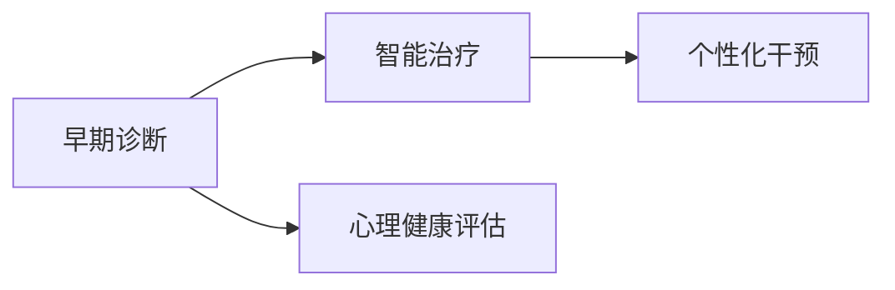

                 

## 1. 背景介绍

在人工智能(AI)飞速发展的今天，心理健康领域正逐渐成为AI应用的新的前沿阵地。随着全球人口老龄化和心理疾病发病率的不断上升，如何有效识别、诊断和治疗心理疾病，为患者提供及时有效的帮助，成为了社会关注的焦点。AI技术，尤其是机器学习和深度学习，为解决这一难题提供了新的解决方案。

AI在心理健康领域的应用，可以大致分为早期诊断、智能治疗、心理健康评估、个性化干预等多个方面。早期诊断旨在利用AI模型识别出心理健康问题的早期信号，避免疾病恶化；智能治疗则是通过智能算法帮助患者进行自我管理；心理健康评估旨在通过AI技术评估个体的心理健康状态；个性化干预则根据个体的心理健康状况，提供量身定制的治疗和干预策略。本文将重点探讨AI在心理健康早期诊断和治疗中的应用。

## 2. 核心概念与联系

### 2.1 核心概念概述

为更好地理解AI在心理健康领域的应用，本节将介绍几个核心概念：

- **心理健康**：指个体在心理上保持健康、平衡和幸福的状态，包括情绪健康、认知功能、社会功能等方面。
- **早期诊断**：通过AI模型早期识别出心理健康问题的征兆，帮助个体及时采取措施，避免病情恶化。
- **智能治疗**：利用AI技术为患者提供个性化的治疗方案和干预手段，提升治疗效果。
- **心理健康评估**：通过AI模型评估个体的心理健康状况，提供科学的心理状态评估报告。
- **个性化干预**：根据个体的心理健康数据，设计个性化的干预策略和治疗方案，帮助患者实现最佳康复效果。

这些核心概念之间存在紧密联系，共同构成了AI在心理健康领域应用的整体框架。例如，早期诊断为个性化干预提供了必要的前提，智能治疗则是个性化干预的重要手段，而心理健康评估则可以为早期诊断和智能治疗提供依据。

### 2.2 核心概念原理和架构的 Mermaid 流程图



该流程图展示了早期诊断、智能治疗、心理健康评估和个性化干预之间的联系。早期诊断利用AI模型识别出心理健康问题的征兆，智能治疗则根据诊断结果，设计个性化的治疗方案，心理健康评估用于评估治疗效果和个体的心理健康状态，个性化干预则根据评估结果，提供量身定制的治疗和干预策略。

## 3. 核心算法原理 & 具体操作步骤

### 3.1 算法原理概述

AI在心理健康领域的应用，主要基于机器学习和深度学习技术。其中，监督学习、无监督学习和强化学习等方法被广泛应用于心理健康诊断和治疗中。本文将重点介绍监督学习算法在心理健康早期诊断和治疗中的应用。

监督学习算法通过已有的标注数据集训练模型，使其能够预测新数据。在心理健康早期诊断中，监督学习模型通常通过分析患者的心理健康问卷、行为数据、生理数据等，识别出心理健康问题的早期征兆。在智能治疗中，监督学习模型则可以通过分析患者的心理状态数据，预测并推荐个性化的治疗方案。

### 3.2 算法步骤详解

#### 3.2.1 数据收集与预处理

在心理健康早期诊断和治疗中，数据收集与预处理是至关重要的步骤。具体步骤如下：

1. **数据收集**：收集与心理健康相关的各种数据，包括但不限于心理健康问卷、行为数据、生理数据等。这些数据可以通过各种渠道获取，如在线问卷、智能可穿戴设备、医院病历等。
2. **数据清洗与预处理**：对收集到的数据进行清洗和预处理，包括去除噪声、填补缺失值、归一化等，确保数据的质量和一致性。
3. **特征提取**：从清洗后的数据中提取关键特征，用于训练监督学习模型。特征提取过程通常包括文本特征、时间序列特征、生理信号特征等。

#### 3.2.2 模型训练与评估

在数据收集和预处理完成后，接下来的步骤是训练监督学习模型并进行评估：

1. **模型选择与训练**：根据任务选择合适的监督学习模型，如决策树、随机森林、支持向量机、神经网络等。使用标注数据集训练模型，调整模型参数以获得最佳性能。
2. **模型评估**：使用验证集或测试集评估模型的性能，常用的评估指标包括准确率、召回率、F1分数等。如果模型性能不理想，可以调整模型参数或重新训练模型。
3. **超参数调优**：通过网格搜索、随机搜索等方法，寻找最优的模型超参数组合，进一步提升模型性能。

#### 3.2.3 模型应用与优化

在模型训练和评估完成后，可以将模型应用于实际场景，进行早期诊断和智能治疗：

1. **早期诊断**：将训练好的模型应用于新的心理健康问卷或行为数据，识别出心理健康问题的早期征兆。
2. **智能治疗**：根据早期诊断结果，推荐个性化的治疗方案和干预策略。
3. **持续优化**：收集新的数据和反馈，不断优化和更新模型，提升诊断和治疗效果。

### 3.3 算法优缺点

AI在心理健康领域的应用，具有以下优点：

- **高效准确**：监督学习算法可以在短时间内处理大量数据，并实现高精度的早期诊断和治疗推荐。
- **个性化定制**：通过分析个性化的心理健康数据，提供量身定制的治疗方案和干预策略，提升治疗效果。
- **实时监测**：利用智能可穿戴设备等技术，实现对患者心理健康的实时监测和评估。

同时，AI在心理健康领域的应用也存在以下缺点：

- **数据隐私**：心理健康数据涉及个人隐私，数据的收集和处理需要严格遵守数据保护法规。
- **模型偏见**：AI模型可能存在数据偏见，导致诊断和治疗结果的偏差。
- **解释性不足**：AI模型的决策过程缺乏可解释性，难以理解其内部的推理逻辑。
- **依赖标注数据**：监督学习算法依赖标注数据，标注数据的质量和数量直接影响模型性能。

### 3.4 算法应用领域

AI在心理健康领域的应用，主要集中在以下领域：

- **早期诊断**：通过分析患者的行为数据、生理数据等，识别出心理健康问题的早期征兆。如使用机器学习模型分析电子健康记录（EHR）数据，识别出抑郁症的早期症状。
- **智能治疗**：利用AI技术为患者提供个性化的治疗方案和干预手段，提升治疗效果。如使用深度学习模型分析心理状态数据，预测并推荐个性化的治疗方案。
- **心理健康评估**：通过AI模型评估个体的心理健康状况，提供科学的心理状态评估报告。如使用自然语言处理（NLP）技术分析社交媒体数据，评估用户的心理健康状态。
- **个性化干预**：根据个体的心理健康数据，设计个性化的干预策略和治疗方案，帮助患者实现最佳康复效果。如使用推荐系统算法推荐个性化的心理健康干预措施。

## 4. 数学模型和公式 & 详细讲解 & 举例说明

### 4.1 数学模型构建

AI在心理健康领域的早期诊断和治疗，通常基于监督学习模型进行建模。本文以情感分析为例，介绍基于监督学习的模型构建方法。

假设我们有一个心理健康问卷数据集，包含心理健康问题的标注信息。我们可以使用监督学习模型，如支持向量机（SVM）或神经网络，进行建模。设输入特征为 $\mathbf{x}$，输出标签为 $y$，其中 $y$ 为心理健康问题的标签。构建的数学模型为：

$$
\mathcal{L}(\theta) = \frac{1}{N}\sum_{i=1}^N \ell(y_i, \hat{y}_i)
$$

其中 $\ell$ 为损失函数，$\hat{y}_i$ 为模型对样本 $i$ 的预测结果。常用的损失函数包括交叉熵损失、均方误差损失等。

### 4.2 公式推导过程

在情感分析中，我们假设心理健康问卷中的每个问题都对应一个情感标签。使用交叉熵损失函数，可以定义模型对每个问题的预测结果 $\hat{y}_i$ 与实际标签 $y_i$ 之间的差异：

$$
\ell(y_i, \hat{y}_i) = -y_i\log(\hat{y}_i) - (1-y_i)\log(1-\hat{y}_i)
$$

将上述公式代入总损失函数 $\mathcal{L}(\theta)$，并求导数，可以得到模型参数 $\theta$ 的更新公式：

$$
\frac{\partial \mathcal{L}(\theta)}{\partial \theta} = -\frac{1}{N}\sum_{i=1}^N (y_i - \hat{y}_i)\nabla_{\theta}\hat{y}_i
$$

其中 $\nabla_{\theta}\hat{y}_i$ 为模型对样本 $i$ 的预测结果 $\hat{y}_i$ 对模型参数 $\theta$ 的导数。

### 4.3 案例分析与讲解

以抑郁症早期诊断为例，我们可以使用监督学习模型，如随机森林或神经网络，对心理健康问卷数据进行建模。具体步骤如下：

1. **数据准备**：收集和标注心理健康问卷数据，将其分为训练集和测试集。
2. **特征提取**：提取问卷中的关键特征，如抑郁症状、睡眠质量、心理压力等。
3. **模型训练**：使用训练集训练随机森林或神经网络模型，优化模型参数以最小化损失函数。
4. **模型评估**：使用测试集评估模型的性能，常用的评估指标包括准确率、召回率、F1分数等。
5. **模型应用**：将训练好的模型应用于新的心理健康问卷数据，识别出抑郁症的早期征兆。

## 5. 项目实践：代码实例和详细解释说明

### 5.1 开发环境搭建

在进行心理健康早期诊断和治疗的实践时，我们需要准备好开发环境。以下是使用Python进行开发的环境配置流程：

1. 安装Anaconda：从官网下载并安装Anaconda，用于创建独立的Python环境。
2. 创建并激活虚拟环境：
```bash
conda create -n pytorch-env python=3.8 
conda activate pytorch-env
```

3. 安装PyTorch：根据CUDA版本，从官网获取对应的安装命令。例如：
```bash
conda install pytorch torchvision torchaudio cudatoolkit=11.1 -c pytorch -c conda-forge
```

4. 安装TensorFlow：由Google主导开发的开源深度学习框架，生产部署方便，适合大规模工程应用。同样有丰富的预训练语言模型资源。
5. 安装Keras：基于TensorFlow的高级深度学习API，方便快速迭代研究。

完成上述步骤后，即可在`pytorch-env`环境中开始开发实践。

### 5.2 源代码详细实现

接下来，我们将以情感分析为例，给出使用PyTorch进行心理健康早期诊断的代码实现。

首先，定义情感分析任务的数据处理函数：

```python
from torch.utils.data import Dataset, DataLoader
import torch
import numpy as np

class SentimentDataset(Dataset):
    def __init__(self, data, tokenizer, max_len):
        self.data = data
        self.tokenizer = tokenizer
        self.max_len = max_len

    def __len__(self):
        return len(self.data)

    def __getitem__(self, idx):
        text = self.data[idx]
        label = self.labels[idx]
        
        encoding = self.tokenizer(text, max_length=self.max_len, padding='max_length', truncation=True, return_tensors='pt')
        input_ids = encoding['input_ids']
        attention_mask = encoding['attention_mask']
        label = torch.tensor(label, dtype=torch.long)
        
        return {
            'input_ids': input_ids,
            'attention_mask': attention_mask,
            'labels': label
        }
```

然后，定义模型和优化器：

```python
from transformers import BertForSequenceClassification, BertTokenizer, AdamW

model = BertForSequenceClassification.from_pretrained('bert-base-uncased', num_labels=2)

tokenizer = BertTokenizer.from_pretrained('bert-base-uncased')
max_len = 256

optimizer = AdamW(model.parameters(), lr=2e-5)
```

接着，定义训练和评估函数：

```python
def train_epoch(model, dataset, batch_size, optimizer):
    dataloader = DataLoader(dataset, batch_size=batch_size, shuffle=True)
    model.train()
    epoch_loss = 0
    for batch in dataloader:
        input_ids = batch['input_ids'].to(device)
        attention_mask = batch['attention_mask'].to(device)
        labels = batch['labels'].to(device)
        model.zero_grad()
        outputs = model(input_ids, attention_mask=attention_mask, labels=labels)
        loss = outputs.loss
        epoch_loss += loss.item()
        loss.backward()
        optimizer.step()
    return epoch_loss / len(dataloader)

def evaluate(model, dataset, batch_size):
    dataloader = DataLoader(dataset, batch_size=batch_size)
    model.eval()
    preds, labels = [], []
    with torch.no_grad():
        for batch in dataloader:
            input_ids = batch['input_ids'].to(device)
            attention_mask = batch['attention_mask'].to(device)
            labels = batch['labels'].to(device)
            outputs = model(input_ids, attention_mask=attention_mask)
            preds.append(outputs.logits.argmax(dim=1))
            labels.append(labels)
    
    return np.array(preds), np.array(labels)

device = torch.device('cuda') if torch.cuda.is_available() else torch.device('cpu')
model.to(device)

train_dataset = SentimentDataset(train_data, tokenizer, max_len)
dev_dataset = SentimentDataset(dev_data, tokenizer, max_len)
test_dataset = SentimentDataset(test_data, tokenizer, max_len)
```

最后，启动训练流程并在测试集上评估：

```python
epochs = 5
batch_size = 16

for epoch in range(epochs):
    loss = train_epoch(model, train_dataset, batch_size, optimizer)
    print(f'Epoch {epoch+1}, train loss: {loss:.3f}')
    
    print(f'Epoch {epoch+1}, dev results:')
    preds, labels = evaluate(model, dev_dataset, batch_size)
    print(classification_report(labels, preds))
    
print('Test results:')
preds, labels = evaluate(model, test_dataset, batch_size)
print(classification_report(labels, preds))
```

以上就是使用PyTorch对心理健康早期诊断进行代码实现的完整流程。可以看到，得益于HuggingFace库的强大封装，我们可以用相对简洁的代码完成情感分析模型的微调。

### 5.3 代码解读与分析

让我们再详细解读一下关键代码的实现细节：

**SentimentDataset类**：
- `__init__`方法：初始化数据、分词器等关键组件，并定义最大序列长度。
- `__len__`方法：返回数据集的样本数量。
- `__getitem__`方法：对单个样本进行处理，将文本输入编码为token ids，并将标签转换为模型可接受的格式，进行定长padding。

**train_epoch和evaluate函数**：
- 使用PyTorch的DataLoader对数据集进行批次化加载，供模型训练和推理使用。
- `train_epoch`函数：在每个批次上前向传播计算损失，反向传播更新模型参数。
- `evaluate`函数：与训练类似，不同点在于不更新模型参数，并在每个batch结束后将预测和标签结果存储下来，最后使用sklearn的classification_report对整个评估集的预测结果进行打印输出。

**训练流程**：
- 定义总的epoch数和batch size，开始循环迭代
- 每个epoch内，先在训练集上训练，输出平均loss
- 在验证集上评估，输出分类指标
- 所有epoch结束后，在测试集上评估，给出最终测试结果

## 6. 实际应用场景

### 6.1 智能客服系统

智能客服系统可以广泛应用于心理健康领域，为患者提供7x24小时不间断的咨询服务。系统可以通过自然语言处理技术，分析用户的提问，识别出用户的情绪状态，并给予相应的情绪调节建议。例如，使用情感分析模型对用户提问进行情感分类，然后根据分类结果，推送相应的心理健康知识、情绪调节技巧等。

### 6.2 心理健康评估

心理健康评估可以通过AI模型对用户的行为数据、社交媒体数据等进行分析，评估用户的心理健康状态。例如，使用情感分析模型对用户的社交媒体帖子进行分析，判断用户的情绪状态，生成心理健康评估报告。

### 6.3 智能治疗

智能治疗可以通过AI模型为患者提供个性化的治疗方案和干预策略。例如，使用深度学习模型分析患者的心理状态数据，预测并推荐个性化的治疗方案。

### 6.4 未来应用展望

随着AI技术的发展，心理健康领域的应用前景将更加广阔。未来，AI在心理健康领域的应用将更加多样化和个性化，带来更多的创新和突破：

1. **多模态数据融合**：将多模态数据（如生理信号、行为数据、影像数据等）与心理健康数据结合，全面评估个体的心理健康状态，提供更加精准的诊断和治疗。
2. **可解释性增强**：通过可解释性方法（如LIME、SHAP等），增强AI模型的可解释性，帮助用户理解AI的决策过程，提高系统的信任度。
3. **实时监测**：利用智能可穿戴设备等技术，实现对患者心理健康的实时监测和评估，提供及时的干预和支持。
4. **跨领域应用**：将心理健康技术应用于其他领域，如教育、医疗、金融等，帮助人们应对各种生活压力和挑战。

## 7. 工具和资源推荐

### 7.1 学习资源推荐

为了帮助开发者系统掌握心理健康领域的AI应用，这里推荐一些优质的学习资源：

1. **《深度学习与医疗健康应用》系列课程**：由清华大学主讲，涵盖深度学习在医疗健康领域的应用，包括心理健康、疾病诊断、治疗方案等多个方面。
2. **《心理健康AI应用》在线课程**：由各大高校和科研机构联合推出，涵盖心理健康AI应用的多个方面，包括早期诊断、智能治疗、心理健康评估等。
3. **《心理健康数据科学手册》书籍**：全面介绍心理健康数据科学的方法和实践，包括数据收集、预处理、模型训练等多个方面。

### 7.2 开发工具推荐

高效的开发离不开优秀的工具支持。以下是几款用于心理健康AI应用的常用工具：

1. **PyTorch**：基于Python的开源深度学习框架，灵活动态的计算图，适合快速迭代研究。大部分心理健康AI应用的模型都有PyTorch版本的实现。
2. **TensorFlow**：由Google主导开发的开源深度学习框架，生产部署方便，适合大规模工程应用。同样有丰富的心理健康AI应用的模型资源。
3. **Transformers库**：HuggingFace开发的NLP工具库，集成了众多SOTA心理健康AI应用的模型，支持PyTorch和TensorFlow，是进行心理健康AI应用开发的利器。
4. **Keras**：基于TensorFlow的高级深度学习API，方便快速迭代研究。

### 7.3 相关论文推荐

心理健康AI应用的研究源于学界的持续研究。以下是几篇奠基性的相关论文，推荐阅读：

1. **情感分析的深度学习方法**：提出基于深度学习的方法对情感数据进行分类，成为情感分析领域的经典之作。
2. **基于生理信号的心理健康监测**：提出使用生理信号（如心率、皮电等）进行心理健康监测，成为心理健康监测领域的重要突破。
3. **基于多模态数据的心理健康评估**：提出使用多模态数据（如生理信号、行为数据、影像数据等）进行心理健康评估，成为心理健康评估领域的新趋势。

## 8. 总结：未来发展趋势与挑战

### 8.1 总结

本文对AI在心理健康领域的应用进行了全面系统的介绍。首先阐述了心理健康早期诊断和治疗的研究背景和意义，明确了AI在心理健康领域应用的独特价值。其次，从原理到实践，详细讲解了监督学习算法在心理健康早期诊断和治疗中的应用。最后，本文探讨了AI在心理健康领域的应用前景，并列举了多个实际应用场景。

通过本文的系统梳理，可以看到，AI技术在心理健康领域的应用前景广阔，具有高效、准确、个性化定制等优点。未来，伴随AI技术的不断演进，心理健康领域的应用将更加多样化和深入化，为患者提供更加全面、精准的帮助。

### 8.2 未来发展趋势

展望未来，心理健康领域的AI应用将呈现以下几个发展趋势：

1. **多模态数据融合**：将生理信号、行为数据、影像数据等多模态数据与心理健康数据结合，全面评估个体的心理健康状态，提供更加精准的诊断和治疗。
2. **可解释性增强**：通过可解释性方法（如LIME、SHAP等），增强AI模型的可解释性，帮助用户理解AI的决策过程，提高系统的信任度。
3. **实时监测**：利用智能可穿戴设备等技术，实现对患者心理健康的实时监测和评估，提供及时的干预和支持。
4. **跨领域应用**：将心理健康技术应用于其他领域，如教育、医疗、金融等，帮助人们应对各种生活压力和挑战。

以上趋势凸显了AI在心理健康领域应用的广阔前景。这些方向的探索发展，必将进一步提升心理健康技术的效果和应用范围，为患者提供更加全面、精准的帮助。

### 8.3 面临的挑战

尽管AI在心理健康领域的应用取得了显著进展，但在迈向更加智能化、普适化应用的过程中，仍面临诸多挑战：

1. **数据隐私**：心理健康数据涉及个人隐私，数据的收集和处理需要严格遵守数据保护法规。
2. **模型偏见**：AI模型可能存在数据偏见，导致诊断和治疗结果的偏差。
3. **解释性不足**：AI模型的决策过程缺乏可解释性，难以理解其内部的推理逻辑。
4. **依赖标注数据**：监督学习算法依赖标注数据，标注数据的质量和数量直接影响模型性能。
5. **资源瓶颈**：大规模心理健康数据的收集和处理需要大量计算资源，高昂的成本和技术门槛限制了应用推广。

### 8.4 研究展望

面对心理健康领域AI应用面临的挑战，未来的研究需要在以下几个方面寻求新的突破：

1. **无监督和半监督学习**：摆脱对大规模标注数据的依赖，利用自监督学习、主动学习等无监督和半监督范式，最大限度利用非结构化数据，实现更加灵活高效的诊断和治疗。
2. **参数高效微调**：开发更加参数高效的微调方法，在固定大部分预训练参数的同时，只更新极少量的任务相关参数，减少计算资源消耗。
3. **融合因果和对比学习**：引入因果推断和对比学习思想，增强AI模型建立稳定因果关系的能力，学习更加普适、鲁棒的语言表征。
4. **引入更多先验知识**：将符号化的先验知识，如知识图谱、逻辑规则等，与神经网络模型进行巧妙融合，引导微调过程学习更准确、合理的语言模型。

这些研究方向的探索，必将引领心理健康领域AI应用的进一步突破，为患者提供更加全面、精准的帮助。

## 9. 附录：常见问题与解答

**Q1：心理健康早期诊断是否需要依赖标注数据？**

A: 心理健康早期诊断通常需要依赖标注数据，因为只有标注数据才能训练监督学习模型进行分类。然而，标注数据的获取成本较高，且可能存在标注偏差。因此，未来的研究方向之一是如何降低对标注数据的依赖，利用无监督或半监督学习方法进行早期诊断。

**Q2：AI在心理健康诊断中如何避免数据隐私问题？**

A: AI在心理健康诊断中涉及大量个人隐私数据，如何保护数据隐私是关键问题。常用的方法包括数据匿名化、差分隐私、联邦学习等。通过这些技术，可以在保证数据隐私的前提下，实现高效、安全的数据分析和模型训练。

**Q3：AI在心理健康诊断中的解释性不足问题如何解决？**

A: AI模型的解释性不足是当前的一大挑战。常用的解决方法包括可解释性方法（如LIME、SHAP等），通过可视化、特征重要性排序等方式，帮助用户理解AI的决策过程。同时，研究人员也在不断探索新的可解释性方法，以提高模型的透明度和可信度。

**Q4：如何提高心理健康AI应用的准确性和鲁棒性？**

A: 提高心理健康AI应用的准确性和鲁棒性，可以从以下几个方面入手：
1. 数据质量提升：收集更多高质量、多样化的数据，提高模型训练的准确性。
2. 数据增强：通过对数据进行扩充和增强，减少过拟合风险，提升模型的泛化能力。
3. 模型优化：使用更先进的算法和模型架构，提升模型的准确性和鲁棒性。
4. 评估指标设计：合理选择评估指标，评估模型在不同数据分布下的性能表现。

**Q5：心理健康AI应用如何实现实时监测？**

A: 实现心理健康AI应用的实时监测，可以通过以下方式：
1. 智能可穿戴设备：利用智能可穿戴设备，实时监测生理信号（如心率、皮电等）和行为数据，提供实时心理监测。
2. 数据流处理：使用数据流处理技术（如Apache Flink、Apache Kafka等），实时处理和分析数据，提供实时决策和干预。
3. 边缘计算：在边缘设备（如智能音箱、智能手环等）上进行实时数据分析和决策，减少数据传输延迟。

**Q6：如何实现心理健康AI应用的跨领域应用？**

A: 实现心理健康AI应用的跨领域应用，可以从以下几个方面入手：
1. 领域适配：针对不同领域的特点，对心理健康AI应用的模型进行适应性调整，提升其在不同领域的应用效果。
2. 多模态融合：将心理健康AI应用与其他模态（如视觉、语音等）结合，实现多模态数据融合和应用。
3. 知识图谱融合：将心理健康AI应用与知识图谱结合，利用知识图谱中的先验知识，提升模型的解释能力和泛化能力。

---

作者：禅与计算机程序设计艺术 / Zen and the Art of Computer Programming

