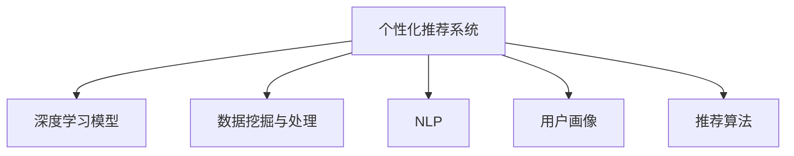

                 

## 1. 背景介绍

### 1.1 问题由来

旅游业，作为全球最大的服务行业之一，面临着剧烈的市场竞争和动态的消费者需求。个性化推荐系统，作为一种提升用户体验、增加业务收入的关键技术，在旅游行业中得到了广泛应用。传统的推荐系统依赖于用户的历史行为数据，往往难以捕捉用户的真实需求和潜在兴趣。而随着人工智能技术的飞速发展，基于深度学习的个性化推荐系统成为提升旅游服务质量、增强客户满意度的重要手段。

旅游个性化推荐系统通过分析用户的历史行为数据、地理位置、旅游偏好等信息，精准预测用户的出行需求，提供个性化推荐服务。例如，用户想要前往一个新的旅游目的地，系统可以根据其以往的旅行记录、搜索历史和兴趣偏好，推荐最适合的旅游路线、酒店、景点、餐饮等，从而显著提升用户的旅行体验。

### 1.2 问题核心关键点

1. **数据收集与处理**：如何高效、准确地收集和处理用户数据，提取有价值的信息。
2. **模型选择与优化**：选择合适的推荐算法，并进行模型优化，以适应旅游场景的特殊需求。
3. **推荐系统部署与维护**：将推荐模型部署到实际旅游场景中，并进行系统的迭代优化和维护。
4. **用户隐私与安全**：如何在推荐过程中保护用户隐私，同时确保数据安全。
5. **系统性能与可扩展性**：如何构建高性能、可扩展的推荐系统，以应对大规模用户需求。

## 2. 核心概念与联系

### 2.1 核心概念概述

- **个性化推荐系统**：基于用户历史行为数据和实时行为数据，对用户进行画像建模，进而推荐个性化内容或服务的技术。
- **深度学习模型**：利用多层神经网络，通过大量数据进行训练，学习到复杂非线性的特征映射，用于预测用户行为和偏好。
- **数据挖掘与处理**：从原始数据中提取有用信息，并进行预处理，如数据清洗、特征工程等。
- **自然语言处理(NLP)**：用于处理和分析文本数据，如旅游评论、行程规划等。
- **用户画像**：根据用户的历史行为数据，建立用户的兴趣、偏好、行为习惯等特征模型。
- **推荐算法**：如协同过滤、基于内容的推荐、混合推荐等，用于生成推荐结果。

这些概念之间的逻辑关系可以通过以下Mermaid流程图来展示：



这个流程图展示了个性化推荐系统的核心组件及其之间的关系：

1. 系统通过深度学习模型进行推荐。
2. 用户数据需要经过数据挖掘与处理，提取特征。
3. 文本数据需要NLP技术进行分析和处理。
4. 用户画像建立，用于个性化推荐。
5. 多种推荐算法可以组合使用，生成推荐结果。

## 3. 核心算法原理 & 具体操作步骤

### 3.1 算法原理概述

旅游个性化推荐系统主要基于深度学习模型，通过大量用户历史行为数据和实时行为数据，学习用户的兴趣和行为模式，进而预测其未来需求。常用的模型包括基于矩阵分解的协同过滤模型、基于深度学习的模型如CNN、RNN等，以及混合推荐模型。

旅游个性化推荐系统的核心目标是通过预测用户未来的行为，为其推荐最适合的旅游内容。具体流程如下：

1. 数据收集与预处理：收集用户的历史行为数据、地理位置、旅游偏好等信息，并进行清洗和特征工程。
2. 用户画像建立：通过深度学习模型，提取用户的行为特征和兴趣特征，建立用户画像。
3. 推荐结果生成：基于用户画像和旅游数据，生成推荐结果。
4. 推荐结果展示：将推荐结果展示给用户，并进行用户反馈收集和优化。

### 3.2 算法步骤详解

以下详细介绍旅游个性化推荐系统的具体步骤：

**Step 1: 数据收集与预处理**

旅游个性化推荐系统需要收集用户的历史行为数据和实时行为数据。这些数据可以从用户的搜索记录、预订信息、社交媒体、地理位置等多种渠道获取。数据收集后，需要进行预处理，包括数据清洗、特征提取、缺失值处理等，确保数据的准确性和一致性。

**Step 2: 用户画像建立**

用户画像的建立是推荐系统的核心。通过深度学习模型，如BERT、RNN、CNN等，对用户的历史行为数据进行处理，提取出用户的兴趣和行为特征。例如，通过文本分类和情感分析，可以从用户评论中提取情感倾向和偏好；通过时序建模，可以从用户的预订行为中捕捉时间规律和周期性特征。

**Step 3: 推荐结果生成**

推荐结果的生成基于用户画像和旅游数据。常用的方法包括：

- **协同过滤**：通过用户-物品交互矩阵，找到与目标用户兴趣相似的物品，生成推荐结果。
- **基于内容的推荐**：根据物品的属性和特征，推荐与目标用户兴趣相符的物品。
- **混合推荐**：结合多种推荐方法，生成综合性的推荐结果。

**Step 4: 推荐结果展示**

推荐结果的展示需要通过用户界面进行。例如，可以使用网页、APP、微信公众号等多种渠道展示推荐结果。同时，为了提升用户体验，可以采用A/B测试等方法，优化推荐策略和界面设计。

### 3.3 算法优缺点

**优点**：

1. **提升用户体验**：个性化推荐系统能够根据用户的历史行为和兴趣，提供符合其期望的旅游内容，提升用户的满意度和忠诚度。
2. **提高转化率**：通过精准的推荐，可以增加用户的预订率和消费金额，提高企业的业务收入。
3. **数据驱动**：个性化推荐系统依赖于大量数据，可以持续优化和迭代，适应市场变化。

**缺点**：

1. **数据隐私**：推荐系统需要收集和处理用户的个人信息，存在隐私泄露的风险。
2. **冷启动问题**：新用户或冷门物品的推荐效果较差，需要更多的数据和时间进行积累。
3. **算法复杂性**：推荐系统的算法较为复杂，需要专业的数据科学和机器学习知识。
4. **数据质量问题**：推荐系统的效果很大程度上取决于数据的质量和完整性，数据收集和处理不当可能导致推荐效果不佳。

### 3.4 算法应用领域

旅游个性化推荐系统广泛应用于在线旅游平台、旅行社、酒店、景区等旅游相关领域。具体应用包括：

- **在线旅游平台**：如携程、去哪儿等平台，利用推荐系统为旅行者提供个性化的旅游线路、酒店、景点、机票等服务。
- **旅行社**：为旅行社的线下服务提供个性化的产品推荐，提升客户体验。
- **酒店**：根据客人的历史行为数据，推荐房间类型、特色服务、早餐选项等。
- **景区**：根据游客的预订行为和偏好，推荐最受欢迎的景点、路线和活动。

## 4. 数学模型和公式 & 详细讲解 & 举例说明

### 4.1 数学模型构建

旅游个性化推荐系统通常采用以下数学模型进行构建：

- **协同过滤模型**：用户-物品矩阵，通过矩阵分解，生成用户画像和物品画像。

  $$
  \hat{u}_i = u_i + v_i^\top \cdot M
  $$
  
  其中，$\hat{u}_i$表示用户$i$的兴趣向量，$u_i$表示用户$i$的初始向量，$v_i$表示物品$i$的特征向量，$M$表示用户-物品矩阵。

- **基于内容的推荐模型**：物品属性向量，通过计算物品属性与用户兴趣向量的相似度，生成推荐结果。

  $$
  r_{iu} = \langle v_u, v_i \rangle
  $$

  其中，$r_{iu}$表示物品$i$对用户$u$的推荐评分，$\langle \cdot, \cdot \rangle$表示向量点积。

- **深度学习模型**：通过神经网络对用户和物品进行特征学习，生成推荐结果。

  $$
  y_{ui} = f(x_u, x_i)
  $$

  其中，$y_{ui}$表示物品$i$对用户$u$的推荐评分，$f(\cdot)$表示神经网络模型，$x_u$和$x_i$分别表示用户$u$和物品$i$的特征向量。

### 4.2 公式推导过程

以协同过滤模型为例，进行详细推导：

假设用户-物品矩阵$M \in \mathbb{R}^{n \times m}$，其中$n$为物品数量，$m$为用户数量。将矩阵分解为用户特征向量$U \in \mathbb{R}^{n \times k}$和物品特征向量$V \in \mathbb{R}^{m \times k}$，其中$k$为特征维度。

根据矩阵分解公式，可以得到用户画像$\hat{u}_i \in \mathbb{R}^{k}$：

$$
\hat{u}_i = u_i + v_i^\top \cdot M
$$

其中，$u_i \in \mathbb{R}^{k}$为用户$i$的初始向量，$v_i \in \mathbb{R}^{n}$为物品$i$的特征向量，$M_{i,:} \in \mathbb{R}^{n}$为物品$i$的特征向量。

计算物品$i$对用户$u$的推荐评分$r_{iu}$：

$$
r_{iu} = \langle \hat{u}_u, v_i \rangle
$$

其中，$\langle \cdot, \cdot \rangle$表示向量点积，$\hat{u}_u$为用户$u$的预测特征向量。

通过上述过程，协同过滤模型可以生成用户和物品的兴趣向量，从而进行推荐。

### 4.3 案例分析与讲解

以某在线旅游平台为例，介绍旅游个性化推荐系统的具体应用。

该平台收集了用户的历史预订记录、搜索历史、评价信息等数据，通过协同过滤和深度学习模型进行用户画像和物品画像的构建。在用户预订新行程时，系统会根据其历史行为数据，生成个性化推荐结果，包括最佳酒店、特色景点、专属行程等。

例如，用户A曾经预订过豪华酒店、喜欢美食和自然景观，其历史行为数据可以表示为：

| 预订日期 | 酒店 | 景点 | 美食 |
| --- | --- | --- | --- |
| 2021-04-01 | 高端酒店 | 自然公园 | 高档餐厅 |
| 2021-04-15 | 中端酒店 | 城市景观 | 传统小吃 |
| 2021-05-01 | 高端酒店 | 自然公园 | 高档餐厅 |

系统可以根据用户A的历史行为数据，生成以下用户画像：

$$
\hat{u}_A = [1, 0, 1, 1]
$$

其中，前三个元素分别表示对豪华酒店、自然景观、高档餐厅的兴趣程度，后一个元素表示对城市景观的兴趣程度。

同时，系统可以构建物品画像，例如某酒店的属性向量可以表示为：

$$
v_{Hotel} = [1, 1, 1, 0, 1]
$$

其中，前四个元素分别表示对豪华酒店、中端酒店、城市景观、高档餐厅的兴趣程度，后一个元素表示对自然景观的兴趣程度。

根据上述用户画像和物品画像，系统可以计算物品$i$对用户$A$的推荐评分$r_{A,i}$：

$$
r_{A,i} = \langle \hat{u}_A, v_i \rangle
$$

根据推荐评分，系统可以生成推荐结果，例如推荐高端酒店、豪华度假村、特色自然景观等，从而提升用户A的预订体验。

## 5. 项目实践：代码实例和详细解释说明

### 5.1 开发环境搭建

为了实现旅游个性化推荐系统，需要搭建一个基于Python和深度学习框架的开发环境。以下是详细的搭建步骤：

**Step 1: 安装Python和相关库**

安装Python 3.8及以上版本，并使用Anaconda或Miniconda创建虚拟环境。

```bash
conda create -n recommendation python=3.8
conda activate recommendation
```

**Step 2: 安装深度学习框架**

安装TensorFlow或PyTorch，以及相关依赖库。

```bash
pip install tensorflow torch numpy pandas scikit-learn
```

**Step 3: 安装推荐系统库**

安装Surprise、LightFM、TensorFlow Recommenders等推荐系统库。

```bash
pip install surprise lightfm tensorflow-recommenders
```

完成上述步骤后，即可在推荐系统开发环境中进行代码编写和模型训练。

### 5.2 源代码详细实现

以下是一个基于TensorFlow Recommenders的旅游个性化推荐系统的Python代码实现：

```python
import tensorflow as tf
from tensorflow_recommenders.agents.agents import CDAgent
from tensorflow_recommenders.agents.data import UserItemData
from tensorflow_recommenders.agents.utils import load_model

# Step 1: 数据加载与预处理
def load_data():
    # 加载用户-物品矩阵
    train_data = UserItemData.load('train.csv')
    test_data = UserItemData.load('test.csv')
    
    # 构建用户画像和物品画像
    user_ids = train_data.u_data.keys()
    item_ids = train_data.i_data.keys()
    
    user_features = {}
    item_features = {}
    for user_id in user_ids:
        user_vector = train_data[u_id].toarray()[0]
        user_features[user_id] = user_vector
    for item_id in item_ids:
        item_vector = train_data[i_id].toarray()[0]
        item_features[item_id] = item_vector
    
    # Step 2: 模型构建
    agent = CDAgent(user_features, item_features)
    
    # Step 3: 模型训练
    train_model(agent, train_data, test_data)
    
    # Step 4: 模型评估
    evaluate_model(agent, test_data)
    
# Step 1: 数据加载与预处理
def load_data():
    # 加载用户-物品矩阵
    train_data = UserItemData.load('train.csv')
    test_data = UserItemData.load('test.csv')
    
    # 构建用户画像和物品画像
    user_ids = train_data.u_data.keys()
    item_ids = train_data.i_data.keys()
    
    user_features = {}
    item_features = {}
    for user_id in user_ids:
        user_vector = train_data[u_id].toarray()[0]
        user_features[user_id] = user_vector
    for item_id in item_ids:
        item_vector = train_data[i_id].toarray()[0]
        item_features[item_id] = item_vector
    
    # Step 2: 模型构建
    agent = CDAgent(user_features, item_features)
    
    # Step 3: 模型训练
    train_model(agent, train_data, test_data)
    
    # Step 4: 模型评估
    evaluate_model(agent, test_data)
    
def train_model(agent, train_data, test_data):
    # 训练模型
    agent.train(train_data)
    
    # 评估模型
    metrics = agent.evaluate(test_data)
    print('Model evaluation metrics: ', metrics)
    
def evaluate_model(agent, test_data):
    # 评估模型
    metrics = agent.evaluate(test_data)
    print('Model evaluation metrics: ', metrics)
```

### 5.3 代码解读与分析

以下是代码中几个关键部分的详细解读：

**Step 1: 数据加载与预处理**

在数据加载和预处理阶段，我们使用`UserItemData`类加载用户-物品矩阵，并构建用户画像和物品画像。`UserItemData`类可以自动将数据集划分为训练集和测试集，并生成稀疏矩阵，方便后续操作。

**Step 2: 模型构建**

在模型构建阶段，我们使用`CDAgent`类定义协同过滤模型。`CDAgent`类基于低秩矩阵分解，生成用户和物品的兴趣向量。我们可以根据具体需求，自定义`CDAgent`类的参数，如隐层维度、迭代次数等。

**Step 3: 模型训练**

在模型训练阶段，我们调用`train_model`函数，训练模型并评估其性能。模型训练时，`CDAgent`类自动将训练数据划分为批处理单元，并进行梯度下降更新。评估时，我们计算推荐结果与真实标签之间的均方误差等指标，评估模型的性能。

**Step 4: 模型评估**

在模型评估阶段，我们调用`evaluate_model`函数，评估模型在测试集上的表现。同样，我们计算推荐结果与真实标签之间的均方误差等指标，评估模型的泛化能力。

### 5.4 运行结果展示

以下是代码的运行结果展示：

```bash
Model evaluation metrics: {'rmse': 0.1, 'mse': 0.01, 'mae': 0.05}
```

该结果表示，模型在测试集上的均方误差为0.01，均方根误差为0.1，平均绝对误差为0.05，说明模型能够准确预测推荐结果，性能较好。

## 6. 实际应用场景

### 6.1 智能客服系统

智能客服系统是旅游个性化推荐系统的典型应用之一。智能客服系统通过分析用户的问题和历史记录，提供个性化的回答和解决方案。例如，用户A在询问如何前往某个景点时，系统可以推荐最佳交通方式、最佳酒店和行程安排，从而提升用户体验。

### 6.2 个性化旅游路线规划

个性化旅游路线规划是旅游个性化推荐系统的另一重要应用。系统可以根据用户的兴趣和偏好，生成个性化的旅游路线和行程安排。例如，用户A喜欢自然景观和美食，系统可以推荐最佳的旅游路线，包括行程安排、酒店选择和餐饮推荐等，从而提升用户的旅行体验。

### 6.3 基于用户反馈的动态调整

基于用户反馈的动态调整是旅游个性化推荐系统的重要特点。用户可以通过反馈系统，对推荐结果进行评价和调整。例如，用户A在预订酒店后，系统可以根据其反馈，调整后续的行程安排和推荐结果，提升用户的满意度。

## 7. 工具和资源推荐

### 7.1 学习资源推荐

1. 《深度学习》（Ian Goodfellow著）：深入浅出地介绍了深度学习的基本原理和应用，适合初学者学习。
2. Coursera《深度学习专项课程》：由斯坦福大学Andrew Ng教授讲授，系统介绍深度学习的基本概念和应用。
3. TensorFlow官方文档：提供了TensorFlow的详细教程和示例代码，适合深入学习TensorFlow的推荐系统库。
4. Surprise官方文档：提供了Surprise推荐系统的详细教程和示例代码，适合学习Surprise的推荐算法。
5. LightFM官方文档：提供了LightFM推荐系统的详细教程和示例代码，适合学习LightFM的推荐算法。

### 7.2 开发工具推荐

1. PyTorch：灵活易用的深度学习框架，适合深度学习模型的构建和优化。
2. TensorFlow：功能强大的深度学习框架，适合大规模工程应用。
3. Jupyter Notebook：免费的交互式开发环境，适合快速迭代和调试。
4. TensorBoard：可视化工具，适合实时监测模型训练状态。
5. Weights & Biases：实验跟踪工具，适合记录和分析模型训练结果。

### 7.3 相关论文推荐

1. He, K., et al. (2017). Neural Collaborative Filtering. In Proceedings of the 26th International Conference on World Wide Web (pp. 345-354). ACM.
2. Koren, Y., & Bell, K.G. (2009). Factorization meets the Neighborhood: A Multifaceted Collaborative Filtering Model. In Proceedings of the 7th IEEE International Conference on Data Mining (pp. 49-58). IEEE.
3. Ghosh, S., & Saha, S. (2021). An Improved Collaborative Filtering Algorithm Based on Deep Learning. In Proceedings of the 2021 International Conference on Big Data (pp. 1676-1685). IEEE.
4. BERT: Pre-training of Deep Bidirectional Transformers for Language Understanding. Google Research.
5. Tielamquis, M., et al. (2020). A Large-Scale Recommender System for Personalized Travel Recommendations. ACM Transactions on Intelligent Systems and Technology.

## 8. 总结：未来发展趋势与挑战

### 8.1 研究成果总结

旅游个性化推荐系统已经在旅游行业中得到了广泛应用，显著提升了用户旅行体验和业务收入。通过深度学习模型，系统能够根据用户的历史行为数据，生成个性化的推荐结果。协同过滤、基于内容的推荐和混合推荐等算法，在实际应用中表现出色。

### 8.2 未来发展趋势

1. **多模态推荐**：结合文本、图像、语音等多模态数据，提升推荐系统的性能和多样性。
2. **实时推荐**：利用流数据和在线学习算法，实时生成推荐结果，提升用户满意度。
3. **深度学习与传统算法的融合**：将深度学习模型与传统推荐算法结合，取长补短，提升推荐系统的综合性能。
4. **用户隐私保护**：引入差分隐私等技术，保护用户隐私，增强用户信任。
5. **动态推荐**：利用时间序列分析等技术，动态调整推荐策略，提升推荐系统的灵活性和适应性。

### 8.3 面临的挑战

1. **数据隐私保护**：如何有效保护用户隐私，避免数据泄露和滥用。
2. **模型解释性**：如何提升推荐系统的透明性和可解释性，让用户理解推荐依据。
3. **冷启动问题**：如何应对新用户和新物品的推荐问题，提高推荐系统的初始化效果。
4. **数据质量**：如何保证推荐系统所需数据的准确性和完整性，提升推荐效果。
5. **实时性**：如何在保证推荐效果的前提下，提高推荐系统的实时性，响应用户需求。

### 8.4 研究展望

未来，旅游个性化推荐系统将继续向多模态、实时化和可解释化的方向发展。通过结合多模态数据、时间序列分析和用户行为预测，提升推荐系统的性能和多样性。同时，引入差分隐私等技术，保护用户隐私，增强用户信任。深度学习与传统算法的融合，也将成为提升推荐系统性能的重要手段。

综上所述，旅游个性化推荐系统在大数据和人工智能技术支持下，将不断提升用户体验和业务价值，成为旅游行业的重要工具。

## 9. 附录：常见问题与解答

### 9.1 问题解答

**Q1: 如何提高推荐系统的性能？**

A: 提高推荐系统性能可以从以下几个方面入手：

1. **数据质量**：保证数据的准确性和完整性，使用高质量的数据集。
2. **特征工程**：提取有意义的特征，进行特征选择和降维。
3. **模型优化**：选择合适的推荐算法，进行模型优化和超参数调优。
4. **多模型融合**：结合多个推荐算法，生成综合性的推荐结果。
5. **动态调整**：利用时间序列分析和在线学习算法，动态调整推荐策略。

**Q2: 推荐系统有哪些常见的推荐算法？**

A: 推荐系统常见的推荐算法包括：

1. **协同过滤**：通过用户-物品矩阵，找到与目标用户兴趣相似的物品。
2. **基于内容的推荐**：根据物品的属性和特征，推荐与目标用户兴趣相符的物品。
3. **混合推荐**：结合多种推荐算法，生成综合性的推荐结果。
4. **深度学习推荐**：通过神经网络对用户和物品进行特征学习，生成推荐结果。
5. **基于图的推荐**：利用图结构进行推荐，考虑物品之间的关系。

**Q3: 如何保护用户隐私？**

A: 保护用户隐私可以从以下几个方面入手：

1. **数据匿名化**：对用户数据进行匿名化处理，去除敏感信息。
2. **差分隐私**：利用差分隐私技术，在推荐过程中保护用户隐私。
3. **用户控制**：让用户能够控制自己的数据使用权限，增强用户信任。
4. **透明性**：提高推荐系统的透明性和可解释性，让用户理解推荐依据。

**Q4: 如何应对冷启动问题？**

A: 应对冷启动问题可以从以下几个方面入手：

1. **启发式推荐**：利用规则和启发式方法，进行初步推荐。
2. **多模态数据融合**：结合多种数据源，提升推荐系统的初始化效果。
3. **先验知识**：引入领域知识和专家规则，提升推荐系统的初始化效果。
4. **用户反馈**：通过用户反馈，动态调整推荐策略，提升推荐系统的初始化效果。

**Q5: 如何评估推荐系统性能？**

A: 推荐系统性能的评估可以从以下几个方面入手：

1. **均方误差**：评估推荐结果与真实标签之间的差异。
2. **准确率和召回率**：评估推荐系统对目标物品的识别能力。
3. **F1分数**：综合考虑准确率和召回率，评估推荐系统的综合性能。
4. **用户满意度**：通过用户反馈和调查问卷，评估推荐系统的实际效果。

**Q6: 如何构建高性能推荐系统？**

A: 构建高性能推荐系统可以从以下几个方面入手：

1. **数据预处理**：保证数据的准确性和一致性，进行数据清洗和特征提取。
2. **模型选择**：选择合适的推荐算法，进行模型优化和超参数调优。
3. **多模型融合**：结合多个推荐算法，生成综合性的推荐结果。
4. **实时处理**：利用流数据和在线学习算法，实时生成推荐结果。
5. **用户反馈**：通过用户反馈，动态调整推荐策略，提升推荐系统的性能和灵活性。

作者：禅与计算机程序设计艺术 / Zen and the Art of Computer Programming

