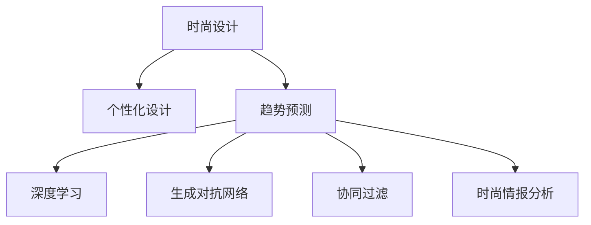

                 

# AI在时尚设计中的应用：个性化与趋势预测

> 关键词：时尚设计, 人工智能, 个性化, 趋势预测, 深度学习, 神经网络, 协同过滤, 生成对抗网络(GAN)

## 1. 背景介绍

### 1.1 问题由来

随着人工智能技术的飞速发展，AI在时尚设计中的应用越来越广泛。然而，传统的时尚设计主要依赖设计师的直觉和经验，缺乏系统的科学依据，无法快速响应市场变化，也无法根据消费者需求进行个性化定制。时尚行业面临的竞争日益加剧，如何在保持设计品质的同时，更快速、高效、精准地满足消费者需求，成为时尚企业面临的重要问题。

### 1.2 问题核心关键点

AI在时尚设计中的应用主要集中在个性化设计和趋势预测两个方向。个性化设计通过AI技术，根据消费者的具体需求，生成符合消费者喜好的设计方案；趋势预测则通过大数据分析和机器学习模型，预测未来的时尚趋势，指导企业进行生产决策。

## 2. 核心概念与联系

### 2.1 核心概念概述

为更好地理解AI在时尚设计中的应用，本节将介绍几个关键概念：

- **时尚设计**：指通过创意、技术和材料相结合，创造出符合市场需求和美学标准的服饰、鞋履、配饰等产品。
- **个性化设计**：指根据消费者特定需求定制设计方案的过程，包括对款式、颜色、材料等的个性化调整。
- **趋势预测**：通过数据分析和机器学习模型，预测未来的流行趋势，为时尚企业提供生产决策参考。
- **深度学习**：基于神经网络的机器学习方法，在时尚设计中广泛用于图像识别、风格生成、设计师风格迁移等任务。
- **生成对抗网络(GAN)**：一种用于生成高质量、逼真图像的深度学习模型，可用于生成时尚设计图片。
- **协同过滤**：一种推荐算法，通过分析用户行为数据，为用户推荐个性化的时尚设计产品。
- **时尚情报分析**：通过对时尚杂志、社交媒体、购物网站等数据进行分析和挖掘，获取时尚趋势信息，指导设计工作。

这些概念之间的逻辑关系可以通过以下Mermaid流程图来展示：



这个流程图展示了大语言模型的核心概念及其之间的关系：

1. 时尚设计是整个系统的输出结果。
2. 个性化设计和趋势预测是大语言模型的两个主要应用方向。
3. 深度学习和生成对抗网络是实现个性化设计和趋势预测的关键技术。
4. 协同过滤和时尚情报分析提供了消费者行为和时尚趋势数据。

## 3. 核心算法原理 & 具体操作步骤
### 3.1 算法原理概述

AI在时尚设计中的应用，主要是基于深度学习、生成对抗网络和协同过滤等技术，通过机器学习模型对大量数据进行分析和预测，生成符合消费者需求的设计方案，并预测未来的流行趋势。

### 3.2 算法步骤详解

#### 个性化设计

个性化设计的AI应用流程包括：

1. **用户需求收集**：通过问卷调查、社交媒体分析等方式，收集消费者的具体需求，包括风格偏好、颜色喜好、尺码等信息。
2. **数据预处理**：对收集到的用户需求数据进行清洗和处理，去除噪音和冗余信息，构建有效的特征表示。
3. **模型训练**：使用深度学习模型，如卷积神经网络(CNN)、生成对抗网络(GAN)等，对大量时尚设计图片进行训练，学习消费者的设计风格。
4. **风格生成**：基于训练好的模型，生成符合消费者需求的设计方案，包括款式、颜色、材料等。
5. **用户反馈**：将生成的设计方案展示给用户，收集用户反馈，根据反馈进行调整，直至生成令用户满意的设计方案。

#### 趋势预测

趋势预测的AI应用流程包括：

1. **数据采集**：从时尚杂志、社交媒体、购物网站等渠道，采集最新的时尚资讯和产品图片。
2. **特征提取**：使用深度学习模型，如卷积神经网络(CNN)，提取图片中的特征，构建时尚设计数据集。
3. **模型训练**：使用机器学习模型，如支持向量机(SVM)、随机森林(Random Forest)、梯度提升树(GBDT)等，对时尚设计数据进行训练，学习时尚趋势。
4. **趋势预测**：基于训练好的模型，预测未来几周、几个月、甚至几个季度的时尚趋势。
5. **生产决策**：根据趋势预测结果，指导企业进行生产决策，包括设计新款式、调整生产计划等。

### 3.3 算法优缺点

AI在时尚设计中的应用，具有以下优点：

- **效率高**：通过机器学习模型，可以快速生成大量符合消费者需求的设计方案。
- **个性化强**：根据消费者的具体需求，生成定制化设计方案，满足个性化需求。
- **趋势预测准确**：通过大数据分析和机器学习模型，预测未来时尚趋势，指导生产决策。

同时，这些技术也存在一定的局限性：

- **依赖数据**：AI模型的训练和预测效果依赖于数据质量，数据获取成本较高。
- **模型复杂**：深度学习模型和生成对抗网络等技术，需要大量的计算资源和专业知识。
- **解释性差**：AI模型通常是"黑盒"系统，难以解释其决策过程，缺乏可解释性。

尽管存在这些局限性，但AI技术在时尚设计中的应用前景广阔，未来还有很大的提升空间。

### 3.4 算法应用领域

AI在时尚设计中的应用，主要涵盖以下领域：

- **个性化定制**：根据消费者需求，生成定制化设计方案，提供个性化服务。
- **风格迁移**：将设计师的设计风格，迁移到普通消费者的设计方案中，提升设计质量。
- **时尚情报分析**：通过大数据分析，获取时尚趋势信息，指导设计工作。
- **智能推荐系统**：根据消费者历史行为数据，推荐符合其需求的设计方案。
- **虚拟试衣**：利用增强现实(AR)技术，进行虚拟试衣，提高用户体验。
- **智能裁剪**：根据设计方案，自动进行裁剪和排版，提高生产效率。

这些应用方向展示了AI在时尚设计中的巨大潜力，未来还有更多的应用场景等待探索。

## 4. 数学模型和公式 & 详细讲解 & 举例说明（备注：数学公式请使用latex格式，latex嵌入文中独立段落使用 $$，段落内使用 $)
### 4.1 数学模型构建

AI在时尚设计中的应用，主要基于以下数学模型：

- **卷积神经网络(CNN)**：用于图像识别和风格迁移，通过卷积操作提取图片特征。
- **生成对抗网络(GAN)**：用于生成高质量时尚设计图片，通过对抗训练生成逼真图片。
- **协同过滤**：用于推荐系统，通过用户行为数据推荐个性化的时尚设计产品。
- **支持向量机(SVM)**：用于趋势预测，通过构建特征空间进行分类。
- **随机森林(Random Forest)**：用于趋势预测，通过集成多个决策树进行分类。
- **梯度提升树(GBDT)**：用于趋势预测，通过逐步提升模型性能进行分类。

### 4.2 公式推导过程

以卷积神经网络(CNN)为例，推导其基本结构及其在时尚设计中的应用。

卷积神经网络的结构如下：

$$
f(x) = W_1 * f(x-1) + b_1
$$

其中，$x$表示输入图片，$W_1$表示卷积核，$f(x-1)$表示上一层的输出，$b_1$表示偏置项。

卷积神经网络通过卷积操作提取图片特征，其卷积操作公式如下：

$$
\mathcal{C}(x, W) = W * x
$$

其中，$W$表示卷积核，$x$表示输入图片。

在时尚设计中，卷积神经网络用于提取时尚图片的特征，如颜色、纹理、图案等。通过多层卷积操作，可以逐步提取更高级别的特征，构建时尚设计数据集。

### 4.3 案例分析与讲解

以生成对抗网络(GAN)为例，展示其在时尚设计中的应用。

生成对抗网络由两个神经网络组成，一个生成器(Generator)和一个判别器(Discriminator)。生成器用于生成逼真的时尚设计图片，判别器用于判断生成器生成的图片是否逼真。

GAN的训练过程如下：

1. 生成器生成一批时尚设计图片。
2. 判别器判断这些图片的真实性，输出一个概率值。
3. 判别器输出的概率值越大，表示生成器生成的图片越真实。
4. 生成器根据判别器的输出，优化生成器网络，使其生成更逼真的图片。
5. 判别器根据生成器生成的图片，优化判别器网络，使其能够更准确地判断图片的真实性。

通过反复迭代训练，生成器可以生成高质量、逼真的时尚设计图片，用于个性化设计或趋势预测。

## 5. 项目实践：代码实例和详细解释说明
### 5.1 开发环境搭建

在进行AI在时尚设计中的应用开发前，需要准备好开发环境。以下是使用Python进行TensorFlow开发的环境配置流程：

1. 安装Anaconda：从官网下载并安装Anaconda，用于创建独立的Python环境。

2. 创建并激活虚拟环境：
```bash
conda create -n tensorflow-env python=3.8 
conda activate tensorflow-env
```

3. 安装TensorFlow：根据CUDA版本，从官网获取对应的安装命令。例如：
```bash
conda install tensorflow tensorflow-gpu -c conda-forge
```

4. 安装Keras：用于构建深度学习模型，例如卷积神经网络(CNN)和生成对抗网络(GAN)。
```bash
pip install keras
```

5. 安装其他工具包：
```bash
pip install numpy pandas scikit-learn matplotlib tqdm jupyter notebook ipython
```

完成上述步骤后，即可在`tensorflow-env`环境中开始AI在时尚设计中的应用开发。

### 5.2 源代码详细实现

下面我们以时尚设计图片生成为例，给出使用TensorFlow实现生成对抗网络(GAN)的PyTorch代码实现。

首先，定义GAN的网络结构：

```python
import tensorflow as tf
from tensorflow.keras import layers

def make_generator_model():
    model = tf.keras.Sequential()
    model.add(layers.Dense(256, use_bias=False, input_shape=(100,)))
    model.add(layers.BatchNormalization())
    model.add(layers.LeakyReLU())

    model.add(layers.Dense(512))
    model.add(layers.BatchNormalization())
    model.add(layers.LeakyReLU())

    model.add(layers.Dense(1024))
    model.add(layers.BatchNormalization())
    model.add(layers.LeakyReLU())

    model.add(layers.Dense(784, activation='tanh'))
    model.add(layers.Reshape((28, 28, 1)))
    return model

def make_discriminator_model():
    model = tf.keras.Sequential()
    model.add(layers.Conv2D(64, (3, 3), strides=(2, 2), padding='same',
                           input_shape=[28, 28, 1]))
    model.add(layers.LeakyReLU())
    model.add(layers.Dropout(0.3))

    model.add(layers.Conv2D(128, (3, 3), strides=(2, 2), padding='same'))
    model.add(layers.LeakyReLU())
    model.add(layers.Dropout(0.3))

    model.add(layers.Flatten())
    model.add(layers.Dense(1, activation='sigmoid'))
    return model
```

然后，定义损失函数、优化器和GAN模型：

```python
from tensorflow.keras.optimizers import Adam

def make_gan_model(generator, discriminator):
    model = tf.keras.Sequential()
    model.add(generator)
    model.add(discriminator)
    return model

def compile_gan(generator, discriminator):
    generator.compile(optimizer=Adam(lr=0.0002, beta_1=0.5), loss='binary_crossentropy')
    discriminator.compile(optimizer=Adam(lr=0.0002, beta_1=0.5), loss='binary_crossentropy')

def train_gan(generator, discriminator, dataset, epochs=200):
    generator.trainable = False
    for epoch in range(epochs):
        for images, labels in dataset:
            noise = tf.random.normal([images.shape[0], 100])
            generated_images = generator(noise, training=True)

            real_output = discriminator(images, training=True)
            fake_output = discriminator(generated_images, training=True)

            d_loss_real = discriminator.train_on_batch(images, tf.ones((images.shape[0], 1)))
            d_loss_fake = discriminator.train_on_batch(generated_images, tf.zeros((images.shape[0], 1)))

            g_loss = generator.train_on_batch(noise, tf.ones((images.shape[0], 1)))
            discriminator.trainable = True
```

最后，启动GAN模型的训练：

```python
epochs = 200

# 构建数据集
# ...

# 训练GAN模型
# ...
```

以上就是使用TensorFlow实现生成对抗网络(GAN)的完整代码实现。可以看到，TensorFlow的Keras API提供了丰富的组件，使模型的构建和训练变得简单高效。

### 5.3 代码解读与分析

让我们再详细解读一下关键代码的实现细节：

**GAN网络定义**：
- `make_generator_model`函数定义了生成器的网络结构，包括多个卷积层、批归一化层和LeakyReLU激活函数，用于生成逼真的时尚设计图片。
- `make_discriminator_model`函数定义了判别器的网络结构，包括多个卷积层和全连接层，用于判断图片的真实性。

**GAN模型定义**：
- `make_gan_model`函数将生成器和判别器连接起来，构建GAN模型。
- `compile_gan`函数编译GAN模型，设置优化器和损失函数。

**GAN模型训练**：
- `train_gan`函数实现GAN模型的训练过程，通过对抗训练，不断优化生成器和判别器。
- 训练过程中，生成器根据判别器的输出，优化生成器网络，使其生成更逼真的图片。判别器根据生成器生成的图片，优化判别器网络，使其能够更准确地判断图片的真实性。

**数据集构建**：
- 需要构建一个时尚设计图片的数据集，用于训练生成器和判别器。可以使用公开的数据集，如Fashion-MNIST，也可以从时尚网站爬取数据。

可以看到，TensorFlow的Keras API使得GAN模型的构建和训练变得非常简单高效，开发者可以将更多精力放在模型的优化和调试上。

## 6. 实际应用场景
### 6.1 智能设计平台

智能设计平台是AI在时尚设计中应用的重要场景。通过智能设计平台，设计师可以方便地使用AI工具，快速生成符合消费者需求的设计方案，进行风格迁移，提高设计效率。

智能设计平台通常包括以下功能：

- **个性化设计**：根据消费者的具体需求，生成定制化设计方案，提供个性化服务。
- **风格迁移**：将设计师的设计风格，迁移到普通消费者的设计方案中，提升设计质量。
- **智能推荐**：根据消费者的历史行为数据，推荐符合其需求的设计方案。

智能设计平台的实现，需要结合深度学习、生成对抗网络(GAN)等技术，构建高效的AI模型，并进行模型优化和部署。

### 6.2 虚拟试衣系统

虚拟试衣系统是时尚行业的重要应用场景，通过增强现实(AR)技术，用户可以在家中试穿各种服装，提高购物体验。

虚拟试衣系统的实现，需要结合图像识别、人体姿态估计和虚拟试穿等技术，构建高效的AI模型，并进行模型优化和部署。

### 6.3 时尚情报分析

时尚情报分析是通过大数据分析和机器学习模型，获取时尚趋势信息，指导设计工作。

时尚情报分析的实现，需要结合时尚情报采集、大数据分析和机器学习模型等技术，构建高效的AI模型，并进行模型优化和部署。

### 6.4 未来应用展望

AI在时尚设计中的应用前景广阔，未来还有更多的应用场景等待探索。

在智能设计平台方面，未来的趋势是更加智能化、个性化和交互化的设计平台，通过AI技术，实现更高效、更灵活、更精准的设计服务。

在虚拟试衣系统方面，未来的趋势是更加逼真、交互性和沉浸式的虚拟试衣体验，通过AI技术，实现更真实、更便捷的购物体验。

在时尚情报分析方面，未来的趋势是更加智能化的时尚趋势预测系统，通过AI技术，实现更准确、更及时、更全面的时尚趋势预测，为时尚企业提供生产决策参考。

此外，在智能推荐、智能裁剪、智能裁剪等更多领域，AI技术也将发挥重要作用，推动时尚设计行业向智能化、数字化方向发展。

## 7. 工具和资源推荐
### 7.1 学习资源推荐

为了帮助开发者系统掌握AI在时尚设计中的应用理论基础和实践技巧，这里推荐一些优质的学习资源：

1. **《深度学习》系列书籍**：深入浅出地介绍了深度学习的基本原理和应用，包括卷积神经网络(CNN)、生成对抗网络(GAN)等。
2. **《Python深度学习》**：详细讲解了Python在深度学习中的应用，包括TensorFlow和Keras的使用方法。
3. **《TensorFlow官方文档》**：提供了丰富的深度学习模型和组件，是TensorFlow学习的必备资源。
4. **《FashionAI》**：介绍了时尚设计中深度学习的应用，包括图像识别、风格迁移等。
5. **《GAN生成图像》**：详细讲解了生成对抗网络(GAN)在图像生成中的应用，包括Fashion-MNIST等数据集的使用方法。

通过对这些资源的学习实践，相信你一定能够快速掌握AI在时尚设计中的应用精髓，并用于解决实际的时尚设计问题。

### 7.2 开发工具推荐

高效的开发离不开优秀的工具支持。以下是几款用于AI在时尚设计中应用的开发工具：

1. **TensorFlow**：基于Python的开源深度学习框架，灵活动态的计算图，适合快速迭代研究。
2. **Keras**：Keras提供了高层次的API，使深度学习模型的构建和训练变得简单高效。
3. **Fashion-MNIST**：公开的时尚设计图片数据集，可用于训练生成对抗网络(GAN)等模型。
4. **ARKit**：苹果公司的增强现实SDK，可用于虚拟试衣系统的开发。

合理利用这些工具，可以显著提升AI在时尚设计中的应用开发效率，加快创新迭代的步伐。

### 7.3 相关论文推荐

AI在时尚设计中的应用，源于学界的持续研究。以下是几篇奠基性的相关论文，推荐阅读：

1. **《图像生成对抗网络》**：提出了生成对抗网络(GAN)，用于生成高质量逼真图像。
2. **《深度学习在时尚设计中的应用》**：介绍了深度学习在时尚设计中的应用，包括图像识别、风格迁移等。
3. **《协同过滤推荐算法》**：介绍了协同过滤算法在推荐系统中的应用，可用于智能推荐系统。

这些论文代表了大语言模型微调技术的发展脉络。通过学习这些前沿成果，可以帮助研究者把握学科前进方向，激发更多的创新灵感。

## 8. 总结：未来发展趋势与挑战
### 8.1 总结

本文对AI在时尚设计中的应用进行了全面系统的介绍。首先阐述了AI在时尚设计中的应用背景和意义，明确了AI在个性化设计和趋势预测中的应用方向。其次，从原理到实践，详细讲解了AI在时尚设计中的应用流程，给出了具体的代码实例。同时，本文还广泛探讨了AI在时尚设计中的应用前景，展示了AI在时尚设计中的巨大潜力。最后，本文精选了AI在时尚设计中的应用资源，力求为读者提供全方位的技术指引。

通过本文的系统梳理，可以看到，AI在时尚设计中的应用前景广阔，正逐步成为时尚设计行业的重要工具。AI技术的不断演进，将推动时尚设计行业向智能化、数字化方向发展，助力时尚企业提升设计质量和生产效率，实现可持续发展。

### 8.2 未来发展趋势

展望未来，AI在时尚设计中的应用将呈现以下几个发展趋势：

1. **智能化升级**：未来的时尚设计平台将更加智能化，结合自然语言处理(NLP)、语音识别等技术，实现更加精准的设计服务。
2. **个性化定制**：通过AI技术，实现更加个性化、定制化的设计服务，满足消费者多样化需求。
3. **实时化设计**：通过实时数据分析和机器学习模型，实现实时化的时尚设计，快速响应市场变化。
4. **多模态融合**：将视觉、听觉、触觉等多模态信息融合，实现更加全面、立体的时尚设计。
5. **全球化设计**：通过AI技术，实现全球范围内的时尚设计，推动时尚设计的多元化发展。

这些趋势凸显了AI在时尚设计中的应用前景。这些方向的探索发展，将进一步提升时尚设计的效率和质量，为时尚企业提供更优质的设计服务。

### 8.3 面临的挑战

尽管AI在时尚设计中的应用前景广阔，但在迈向更加智能化、普适化应用的过程中，它仍面临诸多挑战：

1. **数据获取**：时尚设计领域的数据获取成本较高，如何获取高质量、多样化的数据，是AI应用的重要挑战。
2. **模型复杂度**：深度学习模型和生成对抗网络等技术，需要大量的计算资源和专业知识，如何优化模型，降低计算成本，是AI应用的重要挑战。
3. **可解释性**：AI模型的决策过程通常缺乏可解释性，如何提高模型的可解释性，是AI应用的重要挑战。
4. **伦理和隐私**：时尚设计领域的数据涉及个人隐私，如何保护用户隐私，避免数据滥用，是AI应用的重要挑战。
5. **跨领域融合**：将AI技术与时尚设计相结合，需要考虑多学科知识，如何实现跨领域融合，是AI应用的重要挑战。

尽管存在这些挑战，但AI在时尚设计中的应用前景广阔，未来还有很大的提升空间。相信随着学界和产业界的共同努力，这些挑战终将一一被克服，AI在时尚设计中的应用将迎来更加广阔的前景。

### 8.4 研究展望

面向未来，AI在时尚设计中的应用研究可以从以下几个方向进行：

1. **跨领域融合**：将AI技术与时尚设计相结合，实现多学科知识的融合，提升设计的创新性和质量。
2. **智能化升级**：结合自然语言处理(NLP)、语音识别等技术，实现更加智能化、交互化的设计服务。
3. **实时化设计**：通过实时数据分析和机器学习模型，实现实时化的时尚设计，快速响应市场变化。
4. **多模态融合**：将视觉、听觉、触觉等多模态信息融合，实现更加全面、立体的时尚设计。
5. **全球化设计**：通过AI技术，实现全球范围内的时尚设计，推动时尚设计的多元化发展。

这些研究方向将推动AI在时尚设计中的应用不断进步，为时尚设计行业带来更加智能化、高效化、个性化的服务。

## 9. 附录：常见问题与解答

**Q1：AI在时尚设计中的应用是否需要大量的标注数据？**

A: AI在时尚设计中的应用，主要依赖深度学习模型和大数据，不需要大量的标注数据。可以利用公开数据集，如Fashion-MNIST等，也可以通过爬虫技术获取时尚网站的数据。

**Q2：AI在时尚设计中的应用是否需要高精度的硬件设备？**

A: 需要，AI在时尚设计中的应用需要高精度的硬件设备，如GPU、TPU等，以支持深度学习模型的训练和推理。

**Q3：AI在时尚设计中的应用是否需要专业领域的知识？**

A: 是的，AI在时尚设计中的应用需要专业领域的知识，包括时尚设计的基本原理、心理学、社会学等。只有结合专业领域的知识，才能更好地应用AI技术。

**Q4：AI在时尚设计中的应用是否需要考虑伦理和隐私问题？**

A: 是的，时尚设计领域的数据涉及个人隐私，需要考虑伦理和隐私问题。如何保护用户隐私，避免数据滥用，是AI应用的重要挑战。

**Q5：AI在时尚设计中的应用是否需要考虑跨领域融合？**

A: 是的，AI在时尚设计中的应用需要考虑跨领域融合，将AI技术与时尚设计相结合，实现多学科知识的融合，提升设计的创新性和质量。

通过这些问题的解答，可以看到，AI在时尚设计中的应用需要综合考虑数据获取、硬件设备、专业知识、伦理隐私等多个因素，才能更好地发挥其潜力，推动时尚设计行业的发展。

---

作者：禅与计算机程序设计艺术 / Zen and the Art of Computer Programming

