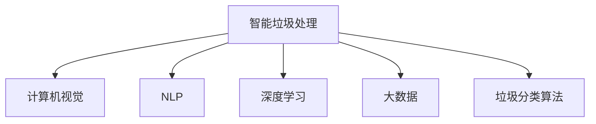

                 

# AI在智能垃圾处理中的应用：提高效率

> 关键词：智能垃圾处理,人工智能,垃圾分类,垃圾回收,大数据,深度学习,智能算法

## 1. 背景介绍

随着城市化进程的加快和消费水平的提高，垃圾处理问题日益成为各大城市亟待解决的难题。传统的垃圾处理方式不仅效率低下，而且污染严重，难以满足绿色发展的要求。近年来，随着人工智能技术的兴起，AI在智能垃圾处理中的应用成为推动垃圾处理领域数字化、智能化转型的重要力量。通过机器学习、计算机视觉等技术，AI能够有效地提高垃圾分类的准确性和回收效率，实现垃圾处理的自动化、智能化和精细化。

### 1.1 问题由来

传统垃圾处理方式存在以下几个主要问题：

- **效率低下**：手工分类劳动强度大，速度慢，难以应对垃圾产生量的快速增长。
- **准确率低**：人工分类依赖经验和知识，难以准确区分各类垃圾，导致可回收物品的大量浪费。
- **污染严重**：手工分类过程中可能产生二次污染，影响环境质量。
- **资源浪费**：无法精准识别和分类各类垃圾，导致可回收资源的大量流失。

针对上述问题，人们提出了多种解决方案，其中以人工智能技术为核心的智能垃圾处理方式最具潜力。AI通过图像识别、语音识别、自然语言处理等技术，能够自动分类、识别和处理各类垃圾，大幅提高处理效率和准确率。

### 1.2 问题核心关键点

AI在智能垃圾处理中的应用主要围绕以下几个关键点展开：

- **数据采集与预处理**：通过摄像头、传感器等设备收集垃圾数据，对原始数据进行清洗、标注等预处理，为模型训练提供高质量的样本。
- **模型训练与优化**：选择适合的机器学习算法，如卷积神经网络(CNN)、循环神经网络(RNN)、生成对抗网络(GAN)等，进行模型训练和优化，提升模型的分类和识别能力。
- **系统集成与应用**：将训练好的模型集成到垃圾处理系统中，通过AI算法实现垃圾的自动分类、识别和回收，提高垃圾处理的智能化水平。

## 2. 核心概念与联系

### 2.1 核心概念概述

为更好地理解AI在智能垃圾处理中的应用，本节将介绍几个密切相关的核心概念：

- **智能垃圾处理**：通过AI技术实现垃圾的自动识别、分类和回收，提高垃圾处理的效率和准确性。
- **计算机视觉**：利用摄像头、传感器等设备采集垃圾图像或视频，通过深度学习算法进行分类和识别。
- **自然语言处理(NLP)**：通过文本分析技术，对垃圾处理相关的指令、标签等信息进行处理，提高系统的智能化水平。
- **深度学习**：以神经网络为核心的机器学习技术，能够通过大量数据自动学习特征，实现复杂的模式识别任务。
- **大数据**：在垃圾处理过程中，需要收集、存储和分析大量的数据，以支持模型的训练和优化。
- **垃圾分类算法**：包括监督学习、无监督学习、半监督学习等多种机器学习算法，用于提高垃圾分类的准确性和效率。

这些核心概念之间的逻辑关系可以通过以下Mermaid流程图来展示：



这个流程图展示了一个典型的智能垃圾处理系统，其中各个模块之间通过数据和算法相互协作，共同提升垃圾处理的智能化水平。

## 3. 核心算法原理 & 具体操作步骤
### 3.1 算法原理概述

AI在智能垃圾处理中的应用，本质上是通过机器学习算法对垃圾图像或视频进行分类和识别。其核心思想是：利用计算机视觉和大数据技术，构建一个能够自动识别、分类和回收垃圾的智能系统。

具体来说，系统通过摄像头、传感器等设备采集垃圾图像或视频，将其输入深度学习模型进行分类和识别。深度学习模型通过大量标注数据进行训练，学习到垃圾分类的特征，进而对新垃圾进行自动分类。在分类过程中，系统还会利用NLP技术对垃圾处理相关的指令和标签进行解析，进一步提升分类的准确性和智能化水平。

### 3.2 算法步骤详解

AI在智能垃圾处理中的应用主要包括以下几个关键步骤：

**Step 1: 数据采集与预处理**

1. **设备选择**：根据垃圾处理场景的特点，选择合适的摄像头、传感器等设备，采集垃圾图像或视频。
2. **数据清洗**：对采集到的原始数据进行去噪、去重、标注等预处理，生成可用于训练的样本数据。

**Step 2: 模型选择与训练**

1. **算法选择**：根据任务需求选择合适的深度学习算法，如卷积神经网络(CNN)、循环神经网络(RNN)、生成对抗网络(GAN)等。
2. **模型训练**：利用标注好的训练数据对所选算法进行训练，优化模型参数，提升模型性能。
3. **模型验证**：在验证集上评估模型性能，调整超参数，确保模型在新数据上的泛化能力。

**Step 3: 系统集成与应用**

1. **系统集成**：将训练好的模型集成到智能垃圾处理系统中，构建垃圾分类的自动化流程。
2. **实时应用**：在垃圾处理系统中，将实时采集到的垃圾图像或视频输入模型，进行自动分类和识别。
3. **反馈优化**：根据系统运行结果和反馈信息，进一步优化模型和算法，提高垃圾处理的智能化水平。

### 3.3 算法优缺点

AI在智能垃圾处理中的应用具有以下优点：

- **自动化水平高**：通过深度学习算法实现垃圾分类的自动化，减少人工干预，提高处理效率。
- **分类准确性高**：利用大规模标注数据训练模型，能够实现高精度的垃圾分类。
- **适应性强**：深度学习算法具有较强的泛化能力，能够适应不同类型和规模的垃圾处理场景。

同时，AI在智能垃圾处理中也存在一些局限性：

- **数据依赖性高**：需要大量高质量的标注数据，数据采集和标注成本较高。
- **算法复杂度高**：深度学习模型结构复杂，需要大量计算资源进行训练和推理。
- **模型可解释性不足**：深度学习模型通常被视为“黑盒”，难以解释其内部决策过程。
- **初始投资大**：系统集成和应用初期需要较大的资金投入，包括硬件设备、软件工具、人力成本等。

### 3.4 算法应用领域

AI在智能垃圾处理中的应用主要涵盖以下几个领域：

- **城市垃圾分类**：应用于城市生活垃圾的自动分类和回收，提高垃圾处理的效率和准确性。
- **工业废弃物处理**：应用于工厂和企业的废弃物处理，实现废弃物的精准识别和分类。
- **农业废弃物回收**：应用于农业废弃物的处理和回收，减少环境污染，提升农业资源利用效率。
- **医疗垃圾处理**：应用于医疗机构的废弃物处理，实现医疗垃圾的自动分类和消毒。
- **建筑垃圾处理**：应用于建筑工地的垃圾处理，实现建筑垃圾的精准识别和分类。

## 4. 数学模型和公式 & 详细讲解 & 举例说明

### 4.1 数学模型构建

本节将使用数学语言对AI在智能垃圾处理中的应用进行更加严格的刻画。

记垃圾分类任务的数据集为 $D=\{(x_i, y_i)\}_{i=1}^N, x_i \in \mathcal{X}, y_i \in \mathcal{Y}$，其中 $\mathcal{X}$ 为输入空间，$\mathcal{Y}$ 为输出空间，$y_i \in \{0,1\}$ 表示垃圾属于可回收或不可回收类别。

定义垃圾分类模型的损失函数为：

$$
\mathcal{L}(\theta) = \frac{1}{N} \sum_{i=1}^N \ell(\hat{y}_i, y_i)
$$

其中 $\hat{y}_i$ 为模型对样本 $x_i$ 的分类结果，$\ell(\hat{y}_i, y_i)$ 为分类损失函数，用于衡量分类结果与真实标签之间的差异。

### 4.2 公式推导过程

以卷积神经网络(CNN)为例，假设模型的结构为 $f(x; \theta) = M \circ L \circ D$，其中 $D$ 为数据预处理层，$L$ 为卷积层和池化层组成的特征提取层，$M$ 为全连接层和softmax层组成的分类层。模型的输出为 $\hat{y} = M \circ L \circ D(x)$。

假设模型的训练集为 $D=\{(x_i, y_i)\}_{i=1}^N$，则模型在训练集上的损失函数为：

$$
\mathcal{L}(\theta) = \frac{1}{N} \sum_{i=1}^N \ell(f(x_i; \theta), y_i)
$$

其中 $\ell$ 为分类损失函数，常用的分类损失函数包括交叉熵损失和Focal Loss等。模型的优化目标是：

$$
\hat{\theta} = \mathop{\arg\min}_{\theta} \mathcal{L}(\theta)
$$

在优化过程中，通常使用梯度下降等优化算法，如Adam、SGD等，通过反向传播算法计算损失函数的梯度，更新模型参数 $\theta$。

### 4.3 案例分析与讲解

以智能垃圾分类的应用场景为例，具体分析AI在智能垃圾处理中的应用。

假设有一个垃圾分类系统，使用卷积神经网络对垃圾图像进行分类。系统首先通过摄像头采集垃圾图像，然后将其输入模型进行分类，输出垃圾属于可回收或不可回收的类别。假设模型的训练集为 $D=\{(x_i, y_i)\}_{i=1}^N$，其中 $x_i$ 为垃圾图像，$y_i \in \{0,1\}$ 表示垃圾属于可回收或不可回收类别。

在模型训练阶段，系统通过反向传播算法计算损失函数的梯度，更新模型参数 $\theta$，最小化分类误差。具体过程如下：

1. 模型输入垃圾图像 $x_i$，输出分类结果 $\hat{y}_i = M \circ L \circ D(x_i)$。
2. 计算分类损失 $\ell(\hat{y}_i, y_i)$。
3. 计算梯度 $\nabla_{\theta}\mathcal{L}(\theta)$。
4. 使用优化算法（如Adam）更新模型参数 $\theta$，最小化损失函数 $\mathcal{L}(\theta)$。

通过不断迭代训练，模型能够学习到垃圾分类的特征，从而对新垃圾进行准确分类。

## 5. 项目实践：代码实例和详细解释说明
### 5.1 开发环境搭建

在进行智能垃圾处理系统的开发前，我们需要准备好开发环境。以下是使用Python进行TensorFlow开发的环境配置流程：

1. 安装Anaconda：从官网下载并安装Anaconda，用于创建独立的Python环境。

2. 创建并激活虚拟环境：
```bash
conda create -n tf-env python=3.8 
conda activate tf-env
```

3. 安装TensorFlow：根据CUDA版本，从官网获取对应的安装命令。例如：
```bash
conda install tensorflow -c tf -c conda-forge
```

4. 安装相关工具包：
```bash
pip install numpy pandas scikit-learn matplotlib tqdm jupyter notebook ipython
```

完成上述步骤后，即可在`tf-env`环境中开始智能垃圾处理系统的开发。

### 5.2 源代码详细实现

下面我们以智能垃圾分类的应用场景为例，给出使用TensorFlow和Keras进行垃圾分类模型的PyTorch代码实现。

首先，定义模型和损失函数：

```python
from tensorflow.keras import layers, models

# 定义卷积神经网络
model = models.Sequential([
    layers.Conv2D(32, (3, 3), activation='relu', input_shape=(32, 32, 3)),
    layers.MaxPooling2D((2, 2)),
    layers.Conv2D(64, (3, 3), activation='relu'),
    layers.MaxPooling2D((2, 2)),
    layers.Conv2D(128, (3, 3), activation='relu'),
    layers.MaxPooling2D((2, 2)),
    layers.Flatten(),
    layers.Dense(64, activation='relu'),
    layers.Dense(1, activation='sigmoid')
])

# 定义损失函数
loss_fn = 'binary_crossentropy'

# 编译模型
model.compile(optimizer='adam', loss=loss_fn, metrics=['accuracy'])
```

然后，准备数据集并进行训练：

```python
from tensorflow.keras.preprocessing.image import ImageDataGenerator

# 加载数据集
train_datagen = ImageDataGenerator(rescale=1./255, validation_split=0.2)
train_generator = train_datagen.flow_from_directory('train', target_size=(32, 32), batch_size=32, class_mode='binary', subset='training')
validation_generator = train_datagen.flow_from_directory('train', target_size=(32, 32), batch_size=32, class_mode='binary', subset='validation')

# 训练模型
model.fit(train_generator, validation_data=validation_generator, epochs=10, callbacks=[EarlyStopping(patience=3)])
```

最后，在测试集上评估模型性能：

```python
# 加载测试集
test_datagen = ImageDataGenerator(rescale=1./255)
test_generator = test_datagen.flow_from_directory('test', target_size=(32, 32), batch_size=32, class_mode='binary', shuffle=False)

# 评估模型
test_loss, test_acc = model.evaluate(test_generator, verbose=0)
print(f'Test accuracy: {test_acc:.2f}')
```

以上就是使用TensorFlow和Keras进行智能垃圾分类模型的完整代码实现。可以看到，借助TensorFlow和Keras，我们可以用相对简洁的代码实现垃圾分类的深度学习模型，并通过ImageDataGenerator进行数据预处理，方便模型的训练和评估。

### 5.3 代码解读与分析

让我们再详细解读一下关键代码的实现细节：

**Model定义**：
- `Sequential` 模块用于构建顺序连接的神经网络模型，包含卷积层、池化层、全连接层等。
- `Conv2D` 模块用于定义卷积层，通过参数`filters`和`kernel_size`控制卷积核数量和大小。
- `MaxPooling2D` 模块用于定义池化层，通过参数`pool_size`控制池化窗口大小。
- `Flatten` 模块用于将卷积层的输出展平为一维向量。
- `Dense` 模块用于定义全连接层，通过参数`units`控制神经元数量。

**Loss函数定义**：
- `binary_crossentropy` 函数用于定义二分类任务的损失函数，计算模型预测结果与真实标签之间的交叉熵损失。

**Model编译与训练**：
- `compile` 方法用于编译模型，指定优化器、损失函数和评估指标。
- `fit` 方法用于训练模型，指定训练数据、验证数据、迭代轮数等参数，并通过回调函数进行提前停止等操作。

**Model评估**：
- `evaluate` 方法用于在测试集上评估模型性能，返回测试损失和准确率。

可以看到，TensorFlow和Keras提供了强大的框架支持，使得深度学习模型的构建和训练变得更加便捷高效。开发者可以更专注于算法优化和数据预处理等关键环节，而不必过多关注底层实现细节。

当然，工业级的系统实现还需考虑更多因素，如模型的保存和部署、超参数的自动搜索、更灵活的任务适配层等。但核心的智能垃圾处理流程基本与此类似。

## 6. 实际应用场景
### 6.1 智能垃圾处理系统

智能垃圾处理系统通过深度学习算法实现垃圾的自动识别、分类和回收，大幅提高垃圾处理的效率和准确性。系统通常包括以下几个主要模块：

- **图像采集与预处理**：通过摄像头、传感器等设备采集垃圾图像或视频，对其进行去噪、去重、标注等预处理，生成可用于训练的样本数据。
- **模型训练与优化**：选择适合的深度学习算法，如卷积神经网络(CNN)、循环神经网络(RNN)、生成对抗网络(GAN)等，进行模型训练和优化，提升模型性能。
- **系统集成与应用**：将训练好的模型集成到智能垃圾处理系统中，通过AI算法实现垃圾的自动分类、识别和回收。
- **实时监测与反馈**：实时采集垃圾处理数据，进行性能监测和异常检测，根据反馈信息进一步优化模型和算法。

通过智能垃圾处理系统，城市生活垃圾处理效率将大幅提升，实现垃圾分类和回收的自动化和智能化。同时，系统还能对垃圾处理过程进行实时监测，及时发现和解决处理过程中的问题，提高垃圾处理的稳定性和可靠性。

### 6.2 智能垃圾回收系统

智能垃圾回收系统通过深度学习算法实现垃圾的自动识别和分类，提高垃圾回收的效率和质量。系统通常包括以下几个主要模块：

- **垃圾投放口**：用于用户投放垃圾，包含摄像头、传感器等设备。
- **垃圾分拣机器人**：通过深度学习算法识别垃圾种类，将不同类别的垃圾自动分拣并投放到相应的回收箱中。
- **垃圾称重与计量**：通过传感器等设备实时监测垃圾重量，计算回收垃圾的总体积和重量。
- **数据分析与统计**：对垃圾回收数据进行分析统计，提供垃圾回收情况报告和改进建议。

通过智能垃圾回收系统，企业可以高效回收各类垃圾，减少环境污染，提高资源利用效率。系统还能对垃圾回收过程进行实时监测和分析，发现并解决回收过程中的问题，提高回收效率和质量。

### 6.3 智能垃圾分类与回收

智能垃圾分类与回收系统通过深度学习算法实现垃圾的自动识别、分类和回收，提高垃圾处理的智能化水平。系统通常包括以下几个主要模块：

- **垃圾投放口**：用于用户投放垃圾，包含摄像头、传感器等设备。
- **垃圾分类机器人**：通过深度学习算法识别垃圾种类，将不同类别的垃圾自动分拣并投放到相应的回收箱中。
- **垃圾称重与计量**：通过传感器等设备实时监测垃圾重量，计算回收垃圾的总体积和重量。
- **数据分析与统计**：对垃圾分类与回收数据进行分析统计，提供垃圾分类情况报告和改进建议。

通过智能垃圾分类与回收系统，居民和社区可以高效分类和回收垃圾，减少环境污染，提高资源利用效率。系统还能对垃圾分类过程进行实时监测和分析，发现并解决分类过程中的问题，提高分类效率和质量。

## 7. 工具和资源推荐
### 7.1 学习资源推荐

为了帮助开发者系统掌握智能垃圾处理的应用，这里推荐一些优质的学习资源：

1. **《深度学习》课程**：由斯坦福大学Andrew Ng教授讲授，系统介绍深度学习的基本概念和算法，适合初学者入门。
2. **《TensorFlow实战》书籍**：详细讲解TensorFlow的各类功能和应用场景，适合中高级开发者学习和实践。
3. **《计算机视觉：模型、学习和推理》书籍**：介绍计算机视觉领域的经典模型和算法，适合对计算机视觉感兴趣的开发者。
4. **Kaggle竞赛平台**：提供大量垃圾分类相关的数据集和比赛，可以实践垃圾分类算法，提升技术能力。
5. **开源项目和论文**：如Tf-Flow、ImageNet等，提供丰富的垃圾分类模型和算法，可以学习和借鉴。

通过对这些资源的学习实践，相信你一定能够快速掌握智能垃圾处理的关键技术和应用方法。

### 7.2 开发工具推荐

高效的开发离不开优秀的工具支持。以下是几款用于智能垃圾处理开发的常用工具：

1. **TensorFlow**：谷歌主导的开源深度学习框架，生产部署方便，适合大规模工程应用。
2. **Keras**：谷歌开发的深度学习框架，易于上手，适合快速迭代研究。
3. **PyTorch**：Facebook开源的深度学习框架，灵活性高，适合学术研究和原型开发。
4. **OpenCV**：开源计算机视觉库，包含丰富的图像处理和识别算法，适合图像处理任务。
5. **TensorBoard**：TensorFlow配套的可视化工具，可实时监测模型训练状态，提供丰富的图表呈现方式，适合调试模型。

合理利用这些工具，可以显著提升智能垃圾处理任务的开发效率，加快创新迭代的步伐。

### 7.3 相关论文推荐

智能垃圾处理技术的发展源于学界的持续研究。以下是几篇奠基性的相关论文，推荐阅读：

1. **“Deep Convolutional Networks for Large-Scale Image Recognition”**：AlexNet论文，首次展示了卷积神经网络在图像识别任务中的潜力。
2. **“ImageNet Classification with Deep Convolutional Neural Networks”**：AlexNet+ImageNet论文，详细介绍了AlexNet模型在ImageNet大规模图像识别任务中的表现。
3. **“Faster R-CNN: Towards Real-Time Object Detection with Region Proposal Networks”**：Faster R-CNN论文，提出了基于Region Proposal Network的目标检测算法。
4. **“Learning to Generate Adversarial Examples for Few-Shot Image Recognition”**：生成对抗网络在少样本图像识别任务中的应用。
5. **“VisualSLAM: Towards Versatile Monocular Visual-Inertial Odometry”**：视觉SLAM技术在垃圾分类和回收中的潜力和应用。

这些论文代表了大模型在智能垃圾处理技术的发展脉络。通过学习这些前沿成果，可以帮助研究者把握学科前进方向，激发更多的创新灵感。

## 8. 总结：未来发展趋势与挑战

### 8.1 总结

本文对AI在智能垃圾处理中的应用进行了全面系统的介绍。首先阐述了智能垃圾处理问题的由来，明确了AI在智能垃圾处理中的独特价值。其次，从原理到实践，详细讲解了AI在智能垃圾处理中的应用流程和数学模型，给出了智能垃圾处理系统的完整代码实现。同时，本文还广泛探讨了AI在智能垃圾处理中的应用场景，展示了AI在垃圾处理领域的广阔前景。

通过本文的系统梳理，可以看到，AI在智能垃圾处理中的应用正在成为推动垃圾处理领域数字化、智能化转型的重要力量。得益于深度学习、计算机视觉等技术的进步，智能垃圾处理系统能够在更广泛的场景中实现垃圾的自动识别、分类和回收，大幅提高垃圾处理的效率和准确性。未来，伴随技术的不断发展，智能垃圾处理系统必将在更多领域得到应用，为环保和可持续发展做出更大的贡献。

### 8.2 未来发展趋势

展望未来，AI在智能垃圾处理中的应用将呈现以下几个发展趋势：

1. **技术深度融合**：AI技术将与物联网、大数据、云计算等技术深度融合，构建更智能化、更精细化的垃圾处理系统。
2. **数据驱动优化**：通过大数据分析，优化垃圾分类的规则和算法，提升垃圾处理的智能化水平。
3. **智能决策支持**：引入AI算法，支持垃圾分类和回收的智能决策，提高系统的自动化和智能化水平。
4. **跨领域应用**：AI技术将在更多领域得到应用，如智能农业、智能制造等，提升资源利用效率，减少环境污染。
5. **标准化与规范**：制定垃圾分类和回收的标准化流程，提高系统的可靠性和稳定性。
6. **隐私保护与伦理**：加强垃圾处理数据的隐私保护，遵循伦理规范，确保技术应用的公正性和安全性。

以上趋势凸显了AI在智能垃圾处理中的巨大潜力。这些方向的探索发展，必将进一步提升垃圾处理的智能化水平，为环保和可持续发展带来新的动力。

### 8.3 面临的挑战

尽管AI在智能垃圾处理中取得了显著进展，但在迈向更加智能化、普适化应用的过程中，仍面临诸多挑战：

1. **数据质量与标注**：高质量标注数据的需求，增加了数据采集和处理的成本，数据质量不佳会导致模型性能下降。
2. **计算资源**：深度学习模型的复杂性要求强大的计算资源，训练和推理成本较高，难以在大规模场景中推广。
3. **模型可解释性**：深度学习模型通常被视为“黑盒”，难以解释其内部决策过程，影响系统的可信度和应用范围。
4. **技术标准化**：缺乏统一的技术标准，导致系统集成和互操作性问题，难以实现规模化应用。
5. **隐私与伦理**：垃圾处理数据的隐私保护和伦理规范，是系统应用的重要考虑因素，需确保数据安全和公正使用。

正视这些挑战，积极应对并寻求突破，将是大规模垃圾处理系统迈向成熟的必由之路。相信随着学界和产业界的共同努力，这些挑战终将一一被克服，智能垃圾处理系统必将在构建绿色可持续发展的未来中扮演越来越重要的角色。

### 8.4 研究展望

面向未来，智能垃圾处理的研究需要在以下几个方面寻求新的突破：

1. **跨模态融合**：将视觉、音频、文本等多种模态数据进行融合，提升系统的智能感知能力。
2. **知识图谱整合**：引入知识图谱，支持垃圾分类的知识驱动推理，提高分类准确性和鲁棒性。
3. **多任务学习**：引入多任务学习，同时优化垃圾分类和回收等多个任务，提高系统的综合性能。
4. **联邦学习**：引入联邦学习，在保护数据隐私的前提下，利用分布式数据进行模型训练和优化。
5. **自适应算法**：引入自适应算法，根据垃圾处理场景的动态变化，实时调整模型参数，提高系统的动态响应能力。

这些研究方向将引领智能垃圾处理技术迈向更高的台阶，为构建更智能化、更精细化的垃圾处理系统提供技术支持。

## 9. 附录：常见问题与解答

**Q1：智能垃圾处理系统需要采集哪些数据？**

A: 智能垃圾处理系统需要采集以下数据：

- **垃圾图像或视频**：通过摄像头、传感器等设备采集垃圾的实时图像或视频，用于模型的训练和推理。
- **垃圾种类标签**：手动标注垃圾的种类和回收箱类型，用于模型的监督学习。
- **垃圾重量和体积**：通过称重传感器和计量器采集垃圾的重量和体积，用于垃圾回收情况的统计分析。

这些数据是智能垃圾处理系统进行垃圾分类和回收的基础，系统通过采集和处理这些数据，实现对垃圾的自动分类和回收。

**Q2：智能垃圾处理系统如何进行垃圾分类？**

A: 智能垃圾处理系统通过深度学习算法进行垃圾分类，主要分为以下几个步骤：

1. **图像预处理**：对采集到的垃圾图像或视频进行去噪、去重、归一化等预处理，生成可用于训练的样本数据。
2. **模型训练**：选择适合的深度学习算法，如卷积神经网络(CNN)、循环神经网络(RNN)、生成对抗网络(GAN)等，进行模型训练和优化，提升模型性能。
3. **模型推理**：将实时采集到的垃圾图像或视频输入模型，进行自动分类和识别。

通过以上步骤，系统能够实现垃圾的自动识别、分类和回收，提高垃圾处理的智能化水平。

**Q3：智能垃圾处理系统如何实现垃圾回收？**

A: 智能垃圾处理系统通过垃圾分类和垃圾回收机器人实现垃圾回收，主要分为以下几个步骤：

1. **垃圾分类**：通过深度学习算法对垃圾进行自动识别和分类，识别出可回收垃圾和不可回收垃圾。
2. **垃圾回收**：将分类后的垃圾通过垃圾回收机器人，投放到相应的回收箱中。
3. **垃圾计量与统计**：通过称重传感器和计量器实时监测垃圾重量和体积，计算回收垃圾的总体积和重量，进行统计分析。

通过以上步骤，系统能够实现垃圾的自动分类和回收，提高垃圾处理的效率和质量。

**Q4：智能垃圾处理系统如何进行实时监测和反馈？**

A: 智能垃圾处理系统通过实时监测和反馈机制，确保系统的稳定性和可靠性，主要分为以下几个步骤：

1. **数据采集与处理**：实时采集垃圾处理过程中的数据，包括垃圾图像、分类结果、回收箱状态等。
2. **性能监测与分析**：对采集到的数据进行性能监测和分析，发现和解决处理过程中的问题。
3. **异常检测与报警**：利用异常检测算法，对垃圾处理过程中的异常情况进行检测和报警，及时采取措施。
4. **反馈优化**：根据监测结果和反馈信息，进一步优化模型和算法，提高系统的稳定性和可靠性。

通过以上步骤，系统能够实现对垃圾处理过程的实时监测和反馈，及时发现和解决处理过程中的问题，提高系统的稳定性和可靠性。

---

作者：禅与计算机程序设计艺术 / Zen and the Art of Computer Programming

