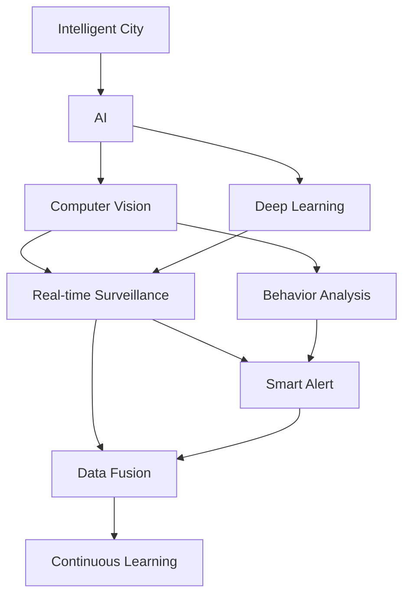

                 

# AI在智能城市安全监控中的应用：提高公共安全

> 关键词：智能城市安全监控,人工智能,AI,公共安全,深度学习,计算机视觉,实时监控,行为分析

## 1. 背景介绍

### 1.1 问题由来
随着城市化进程的不断加快，城市规模日益扩大，公共安全问题变得愈发严峻。传统的安全监控主要依靠人工巡逻和有限的闭路电视摄像头，难以实现全覆盖和实时监测，容易遗漏安全漏洞。因此，如何构建一个高效、智能的城市安全监控系统，及时发现和响应各类安全事件，成为了城市管理者的当务之急。

## 1.2 问题核心关键点
AI在智能城市安全监控中的应用，主要围绕以下几个核心关键点展开：

- 实时监控与行为分析：通过AI算法对摄像头拍摄的视频进行实时分析，自动识别异常行为，如可疑人物、车辆等。
- 智能预警与调度：根据实时监控结果，自动触发报警机制，并智能调度警力资源，进行快速响应。
- 数据融合与共享：整合多种数据源，如视频、声音、传感数据等，实现全域监控。
- 持续学习与优化：AI模型需具备自我学习和优化能力，适应不断变化的城市环境。

这些关键点共同构成了AI在智能城市安全监控中的主要应用方向，旨在通过技术手段提升城市公共安全水平。

## 1.3 问题研究意义
AI在智能城市安全监控中的应用，对于构建和谐安全的城市环境，具有重要意义：

1. 提升响应速度。AI系统能够实时监测并识别异常行为，迅速触发报警，缩短安全事件响应时间。
2. 降低人力成本。通过自动化分析，减少对人工巡逻的依赖，减轻警务人员的劳动强度。
3. 实现全域监控。AI技术可以无缝整合多种数据源，实现城市全域、无死角的监控覆盖。
4. 提高安全决策的科学性。通过大数据分析，为安全决策提供数据支撑，减少人为错误。
5. 保障数据隐私与安全。智能监控系统采用先进的加密技术，保护个人隐私和数据安全。

## 2. 核心概念与联系

### 2.1 核心概念概述

为了更好地理解AI在智能城市安全监控中的应用，本节将介绍几个密切相关的核心概念：

- 智能城市（Smart City）：通过物联网、大数据、人工智能等先进技术，实现城市基础设施、公共服务、管理决策等方面的智能化。
- 人工智能（AI）：利用计算机模拟人的智能行为，实现感知、学习、推理、决策等功能。
- 计算机视觉（CV）：通过计算机技术实现图像和视频的自动分析和理解，是AI在图像处理领域的重要应用。
- 深度学习（DL）：一种基于神经网络的机器学习方法，通过多层非线性变换实现复杂模式的学习。
- 实时监控（Real-time Surveillance）：对摄像头拍摄的视频进行实时处理，及时发现和响应异常行为。
- 行为分析（Behavior Analysis）：通过AI算法对行为数据进行分析，提取行为特征，识别异常行为模式。
- 智能预警（Smart Alert）：根据监控结果，自动触发报警机制，及时通知相关部门。
- 数据融合（Data Fusion）：整合视频、声音、传感等多种数据源，实现全域监控。
- 持续学习（Continuous Learning）：通过数据持续输入，AI模型自动更新，适应不断变化的城市环境。

这些核心概念之间的逻辑关系可以通过以下Mermaid流程图来展示：



这个流程图展示了智能城市安全监控系统的主要组成部分及其相互关系：

1. AI作为核心，通过计算机视觉和深度学习技术，实现实时监控和行为分析。
2. 实时监控通过摄像头捕捉视频数据，实时处理并分析异常行为。
3. 行为分析从实时监控数据中提取行为特征，识别异常行为模式。
4. 智能预警根据监控结果自动触发报警，通知相关部门。
5. 数据融合整合多种数据源，实现全域监控覆盖。
6. 持续学习使AI模型自动更新，适应不断变化的城市环境。

这些概念共同构成了AI在智能城市安全监控中的技术框架，使得AI能够在大规模监控场景下发挥作用。

## 3. 核心算法原理 & 具体操作步骤
### 3.1 算法原理概述

AI在智能城市安全监控中的应用，主要通过深度学习和计算机视觉算法实现。具体原理如下：

- 深度学习模型通过大量标注数据进行预训练，学习到复杂的特征表示。
- 在实时监控场景下，输入摄像头拍摄的视频流。
- 模型对视频帧进行特征提取，通过卷积神经网络（CNN）或循环神经网络（RNN）等技术，识别出异常行为。
- 结合行为分析算法，对异常行为进行进一步分类，如可疑人物、车辆等。
- 根据异常行为触发智能预警机制，并自动调度警力资源，进行快速响应。

### 3.2 算法步骤详解

以下是AI在智能城市安全监控中应用的详细步骤：

**Step 1: 数据准备**
- 收集城市各区域的摄像头视频数据。
- 标注异常行为数据，如可疑人物、车辆闯入等。
- 将标注数据划分为训练集和测试集。

**Step 2: 模型选择与训练**
- 选择合适的深度学习模型，如卷积神经网络（CNN）或循环神经网络（RNN）。
- 使用训练集数据，对模型进行预训练，学习基础特征表示。
- 对预训练模型进行微调，使其适应特定监控场景。

**Step 3: 实时监控与行为分析**
- 将实时监控摄像头拍摄的视频流输入到模型中，提取关键特征。
- 模型对视频帧进行实时分析，识别异常行为。

**Step 4: 智能预警与调度**
- 根据模型分析结果，判断是否触发预警机制。
- 如果异常行为被识别，自动调用警力调度系统，进行快速响应。

**Step 5: 数据融合与持续学习**
- 整合视频、声音、传感等多种数据源，实现全域监控。
- 持续输入新的监控数据，使模型不断更新和优化，适应不断变化的城市环境。

### 3.3 算法优缺点

AI在智能城市安全监控中的应用，具有以下优点：

- 实时性高。AI算法能够实时分析监控数据，迅速响应异常行为。
- 识别准确。深度学习模型具备强大的特征提取能力，识别精度较高。
- 全域监控。结合多种数据源，实现城市全域无死角的监控覆盖。
- 适应性强。持续学习机制使模型能够适应不断变化的城市环境。

同时，该方法也存在一些局限性：

- 数据依赖。AI模型需要大量标注数据进行预训练和微调，数据获取和标注成本较高。
- 资源消耗大。大模型在实时监控场景下，计算和存储资源消耗较大。
- 鲁棒性不足。异常行为识别可能受环境光照、遮挡等因素影响，鲁棒性不足。
- 隐私问题。实时监控可能侵犯个人隐私，需要设计合理的隐私保护机制。

### 3.4 算法应用领域

AI在智能城市安全监控中的应用，不仅限于监控系统的构建，还扩展到其他多个领域：

- 交通管理：通过AI识别交通异常，如交通堵塞、违章行为等，优化交通管理策略。
- 环境监测：利用AI识别环境污染、噪音超标等异常情况，实时监测环境质量。
- 灾害预警：结合天气预报数据，AI模型可以预测自然灾害，如洪水、地震等，提前预警。
- 公共服务：通过AI实现智能客服、智慧导引等公共服务功能，提升用户体验。
- 城市规划：通过AI分析城市人口流动、交通数据等，辅助城市规划决策。

这些应用领域展示了AI在智能城市中的广泛前景，为城市管理提供了技术支持。

## 4. 数学模型和公式 & 详细讲解 & 举例说明

### 4.1 数学模型构建

本节将使用数学语言对AI在智能城市安全监控中的应用进行更加严格的刻画。

假设AI模型为 $M$，输入为摄像头拍摄的视频流 $x$，输出为异常行为识别结果 $y$。模型的目标是最小化损失函数 $\mathcal{L}$，使得模型输出与真实标签之间的差异最小化。

**损失函数定义：**

$$
\mathcal{L}(M) = \frac{1}{N}\sum_{i=1}^N \ell(M(x_i), y_i)
$$

其中 $N$ 为样本数量，$\ell$ 为损失函数，用于衡量模型输出与真实标签之间的差异。

**模型训练过程：**

$$
\theta \leftarrow \theta - \eta \nabla_{\theta} \mathcal{L}(M_{\theta})
$$

其中 $\theta$ 为模型参数，$\eta$ 为学习率，$\nabla_{\theta} \mathcal{L}(M_{\theta})$ 为损失函数对模型参数的梯度。

### 4.2 公式推导过程

以下我们以异常行为识别为例，推导损失函数的计算公式。

假设模型 $M$ 的输出为异常行为的概率 $P(y=1|x)$，真实标签为 $y_i$，则二分类交叉熵损失函数定义为：

$$
\ell(M(x), y_i) = -[y_i\log P(y=1|x) + (1-y_i)\log(1-P(y=1|x))]
$$

将其代入经验风险公式，得：

$$
\mathcal{L}(\theta) = -\frac{1}{N}\sum_{i=1}^N [y_i\log M(x_i)+(1-y_i)\log(1-M(x_i))]
$$

根据链式法则，损失函数对模型参数 $\theta_k$ 的梯度为：

$$
\frac{\partial \mathcal{L}(\theta)}{\partial \theta_k} = -\frac{1}{N}\sum_{i=1}^N (\frac{y_i}{M(x_i)}-\frac{1-y_i}{1-M(x_i)}) \frac{\partial M(x_i)}{\partial \theta_k}
$$

其中 $\frac{\partial M(x_i)}{\partial \theta_k}$ 可进一步递归展开，利用自动微分技术完成计算。

### 4.3 案例分析与讲解

以视频监控场景为例，我们假设摄像头监控到一个可疑人物，AI模型对其行为进行分析，识别出异常行为，并触发报警机制。具体分析过程如下：

1. 输入摄像头拍摄的视频流 $x$，通过卷积神经网络（CNN）提取关键特征。
2. 模型对视频帧进行实时分析，识别异常行为，如异常人物姿态、行为模式等。
3. 结合行为分析算法，对异常行为进行分类，如可疑人物、车辆闯入等。
4. 根据异常行为触发报警机制，自动调用警力调度系统，进行快速响应。

案例分析展示了AI在智能城市安全监控中的具体应用场景，从数据输入到异常行为识别，再到智能预警和调度，整个过程展示了AI技术的强大能力。

## 5. 项目实践：代码实例和详细解释说明

### 5.1 开发环境搭建

在进行AI在智能城市安全监控中的应用开发前，我们需要准备好开发环境。以下是使用Python进行TensorFlow开发的环境配置流程：

1. 安装Anaconda：从官网下载并安装Anaconda，用于创建独立的Python环境。

2. 创建并激活虚拟环境：
```bash
conda create -n tf-env python=3.8 
conda activate tf-env
```

3. 安装TensorFlow：根据CUDA版本，从官网获取对应的安装命令。例如：
```bash
conda install tensorflow tensorflow-2.5 -c pytorch -c conda-forge
```

4. 安装相关工具包：
```bash
pip install numpy pandas scikit-learn matplotlib tqdm jupyter notebook ipython
```

完成上述步骤后，即可在`tf-env`环境中开始开发。

### 5.2 源代码详细实现

这里我们以异常行为识别为例，给出使用TensorFlow实现的视频监控系统的代码实现。

首先，定义模型类：

```python
import tensorflow as tf

class BehaviorDetectionModel(tf.keras.Model):
    def __init__(self, input_shape, num_classes):
        super(BehaviorDetectionModel, self).__init__()
        self.conv1 = tf.keras.layers.Conv2D(32, (3, 3), activation='relu', input_shape=input_shape)
        self.maxpool1 = tf.keras.layers.MaxPooling2D((2, 2))
        self.conv2 = tf.keras.layers.Conv2D(64, (3, 3), activation='relu')
        self.maxpool2 = tf.keras.layers.MaxPooling2D((2, 2))
        self.flatten = tf.keras.layers.Flatten()
        self.fc1 = tf.keras.layers.Dense(64, activation='relu')
        self.fc2 = tf.keras.layers.Dense(num_classes, activation='sigmoid')

    def call(self, inputs):
        x = self.conv1(inputs)
        x = self.maxpool1(x)
        x = self.conv2(x)
        x = self.maxpool2(x)
        x = self.flatten(x)
        x = self.fc1(x)
        x = self.fc2(x)
        return x
```

然后，定义数据预处理函数：

```python
def preprocess_input(x):
    x = tf.cast(x, tf.float32) / 255.0
    x = tf.image.resize(x, (224, 224))
    return x
```

接着，定义训练和评估函数：

```python
def train_model(model, train_data, val_data, num_epochs, batch_size, learning_rate):
    model.compile(optimizer=tf.keras.optimizers.Adam(learning_rate),
                  loss=tf.keras.losses.BinaryCrossentropy(),
                  metrics=[tf.keras.metrics.AUC()])
    model.fit(train_data, epochs=num_epochs, batch_size=batch_size, validation_data=val_data)
    return model
```

最后，启动训练流程并在测试集上评估：

```python
train_data = ...
val_data = ...
test_data = ...

input_shape = (224, 224, 3)
num_classes = 2

model = BehaviorDetectionModel(input_shape, num_classes)
model = train_model(model, train_data, val_data, num_epochs=10, batch_size=32, learning_rate=0.001)

test_loss, test_auc = model.evaluate(test_data)
print(f'Test AUC: {test_auc}')
```

以上就是使用TensorFlow对视频监控系统进行异常行为识别的完整代码实现。可以看到，TensorFlow的高级API和模块化设计使得模型构建和训练过程简洁高效。

### 5.3 代码解读与分析

让我们再详细解读一下关键代码的实现细节：

**BehaviorDetectionModel类**：
- `__init__`方法：定义模型的结构，包括卷积层、池化层、全连接层等。
- `call`方法：定义前向传播过程，通过一系列卷积、池化和全连接操作，最终输出异常行为的概率。

**preprocess_input函数**：
- 对输入数据进行归一化、缩放和尺寸调整，使数据符合模型的输入要求。

**train_model函数**：
- 定义模型编译参数，包括优化器、损失函数和评估指标。
- 使用`fit`方法进行模型训练，并在验证集上评估性能。

**训练流程**：
- 定义输入形状和类别数量，创建模型实例。
- 调用`train_model`函数进行模型训练，指定训练集、验证集、epoch数、batch大小和学习率。
- 在测试集上评估模型性能，输出测试AUC值。

可以看到，TensorFlow的模块化和面向对象设计使得模型构建和训练过程变得简单直观，开发者可以专注于算法设计和优化。

当然，在实际应用中，还需要针对具体场景进行模型优化，如引入数据增强、正则化、集成学习等技术，以提升模型性能。

## 6. 实际应用场景

### 6.1 智能监控系统

AI在智能城市安全监控中的应用，可以构建一个高效的智能监控系统。该系统能够实时监测城市各区域的异常行为，并及时触发报警，通知相关部门进行处理。

具体而言，智能监控系统包含以下几个主要组件：

1. **摄像头监控**：部署在城市各关键位置，实时拍摄视频数据。
2. **AI分析引擎**：通过深度学习模型，对视频流进行实时分析，识别异常行为。
3. **智能预警平台**：根据监控结果，自动触发报警机制，通知相关警力。
4. **调度中心**：统一调度警力资源，进行快速响应。

智能监控系统能够在城市各区域实现全域覆盖，显著提升公共安全水平。

### 6.2 交通管理

AI在智能城市安全监控中的应用，还可以优化城市交通管理，提高交通效率和安全性。

具体而言，通过AI识别交通异常，如交通堵塞、违章行为等，优化交通信号灯控制，实现实时交通调度。智能监控系统还能实时监测交通事故，自动触发紧急救援机制，减少事故带来的损失。

### 6.3 环境监测

AI在智能城市安全监控中的应用，还可以用于城市环境监测，保护生态环境。

具体而言，通过AI识别环境污染、噪音超标等异常情况，实时监测环境质量。智能监控系统还能结合天气预报数据，预测自然灾害，如洪水、地震等，提前预警，保障城市安全。

### 6.4 未来应用展望

随着AI技术的不断发展，基于智能城市安全监控的应用将进一步扩展。未来，AI将在以下几个方面发挥更大作用：

1. **多模态融合**：结合视频、声音、传感等多种数据源，实现全域监控覆盖，提高异常行为识别的准确性。
2. **深度学习模型优化**：引入先进模型架构和优化技术，提升异常行为识别的精度和鲁棒性。
3. **联邦学习**：通过联邦学习机制，实现多城市、多部门之间的数据协同，提升安全监控系统的协作能力。
4. **智能决策支持**：结合大数据分析，为城市安全决策提供数据支撑，减少人为错误，提升决策效率。
5. **边缘计算**：引入边缘计算技术，实现数据本地化处理，降低延迟和带宽消耗，提高系统响应速度。

这些应用前景展示了AI在智能城市安全监控中的巨大潜力，为构建和谐安全的城市环境提供了技术保障。

## 7. 工具和资源推荐

### 7.1 学习资源推荐

为了帮助开发者系统掌握AI在智能城市安全监控中的应用，这里推荐一些优质的学习资源：

1. 《深度学习与计算机视觉》系列课程：由斯坦福大学、麻省理工学院等名校开设的课程，涵盖了深度学习、计算机视觉等核心技术。
2. CS231n《卷积神经网络》课程：斯坦福大学开设的经典课程，详细讲解CNN在图像识别中的应用。
3. 《TensorFlow实战》书籍：TensorFlow官方文档和实战指南，帮助开发者快速上手TensorFlow。
4. 《计算机视觉实战》书籍：详细讲解计算机视觉的原理和应用，涵盖视频处理、行为分析等技术。
5. 《AI在智能城市中的应用》论文集：收集了多个领域AI应用的最新研究成果，提供了丰富的案例和理论基础。

通过对这些资源的学习实践，相信你一定能够快速掌握AI在智能城市安全监控中的精髓，并用于解决实际的公共安全问题。

### 7.2 开发工具推荐

高效的开发离不开优秀的工具支持。以下是几款用于AI在智能城市安全监控中应用的常用工具：

1. TensorFlow：由Google主导开发的开源深度学习框架，支持多种模型架构和优化技术。
2. PyTorch：Facebook开源的深度学习框架，灵活便捷，支持动态图计算。
3. Keras：高层神经网络API，提供简单易用的模型构建接口。
4. OpenCV：开源计算机视觉库，支持图像处理、视频分析等操作。
5. Hadoop/Spark：大数据处理框架，支持大规模数据的存储和分析。
6. Elasticsearch：分布式搜索和分析引擎，支持实时数据处理和检索。
7. Amazon SageMaker：AWS提供的云端机器学习平台，支持模型训练、部署和监控。

合理利用这些工具，可以显著提升AI在智能城市安全监控的开发效率，加快创新迭代的步伐。

### 7.3 相关论文推荐

AI在智能城市安全监控中的应用，源于学界的持续研究。以下是几篇奠基性的相关论文，推荐阅读：

1. Anomaly Detection in Video Streams using Deep Neural Networks（深度神经网络在视频流中的异常检测）：提出使用CNN对视频流进行异常行为识别，取得了较好的效果。
2. Real-time Traffic Surveillance Using Deep Convolutional Neural Networks（使用深度卷积神经网络进行实时交通监控）：详细介绍了AI在交通管理中的应用。
3. Anomaly Detection in Video Streams Using Deep Convolutional Networks and Autoregressive Models（使用深度卷积网络和自回归模型进行视频流异常检测）：对比了CNN和RNN在异常行为识别中的性能。
4. Smart City Surveillance using AI and Computer Vision（使用AI和计算机视觉进行智能城市监控）：介绍了智能城市监控系统的构建方法和应用场景。
5. AI for Smart Cities: A Survey（AI在智能城市中的应用综述）：总结了AI在多个领域的应用现状和未来趋势。

这些论文代表了大规模监控场景中AI技术的发展脉络。通过学习这些前沿成果，可以帮助研究者把握学科前进方向，激发更多的创新灵感。

## 8. 总结：未来发展趋势与挑战

### 8.1 研究成果总结

本文对AI在智能城市安全监控中的应用进行了全面系统的介绍。首先阐述了智能城市和AI技术的背景，明确了AI在公共安全领域的重要意义。其次，从原理到实践，详细讲解了AI在智能城市安全监控中的数学模型和关键技术。再次，提供了完整的代码实例，展示了AI模型在实际应用中的构建和训练过程。最后，探讨了AI在智能城市安全监控中的实际应用场景，展示了AI技术的广泛前景。

通过本文的系统梳理，可以看到，AI在智能城市安全监控中的应用，不仅提升了公共安全水平，还为智慧城市建设提供了技术支持。未来，随着AI技术的不断发展，AI在智能城市中的应用将更加广泛，为城市管理带来更多创新和突破。

### 8.2 未来发展趋势

展望未来，AI在智能城市安全监控中的应用将呈现以下几个发展趋势：

1. **多模态融合**：结合视频、声音、传感等多种数据源，实现全域监控覆盖，提高异常行为识别的准确性。
2. **深度学习模型优化**：引入先进模型架构和优化技术，提升异常行为识别的精度和鲁棒性。
3. **联邦学习**：通过联邦学习机制，实现多城市、多部门之间的数据协同，提升安全监控系统的协作能力。
4. **智能决策支持**：结合大数据分析，为城市安全决策提供数据支撑，减少人为错误，提升决策效率。
5. **边缘计算**：引入边缘计算技术，实现数据本地化处理，降低延迟和带宽消耗，提高系统响应速度。
6. **自动化调优**：引入自动化调优技术，自动优化模型参数，提升异常行为识别的精度和鲁棒性。

这些趋势展示了AI在智能城市安全监控中的巨大潜力，为构建和谐安全的城市环境提供了技术保障。

### 8.3 面临的挑战

尽管AI在智能城市安全监控中的应用已经取得了一定的成果，但在迈向更加智能化、普适化应用的过程中，仍面临诸多挑战：

1. **数据依赖**：AI模型需要大量标注数据进行预训练和微调，数据获取和标注成本较高。
2. **资源消耗**：大模型在实时监控场景下，计算和存储资源消耗较大。
3. **鲁棒性不足**：异常行为识别可能受环境光照、遮挡等因素影响，鲁棒性不足。
4. **隐私问题**：实时监控可能侵犯个人隐私，需要设计合理的隐私保护机制。
5. **算法透明性**：AI模型通常是"黑盒"系统，难以解释其内部工作机制和决策逻辑，需要进一步提高算法透明性和可解释性。
6. **安全性**：AI模型可能受到恶意攻击，需要设计合理的安全机制，防止模型被恶意篡改。

正视AI在智能城市安全监控中所面临的这些挑战，积极应对并寻求突破，将是大规模监控场景中AI技术发展的关键。相信随着学界和产业界的共同努力，这些挑战终将一一被克服，AI在智能城市中的应用将更加广泛和深入。

### 8.4 研究展望

面向未来，AI在智能城市安全监控中的应用需要从以下几个方面寻求新的突破：

1. **无监督和半监督学习**：探索无监督和半监督学习范式，摆脱对大规模标注数据的依赖。
2. **数据隐私保护**：设计合理的隐私保护机制，确保数据安全，保护个人隐私。
3. **跨模态协同**：实现跨模态数据的协同建模，提升异常行为识别的鲁棒性和准确性。
4. **知识图谱融合**：结合知识图谱和专家知识，提升异常行为识别的全面性和准确性。
5. **鲁棒性增强**：引入鲁棒性增强技术，提升模型对环境光照、遮挡等因素的鲁棒性。
6. **算法透明性提升**：提升AI算法的透明性和可解释性，增强模型的可解释性和可信度。

这些研究方向将推动AI在智能城市安全监控中的不断创新和优化，为构建和谐安全的城市环境提供技术保障。

## 9. 附录：常见问题与解答

**Q1：AI在智能城市安全监控中的应用主要有哪些？**

A: AI在智能城市安全监控中的应用主要包括以下几个方面：
1. **实时监控与行为分析**：通过AI算法对摄像头拍摄的视频进行实时分析，自动识别异常行为，如可疑人物、车辆等。
2. **智能预警与调度**：根据实时监控结果，自动触发报警机制，并智能调度警力资源，进行快速响应。
3. **数据融合与共享**：整合多种数据源，如视频、声音、传感数据等，实现全域监控。
4. **持续学习与优化**：AI模型需具备自我学习和优化能力，适应不断变化的城市环境。

**Q2：AI在智能城市安全监控中，如何保证数据隐私与安全？**

A: AI在智能城市安全监控中，保护数据隐私与安全至关重要。以下是几种常用的隐私保护技术：
1. **差分隐私**：通过添加随机噪声，保护数据中的敏感信息。
2. **联邦学习**：在本地设备上训练模型，不将数据上云，保护数据隐私。
3. **安全多方计算**：多个参与方在不泄露各自数据的情况下，共同计算结果。
4. **访问控制**：通过身份验证和授权机制，控制数据访问权限。
5. **数据匿名化**：通过脱敏、泛化等技术，保护数据隐私。

**Q3：AI在智能城市安全监控中，如何提升异常行为识别的精度和鲁棒性？**

A: 提升AI在智能城市安全监控中异常行为识别的精度和鲁棒性，可以采取以下措施：
1. **多模态融合**：结合视频、声音、传感等多种数据源，提升异常行为识别的全面性和准确性。
2. **深度学习模型优化**：引入先进模型架构和优化技术，提升异常行为识别的精度和鲁棒性。
3. **联邦学习**：通过联邦学习机制，实现多城市、多部门之间的数据协同，提升异常行为识别的鲁棒性。
4. **鲁棒性增强**：引入鲁棒性增强技术，提升模型对环境光照、遮挡等因素的鲁棒性。

**Q4：AI在智能城市安全监控中，如何保证算法的透明性和可解释性？**

A: 保证AI在智能城市安全监控中算法的透明性和可解释性，可以采取以下措施：
1. **可解释性模型**：使用可解释性模型，如LIME、SHAP等，提升模型的可解释性。
2. **可视化技术**：使用可视化技术，如特征重要性分析、梯度热图等，解释模型的决策过程。
3. **透明度机制**：建立透明度机制，定期发布模型的训练数据、模型参数等，增强模型透明度。
4. **用户反馈**：收集用户反馈，不断优化和改进模型，提升模型的可解释性和可信度。

**Q5：AI在智能城市安全监控中，如何应对大模型资源消耗的问题？**

A: 应对AI在智能城市安全监控中大模型资源消耗的问题，可以采取以下措施：
1. **模型裁剪**：去除不必要的层和参数，减小模型尺寸，加快推理速度。
2. **量化加速**：将浮点模型转为定点模型，压缩存储空间，提高计算效率。
3. **分布式计算**：引入分布式计算技术，实现模型并行计算，提升计算效率。
4. **边缘计算**：引入边缘计算技术，实现数据本地化处理，降低延迟和带宽消耗，提高系统响应速度。

**Q6：AI在智能城市安全监控中，如何应对鲁棒性不足的问题？**

A: 应对AI在智能城市安全监控中鲁棒性不足的问题，可以采取以下措施：
1. **数据增强**：通过回译、近义替换等方式扩充训练集，提高模型鲁棒性。
2. **正则化**：使用L2正则、Dropout等正则化技术，防止模型过拟合。
3. **对抗训练**：引入对抗样本，提高模型鲁棒性。
4. **多模型集成**：训练多个模型，取平均输出，抑制过拟合，提升模型鲁棒性。

这些措施可以帮助AI在智能城市安全监控中提升异常行为识别的精度和鲁棒性，为构建和谐安全的城市环境提供技术保障。

---

作者：禅与计算机程序设计艺术 / Zen and the Art of Computer Programming

