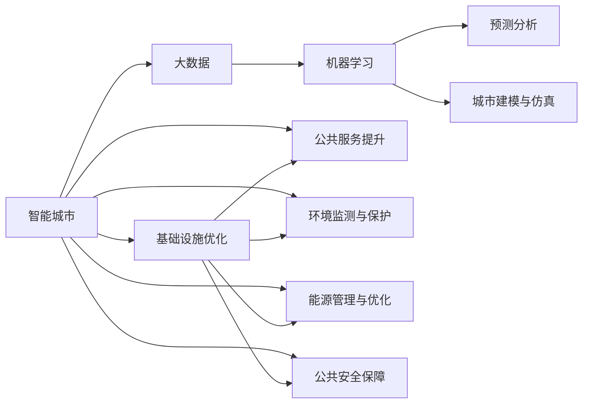

                 

## 1. 背景介绍

### 1.1 问题由来

随着城市化进程的加快，全球许多城市正面临一系列挑战，包括交通拥堵、环境污染、资源紧张等问题。如何通过技术手段，提升城市管理效率，改善市民生活质量，成为了各国政府和科研机构亟待解决的课题。人工智能（AI）技术，尤其是机器学习和数据分析技术，在城市规划中展现出了巨大的应用潜力。通过智能化的数据处理、预测和决策支持，AI可以在交通管理、环境监控、能源管理等多个领域发挥重要作用，推动城市向更高效、更清洁、更宜居的方向发展。

### 1.2 问题核心关键点

智能城市规划的核心在于充分利用AI技术，优化城市基础设施和公共服务，提升市民生活水平。具体来说，AI在城市规划中的应用包括：

- **数据驱动的决策支持**：利用大数据和机器学习模型，分析城市运行数据，预测未来趋势，辅助政府决策。
- **智能交通管理**：通过AI技术优化交通信号灯控制、路线规划、公交调度等，缓解交通拥堵，减少污染。
- **环境监测与保护**：利用AI技术实时监测环境质量，预测污染源，实施精准控制。
- **能源管理与优化**：运用AI技术优化能源使用和调度，减少浪费，提升能源利用效率。
- **公共安全**：借助AI技术提升公共安全监测和应急响应能力。

这些应用不仅能够显著提高城市管理效率，还能在成本节约、资源利用、环境保护等方面带来显著效益。

### 1.3 问题研究意义

AI在智能城市规划中的应用，有助于实现以下目标：

- **提升公共服务水平**：通过智能化的城市基础设施，如智能公交、智慧停车、智能电网等，提升市民生活的便利性和舒适性。
- **优化资源配置**：通过数据分析和预测，科学合理地配置城市资源，如交通、能源、水务等，最大化利用资源，降低成本。
- **改善环境质量**：通过实时监控和预测，提前采取措施，减少污染排放，提升城市空气、水质等环境指标。
- **增强公共安全**：通过智能监控和预警，及时发现和应对安全事件，保护市民的生命财产安全。
- **促进可持续发展**：通过AI技术优化城市规划和运营，减少碳排放，推动城市向绿色、低碳方向发展。

因此，AI在智能城市规划中的应用，不仅能够提高城市管理效率，还能显著提升市民的生活质量，推动城市的可持续发展。

## 2. 核心概念与联系

### 2.1 核心概念概述

为更好地理解AI在智能城市规划中的应用，本节将介绍几个关键概念及其相互关系：

- **智能城市**：利用新一代信息技术，包括物联网、大数据、AI等，提升城市管理效率和市民生活质量。
- **大数据**：指规模巨大、高速增长、类型多样的数据集合，包括传感器数据、社交媒体数据、城市运营数据等。
- **机器学习**：通过算法，使计算机从数据中学习规律，提升数据处理和预测能力。
- **预测分析**：利用历史数据和机器学习模型，预测未来趋势，支持决策制定。
- **城市建模与仿真**：通过数学模型和计算机仿真技术，模拟城市运行，评估不同规划方案的效果。

这些概念之间的逻辑关系可以通过以下Mermaid流程图来展示：



这个流程图展示了大数据、机器学习、预测分析等关键技术在智能城市中的应用，以及如何通过这些技术优化城市基础设施和公共服务，保护环境，管理能源，保障公共安全，最终提升市民生活质量。

## 3. 核心算法原理 & 具体操作步骤

### 3.1 算法原理概述

AI在智能城市规划中的应用，主要是通过数据收集、处理、分析和建模等步骤，辅助城市管理者进行决策。具体步骤如下：

1. **数据收集**：利用传感器、监控设备、移动应用等手段，收集城市运行数据。
2. **数据清洗与预处理**：清洗数据，去除噪声，进行标准化和归一化，便于后续分析。
3. **数据分析**：利用机器学习模型，分析数据中的模式和规律，生成统计结果。
4. **预测建模**：根据历史数据和分析结果，构建预测模型，预测未来趋势。
5. **决策支持**：利用预测结果，辅助城市管理者制定决策。

通过以上步骤，AI能够提供数据驱动的决策支持，帮助城市管理者优化城市规划和运营，提升公共服务水平。

### 3.2 算法步骤详解

以下是AI在智能城市规划中应用的具体操作步骤：

**Step 1: 数据收集与清洗**
- 通过传感器、监控设备、移动应用等手段，收集城市运行数据，包括交通流量、环境质量、能源消耗、公共安全事件等。
- 对收集到的数据进行清洗，去除噪声和异常值，进行标准化和归一化，生成干净的训练数据。

**Step 2: 数据分析与建模**
- 利用机器学习模型，对清洗后的数据进行分析，提取关键特征和模式。
- 构建预测模型，如回归模型、分类模型、时序模型等，预测未来趋势。

**Step 3: 预测结果验证**
- 在验证集上评估预测模型的性能，如准确率、召回率、F1分数等。
- 根据评估结果，调整模型参数，提高模型性能。

**Step 4: 决策支持**
- 将预测结果应用于城市规划和管理中，如调整交通信号灯控制策略、优化公交线路、改善环境监测设备布局等。
- 实时监控预测结果，根据实际情况调整策略，确保决策的有效性和实时性。

**Step 5: 模型优化与更新**
- 定期更新数据和模型，根据新的数据结果，优化模型参数，提升预测准确性。
- 应用先进的技术，如强化学习、因果推理等，进一步提升模型的性能。

### 3.3 算法优缺点

AI在智能城市规划中的应用具有以下优点：

- **数据驱动的决策支持**：利用数据分析和预测，辅助城市管理者制定决策，提升决策的科学性和合理性。
- **实时性**：通过实时数据处理和预测，能够快速响应城市变化，及时调整管理策略。
- **提升公共服务水平**：通过智能化城市基础设施，提升市民生活的便利性和舒适性。
- **优化资源配置**：科学合理地配置城市资源，减少浪费，提高资源利用效率。

同时，AI在智能城市规划中面临以下挑战：

- **数据隐私和安全**：城市运行数据包含大量个人隐私信息，如何保护数据隐私和安全，是一个重要问题。
- **模型鲁棒性**：预测模型可能会受到数据噪声和异常值的影响，如何提高模型的鲁棒性和泛化能力，是另一个挑战。
- **计算资源需求**：AI模型需要大量的计算资源进行训练和推理，如何降低计算成本，是一个亟待解决的问题。

### 3.4 算法应用领域

AI在智能城市规划中的应用领域广泛，包括但不限于：

- **交通管理**：利用AI技术优化交通信号灯控制、路线规划、公交调度等，缓解交通拥堵，减少污染。
- **环境监测与保护**：利用AI技术实时监测环境质量，预测污染源，实施精准控制。
- **能源管理与优化**：运用AI技术优化能源使用和调度，减少浪费，提升能源利用效率。
- **公共安全**：借助AI技术提升公共安全监测和应急响应能力。
- **城市运行监测与预测**：利用AI技术实时监控城市运行状态，预测未来趋势，支持决策制定。

## 4. 数学模型和公式 & 详细讲解 & 举例说明

### 4.1 数学模型构建

以下是AI在智能城市规划中应用的一些常见数学模型及其构建方法：

1. **回归模型**：用于预测连续型变量，如交通流量、能源消耗等。常见回归模型包括线性回归、多项式回归、岭回归等。
2. **分类模型**：用于分类问题，如交通事件预测、环境质量评估等。常见分类模型包括逻辑回归、支持向量机、随机森林等。
3. **时序模型**：用于处理时间序列数据，如交通流量预测、能源需求预测等。常见时序模型包括ARIMA、LSTM等。
4. **聚类模型**：用于数据分组，发现数据中的模式和规律。常见聚类模型包括K-means、DBSCAN等。

### 4.2 公式推导过程

以下是回归模型和分类模型的一些基本公式推导过程：

**线性回归模型**：

假设数据集为 $(x_i, y_i)$，其中 $x_i$ 为自变量，$y_i$ 为因变量，模型假设 $y_i = \beta_0 + \beta_1 x_i + \epsilon_i$，其中 $\beta_0$ 和 $\beta_1$ 为模型参数，$\epsilon_i$ 为随机误差。

利用最小二乘法求解模型参数，最小化误差平方和 $SSE = \sum (y_i - \hat{y_i})^2$，其中 $\hat{y_i} = \beta_0 + \beta_1 x_i$。

推导得到参数求解公式：
$$
\beta_1 = \frac{\sum (x_i - \bar{x}) (y_i - \bar{y})}{\sum (x_i - \bar{x})^2}, \beta_0 = \bar{y} - \beta_1 \bar{x}
$$

**逻辑回归模型**：

假设数据集为 $(x_i, y_i)$，其中 $x_i$ 为特征向量，$y_i$ 为二元分类标签，模型假设 $P(y_i = 1|x_i) = \sigma(\beta_0 + \beta_1 x_i)$，其中 $\sigma$ 为sigmoid函数，$\beta_0$ 和 $\beta_1$ 为模型参数。

利用极大似然估计法求解模型参数，最大化似然函数 $L(\beta_0, \beta_1) = \prod_{i=1}^N P(y_i = 1|x_i)$。

推导得到参数求解公式：
$$
\beta_1 = \frac{\sum (x_i - \bar{x}) (y_i - p(y_i))}{\sum (x_i - \bar{x})^2}, \beta_0 = \bar{y} - \beta_1 \bar{x}
$$

其中 $p(y_i) = \sigma(\beta_0 + \beta_1 x_i)$。

### 4.3 案例分析与讲解

以智能交通管理为例，以下是利用回归模型进行交通流量预测的案例：

假设交通流量数据集为 $(x_i, y_i)$，其中 $x_i$ 包括时间、日期、天气等信息，$y_i$ 为交通流量。

构建线性回归模型，假设 $y_i = \beta_0 + \beta_1 x_i + \epsilon_i$。

利用历史数据训练模型，求解参数 $\beta_0$ 和 $\beta_1$。

在测试集上评估模型性能，计算平均绝对误差（MAE）、均方误差（MSE）等指标。

根据评估结果，调整模型参数，优化模型性能。

将优化后的模型应用于实时交通流量预测，调整交通信号灯控制策略，缓解交通拥堵，提升交通效率。

## 5. 项目实践：代码实例和详细解释说明

### 5.1 开发环境搭建

在进行AI在智能城市规划中的应用实践前，我们需要准备好开发环境。以下是使用Python进行TensorFlow开发的Python 3.8环境配置流程：

1. 安装Anaconda：从官网下载并安装Anaconda，用于创建独立的Python环境。

2. 创建并激活虚拟环境：
```bash
conda create -n ai-env python=3.8 
conda activate ai-env
```

3. 安装TensorFlow：根据CUDA版本，从官网获取对应的安装命令。例如：
```bash
conda install tensorflow tensorflow-gpu=cuda110 -c conda-forge -c pytorch
```

4. 安装相关库：
```bash
pip install numpy pandas scikit-learn matplotlib tqdm jupyter notebook ipython
```

完成上述步骤后，即可在`ai-env`环境中开始AI在智能城市规划中的应用实践。

### 5.2 源代码详细实现

这里我们以交通流量预测为例，给出使用TensorFlow进行回归模型训练的Python代码实现。

首先，定义交通流量数据集：

```python
import pandas as pd

# 读取数据
data = pd.read_csv('traffic_flow.csv')

# 特征工程
data['date'] = pd.to_datetime(data['date'])
data['weather'] = data['weather'].map({' sunny': 1, 'cloudy': 2, 'rainy': 3})
data['time'] = data['time'].map({'morning': 0, 'afternoon': 1, 'evening': 2, 'night': 3})
data['day'] = data['date'].dt.dayofweek

# 数据清洗与预处理
data = data.dropna()
data = data.drop(['date'], axis=1)

# 分割数据集
train_data = data[:800]
test_data = data[800:]

# 数据标准化
from sklearn.preprocessing import StandardScaler
scaler = StandardScaler()
train_data = scaler.fit_transform(train_data)
test_data = scaler.transform(test_data)
```

然后，定义回归模型：

```python
import tensorflow as tf
from tensorflow.keras.layers import Dense
from tensorflow.keras.models import Sequential

# 定义模型
model = Sequential()
model.add(Dense(64, input_dim=5, activation='relu'))
model.add(Dense(32, activation='relu'))
model.add(Dense(1, activation='linear'))

# 编译模型
model.compile(optimizer='adam', loss='mse', metrics=['mae'])

# 训练模型
model.fit(train_data, train_data['flow'], epochs=50, batch_size=32, validation_data=(test_data, test_data['flow']))
```

最后，评估模型性能：

```python
# 评估模型
test_loss, test_mae = model.evaluate(test_data, test_data['flow'])
print('Test MAE:', test_mae)
```

以上就是使用TensorFlow进行回归模型训练的完整代码实现。可以看到，TensorFlow提供了简单易用的API，可以快速搭建和训练模型。

### 5.3 代码解读与分析

让我们再详细解读一下关键代码的实现细节：

**数据处理**：
- 读取数据文件，利用Pandas库进行数据清洗和预处理，包括日期、天气、时间的标准化。
- 分割数据集，将前800个样本作为训练集，剩余样本作为测试集。
- 数据标准化，利用Sklearn的StandardScaler库对特征进行标准化处理。

**模型搭建与训练**：
- 定义模型结构，包括输入层、隐藏层和输出层，使用Dense层搭建全连接神经网络。
- 编译模型，设置优化器、损失函数和评估指标。
- 训练模型，使用fit方法进行模型训练，设定训练轮数和批次大小。

**模型评估**：
- 使用evaluate方法在测试集上评估模型性能，计算均方误差（MSE）和平均绝对误差（MAE）。
- 打印输出测试MAE，评估模型预测效果。

## 6. 实际应用场景

### 6.1 智能交通管理

AI在智能交通管理中的应用，主要体现在交通流量预测和信号灯控制上。通过AI技术，能够实时监测交通流量，预测未来流量变化，优化交通信号灯控制策略，缓解交通拥堵，提高交通效率。

具体实现流程如下：

1. **数据收集与预处理**：通过摄像头、传感器等设备，实时收集交通流量数据，包括车流量、速度、路线等。
2. **模型训练与预测**：利用收集到的数据，训练交通流量预测模型，生成未来流量预测结果。
3. **信号灯控制**：根据预测结果，实时调整交通信号灯控制策略，优化交通流量。

通过上述流程，AI技术能够在城市交通管理中发挥重要作用，提升市民出行体验，减少交通拥堵，提高道路利用率。

### 6.2 环境监测与保护

AI在环境监测中的应用，主要体现在空气质量预测、水质监测和噪音控制上。通过AI技术，能够实时监测环境质量，预测污染源，实施精准控制，保护城市环境。

具体实现流程如下：

1. **数据收集与预处理**：通过传感器、监控设备等手段，实时收集空气质量、水质、噪音等数据。
2. **模型训练与预测**：利用收集到的数据，训练环境质量预测模型，生成未来环境质量预测结果。
3. **污染控制**：根据预测结果，实时调整污染物处理设备控制策略，优化环境质量。

通过上述流程，AI技术能够在城市环境监测中发挥重要作用，提升市民生活质量，减少环境污染，保护城市生态。

### 6.3 能源管理与优化

AI在能源管理中的应用，主要体现在智能电网和可再生能源管理上。通过AI技术，能够实时监测能源使用情况，预测能源需求，优化能源调度，提高能源利用效率。

具体实现流程如下：

1. **数据收集与预处理**：通过传感器、智能设备等手段，实时收集能源使用数据，包括电能、燃气、太阳能等。
2. **模型训练与预测**：利用收集到的数据，训练能源需求预测模型，生成未来能源需求预测结果。
3. **能源调度**：根据预测结果，实时调整能源调度策略，优化能源使用。

通过上述流程，AI技术能够在城市能源管理中发挥重要作用，提升能源利用效率，减少能源浪费，推动城市向绿色、低碳方向发展。

## 7. 工具和资源推荐

### 7.1 学习资源推荐

为了帮助开发者系统掌握AI在智能城市规划中的应用，这里推荐一些优质的学习资源：

1. **《智能城市规划与AI技术》系列博文**：由智能城市领域专家撰写，深入浅出地介绍了智能城市规划的基础知识和AI技术应用。

2. **CS235《人工智能与智能系统》课程**：斯坦福大学开设的AI明星课程，涵盖AI基础知识和智能系统设计，是学习AI在智能城市规划中应用的理想课程。

3. **《机器学习实战》书籍**：介绍机器学习的基本概念和应用实践，是初学者学习机器学习的优秀入门读物。

4. **TensorFlow官方文档**：TensorFlow的官方文档，提供了丰富的API和示例代码，是进行AI项目开发的重要参考。

5. **GitHub智能城市开源项目**：包含多个智能城市应用案例，提供代码和数据集，助力开发者实践AI在智能城市规划中的应用。

通过对这些资源的学习实践，相信你一定能够快速掌握AI在智能城市规划中的应用方法，并用于解决实际的智能城市问题。

### 7.2 开发工具推荐

高效的开发离不开优秀的工具支持。以下是几款用于AI在智能城市规划中的应用开发的常用工具：

1. **Python**：Python是AI项目开发中最流行的编程语言之一，简单易用，支持丰富的科学计算和机器学习库。

2. **TensorFlow**：由Google主导开发的开源深度学习框架，生产部署方便，适合大规模工程应用。

3. **PyTorch**：Facebook开发的开源深度学习框架，灵活动态的计算图，适合快速迭代研究。

4. **Jupyter Notebook**：基于浏览器的交互式编程环境，支持代码、文本和图形的多媒体混合展示，是数据科学和机器学习开发的重要工具。

5. **Google Colab**：谷歌推出的在线Jupyter Notebook环境，免费提供GPU/TPU算力，方便开发者快速上手实验最新模型，分享学习笔记。

合理利用这些工具，可以显著提升AI在智能城市规划中的应用开发效率，加快创新迭代的步伐。

### 7.3 相关论文推荐

AI在智能城市规划中的应用研究源于学界的持续研究。以下是几篇奠基性的相关论文，推荐阅读：

1. **《城市智能化的数据驱动方法》**：探讨了城市智能化的数据采集、处理和应用方法，是理解AI在智能城市规划中应用的基础。

2. **《基于机器学习的城市交通流量预测》**：介绍了利用机器学习模型进行交通流量预测的方法和案例，是交通管理的实际应用参考。

3. **《环境质量监测与预测模型研究》**：研究了利用AI技术进行环境质量监测和预测的模型和方法，为环境保护提供了新的技术手段。

4. **《智能电网中的AI应用》**：探讨了AI在智能电网中的应用，包括能源预测、需求响应等，为能源管理提供了新的思路。

这些论文代表了大数据、机器学习在智能城市规划中的研究脉络，通过学习这些前沿成果，可以帮助研究者把握学科前进方向，激发更多的创新灵感。

## 8. 总结：未来发展趋势与挑战

### 8.1 总结

本文对AI在智能城市规划中的应用进行了全面系统的介绍。首先阐述了智能城市规划的研究背景和意义，明确了AI技术在交通管理、环境监测、能源管理等方面的应用价值。其次，从原理到实践，详细讲解了AI在智能城市规划中的数学模型和算法步骤，给出了具体的代码实现。最后，讨论了AI在智能城市规划中的实际应用场景，以及未来的发展趋势和面临的挑战。

通过本文的系统梳理，可以看到，AI在智能城市规划中的应用，能够显著提高城市管理效率，提升市民生活质量，推动城市的可持续发展。AI技术的广泛应用，将使城市管理更加智能化、高效化、绿色化，为市民创造更加宜居的城市环境。

### 8.2 未来发展趋势

展望未来，AI在智能城市规划中的应用将呈现以下几个发展趋势：

1. **数据驱动的智慧治理**：通过AI技术，实时监测城市运行数据，动态调整管理策略，实现智慧治理。
2. **多模态融合的智能应用**：结合物联网、云计算、大数据、AI等多种技术，构建多模态融合的智能应用，提升城市管理水平。
3. **人机协同的智能决策**：通过AI技术辅助城市管理者决策，实现人机协同的智能决策，提升决策的科学性和合理性。
4. **个性化服务的智能系统**：利用AI技术，提供个性化、智能化的公共服务，提升市民生活的便利性和舒适性。
5. **可持续发展的绿色城市**：通过AI技术优化资源配置，减少能源消耗，推动城市向绿色、低碳方向发展。

以上趋势凸显了AI在智能城市规划中的广阔前景。这些方向的探索发展，必将进一步提升城市管理效率，改善市民生活质量，推动城市的可持续发展。

### 8.3 面临的挑战

尽管AI在智能城市规划中的应用已经取得了显著成果，但在迈向更加智能化、普适化应用的过程中，它仍面临诸多挑战：

1. **数据隐私和安全**：城市运行数据包含大量个人隐私信息，如何保护数据隐私和安全，是智能城市应用的一个重大挑战。
2. **模型鲁棒性不足**：AI模型可能受到数据噪声和异常值的影响，如何提高模型的鲁棒性和泛化能力，是另一个亟待解决的问题。
3. **计算资源需求**：AI模型需要大量的计算资源进行训练和推理，如何降低计算成本，是智能城市应用的重要挑战。
4. **算法可解释性不足**：AI模型的决策过程通常缺乏可解释性，难以解释其内部工作机制和决策逻辑。

5. **伦理道德约束**：AI模型可能学习到有害、偏见的信息，如何避免伦理道德问题，确保输出的安全性，也将是一个重要课题。

正视AI在智能城市规划中的应用面临的这些挑战，积极应对并寻求突破，将是大规模应用AI技术的必由之路。相信随着学界和产业界的共同努力，这些挑战终将一一被克服，AI在智能城市规划中的应用必将在未来大放异彩。

### 8.4 研究展望

面向未来，AI在智能城市规划中的应用研究需要在以下几个方面寻求新的突破：

1. **数据隐私保护技术**：开发更加高效、安全的数据隐私保护技术，确保城市数据的安全性和隐私性。
2. **鲁棒性强的高性能模型**：研究鲁棒性更强、泛化能力更高的AI模型，提高智能城市应用的可靠性。
3. **低成本高效的计算资源**：探索低成本、高效的计算资源，降低AI模型训练和推理的成本，推动AI在智能城市中的广泛应用。
4. **可解释性高的智能决策**：研究可解释性高的智能决策模型，提升智能城市应用的透明度和可信度。
5. **伦理道德导向的智能系统**：开发伦理道德导向的智能系统，确保AI技术在智能城市应用中的安全性、公平性和透明度。

这些研究方向的探索，必将引领AI在智能城市规划中的应用技术迈向更高的台阶，为智能城市的建设提供强大的技术支持。面向未来，AI技术将在智能城市规划中发挥更加重要的作用，推动城市向更加智能化、高效化、绿色化的方向发展。

## 9. 附录：常见问题与解答

**Q1：智能城市规划中的AI应用如何保护数据隐私？**

A: 智能城市规划中的AI应用保护数据隐私，主要通过以下几种方式：
1. 数据匿名化：通过对数据进行匿名化处理，去除个人隐私信息，保护用户隐私。
2. 差分隐私：在数据分析过程中，加入随机噪声，避免数据泄露。
3. 访问控制：对城市数据访问进行严格控制，确保只有授权人员能够访问敏感数据。
4. 数据加密：对城市数据进行加密存储和传输，防止数据被非法获取。

这些方法可以有效保护智能城市规划中的数据隐私，确保城市数据的安全性和隐私性。

**Q2：智能城市规划中的AI应用如何应对模型鲁棒性不足的问题？**

A: 应对模型鲁棒性不足的问题，主要通过以下几种方式：
1. 数据增强：通过数据增强技术，扩充训练集，提高模型的泛化能力。
2. 正则化技术：利用L2正则、Dropout等技术，防止模型过拟合，提升模型的鲁棒性。
3. 对抗训练：通过对抗样本训练，提高模型对噪声数据的鲁棒性。
4. 模型集成：通过模型集成技术，将多个模型的预测结果进行融合，提升模型的鲁棒性。

这些方法可以有效应对模型鲁棒性不足的问题，确保智能城市规划中的AI应用在各种场景下都能保持高精度和高可靠性。

**Q3：智能城市规划中的AI应用如何降低计算资源需求？**

A: 降低智能城市规划中的AI应用计算资源需求，主要通过以下几种方式：
1. 模型压缩：通过模型压缩技术，减小模型参数量，降低计算资源需求。
2. 分布式计算：利用分布式计算技术，将计算任务分配到多个计算节点上进行处理，提高计算效率。
3. 量化加速：通过量化加速技术，将浮点模型转为定点模型，减少计算资源需求。
4. 模型并行：通过模型并行技术，将模型分解成多个子模型，并行处理，提高计算效率。

这些方法可以有效降低智能城市规划中的AI应用计算资源需求，确保AI应用能够在有限的计算资源下高效运行。

**Q4：智能城市规划中的AI应用如何增强算法可解释性？**

A: 增强智能城市规划中的AI应用算法可解释性，主要通过以下几种方式：
1. 模型可视化：通过模型可视化技术，展示模型的决策过程，帮助理解模型的工作机制。
2. 可解释性模型：使用可解释性模型，如线性模型、决策树等，提高模型的可解释性。
3. 规则驱动的决策：引入规则驱动的决策机制，增加决策过程的透明度和可解释性。
4. 用户反馈：通过用户反馈机制，收集用户对模型决策的反馈，不断优化模型。

这些方法可以有效增强智能城市规划中的AI应用算法可解释性，确保AI技术在智能城市应用中的透明度和可信度。

**Q5：智能城市规划中的AI应用如何避免伦理道德问题？**

A: 避免智能城市规划中的AI应用伦理道德问题，主要通过以下几种方式：
1. 数据清洗：通过数据清洗技术，去除有害、偏见的数据，防止模型学习有害信息。
2. 伦理导向的训练：在模型训练过程中，引入伦理导向的评估指标，过滤和惩罚有偏见、有害的输出。
3. 人工干预：通过人工干预机制，对模型的输出进行审核，确保模型的决策符合伦理道德规范。
4. 透明公开：通过透明公开机制，让模型决策过程透明，确保模型决策的公平性和透明性。

这些方法可以有效避免智能城市规划中的AI应用伦理道德问题，确保AI技术在智能城市应用中的安全性、公平性和透明度。

