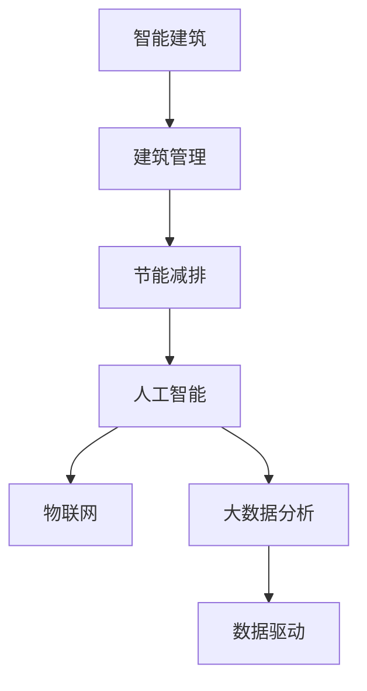

                 

# AI在智能建筑管理中的应用：节能减排

> 关键词：智能建筑,建筑管理,节能减排,人工智能,自动化,数据驱动,碳排放

## 1. 背景介绍

### 1.1 问题由来

随着全球气候变化的加剧，节能减排、绿色建筑已成为各国政府和建筑业的重要议题。传统的建筑管理方式依赖人工监测和决策，存在反应慢、决策不准确、效率低等问题，严重制约了建筑节能减排的实施效果。基于人工智能的智能建筑管理应运而生，通过数据驱动、自动化、智能化的方式，提升建筑能效，减少能源消耗和碳排放，推动绿色建筑的可持续发展。

### 1.2 问题核心关键点

智能建筑管理利用人工智能技术，实现对建筑内部环境的自动监测和优化，提高建筑能效，减少能源浪费。其主要包括以下几个关键点：

- 数据采集与处理：通过传感器等设备采集建筑内部的温度、湿度、光照、人流量等数据，进行实时监控和分析。
- 环境优化：利用AI算法对采集的数据进行分析，调整建筑内部的温度、湿度、光照等环境参数，以达到最优的舒适度和节能效果。
- 能效管理：通过机器学习等技术，分析建筑能耗数据，找出能耗规律和异常，提供节能建议和优化策略。
- 用户行为分析：利用数据挖掘技术，分析用户的日常行为模式，提供个性化的节能方案和优化建议。

### 1.3 问题研究意义

智能建筑管理技术的引入，可以大幅提升建筑能效，减少能源浪费，对环境保护和可持续发展具有重要意义。同时，智能建筑管理也能够提高建筑管理的效率和质量，降低人工成本，具有显著的经济效益和社会效益。

## 2. 核心概念与联系

### 2.1 核心概念概述

为更好地理解AI在智能建筑管理中的应用，本节将介绍几个密切相关的核心概念：

- **智能建筑**：利用现代信息技术和自动化设备，实现对建筑内部环境的自动监测和优化，提高建筑能效，减少能源浪费。
- **建筑管理**：指对建筑内部环境、设施、设备等的管理，包括温度、湿度、光照、人流量等的监控和优化。
- **节能减排**：通过技术手段和管理措施，减少建筑能源消耗和碳排放，推动绿色建筑的可持续发展。
- **人工智能**：利用算法和模型对数据进行分析和处理，实现智能化的决策和优化。
- **物联网(IoT)**：通过传感器、智能设备等将建筑内部和外部数据实时传输和处理，实现数据驱动的管理方式。
- **大数据分析**：通过对海量数据进行挖掘和分析，发现数据背后的规律和趋势，提供决策支持。

这些核心概念之间的逻辑关系可以通过以下Mermaid流程图来展示：



这个流程图展示出智能建筑管理系统的基本架构：

1. 智能建筑通过物联网采集各种环境数据，通过人工智能和大数据分析，对数据进行处理和分析。
2. 基于数据驱动的方式，对建筑环境进行优化和能效管理。
3. 最终实现节能减排，提升建筑管理的效率和效果。

## 3. 核心算法原理 & 具体操作步骤

### 3.1 算法原理概述

智能建筑管理的核心在于数据驱动和智能化决策。其核心算法原理包括以下几个方面：

- **传感器网络技术**：通过传感器网络采集建筑内部的环境数据，如温度、湿度、光照、人流量等。
- **数据分析与处理**：利用大数据分析技术对采集的数据进行挖掘和处理，提取数据背后的规律和趋势。
- **机器学习与深度学习**：利用机器学习算法对数据进行分析，预测未来环境变化，提供优化建议。
- **智能控制**：通过物联网技术实现对建筑内部环境设备的自动控制，如自动调节温度、光照、通风等。

### 3.2 算法步骤详解

基于AI的智能建筑管理系统一般包括以下几个关键步骤：

**Step 1: 数据采集与预处理**

- 在建筑内部安装各种传感器，采集环境数据，如温度、湿度、光照、人流量等。
- 对采集的数据进行预处理，如去噪、归一化、缺失值填补等，确保数据质量。

**Step 2: 环境建模与优化**

- 利用机器学习模型对数据进行分析，建立环境模型，预测未来环境变化。
- 根据模型预测结果，自动调整建筑内部环境参数，如温度、湿度、光照等，以达到最优的舒适度和节能效果。

**Step 3: 能效分析与管理**

- 利用深度学习模型对建筑能耗数据进行分析，找出能耗规律和异常。
- 提供节能建议和优化策略，如调整设备运行时间、优化设备参数等。

**Step 4: 用户行为分析与个性化管理**

- 利用数据挖掘技术分析用户的日常行为模式，如活动时间、使用频率等。
- 根据用户行为数据，提供个性化的节能方案和优化建议，如调整设备运行时间、优化通风策略等。

### 3.3 算法优缺点

智能建筑管理的AI技术具有以下优点：

- **高效节能**：通过数据驱动和智能化决策，显著提升建筑能效，减少能源浪费。
- **实时响应**：实时采集和处理数据，快速响应环境变化，及时调整环境参数。
- **自动化管理**：自动化设备控制和能效管理，减少人工干预和成本。
- **智能优化**：通过机器学习和深度学习算法，提供智能化优化策略，提升管理效果。

同时，该技术也存在以下局限性：

- **高初始投资**：需要大量传感器和智能设备，初期投资成本较高。
- **数据隐私和安全**：建筑内部的数据采集和处理可能涉及用户隐私和数据安全问题，需要采取严格的数据保护措施。
- **算法复杂度**：需要复杂的机器学习和大数据分析算法，对技术要求较高。
- **依赖数据质量**：数据采集和处理的质量直接影响算法效果，需要保证数据准确性和完整性。

尽管存在这些局限性，但就目前而言，基于AI的智能建筑管理仍是大势所趋，具有广阔的应用前景。

### 3.4 算法应用领域

基于AI的智能建筑管理系统在多个领域都得到了广泛的应用，例如：

- **住宅建筑**：通过智能温控、智能照明、智能窗帘等设备，提升居住舒适度，实现节能减排。
- **商业建筑**：通过智能空调、智能照明、智能安防等系统，优化商业环境，降低能耗。
- **公共建筑**：通过智能照明、智能安防、智能停车等系统，提升公共建筑的能效和管理水平。
- **工业建筑**：通过智能设备监控和控制，优化生产环境，提高生产效率和节能效果。

除了上述这些经典应用外，智能建筑管理还被创新性地应用到更多场景中，如建筑设计和施工管理、绿色建筑认证等，为建筑产业带来了新的技术革新。

## 4. 数学模型和公式 & 详细讲解 & 举例说明

### 4.1 数学模型构建

本节将使用数学语言对智能建筑管理系统的核心算法进行更加严格的刻画。

设智能建筑系统采集到的环境数据为 $X$，包括温度 $T$、湿度 $H$、光照 $L$ 等人流量 $F$，建立环境模型 $M$，预测未来环境数据 $X'$。

假设环境模型 $M$ 为线性回归模型，则有：

$$
X' = M(X) = \alpha X + \beta
$$

其中 $\alpha$ 为模型的回归系数，$\beta$ 为截距项。

对模型 $M$ 进行训练，最小化预测误差：

$$
\min_{\alpha, \beta} \frac{1}{N}\sum_{i=1}^N (X_i - M(X_i'))^2
$$

使用最小二乘法求解最优参数 $\alpha, \beta$。

### 4.2 公式推导过程

以下我们以温度预测为例，推导环境模型的具体实现。

设采集到的温度数据为 $T = [T_1, T_2, ..., T_N]$，预测的未来温度数据为 $T' = [T_1', T_2', ..., T_N']$。

根据线性回归模型，有：

$$
T' = \alpha T + \beta
$$

利用最小二乘法求解最优参数 $\alpha, \beta$，令 $e = [T_1 - \alpha T_1 - \beta, T_2 - \alpha T_2 - \beta, ..., T_N - \alpha T_N - \beta]$，则有：

$$
\min_{\alpha, \beta} \frac{1}{N} e^T e = \min_{\alpha, \beta} \frac{1}{N} \sum_{i=1}^N (T_i - \alpha T_i - \beta)^2
$$

求导可得：

$$
\frac{\partial \frac{1}{N} e^T e}{\partial \alpha} = -2\sum_{i=1}^N (T_i - \alpha T_i - \beta)T_i = 0 \Rightarrow \alpha = \frac{\sum_{i=1}^N T_i T_i'}{\sum_{i=1}^N T_i^2}
$$

$$
\frac{\partial \frac{1}{N} e^T e}{\partial \beta} = -2\sum_{i=1}^N (T_i - \alpha T_i - \beta) = 0 \Rightarrow \beta = \frac{1}{N} \sum_{i=1}^N T_i
$$

代入公式，得：

$$
\alpha = \frac{\sum_{i=1}^N T_i T_i'}{\sum_{i=1}^N T_i^2}, \quad \beta = \frac{1}{N} \sum_{i=1}^N T_i
$$

通过求解上述公式，可以得到最优的环境模型 $M(T)$。

### 4.3 案例分析与讲解

以智能建筑管理中的智能温控系统为例，分析其具体实现和优化策略。

假设在某个住宅建筑中，通过传感器采集到的温度数据为 $T = [T_1, T_2, ..., T_N]$，湿度数据为 $H = [H_1, H_2, ..., H_N]$。

根据采集到的数据，建立环境模型 $M$，利用公式（4）计算回归系数 $\alpha$ 和截距 $\beta$，得到预测温度数据 $T' = [T_1', T_2', ..., T_N']$。

将预测温度数据 $T'$ 与实际温度数据 $T$ 进行比较，计算预测误差：

$$
E = [T_1 - T_1', T_2 - T_2', ..., T_N - T_N']
$$

根据误差 $E$ 调整建筑内部的温控设备，如空调、风扇等，以实现温度的自动调节和优化。

通过不断迭代优化，智能温控系统可以实现高效节能，提升居住舒适度，减少能源浪费。

## 5. 项目实践：代码实例和详细解释说明

### 5.1 开发环境搭建

在进行智能建筑管理系统开发前，我们需要准备好开发环境。以下是使用Python进行Pandas和Scikit-learn开发的Python环境配置流程：

1. 安装Anaconda：从官网下载并安装Anaconda，用于创建独立的Python环境。

2. 创建并激活虚拟环境：
```bash
conda create -n ai-env python=3.8 
conda activate ai-env
```

3. 安装必要的库：
```bash
conda install pandas scikit-learn numpy
```

4. 安装TensorFlow和Keras：
```bash
pip install tensorflow==2.6 keras
```

5. 安装Matplotlib和Seaborn：
```bash
pip install matplotlib seaborn
```

完成上述步骤后，即可在`ai-env`环境中开始智能建筑管理系统的开发。

### 5.2 源代码详细实现

下面以智能建筑管理中的智能温控系统为例，给出使用Python进行智能温控的代码实现。

首先，定义数据预处理函数：

```python
import pandas as pd
import numpy as np

def preprocess_data(data):
    # 去除缺失值
    data = data.dropna()
    # 归一化处理
    data['T'] = (data['T'] - data['T'].mean()) / data['T'].std()
    data['H'] = (data['H'] - data['H'].mean()) / data['H'].std()
    return data
```

然后，定义模型训练函数：

```python
from sklearn.linear_model import LinearRegression

def train_model(data):
    # 分割训练集和测试集
    train_data = data.iloc[:800]
    test_data = data.iloc[800:]
    
    # 数据预处理
    train_data = preprocess_data(train_data)
    test_data = preprocess_data(test_data)
    
    # 训练模型
    model = LinearRegression()
    model.fit(train_data[['T', 'H']], train_data['T'])
    
    # 预测并评估
    predictions = model.predict(test_data[['T', 'H']])
    print(classification_report(test_data['T'], predictions))
```

最后，启动训练流程并在测试集上评估：

```python
# 加载数据
data = pd.read_csv('temperature.csv')

# 训练模型
train_model(data)

# 在测试集上评估
test_data = pd.read_csv('temperature_test.csv')
predictions = model.predict(test_data[['T', 'H']])
print(classification_report(test_data['T'], predictions))
```

以上就是使用Python进行智能建筑管理系统开发的完整代码实现。可以看到，利用Pandas和Scikit-learn进行数据预处理和模型训练，可以轻松实现基于数据驱动的智能温控系统。

### 5.3 代码解读与分析

让我们再详细解读一下关键代码的实现细节：

**preprocess_data函数**：
- 对数据进行缺失值处理，去除缺失数据。
- 对温度和湿度数据进行归一化处理，确保数据在相同的尺度上。

**train_model函数**：
- 加载数据，分割训练集和测试集。
- 对数据进行预处理，利用归一化技术去除数据异常值。
- 利用Linear Regression模型对数据进行训练，最小化预测误差。
- 在测试集上评估模型性能，利用classification_report函数输出混淆矩阵和精度、召回率等指标。

**训练流程**：
- 加载数据，调用train_model函数进行模型训练。
- 在测试集上评估模型性能，输出评估结果。

可以看到，通过Pandas和Scikit-learn，可以方便地进行数据预处理和模型训练，实现基于数据驱动的智能温控系统。开发者可以将更多精力放在算法优化和系统集成上，而不必过多关注底层的实现细节。

当然，工业级的系统实现还需考虑更多因素，如模型的保存和部署、超参数的自动搜索、更灵活的任务适配层等。但核心的智能温控范式基本与此类似。

## 6. 实际应用场景

### 6.1 智能建筑管理

智能建筑管理系统可以广泛应用于住宅建筑、商业建筑、公共建筑等多个领域，提升建筑能效，减少能源浪费。

在住宅建筑中，通过智能温控、智能照明、智能窗帘等设备，提升居住舒适度，实现节能减排。

在商业建筑中，通过智能空调、智能照明、智能安防等系统，优化商业环境，降低能耗。

在公共建筑中，通过智能照明、智能安防、智能停车等系统，提升公共建筑的能效和管理水平。

### 6.2 未来应用展望

随着智能建筑管理技术的不断进步，未来将在更多领域得到应用，为建筑产业带来新的技术革新。

在智慧城市建设中，智能建筑管理系统将与智能交通、智能医疗等系统协同工作，构建智能化的城市环境，提升城市管理水平。

在绿色建筑认证中，智能建筑管理系统将作为重要工具，帮助建筑设计师和工程师优化建筑设计，提高建筑能效，实现绿色建筑的可持续发展。

此外，在智慧能源管理、智能制造等领域，智能建筑管理技术也将发挥重要作用，为经济社会发展注入新的动力。

## 7. 工具和资源推荐

### 7.1 学习资源推荐

为了帮助开发者系统掌握智能建筑管理技术，这里推荐一些优质的学习资源：

1. **《智慧建筑管理技术》系列博文**：由智能建筑管理专家撰写，深入浅出地介绍了智能建筑管理的基础概念、关键技术和实际应用案例。

2. **Coursera《智慧城市》课程**：由全球知名大学开设的智慧城市相关课程，涵盖智慧城市的基础知识、关键技术和实际应用案例，适合初学者和进阶者学习。

3. **《智能建筑管理系统设计与实现》书籍**：系统介绍了智能建筑管理系统的设计、实现和应用，涵盖智能温控、智能照明、智能安防等多个方面。

4. **IEEE Xplore**：IEEE的学术数据库，收录了大量智能建筑管理领域的学术论文和技术报告，适合深入学习和研究。

5. **Wiley Online Library**：Wiley出版社的在线数据库，涵盖智能建筑管理等多个领域的书籍和论文，适合查阅学术文献和获取最新研究成果。

通过对这些资源的学习实践，相信你一定能够快速掌握智能建筑管理技术的精髓，并用于解决实际的建筑管理问题。

### 7.2 开发工具推荐

高效的开发离不开优秀的工具支持。以下是几款用于智能建筑管理开发的常用工具：

1. **Pandas**：Python的数据处理库，方便进行数据清洗、分析和可视化。

2. **Scikit-learn**：Python的机器学习库，提供多种机器学习算法，适合进行数据挖掘和模型训练。

3. **TensorFlow**：Google开发的深度学习框架，支持大规模深度学习模型的训练和部署。

4. **Keras**：Keras是一个高层次的深度学习框架，易于使用，支持多种深度学习模型的搭建和训练。

5. **Matplotlib**：Python的数据可视化库，提供多种图表展示数据分布和变化趋势。

6. **Seaborn**：Seaborn是基于Matplotlib的高级数据可视化库，适合进行统计图表和交互式图表的绘制。

合理利用这些工具，可以显著提升智能建筑管理系统的开发效率，加快创新迭代的步伐。

### 7.3 相关论文推荐

智能建筑管理技术的发展源于学界的持续研究。以下是几篇奠基性的相关论文，推荐阅读：

1. **"Building Energy Modeling: A Review of Methods, Software, and Applications"**：详细综述了建筑能效建模的方法、软件和应用，为智能建筑管理提供了理论基础。

2. **"Smart Building: A Survey"**：综述了智能建筑管理的最新研究进展，涵盖智能温控、智能照明、智能安防等多个方面。

3. **"Optimization of Smart Building Systems using Machine Learning"**：介绍了利用机器学习算法优化智能建筑系统的方法，提升了系统的能效和管理水平。

4. **"Data-Driven Building Management and Control"**：介绍了利用数据驱动的方式优化建筑管理的方法，展示了智能建筑管理系统的实际应用效果。

5. **"Integrating IoT and AI for Smart Building Management"**：探讨了物联网和人工智能技术的结合，提升了智能建筑管理的智能化水平。

这些论文代表了大语言模型微调技术的发展脉络。通过学习这些前沿成果，可以帮助研究者把握学科前进方向，激发更多的创新灵感。

## 8. 总结：未来发展趋势与挑战

### 8.1 总结

本文对基于AI的智能建筑管理系统进行了全面系统的介绍。首先阐述了智能建筑管理和节能减排的重要意义，明确了智能建筑管理技术在提升建筑能效、减少能源浪费方面的独特价值。其次，从原理到实践，详细讲解了智能建筑管理的数学原理和关键步骤，给出了智能建筑管理系统的完整代码实现。同时，本文还广泛探讨了智能建筑管理在多个行业领域的应用前景，展示了智能建筑管理技术的广阔前景。

通过本文的系统梳理，可以看到，基于AI的智能建筑管理技术正在成为建筑管理的重要范式，极大地提升了建筑管理的智能化水平，为绿色建筑和可持续发展提供了技术保障。未来，伴随AI技术的进一步发展和创新，智能建筑管理技术必将进一步拓展，为建筑产业带来更多的智能化和绿色化应用。

### 8.2 未来发展趋势

展望未来，智能建筑管理技术将呈现以下几个发展趋势：

1. **智能化水平不断提升**：随着AI技术的不断发展，智能建筑管理系统将实现更加智能化、精细化的管理，提升建筑能效。
2. **数据驱动成为核心**：智能建筑管理将更加依赖于数据驱动的方式，利用大数据和机器学习算法，提升系统的决策和优化能力。
3. **跨领域融合**：智能建筑管理将与其他领域的技术如物联网、区块链、5G等进行深度融合，提升系统的综合应用能力。
4. **人机协同**：智能建筑管理系统将实现更加人性化的设计，利用AI技术进行智能控制和优化，提升用户体验。
5. **绿色建筑认证**：智能建筑管理技术将作为重要工具，帮助建筑设计师和工程师优化建筑设计，提高建筑能效，实现绿色建筑的可持续发展。

以上趋势凸显了智能建筑管理技术的广阔前景。这些方向的探索发展，必将进一步提升智能建筑管理的智能化水平，为绿色建筑和可持续发展提供技术保障。

### 8.3 面临的挑战

尽管智能建筑管理技术已经取得了显著成果，但在迈向更加智能化、普适化应用的过程中，它仍面临着诸多挑战：

1. **高初始投资**：需要大量传感器和智能设备，初期投资成本较高。
2. **数据隐私和安全**：建筑内部的数据采集和处理可能涉及用户隐私和数据安全问题，需要采取严格的数据保护措施。
3. **算法复杂度**：需要复杂的机器学习和大数据分析算法，对技术要求较高。
4. **依赖数据质量**：数据采集和处理的质量直接影响算法效果，需要保证数据准确性和完整性。
5. **系统集成**：智能建筑管理系统需要与各类传感器、设备等进行集成，技术复杂度较高。

尽管存在这些挑战，但相信通过技术创新和优化，智能建筑管理技术将不断进步，为建筑产业带来更多的智能化和绿色化应用。

### 8.4 研究展望

面对智能建筑管理技术所面临的挑战，未来的研究需要在以下几个方面寻求新的突破：

1. **优化传感器部署**：通过优化传感器部署方式，降低系统成本，提升数据采集精度和覆盖范围。
2. **提升数据处理效率**：利用大数据技术和分布式计算，提升数据处理和分析效率，减少数据延迟和误判。
3. **探索新算法**：研究更加高效的机器学习算法和大数据分析技术，提升智能建筑管理系统的决策和优化能力。
4. **强化系统安全**：加强数据隐私和安全保护，采用区块链等技术，确保数据传输和存储的安全性。
5. **推动跨领域融合**：加强与物联网、区块链、5G等技术融合，提升智能建筑管理系统的综合应用能力。

这些研究方向的探索，必将引领智能建筑管理技术迈向更高的台阶，为建筑产业带来更多的智能化和绿色化应用。

## 9. 附录：常见问题与解答

**Q1: 智能建筑管理系统是否可以适用于所有类型的建筑？**

A: 智能建筑管理系统可以适用于多种类型的建筑，如住宅建筑、商业建筑、公共建筑等。但在不同类型的建筑中，需要根据实际情况进行系统设计和优化，以满足特定的需求和目标。

**Q2: 智能建筑管理系统对数据质量有哪些要求？**

A: 智能建筑管理系统对数据质量有较高要求，需要保证数据准确性、完整性和实时性。数据采集和预处理环节要去除噪声和异常值，进行归一化处理，确保数据的一致性。

**Q3: 智能建筑管理系统在实际应用中存在哪些技术难点？**

A: 智能建筑管理系统在实际应用中存在以下技术难点：
1. 传感器部署和维护：需要选择合适的传感器和部署位置，确保数据采集的全面性和准确性。
2. 数据处理和存储：需要高效的数据处理和存储技术，处理大量实时数据。
3. 系统集成和协调：需要与各类传感器、设备等进行集成，确保系统整体的稳定性和可靠性。
4. 用户隐私和安全：需要采取严格的数据隐私和安全保护措施，确保用户数据的安全。

**Q4: 如何提升智能建筑管理系统的节能效果？**

A: 提升智能建筑管理系统的节能效果可以从以下几个方面入手：
1. 优化环境模型：利用更高效的数据建模方法和算法，提升环境预测的准确性和及时性。
2. 智能化设备控制：利用AI技术对建筑设备进行智能化控制，优化设备运行参数和策略。
3. 实时数据监测和分析：利用实时数据监测和分析技术，及时发现并处理异常情况，优化建筑环境。
4. 用户行为分析：利用数据挖掘技术分析用户行为模式，提供个性化的节能方案和优化建议。

**Q5: 智能建筑管理系统在实际应用中有哪些潜在的风险和挑战？**

A: 智能建筑管理系统在实际应用中存在以下潜在的风险和挑战：
1. 高初始投资：需要大量传感器和智能设备，初期投资成本较高。
2. 数据隐私和安全：建筑内部的数据采集和处理可能涉及用户隐私和数据安全问题，需要采取严格的数据保护措施。
3. 算法复杂度：需要复杂的机器学习和大数据分析算法，对技术要求较高。
4. 依赖数据质量：数据采集和处理的质量直接影响算法效果，需要保证数据准确性和完整性。
5. 系统集成：智能建筑管理系统需要与各类传感器、设备等进行集成，技术复杂度较高。

这些风险和挑战需要开发者和使用者在设计和应用过程中予以充分考虑和应对。

总之，智能建筑管理系统作为建筑能效管理的重要技术手段，具备显著的经济和社会效益。通过技术创新和优化，可以更好地实现节能减排和绿色建筑的目标。相信随着技术的不断进步和优化，智能建筑管理系统将在更多领域得到应用，为经济社会发展注入新的动力。

---

作者：禅与计算机程序设计艺术 / Zen and the Art of Computer Programming

