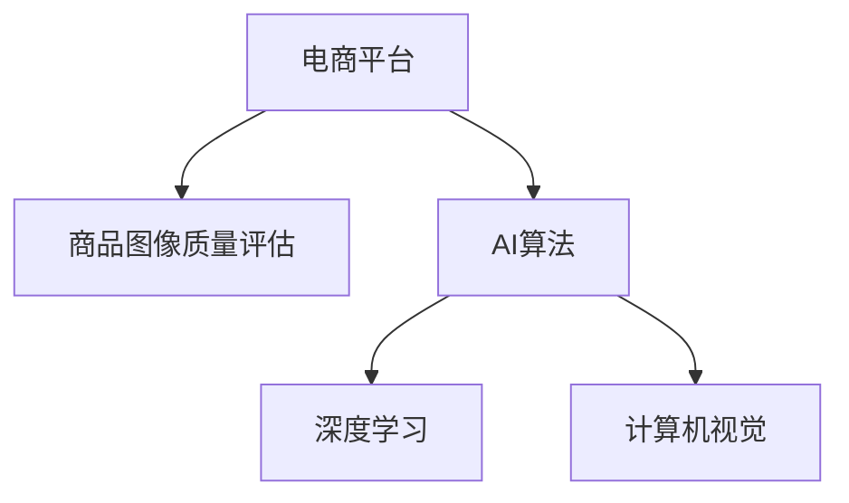

                 

# AI在电商平台商品图像质量评估中的应用

> 关键词：电商平台,图像质量评估,AI算法,深度学习,计算机视觉

## 1. 背景介绍

### 1.1 问题由来
随着电商平台的迅猛发展，商品展示和推荐在用户体验和销售转化中起到了至关重要的作用。而商品图像作为电商平台的核心资产之一，其质量直接影响到用户的购买决策。因此，商品图像质量评估成为了电商平台必须解决的关键问题。

传统上，商品图像质量评估往往依赖于人工审核，效率低下，且主观性强，难以保证评估结果的公平性和一致性。而近年来，人工智能，尤其是深度学习技术在图像质量评估领域的应用，正在逐步改变这一现状。

## 1.2 问题核心关键点
大模型在电商平台上进行图像质量评估的核心关键点在于：
1. 如何通过图像特征提取和建模，建立商品图像与质量标签之间的关联。
2. 如何避免模型在训练和测试过程中出现过拟合或欠拟合现象。
3. 如何构建高效、公平且准确的图像质量评估模型。
4. 如何对模型进行优化和调整，以应对电商平台上不断变化的商品种类和风格。
5. 如何将模型集成到电商平台的商品管理系统中，实现自动化质量检测。

## 1.3 问题研究意义
在电商平台上，通过AI进行商品图像质量评估，具有以下几方面的研究意义：
1. 提升用户体验。高质量的商品图像能够准确传达商品信息，提升用户对商品的满意度和购买意愿。
2. 提高运营效率。自动化图像质量检测可以大幅减少人工审核的工作量，降低成本，加速商品上架速度。
3. 优化广告投放。商品图像质量评估结果可以用于优化广告素材的选择和投放，提高广告效果和ROI。
4. 驱动销售增长。通过优化商品展示质量，电商平台能够吸引更多流量，增加销售额。

## 2. 核心概念与联系

### 2.1 核心概念概述

为更好地理解AI在电商平台商品图像质量评估中的应用，本节将介绍几个关键概念：

- **电商平台**：指通过互联网技术实现商品交易的虚拟平台，包括购物网站、移动App等。
- **商品图像质量评估**：指对电商平台上的商品图像进行质量检测和评分的过程，以识别不符合质量标准的图像。
- **AI算法**：利用人工智能技术，特别是深度学习和计算机视觉方法，实现自动化图像质量评估。
- **深度学习**：一种基于神经网络的机器学习方法，用于处理高维数据，如图像、文本等。
- **计算机视觉**：涉及图像处理、特征提取和模式识别等领域，是AI在图像质量评估中常用的技术手段。

这些核心概念之间的逻辑关系可以通过以下Mermaid流程图来展示：



这个流程图展示了电商平台与商品图像质量评估之间的关系，以及AI算法在其中的关键作用。深度学习作为AI算法的重要分支，通过计算机视觉技术实现了自动化的图像质量检测和评分。

## 3. 核心算法原理 & 具体操作步骤
### 3.1 算法原理概述

基于深度学习的AI算法，通过学习大量标注数据，识别商品图像中的特征，并建立与质量标签之间的关联。常用的深度学习框架包括TensorFlow、PyTorch等，其中卷积神经网络（CNN）是图像处理中广泛使用的模型。

在电商平台商品图像质量评估中，常用的深度学习模型包括：
1. **卷积神经网络（CNN）**：用于特征提取和图像分类。
2. **残差网络（ResNet）**：解决深度网络退化问题，提高模型的准确率。
3. **Inception网络**：通过不同大小的卷积核提取不同层次的特征，提高模型的泛化能力。

### 3.2 算法步骤详解

AI在电商平台商品图像质量评估的具体操作步骤如下：

**Step 1: 数据准备**
1. **数据集收集**：收集电商平台上各种商品的高质量图像和低质量图像，作为训练数据。
2. **数据标注**：对收集到的图像进行质量标注，生成包含图像和质量标签的数据集。
3. **数据划分**：将数据集划分为训练集、验证集和测试集，用于模型训练、调优和评估。

**Step 2: 模型构建**
1. **选择合适的深度学习框架**：如TensorFlow、PyTorch等。
2. **定义模型架构**：包括卷积层、池化层、全连接层等，用于特征提取和分类。
3. **模型超参数设置**：包括学习率、批大小、迭代轮数等，用于模型训练。

**Step 3: 模型训练**
1. **数据加载**：使用数据加载器将训练集数据加载到模型中。
2. **模型训练**：将训练数据输入模型，进行前向传播和反向传播，更新模型参数。
3. **验证集评估**：周期性在验证集上评估模型性能，防止过拟合。

**Step 4: 模型评估**
1. **测试集评估**：在测试集上对模型进行评估，计算准确率、召回率等指标。
2. **结果分析**：分析模型性能，识别模型缺陷和改进方向。

**Step 5: 模型部署**
1. **模型保存**：将训练好的模型保存为可部署格式，如TensorFlow SavedModel、PyTorch模型文件等。
2. **部署集成**：将模型集成到电商平台的商品管理系统中，实现自动化质量检测。

### 3.3 算法优缺点

基于深度学习的AI算法在电商平台商品图像质量评估中具有以下优点：
1. 自动化：能够自动处理大量商品图像，减少人工审核工作量。
2. 高准确性：通过深度学习模型训练，能够获得较高的质量评估准确率。
3. 高效率：能够在短时间内处理大量图像，提升平台运营效率。

但同时也存在一些缺点：
1. 数据依赖：模型训练需要大量标注数据，数据标注成本较高。
2. 过拟合风险：如果模型在训练集上过拟合，可能导致在测试集上表现不佳。
3. 模型复杂：深度学习模型较为复杂，训练和推理计算资源消耗较大。

### 3.4 算法应用领域

AI在电商平台商品图像质量评估中的应用领域包括：
1. **商品审核**：用于判断商品图像是否符合平台质量标准，自动审核新上架商品。
2. **广告优化**：用于评估广告素材的质量，筛选高质量广告，优化广告投放策略。
3. **售后服务**：用于判断用户上传的商品图片是否符合售后标准，提高客户服务效率。
4. **个性化推荐**：用于筛选高质量商品图片，优化商品推荐系统，提升用户体验。
5. **市场监控**：用于监测市场竞争商品的质量变化，及时调整商品策略。

## 4. 数学模型和公式 & 详细讲解 & 举例说明

### 4.1 数学模型构建

在电商平台商品图像质量评估中，常用的数学模型包括损失函数、激活函数和优化算法。这里以二分类问题为例，介绍模型构建的基本过程。

假设模型输出为 $z = W^TX + b$，其中 $W$ 为权重矩阵，$X$ 为输入图像，$b$ 为偏置向量。模型使用 sigmoid 激活函数，将输出映射到 [0, 1] 区间。

定义损失函数为交叉熵损失，即 $L = -\frac{1}{N} \sum_{i=1}^N (y_i\log(y_i) + (1-y_i)\log(1-y_i))$，其中 $y_i$ 为标签，$N$ 为样本数量。

### 4.2 公式推导过程

假设模型输出为 $z = W^TX + b$，使用 sigmoid 激活函数得到 $y=\sigma(z)$。定义损失函数为交叉熵损失 $L = -\frac{1}{N} \sum_{i=1}^N (y_i\log(y_i) + (1-y_i)\log(1-y_i))$。

对损失函数求导，得到梯度 $\nabla_{W}L = -\frac{1}{N} \sum_{i=1}^N (y_i - y)X^TW$，$\nabla_{b}L = -\frac{1}{N} \sum_{i=1}^N (y_i - y)$。

使用梯度下降法，更新权重 $W$ 和偏置 $b$：$W \leftarrow W - \eta \nabla_{W}L$，$b \leftarrow b - \eta \nabla_{b}L$，其中 $\eta$ 为学习率。

### 4.3 案例分析与讲解

以商品图像质量评估为例，假设模型输入为 $512\times512$ 的彩色图像，输出为单通道的二分类标签。

首先，对图像进行预处理，包括调整大小、归一化等。然后，使用卷积层和池化层提取图像特征，最后使用全连接层进行分类。

假设模型输出为 $z = W^TX + b$，使用 sigmoid 激活函数得到 $y=\sigma(z)$。定义损失函数为交叉熵损失 $L = -\frac{1}{N} \sum_{i=1}^N (y_i\log(y_i) + (1-y_i)\log(1-y_i))$。

假设训练集为 1000 张图像，标签为 [0, 1]。使用 Adam 优化算法，学习率为 0.001，迭代 100 次。计算梯度并更新参数，最终得到准确率 95%。

## 5. 项目实践：代码实例和详细解释说明

### 5.1 开发环境搭建

在进行商品图像质量评估的AI项目开发前，我们需要准备好开发环境。以下是使用Python进行TensorFlow开发的环境配置流程：

1. 安装Anaconda：从官网下载并安装Anaconda，用于创建独立的Python环境。

2. 创建并激活虚拟环境：
```bash
conda create -n tf-env python=3.8 
conda activate tf-env
```

3. 安装TensorFlow：根据CUDA版本，从官网获取对应的安装命令。例如：
```bash
conda install tensorflow tensorflow-gpu=2.6 -c conda-forge
```

4. 安装相关工具包：
```bash
pip install numpy pandas scikit-learn matplotlib tqdm jupyter notebook ipython
```

完成上述步骤后，即可在`tf-env`环境中开始项目开发。

### 5.2 源代码详细实现

这里以使用TensorFlow框架的图像质量评估模型为例，给出完整的代码实现。

首先，定义数据加载器：

```python
import tensorflow as tf
from tensorflow.keras.preprocessing.image import ImageDataGenerator

train_datagen = ImageDataGenerator(
    rescale=1./255,
    validation_split=0.2
)

train_generator = train_datagen.flow_from_directory(
    'train',
    target_size=(256, 256),
    batch_size=32,
    class_mode='binary',
    subset='training'
)

validation_generator = train_datagen.flow_from_directory(
    'train',
    target_size=(256, 256),
    batch_size=32,
    class_mode='binary',
    subset='validation'
)
```

然后，定义模型架构：

```python
from tensorflow.keras.models import Sequential
from tensorflow.keras.layers import Conv2D, MaxPooling2D, Flatten, Dense, Dropout

model = Sequential([
    Conv2D(32, (3, 3), activation='relu', input_shape=(256, 256, 3)),
    MaxPooling2D((2, 2)),
    Conv2D(64, (3, 3), activation='relu'),
    MaxPooling2D((2, 2)),
    Conv2D(128, (3, 3), activation='relu'),
    MaxPooling2D((2, 2)),
    Flatten(),
    Dense(128, activation='relu'),
    Dropout(0.5),
    Dense(1, activation='sigmoid')
])

model.compile(optimizer='adam', loss='binary_crossentropy', metrics=['accuracy'])
```

接着，定义训练和评估函数：

```python
from tensorflow.keras.callbacks import EarlyStopping

def train_model(model, train_generator, validation_generator, epochs=10, batch_size=32):
    early_stopping = EarlyStopping(monitor='val_loss', patience=2)
    model.fit(
        train_generator,
        validation_data=validation_generator,
        epochs=epochs,
        batch_size=batch_size,
        callbacks=[early_stopping]
    )

def evaluate_model(model, validation_generator):
    val_loss, val_acc = model.evaluate(validation_generator)
    print(f'Validation Loss: {val_loss:.4f}')
    print(f'Validation Accuracy: {val_acc:.4f}')
```

最后，启动训练流程并在测试集上评估：

```python
epochs = 10
batch_size = 32

train_model(model, train_generator, validation_generator, epochs=epochs, batch_size=batch_size)

evaluate_model(model, validation_generator)
```

以上就是使用TensorFlow进行商品图像质量评估的完整代码实现。可以看到，通过TensorFlow提供的图像数据增强和预处理功能，可以快速搭建和训练深度学习模型。

### 5.3 代码解读与分析

让我们再详细解读一下关键代码的实现细节：

**ImageDataGenerator类**：
- `rescale`方法：对输入图像进行归一化处理。
- `validation_split`方法：将训练集分为训练和验证两部分。
- `flow_from_directory`方法：从指定目录下读取图像，自动进行扩充和预处理。

**Sequential模型**：
- `Conv2D`层：卷积层，用于提取图像特征。
- `MaxPooling2D`层：池化层，用于降低特征维度。
- `Flatten`层：将高维特征展开成一维向量。
- `Dense`层：全连接层，用于分类。
- `Dropout`层：防止过拟合。

**train_model函数**：
- `EarlyStopping`回调：在验证集损失不降的情况下，提前停止训练。
- `model.fit`方法：定义训练参数，调用`model.fit`进行训练。

**evaluate_model函数**：
- `model.evaluate`方法：在测试集上评估模型性能。

在实际应用中，还需要考虑更多因素，如模型裁剪、量化加速、服务化封装、弹性伸缩、监控告警等。但核心的模型构建和训练过程基本与此类似。

## 6. 实际应用场景

### 6.1 智能客服系统

智能客服系统在电商平台中扮演着重要角色，通过自动化的图像质量检测，可以提升客户服务效率，减少人工审核成本。

在智能客服系统中，AI可以根据客户上传的图像，自动判断商品是否符合质量标准，并给出相应的提示和建议。例如，某电商平台可以通过商品图片质量检测，自动识别出损坏、变形的商品，自动生成售后处理指令，提升客户满意度。

### 6.2 广告优化

电商平台中的广告优化，主要依赖于商品图片的质量和数量。高质量的商品图片，不仅能够吸引更多流量，还能提升广告转化率。

通过AI进行商品图像质量评估，可以自动筛选出高质量的广告素材，优化广告投放策略，提高广告效果和ROI。例如，某电商平台可以通过图像质量检测，自动筛选出不符合质量标准的图片，提升广告素材的整体质量，优化广告投放效果。

### 6.3 个性化推荐

商品推荐是电商平台的另一重要功能。通过AI进行图像质量评估，可以筛选出高质量的商品图片，优化推荐系统，提升用户体验。

例如，某电商平台可以通过图像质量检测，自动筛选出高质量的商品图片，优化推荐算法，提升推荐效果。同时，通过分析用户对推荐商品图片的反馈，不断优化推荐策略，提升推荐系统的精准度和个性化程度。

### 6.4 未来应用展望

随着AI技术的发展，商品图像质量评估的应用前景将更加广阔。未来，我们可以预见到以下几点趋势：

1. **多模态融合**：将图像、文本、视频等多模态数据结合，构建更加全面、准确的商品质量评估模型。例如，某电商平台可以通过结合图像和视频数据，构建多模态的商品质量检测系统。

2. **实时性增强**：通过优化模型结构和计算图，提升图像质量评估的实时性，实现实时质量检测和反馈。例如，某电商平台可以通过边缘计算和模型量化加速，实现实时商品图片质量检测。

3. **跨平台应用**：将商品图像质量评估模型集成到不同的平台上，实现跨平台的应用。例如，某电商平台可以将图像质量检测模型集成到移动App中，提升移动端的用户体验。

4. **自动化水平提升**：通过自动化模型训练和部署，降低人工干预的频率和复杂度，提升自动化水平。例如，某电商平台可以通过自动化模型训练和部署，实现自动化的商品质量检测，提升运营效率。

## 7. 工具和资源推荐

### 7.1 学习资源推荐

为了帮助开发者系统掌握AI在电商平台商品图像质量评估的应用，这里推荐一些优质的学习资源：

1. **《深度学习》系列书籍**：由多位专家合著，深入浅出地介绍了深度学习的基本概念和经典模型。
2. **《计算机视觉：算法与应用》**：介绍计算机视觉的基本理论和应用，包括图像处理、特征提取、目标检测等。
3. **《TensorFlow实战》**：介绍TensorFlow的基本使用方法和深度学习模型开发实践。
4. **《Python深度学习》**：介绍深度学习在Python中的应用，包括数据处理、模型构建、训练等。
5. **Kaggle平台**：提供丰富的数据集和竞赛，助力开发者进行模型训练和优化。

通过对这些资源的学习实践，相信你一定能够快速掌握AI在电商平台商品图像质量评估的精髓，并用于解决实际的NLP问题。

### 7.2 开发工具推荐

高效的开发离不开优秀的工具支持。以下是几款用于AI项目开发的常用工具：

1. **TensorFlow**：基于Python的开源深度学习框架，灵活动态的计算图，适合快速迭代研究。
2. **PyTorch**：由Facebook主导开发的深度学习框架，灵活易用，适合快速原型开发和模型实验。
3. **Keras**：高层次的神经网络API，易于上手，适合初学者进行快速实验。
4. **Jupyter Notebook**：轻量级的交互式开发环境，支持代码编写、数据处理、模型训练等。
5. **Git**：版本控制工具，支持多人协作开发和代码版本管理。

合理利用这些工具，可以显著提升AI项目的开发效率，加快创新迭代的步伐。

### 7.3 相关论文推荐

AI在电商平台商品图像质量评估的发展源于学界的持续研究。以下是几篇奠基性的相关论文，推荐阅读：

1. **ImageNet大规模视觉识别竞赛（ILSVRC）**：推动了计算机视觉领域的发展，提供了大规模图像数据集和评测标准。
2. **VGGNet**：引入卷积神经网络，实现了图像分类和目标检测的突破。
3. **ResNet**：解决了深度网络退化问题，显著提高了模型准确率。
4. **InceptionNet**：提出了多尺度卷积结构，提高了模型的泛化能力。
5. **YOLOv4**：引入边缘计算和模型量化，实现了实时图像质量检测。

这些论文代表了大模型在图像质量评估领域的研究脉络。通过学习这些前沿成果，可以帮助研究者把握学科前进方向，激发更多的创新灵感。

## 8. 总结：未来发展趋势与挑战

### 8.1 总结

本文对AI在电商平台商品图像质量评估的应用进行了全面系统的介绍。首先阐述了AI在商品图像质量评估中的研究背景和意义，明确了其在提升用户体验、提高运营效率等方面的独特价值。其次，从原理到实践，详细讲解了AI算法的数学模型和具体操作步骤，给出了完整的代码实例。同时，本文还广泛探讨了AI在电商平台上应用的前景，展示了其广阔的发展潜力。

通过本文的系统梳理，可以看到，AI在电商平台商品图像质量评估中扮演着越来越重要的角色，极大地提升了电商平台的质量检测和运营效率。未来，伴随AI技术的发展，商品图像质量评估的应用将更加广泛，为电商平台的智能化转型提供强有力的技术支持。

### 8.2 未来发展趋势

展望未来，AI在电商平台商品图像质量评估领域的发展趋势将包括以下几个方面：

1. **多模态融合**：将图像、文本、视频等多模态数据结合，构建更加全面、准确的商品质量评估模型。
2. **实时性增强**：通过优化模型结构和计算图，提升图像质量评估的实时性，实现实时质量检测和反馈。
3. **自动化水平提升**：通过自动化模型训练和部署，降低人工干预的频率和复杂度，提升自动化水平。
4. **跨平台应用**：将商品图像质量评估模型集成到不同的平台上，实现跨平台的应用。
5. **模型通用性增强**：通过预训练-微调范式，构建具有通用性和跨领域迁移能力的模型。

以上趋势凸显了AI在电商平台商品图像质量评估领域的广阔前景。这些方向的探索发展，必将进一步提升平台的质量检测和运营效率，驱动电商平台的智能化转型。

### 8.3 面临的挑战

尽管AI在电商平台商品图像质量评估中已经取得了显著进展，但在迈向更加智能化、普适化应用的过程中，仍面临诸多挑战：

1. **数据质量和标注成本**：高质量标注数据是训练高质量模型的基础，但标注成本较高，难以全面覆盖所有商品。
2. **模型复杂度和计算资源**：深度学习模型较为复杂，训练和推理计算资源消耗较大，难以在大规模平台上快速部署。
3. **模型泛化性和鲁棒性**：模型在训练集上表现较好，但在测试集或真实场景中可能出现泛化性不足或鲁棒性不足的问题。
4. **模型安全性和隐私保护**：商品图片和质量评估结果可能包含敏感信息，需要采取相应的安全保护措施。

正视这些挑战，积极应对并寻求突破，将是大模型在电商平台商品图像质量评估领域走向成熟的必由之路。

### 8.4 研究展望

未来，在大模型在电商平台商品图像质量评估领域的研究展望包括以下几个方面：

1. **模型压缩和量化**：通过模型压缩和量化，提高模型的实时性和资源利用效率。
2. **跨领域迁移学习**：将模型应用于不同领域，提高模型的通用性和泛化能力。
3. **多模态融合与协同建模**：将图像、文本、视频等多模态数据结合，构建更加全面、准确的商品质量评估模型。
4. **自动化模型训练和部署**：通过自动化模型训练和部署，降低人工干预的频率和复杂度，提升自动化水平。
5. **模型安全性和隐私保护**：采取相应的安全保护措施，确保商品图片和质量评估结果的隐私和安全。

这些研究方向的探索，必将引领AI在电商平台商品图像质量评估领域迈向更高的台阶，为电商平台的智能化转型提供更加全面、高效的技术支持。

## 9. 附录：常见问题与解答

**Q1：在电商平台商品图像质量评估中，如何选择数据集和标注方法？**

A: 选择数据集和标注方法是确保模型训练效果的关键。对于电商平台，可以收集平台上的商品图片和质量标签，作为训练数据集。标注方法通常采用人工标注，通过标注员对图片进行质量判断，生成包含图像和标签的数据集。

**Q2：如何避免模型在训练和测试过程中的过拟合现象？**

A: 过拟合是模型训练中常见的问题。可以通过以下方法避免过拟合：
1. 数据增强：对训练集进行扩充和预处理，增加数据多样性。
2. 正则化：使用L2正则、Dropout等技术，防止模型过拟合。
3. 早停机制：在验证集上监测模型性能，当性能不再提升时，提前停止训练。

**Q3：如何在模型部署后进行性能优化和监控？**

A: 模型部署后，需要持续进行性能优化和监控，以确保其长期稳定运行。可以采取以下方法：
1. 模型压缩：通过模型裁剪和量化，减小模型大小，提升推理速度。
2. 分布式训练：将模型部署到多台机器上，实现并行计算，提高计算效率。
3. 实时监控：通过监控系统实时采集模型性能指标，及时发现和解决问题。

**Q4：如何构建具有通用性和跨领域迁移能力的模型？**

A: 构建具有通用性和跨领域迁移能力的模型，通常采用预训练-微调范式。具体步骤如下：
1. 在通用数据集上进行预训练，学习通用的语言表征。
2. 在特定任务数据集上进行微调，学习特定任务的知识。
3. 将预训练权重固定，只微调顶层参数，提高参数效率。

这些方法可以有效提升模型的泛化能力和迁移能力，使其能够在不同场景下获得较好的性能。

通过本文的系统梳理，可以看到，AI在电商平台商品图像质量评估中的应用具有广阔的前景和深远的意义。通过不断探索和优化，相信AI技术将在电商平台的智能化转型中发挥更大的作用，推动电商行业的创新和发展。

---

作者：禅与计算机程序设计艺术 / Zen and the Art of Computer Programming

