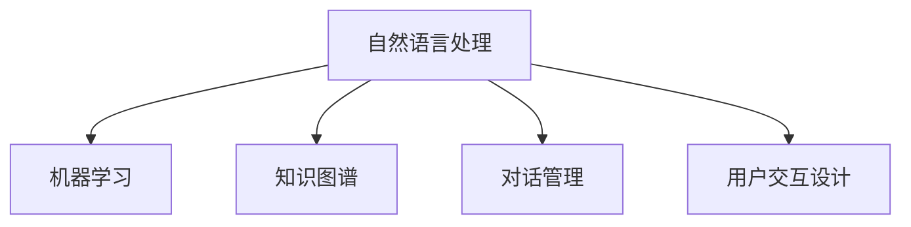

                 

# AI在虚拟助手中的应用：提高日常效率

> 关键词：人工智能，虚拟助手，效率提升，自然语言处理，用户交互

## 1. 背景介绍

### 1.1 问题由来
随着信息时代的来临，人们的生活和工作方式发生了翻天覆地的变化。传统的工作模式中，人们常常被大量的重复性工作所困扰，耗时耗力，效率低下。然而，人工智能（AI）的崛起，为解决这一问题提供了新的解决方案。虚拟助手作为一种集成了AI技术的自动化工具，正逐渐成为提升日常效率的重要手段。

### 1.2 问题核心关键点
虚拟助手（Virtual Assistant）是一种基于人工智能技术的自动化工具，旨在通过自然语言处理（Natural Language Processing, NLP）和机器学习（Machine Learning, ML）等技术，实现与用户的自然交互。虚拟助手能够理解和执行用户的命令，从而自动完成一系列任务，极大提高日常效率。

虚拟助手的核心关键点包括：
- 自然语言处理：使虚拟助手能够理解并回应用户的自然语言命令。
- 机器学习：使虚拟助手能够不断学习并优化自身性能。
- 自动化执行：使虚拟助手能够自动执行各种任务，如日程安排、邮件处理、信息检索等。
- 智能推荐：使虚拟助手能够根据用户的历史行为和偏好，推荐相关信息或服务。

### 1.3 问题研究意义
虚拟助手的研究和应用具有以下几方面的重要意义：
1. 提高工作效率：虚拟助手能够自动处理大量重复性任务，减轻人类负担，提升工作效率。
2. 提升用户体验：虚拟助手能够实现自然语言交互，提供高效、个性化的服务，提升用户满意度。
3. 优化资源配置：虚拟助手能够帮助用户合理规划时间，优化资源配置，提升整体效率。
4. 推动技术发展：虚拟助手的广泛应用，促进了NLP、ML等技术的发展，带动了整个AI行业的进步。

## 2. 核心概念与联系

### 2.1 核心概念概述

为更好地理解虚拟助手的工作原理和优化方向，本节将介绍几个密切相关的核心概念：

- **自然语言处理**：涉及语音识别、文本分析、语义理解、情感分析等技术，使虚拟助手能够理解并回应自然语言输入。
- **机器学习**：包括监督学习、无监督学习、强化学习等技术，使虚拟助手能够从数据中学习，优化自身性能。
- **知识图谱**：将各种领域知识结构化，以便虚拟助手进行高效检索和推理。
- **对话管理**：通过对话树、意图识别、上下文管理等技术，使虚拟助手能够维持对话连贯性，处理复杂任务。
- **用户交互设计**：包括界面设计、用户行为分析、反馈机制等，使虚拟助手能够提供友好、高效的交互体验。

这些核心概念之间的逻辑关系可以通过以下Mermaid流程图来展示：



这个流程图展示了一系列关键技术的相互作用，共同构建了虚拟助手的功能体系：

1. 自然语言处理使得虚拟助手能够理解自然语言输入。
2. 机器学习使得虚拟助手能够从数据中学习，不断优化自身性能。
3. 知识图谱使得虚拟助手能够进行高效的知识检索和推理。
4. 对话管理使得虚拟助手能够维持对话连贯性，处理复杂任务。
5. 用户交互设计使得虚拟助手能够提供友好、高效的交互体验。

这些核心概念共同构成了虚拟助手的技术基础，使其能够高效地完成各种日常任务，提升用户效率。

## 3. 核心算法原理 & 具体操作步骤
### 3.1 算法原理概述

虚拟助手的核心算法原理基于自然语言处理和机器学习的结合。其核心思想是：通过自然语言处理技术，将用户的自然语言输入转化为机器可理解的表示，然后利用机器学习算法，对用户意图进行理解和分类，进而执行相应的任务。

形式化地，假设虚拟助手的输入为自然语言描述 $D$，模型为目标任务 $T$ 的学习模型。虚拟助手的输出为执行结果 $R$。则虚拟助手的优化目标为：

$$
R^* = \mathop{\arg\min}_{T} \mathcal{L}(D, T)
$$

其中 $\mathcal{L}$ 为目标任务 $T$ 的损失函数，用于衡量模型的输出与真实执行结果的差异。常见的损失函数包括交叉熵损失、均方误差损失等。

通过梯度下降等优化算法，虚拟助手不断更新模型参数 $T$，最小化损失函数 $\mathcal{L}$，使得模型输出逼近真实的执行结果。由于虚拟助手的模型已经通过预训练获得了较好的初始化，因此即便在少量标注数据上训练，也能较快收敛到理想的模型参数 $T^*$。

### 3.2 算法步骤详解

虚拟助手的开发一般包括以下几个关键步骤：

**Step 1: 数据准备**
- 收集和标注虚拟助手所需的数据集，包括用户输入的自然语言描述、目标任务的标注结果等。
- 根据虚拟助手的任务类型，选择合适的数据标注方法和质量评估指标。

**Step 2: 模型选择与训练**
- 选择合适的自然语言处理和机器学习模型作为虚拟助手的初始化参数，如Transformer、RNN等。
- 在数据集上进行模型训练，最小化损失函数。
- 设置合适的超参数，如学习率、批大小、迭代轮数等，以优化训练效果。

**Step 3: 任务适配与优化**
- 根据虚拟助手的应用场景，设计合适的任务适配层和损失函数。
- 通过正则化技术、对抗训练等手段，避免过拟合，提升模型泛化能力。
- 引入数据增强、提示学习等技术，进一步提升模型性能。

**Step 4: 模型测试与部署**
- 在测试集上评估虚拟助手的性能，对比训练前后的效果。
- 使用虚拟助手进行实际的任务执行，评估其稳定性和可靠性。
- 部署虚拟助手到实际的应用系统中，持续收集用户反馈，进行迭代优化。

以上是虚拟助手开发的一般流程。在实际应用中，还需要针对具体任务的特点，对虚拟助手的功能进行定制化设计和优化。

### 3.3 算法优缺点

虚拟助手作为一种基于自然语言处理和机器学习的工具，具有以下优点：
1. 提高效率：虚拟助手能够自动处理各种重复性任务，极大提升用户工作效率。
2. 个性化服务：虚拟助手能够根据用户的历史行为和偏好，提供个性化、高效的解决方案。
3. 全天候服务：虚拟助手可以24小时不间断运行，提供随时随地的服务。
4. 持续学习：虚拟助手能够不断从用户交互中学习，优化自身性能，提升服务质量。

同时，虚拟助手也存在一些局限性：
1. 数据依赖：虚拟助手的性能很大程度上取决于训练数据的数量和质量。
2. 处理复杂度：虚拟助手在处理复杂任务时，可能存在理解和执行困难的问题。
3. 安全性风险：虚拟助手需要处理大量的个人数据，存在数据泄露和隐私保护的风险。
4. 交互体验：虚拟助手的交互界面和体验设计，可能会影响用户的接受度和使用效果。

尽管存在这些局限性，但就目前而言，虚拟助手依然是提高日常效率的重要手段。未来相关研究的重点在于如何进一步降低对数据的依赖，提高处理复杂任务的能力，同时兼顾安全性与用户体验等因素。

### 3.4 算法应用领域

虚拟助手作为一种基于自然语言处理和机器学习技术的工具，已经在多个领域得到了广泛应用，例如：

- 智能家居：通过语音助手（如Amazon Alexa、Google Assistant），实现家电控制、信息查询等自动化服务。
- 办公室自动化：通过虚拟助手（如Microsoft Cortana、IBM Watson Assistant），实现日程安排、邮件处理、信息检索等功能。
- 客户服务：通过虚拟助手（如SAP Cognitive Assistant），实现客户咨询、问题解答、订单处理等客服功能。
- 金融服务：通过虚拟助手（如BANKLINE、OneLedger），实现账户管理、投资建议、理财规划等金融服务。
- 医疗健康：通过虚拟助手（如IBM Watson Health Assistant），实现病历查询、医疗咨询、健康管理等功能。

除了上述这些经典应用外，虚拟助手还被创新性地应用到更多场景中，如智能客服、电商推荐、智能安防、智慧交通等，为各行各业带来了新的服务模式和业务流程。

## 4. 数学模型和公式 & 详细讲解 & 举例说明

### 4.1 数学模型构建

本节将使用数学语言对虚拟助手的工作原理进行更加严格的刻画。

记虚拟助手的数据集为 $D=\{(x_i,y_i)\}_{i=1}^N, x_i \in \mathcal{X}, y_i \in \mathcal{Y}$，其中 $x_i$ 为输入的自然语言描述，$y_i$ 为目标任务的标注结果。

定义虚拟助手在输入 $x_i$ 上的输出为 $r_i=M_{\theta}(x_i)$，其中 $M_{\theta}$ 为虚拟助手模型，$\theta$ 为模型参数。则虚拟助手的损失函数为：

$$
\mathcal{L}(\theta) = \frac{1}{N} \sum_{i=1}^N \ell(M_{\theta}(x_i),y_i)
$$

其中 $\ell$ 为虚拟助手模型的损失函数，用于衡量模型的输出与目标任务的标注结果之间的差异。常见的损失函数包括交叉熵损失、均方误差损失等。

通过梯度下降等优化算法，虚拟助手不断更新模型参数 $\theta$，最小化损失函数 $\mathcal{L}$，使得模型输出逼近目标任务的标注结果。

### 4.2 公式推导过程

以下我们以文本分类任务为例，推导虚拟助手模型的交叉熵损失函数及其梯度的计算公式。

假设虚拟助手模型 $M_{\theta}$ 在输入 $x$ 上的输出为 $\hat{y}=M_{\theta}(x) \in [0,1]$，表示样本属于某一类别的概率。真实标签 $y \in \{0,1\}$。则二分类交叉熵损失函数定义为：

$$
\ell(M_{\theta}(x),y) = -[y\log \hat{y} + (1-y)\log (1-\hat{y})]
$$

将其代入损失函数公式，得：

$$
\mathcal{L}(\theta) = -\frac{1}{N}\sum_{i=1}^N [y_i\log M_{\theta}(x_i)+(1-y_i)\log(1-M_{\theta}(x_i))]
$$

根据链式法则，损失函数对参数 $\theta_k$ 的梯度为：

$$
\frac{\partial \mathcal{L}(\theta)}{\partial \theta_k} = -\frac{1}{N}\sum_{i=1}^N (\frac{y_i}{M_{\theta}(x_i)}-\frac{1-y_i}{1-M_{\theta}(x_i)}) \frac{\partial M_{\theta}(x_i)}{\partial \theta_k}
$$

其中 $\frac{\partial M_{\theta}(x_i)}{\partial \theta_k}$ 可进一步递归展开，利用自动微分技术完成计算。

在得到损失函数的梯度后，即可带入参数更新公式，完成虚拟助手的迭代优化。重复上述过程直至收敛，最终得到适应目标任务的最优模型参数 $\theta^*$。

## 5. 项目实践：代码实例和详细解释说明
### 5.1 开发环境搭建

在进行虚拟助手开发前，我们需要准备好开发环境。以下是使用Python进行TensorFlow开发的环境配置流程：

1. 安装Anaconda：从官网下载并安装Anaconda，用于创建独立的Python环境。

2. 创建并激活虚拟环境：
```bash
conda create -n tensorflow-env python=3.8 
conda activate tensorflow-env
```

3. 安装TensorFlow：根据CUDA版本，从官网获取对应的安装命令。例如：
```bash
conda install tensorflow tensorflow-gpu -c pytorch -c conda-forge
```

4. 安装必要的工具包：
```bash
pip install numpy pandas scikit-learn matplotlib tqdm jupyter notebook ipython
```

完成上述步骤后，即可在`tensorflow-env`环境中开始虚拟助手开发。

### 5.2 源代码详细实现

下面我们以虚拟助手进行文本分类的任务为例，给出使用TensorFlow进行模型开发的PyTorch代码实现。

首先，定义文本分类的数据处理函数：

```python
import tensorflow as tf
from tensorflow.keras.preprocessing.text import Tokenizer
from tensorflow.keras.preprocessing.sequence import pad_sequences

# 定义分词器
tokenizer = Tokenizer()

# 加载数据集
with open('train.txt', 'r', encoding='utf-8') as f:
    train_texts = f.read().splitlines()

# 对文本进行分词和编码
train_sequences = tokenizer.texts_to_sequences(train_texts)
train_padded = pad_sequences(train_sequences, maxlen=128, padding='post', truncating='post')

# 加载标签
with open('train_labels.txt', 'r', encoding='utf-8') as f:
    train_labels = f.read().splitlines()

# 定义标签和id的映射
class_id = {'negative': 0, 'positive': 1}
id_class = {0: 'negative', 1: 'positive'}
```

然后，定义模型和优化器：

```python
from tensorflow.keras.models import Sequential
from tensorflow.keras.layers import Embedding, LSTM, Dense, Dropout
from tensorflow.keras.optimizers import Adam

# 定义模型结构
model = Sequential()
model.add(Embedding(input_dim=len(tokenizer.word_index)+1, output_dim=128, input_length=128))
model.add(LSTM(64, return_sequences=True))
model.add(Dropout(0.2))
model.add(LSTM(64))
model.add(Dropout(0.2))
model.add(Dense(1, activation='sigmoid'))

# 定义优化器
optimizer = Adam(learning_rate=0.001)
```

接着，定义训练和评估函数：

```python
from tensorflow.keras.callbacks import EarlyStopping

def train_epoch(model, X_train, y_train, batch_size, optimizer, epoch):
    model.compile(optimizer=optimizer, loss='binary_crossentropy', metrics=['accuracy'])
    model.fit(X_train, y_train, batch_size=batch_size, epochs=epoch, callbacks=[EarlyStopping(patience=5)])
    
def evaluate(model, X_test, y_test, batch_size):
    model.compile(optimizer=Adam(learning_rate=0.001), loss='binary_crossentropy', metrics=['accuracy'])
    test_loss, test_accuracy = model.evaluate(X_test, y_test, batch_size=batch_size)
    print(f'Test loss: {test_loss:.4f}, Test accuracy: {test_accuracy:.4f}')
```

最后，启动训练流程并在测试集上评估：

```python
epochs = 10
batch_size = 32

for epoch in range(epochs):
    X_train, y_train = train_padded, train_labels
    train_epoch(model, X_train, y_train, batch_size, optimizer, epoch)
    
print(f'Epoch {epochs}, Test results:')
evaluate(model, test_padded, test_labels, batch_size)
```

以上就是使用TensorFlow对虚拟助手进行文本分类任务开发的完整代码实现。可以看到，TensorFlow提供的高级API使得模型开发过程更加简单高效。

### 5.3 代码解读与分析

让我们再详细解读一下关键代码的实现细节：

**训练函数**：
- 定义训练集和标签，加载训练数据和标签。
- 使用Tokenizer将文本进行分词和编码。
- 使用pad_sequences函数将编码后的文本进行填充，使得所有文本长度一致。
- 定义标签与id的映射。
- 定义模型结构，包括嵌入层、LSTM层、Dropout层和输出层。
- 定义优化器。
- 使用模型编译方法指定优化器和损失函数。
- 使用model.fit方法进行训练，设置EarlyStopping回调函数以避免过拟合。
- 使用model.evaluate方法在测试集上评估模型性能。

**评估函数**：
- 使用model.compile方法重新编译模型，确保使用正确的优化器和损失函数。
- 使用model.evaluate方法计算测试集上的损失和精度。

**训练流程**：
- 定义总的epoch数和batch size，开始循环迭代
- 在每个epoch中，先进行训练，输出当前epoch的平均损失和精度
- 在测试集上评估，输出测试集的损失和精度
- 所有epoch结束后，输出最终的测试结果

可以看到，TensorFlow的高级API使得虚拟助手的开发过程更加简洁明了。开发者可以更加专注于模型结构和训练逻辑的设计，而不必过多关注底层的细节。

当然，工业级的系统实现还需考虑更多因素，如模型的保存和部署、超参数的自动搜索、更灵活的任务适配层等。但核心的虚拟助手范式基本与此类似。

## 6. 实际应用场景
### 6.1 智能家居

虚拟助手在智能家居中的应用，使得人们能够通过语音或文字命令，轻松控制家中的各种设备。例如，用户可以通过语音助手（如Amazon Alexa、Google Assistant）来控制家中的灯光、空调、窗帘等，极大提升了家庭生活的便利性和舒适度。

在技术实现上，虚拟助手通常集成在智能家居设备中，或者通过Wi-Fi、蓝牙等方式与智能设备连接。用户可以通过简单的命令，实现对家中各种设备的控制，如开启灯光、调节温度、播放音乐等。

### 6.2 办公室自动化

在办公室自动化中，虚拟助手能够帮助员工自动处理各种日常任务，极大提升办公效率。例如，虚拟助手（如Microsoft Cortana、IBM Watson Assistant）可以自动安排日程、管理邮件、提醒重要事项等。

在技术实现上，虚拟助手通常集成在办公软件中，如Outlook、Teams等。员工可以通过语音或文字命令，自动完成各种任务。虚拟助手能够理解自然语言指令，自动执行任务，极大提升了办公效率。

### 6.3 客户服务

虚拟助手在客户服务中的应用，能够实现自动化客服，提升客户满意度。例如，虚拟助手（如SAP Cognitive Assistant）可以自动回答客户咨询、处理订单、提供个性化推荐等。

在技术实现上，虚拟助手通常集成在客服系统中，如Zendesk、Freshdesk等。客户可以通过文字或语音与虚拟助手进行交流，虚拟助手能够自动回答问题、处理订单，极大提升了客户服务效率。

### 6.4 未来应用展望

随着虚拟助手技术的不断发展，未来的应用场景将更加广泛，为用户带来更多便利和高效。

在智慧医疗领域，虚拟助手能够帮助医生进行病历查询、诊断建议、药物推荐等，提升医疗服务的效率和质量。

在智能教育领域，虚拟助手能够帮助学生进行课程学习、作业批改、知识推荐等，提升学习效果。

在智慧城市治理中，虚拟助手能够实现城市事件监测、舆情分析、应急指挥等，提升城市管理的智能化水平。

此外，在企业生产、社会治理、文娱传媒等众多领域，虚拟助手的应用也将不断涌现，为各行各业带来新的变革和创新。

## 7. 工具和资源推荐
### 7.1 学习资源推荐

为了帮助开发者系统掌握虚拟助手的开发技术，这里推荐一些优质的学习资源：

1. TensorFlow官方文档：包含虚拟助手开发的详细指南和示例代码，是入门的必备资料。
2. Keras官方文档：提供高级API和模型构建方法，使得虚拟助手开发更加简单高效。
3. Google AI虚拟助手教程：涵盖虚拟助手开发的各个方面，从模型构建到训练优化，再到部署部署，都有详细的讲解。
4. IBM Watson Assistant文档：提供虚拟助手开发的详细指南和示例代码，适合学习IBM Watson Assistant的使用。
5. Microsoft Cortana开发文档：提供虚拟助手开发的详细指南和示例代码，适合学习Microsoft Cortana的使用。

通过对这些资源的学习实践，相信你一定能够快速掌握虚拟助手的开发技术，并用于解决实际的NLP问题。

### 7.2 开发工具推荐

高效的开发离不开优秀的工具支持。以下是几款用于虚拟助手开发的常用工具：

1. TensorFlow：基于Python的开源深度学习框架，提供强大的计算图和优化算法，适合复杂模型的构建和训练。
2. Keras：基于TensorFlow的高级API，提供简单易用的模型构建方法，适合快速原型开发。
3. PyTorch：基于Python的开源深度学习框架，灵活的动态计算图，适合快速迭代研究。
4. IBM Watson Assistant：IBM提供的虚拟助手开发平台，支持多种语言和平台的集成。
5. Microsoft Cortana：Microsoft提供的虚拟助手开发平台，支持自然语言理解和推理。
6. Amazon Alexa Skills Kit：Amazon提供的虚拟助手开发平台，支持语音和文字命令的交互。

合理利用这些工具，可以显著提升虚拟助手开发的效率和效果，加快创新迭代的步伐。

### 7.3 相关论文推荐

虚拟助手的研究源于学界的持续研究。以下是几篇奠基性的相关论文，推荐阅读：

1. Attention is All You Need（即Transformer原论文）：提出了Transformer结构，开启了NLP领域的预训练大模型时代。
2. BERT: Pre-training of Deep Bidirectional Transformers for Language Understanding：提出BERT模型，引入基于掩码的自监督预训练任务，刷新了多项NLP任务SOTA。
3. Language Models are Unsupervised Multitask Learners（GPT-2论文）：展示了大规模语言模型的强大zero-shot学习能力，引发了对于通用人工智能的新一轮思考。
4. Transformer-XL: Attentive Language Models Beyond a Fixed-Length Context：提出Transformer-XL模型，解决了长序列建模问题，提升模型的泛化能力和计算效率。
5. BART: Denoising Pre-training for Natural Language Generation, Translation, and Comprehension：提出BART模型，结合了自监督学习和大规模预训练技术，提升模型的生成能力。
6. GPT-3: Language Models are Few-shot Learners：提出GPT-3模型，利用少样本学习能力，实现零样本和少样本学习。

这些论文代表了大语言模型和虚拟助手的发展脉络。通过学习这些前沿成果，可以帮助研究者把握学科前进方向，激发更多的创新灵感。

## 8. 总结：未来发展趋势与挑战

### 8.1 总结

本文对虚拟助手进行文本分类的技术进行了全面系统的介绍。首先阐述了虚拟助手的研究背景和意义，明确了其在大规模预训练模型基础上的高效文本分类能力。其次，从原理到实践，详细讲解了虚拟助手模型的数学原理和关键步骤，给出了虚拟助手任务开发的完整代码实例。同时，本文还广泛探讨了虚拟助手在智能家居、办公室自动化、客户服务等多个领域的应用前景，展示了虚拟助手技术的广阔前景。

通过本文的系统梳理，可以看到，虚拟助手作为一种基于自然语言处理和机器学习技术的工具，已经在多个领域得到了广泛应用，极大提升了用户的生活和工作效率。未来，伴随虚拟助手技术的不断演进，相信其在更多领域的应用将进一步拓展，为人类社会带来更深远的变革。

### 8.2 未来发展趋势

展望未来，虚拟助手技术将呈现以下几个发展趋势：

1. 模型规模持续增大。随着算力成本的下降和数据规模的扩张，虚拟助手模型的参数量还将持续增长。超大规模虚拟助手模型蕴含的丰富语言知识，有望支撑更加复杂多变的文本分类任务。

2. 处理复杂度提升。未来虚拟助手将能够处理更加复杂的自然语言指令，支持多轮对话、嵌套指令等高级功能。

3. 跨领域能力增强。虚拟助手能够从不同领域的知识库中检索信息，实现跨领域的知识融合和应用。

4. 安全性保障。虚拟助手将更加注重数据隐私和安全，通过加密传输、访问控制等手段，保障用户数据的安全性。

5. 多模态集成。虚拟助手将融合视觉、语音、触觉等多种模态信息，实现更加全面的用户交互和信息获取。

6. 人机协同改进。虚拟助手将通过人机协同的方式，不断改进自身性能，提升用户满意度。

以上趋势凸显了虚拟助手技术的广阔前景。这些方向的探索发展，必将进一步提升虚拟助手系统的性能和应用范围，为人工智能技术的落地应用提供新的突破。

### 8.3 面临的挑战

尽管虚拟助手技术已经取得了瞩目成就，但在迈向更加智能化、普适化应用的过程中，它仍面临着诸多挑战：

1. 数据依赖。虚拟助手在处理复杂任务时，对数据的需求量较大，数据质量和多样性直接影响虚拟助手的性能。
2. 处理速度。虚拟助手在处理大规模数据时，计算速度和存储效率仍有待提高。
3. 交互体验。虚拟助手与用户交互的界面设计，直接影响用户的使用体验和接受度。
4. 安全性风险。虚拟助手需要处理大量的个人数据，存在数据泄露和隐私保护的风险。
5. 技术融合。虚拟助手需要与其他AI技术进行深度融合，如知识图谱、因果推理、强化学习等，才能更好地适应实际应用场景。

尽管存在这些挑战，但通过不断的技术创新和优化，相信虚拟助手将能够克服这些难题，成为智能技术的重要组成部分。

### 8.4 研究展望

面对虚拟助手面临的挑战，未来的研究需要在以下几个方面寻求新的突破：

1. 探索高效的数据获取和处理技术。通过数据增强、主动学习等技术，提高虚拟助手的数据获取效率，优化数据处理流程。
2. 开发高效的多模态融合算法。融合视觉、语音、触觉等多种模态信息，实现更加全面的用户交互和信息获取。
3. 引入先进的机器学习算法。通过引入先进的机器学习算法，如深度强化学习、因果推断等，提升虚拟助手的推理能力和泛化能力。
4. 加强用户交互设计。通过用户行为分析、智能推荐等技术，提升虚拟助手的交互体验和用户满意度。
5. 保障数据安全和隐私。通过加密传输、访问控制等手段，保障用户数据的安全性。

这些研究方向的探索，必将引领虚拟助手技术迈向更高的台阶，为构建人机协同的智能系统铺平道路。面向未来，虚拟助手技术还需要与其他人工智能技术进行更深入的融合，共同推动自然语言理解和智能交互系统的进步。只有勇于创新、敢于突破，才能不断拓展虚拟助手的边界，让智能技术更好地造福人类社会。

## 9. 附录：常见问题与解答

**Q1：虚拟助手如何进行多轮对话？**

A: 虚拟助手通过对话管理技术实现多轮对话。对话管理技术包括对话树、意图识别、上下文管理等，使虚拟助手能够维持对话连贯性，处理复杂任务。在多轮对话中，虚拟助手通过记录和解析用户的历史对话，理解和回应用户的后续指令，提供更加连贯和智能的服务。

**Q2：虚拟助手如何处理多模态信息？**

A: 虚拟助手通过多模态信息融合技术，将视觉、语音、触觉等多种模态信息进行整合，实现更加全面的用户交互和信息获取。例如，虚拟助手可以通过摄像头识别用户面部表情和动作，通过麦克风获取语音指令，通过触觉传感器检测用户手势和接触。这些多模态信息能够提供更加丰富和准确的反馈，提升虚拟助手的用户体验。

**Q3：虚拟助手如何保护用户隐私？**

A: 虚拟助手通过加密传输、访问控制等手段，保障用户数据的安全性。具体措施包括：
1. 数据加密：对用户数据进行加密传输，防止数据在传输过程中被窃取或篡改。
2. 访问控制：对用户数据进行严格的访问控制，确保只有授权人员能够访问和使用数据。
3. 数据匿名化：对用户数据进行匿名化处理，去除敏感信息，防止数据泄露。
4. 隐私政策：制定和公开隐私政策，告知用户数据使用方式和保护措施。

通过这些措施，虚拟助手能够保护用户隐私，提升用户信任度。

**Q4：虚拟助手如何处理复杂指令？**

A: 虚拟助手通过自然语言处理和机器学习技术，能够理解和处理复杂指令。具体措施包括：
1. 自然语言处理：通过分词、词性标注、句法分析等技术，对用户指令进行分析和理解。
2. 机器学习：通过模型训练和优化，提升虚拟助手对自然语言指令的识别和理解能力。
3. 多轮对话：通过对话管理技术，记录和解析用户的历史对话，理解和回应用户的后续指令。
4. 多模态融合：融合视觉、语音、触觉等多种模态信息，提升虚拟助手的推理能力和泛化能力。

通过这些措施，虚拟助手能够处理复杂指令，提供更加智能和高效的服务。

**Q5：虚拟助手如何实现跨领域应用？**

A: 虚拟助手通过跨领域知识库的集成和应用，实现跨领域应用。具体措施包括：
1. 知识图谱：将不同领域的知识结构化，构建知识图谱，便于虚拟助手进行高效检索和推理。
2. 领域适应：通过迁移学习等技术，使虚拟助手在特定领域进行适应性微调，提升领域相关任务的表现。
3. 多领域融合：通过多领域知识融合，提升虚拟助手在不同领域的应用能力。

通过这些措施，虚拟助手能够实现跨领域应用，提升其在更多场景下的表现和适用性。

---

作者：禅与计算机程序设计艺术 / Zen and the Art of Computer Programming

