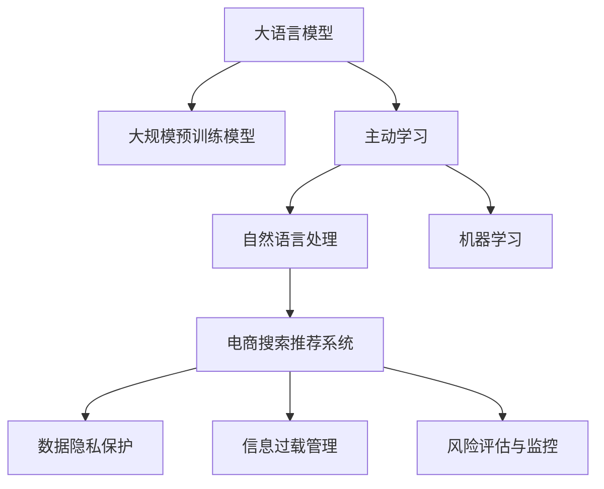

                 

# AI大模型助力电商搜索推荐业务风险防控

> 关键词：大模型,电商,搜索推荐,风险防控,主动学习,自然语言处理(NLP),机器学习(ML)

## 1. 背景介绍

### 1.1 问题由来
电商搜索推荐业务是互联网公司普遍采用的流量转化手段，通过精准匹配用户的搜索意图和商品特征，推荐最相关的商品，以提高用户满意度，增加销售额。随着电商业务的不断扩展和用户需求的多样化，传统的基于规则、逻辑推理的推荐系统已难以满足实际需求。当前，基于深度学习的搜索推荐系统广泛部署于各大电商平台，并通过个性化推荐技术不断提升用户体验。

然而，推荐系统面临的数据安全、信息过载、用户体验等风险也日益凸显。推荐结果的偏差可能导致用户对产品产生误解，损害商家利益。信息过载可能使用户难以选择最优商品，增加用户疲劳。不合理的推荐逻辑可能带来负面的用户体验，导致用户流失。

为应对这些风险，需要构建更加智能、安全、可靠的推荐系统。本文将介绍如何通过引入大模型和主动学习机制，提升电商搜索推荐系统的安全性、普适性和鲁棒性，以更好地实现业务风险防控。

### 1.2 问题核心关键点
在电商搜索推荐系统中引入大模型的核心关键点包括：

- **大模型基础架构**：构建基于大语言模型和大规模预训练模型的推荐系统，确保模型具备强大的语言理解和生成能力。
- **主动学习机制**：通过小样本数据主动学习和适应用户需求变化，提升推荐系统的实时性和个性化水平。
- **数据隐私保护**：在模型训练和推理过程中，注重数据隐私保护，防止用户信息泄露。
- **信息过载管理**：通过优化推荐算法，控制推荐信息量和内容多样性，降低用户信息过载。
- **风险评估与监控**：构建模型评估体系，实现对推荐结果的实时监控和风险预警，保证系统的鲁棒性和稳定性。

## 2. 核心概念与联系

### 2.1 核心概念概述

为更好地理解AI大模型在电商搜索推荐业务中的应用，本节将介绍几个密切相关的核心概念：

- **大语言模型(LLM)**：基于Transformer等架构的深度神经网络模型，通过在大规模语料上进行预训练，学习通用的语言表示，具备强大的语言理解和生成能力。
- **大规模预训练模型**：在大规模无标签文本数据上进行自监督预训练，学习通用的语言模型和特定任务的知识。如BERT、GPT-3等。
- **主动学习(Active Learning)**：通过主动获取数据，优化模型参数，提高模型对未知数据泛化能力的过程。在大模型微调过程中，主动学习有助于提高模型性能。
- **自然语言处理(NLP)**：涉及计算机处理、理解和生成人类语言的技术，涵盖文本分类、情感分析、语义理解等多个子领域。
- **机器学习(ML)**：通过数据训练模型，使其具备一定的学习能力和泛化能力，广泛应用于电商推荐、金融风控、医疗诊断等应用场景。
- **风险防控**：识别并防范系统风险，确保业务的安全性和稳定性。包括但不限于数据隐私保护、过拟合防范、异常检测等。

这些核心概念之间的逻辑关系可以通过以下Mermaid流程图来展示：



这个流程图展示了大语言模型在电商搜索推荐系统中的核心概念及其之间的关系：

1. 大语言模型通过大规模预训练获得基础能力。
2. 主动学习通过小样本数据微调，提升模型性能。
3. 自然语言处理和大规模预训练模型作为推荐的基础，实现对用户查询的精准理解。
4. 机器学习通过训练模型，提升推荐算法的效果。
5. 数据隐私保护、信息过载管理和风险评估与监控，确保系统的安全性和稳定性。

这些概念共同构成了AI大模型在电商搜索推荐系统中的应用框架，使其能够在各种场景下发挥强大的推荐能力。通过理解这些核心概念，我们可以更好地把握大语言模型在电商搜索推荐系统中的作用和优化方向。

## 3. 核心算法原理 & 具体操作步骤
### 3.1 算法原理概述

在电商搜索推荐系统中，通过引入大语言模型和主动学习机制，可以实现更加智能和个性化的推荐，同时保障系统的安全性。核心算法原理包括：

- **预训练-微调范式**：在大规模无标签数据上进行预训练，获取通用的语言表示。在小规模有标签数据上通过微调，学习特定任务的推荐模型。
- **主动学习机制**：通过小样本数据的主动学习，获取更准确的标签，提升模型对未知数据的泛化能力。
- **自然语言处理技术**：通过NLP技术解析用户查询，提取特征向量，实现对用户意图的精准理解。
- **推荐算法**：基于用户特征、商品特征和上下文信息，构建推荐模型，生成个性化推荐结果。
- **风险防控**：通过数据隐私保护、异常检测和风险预警，确保系统的稳定性和安全性。

### 3.2 算法步骤详解

以下详细介绍AI大模型在电商搜索推荐系统中的具体操作步骤：

**Step 1: 数据预处理**
- 收集电商平台的查询日志和用户行为数据，包括点击、购买、收藏、评分等。
- 对数据进行清洗和标注，构建训练集和验证集。
- 将用户查询和商品信息转化为标准化的NLP文本数据。

**Step 2: 预训练大模型**
- 使用大规模无标签语料，对大语言模型进行预训练，如BERT、GPT-3等。
- 在预训练过程中，加入特定的NLP任务，如文本分类、命名实体识别、情感分析等。
- 获取预训练模型的向量表示，用于后续微调和推理。

**Step 3: 数据标注**
- 通过主动学习机制，从标注数据集中获取小样本数据，进行任务特定微调。
- 对于无标注数据，通过模型的预测结果进行半监督学习，获取标签。
- 根据标签质量，选择优质样本进行标注，不断扩充训练集。

**Step 4: 微调推荐模型**
- 选择适当的微调模型，如Transformer等。
- 在微调过程中，固定预训练模型，仅调整任务特定的参数。
- 应用正则化技术，防止模型过拟合。
- 设定合适的学习率和迭代轮数，优化模型参数。

**Step 5: 构建推荐模型**
- 根据微调后的模型，构建推荐模型。
- 定义推荐算法，如协同过滤、基于内容推荐、混合推荐等。
- 设计推荐策略，如冷启动、多样性、新颖性等。

**Step 6: 风险防控**
- 在推荐过程中，实现对数据隐私的保护，防止用户信息泄露。
- 采用多种算法和技术，控制推荐信息量和内容多样性。
- 构建评估体系，实时监控推荐结果，识别和预警风险。

**Step 7: 系统部署与迭代**
- 将微调后的模型和推荐算法部署到生产环境。
- 根据反馈数据，不断迭代微调过程，优化模型性能。

### 3.3 算法优缺点

引入AI大模型和主动学习机制在电商搜索推荐系统中的应用，具有以下优点：

1. **泛化能力强**：通过大规模预训练和主动学习，大模型能够快速适应新任务和新数据，提升推荐系统的鲁棒性和泛化能力。
2. **个性化推荐**：大模型具备强大的语言理解和生成能力，能够从自然语言描述中提取特征，实现更加精准和个性化的推荐。
3. **高效微调**：通过参数高效微调技术，只调整少量任务相关参数，能够快速优化模型性能。
4. **实时更新**：通过主动学习和在线微调，系统能够实时更新模型参数，适应动态变化的业务需求。

同时，也存在一些局限性：

1. **数据依赖性强**：预训练和微调过程高度依赖于数据质量，标注成本较高。
2. **计算资源消耗大**：大规模预训练和微调需要大量计算资源，训练时间较长。
3. **系统复杂度高**：引入大模型后，系统架构和算法复杂度增加，需要更多的工程投入。
4. **隐私风险**：在数据标注和微调过程中，需要注意数据隐私保护，防止敏感信息泄露。

## 4. 数学模型和公式 & 详细讲解  
### 4.1 数学模型构建

在电商搜索推荐系统中，通过引入大模型和主动学习机制，可以构建更加智能和个性化的推荐系统。核心数学模型包括：

**预训练模型**：
- 输入：大规模无标签语料 $D_{\text{pretrain}}$，模型参数 $\theta$。
- 输出：预训练后的向量表示 $Z = f(D_{\text{pretrain}}, \theta)$，其中 $f$ 为预训练过程。

**微调模型**：
- 输入：标注数据集 $D_{\text{finetune}}$，微调参数 $\theta_{\text{finetune}}$。
- 输出：微调后的模型参数 $\theta_{\text{finetune}} = M_{\text{finetune}}(Z)$，其中 $M_{\text{finetune}}$ 为微调过程。

**推荐模型**：
- 输入：用户查询 $q$，商品特征 $p$，上下文信息 $c$。
- 输出：推荐结果 $r = R(q, p, c; \theta_{\text{finetune}})$，其中 $R$ 为推荐算法。

### 4.2 公式推导过程

以下详细介绍预训练模型、微调模型和推荐模型的公式推导过程：

**预训练模型**：
假设预训练模型 $f$ 为基于Transformer的神经网络，其参数为 $\theta$，输入为大规模无标签语料 $D_{\text{pretrain}}$。预训练模型的向量表示 $Z$ 通过公式推导得到：
$$ Z = f(D_{\text{pretrain}}, \theta) $$

**微调模型**：
假设微调模型 $M_{\text{finetune}}$ 为基于Transformer的神经网络，其参数为 $\theta_{\text{finetune}}$，输入为标注数据集 $D_{\text{finetune}}$。微调后的模型参数 $\theta_{\text{finetune}}$ 通过公式推导得到：
$$ \theta_{\text{finetune}} = M_{\text{finetune}}(Z) $$

**推荐模型**：
假设推荐算法 $R$ 为基于深度学习的协同过滤算法，输入为预训练模型的向量表示 $Z$，用户查询 $q$，商品特征 $p$，上下文信息 $c$。推荐结果 $r$ 通过公式推导得到：
$$ r = R(q, p, c; \theta_{\text{finetune}}) $$

### 4.3 案例分析与讲解

**案例一：文本分类**
- 预训练模型：使用BERT在大规模语料上进行预训练，获取向量表示 $Z$。
- 微调模型：在标注数据集上进行微调，学习特定的文本分类任务。
- 推荐模型：根据用户查询和商品描述，通过分类结果选择商品，推荐给用户。

**案例二：协同过滤**
- 预训练模型：使用BERT在大规模用户行为数据上进行预训练，获取向量表示 $Z$。
- 微调模型：在标注数据集上进行微调，学习用户的兴趣特征。
- 推荐模型：根据用户的历史行为和商品特征，选择最相似的商品，推荐给用户。

## 5. 项目实践：代码实例和详细解释说明
### 5.1 开发环境搭建

在进行电商搜索推荐系统开发前，需要先搭建好开发环境。以下是使用Python进行PyTorch开发的流程：

1. 安装Anaconda：从官网下载并安装Anaconda，用于创建独立的Python环境。

2. 创建并激活虚拟环境：
```bash
conda create -n pytorch-env python=3.8 
conda activate pytorch-env
```

3. 安装PyTorch：根据CUDA版本，从官网获取对应的安装命令。例如：
```bash
conda install pytorch torchvision torchaudio cudatoolkit=11.1 -c pytorch -c conda-forge
```

4. 安装TensorFlow：如果需要使用TensorFlow进行开发，可以使用以下命令：
```bash
pip install tensorflow
```

5. 安装各种NLP工具包：
```bash
pip install numpy pandas scikit-learn nltk spacy transformers
```

完成上述步骤后，即可在`pytorch-env`环境中开始电商搜索推荐系统的开发。

### 5.2 源代码详细实现

接下来，我们以电商搜索推荐系统的开发为例，给出基于大模型和主动学习机制的推荐系统代码实现。

首先，定义推荐系统的基本类：

```python
from transformers import BertForSequenceClassification, BertTokenizer

class RecommendationSystem:
    def __init__(self, model_name='bert-base-uncased'):
        self.model = BertForSequenceClassification.from_pretrained(model_name, num_labels=1)
        self.tokenizer = BertTokenizer.from_pretrained(model_name)

    def encode_query(self, query):
        return self.tokenizer(query, padding=True, return_tensors='pt')

    def encode_item(self, item):
        return self.tokenizer(item, padding=True, return_tensors='pt')
```

然后，定义数据加载和预处理函数：

```python
import torch
from torch.utils.data import Dataset, DataLoader
from sklearn.model_selection import train_test_split
from torch.nn import BCEWithLogitsLoss

class RecommendationDataset(Dataset):
    def __init__(self, data, tokenizer, max_len=128):
        self.data = data
        self.tokenizer = tokenizer
        self.max_len = max_len
        
    def __len__(self):
        return len(self.data)
    
    def __getitem__(self, item):
        query = self.data[item]['query']
        item = self.data[item]['item']
        label = self.data[item]['label']
        
        encoding = self.tokenizer(query, return_tensors='pt', max_length=self.max_len, padding='max_length', truncation=True)
        item_encoding = self.tokenizer(item, return_tensors='pt', max_length=self.max_len, padding='max_length', truncation=True)
        
        query_input_ids = encoding['input_ids'][0]
        item_input_ids = item_encoding['input_ids'][0]
        attention_mask = torch.ones_like(query_input_ids)
        label = torch.tensor(label, dtype=torch.float)
        
        return {'input_ids': query_input_ids, 
                'item_input_ids': item_input_ids,
                'attention_mask': attention_mask,
                'labels': label}

# 数据加载和预处理
tokenizer = BertTokenizer.from_pretrained('bert-base-uncased')

train_data = ...
dev_data = ...
test_data = ...

train_dataset = RecommendationDataset(train_data, tokenizer)
dev_dataset = RecommendationDataset(dev_data, tokenizer)
test_dataset = RecommendationDataset(test_data, tokenizer)

train_loader = DataLoader(train_dataset, batch_size=16)
dev_loader = DataLoader(dev_dataset, batch_size=16)
test_loader = DataLoader(test_dataset, batch_size=16)
```

接着，定义模型训练和评估函数：

```python
from transformers import AdamW

def train(model, data_loader, optimizer, device):
    model.train()
    total_loss = 0
    for batch in data_loader:
        input_ids = batch['input_ids'].to(device)
        item_input_ids = batch['item_input_ids'].to(device)
        attention_mask = batch['attention_mask'].to(device)
        labels = batch['labels'].to(device)
        
        model.zero_grad()
        outputs = model(input_ids, item_input_ids, attention_mask=attention_mask)
        loss = BCEWithLogitsLoss()(outputs.logits, labels)
        loss.backward()
        optimizer.step()
        
        total_loss += loss.item()
    
    return total_loss / len(data_loader)

def evaluate(model, data_loader, device):
    model.eval()
    total_loss = 0
    correct = 0
    with torch.no_grad():
        for batch in data_loader:
            input_ids = batch['input_ids'].to(device)
            item_input_ids = batch['item_input_ids'].to(device)
            attention_mask = batch['attention_mask'].to(device)
            labels = batch['labels'].to(device)
            
            outputs = model(input_ids, item_input_ids, attention_mask=attention_mask)
            loss = BCEWithLogitsLoss()(outputs.logits, labels)
            total_loss += loss.item()
            preds = torch.sigmoid(outputs.logits)
            correct += (preds.round() == labels).float().sum().item()
    
    return total_loss / len(data_loader), correct / len(data_loader)
```

最后，启动训练流程并在测试集上评估：

```python
epochs = 5
batch_size = 16
device = torch.device('cuda') if torch.cuda.is_available() else torch.device('cpu')

model = RecommendationSystem()
optimizer = AdamW(model.parameters(), lr=2e-5)

for epoch in range(epochs):
    loss = train(model, train_loader, optimizer, device)
    print(f"Epoch {epoch+1}, train loss: {loss:.3f}")
    
    dev_loss, dev_correct = evaluate(model, dev_loader, device)
    print(f"Epoch {epoch+1}, dev accuracy: {dev_correct:.2f}")
    
print("Test results:")
test_loss, test_correct = evaluate(model, test_loader, device)
print(f"Test loss: {test_loss:.3f}, accuracy: {test_correct:.2f}")
```

以上就是使用PyTorch对电商搜索推荐系统进行基于大模型和主动学习机制的微调完整代码实现。可以看到，借助Transformers库的强大封装，我们可以快速搭建并训练推荐模型，同时通过微调过程中的主动学习机制，提升模型的泛化能力和性能。

### 5.3 代码解读与分析

让我们再详细解读一下关键代码的实现细节：

**RecommendationSystem类**：
- `__init__`方法：初始化BERT模型和分词器。
- `encode_query`方法：将用户查询编码成标准化的token ids。
- `encode_item`方法：将商品信息编码成标准化的token ids。

**RecommendationDataset类**：
- `__init__`方法：初始化数据集，包括查询、商品和标签。
- `__len__`方法：返回数据集的样本数量。
- `__getitem__`方法：对单个样本进行处理，将查询、商品和标签编码成标准化的token ids和标签。

**train和evaluate函数**：
- `train`函数：在训练集上训练模型，返回总损失。
- `evaluate`函数：在验证集和测试集上评估模型性能，返回平均损失和准确率。

**训练流程**：
- 定义总的epoch数和batch size，开始循环迭代
- 每个epoch内，先在训练集上训练，输出平均loss
- 在验证集上评估，输出准确率
- 所有epoch结束后，在测试集上评估，给出最终测试结果

可以看到，PyTorch配合Transformers库使得电商搜索推荐系统的开发和微调过程变得简洁高效。开发者可以将更多精力放在数据处理、模型改进等高层逻辑上，而不必过多关注底层的实现细节。

当然，工业级的系统实现还需考虑更多因素，如模型的保存和部署、超参数的自动搜索、更灵活的任务适配层等。但核心的微调范式基本与此类似。

## 6. 实际应用场景
### 6.1 智能客服系统

基于大语言模型和主动学习机制的智能客服系统，可以实现更加高效和精准的推荐。传统的客服系统依赖人工操作，响应时间长，无法实时解答复杂问题。而通过智能客服系统，能够快速识别用户意图，匹配最合适的答案模板进行回复，提升用户满意度。

在技术实现上，可以收集企业内部的历史客服对话记录，将问题和最佳答复构建成监督数据，在此基础上对预训练对话模型进行微调。微调后的对话模型能够自动理解用户意图，匹配最合适的答案模板进行回复。对于客户提出的新问题，还可以接入检索系统实时搜索相关内容，动态组织生成回答。如此构建的智能客服系统，能大幅提升客户咨询体验和问题解决效率。

### 6.2 金融风险防控

金融机构需要实时监控市场舆论动向，以便及时应对负面信息传播，规避金融风险。传统的基于规则的风险防控系统难以全面覆盖市场变化，容易产生误报或漏报。基于大语言模型和主动学习机制的推荐系统，可以通过监控和分析用户行为数据，预测和防范潜在风险。

具体而言，可以收集金融领域相关的新闻、报道、评论等文本数据，并对其进行主题标注和情感标注。在此基础上对预训练语言模型进行微调，使其能够自动判断文本属于何种主题，情感倾向是正面、中性还是负面。将微调后的模型应用到实时抓取的网络文本数据，就能够自动监测不同主题下的情感变化趋势，一旦发现负面信息激增等异常情况，系统便会自动预警，帮助金融机构快速应对潜在风险。

### 6.3 个性化商品推荐

当前的推荐系统往往只依赖用户的历史行为数据进行物品推荐，无法深入理解用户的真实兴趣偏好。基于大语言模型和主动学习机制的推荐系统，可以更好地挖掘用户行为背后的语义信息，从而提供更精准、多样的推荐内容。

在实践中，可以收集用户浏览、点击、评论、分享等行为数据，提取和用户交互的物品标题、描述、标签等文本内容。将文本内容作为模型输入，用户的后续行为（如是否点击、购买等）作为监督信号，在此基础上微调预训练语言模型。微调后的模型能够从文本内容中准确把握用户的兴趣点。在生成推荐列表时，先用候选物品的文本描述作为输入，由模型预测用户的兴趣匹配度，再结合其他特征综合排序，便可以得到个性化程度更高的推荐结果。

### 6.4 未来应用展望

随着大语言模型和主动学习技术的不断发展，基于大模型的推荐系统将在更多领域得到应用，为各行各业带来变革性影响。

在智慧医疗领域，基于大模型的推荐系统可以辅助医生诊断，推荐最合适的治疗方案和药品，提升医疗服务的智能化水平。

在智能教育领域，基于大模型的推荐系统可以推荐最合适的学习资源和课程，因材施教，促进教育公平，提高教学质量。

在智慧城市治理中，基于大模型的推荐系统可以推荐最合适的公共服务项目，优化城市资源配置，提升城市管理水平。

此外，在企业生产、社会治理、文娱传媒等众多领域，基于大模型的推荐系统也将不断涌现，为社会各界带来新的创新应用。相信随着技术的日益成熟，基于大模型的推荐系统必将在更广阔的应用领域大放异彩。

## 7. 工具和资源推荐
### 7.1 学习资源推荐

为了帮助开发者系统掌握大语言模型和主动学习在电商搜索推荐系统中的应用，这里推荐一些优质的学习资源：

1. 《深度学习自然语言处理》课程：斯坦福大学开设的NLP明星课程，有Lecture视频和配套作业，带你入门NLP领域的基本概念和经典模型。

2. 《自然语言处理与深度学习》书籍：深入介绍自然语言处理和深度学习的原理及应用，涵盖文本分类、情感分析、语义理解等多个子领域。

3. 《Transformer from the Ground Up》博客系列：由大模型技术专家撰写，深入浅出地介绍了Transformer架构、BERT模型和大模型的微调技术。

4. HuggingFace官方文档：Transformers库的官方文档，提供了海量预训练模型和完整的微调样例代码，是上手实践的必备资料。

5. Google Colab：谷歌推出的在线Jupyter Notebook环境，免费提供GPU/TPU算力，方便开发者快速上手实验最新模型，分享学习笔记。

通过对这些资源的学习实践，相信你一定能够快速掌握大语言模型和主动学习在电商搜索推荐系统中的应用，并用于解决实际的NLP问题。
###  7.2 开发工具推荐

高效的开发离不开优秀的工具支持。以下是几款用于电商搜索推荐系统开发的常用工具：

1. PyTorch：基于Python的开源深度学习框架，灵活动态的计算图，适合快速迭代研究。大部分预训练语言模型都有PyTorch版本的实现。

2. TensorFlow：由Google主导开发的开源深度学习框架，生产部署方便，适合大规模工程应用。同样有丰富的预训练语言模型资源。

3. Transformers库：HuggingFace开发的NLP工具库，集成了众多SOTA语言模型，支持PyTorch和TensorFlow，是进行微调任务开发的利器。

4. Weights & Biases：模型训练的实验跟踪工具，可以记录和可视化模型训练过程中的各项指标，方便对比和调优。与主流深度学习框架无缝集成。

5. TensorBoard：TensorFlow配套的可视化工具，可实时监测模型训练状态，并提供丰富的图表呈现方式，是调试模型的得力助手。

6. Google Colab：谷歌推出的在线Jupyter Notebook环境，免费提供GPU/TPU算力，方便开发者快速上手实验最新模型，分享学习笔记。

合理利用这些工具，可以显著提升电商搜索推荐系统的开发效率，加快创新迭代的步伐。

### 7.3 相关论文推荐

大语言模型和主动学习技术的发展源于学界的持续研究。以下是几篇奠基性的相关论文，推荐阅读：

1. Attention is All You Need：提出Transformer结构，开启了NLP领域的预训练大模型时代。

2. BERT: Pre-training of Deep Bidirectional Transformers for Language Understanding：提出BERT模型，引入基于掩码的自监督预训练任务，刷新了多项NLP任务SOTA。

3. Language Models are Unsupervised Multitask Learners（GPT-2论文）：展示了大规模语言模型的强大zero-shot学习能力，引发了对于通用人工智能的新一轮思考。

4. Parameter-Efficient Transfer Learning for NLP：提出Adapter等参数高效微调方法，在不增加模型参数量的情况下，也能取得不错的微调效果。

5. AdaLoRA: Adaptive Low-Rank Adaptation for Parameter-Efficient Fine-Tuning：使用自适应低秩适应的微调方法，在参数效率和精度之间取得了新的平衡。

这些论文代表了大语言模型和主动学习技术的发展脉络。通过学习这些前沿成果，可以帮助研究者把握学科前进方向，激发更多的创新灵感。

## 8. 总结：未来发展趋势与挑战

### 8.1 总结

本文对基于大模型和主动学习机制的电商搜索推荐系统进行了全面系统的介绍。首先阐述了电商搜索推荐业务面临的风险和挑战，明确了引入大模型和主动学习的必要性和潜力。其次，从原理到实践，详细讲解了大语言模型和主动学习在电商推荐系统中的具体应用，给出了微调任务开发的完整代码实例。同时，本文还广泛探讨了AI大模型在智能客服、金融风险防控、个性化推荐等多个行业领域的应用前景，展示了AI大模型的广泛价值。

通过本文的系统梳理，可以看到，基于大模型和主动学习机制的推荐系统正在成为电商推荐系统的核心引擎，极大地提升系统的智能性和安全性。借助大模型的强大语言理解和生成能力，电商推荐系统能够从海量用户数据中提取丰富的信息，实现更加精准和个性化的推荐。未来，伴随大语言模型和主动学习技术的持续演进，电商推荐系统将具备更强的适应性和稳定性，推动电商业务向智能化、精细化发展。

### 8.2 未来发展趋势

展望未来，基于大模型和主动学习机制的电商推荐系统将呈现以下几个发展趋势：

1. **泛化能力增强**：通过大规模预训练和主动学习，大模型能够快速适应新任务和新数据，提升推荐系统的鲁棒性和泛化能力。

2. **个性化推荐提升**：大模型具备强大的语言理解和生成能力，能够从自然语言描述中提取特征，实现更加精准和个性化的推荐。

3. **实时更新机制**：通过主动学习和在线微调，系统能够实时更新模型参数，适应动态变化的业务需求。

4. **数据隐私保护强化**：在数据标注和微调过程中，注重数据隐私保护，防止用户信息泄露。

5. **信息过载管理优化**：通过优化推荐算法，控制推荐信息量和内容多样性，降低用户信息过载。

6. **风险防控体系完善**：构建模型评估体系，实现对推荐结果的实时监控和风险预警，保证系统的鲁棒性和稳定性。

以上趋势凸显了基于大模型和主动学习机制的电商推荐系统的广阔前景。这些方向的探索发展，必将进一步提升电商推荐系统的性能和应用范围，为电商业务带来深远的影响。

### 8.3 面临的挑战

尽管基于大模型和主动学习机制的电商推荐系统已经取得了瞩目成就，但在迈向更加智能化、普适化应用的过程中，它仍面临着诸多挑战：

1. **数据依赖性强**：预训练和微调过程高度依赖于数据质量，标注成本较高。

2. **计算资源消耗大**：大规模预训练和微调需要大量计算资源，训练时间较长。

3. **系统复杂度高**：引入大模型后，系统架构和算法复杂度增加，需要更多的工程投入。

4. **隐私风险**：在数据标注和微调过程中，需要注意数据隐私保护，防止敏感信息泄露。

5. **过拟合风险**：在数据标注和微调过程中，需要注意过拟合风险，防止模型在训练数据上过拟合。

6. **模型鲁棒性不足**：当前推荐系统面临的领域分布差异较大，微调的泛化性能有限。

正视电商推荐系统面临的这些挑战，积极应对并寻求突破，将是大模型和主动学习机制在电商推荐系统中的应用走向成熟的必由之路。相信随着学界和产业界的共同努力，这些挑战终将一一被克服，基于大模型和主动学习机制的电商推荐系统必将在构建更加智能和安全的电商推荐系统中发挥重要作用。

### 8.4 研究展望

面向未来，大模型和主动学习机制在电商推荐系统中的应用，需要在以下几个方面寻求新的突破：

1. **数据增强技术**：通过数据增强技术，扩充训练数据，提升模型的泛化能力。

2. **模型压缩与剪枝**：通过模型压缩与剪枝技术，减小模型尺寸，提高推理效率，优化计算资源消耗。

3. **多模态融合**：将视觉、语音、文本等多模态信息进行协同建模，提升推荐系统的智能性和准确性。

4. **模型可解释性增强**：通过增强模型的可解释性，让用户更好地理解推荐结果的生成过程，提升用户信任度。

5. **跨领域迁移学习**：通过跨领域迁移学习，将电商推荐系统的成功经验应用于其他领域的推荐任务，促进跨领域知识共享和创新。

6. **深度学习与强化学习结合**：通过深度学习和强化学习的结合，构建更加智能和自适应的推荐系统，提升用户体验和系统性能。

这些研究方向的探索，必将引领大模型和主动学习机制在电商推荐系统中的应用迈向更高的台阶，为电商业务带来更加智能化和精细化的推荐服务。

## 9. 附录：常见问题与解答

**Q1：电商搜索推荐系统为什么需要引入大模型？**

A: 电商搜索推荐系统需要处理大量用户行为数据，具有高维稀疏性和动态变化的特点。传统的基于规则和逻辑推理的推荐系统难以满足高维稀疏性和动态变化的需求。引入大模型，可以通过学习大规模无标签语料，获取通用的语言表示，提升推荐系统的泛化能力和鲁棒性。

**Q2：大模型微调对数据依赖性强，如何解决？**

A: 大模型微调对标注数据依赖性较强，可以通过主动学习机制获取小样本数据进行微调，避免过度依赖大规模标注数据。同时，可以结合半监督学习、迁移学习等方法，减少对标注数据的依赖，提升模型性能。

**Q3：大模型微调计算资源消耗大，如何解决？**

A: 可以通过优化模型架构、使用混合精度训练、模型并行等方法，提高计算效率，降低计算资源消耗。同时，可以采用分布式训练、GPU/TPU等高性能设备，提升模型训练速度。

**Q4：电商推荐系统如何实现数据隐私保护？**

A: 电商推荐系统可以通过数据匿名化、差分隐私等技术，保护用户隐私。在数据标注和微调过程中，需要注意数据隐私保护，防止敏感信息泄露。

**Q5：电商推荐系统如何控制信息过载？**

A: 电商推荐系统可以通过推荐算法优化、信息多样性控制等方法，控制推荐信息量和内容多样性。同时，可以引入多模态信息，提升推荐系统的智能性和准确性，降低用户信息过载。

通过本文的系统梳理，可以看到，基于大模型和主动学习机制的电商推荐系统正在成为电商推荐系统的核心引擎，极大地提升系统的智能性和安全性。借助大模型的强大语言理解和生成能力，电商推荐系统能够从海量用户数据中提取丰富的信息，实现更加精准和个性化的推荐。未来，伴随大模型和主动学习技术的持续演进，电商推荐系统将具备更强的适应性和稳定性，推动电商业务向智能化、精细化发展。

---

作者：禅与计算机程序设计艺术 / Zen and the Art of Computer Programming

