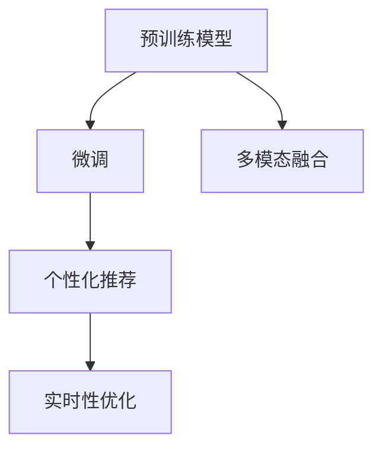

                 

## 1. 背景介绍

### 1.1 问题由来

随着互联网技术的迅猛发展，搜索推荐系统（Search and Recommendation System）已经成为各大平台、搜索引擎的核心竞争力之一。传统的搜索推荐系统基于统计学方法，通过用户行为数据进行推荐，这种方法虽然效果稳定，但灵活性不足，难以应对复杂多变的用户需求。人工智能，特别是深度学习技术的发展，为搜索推荐系统带来了新的突破。基于大模型的推荐技术能够直接从用户输入的文本中挖掘信息，进行理解和推理，从而提供个性化、多样化的推荐内容，大幅提升了用户体验。

### 1.2 问题核心关键点

当前，AI大模型在搜索推荐系统中的应用，已成为各大互联网公司争相研究的焦点。其核心在于如何高效利用预训练模型，对用户查询进行深度理解，从而提供精确的推荐结果。以下是基于大模型在搜索推荐系统中的应用的关键点：

- **预训练模型：**利用大规模无标签文本数据进行预训练，获得丰富的语言和语义表示。
- **微调与适配：**根据具体的搜索推荐任务，对预训练模型进行微调，学习目标任务下的特定知识。
- **多模态融合：**结合文本、图像、音频等多模态信息，提升推荐模型的全面性。
- **个性化推荐：**利用用户行为数据和个性化标签，针对不同用户提供定制化推荐。
- **实时性优化：**通过优化模型结构和算法，提升推荐系统响应速度，保障实时性。

### 1.3 问题研究意义

AI大模型在搜索推荐系统中的应用，不仅能够显著提升推荐效果，还能够带来一系列技术创新和商业价值。具体而言，其意义包括：

1. **个性化推荐：**通过深入理解用户需求，提供更加个性化、精准的推荐，提升用户体验。
2. **长尾需求挖掘：**利用大模型的泛化能力，发现和推荐长尾需求，满足不同用户的特定需求。
3. **流量提升：**精准推荐能够提升用户满意度，增加用户粘性，从而提升平台的流量和用户活跃度。
4. **商业化应用：**大模型推荐技术可以应用于电商、新闻、娱乐等多个垂直领域，带来巨大的商业价值。
5. **技术创新：**大模型推荐技术的成熟和落地，将推动搜索推荐领域的技术进步，催生更多创新应用。

## 2. 核心概念与联系

### 2.1 核心概念概述

为更好地理解AI大模型在搜索推荐系统中的应用，本节将介绍几个关键概念及其联系：

- **预训练模型（Pre-trained Model）：**利用大规模无标签文本数据进行预训练，学习通用的语言表示。常用的预训练模型包括BERT、GPT、XLNet等。
- **微调（Fine-tuning）：**在预训练模型的基础上，使用目标任务的标注数据进行微调，学习特定任务下的知识。微调通过优化模型参数，使模型更好地适应具体任务。
- **多模态融合（Multi-modal Fusion）：**结合文本、图像、音频等多种信息源，提升推荐模型的全面性和准确性。例如，利用图片信息辅助文字描述，提升推荐效果。
- **个性化推荐（Personalized Recommendation）：**根据用户行为数据和个性化标签，提供定制化的推荐内容。个性化推荐依赖于对用户兴趣的深度理解。
- **实时性优化（Real-time Optimization）：**优化模型结构和算法，提升推荐系统的响应速度，保障实时性。实时性优化涉及模型的压缩、剪枝等技术。

这些概念之间的逻辑关系可以通过以下Mermaid流程图来展示：



这个流程图展示了预训练模型通过微调学习目标任务知识，结合多模态信息，进行个性化推荐，并通过实时性优化提升响应速度的整个过程。

## 3. 核心算法原理 & 具体操作步骤

### 3.1 算法原理概述

AI大模型在搜索推荐系统中的应用，基于监督学习的微调方法。其核心思想是：利用预训练模型作为特征提取器，通过标注数据对模型进行微调，学习特定任务下的知识，从而提升推荐效果。

具体而言，假设预训练模型为 $M_{\theta}$，目标任务的标注数据集为 $D=\{(x_i, y_i)\}_{i=1}^N$，其中 $x_i$ 表示用户查询或行为数据，$y_i$ 表示推荐结果。微调的目标是找到新的模型参数 $\hat{\theta}$，使得模型在特定任务上表现优异。优化目标是：

$$
\hat{\theta}=\mathop{\arg\min}_{\theta} \mathcal{L}(M_{\theta},D)
$$

其中 $\mathcal{L}$ 为损失函数，衡量模型预测结果与真实标签之间的差异。常见的损失函数包括交叉熵损失、均方误差损失等。

### 3.2 算法步骤详解

基于监督学习的AI大模型微调一般包括以下关键步骤：

**Step 1: 准备预训练模型和数据集**
- 选择合适的预训练模型 $M_{\theta}$ 作为初始化参数，如 BERT、GPT 等。
- 准备目标任务的标注数据集 $D$，划分为训练集、验证集和测试集。一般要求标注数据与预训练数据的分布不要差异过大。

**Step 2: 添加任务适配层**
- 根据任务类型，在预训练模型顶层设计合适的输出层和损失函数。
- 对于推荐任务，通常使用基于排序的损失函数，如Top-K loss、NDCG loss等。
- 对于其他任务，如问答、情感分析等，可根据任务特性选择合适的损失函数。

**Step 3: 设置微调超参数**
- 选择合适的优化算法及其参数，如 AdamW、SGD 等，设置学习率、批大小、迭代轮数等。
- 设置正则化技术及强度，包括权重衰减、Dropout、Early Stopping等。
- 确定冻结预训练参数的策略，如仅微调顶层，或全部参数都参与微调。

**Step 4: 执行梯度训练**
- 将训练集数据分批次输入模型，前向传播计算损失函数。
- 反向传播计算参数梯度，根据设定的优化算法和学习率更新模型参数。
- 周期性在验证集上评估模型性能，根据性能指标决定是否触发 Early Stopping。
- 重复上述步骤直到满足预设的迭代轮数或 Early Stopping 条件。

**Step 5: 测试和部署**
- 在测试集上评估微调后模型 $M_{\hat{\theta}}$ 的性能，对比微调前后的精度提升。
- 使用微调后的模型对新样本进行推理预测，集成到实际的应用系统中。
- 持续收集新的数据，定期重新微调模型，以适应数据分布的变化。

以上是基于监督学习微调AI大模型的一般流程。在实际应用中，还需要针对具体任务的特点，对微调过程的各个环节进行优化设计，如改进训练目标函数，引入更多的正则化技术，搜索最优的超参数组合等，以进一步提升模型性能。

### 3.3 算法优缺点

AI大模型在搜索推荐系统中的应用基于监督学习的微调方法具有以下优点：

1. **简单高效：**只需准备少量标注数据，即可对预训练模型进行快速适配，获得较大的性能提升。
2. **通用适用：**适用于各种搜索推荐任务，设计简单的任务适配层即可实现微调。
3. **参数高效：**利用参数高效微调技术，在固定大部分预训练参数的情况下，仍可取得不错的提升。
4. **效果显著：**在学术界和工业界的诸多任务上，基于微调的方法已经刷新了最先进的性能指标。

同时，该方法也存在一定的局限性：

1. **依赖标注数据：**微调的效果很大程度上取决于标注数据的质量和数量，获取高质量标注数据的成本较高。
2. **迁移能力有限：**当目标任务与预训练数据的分布差异较大时，微调的性能提升有限。
3. **负面效果传递：**预训练模型的固有偏见、有害信息等，可能通过微调传递到下游任务，造成负面影响。
4. **可解释性不足：**微调模型的决策过程通常缺乏可解释性，难以对其推理逻辑进行分析和调试。

尽管存在这些局限性，但就目前而言，基于监督学习的微调方法仍是大模型应用的最主流范式。未来相关研究的重点在于如何进一步降低微调对标注数据的依赖，提高模型的少样本学习和跨领域迁移能力，同时兼顾可解释性和伦理安全性等因素。

### 3.4 算法应用领域

AI大模型在搜索推荐系统中的应用，已经得到了广泛的应用，覆盖了几乎所有常见任务，例如：

- **电商推荐：**通过分析用户浏览、购买行为数据，推荐商品、搭配方案等。
- **新闻推荐：**根据用户阅读历史和兴趣，推荐新闻、文章等。
- **视频推荐：**根据用户观看历史和评分，推荐视频内容、频道等。
- **音乐推荐：**根据用户听歌历史和评分，推荐歌曲、专辑等。
- **视频游戏推荐：**根据玩家游戏行为和评价，推荐游戏内容、攻略等。

除了上述这些经典任务外，大模型推荐技术还被创新性地应用到更多场景中，如可控内容生成、知识图谱推荐、智能家居控制等，为搜索推荐技术带来了全新的突破。随着预训练模型和微调方法的不断进步，相信搜索推荐技术将在更广阔的应用领域大放异彩。

## 4. 数学模型和公式 & 详细讲解 & 举例说明

### 4.1 数学模型构建

本节将使用数学语言对AI大模型在搜索推荐系统中的应用进行更加严格的刻画。

记预训练语言模型为 $M_{\theta}$，目标任务的标注数据集为 $D=\{(x_i, y_i)\}_{i=1}^N$。定义模型 $M_{\theta}$ 在输入 $x_i$ 上的输出为 $\hat{y}=M_{\theta}(x_i) \in [0,1]$，表示样本属于推荐的概率。真实标签 $y_i \in \{1,0\}$。则推荐任务的交叉熵损失函数定义为：

$$
\ell(M_{\theta}(x_i),y_i) = -[y_i\log \hat{y} + (1-y_i)\log (1-\hat{y})]
$$

将其代入经验风险公式，得：

$$
\mathcal{L}(\theta) = -\frac{1}{N}\sum_{i=1}^N [y_i\log M_{\theta}(x_i)+(1-y_i)\log(1-M_{\theta}(x_i))]
$$

根据链式法则，损失函数对参数 $\theta_k$ 的梯度为：

$$
\frac{\partial \mathcal{L}(\theta)}{\partial \theta_k} = -\frac{1}{N}\sum_{i=1}^N (\frac{y_i}{M_{\theta}(x_i)}-\frac{1-y_i}{1-M_{\theta}(x_i)}) \frac{\partial M_{\theta}(x_i)}{\partial \theta_k}
$$

其中 $\frac{\partial M_{\theta}(x_i)}{\partial \theta_k}$ 可进一步递归展开，利用自动微分技术完成计算。

### 4.2 公式推导过程

以下我们以电商推荐任务为例，推导基于排序损失的推荐模型。

假设模型 $M_{\theta}$ 在输入 $x$ 上的输出为 $\hat{y}=M_{\theta}(x) \in [0,1]$，表示商品被购买的概率。真实标签 $y_i \in \{0,1\}$。则推荐任务的排序损失函数定义为：

$$
\ell(M_{\theta}(x),y) = -[y\log \hat{y} + (1-y)\log (1-\hat{y})]
$$

其中 $y$ 为商品购买标记，$M_{\theta}(x)$ 为模型预测的商品购买概率。

将其代入经验风险公式，得：

$$
\mathcal{L}(\theta) = -\frac{1}{N}\sum_{i=1}^N [y_i\log M_{\theta}(x_i)+(1-y_i)\log(1-M_{\theta}(x_i))]
$$

根据链式法则，损失函数对参数 $\theta_k$ 的梯度为：

$$
\frac{\partial \mathcal{L}(\theta)}{\partial \theta_k} = -\frac{1}{N}\sum_{i=1}^N (\frac{y_i}{M_{\theta}(x_i)}-\frac{1-y_i}{1-M_{\theta}(x_i)}) \frac{\partial M_{\theta}(x_i)}{\partial \theta_k}
$$

其中 $\frac{\partial M_{\theta}(x_i)}{\partial \theta_k}$ 可进一步递归展开，利用自动微分技术完成计算。

在得到损失函数的梯度后，即可带入参数更新公式，完成模型的迭代优化。重复上述过程直至收敛，最终得到适应电商推荐任务的最优模型参数 $\theta^*$。

### 4.3 案例分析与讲解

在电商推荐任务中，可以通过用户浏览、购买历史等行为数据构建监督数据，对预训练模型进行微调，使其能够学习到用户的偏好和需求，从而提供更加精准的推荐结果。具体而言，可以设计如下数据处理函数：

```python
from transformers import BertTokenizer
from torch.utils.data import Dataset
import torch

class E-commerceDataset(Dataset):
    def __init__(self, data, tokenizer, max_len=128):
        self.data = data
        self.tokenizer = tokenizer
        self.max_len = max_len
        
    def __len__(self):
        return len(self.data)
    
    def __getitem__(self, item):
        data_point = self.data[item]
        tokenized_text = self.tokenizer(data_point['item_text'], return_tensors='pt', padding='max_length', max_length=self.max_len, truncation=True)
        label = torch.tensor(data_point['is_purchased'], dtype=torch.long)
        return {'text': tokenized_text['input_ids'], 'label': label}
```

然后，定义模型和优化器：

```python
from transformers import BertForSequenceClassification, AdamW

model = BertForSequenceClassification.from_pretrained('bert-base-cased', num_labels=2)

optimizer = AdamW(model.parameters(), lr=2e-5)
```

接着，定义训练和评估函数：

```python
from torch.utils.data import DataLoader
from tqdm import tqdm
from sklearn.metrics import accuracy_score

device = torch.device('cuda') if torch.cuda.is_available() else torch.device('cpu')
model.to(device)

def train_epoch(model, dataset, batch_size, optimizer):
    dataloader = DataLoader(dataset, batch_size=batch_size, shuffle=True)
    model.train()
    epoch_loss = 0
    for batch in tqdm(dataloader, desc='Training'):
        inputs = batch['text'].to(device)
        labels = batch['label'].to(device)
        model.zero_grad()
        outputs = model(inputs)
        loss = outputs.loss
        epoch_loss += loss.item()
        loss.backward()
        optimizer.step()
    return epoch_loss / len(dataloader)

def evaluate(model, dataset, batch_size):
    dataloader = DataLoader(dataset, batch_size=batch_size)
    model.eval()
    preds, labels = [], []
    with torch.no_grad():
        for batch in tqdm(dataloader, desc='Evaluating'):
            inputs = batch['text'].to(device)
            outputs = model(inputs)
            batch_preds = torch.sigmoid(outputs.logits).to('cpu').tolist()
            batch_labels = batch['label'].to('cpu').tolist()
            for pred, label in zip(batch_preds, batch_labels):
                preds.append(pred)
                labels.append(label)
                
    print(f'Accuracy: {accuracy_score(labels, preds)}')
```

最后，启动训练流程并在测试集上评估：

```python
epochs = 5
batch_size = 16

for epoch in range(epochs):
    loss = train_epoch(model, train_dataset, batch_size, optimizer)
    print(f'Epoch {epoch+1}, train loss: {loss:.3f}')
    
    print(f'Epoch {epoch+1}, dev results:')
    evaluate(model, dev_dataset, batch_size)
    
print(f'Epoch {epochs}, test results:')
evaluate(model, test_dataset, batch_size)
```

以上就是使用PyTorch对BERT进行电商推荐任务微调的完整代码实现。可以看到，得益于Transformer库的强大封装，我们可以用相对简洁的代码完成BERT模型的加载和微调。

## 5. 项目实践：代码实例和详细解释说明

### 5.1 开发环境搭建

在进行微调实践前，我们需要准备好开发环境。以下是使用Python进行PyTorch开发的环境配置流程：

1. 安装Anaconda：从官网下载并安装Anaconda，用于创建独立的Python环境。

2. 创建并激活虚拟环境：
```bash
conda create -n pytorch-env python=3.8 
conda activate pytorch-env
```

3. 安装PyTorch：根据CUDA版本，从官网获取对应的安装命令。例如：
```bash
conda install pytorch torchvision torchaudio cudatoolkit=11.1 -c pytorch -c conda-forge
```

4. 安装Transformers库：
```bash
pip install transformers
```

5. 安装各类工具包：
```bash
pip install numpy pandas scikit-learn matplotlib tqdm jupyter notebook ipython
```

完成上述步骤后，即可在`pytorch-env`环境中开始微调实践。

### 5.2 源代码详细实现

下面我们以电商推荐任务为例，给出使用Transformers库对BERT模型进行微调的PyTorch代码实现。

首先，定义电商推荐任务的数据处理函数：

```python
from transformers import BertTokenizer
from torch.utils.data import Dataset
import torch

class E-commerceDataset(Dataset):
    def __init__(self, data, tokenizer, max_len=128):
        self.data = data
        self.tokenizer = tokenizer
        self.max_len = max_len
        
    def __len__(self):
        return len(self.data)
    
    def __getitem__(self, item):
        data_point = self.data[item]
        tokenized_text = self.tokenizer(data_point['item_text'], return_tensors='pt', padding='max_length', max_length=self.max_len, truncation=True)
        label = torch.tensor(data_point['is_purchased'], dtype=torch.long)
        return {'text': tokenized_text['input_ids'], 'label': label}
```

然后，定义模型和优化器：

```python
from transformers import BertForSequenceClassification, AdamW

model = BertForSequenceClassification.from_pretrained('bert-base-cased', num_labels=2)

optimizer = AdamW(model.parameters(), lr=2e-5)
```

接着，定义训练和评估函数：

```python
from torch.utils.data import DataLoader
from tqdm import tqdm
from sklearn.metrics import accuracy_score

device = torch.device('cuda') if torch.cuda.is_available() else torch.device('cpu')
model.to(device)

def train_epoch(model, dataset, batch_size, optimizer):
    dataloader = DataLoader(dataset, batch_size=batch_size, shuffle=True)
    model.train()
    epoch_loss = 0
    for batch in tqdm(dataloader, desc='Training'):
        inputs = batch['text'].to(device)
        labels = batch['label'].to(device)
        model.zero_grad()
        outputs = model(inputs)
        loss = outputs.loss
        epoch_loss += loss.item()
        loss.backward()
        optimizer.step()
    return epoch_loss / len(dataloader)

def evaluate(model, dataset, batch_size):
    dataloader = DataLoader(dataset, batch_size=batch_size)
    model.eval()
    preds, labels = [], []
    with torch.no_grad():
        for batch in tqdm(dataloader, desc='Evaluating'):
            inputs = batch['text'].to(device)
            outputs = model(inputs)
            batch_preds = torch.sigmoid(outputs.logits).to('cpu').tolist()
            batch_labels = batch['label'].to('cpu').tolist()
            for pred, label in zip(batch_preds, batch_labels):
                preds.append(pred)
                labels.append(label)
                
    print(f'Accuracy: {accuracy_score(labels, preds)}')
```

最后，启动训练流程并在测试集上评估：

```python
epochs = 5
batch_size = 16

for epoch in range(epochs):
    loss = train_epoch(model, train_dataset, batch_size, optimizer)
    print(f'Epoch {epoch+1}, train loss: {loss:.3f}')
    
    print(f'Epoch {epoch+1}, dev results:')
    evaluate(model, dev_dataset, batch_size)
    
print(f'Epoch {epochs}, test results:')
evaluate(model, test_dataset, batch_size)
```

以上就是使用PyTorch对BERT进行电商推荐任务微调的完整代码实现。可以看到，得益于Transformer库的强大封装，我们可以用相对简洁的代码完成BERT模型的加载和微调。

### 5.3 代码解读与分析

让我们再详细解读一下关键代码的实现细节：

**E-commerceDataset类**：
- `__init__`方法：初始化电商推荐数据集。
- `__len__`方法：返回数据集的样本数量。
- `__getitem__`方法：对单个样本进行处理，将文本输入编码为token ids，将标签转换为数值，并对其进行定长padding，最终返回模型所需的输入。

**标签与id的映射**：
- 定义了标签与数字id之间的映射关系，用于将token-wise的预测结果解码回真实的标签。

**训练和评估函数**：
- 使用PyTorch的DataLoader对数据集进行批次化加载，供模型训练和推理使用。
- 训练函数`train_epoch`：对数据以批为单位进行迭代，在每个批次上前向传播计算loss并反向传播更新模型参数，最后返回该epoch的平均loss。
- 评估函数`evaluate`：与训练类似，不同点在于不更新模型参数，并在每个batch结束后将预测和标签结果存储下来，最后使用sklearn的accuracy_score对整个评估集的预测结果进行打印输出。

**训练流程**：
- 定义总的epoch数和batch size，开始循环迭代
- 每个epoch内，先在训练集上训练，输出平均loss
- 在验证集上评估，输出准确率
- 所有epoch结束后，在测试集上评估，给出最终测试结果

可以看到，PyTorch配合Transformer库使得BERT微调的代码实现变得简洁高效。开发者可以将更多精力放在数据处理、模型改进等高层逻辑上，而不必过多关注底层的实现细节。

当然，工业级的系统实现还需考虑更多因素，如模型的保存和部署、超参数的自动搜索、更灵活的任务适配层等。但核心的微调范式基本与此类似。

## 6. 实际应用场景
### 6.1 智能客服系统

基于AI大模型的推荐技术，可以广泛应用于智能客服系统的构建。传统客服往往需要配备大量人力，高峰期响应缓慢，且一致性和专业性难以保证。而使用基于电商推荐技术，能够根据用户历史行为数据和输入查询，提供精准的客户问题解决方案。

在技术实现上，可以收集企业内部的历史客服对话记录，将问题和最佳答复构建成监督数据，在此基础上对预训练模型进行微调。微调后的模型能够自动理解用户意图，匹配最合适的答案模板进行回复。对于客户提出的新问题，还可以接入检索系统实时搜索相关内容，动态组织生成回答。如此构建的智能客服系统，能大幅提升客户咨询体验和问题解决效率。

### 6.2 金融舆情监测

金融机构需要实时监测市场舆论动向，以便及时应对负面信息传播，规避金融风险。传统的人工监测方式成本高、效率低，难以应对网络时代海量信息爆发的挑战。基于AI大模型的文本分类和情感分析技术，为金融舆情监测提供了新的解决方案。

具体而言，可以收集金融领域相关的新闻、报道、评论等文本数据，并对其进行主题标注和情感标注。在此基础上对预训练语言模型进行微调，使其能够自动判断文本属于何种主题，情感倾向是正面、中性还是负面。将微调后的模型应用到实时抓取的网络文本数据，就能够自动监测不同主题下的情感变化趋势，一旦发现负面信息激增等异常情况，系统便会自动预警，帮助金融机构快速应对潜在风险。

### 6.3 个性化推荐系统

当前的推荐系统往往只依赖用户的历史行为数据进行物品推荐，无法深入理解用户的真实兴趣偏好。基于AI大模型推荐技术，能够利用用户行为数据和个性化标签，提供定制化的推荐内容。

在实践中，可以收集用户浏览、点击、评论、分享等行为数据，提取和用户交互的物品标题、描述、标签等文本内容。将文本内容作为模型输入，用户的后续行为（如是否点击、购买等）作为监督信号，在此基础上微调预训练语言模型。微调后的模型能够从文本内容中准确把握用户的兴趣点。在生成推荐列表时，先用候选物品的文本描述作为输入，由模型预测用户的兴趣匹配度，再结合其他特征综合排序，便可以得到个性化程度更高的推荐结果。

### 6.4 未来应用展望

随着AI大模型推荐技术的不断发展，基于推荐系统的搜索推荐应用将在更多领域得到应用，为传统行业带来变革性影响。

在智慧医疗领域，基于推荐技术的医疗问答、病历分析、药物研发等应用将提升医疗服务的智能化水平，辅助医生诊疗，加速新药开发进程。

在智能教育领域，推荐技术可应用于作业批改、学情分析、知识推荐等方面，因材施教，促进教育公平，提高教学质量。

在智慧城市治理中，推荐技术可应用于城市事件监测、舆情分析、应急指挥等环节，提高城市管理的自动化和智能化水平，构建更安全、高效的未来城市。

此外，在企业生产、社会治理、文娱传媒等众多领域，基于AI大模型的推荐技术也将不断涌现，为经济社会发展注入新的动力。相信随着技术的日益成熟，推荐技术将成为搜索推荐系统的核心，推动人工智能技术在更多领域的落地应用。

## 7. 工具和资源推荐
### 7.1 学习资源推荐

为了帮助开发者系统掌握AI大模型推荐技术的基础知识，这里推荐一些优质的学习资源：

1. 《Transformers from the Inside Out》系列博文：由大模型技术专家撰写，深入浅出地介绍了Transformer原理、BERT模型、推荐技术等前沿话题。

2. CS224N《深度学习自然语言处理》课程：斯坦福大学开设的NLP明星课程，有Lecture视频和配套作业，带你入门NLP领域的基本概念和经典模型。

3. 《Practical Recommendation Systems with Transformers》书籍：详细介绍了如何使用Transformers库进行推荐系统开发，包括推荐技术在内的诸多范式。

4. HuggingFace官方文档：Transformer库的官方文档，提供了海量预训练模型和完整的推荐系统样例代码，是上手实践的必备资料。

5. Kaggle推荐系统竞赛：提供大量推荐系统数据集和基准模型，参与竞赛实战，提高推荐技术水平。

通过对这些资源的学习实践，相信你一定能够快速掌握AI大模型推荐技术的精髓，并用于解决实际的推荐问题。
###  7.2 开发工具推荐

高效的开发离不开优秀的工具支持。以下是几款用于AI大模型推荐系统开发的常用工具：

1. PyTorch：基于Python的开源深度学习框架，灵活动态的计算图，适合快速迭代研究。大部分预训练语言模型都有PyTorch版本的实现。

2. TensorFlow：由Google主导开发的开源深度学习框架，生产部署方便，适合大规模工程应用。同样有丰富的预训练语言模型资源。

3. Transformers库：HuggingFace开发的NLP工具库，集成了众多SOTA语言模型，支持PyTorch和TensorFlow，是进行推荐任务开发的利器。

4. Weights & Biases：模型训练的实验跟踪工具，可以记录和可视化模型训练过程中的各项指标，方便对比和调优。与主流深度学习框架无缝集成。

5. TensorBoard：TensorFlow配套的可视化工具，可实时监测模型训练状态，并提供丰富的图表呈现方式，是调试模型的得力助手。

6. Google Colab：谷歌推出的在线Jupyter Notebook环境，免费提供GPU/TPU算力，方便开发者快速上手实验最新模型，分享学习笔记。

合理利用这些工具，可以显著提升AI大模型推荐系统的开发效率，加快创新迭代的步伐。

### 7.3 相关论文推荐

AI大模型推荐技术的快速发展源于学界的持续研究。以下是几篇奠基性的相关论文，推荐阅读：

1. Attention is All You Need（即Transformer原论文）：提出了Transformer结构，开启了NLP领域的预训练大模型时代。

2. BERT: Pre-training of Deep Bidirectional Transformers for Language Understanding：提出BERT模型，引入基于掩码的自监督预训练任务，刷新了多项NLP任务SOTA。

3. Factorization Machines with Deep Contextual Feature Embeddings：提出基于深度学习的推荐算法，对传统推荐模型进行了改进，提升了推荐效果。

4. Neural Collaborative Filtering：提出基于神经网络的推荐模型，提升了推荐系统的精度和可解释性。

5. Adaptation of Deep Learning Recommendation Models to Cold-Start Users：提出基于深度学习的推荐系统在冷启动用户场景下的改进方法。

这些论文代表了大模型推荐技术的发展脉络。通过学习这些前沿成果，可以帮助研究者把握学科前进方向，激发更多的创新灵感。

## 8. 总结：未来发展趋势与挑战

### 8.1 总结

本文对AI大模型在搜索推荐系统中的应用进行了全面系统的介绍。首先阐述了AI大模型推荐技术的研究背景和意义，明确了推荐模型在个性化推荐、长尾需求挖掘、流量提升等方面的应用价值。其次，从原理到实践，详细讲解了推荐模型的数学原理和关键步骤，给出了推荐任务开发的完整代码实例。同时，本文还广泛探讨了推荐模型在智能客服、金融舆情、个性化推荐等多个行业领域的应用前景，展示了推荐技术的广阔应用空间。

通过本文的系统梳理，可以看到，AI大模型推荐技术在搜索推荐领域具有巨大潜力，能够显著提升推荐效果，带来一系列技术创新和商业价值。未来，伴随预训练语言模型和推荐技术的不断进步，相信推荐技术将在更多领域大放异彩，深刻影响人类的生产生活方式。

### 8.2 未来发展趋势

展望未来，AI大模型推荐技术将呈现以下几个发展趋势：

1. **推荐模型多样化：**未来的推荐系统将不仅仅是传统的基于协同过滤、基于深度学习的推荐模型，还会引入更多新型推荐算法，如基于知识图谱、基于因果推理的推荐模型。

2. **个性化推荐提升：**随着数据量的增加和算法的改进，推荐系统将更加个性化、精准，能够更好地满足用户的个性化需求。

3. **实时性优化：**推荐系统需要实时响应用户查询，实时优化将成为一个重要研究方向。高效的推荐算法和高效的计算资源配置是实现实时性的关键。

4. **跨领域融合：**推荐系统不仅仅局限于电商、新闻等传统领域，未来还将更多地与其他领域进行融合，如医疗、金融等。

5. **可解释性增强：**推荐系统的可解释性将成为未来的一个重要研究方向，推荐模型的决策过程需要更加透明、可理解，以便用户信任和使用。

6. **安全性保障：**推荐系统需要保障用户数据的安全，防止数据泄露和滥用。同时，需要避免推荐模型对用户产生负面影响，如通过推荐有害内容等。

7. **跨模态推荐：**未来的推荐系统将更多地结合文本、图像、音频等多模态信息，提升推荐效果。

以上趋势凸显了AI大模型推荐技术的广阔前景。这些方向的探索发展，必将进一步提升推荐系统的性能和应用范围，为经济社会发展注入新的动力。

### 8.3 面临的挑战

尽管AI大模型推荐技术已经取得了瞩目成就，但在迈向更加智能化、普适化应用的过程中，它仍面临着诸多挑战：

1. **数据隐私和安全：**推荐系统需要大量的用户数据进行训练，如何保护用户隐私、确保数据安全是一个重大挑战。

2. **模型泛化能力：**推荐系统需要在不同领域和场景下进行有效迁移，如何提高模型的泛化能力是未来的一个重要研究方向。

3. **计算资源需求：**大模型推荐系统需要高性能计算资源进行训练和推理，如何降低计算成本、提高计算效率是当前的挑战之一。

4. **算法公平性：**推荐系统需要公平地对待所有用户，避免对某些用户产生偏见。如何设计公平、透明的推荐算法是一个重要的研究方向。

5. **推荐效果可控：**推荐系统需要能够在用户接受范围内，引导用户探索新内容，避免过度推荐或推荐不当内容。

6. **推荐系统的社会影响：**推荐系统需要能够对社会产生积极影响，避免对用户产生负面影响，如通过推荐有害内容等。

7. **推荐模型的可解释性：**推荐系统的可解释性需要增强，以便用户理解和信任推荐系统。

8. **推荐模型的鲁棒性：**推荐系统需要在面对复杂、变化多端的数据环境时，保持鲁棒性，避免因数据噪声或异常而导致模型性能下降。

这些挑战需要我们在未来的研究中加以重视和解决，以推动AI大模型推荐技术的进一步发展。

### 8.4 研究展望

面对AI大模型推荐技术所面临的种种挑战，未来的研究需要在以下几个方面寻求新的突破：

1. **推荐模型的可解释性：**通过引入可解释性技术，增强推荐系统的透明性，使用户能够理解推荐结果背后的逻辑。

2. **数据隐私保护：**在保护用户隐私的前提下，探索高效的数据采集和处理方式，确保用户数据的安全性。

3. **跨领域推荐：**将推荐技术应用到更多领域，如医疗、金融等，探索适合不同领域特点的推荐模型和策略。

4. **推荐系统的公平性：**设计公平、透明的推荐算法，确保推荐系统对所有用户公平对待，避免产生偏见。

5. **推荐系统的安全性：**建立推荐系统的安全机制，防止数据泄露和滥用，确保推荐系统的安全性。

6. **推荐系统的实时性：**优化推荐系统的计算图，提升推荐系统的响应速度，实现实时推荐。

7. **推荐系统的多模态融合：**将推荐技术与其他领域技术进行融合，如知识图谱、因果推理等，提升推荐效果。

8. **推荐系统的鲁棒性：**探索鲁棒性增强技术，提升推荐系统在面对异常数据时的稳健性。

这些研究方向的探索，必将引领AI大模型推荐技术迈向更高的台阶，为构建智能、公平、安全的推荐系统铺平道路。面向未来，AI大模型推荐技术还需要与其他人工智能技术进行更深入的融合，如知识表示、因果推理、强化学习等，多路径协同发力，共同推动推荐技术的发展。只有勇于创新、敢于突破，才能不断拓展推荐系统的边界，让推荐技术更好地服务于社会。

## 9. 附录：常见问题与解答

**Q1：AI大模型推荐技术是否适用于所有推荐场景？**

A: AI大模型推荐技术在大多数推荐场景上都能取得不错的效果，特别是对于数据量较大的推荐场景。但对于一些特定领域的推荐，如医疗、法律等，仅仅依靠通用语料预训练的模型可能难以很好地适应。此时需要在特定领域语料上进一步预训练，再进行微调，才能获得理想效果。此外，对于一些需要时效性、个性化很强的任务，如实时推荐、个性化推荐等，AI大模型推荐技术也需要针对性的改进优化。

**Q2：推荐系统如何处理长尾需求？**

A: 推荐系统处理长尾需求的关键在于深度理解用户兴趣和行为，利用用户行为数据进行动态调整。具体而言，可以通过以下方法：

1. **用户行为数据采集：**收集用户的多样化行为数据，包括浏览记录、点击记录、评分记录等。

2. **深度学习模型：**利用深度学习模型，如BERT、LSTM等，对用户行为数据进行分析和建模，学习用户兴趣和行为规律。

3. **长尾推荐算法：**设计特定的推荐算法，如基于序列的推荐算法、基于内容的推荐算法等，对长尾需求进行推荐。

4. **用户反馈机制：**建立用户反馈机制，根据用户对推荐结果的反馈，动态调整推荐策略，提升推荐效果。

通过这些方法的结合使用，推荐系统可以更好地处理长尾需求，提升推荐效果。

**Q3：推荐系统如何平衡推荐效果和个性化程度？**

A: 推荐系统需要在个性化推荐和效果之间进行平衡，具体方法包括：

1. **多目标优化：**在推荐目标函数中引入多目标优化，如个性化度量、效果度量等，平衡个性化和效果。

2. **阈值设置：**根据推荐场景，设置推荐结果的阈值，确保推荐结果在个性化和效果之间取得平衡。

3. **数据增强：**利用数据增强技术，增加推荐样本的多样性，提升推荐效果。

4. **模型融合：**通过模型融合技术，将多个推荐模型进行集成，提升推荐系统的性能。

5. **用户反馈机制：**建立用户反馈机制，根据用户对推荐结果的反馈，动态调整推荐策略，提升推荐效果。

通过这些方法的结合使用，推荐系统可以在个性化推荐和效果之间取得平衡，提升推荐效果。

**Q4：推荐系统如何处理推荐系统疲劳（Recommendation System Fatigue）问题？**

A: 推荐系统疲劳是指用户在使用推荐系统一段时间后，对推荐结果失去兴趣，导致推荐系统效果下降的现象。处理推荐系统疲劳问题的方法包括：

1. **多样化推荐：**通过引入多样化推荐内容，避免推荐内容过于单一，提升用户兴趣。

2. **新鲜度机制：**引入新鲜度机制，推荐新鲜内容，避免推荐内容重复。

3. **用户交互机制：**建立用户交互机制，如用户评价、用户反馈等，动态调整推荐策略。

4. **推荐模型更新：**定期更新推荐模型，引入新数据和新算法，提升推荐系统效果。

5. **推荐系统优化：**对推荐系统进行优化，如推荐算法优化、数据处理优化等，提升推荐系统效果。

通过这些方法的结合使用，推荐系统可以有效处理推荐系统疲劳问题，提升推荐系统效果。

**Q5：推荐系统如何处理推荐模型过拟合问题？**

A: 推荐模型过拟合是指模型在训练集上表现良好，但在测试集上表现较差的现象。处理推荐模型过拟合问题的方法包括：

1. **正则化技术：**引入正则化技术，如L2正则、Dropout等，防止模型过拟合。

2. **数据增强：**利用数据增强技术，增加训练样本的多样性，提升模型的泛化能力。

3. **模型融合：**通过模型融合技术，将多个推荐模型进行集成，提升模型的泛化能力。

4. **交叉验证：**利用交叉验证技术，评估模型的泛化能力，防止过拟合。

5. **数据集扩充：**扩充训练数据集，增加训练样本的多样性，提升模型的泛化能力。

通过这些方法的结合使用，推荐系统可以有效处理推荐模型过拟合问题，提升推荐系统效果。

通过本文的系统梳理，可以看到，AI大模型推荐技术在搜索推荐领域具有巨大潜力，能够显著提升推荐效果，带来一系列技术创新和商业价值。未来，伴随预训练语言模型和推荐技术的不断进步，相信推荐技术将在更多领域大放异彩，深刻影响人类的生产生活方式。

---

作者：禅与计算机程序设计艺术 / Zen and the Art of Computer Programming

