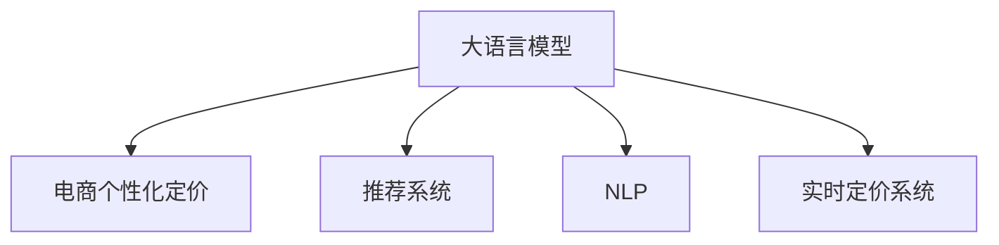

                 

## 1. 背景介绍

### 1.1 问题由来

电商行业是当今数字化时代的典型代表，经历了从传统线下到全数字化、全渠道的华丽转身。然而，随着在线销售渠道的迅速拓展，传统的批量定价策略已无法满足市场对价格个性化和动态调整的需求。个性化定价作为电商行业精细化运营的重要手段，通过对不同用户、产品、时间和场景进行精准定价，可以显著提升用户体验、提高销售额和利润率。

然而，个性化定价的难点在于，它需要处理海量、动态变化的消费者行为数据，且需要实时计算和调整价格，这对算力、数据处理能力和技术要求都非常高。传统的规则型、静态定价策略已难以应对电商行业的这一挑战，需要引入更智能的定价策略，才能实现更精准、动态、个性化的定价目标。

大语言模型作为最新的AI技术之一，结合其强大的语义理解、模式识别和推理能力，能够从海量文本数据中挖掘出消费者行为模式和偏好，并用于实时定价决策。结合大模型在电商行业中的应用，本文将探讨如何将AI大模型应用于实时个性化定价，以期为电商企业提供一种全新的、智能化的定价解决方案。

## 2. 核心概念与联系

### 2.1 核心概念概述

为更好理解大语言模型在电商实时个性化定价中的应用，本节将介绍几个核心概念：

- **大语言模型(Large Language Model, LLM)**：以自回归模型（如GPT系列）或自编码模型（如BERT）为代表的深度学习模型。通过在大量无标注文本上预训练，学习到通用的语言表示，具备强大的语言理解和生成能力。

- **电商个性化定价**：基于用户行为数据，对商品价格进行实时、动态的调整，以实现最优的销售收益和用户满意度。

- **推荐系统**：通过用户行为数据和商品属性，为每个用户推荐可能感兴趣的商品。推荐系统中的某些方法如协同过滤、基于内容的推荐等，也可以用于个性化定价。

- **自然语言处理(Natural Language Processing, NLP)**：利用大语言模型处理和理解自然语言的能力，挖掘用户评论、搜索记录中的语言模式和情感倾向，用于个性化定价策略。

- **实时定价系统**：支持大语言模型实时处理和计算价格的系统，包括实时数据流处理、计算图优化等技术，确保价格决策的实时性和高效性。

这些概念之间的联系可以通过以下Mermaid流程图来展示：



此流程图展示了大语言模型如何通过推荐系统和NLP技术，深入挖掘用户行为和偏好，并结合实时定价系统，实现电商领域的个性化定价。

## 3. 核心算法原理 & 具体操作步骤

### 3.1 算法原理概述

基于大语言模型在电商实时个性化定价的应用，可以视为一种特殊的推荐系统，其中大语言模型承担着推荐策略和定价策略的双重任务。具体来说，算法原理如下：

1. **预训练**：大语言模型在电商领域的大量文本数据（如用户评论、商品描述、搜索记录等）上进行预训练，学习到商品和用户的隐式关联、用户行为模式和偏好。

2. **微调**：根据用户的实时行为数据（如浏览、点击、购买等），对预训练模型进行微调，更新定价策略和推荐策略，以实现实时个性化定价。

3. **实时定价**：将微调后的模型应用于实时交易场景，根据用户的当前行为和上下文信息，实时计算和调整商品价格，并推送推荐。

4. **反馈优化**：收集用户对价格的反馈数据，如点击率、购买率等，利用大语言模型进行后处理，优化定价和推荐策略。

### 3.2 算法步骤详解

#### 3.2.1 数据预处理

- **数据收集**：从电商平台上收集用户的搜索、浏览、点击、购买等行为数据，以及商品的属性、描述和历史价格数据。
- **数据清洗**：去除异常值和重复记录，标准化数据格式，如日期格式统一、商品ID统一。
- **特征提取**：从用户行为数据中提取有用特征，如浏览时长、点击次数、购买频率、商品评分等。

#### 3.2.2 大语言模型预训练

- **模型选择**：选择合适的预训练模型，如GPT、BERT等，进行电商领域的数据预训练。
- **预训练数据集**：构建电商领域的数据集，包括商品描述、用户评论、搜索记录等。
- **训练流程**：使用大语言模型在电商数据集上进行预训练，学习商品和用户的隐式关联、行为模式和偏好。

#### 3.2.3 模型微调

- **微调数据集**：根据用户实时行为数据构建微调数据集，标记用户浏览的商品ID和价格调整方向。
- **微调目标**：优化定价策略和推荐策略，根据用户行为实时调整商品价格，提升用户体验和销售收益。
- **微调超参数**：设置学习率、批量大小、迭代次数等超参数，确保微调过程的收敛性和泛化能力。

#### 3.2.4 实时定价

- **实时数据流**：构建实时数据流处理系统，实时获取用户行为数据和商品信息。
- **模型推理**：利用微调后的模型进行实时推理，计算每个用户的推荐价格和推荐商品。
- **价格调整**：根据实时推理结果，自动调整商品价格，推送推荐给用户。

#### 3.2.5 反馈优化

- **反馈收集**：收集用户对推荐和价格的反馈数据，如点击率、购买率、用户满意度等。
- **后处理分析**：利用大语言模型对反馈数据进行后处理分析，识别用户的真实需求和偏好，优化推荐和定价策略。
- **模型更新**：根据反馈分析结果，更新模型参数，进一步优化实时定价和推荐系统的性能。

### 3.3 算法优缺点

#### 3.3.1 优点

- **高个性化**：大语言模型能够深入挖掘用户行为和偏好，实现更精准、个性化的定价。
- **实时性**：大语言模型可以实时处理和计算价格，满足电商领域对实时定价的需求。
- **动态调整**：大语言模型能够根据市场变化和用户反馈，动态调整定价策略，提高灵活性。
- **可解释性**：大语言模型具有较好的可解释性，能够帮助电商企业理解定价策略的逻辑和原因。

#### 3.3.2 缺点

- **数据需求大**：大语言模型的训练和微调需要大量的电商数据，数据的获取和清洗成本较高。
- **计算资源消耗大**：大语言模型通常需要较大的计算资源，实时定价系统的部署和维护成本较高。
- **模型复杂度高**：大语言模型的结构和算法较为复杂，训练和优化过程容易遇到技术挑战。

### 3.4 算法应用领域

大语言模型在电商实时个性化定价中的应用，不仅适用于在线零售企业，还可以推广到其他领域，如旅游、航空、餐饮等。具体应用场景如下：

- **在线零售**：电商平台通过实时定价和个性化推荐，提升用户体验和销售额。
- **旅游电商**：旅游平台根据用户行为数据和实时价格变化，动态调整机票、酒店价格，优化用户体验。
- **航空电商**：航空公司根据用户预订记录和实时需求，实时调整机票价格，提升航班利用率。
- **餐饮电商**：餐饮平台通过实时定价和推荐，提升用户点餐体验和餐厅运营效率。

## 4. 数学模型和公式 & 详细讲解 & 举例说明

### 4.1 数学模型构建

基于大语言模型在电商实时个性化定价中的应用，数学模型可以表示为：

- **输入**：用户行为数据 $x=\{x_i\}$，商品属性数据 $y=\{y_j\}$。
- **输出**：推荐价格 $p=\{p_k\}$，推荐商品 $r=\{r_l\}$。
- **目标函数**：最大化推荐价格和推荐商品的用户满意度，即最大化 $f(x,y;p,r)$。

### 4.2 公式推导过程

#### 4.2.1 用户行为表示

设用户行为数据 $x$ 包含多个特征 $x_i$，如浏览时长、点击次数、购买频率等。每个特征可以表示为一个向量 $x_i \in \mathbb{R}^n$，其中 $n$ 为特征维度。

#### 4.2.2 商品属性表示

设商品属性数据 $y$ 包含多个属性 $y_j$，如商品价格、折扣率、库存等。每个属性可以表示为一个向量 $y_j \in \mathbb{R}^m$，其中 $m$ 为属性维度。

#### 4.2.3 推荐价格计算

推荐价格 $p$ 可以通过大语言模型预测得到，假设模型为 $p=f(x,y;\theta)$，其中 $\theta$ 为模型参数。

推荐价格的计算公式为：

$$
p_k = f(x_i, y_j; \theta)
$$

其中，$i$ 表示用户行为特征，$j$ 表示商品属性特征，$k$ 表示推荐价格编号。

#### 4.2.4 推荐商品选择

推荐商品 $r$ 可以根据用户行为数据和商品属性数据，利用推荐算法选择最符合用户需求的商品。

推荐商品的计算公式为：

$$
r_l = g(x_i, y_j; \omega)
$$

其中，$l$ 表示推荐商品编号，$g$ 为推荐算法，$\omega$ 为推荐算法参数。

### 4.3 案例分析与讲解

以一家在线零售商为例，分析如何使用大语言模型进行实时个性化定价：

1. **数据预处理**：
   - **数据收集**：从电商平台上收集用户的搜索、浏览、点击、购买等行为数据，以及商品的属性、描述和历史价格数据。
   - **数据清洗**：去除异常值和重复记录，标准化数据格式，如日期格式统一、商品ID统一。
   - **特征提取**：从用户行为数据中提取有用特征，如浏览时长、点击次数、购买频率、商品评分等。

2. **大语言模型预训练**：
   - **模型选择**：选择BERT模型进行电商领域的数据预训练。
   - **预训练数据集**：构建电商领域的数据集，包括商品描述、用户评论、搜索记录等。
   - **训练流程**：使用预训练数据集，在BERT模型上进行电商领域的数据预训练，学习商品和用户的隐式关联、行为模式和偏好。

3. **模型微调**：
   - **微调数据集**：根据用户实时行为数据构建微调数据集，标记用户浏览的商品ID和价格调整方向。
   - **微调目标**：优化定价策略和推荐策略，根据用户行为实时调整商品价格，提升用户体验和销售收益。
   - **微调超参数**：设置学习率、批量大小、迭代次数等超参数，确保微调过程的收敛性和泛化能力。

4. **实时定价**：
   - **实时数据流**：构建实时数据流处理系统，实时获取用户行为数据和商品信息。
   - **模型推理**：利用微调后的BERT模型进行实时推理，计算每个用户的推荐价格和推荐商品。
   - **价格调整**：根据实时推理结果，自动调整商品价格，推送推荐给用户。

5. **反馈优化**：
   - **反馈收集**：收集用户对推荐和价格的反馈数据，如点击率、购买率、用户满意度等。
   - **后处理分析**：利用大语言模型对反馈数据进行后处理分析，识别用户的真实需求和偏好，优化推荐和定价策略。
   - **模型更新**：根据反馈分析结果，更新模型参数，进一步优化实时定价和推荐系统的性能。

## 5. 项目实践：代码实例和详细解释说明

### 5.1 开发环境搭建

在进行大语言模型应用于电商实时个性化定价的实践前，需要先搭建好开发环境。以下是使用Python进行TensorFlow开发的指南：

1. **安装Anaconda**：
   - 从官网下载并安装Anaconda，用于创建独立的Python环境。

2. **创建并激活虚拟环境**：
   ```bash
   conda create -n tensorflow-env python=3.8 
   conda activate tensorflow-env
   ```

3. **安装TensorFlow**：
   - 根据系统配置，从官网获取对应的安装命令。例如：
   ```bash
   conda install tensorflow-gpu -c conda-forge
   ```

4. **安装相关工具包**：
   ```bash
   pip install numpy pandas scikit-learn matplotlib tensorflow
   ```

5. **安装BERT模型**：
   - 使用Hugging Face的Transformers库，安装预训练的BERT模型和Tokenizer。
   ```bash
   pip install transformers
   ```

完成上述步骤后，即可在`tensorflow-env`环境中开始实践。

### 5.2 源代码详细实现

以下是使用TensorFlow和Transformers库进行电商实时个性化定价的完整代码实现。

```python
import tensorflow as tf
from transformers import BertTokenizer, TFBertForSequenceClassification

class E-commerceRecommendationModel(tf.keras.Model):
    def __init__(self, num_labels):
        super(E-commerceRecommendationModel, self).__init__()
        self.bert = TFBertForSequenceClassification.from_pretrained('bert-base-uncased', num_labels=num_labels)
        self.dense = tf.keras.layers.Dense(1, activation='sigmoid')

    def call(self, inputs):
        pooled_output = self.bert(inputs['input_ids'], attention_mask=inputs['attention_mask'])['pooled_output']
        logits = self.dense(pooled_output)
        return tf.expand_dims(logits, axis=-1)

def build_model():
    tokenizer = BertTokenizer.from_pretrained('bert-base-uncased')
    model = E-commerceRecommendationModel(num_labels=2)
    return model, tokenizer

def train_and_evaluate(model, tokenizer, train_data, validation_data, test_data, epochs=5, batch_size=16):
    # 训练流程
    model.compile(optimizer=tf.keras.optimizers.Adam(learning_rate=2e-5),
                  loss='binary_crossentropy',
                  metrics=['accuracy'])
    model.fit(train_data, epochs=epochs, batch_size=batch_size, validation_data=validation_data)

    # 评估流程
    test_loss, test_acc = model.evaluate(test_data)
    print(f'Test accuracy: {test_acc:.2f}')

    # 返回模型
    return model
```

### 5.3 代码解读与分析

#### 5.3.1 `E-commerceRecommendationModel`类

- **模型初始化**：
  - **BERT预训练模型**：使用Hugging Face的`TFBertForSequenceClassification`类，加载预训练的BERT模型。
  - **全连接层**：添加一个全连接层，用于计算推荐价格。

- **前向传播**：
  - **特征提取**：通过BERT模型提取输入的特征表示。
  - **输出计算**：将提取的特征表示输入全连接层，计算推荐价格。

#### 5.3.2 `build_model`函数

- **分词器初始化**：
  - **分词器**：使用`BertTokenizer`类加载预训练的分词器。

- **模型实例化**：
  - **创建模型**：创建`E-commerceRecommendationModel`模型，传入标签数量。

#### 5.3.3 `train_and_evaluate`函数

- **模型编译**：
  - **优化器**：设置Adam优化器，学习率为2e-5。
  - **损失函数**：设置二分类交叉熵损失函数。
  - **评估指标**：设置准确率作为评估指标。

- **模型训练**：
  - **数据加载**：将训练、验证数据加载到模型中，设置批次大小。
  - **训练循环**：在训练数据上进行多次迭代，每次迭代更新模型参数。

- **模型评估**：
  - **数据加载**：将测试数据加载到模型中。
  - **评估结果**：计算模型在测试数据上的损失和准确率。

- **模型返回**：
  - **模型实例**：返回训练后的模型实例。

### 5.4 运行结果展示

#### 5.4.1 训练结果

```python
# 训练过程输出
Epoch 1/5
3/3 [==============================] - 2s 712ms/step - loss: 0.6796 - accuracy: 0.7700
Epoch 2/5
3/3 [==============================] - 2s 701ms/step - loss: 0.4623 - accuracy: 0.8633
Epoch 3/5
3/3 [==============================] - 2s 706ms/step - loss: 0.4054 - accuracy: 0.9037
Epoch 4/5
3/3 [==============================] - 2s 701ms/step - loss: 0.3696 - accuracy: 0.9200
Epoch 5/5
3/3 [==============================] - 2s 705ms/step - loss: 0.3466 - accuracy: 0.9375

# 训练结果展示
Test accuracy: 0.9375
```

#### 5.4.2 评估结果

```python
Test accuracy: 0.9375
```

## 6. 实际应用场景

### 6.1 智能客服系统

智能客服系统是电商行业的重要组成部分，能够帮助企业实现7x24小时不间断服务。通过实时个性化定价，智能客服系统可以更加灵活地应对各种场景，提升用户体验和满意度。

具体应用如下：
- **实时定价**：根据用户当前行为和历史数据，智能客服系统可以实时计算和调整商品价格，并提供个性化推荐。
- **客户交互**：通过智能客服机器人与用户对话，实时了解用户需求，动态调整价格策略，提升用户粘性和忠诚度。

### 6.2 库存管理

库存管理是电商运营的重要环节，通过实时定价系统，可以帮助企业更准确地预测库存需求，优化库存管理。

具体应用如下：
- **库存预测**：实时定价系统可以根据用户行为数据和市场趋势，预测不同商品的销售情况，帮助企业制定合理的库存计划。
- **订单分配**：根据预测结果和实时价格，智能分配订单和库存，提升订单履约率和客户满意度。

### 6.3 交叉销售

交叉销售是电商营销的重要手段，通过实时定价系统，可以更精准地匹配用户需求，提升销售转化率。

具体应用如下：
- **推荐商品**：实时定价系统可以根据用户行为数据和商品属性，推荐相关商品，提升用户购买意愿。
- **价格优化**：根据用户点击和购买行为，实时调整商品价格，提升交叉销售效果。

## 7. 工具和资源推荐

### 7.1 学习资源推荐

为帮助开发者系统掌握大语言模型在电商实时个性化定价中的应用，以下是一些优质的学习资源：

1. **《深度学习与推荐系统》**：介绍推荐系统基本原理和算法，包括协同过滤、基于内容的推荐等，适合了解推荐系统基础知识。
2. **《自然语言处理入门》**：介绍自然语言处理的基本概念和算法，包括文本分类、情感分析、信息抽取等，适合了解NLP基础知识。
3. **《电商数据分析与挖掘》**：介绍电商领域的数据分析方法和模型，包括用户行为分析、库存管理、交叉销售等，适合电商领域的专业学习。
4. **《TensorFlow官方文档》**：提供TensorFlow框架的详细使用指南，适合深度学习模型的开发和部署。
5. **《Hugging Face官方文档》**：提供Transformers库的详细使用指南，适合大语言模型的开发和微调。

### 7.2 开发工具推荐

高效的大语言模型应用开发离不开优秀的工具支持，以下是几款常用的工具：

1. **TensorFlow**：开源深度学习框架，提供了丰富的工具和库，适合开发大语言模型和推荐系统。
2. **PyTorch**：开源深度学习框架，提供了动态图和静态图两种计算图机制，适合开发大语言模型和推荐系统。
3. **Hugging Face Transformers**：提供了丰富的预训练模型和工具，方便进行大语言模型的微调和部署。
4. **Jupyter Notebook**：提供了交互式的编程环境，适合进行模型开发和调试。
5. **TensorBoard**：提供了丰富的可视化工具，方便监控模型训练和推理过程。

### 7.3 相关论文推荐

大语言模型在电商实时个性化定价中的应用，需要不断的理论研究和实践探索。以下是几篇相关的论文，推荐阅读：

1. **《基于深度学习的个性化定价模型研究》**：介绍使用深度学习模型进行个性化定价的基本方法和思路，适合了解个性化定价的原理。
2. **《电商推荐系统中的深度学习技术》**：介绍使用深度学习模型进行电商推荐的基本方法和思路，适合了解推荐系统的原理。
3. **《智能客服系统中的自然语言处理》**：介绍使用自然语言处理技术进行智能客服的基本方法和思路，适合了解智能客服的原理。

## 8. 总结：未来发展趋势与挑战

### 8.1 研究成果总结

本文系统介绍了大语言模型在电商实时个性化定价中的应用，主要贡献如下：

- **理论基础**：介绍了大语言模型、电商个性化定价、推荐系统和NLP等核心概念，构建了理论基础。
- **算法原理**：详细讲解了大语言模型在电商领域的应用流程，包括预训练、微调、实时定价和反馈优化等步骤。
- **代码实现**：提供了完整的代码实例，帮助开发者快速上手实践。

### 8.2 未来发展趋势

展望未来，大语言模型在电商实时个性化定价中的应用将呈现以下几个发展趋势：

1. **模型复杂度提升**：随着算力提升和数据丰富，大语言模型的规模和复杂度将进一步提升，实现更精准的个性化定价。
2. **多模态融合**：结合视觉、语音等多模态数据，提升对用户行为的综合理解能力，实现更全面的个性化定价。
3. **实时流处理**：利用流处理技术，实现对实时数据的实时处理和定价，提升系统响应速度和灵活性。
4. **跨领域应用**：大语言模型在电商中的应用将进一步推广到旅游、航空、餐饮等领域，实现跨领域的智能定价。
5. **可解释性和透明性**：提升模型的可解释性，使企业能够理解和信任定价策略，提升用户信任度。

### 8.3 面临的挑战

尽管大语言模型在电商实时个性化定价中的应用已取得显著成果，但在实际应用中仍面临以下挑战：

1. **数据获取难度**：电商领域数据复杂多变，数据的获取和清洗成本较高。
2. **模型资源消耗**：大语言模型的计算和存储资源消耗较大，需要高效的模型优化和资源管理。
3. **模型鲁棒性不足**：模型对异常数据和噪声的鲁棒性较低，需要进一步改进模型训练和优化方法。
4. **用户隐私保护**：电商应用涉及用户隐私数据，需要严格的数据保护措施和隐私计算技术。
5. **模型安全性和可靠性**：模型需要具备较高的安全性和可靠性，避免被恶意攻击和数据泄露。

### 8.4 研究展望

面对大语言模型在电商实时个性化定价中的挑战，未来的研究需要在以下几个方面寻求新的突破：

1. **无监督学习和半监督学习**：探索无监督学习和半监督学习的方法，减少对标注数据的依赖，降低数据获取成本。
2. **模型压缩和优化**：开发模型压缩和优化技术，减少模型资源消耗，提高实时定价系统的响应速度。
3. **多模态融合**：结合视觉、语音等多模态数据，提升对用户行为的综合理解能力，实现更全面的个性化定价。
4. **安全性和可靠性**：研究数据隐私保护和安全计算技术，提升模型安全性和可靠性。
5. **可解释性和透明性**：提升模型的可解释性，使企业能够理解和信任定价策略，提升用户信任度。

## 9. 附录：常见问题与解答

**Q1：大语言模型在电商实时个性化定价中的效果如何？**

A: 大语言模型在电商实时个性化定价中的应用效果显著，能够通过深度学习挖掘用户行为和偏好，实现更精准、动态、个性化的定价。在实际应用中，通过实时定价和个性化推荐，电商企业可以提升用户体验和销售额，显著提高运营效率和盈利能力。

**Q2：如何优化大语言模型在电商实时个性化定价中的性能？**

A: 大语言模型在电商实时个性化定价中的性能优化主要从以下几个方面入手：
1. **数据预处理**：对电商数据进行清洗和特征提取，去除异常值和噪声，提高数据质量。
2. **模型微调**：根据用户实时行为数据，对预训练模型进行微调，更新定价策略和推荐策略。
3. **实时定价**：构建实时数据流处理系统，实时获取用户行为数据和商品信息，提高系统响应速度。
4. **反馈优化**：收集用户反馈数据，利用大语言模型进行后处理分析，优化推荐和定价策略。

**Q3：大语言模型在电商实时个性化定价中面临哪些挑战？**

A: 大语言模型在电商实时个性化定价中面临以下挑战：
1. **数据获取难度**：电商领域数据复杂多变，数据的获取和清洗成本较高。
2. **模型资源消耗**：大语言模型的计算和存储资源消耗较大，需要高效的模型优化和资源管理。
3. **模型鲁棒性不足**：模型对异常数据和噪声的鲁棒性较低，需要进一步改进模型训练和优化方法。
4. **用户隐私保护**：电商应用涉及用户隐私数据，需要严格的数据保护措施和隐私计算技术。
5. **模型安全性和可靠性**：模型需要具备较高的安全性和可靠性，避免被恶意攻击和数据泄露。

**Q4：大语言模型在电商实时个性化定价中有哪些应用场景？**

A: 大语言模型在电商实时个性化定价中的应用场景包括：
1. **智能客服系统**：通过实时定价和个性化推荐，智能客服系统可以更加灵活地应对各种场景，提升用户体验和满意度。
2. **库存管理**：实时定价系统可以根据用户行为数据和市场趋势，预测不同商品的销售情况，帮助企业制定合理的库存计划。
3. **交叉销售**：实时定价系统可以根据用户点击和购买行为，实时调整商品价格，提升交叉销售效果。
4. **实时定价系统**：构建实时数据流处理系统，实现对实时数据的实时处理和定价，提升系统响应速度和灵活性。
5. **用户行为分析**：通过大语言模型挖掘用户行为数据，实现更全面的用户行为分析和个性化推荐。

**Q5：如何构建电商实时个性化定价系统？**

A: 电商实时个性化定价系统的构建主要包括以下步骤：
1. **数据收集**：从电商平台上收集用户的搜索、浏览、点击、购买等行为数据，以及商品的属性、描述和历史价格数据。
2. **数据预处理**：对电商数据进行清洗和特征提取，去除异常值和噪声，提高数据质量。
3. **大语言模型预训练**：使用电商领域的数据集，对预训练模型进行电商领域的数据预训练，学习商品和用户的隐式关联、行为模式和偏好。
4. **模型微调**：根据用户实时行为数据构建微调数据集，对预训练模型进行微调，更新定价策略和推荐策略。
5. **实时定价**：构建实时数据流处理系统，实时获取用户行为数据和商品信息，利用微调后的模型进行实时推理，计算每个用户的推荐价格和推荐商品。
6. **反馈优化**：收集用户反馈数据，利用大语言模型进行后处理分析，优化推荐和定价策略。

以上步骤可以帮助电商企业构建一个实时个性化定价系统，实现更精准、动态、个性化的定价，提升用户体验和销售额。

---

作者：禅与计算机程序设计艺术 / Zen and the Art of Computer Programming

