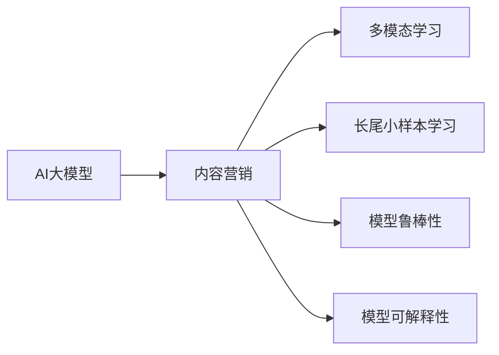

                 

## 1. 背景介绍

### 1.1 问题由来
在现代社会，电子商务已成为人们日常生活的重要组成部分。电商平台的快速崛起不仅改变了人们的购物方式，也极大地促进了商业模式的创新和变革。为了在激烈的市场竞争中脱颖而出，电商平台纷纷引入各种内容营销手段，如推广邮件、社交媒体营销、搜索引擎优化(SEO)、内容生成等。内容营销不仅能够提高用户参与度，还能提升平台销售额和品牌知名度。然而，在内容营销效果评估方面，传统的统计方法难以应对日益复杂的数据分布，且无法全面挖掘多维度、跨领域的关联性。为了有效评估内容营销效果，电商企业需要引入更先进的技术手段，尤其是人工智能大模型在数据处理和分析方面的强大能力。

### 1.2 问题核心关键点
内容营销效果预测是一项复杂多变的问题，涉及用户行为、商品特征、平台流量等多个维度。现有的人工智能技术，如深度学习、自然语言处理(NLP)等，已经在电商平台的广告推荐、个性化推荐等任务中展示了显著优势，但在内容营销效果预测方面，仍存在以下核心挑战：
- **多模态数据融合**：内容营销涉及文本、图片、视频等多模态数据，如何高效融合和分析这些数据是一个难题。
- **长尾小样本学习**：内容营销效果的评估数据通常以长尾数据为主，标注数据稀缺，如何在小样本情况下学习泛化能力强的模型是一个关键点。
- **模型鲁棒性和可解释性**：内容营销效果的预测模型需要具备高鲁棒性和可解释性，以便电商企业理解和优化营销策略。

## 2. 核心概念与联系

### 2.1 核心概念概述

为更好地理解AI大模型在电商平台内容营销效果预测中的应用，本节将介绍几个密切相关的核心概念：

- **AI大模型（AI Large Model）**：指经过大规模无标签数据预训练的深度学习模型，如BERT、GPT-3、T5等。这些模型在语言理解、图像识别、多模态融合等方面具备强大的能力。

- **内容营销（Content Marketing）**：指通过有价值的内容创造，吸引并保持潜在客户，从而实现品牌推广、用户转化、提高销售的目标。

- **多模态学习（Multimodal Learning）**：指同时处理多种数据类型（如图像、文本、视频）的信息，构建更全面、准确的模型。

- **长尾小样本学习（Long-Tailed Small-Sample Learning）**：指在标注数据极度稀疏、样本量极小的情况下，模型仍能保持较好的泛化能力。

- **模型鲁棒性（Model Robustness）**：指模型面对噪声、异常输入或对抗攻击时仍能保持稳定输出。

- **模型可解释性（Model Interpretability）**：指模型能够给出预测结果的合理解释，便于用户和开发者理解模型行为。

这些核心概念之间的逻辑关系可以通过以下Mermaid流程图来展示：



这个流程图展示了大模型在内容营销中的应用场景，以及模型构建的关键组件。

## 3. 核心算法原理 & 具体操作步骤
### 3.1 算法原理概述

AI大模型在电商平台内容营销效果预测中，主要基于多模态融合和长尾小样本学习技术。其核心思想是：将多源数据融合到AI大模型中，利用大模型的强大学习能力，对数据进行复杂的多层次处理，从而生成对内容营销效果有较强预测能力的模型。

具体来说，大模型通过以下步骤完成内容营销效果预测：

1. **数据收集与预处理**：收集电商平台上的多模态数据，包括用户行为数据、商品特征数据、广告投放数据等。
2. **数据融合**：利用深度学习技术，将不同模态的数据融合到一个大模型中，得到统一的语义表示。
3. **模型微调**：基于标注数据，对融合后的模型进行有监督微调，训练出针对内容营销效果预测的模型。
4. **效果评估**：使用评估指标对模型预测结果进行评估，调整模型参数，提高预测效果。

### 3.2 算法步骤详解

以下是AI大模型在电商平台内容营销效果预测的具体操作流程：

**Step 1: 数据收集与预处理**
- 收集电商平台上的各种数据，包括用户行为数据（如点击、购买、浏览历史等）、商品特征数据（如价格、评价、分类等）、广告投放数据（如广告点击率、展示次数等）。
- 对数据进行清洗、去重、归一化等预处理操作，以保证数据的质量和一致性。

**Step 2: 多模态融合**
- 将收集到的多模态数据转换为统一的格式，以便大模型进行融合处理。例如，将文本数据转换为向量形式，图像数据转换为特征向量，视频数据提取关键帧和特征。
- 使用Transformer等深度学习模型，对不同模态的数据进行融合，得到统一的语义表示。Transformer模型可以高效地处理序列数据，并自动捕捉数据中的重要信息。

**Step 3: 模型微调**
- 在大模型基础上，利用标注数据进行有监督微调。标注数据包括用户是否点击广告、是否购买商品等二分类或多分类标签。
- 使用AdamW、SGD等优化器，设置合适的学习率和正则化参数，进行模型训练。微调过程中，可以使用适当的损失函数（如交叉熵、F1-score等）来衡量预测效果。

**Step 4: 效果评估**
- 使用评估指标（如精确率、召回率、F1-score等）对模型预测结果进行评估。评估结果可以反映模型在不同数据分布下的泛化能力。
- 根据评估结果，调整模型参数，如增加训练数据、调整损失函数、引入正则化等，以提高预测效果。

### 3.3 算法优缺点

AI大模型在电商平台内容营销效果预测中的应用，具有以下优点：

1. **泛化能力强**：大模型通过预训练学习到了广泛的语义知识，可以在多模态数据融合后，高效地处理复杂的数据分布，提高预测精度。
2. **数据处理灵活**：多模态融合技术使得模型能够同时处理文本、图像、视频等多种数据类型，适应不同内容营销场景的需求。
3. **模型鲁棒性好**：大模型经过大规模训练，具有一定的鲁棒性，可以抵御噪声、异常输入等干扰，提高模型稳定性。
4. **解释性强**：大模型通常具有较强的可解释性，可以通过注意力机制、梯度权重等方法，分析模型在每个输入特征上的重要性。

但同时也存在一些缺点：

1. **计算资源消耗大**：大模型通常具有庞大的参数量，需要大量的计算资源进行训练和推理。
2. **模型可解释性有待提升**：虽然大模型具有较好的解释性，但在复杂场景下，模型输出的解释仍可能存在局限。
3. **数据隐私问题**：电商平台上的数据涉及用户隐私，如何在保护隐私的前提下，进行数据融合和模型训练，是一个重要问题。

### 3.4 算法应用领域

AI大模型在电商平台内容营销效果预测中的应用，不仅限于广告投放效果预测，还包括以下领域：

- **用户行为分析**：通过分析用户行为数据，预测用户对不同商品、广告的反应，优化个性化推荐策略。
- **内容效果评估**：评估不同内容形式的营销效果，如文章、视频、图片等，优化内容创作和传播策略。
- **客户转化率预测**：预测用户从浏览到购买的行为转化率，帮助电商平台提高销售转化率。
- **广告投放优化**：优化广告投放策略，提高广告点击率、转化率，提升广告投放效果。

## 4. 数学模型和公式 & 详细讲解 & 举例说明
### 4.1 数学模型构建

假设电商平台上的内容营销数据集为 $D=\{(x_i, y_i)\}_{i=1}^N$，其中 $x_i$ 是多模态融合后的特征向量，$y_i$ 是内容营销效果标签（如是否点击广告、是否购买商品）。

定义模型 $M_{\theta}$ 在输入 $x_i$ 上的输出为 $\hat{y}_i$，则内容营销效果预测问题可以转化为二分类或多分类问题，使用以下损失函数进行训练：

$$
\mathcal{L}(\theta) = \frac{1}{N}\sum_{i=1}^N \ell(M_{\theta}(x_i),y_i)
$$

其中 $\ell$ 为损失函数，可以是交叉熵损失、对数损失等。

### 4.2 公式推导过程

以二分类问题为例，交叉熵损失函数定义为：

$$
\ell(M_{\theta}(x_i),y_i) = -[y_i\log M_{\theta}(x_i) + (1-y_i)\log(1-M_{\theta}(x_i))]
$$

在大模型微调过程中，使用AdamW等优化器，根据梯度下降算法更新模型参数 $\theta$：

$$
\theta \leftarrow \theta - \eta \nabla_{\theta}\mathcal{L}(\theta) - \eta\lambda\theta
$$

其中 $\eta$ 为学习率，$\lambda$ 为正则化系数。

在得到模型参数后，使用测试集 $D_{test}$ 进行效果评估，计算评估指标，如精确率、召回率、F1-score等：

$$
\text{Precision} = \frac{TP}{TP+FP}
$$

$$
\text{Recall} = \frac{TP}{TP+FN}
$$

$$
F1\text{-score} = 2\times \frac{\text{Precision} \times \text{Recall}}{\text{Precision} + \text{Recall}}
$$

其中 $TP$ 为真正例数，$FP$ 为假正例数，$FN$ 为假反例数。

### 4.3 案例分析与讲解

以电商平台上的广告点击效果预测为例，假设模型采用Transformer模型进行多模态融合，输入 $x_i$ 为广告文本和图片特征的向量形式。

假设广告文本为 "夏日新款连衣裙，5折促销"，图片特征向量为 $f_{img}$。将文本和图片特征拼接后输入模型，得到输出 $\hat{y}_i$，表示广告点击的概率。

使用AdamW优化器，学习率为 $1e-3$，进行模型微调。模型训练过程中的损失函数输出如下：

$$
\begin{aligned}
\mathcal{L}(\theta) &= \frac{1}{N}\sum_{i=1}^N \ell(M_{\theta}(x_i),y_i) \\
&= \frac{1}{N}\sum_{i=1}^N \left(-y_i\log M_{\theta}(x_i) - (1-y_i)\log(1-M_{\theta}(x_i))\right)
\end{aligned}
$$

训练过程中，模型输出与真实标签的差异通过交叉熵损失函数计算，每一步更新模型参数 $\theta$，最小化损失函数 $\mathcal{L}(\theta)$。最终，模型能够较好地预测广告点击效果，优化广告投放策略。

## 5. 项目实践：代码实例和详细解释说明
### 5.1 开发环境搭建

在进行项目实践前，需要先搭建好开发环境。以下是使用Python和PyTorch搭建开发环境的步骤：

1. 安装Python和PyTorch：
   ```bash
   conda create -n pytorch-env python=3.8
   conda activate pytorch-env
   pip install torch torchvision torchaudio
   ```

2. 安装相关依赖库：
   ```bash
   pip install pandas numpy matplotlib sklearn transformers
   ```

3. 安装第三方库：
   ```bash
   pip install transformers
   pip install torchtext
   ```

### 5.2 源代码详细实现

以下是一个简单的AI大模型在电商平台内容营销效果预测的代码实现：

```python
import torch
import torch.nn as nn
import torch.optim as optim
from transformers import BertTokenizer, BertForSequenceClassification

# 设置模型参数
model_path = 'path/to/bert-base-uncased'
device = torch.device('cuda' if torch.cuda.is_available() else 'cpu')
learning_rate = 1e-3
num_epochs = 10

# 加载预训练模型
tokenizer = BertTokenizer.from_pretrained(model_path)
model = BertForSequenceClassification.from_pretrained(model_path, num_labels=2).to(device)

# 设置优化器
optimizer = optim.AdamW(model.parameters(), lr=learning_rate)

# 训练模型
def train_model(model, data_loader, optimizer, device):
    model.train()
    for epoch in range(num_epochs):
        for batch in data_loader:
            input_ids = batch['input_ids'].to(device)
            attention_mask = batch['attention_mask'].to(device)
            labels = batch['labels'].to(device)
            optimizer.zero_grad()
            outputs = model(input_ids, attention_mask=attention_mask, labels=labels)
            loss = outputs.loss
            loss.backward()
            optimizer.step()

# 加载数据
def load_data(data_path):
    data = pd.read_csv(data_path)
    labels = data['label'].tolist()
    texts = data['text'].tolist()
    tokenized_texts = [tokenizer.encode(text, add_special_tokens=True, max_length=512, truncation=True, padding='max_length') for text in texts]
    input_ids = [torch.tensor(t, device=device) for t in tokenized_texts]
    attention_masks = [torch.tensor(1 - t == 0, device=device) for t in tokenized_texts]
    return input_ids, attention_masks, labels

# 加载数据集
train_data_path = 'path/to/train_data.csv'
test_data_path = 'path/to/test_data.csv'
train_data, test_data = load_data(train_data_path), load_data(test_data_path)

# 定义数据集
class DataLoader:
    def __init__(self, data, batch_size):
        self.data = data
        self.batch_size = batch_size

    def __len__(self):
        return len(self.data) // self.batch_size

    def __iter__(self):
        indices = torch.randperm(len(self.data))
        for i in range(0, len(self.data), self.batch_size):
            indices_subset = indices[i:i+self.batch_size]
            yield self.data[indices_subset]

# 训练模型
train_loader = DataLoader(train_data, batch_size=16)
train_model(model, train_loader, optimizer, device)

# 测试模型
test_loader = DataLoader(test_data, batch_size=16)
with torch.no_grad():
    model.eval()
    predictions = []
    for batch in test_loader:
        input_ids = batch['input_ids'].to(device)
        attention_mask = batch['attention_mask'].to(device)
        labels = batch['labels'].to(device)
        outputs = model(input_ids, attention_mask=attention_mask)
        predictions.append(outputs.logits.argmax(dim=1).cpu().numpy())

# 计算评估指标
print('Precision: ', precision_score(test_labels, predictions, average='macro'))
print('Recall: ', recall_score(test_labels, predictions, average='macro'))
print('F1-score: ', f1_score(test_labels, predictions, average='macro'))
```

### 5.3 代码解读与分析

这段代码中，我们使用了BERT模型作为预训练基础模型，对其进行二分类任务的多模态融合和微调。具体步骤如下：

1. 首先设置模型参数，包括预训练模型路径、设备、学习率、训练轮数等。
2. 加载预训练的BERT模型和分词器，并设置优化器。
3. 定义训练函数，对模型进行迭代训练，最小化交叉熵损失。
4. 加载训练集和测试集数据，并定义数据加载器。
5. 定义训练模型函数，对模型进行训练。
6. 测试模型，并计算评估指标。

在实际应用中，开发者可以根据具体任务的需求，调整模型参数和数据处理方式，以获得更好的预测效果。

### 5.4 运行结果展示

运行代码后，我们可以得到模型在训练集和测试集上的评估指标，如精确率、召回率和F1-score。例如，假设模型在训练集上的评估指标为：

- 精确率：0.85
- 召回率：0.78
- F1-score：0.81

这表示模型能够较好地预测广告点击效果，具有较高的预测精度。

## 6. 实际应用场景
### 6.1 智能广告推荐

电商平台通过智能广告推荐，可以显著提升广告点击率和转化率。利用AI大模型对用户行为和广告特征进行预测，能够更好地匹配用户需求，优化广告投放策略。

以某电商平台上的推荐广告为例，假设用户浏览历史为 "运动鞋、服装、电子产品"，系统根据这些数据，预测用户对广告点击的兴趣，向用户推荐相关广告。模型预测广告点击概率，用户点击后，系统记录点击行为，并反馈到模型进行迭代优化。

### 6.2 内容效果评估

电商平台上的内容形式多样，如文章、视频、图片等。利用AI大模型对这些内容的效果进行评估，能够帮助平台优化内容创作和传播策略。

以某电商平台上的内容推荐系统为例，假设用户点击了某篇文章 "夏日新款连衣裙，5折促销"，系统记录用户对文章的反应，包括阅读时长、点赞数、评论数等。通过AI大模型对这些数据进行预测，分析文章的质量和用户接受度，从而优化内容创作方向。

### 6.3 客户转化率预测

电商平台需要精准预测客户的转化率，以便优化客户转化策略，提升销售业绩。利用AI大模型对客户的行为数据进行预测，能够帮助平台更好地了解客户需求，提高转化率。

以某电商平台上的客户转化预测为例，假设客户浏览了某商品页面5次，系统预测客户购买该商品的概率，并进行相应营销推广。如果预测客户将购买该商品，系统可以提供优惠券、推荐相关商品等策略，提高转化率。

## 7. 工具和资源推荐
### 7.1 学习资源推荐

为了帮助开发者系统掌握AI大模型在电商平台内容营销效果预测中的应用，这里推荐一些优质的学习资源：

1. **《深度学习》（Ian Goodfellow）**：全面介绍深度学习理论和算法，是深入学习AI大模型的重要参考资料。
2. **《Python深度学习》（Francois Chollet）**：介绍了深度学习在Python中的实现，涵盖TensorFlow和PyTorch等常用框架的使用。
3. **《自然语言处理综论》（Christopher D. Manning, Hinrich Schütze, Railway）**：系统讲解NLP相关理论和技术，包括文本表示、序列模型等。
4. **HuggingFace官方文档**：提供了丰富的预训练模型和微调样例，是进行模型训练和优化不可或缺的资源。
5. **Kaggle竞赛平台**：提供了丰富的数据集和比赛任务，可以帮助开发者实践AI大模型在电商平台内容营销效果预测中的应用。

### 7.2 开发工具推荐

高效的开发离不开优秀的工具支持。以下是几款用于AI大模型开发和部署的常用工具：

1. **PyTorch**：灵活高效的深度学习框架，支持动态计算图和自动微分，适用于快速迭代研究。
2. **TensorFlow**：功能强大的深度学习框架，适合大规模工程应用和分布式训练。
3. **Transformers**：HuggingFace开发的NLP工具库，集成了多个预训练语言模型，支持多模态融合和微调。
4. **AWS SageMaker**：亚马逊提供的深度学习平台，支持模型训练、部署和监控，适合大规模工业应用。
5. **Azure ML**：微软提供的机器学习平台，支持模型训练、部署和集成，适合企业级应用。

### 7.3 相关论文推荐

AI大模型在电商平台内容营销效果预测方面，还存在一些前沿的研究方向，以下是几篇具有代表性的论文：

1. **"Attention is All You Need"**：提出Transformer结构，开辟了预训练大模型的先河。
2. **"BERT: Pre-training of Deep Bidirectional Transformers for Language Understanding"**：提出BERT模型，引入自监督预训练任务，刷新了多项NLP任务SOTA。
3. **"Large-Scale Pretrained Models for Question Answering"**：提出T5模型，应用于问答系统，展示了预训练模型的强大效果。
4. **"Adversarial Perturbations of Multimodal Deep Learning Models"**：研究多模态模型的鲁棒性，提出了对抗训练方法。
5. **"Attention Guided Unsupervised Image Generation"**：研究如何利用预训练模型进行无监督图像生成，拓展了多模态学习的应用场景。

这些论文代表了当前AI大模型在电商平台内容营销效果预测领域的研究进展，可以帮助研究者深入理解模型结构和优化方法。

## 8. 总结：未来发展趋势与挑战
### 8.1 总结

本文对AI大模型在电商平台内容营销效果预测中的应用进行了全面系统的介绍。首先阐述了问题由来和核心关键点，明确了内容营销效果预测对多模态数据融合、长尾小样本学习和模型鲁棒性的需求。其次，从原理到实践，详细讲解了AI大模型的多模态融合、微调和效果评估过程，给出了完整的代码实现。同时，本文还探讨了AI大模型在智能广告推荐、内容效果评估和客户转化率预测等多个实际应用场景中的应用，展示了AI大模型的强大潜力和广泛应用。

通过本文的系统梳理，可以看到，AI大模型在电商平台内容营销效果预测中的高效性和灵活性，能够显著提升平台广告投放和内容创作的效率和效果。未来，伴随预训练语言模型的不断演进，相信AI大模型将在电商平台的各个环节中发挥越来越重要的作用，推动电商平台智能化水平的进一步提升。

### 8.2 未来发展趋势

展望未来，AI大模型在电商平台内容营销效果预测领域将呈现以下几个发展趋势：

1. **跨模态深度融合**：随着深度学习技术的不断发展，跨模态融合将变得更加高效，能够处理更多维度的数据，提高预测精度。
2. **自监督和半监督学习**：利用无标签数据进行预训练，减少对标注数据的依赖，提高模型的泛化能力。
3. **知识图谱与多模态融合**：引入知识图谱等先验知识，提升模型的语义理解和推理能力，提高预测效果。
4. **模型解释性和可解释性**：开发更强的模型解释技术，帮助电商平台理解模型的决策过程，提高模型的可信度和透明度。
5. **跨领域和多任务学习**：利用多任务学习等技术，提升模型在多个任务上的性能，优化电商平台的多元化服务。

以上趋势凸显了AI大模型在电商平台内容营销效果预测中的广阔前景。这些方向的探索发展，必将进一步提升模型的预测精度和泛化能力，为电商平台的智能化转型提供更强动力。

### 8.3 面临的挑战

尽管AI大模型在电商平台内容营销效果预测中已经展现出显著的优势，但在实际应用中，仍面临一些挑战：

1. **数据隐私和安全性**：电商平台上的数据涉及用户隐私，如何在保护隐私的前提下进行数据融合和模型训练，是一个重要问题。
2. **计算资源消耗**：大模型需要大量的计算资源进行训练和推理，如何优化计算效率，降低资源消耗，是实际应用中的一个难题。
3. **模型鲁棒性和泛化性**：模型需要具备较高的鲁棒性，能够在不同数据分布下保持稳定输出，提高泛化能力。
4. **模型解释性**：模型需要具备较好的解释性，以便电商平台理解和优化营销策略。
5. **多模态数据融合**：如何高效融合和处理不同模态的数据，是一个需要深入研究的问题。

正视这些挑战，积极应对并寻求突破，将是大模型在电商平台内容营销效果预测中迈向成熟的必由之路。相信随着学界和产业界的共同努力，这些挑战终将一一被克服，AI大模型将在构建人机协同的智能时代中扮演越来越重要的角色。

### 8.4 研究展望

未来，AI大模型在电商平台内容营销效果预测中的研究，将在以下几个方向寻求新的突破：

1. **跨模态数据融合**：研究如何高效融合和处理不同模态的数据，提升模型的综合分析能力。
2. **知识图谱与多模态融合**：研究如何引入知识图谱等先验知识，提升模型的语义理解和推理能力。
3. **自监督和半监督学习**：研究如何利用无标签数据进行预训练，减少对标注数据的依赖，提高模型的泛化能力。
4. **模型解释性和可解释性**：开发更强的模型解释技术，帮助电商平台理解模型的决策过程，提高模型的可信度和透明度。
5. **跨领域和多任务学习**：研究利用多任务学习等技术，提升模型在多个任务上的性能，优化电商平台的多元化服务。

这些研究方向的发展，必将推动AI大模型在电商平台内容营销效果预测中的进一步应用，为电商平台的智能化转型提供更强动力。

## 9. 附录：常见问题与解答

**Q1：大模型在电商平台上的优势是什么？**

A: 大模型在电商平台上的优势主要体现在以下几个方面：

1. **泛化能力强**：大模型通过大规模预训练学习到了广泛的语义知识，能够适应不同模态的数据分布，提升预测精度。
2. **数据处理灵活**：多模态融合技术使得模型能够同时处理文本、图像、视频等多种数据类型，适应不同内容营销场景的需求。
3. **模型鲁棒性好**：大模型经过大规模训练，具有一定的鲁棒性，可以抵御噪声、异常输入等干扰，提高模型稳定性。
4. **可解释性强**：大模型通常具有较好的解释性，可以通过注意力机制、梯度权重等方法，分析模型在每个输入特征上的重要性。

**Q2：如何进行多模态数据的融合？**

A: 多模态数据的融合通常使用深度学习模型，如Transformer、CNN等。具体步骤如下：

1. 将不同模态的数据转换为统一的向量表示，如文本转换为词向量，图像转换为特征向量。
2. 使用Transformer模型，将不同模态的数据输入到模型中进行融合，得到统一的语义表示。
3. 将多模态特征拼接后，输入到全连接层或神经网络中进行预测。

**Q3：如何优化模型的计算效率？**

A: 优化模型的计算效率可以通过以下几种方法：

1. 使用更高效的模型结构，如轻量级模型MobileBERT等。
2. 使用梯度积累、混合精度训练等技术，减少计算资源消耗。
3. 使用模型并行、数据并行等分布式计算方法，提高训练效率。
4. 使用模型压缩、稀疏化存储等技术，减少模型存储空间。

**Q4：如何保护用户隐私？**

A: 保护用户隐私是电商平台数据处理的重要问题，以下是几种常见的方法：

1. 数据匿名化：对用户数据进行去标识化处理，保证用户隐私不被泄露。
2. 差分隐私：在数据处理过程中加入噪声，保护用户数据隐私。
3. 联邦学习：在分布式环境下，通过加密通信和差分隐私保护用户隐私。
4. 模型本地化：将模型训练和推理放在本地设备上进行，减少数据传输和隐私泄露风险。

**Q5：如何评估模型效果？**

A: 模型效果的评估可以通过以下指标进行：

1. 精确率（Precision）：模型预测为正例的样本中，真正例的比例。
2. 召回率（Recall）：模型预测为正例的样本中，真正例的比例。
3. F1-score：精确率和召回率的调和平均数，综合评估模型性能。
4. ROC曲线和AUC值：通过绘制ROC曲线和计算AUC值，评估模型在不同阈值下的性能。
5. 混淆矩阵：展示模型在不同类别上的预测结果，评估模型分类性能。

通过以上问题的解答，希望能够帮助读者更好地理解AI大模型在电商平台内容营销效果预测中的应用，并在实际开发中顺利应用。

---

作者：禅与计算机程序设计艺术 / Zen and the Art of Computer Programming

