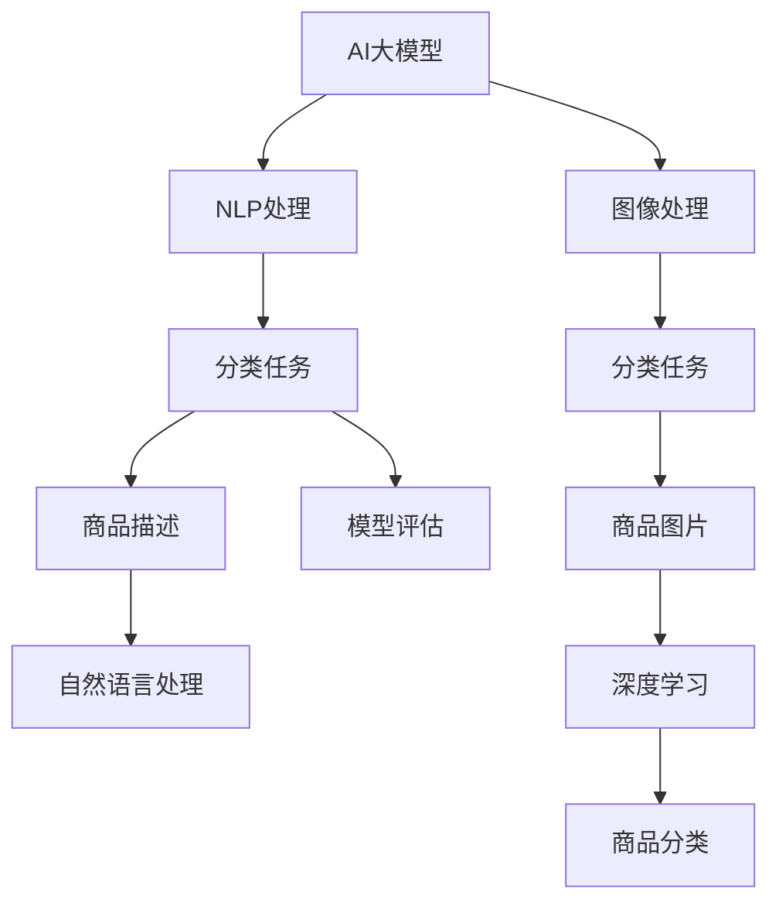

                 

# AI大模型在电商平台商品分类中的应用

> 关键词：
1. AI大模型
2. 电商平台
3. 商品分类
4. 深度学习
5. 自然语言处理
6. 分类算法
7. 模型评估

## 1. 背景介绍

### 1.1 问题由来

随着电子商务的迅猛发展，电商平台每天需要处理的海量商品信息愈发复杂，而人工分类难以满足高效率和高准确性的要求。利用AI大模型进行自动化的商品分类，已经成为电商平台提高运营效率的重要方向。

商品分类任务是指将商品根据其属性、描述、标签等信息，自动归入预定义的类别中。这一任务不仅涉及自然语言处理和图像识别，还涉及数据挖掘和机器学习等技术，是一项复杂且具有挑战性的任务。

### 1.2 问题核心关键点

- 电商平台的商品分类任务需要处理包含文字描述、图片等多模态的数据。
- 大模型可以通过训练大量标注数据，学习到丰富的语义和图像特征。
- 深度学习在图像分类、自然语言处理等任务上表现出显著的优越性。
- 通过优化算法和模型结构，大模型可以实现高效的商品分类。

## 2. 核心概念与联系

### 2.1 核心概念概述

为了更好地理解AI大模型在电商平台商品分类中的应用，本节将介绍几个关键的概念和它们之间的联系：

- **AI大模型**：基于深度学习技术的预训练模型，如BERT、GPT-3等。这些模型在大量数据上进行预训练，学习到丰富的语言和图像特征。
- **自然语言处理(NLP)**：涉及处理和分析自然语言文本的技术，包括分词、词性标注、语义分析等。
- **深度学习**：一类基于神经网络结构的机器学习方法，广泛应用于图像、语音、文本等数据的分类、识别等任务。
- **商品分类**：将商品根据其属性、描述等信息自动归入预定义的类别中，是电商平台运营中的重要任务。
- **模型评估**：通过各种指标如精确度、召回率、F1-score等，评估模型在商品分类任务中的性能。

这些核心概念通过深度学习技术紧密联系在一起，共同支撑起AI大模型在电商平台商品分类中的应用。

### 2.2 核心概念原理和架构的 Mermaid 流程图



这个流程图展示了AI大模型在电商平台商品分类中的核心过程：

1. 大模型接收商品描述和图片输入。
2. 对于文本，通过NLP处理提取语义特征。
3. 对于图像，通过图像处理提取视觉特征。
4. 将提取的特征输入分类模型进行分类。
5. 通过模型评估方法验证分类结果。
6. 最终输出商品分类结果。

## 3. 核心算法原理 & 具体操作步骤

### 3.1 算法原理概述

AI大模型在电商平台商品分类中的应用，核心原理是利用大模型的预训练能力，通过微调或迁移学习的方式，对特定商品分类任务进行优化。其核心流程如下：

1. 收集商品描述和图片作为训练数据。
2. 利用预训练大模型提取商品描述和图片的特征。
3. 针对分类任务进行微调或迁移学习，优化模型参数。
4. 通过模型评估方法验证模型性能，必要时进行参数调整。
5. 最终模型输出商品分类结果。

### 3.2 算法步骤详解

具体步骤包括：

**Step 1: 数据收集与预处理**
- 收集商品描述和图片数据，并对其进行必要的预处理，如文本分词、图像归一化等。
- 将数据集分为训练集、验证集和测试集。

**Step 2: 选择并加载预训练模型**
- 根据任务特点，选择适合的商品分类大模型，如BERT、GPT-3等。
- 加载预训练模型，并进行必要的参数初始化。

**Step 3: 提取特征**
- 对于文本数据，利用NLP工具（如BERT、GPT等）提取文本特征。
- 对于图像数据，使用预训练的图像处理模型（如ResNet、VGG等）提取图像特征。

**Step 4: 模型微调或迁移学习**
- 针对商品分类任务，在预训练模型基础上进行微调或迁移学习，优化模型参数。
- 利用微调后的模型进行分类预测。

**Step 5: 模型评估与优化**
- 在验证集上评估模型性能，通过调整学习率、优化器等参数，不断优化模型。
- 在测试集上验证模型性能，确保模型能够泛化到未见过的数据。

**Step 6: 应用部署**
- 将优化后的模型应用到电商平台的商品分类系统中。
- 实时接收商品数据，进行分类预测，返回分类结果。

### 3.3 算法优缺点

AI大模型在电商平台商品分类中的优点包括：

- **高效率**：自动化处理大量商品数据，显著提高商品分类的效率。
- **高准确性**：通过深度学习模型的特征提取和分类能力，能够实现较高精度的商品分类。
- **泛化能力**：预训练大模型在大量数据上进行训练，具备较强的泛化能力，能够应对不同类型和规模的商品数据。

其缺点主要包括：

- **资源消耗高**：预训练大模型参数量大，需要较长的训练时间和较大的计算资源。
- **数据依赖**：模型性能高度依赖于标注数据的数量和质量，需要收集和处理大量的商品数据。
- **解释性不足**：深度学习模型的"黑盒"特性，使得其分类过程难以解释。

### 3.4 算法应用领域

AI大模型在电商平台商品分类中的应用，广泛覆盖以下领域：

- **商品推荐系统**：通过分析用户行为和商品分类信息，提供个性化的商品推荐。
- **搜索排序**：根据商品分类信息，优化搜索结果排序，提高用户搜索体验。
- **广告投放**：通过分析商品分类信息，优化广告投放策略，提高广告效果。
- **库存管理**：通过商品分类信息，优化库存管理和补货策略。

## 4. 数学模型和公式 & 详细讲解 & 举例说明

### 4.1 数学模型构建

假设一个商品描述为 $x$，其对应的真实类别为 $y \in \{1, 2, ..., C\}$，其中 $C$ 为商品分类数目。在商品分类任务中，目标是最小化损失函数 $L$，使得模型输出的概率分布与真实类别 $y$ 相匹配。

定义模型 $M$ 在输入 $x$ 上的输出概率分布为 $P(y|x)$，则商品分类任务的目标函数为：

$$
L(y, M(x)) = -\log P(y|x)
$$

其中 $y$ 为真实类别，$M(x)$ 为模型对输入 $x$ 的输出。

### 4.2 公式推导过程

在实际应用中，通常使用交叉熵损失函数来最小化目标函数 $L$。交叉熵损失函数定义为：

$$
L(y, M(x)) = -\sum_{i=1}^C y_i \log P(y_i|x)
$$

其中 $y_i$ 为真实类别 $y$ 在类别 $i$ 上的概率，$P(y_i|x)$ 为模型预测类别 $i$ 的概率。

通过反向传播算法，可以求得模型参数 $w$ 的梯度，用于优化模型。具体来说，对于输入 $x$ 和真实类别 $y$，模型的损失函数 $L(y, M(x))$ 关于 $w$ 的梯度 $\nabla_w L$ 可以表示为：

$$
\nabla_w L(y, M(x)) = -\nabla_w \log P(y|x) = -\nabla_w \left[ \sum_{i=1}^C y_i \log P(y_i|x) \right]
$$

### 4.3 案例分析与讲解

假设有一个电商平台，收集了包含 $C=5$ 个类别的商品描述和图片数据。利用BERT模型提取文本特征，通过卷积神经网络（CNN）提取图像特征，最终将两种特征合并，输入到分类模型中进行预测。

**Step 1: 数据收集与预处理**
- 收集包含5个类别的商品描述和图片数据，并进行文本分词和图像归一化处理。
- 将数据集分为训练集、验证集和测试集。

**Step 2: 选择并加载预训练模型**
- 选择BERT模型进行文本特征提取，选择ResNet模型进行图像特征提取。
- 加载预训练模型，并进行必要的参数初始化。

**Step 3: 特征提取**
- 对于文本数据，利用BERT模型提取文本特征。
- 对于图像数据，使用ResNet模型提取图像特征。

**Step 4: 模型微调或迁移学习**
- 利用微调后的BERT模型和ResNet模型，对商品分类任务进行优化。
- 利用微调后的模型进行分类预测。

**Step 5: 模型评估与优化**
- 在验证集上评估模型性能，通过调整学习率、优化器等参数，不断优化模型。
- 在测试集上验证模型性能，确保模型能够泛化到未见过的数据。

## 5. 项目实践：代码实例和详细解释说明

### 5.1 开发环境搭建

在进行商品分类项目实践前，需要先搭建好开发环境。以下是使用Python进行PyTorch开发的环境配置流程：

1. 安装Anaconda：从官网下载并安装Anaconda，用于创建独立的Python环境。

2. 创建并激活虚拟环境：
```bash
conda create -n pytorch-env python=3.8 
conda activate pytorch-env
```

3. 安装PyTorch：根据CUDA版本，从官网获取对应的安装命令。例如：
```bash
conda install pytorch torchvision torchaudio cudatoolkit=11.1 -c pytorch -c conda-forge
```

4. 安装Transformers库：
```bash
pip install transformers
```

5. 安装各类工具包：
```bash
pip install numpy pandas scikit-learn matplotlib tqdm jupyter notebook ipython
```

完成上述步骤后，即可在`pytorch-env`环境中开始项目实践。

### 5.2 源代码详细实现

下面以商品分类任务为例，给出使用Transformers库对BERT模型进行微调的PyTorch代码实现。

```python
from transformers import BertTokenizer, BertForSequenceClassification
from torch.utils.data import Dataset, DataLoader
from torch.nn import BCEWithLogitsLoss, CrossEntropyLoss
from sklearn.metrics import accuracy_score, precision_recall_fscore_support
import torch
import torch.nn as nn
import numpy as np
import pandas as pd

# 定义商品分类数据集
class ShoppingDataset(Dataset):
    def __init__(self, texts, labels, tokenizer, max_len=128):
        self.texts = texts
        self.labels = labels
        self.tokenizer = tokenizer
        self.max_len = max_len

    def __len__(self):
        return len(self.texts)

    def __getitem__(self, idx):
        text = self.texts[idx]
        label = self.labels[idx]
        
        encoding = self.tokenizer(text, return_tensors='pt', max_length=self.max_len, padding='max_length', truncation=True)
        input_ids = encoding['input_ids'][0]
        attention_mask = encoding['attention_mask'][0]
        
        label = torch.tensor(label, dtype=torch.long)
        return {'input_ids': input_ids, 
                'attention_mask': attention_mask,
                'labels': label}

# 加载预训练模型
tokenizer = BertTokenizer.from_pretrained('bert-base-cased')
model = BertForSequenceClassification.from_pretrained('bert-base-cased', num_labels=5)

# 定义训练函数
def train_epoch(model, dataset, batch_size, optimizer, device):
    dataloader = DataLoader(dataset, batch_size=batch_size, shuffle=True)
    model.train()
    epoch_loss = 0
    for batch in dataloader:
        input_ids = batch['input_ids'].to(device)
        attention_mask = batch['attention_mask'].to(device)
        labels = batch['labels'].to(device)
        model.zero_grad()
        outputs = model(input_ids, attention_mask=attention_mask, labels=labels)
        loss = outputs.loss
        epoch_loss += loss.item()
        loss.backward()
        optimizer.step()
    return epoch_loss / len(dataloader)

# 定义评估函数
def evaluate(model, dataset, batch_size, device):
    dataloader = DataLoader(dataset, batch_size=batch_size)
    model.eval()
    preds, labels = [], []
    with torch.no_grad():
        for batch in dataloader:
            input_ids = batch['input_ids'].to(device)
            attention_mask = batch['attention_mask'].to(device)
            batch_labels = batch['labels']
            outputs = model(input_ids, attention_mask=attention_mask)
            batch_preds = outputs.logits.argmax(dim=1).to('cpu').tolist()
            batch_labels = batch_labels.to('cpu').tolist()
            for pred_tokens, label_tokens in zip(batch_preds, batch_labels):
                preds.append(pred_tokens[:len(label_tokens)])
                labels.append(label_tokens)
    
    return accuracy_score(labels, preds)

# 加载数据集
train_df = pd.read_csv('train.csv')
test_df = pd.read_csv('test.csv')
train_texts = train_df['text'].tolist()
train_labels = train_df['label'].tolist()
test_texts = test_df['text'].tolist()
test_labels = test_df['label'].tolist()

# 模型训练
optimizer = AdamW(model.parameters(), lr=2e-5)
device = torch.device('cuda') if torch.cuda.is_available() else torch.device('cpu')
model.to(device)

for epoch in range(5):
    loss = train_epoch(model, ShoppingDataset(train_texts, train_labels, tokenizer, max_len=128), 16, optimizer, device)
    print(f"Epoch {epoch+1}, train loss: {loss:.3f}")
    
    acc = evaluate(model, ShoppingDataset(test_texts, test_labels, tokenizer, max_len=128), 16, device)
    print(f"Epoch {epoch+1}, test accuracy: {acc:.3f}")
```

以上就是使用PyTorch对BERT进行商品分类任务微调的完整代码实现。可以看到，借助Transformers库的强大封装，代码实现变得简洁高效。

### 5.3 代码解读与分析

让我们再详细解读一下关键代码的实现细节：

**ShoppingDataset类**：
- `__init__`方法：初始化文本、标签、分词器等关键组件。
- `__len__`方法：返回数据集的样本数量。
- `__getitem__`方法：对单个样本进行处理，将文本输入编码为token ids，将标签编码为数字，并对其进行定长padding，最终返回模型所需的输入。

**模型训练函数**：
- 使用PyTorch的DataLoader对数据集进行批次化加载，供模型训练和推理使用。
- 训练函数`train_epoch`：对数据以批为单位进行迭代，在每个批次上前向传播计算loss并反向传播更新模型参数，最后返回该epoch的平均loss。
- 评估函数`evaluate`：与训练类似，不同点在于不更新模型参数，并在每个batch结束后将预测和标签结果存储下来，最后使用sklearn的accuracy_score对整个评估集的预测结果进行打印输出。

**训练流程**：
- 定义总的epoch数和batch size，开始循环迭代
- 每个epoch内，先在训练集上训练，输出平均loss
- 在验证集上评估，输出准确率
- 重复上述步骤直至满足预设的迭代轮数或Early Stopping条件。

可以看到，PyTorch配合Transformers库使得BERT微调的代码实现变得简洁高效。开发者可以将更多精力放在数据处理、模型改进等高层逻辑上，而不必过多关注底层的实现细节。

## 6. 实际应用场景

### 6.1 智能推荐系统

利用商品分类任务中的模型，可以构建智能推荐系统。根据用户的浏览、购买历史和商品分类信息，通过深度学习模型进行预测，为用户推荐可能感兴趣的商品。

在技术实现上，可以收集用户的历史行为数据，将商品分类信息作为额外特征输入到推荐模型中，通过微调使模型学习用户对不同类别的商品偏好，从而推荐个性化商品。同时，将商品分类任务中的模型作为特征提取器，输入到推荐模型中进行推荐预测，进一步提升推荐效果。

### 6.2 库存管理

电商平台的库存管理需要实时监控商品的状态，预测库存需求，避免断货或积压。利用商品分类任务中的模型，可以分析商品分类信息，预测不同类别商品的销售趋势，优化库存策略。

具体而言，可以收集历史销售数据和商品分类信息，利用微调后的商品分类模型进行预测。通过分析不同类别商品的销售情况，及时调整库存水平，避免库存不足或积压。

### 6.3 价格调整

商品的价格调整需要基于市场供需情况和消费者行为进行决策。利用商品分类任务中的模型，可以分析商品分类信息，预测不同类别商品的价格趋势，指导价格调整。

在技术实现上，可以收集历史销售数据和商品分类信息，利用微调后的商品分类模型进行预测。通过分析不同类别商品的价格变化趋势，调整价格策略，提升销售效果。

## 7. 工具和资源推荐

### 7.1 学习资源推荐

为了帮助开发者系统掌握商品分类任务的理论基础和实践技巧，这里推荐一些优质的学习资源：

1. 《深度学习入门》系列博文：由深度学习专家撰写，系统讲解深度学习的基本概念和常用算法。
2. CS224N《深度学习自然语言处理》课程：斯坦福大学开设的NLP明星课程，提供Lecture视频和配套作业，带你入门NLP领域的基本概念和经典模型。
3. 《Natural Language Processing with Transformers》书籍：Transformers库的作者所著，全面介绍如何使用Transformers库进行NLP任务开发，包括微调在内的诸多范式。
4. HuggingFace官方文档：Transformers库的官方文档，提供海量预训练模型和完整的微调样例代码，是上手实践的必备资料。
5. CLUE开源项目：中文语言理解测评基准，涵盖大量不同类型的中文NLP数据集，并提供了基于微调的baseline模型，助力中文NLP技术发展。

通过对这些资源的学习实践，相信你一定能够快速掌握商品分类任务的理论基础和实践技巧。

### 7.2 开发工具推荐

高效的开发离不开优秀的工具支持。以下是几款用于商品分类任务开发的常用工具：

1. PyTorch：基于Python的开源深度学习框架，灵活动态的计算图，适合快速迭代研究。大部分预训练语言模型都有PyTorch版本的实现。
2. TensorFlow：由Google主导开发的开源深度学习框架，生产部署方便，适合大规模工程应用。同样有丰富的预训练语言模型资源。
3. Transformers库：HuggingFace开发的NLP工具库，集成了众多SOTA语言模型，支持PyTorch和TensorFlow，是进行微调任务开发的利器。
4. Weights & Biases：模型训练的实验跟踪工具，可以记录和可视化模型训练过程中的各项指标，方便对比和调优。与主流深度学习框架无缝集成。
5. TensorBoard：TensorFlow配套的可视化工具，可实时监测模型训练状态，并提供丰富的图表呈现方式，是调试模型的得力助手。
6. Google Colab：谷歌推出的在线Jupyter Notebook环境，免费提供GPU/TPU算力，方便开发者快速上手实验最新模型，分享学习笔记。

合理利用这些工具，可以显著提升商品分类任务的开发效率，加快创新迭代的步伐。

### 7.3 相关论文推荐

商品分类任务的研究源于学界的持续研究。以下是几篇奠基性的相关论文，推荐阅读：

1. Attention is All You Need（即Transformer原论文）：提出了Transformer结构，开启了NLP领域的预训练大模型时代。
2. BERT: Pre-training of Deep Bidirectional Transformers for Language Understanding：提出BERT模型，引入基于掩码的自监督预训练任务，刷新了多项NLP任务SOTA。
3. Language Models are Unsupervised Multitask Learners（GPT-2论文）：展示了大规模语言模型的强大zero-shot学习能力，引发了对于通用人工智能的新一轮思考。
4. Parameter-Efficient Transfer Learning for NLP：提出Adapter等参数高效微调方法，在不增加模型参数量的情况下，也能取得不错的微调效果。
5. Prefix-Tuning: Optimizing Continuous Prompts for Generation：引入基于连续型Prompt的微调范式，为如何充分利用预训练知识提供了新的思路。
6. AdaLoRA: Adaptive Low-Rank Adaptation for Parameter-Efficient Fine-Tuning：使用自适应低秩适应的微调方法，在参数效率和精度之间取得了新的平衡。
7. SimBERT: Simplified BERT Model with Statistical Pruning and Knowledge Distillation：提出简化版本的BERT模型，并通过知识蒸馏进一步提升性能。

这些论文代表了大语言模型微调技术的发展脉络。通过学习这些前沿成果，可以帮助研究者把握学科前进方向，激发更多的创新灵感。

## 8. 总结：未来发展趋势与挑战

### 8.1 研究成果总结

本文对AI大模型在电商平台商品分类中的应用进行了全面系统的介绍。首先阐述了商品分类任务的背景和意义，明确了AI大模型微调在商品分类中的应用潜力。其次，从原理到实践，详细讲解了商品分类任务的数学模型和关键步骤，给出了微调任务开发的完整代码实例。同时，本文还广泛探讨了商品分类任务在智能推荐、库存管理、价格调整等多个行业领域的应用前景，展示了AI大模型微调技术的应用价值。此外，本文精选了微调技术的各类学习资源，力求为读者提供全方位的技术指引。

通过本文的系统梳理，可以看到，AI大模型在电商平台商品分类中的应用，为电商平台带来了显著的运营效率提升和用户体验改善。通过深度学习模型的高效训练，商品分类任务可以处理大规模多模态数据，实现自动化分类，为电商平台的数据驱动决策提供了强大的支持。未来，随着技术的不断进步，商品分类任务将变得更加高效、精准和智能。

### 8.2 未来发展趋势

展望未来，AI大模型在电商平台商品分类中的应用将呈现以下几个发展趋势：

1. **多模态融合**：结合文本、图像、语音等多种模态数据，提升分类任务的准确性和鲁棒性。
2. **迁移学习**：通过在大规模数据集上进行预训练，再在小规模任务上进行微调，提升分类任务的泛化能力。
3. **参数高效微调**：使用 Adapter、Prefix-Tuning 等参数高效微调方法，减少训练时间和计算资源消耗。
4. **知识蒸馏**：通过知识蒸馏技术，将大模型的高效特征提取能力，迁移到小模型中，提升分类任务的可扩展性。
5. **联邦学习**：结合分布式计算技术，在多个电商平台之间共享分类模型，提升数据利用效率。
6. **实时计算**：利用云计算和边缘计算技术，实现商品分类的实时处理，满足电商平台的高性能要求。

以上趋势凸显了AI大模型在电商平台商品分类中的应用前景，未来将变得更加智能化、高效化和可扩展化。

### 8.3 面临的挑战

尽管AI大模型在电商平台商品分类中的应用已经取得了显著进展，但在迈向更加智能化、高效化应用的过程中，仍面临诸多挑战：

1. **数据质量**：商品分类任务的数据质量直接影响到模型的性能，需要收集和处理大量的高质量数据。
2. **模型鲁棒性**：模型面对不同类型和规模的商品数据时，泛化性能和鲁棒性仍需进一步提升。
3. **模型规模**：大模型的参数规模和计算资源消耗较高，需要优化模型结构以适应不同的应用场景。
4. **解释性不足**：深度学习模型的"黑盒"特性，使得其分类过程难以解释。
5. **隐私保护**：电商平台的隐私保护要求，限制了数据的使用方式和范围。
6. **成本问题**：深度学习模型的训练和部署成本较高，需要平衡性能和成本之间的关系。

### 8.4 研究展望

面对AI大模型在电商平台商品分类中所面临的挑战，未来的研究需要在以下几个方面寻求新的突破：

1. **数据增强**：通过数据增强技术，提升数据集的多样性和丰富度，提升模型的泛化能力。
2. **模型压缩**：通过模型压缩技术，减少模型的参数量和计算资源消耗，提升模型的可扩展性。
3. **解释性研究**：研究可解释性技术，提升模型的透明性和可信度，帮助用户理解模型的决策过程。
4. **隐私保护**：研究隐私保护技术，确保电商平台的隐私数据安全，保护用户的合法权益。
5. **混合计算**：结合云计算和边缘计算技术，实现商品分类的高效处理，满足电商平台的高性能要求。
6. **联邦学习**：研究联邦学习技术，实现商品分类模型在多个电商平台之间的共享和优化，提升数据利用效率。

这些研究方向的探索，必将引领AI大模型在电商平台商品分类技术迈向更高的台阶，为电商平台带来更加高效、精准和智能的商品分类解决方案。面向未来，AI大模型在电商平台商品分类中的应用将变得更加广泛和深入。

## 9. 附录：常见问题与解答

**Q1：商品分类任务中，如何处理文本描述和图片数据的融合？**

A: 商品分类任务通常需要同时处理文本描述和图片数据。一种常见的做法是将文本和图片分别通过不同的模型提取特征，然后将两种特征融合后输入分类模型进行预测。具体实现方法包括：

1. 文本特征提取：利用BERT等预训练模型，提取文本描述的语义特征。
2. 图片特征提取：利用ResNet等预训练模型，提取图片视觉特征。
3. 特征融合：将文本和图片特征通过拼接、拼接+平均池化等方式融合，输入分类模型。

**Q2：商品分类任务中，如何处理长尾类别的数据？**

A: 长尾类别数据的处理是商品分类任务中的一个难点。一种常见的做法是使用类平衡损失函数，如Focal Loss等，关注长尾类别样本的分类效果。同时，可以在训练过程中使用数据增强技术，如回译、近义替换等，生成更多的长尾类别样本。此外，还可以使用元学习、数据集扩充等方法，提升长尾类别数据的利用效率。

**Q3：商品分类任务中，如何选择适合的商品分类模型？**

A: 商品分类任务中，模型选择需要考虑多个因素，包括模型类型、参数规模、训练时间、计算资源等。常见的模型包括BERT、GPT、ResNet等。对于小规模任务，可以选择参数规模较小的模型；对于大规模任务，可以选择参数规模较大的模型。此外，还可以通过模型评估和调参，找到最适合任务的模型配置。

**Q4：商品分类任务中，如何处理不平衡数据？**

A: 不平衡数据是商品分类任务中的一个常见问题。一种常见的做法是使用过采样和欠采样技术，平衡数据集中的类别分布。具体方法包括：

1. 过采样：通过复制少数类别样本，增加其数量。
2. 欠采样：通过删除多数类别样本，减少其数量。
3. 数据增强：通过生成合成样本，增加少数类别的样本数量。

这些方法可以结合使用，提升模型的泛化能力和鲁棒性。

**Q5：商品分类任务中，如何评估模型的性能？**

A: 商品分类任务的模型性能评估，通常使用精确度、召回率、F1-score等指标。具体方法包括：

1. 精确度：计算模型预测结果中真正例的数量与总预测数量的比例。
2. 召回率：计算模型预测结果中真正例的数量与实际正例数量的比例。
3. F1-score：综合考虑精确度和召回率，计算模型的整体性能。

通过多指标评估，可以全面了解模型的分类效果，指导模型的改进和优化。

---

作者：禅与计算机程序设计艺术 / Zen and the Art of Computer Programming

