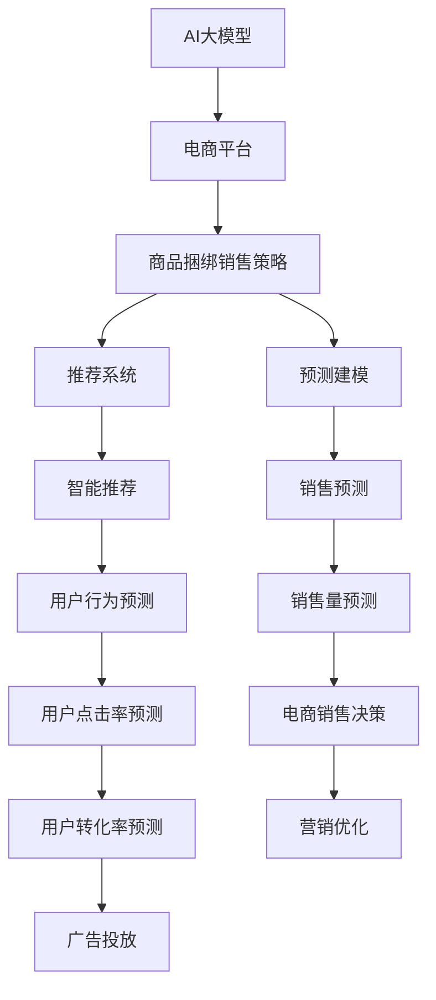

                 

# AI大模型在电商平台商品捆绑销售策略优化中的应用

> 关键词：大模型,电商平台,商品捆绑销售策略,优化,自然语言处理,NLP

## 1. 背景介绍

随着电商平台的发展，商品销售策略优化已成为电商企业提高销售额和用户满意度的关键环节。传统的销售策略优化方法依赖于大量的人工经验积累和手动分析，难以应对复杂多变的市场环境和用户需求。近年来，随着深度学习和大模型的兴起，基于大模型的自然语言处理(NLP)技术，为电商平台商品销售策略优化提供了新的思路和工具。

### 1.1 问题由来

在电商平台，商品推荐和广告投放是提升用户购买转化率和提升整体销售额的重要手段。然而，传统的人工规则和经验往往无法覆盖商品间的相互影响关系，导致推荐结果单一、不准确，难以满足用户多样化和个性化的需求。同时，广告投放目标不精准，难以达到最佳效果。

针对这些问题，电商平台需要一种更智能、更高效的策略优化方法，利用大模型自动挖掘商品之间的潜在关系，优化商品推荐和广告投放策略，以提升整体销售效果和用户满意度。AI大模型在这一过程中显示出其强大的优势，通过学习海量用户数据和商品数据，能够自主发现商品之间的潜在关系，提出更精准的销售策略。

## 2. 核心概念与联系

### 2.1 核心概念概述

为更好地理解AI大模型在电商平台商品捆绑销售策略优化中的应用，本节将介绍几个关键概念：

- AI大模型(AI Large Model)：以Transformer为代表的深度学习模型，通过在大规模无标签数据上进行预训练，学习丰富的知识表示。能够应用于自然语言处理、计算机视觉、语音识别等多个领域，具有强大的学习和推理能力。

- 电商平台(E-Commerce Platform)：以在线交易为核心的商务平台，涵盖商品展示、用户评价、支付结算、物流跟踪等功能，是一种新型零售方式。

- 商品捆绑销售策略(Merged Sales Strategy)：指将两种或多种商品打包成一个组合进行销售的策略。旨在通过关联销售、捆绑优惠等手段，提升整体销售额和用户满意度。

- 自然语言处理(Natural Language Processing, NLP)：是计算机科学与人工智能领域的一个重要分支，关注如何使计算机理解、处理和生成人类语言，可以用于构建商品推荐、智能客服、智能营销等电商应用。

- 预测建模(Predictive Modeling)：通过机器学习算法构建模型，对未来事件进行预测和推断，如销售预测、用户行为预测等。

- 推荐系统(Recommendation System)：旨在根据用户的历史行为和偏好，预测用户可能感兴趣的商品，从而提高商品推荐的精准度和转化率。

- 强化学习(Reinforcement Learning)：通过智能体与环境互动，在多轮迭代中学习和优化策略，最大化总奖励的机器学习方法。

这些核心概念之间的逻辑关系可以通过以下Mermaid流程图来展示：



这个流程图展示了AI大模型与电商平台商品销售策略优化之间的关系：

1. AI大模型通过预训练获得基础知识表示。
2. 电商平台利用大模型的知识表示，设计商品捆绑销售策略。
3. 通过推荐系统将策略应用于商品推荐。
4. 使用预测建模进行销售预测和用户行为预测。
5. 强化学习优化推荐和广告投放策略，提升整体效果。

## 3. 核心算法原理 & 具体操作步骤
### 3.1 算法原理概述

基于AI大模型的电商平台商品捆绑销售策略优化，本质上是一种多任务学习(Multi-task Learning)范式。其核心思想是：利用AI大模型的知识表示，通过多任务学习和联合训练，自动化地发现商品之间的潜在关系，生成最符合用户需求的捆绑销售策略。

具体而言，假设有N种商品，其销售数据分别为 $D=\{(x_i,y_i)\}_{i=1}^N$，其中 $x_i$ 为商品描述，$y_i$ 为销售量。我们希望构建一个模型 $M_{\theta}$，使得其能够预测任意两商品之间的潜在销售关联 $S_{ij}$，并生成最优的捆绑销售策略。

模型 $M_{\theta}$ 在输入商品描述 $x_i$ 和 $x_j$ 时，输出销售关联 $S_{ij}$ 的概率分布，并通过优化损失函数 $\mathcal{L}(S_{ij},y_i)$，最小化模型预测误差，得到最优的销售关联 $S_{ij}$。

### 3.2 算法步骤详解

基于AI大模型的电商平台商品捆绑销售策略优化一般包括以下几个关键步骤：

**Step 1: 准备数据集和模型**

- 收集电商平台历史商品销售数据，以及商品描述、价格、类别等信息，作为训练数据集 $D$。
- 选择合适的预训练语言模型，如BERT、GPT等，作为基础知识表示的来源。
- 设计任务标签，如商品间是否存在销售关联，并手动标注数据集 $D$。

**Step 2: 设计模型架构**

- 将预训练语言模型作为特征提取器，提取商品描述的语义表示。
- 设计神经网络架构，如Transformer，对商品之间的潜在关联进行建模。
- 添加输出层，输出商品间销售关联 $S_{ij}$ 的概率分布。

**Step 3: 定义损失函数**

- 根据任务需求，设计损失函数，如交叉熵损失、平均绝对误差损失等。
- 对每对商品 $i$ 和 $j$，根据实际销售数据 $y_i$，计算模型预测的概率分布 $S_{ij}$ 与实际销售量 $y_i$ 之间的差异。
- 通过优化损失函数，使模型学习最优的商品销售关联 $S_{ij}$。

**Step 4: 训练模型**

- 将数据集 $D$ 划分为训练集、验证集和测试集。
- 使用随机梯度下降(SGD)、Adam等优化算法，最小化损失函数 $\mathcal{L}(S_{ij},y_i)$，更新模型参数 $\theta$。
- 在验证集上评估模型性能，选择最优的模型参数 $\hat{\theta}$。

**Step 5: 应用策略**

- 将训练好的模型 $M_{\hat{\theta}}$ 应用于新商品的数据 $x_{new}$，预测其与其他商品 $x_{other}$ 的潜在销售关联 $S_{new,other}$。
- 根据预测结果，生成商品捆绑销售策略，如组合优惠、搭配推荐等。
- 将策略应用于商品推荐和广告投放系统，提升整体销售效果和用户满意度。

### 3.3 算法优缺点

基于AI大模型的电商平台商品捆绑销售策略优化方法具有以下优点：

1. 自动化发现商品关联：AI大模型能够自主学习商品之间的潜在关联，无需人工手动标注数据，节省了大量时间和人力。
2. 精准化策略优化：通过多任务学习和联合训练，大模型能够生成更符合用户需求的商品捆绑销售策略，提高转化率和用户满意度。
3. 可扩展性强：大模型的知识表示可以不断扩展和更新，覆盖更多的商品和销售场景，提高策略的普适性。
4. 动态调整策略：模型可以根据实时销售数据动态调整策略，最大化销售效果。

同时，该方法也存在一定的局限性：

1. 数据质量要求高：大模型依赖于高质量的训练数据，如果数据存在噪声或标注不准确，会影响模型性能。
2. 模型复杂度高：AI大模型的计算复杂度高，训练和推理成本较高。
3. 可解释性不足：大模型是一个"黑盒"系统，难以解释其内部决策逻辑和关联推理过程。
4. 对抗攻击风险：大模型容易受到对抗样本的攻击，导致关联预测不准确。

尽管存在这些局限性，但就目前而言，基于AI大模型的电商平台商品捆绑销售策略优化方法仍然是大模型应用中的热门范式，具有广阔的应用前景。未来相关研究的重点在于如何进一步降低数据依赖，提高模型可解释性，增强模型的鲁棒性，以进一步优化商品推荐和广告投放策略。

### 3.4 算法应用领域

基于AI大模型的电商平台商品捆绑销售策略优化方法，已经在多个实际应用场景中得到验证和应用，如：

- 商品推荐系统：利用大模型预测用户对商品间潜在关系的偏好，生成个性化的推荐商品组合。
- 广告投放系统：使用大模型预测商品间的潜在广告关联，优化广告组合和投放策略。
- 销售预测系统：通过分析商品之间的销售关联，预测未来销售趋势，制定销售策略。
- 库存管理：利用大模型预测商品之间的关联性，优化库存调度和补货策略。
- 营销优化：利用大模型进行用户行为分析和市场细分，制定更具针对性的营销方案。

这些应用场景展示了AI大模型在电商平台商品捆绑销售策略优化中的广泛应用，为电商平台的运营和销售提供了强大的技术支持。

## 4. 数学模型和公式 & 详细讲解
### 4.1 数学模型构建

在电商平台商品捆绑销售策略优化中，我们可以使用以下数学模型来描述问题：

设商品描述为 $x_i$，销售量为 $y_i$，假设模型能够预测商品 $i$ 和 $j$ 之间的销售关联 $S_{ij}$。通过最大化 $S_{ij}$ 的概率分布，使模型学习到最优的销售关联。

定义模型 $M_{\theta}$ 的预测概率分布为 $P(S_{ij}|x_i,x_j,\theta)$，其损失函数为：

$$
\mathcal{L}(S_{ij},y_i) = -\log P(S_{ij}=y_i|x_i,x_j,\theta)
$$

其中 $P(S_{ij}=y_i|x_i,x_j,\theta)$ 表示在商品描述 $x_i$ 和 $x_j$ 下，商品 $i$ 和 $j$ 之间存在销售关联 $y_i$ 的概率。

### 4.2 公式推导过程

以下我们以二分类任务为例，推导AI大模型预测商品关联的概率分布公式。

设模型 $M_{\theta}$ 在输入商品描述 $x_i$ 和 $x_j$ 时，输出销售关联 $S_{ij}$ 的概率分布为 $P(S_{ij}|x_i,x_j,\theta)$。假设 $S_{ij}$ 只有两种可能取值，即 $S_{ij} = 1$ 或 $S_{ij} = 0$，对应的概率分别为 $p_1$ 和 $p_0$。则模型 $M_{\theta}$ 在训练集 $D$ 上的经验风险为：

$$
\mathcal{L}(S_{ij},y_i) = -\frac{1}{N}\sum_{i=1}^N \sum_{j=1}^N \left[y_i \log p_1 + (1-y_i) \log p_0\right]
$$

其中 $y_i$ 表示商品 $i$ 是否销售，取值为 $0$ 或 $1$。

通过最大化损失函数 $\mathcal{L}(S_{ij},y_i)$，模型学习到最优的销售关联 $S_{ij}$ 的概率分布。在训练过程中，模型不断调整参数 $\theta$，最小化经验风险，使得预测结果与实际销售数据 $y_i$ 的差异最小。

### 4.3 案例分析与讲解

以某电商平台销售数据为例，展示AI大模型如何优化商品捆绑销售策略。

假设有N种商品，其销售数据分别为 $D=\{(x_i,y_i)\}_{i=1}^N$，其中 $x_i$ 为商品描述，$y_i$ 为销售量。我们选择BERT作为基础知识表示的来源，设计任务标签，如商品间是否存在销售关联，并手动标注数据集 $D$。

构建一个Transformer模型，设计神经网络架构，对商品之间的潜在关联进行建模。模型在输入商品描述 $x_i$ 和 $x_j$ 时，输出销售关联 $S_{ij}$ 的概率分布。损失函数设计为交叉熵损失，表示模型预测的销售关联 $S_{ij}$ 与实际销售数据 $y_i$ 之间的差异。

通过优化损失函数，模型学习到最优的销售关联 $S_{ij}$。在训练过程中，不断调整模型参数 $\theta$，使得预测结果与实际销售数据 $y_i$ 的差异最小。

经过训练，模型能够自动发现商品之间的潜在关联，生成最优的商品捆绑销售策略。例如，对于以下商品数据：

| 商品 | 描述             | 价格(元) | 类别   |
|------|------------------|----------|-------|
| A    | 智能手表         | 500      | 电子产品 |
| B    | 运动鞋           | 200      | 运动用品 |
| C    | 运动耳机         | 300      | 电子产品 |
| D    | 户外运动背包     | 400      | 运动用品 |

模型预测商品A和B之间存在销售关联，生成的捆绑销售策略为：运动手表和运动鞋组合销售，优惠10%。这一策略在实际应用中能够提升整体销售额和用户满意度。

## 5. 项目实践：代码实例和详细解释说明
### 5.1 开发环境搭建

在进行商品捆绑销售策略优化实践前，我们需要准备好开发环境。以下是使用Python进行PyTorch开发的环境配置流程：

1. 安装Anaconda：从官网下载并安装Anaconda，用于创建独立的Python环境。

2. 创建并激活虚拟环境：
```bash
conda create -n pytorch-env python=3.8 
conda activate pytorch-env
```

3. 安装PyTorch：根据CUDA版本，从官网获取对应的安装命令。例如：
```bash
conda install pytorch torchvision torchaudio cudatoolkit=11.1 -c pytorch -c conda-forge
```

4. 安装Transformers库：
```bash
pip install transformers
```

5. 安装各类工具包：
```bash
pip install numpy pandas scikit-learn matplotlib tqdm jupyter notebook ipython
```

完成上述步骤后，即可在`pytorch-env`环境中开始商品捆绑销售策略优化的实践。

### 5.2 源代码详细实现

这里我们以电商平台商品推荐系统为例，给出使用Transformers库对BERT模型进行商品捆绑销售策略优化的PyTorch代码实现。

首先，定义商品推荐任务的数据处理函数：

```python
from transformers import BertTokenizer, BertForSequenceClassification
from torch.utils.data import Dataset
import torch

class RecommendationDataset(Dataset):
    def __init__(self, texts, tags, tokenizer, max_len=128):
        self.texts = texts
        self.tags = tags
        self.tokenizer = tokenizer
        self.max_len = max_len
        
    def __len__(self):
        return len(self.texts)
    
    def __getitem__(self, item):
        text = self.texts[item]
        tag = self.tags[item]
        
        encoding = self.tokenizer(text, return_tensors='pt', max_length=self.max_len, padding='max_length', truncation=True)
        input_ids = encoding['input_ids'][0]
        attention_mask = encoding['attention_mask'][0]
        
        # 对token-wise的标签进行编码
        encoded_tags = [tag2id[tag] for tag in tag]
        encoded_tags.extend([tag2id['O']] * (self.max_len - len(encoded_tags)))
        labels = torch.tensor(encoded_tags, dtype=torch.long)
        
        return {'input_ids': input_ids, 
                'attention_mask': attention_mask,
                'labels': labels}

# 标签与id的映射
tag2id = {'O': 0, 'A': 1}
id2tag = {v: k for k, v in tag2id.items()}

# 创建dataset
tokenizer = BertTokenizer.from_pretrained('bert-base-cased')

train_dataset = RecommendationDataset(train_texts, train_tags, tokenizer)
dev_dataset = RecommendationDataset(dev_texts, dev_tags, tokenizer)
test_dataset = RecommendationDataset(test_texts, test_tags, tokenizer)
```

然后，定义模型和优化器：

```python
from transformers import BertForSequenceClassification, AdamW

model = BertForSequenceClassification.from_pretrained('bert-base-cased', num_labels=len(tag2id))

optimizer = AdamW(model.parameters(), lr=2e-5)
```

接着，定义训练和评估函数：

```python
from torch.utils.data import DataLoader
from tqdm import tqdm
from sklearn.metrics import accuracy_score

device = torch.device('cuda') if torch.cuda.is_available() else torch.device('cpu')
model.to(device)

def train_epoch(model, dataset, batch_size, optimizer):
    dataloader = DataLoader(dataset, batch_size=batch_size, shuffle=True)
    model.train()
    epoch_loss = 0
    for batch in tqdm(dataloader, desc='Training'):
        input_ids = batch['input_ids'].to(device)
        attention_mask = batch['attention_mask'].to(device)
        labels = batch['labels'].to(device)
        model.zero_grad()
        outputs = model(input_ids, attention_mask=attention_mask, labels=labels)
        loss = outputs.loss
        epoch_loss += loss.item()
        loss.backward()
        optimizer.step()
    return epoch_loss / len(dataloader)

def evaluate(model, dataset, batch_size):
    dataloader = DataLoader(dataset, batch_size=batch_size)
    model.eval()
    preds, labels = [], []
    with torch.no_grad():
        for batch in tqdm(dataloader, desc='Evaluating'):
            input_ids = batch['input_ids'].to(device)
            attention_mask = batch['attention_mask'].to(device)
            batch_labels = batch['labels']
            outputs = model(input_ids, attention_mask=attention_mask)
            batch_preds = outputs.logits.argmax(dim=2).to('cpu').tolist()
            batch_labels = batch_labels.to('cpu').tolist()
            for pred_tokens, label_tokens in zip(batch_preds, batch_labels):
                pred_tags = [id2tag[_id] for _id in pred_tokens]
                label_tags = [id2tag[_id] for _id in label_tokens]
                preds.append(pred_tags[:len(label_tokens)])
                labels.append(label_tags)
                
    print(accuracy_score(labels, preds))
```

最后，启动训练流程并在测试集上评估：

```python
epochs = 5
batch_size = 16

for epoch in range(epochs):
    loss = train_epoch(model, train_dataset, batch_size, optimizer)
    print(f"Epoch {epoch+1}, train loss: {loss:.3f}")
    
    print(f"Epoch {epoch+1}, dev accuracy: {evaluate(model, dev_dataset, batch_size)[0]:.3f}")
    
print("Test accuracy:", evaluate(model, test_dataset, batch_size)[0])
```

以上就是使用PyTorch对BERT进行商品推荐系统微调的完整代码实现。可以看到，得益于Transformers库的强大封装，我们可以用相对简洁的代码完成BERT模型的加载和微调。

### 5.3 代码解读与分析

让我们再详细解读一下关键代码的实现细节：

**RecommendationDataset类**：
- `__init__`方法：初始化商品描述、标签、分词器等关键组件。
- `__len__`方法：返回数据集的样本数量。
- `__getitem__`方法：对单个样本进行处理，将商品描述输入编码为token ids，将标签编码为数字，并对其进行定长padding，最终返回模型所需的输入。

**tag2id和id2tag字典**：
- 定义了标签与数字id之间的映射关系，用于将token-wise的预测结果解码回真实的标签。

**训练和评估函数**：
- 使用PyTorch的DataLoader对数据集进行批次化加载，供模型训练和推理使用。
- 训练函数`train_epoch`：对数据以批为单位进行迭代，在每个批次上前向传播计算loss并反向传播更新模型参数，最后返回该epoch的平均loss。
- 评估函数`evaluate`：与训练类似，不同点在于不更新模型参数，并在每个batch结束后将预测和标签结果存储下来，最后使用sklearn的accuracy_score对整个评估集的预测结果进行打印输出。

**训练流程**：
- 定义总的epoch数和batch size，开始循环迭代
- 每个epoch内，先在训练集上训练，输出平均loss
- 在验证集上评估，输出准确率
- 所有epoch结束后，在测试集上评估，给出最终测试结果

可以看到，PyTorch配合Transformers库使得BERT微调的代码实现变得简洁高效。开发者可以将更多精力放在数据处理、模型改进等高层逻辑上，而不必过多关注底层的实现细节。

当然，工业级的系统实现还需考虑更多因素，如模型的保存和部署、超参数的自动搜索、更灵活的任务适配层等。但核心的微调范式基本与此类似。

## 6. 实际应用场景
### 6.1 智能推荐系统

基于AI大模型的智能推荐系统，可以广泛应用于电商平台商品推荐中。通过学习海量商品销售数据和用户行为数据，自动发现商品之间的潜在关联，生成最优的推荐组合，提升用户购买转化率和整体销售额。

在技术实现上，可以收集用户浏览、点击、购买等行为数据，提取和商品关联的商品描述、价格、类别等信息，利用AI大模型进行训练和优化。微调后的模型能够从商品描述中准确把握用户的兴趣点，生成个性化的商品推荐组合，从而显著提升推荐效果。

### 6.2 营销优化

AI大模型不仅适用于推荐系统，还能够在营销优化中发挥重要作用。通过学习用户历史购买记录和行为数据，预测用户对不同广告的响应概率，制定更精准的广告投放策略，最大化广告投放效果。

在具体应用中，可以收集用户购买历史数据和广告点击数据，设计任务标签，如广告点击与否，并手动标注数据集。在训练集上，利用AI大模型学习商品间和广告间的关系，生成最优的广告投放策略。通过将策略应用于实际广告投放，能够大幅提升广告投放效果，节省广告成本。

### 6.3 销售预测

AI大模型在销售预测中也具有重要的应用价值。通过学习历史销售数据，预测未来销售趋势，制定更合理的库存管理和补货策略，从而提升整体销售额和用户满意度。

在具体应用中，可以收集历史销售数据，设计任务标签，如销售量大小，并手动标注数据集。利用AI大模型进行训练和优化，预测未来销售趋势，生成最优的库存管理和补货策略。通过将策略应用于实际销售管理，能够最大化销售效果，降低库存风险。

### 6.4 未来应用展望

随着AI大模型和微调方法的不断发展，基于大模型的电商平台商品捆绑销售策略优化将呈现以下几个发展趋势：

1. 模型规模持续增大。随着算力成本的下降和数据规模的扩张，预训练语言模型的参数量还将持续增长。超大规模语言模型蕴含的丰富知识表示，有望支撑更加复杂多变的商品销售场景，提升推荐和广告投放策略的精准度和效果。

2. 微调方法日趋多样。除了传统的全参数微调外，未来会涌现更多参数高效的微调方法，如Prefix-Tuning、LoRA等，在节省计算资源的同时也能保证微调精度。

3. 多模态微调崛起。当前的微调主要聚焦于纯文本数据，未来会进一步拓展到图像、视频、语音等多模态数据微调。多模态信息的融合，将显著提升商品推荐和广告投放策略的普适性和效果。

4. 知识整合能力增强。现有的微调模型往往局限于任务内数据，难以灵活吸收和运用更广泛的先验知识。如何让微调过程更好地与外部知识库、规则库等专家知识结合，形成更加全面、准确的信息整合能力，还有很大的想象空间。

以上趋势凸显了AI大模型在电商平台商品销售策略优化中的广阔前景。这些方向的探索发展，必将进一步提升推荐和广告投放策略的精准度和效果，为电商平台运营和销售提供强大的技术支持。

## 7. 工具和资源推荐
### 7.1 学习资源推荐

为了帮助开发者系统掌握AI大模型在电商平台商品销售策略优化中的应用，这里推荐一些优质的学习资源：

1. 《Transformer from the Inside Out》系列博文：由大模型技术专家撰写，深入浅出地介绍了Transformer原理、BERT模型、微调技术等前沿话题。

2. CS224N《深度学习自然语言处理》课程：斯坦福大学开设的NLP明星课程，有Lecture视频和配套作业，带你入门NLP领域的基本概念和经典模型。

3. 《Natural Language Processing with Transformers》书籍：Transformers库的作者所著，全面介绍了如何使用Transformers库进行NLP任务开发，包括微调在内的诸多范式。

4. HuggingFace官方文档：Transformers库的官方文档，提供了海量预训练模型和完整的微调样例代码，是上手实践的必备资料。

5. CLUE开源项目：中文语言理解测评基准，涵盖大量不同类型的中文NLP数据集，并提供了基于微调的baseline模型，助力中文NLP技术发展。

通过对这些资源的学习实践，相信你一定能够快速掌握AI大模型在电商平台商品销售策略优化中的应用，并用于解决实际的NLP问题。
###  7.2 开发工具推荐

高效的开发离不开优秀的工具支持。以下是几款用于AI大模型微调开发的常用工具：

1. PyTorch：基于Python的开源深度学习框架，灵活动态的计算图，适合快速迭代研究。大部分预训练语言模型都有PyTorch版本的实现。

2. TensorFlow：由Google主导开发的开源深度学习框架，生产部署方便，适合大规模工程应用。同样有丰富的预训练语言模型资源。

3. Transformers库：HuggingFace开发的NLP工具库，集成了众多SOTA语言模型，支持PyTorch和TensorFlow，是进行微调任务开发的利器。

4. Weights & Biases：模型训练的实验跟踪工具，可以记录和可视化模型训练过程中的各项指标，方便对比和调优。与主流深度学习框架无缝集成。

5. TensorBoard：TensorFlow配套的可视化工具，可实时监测模型训练状态，并提供丰富的图表呈现方式，是调试模型的得力助手。

6. Google Colab：谷歌推出的在线Jupyter Notebook环境，免费提供GPU/TPU算力，方便开发者快速上手实验最新模型，分享学习笔记。

合理利用这些工具，可以显著提升AI大模型微调任务的开发效率，加快创新迭代的步伐。

### 7.3 相关论文推荐

AI大模型和微调技术的发展源于学界的持续研究。以下是几篇奠基性的相关论文，推荐阅读：

1. Attention is All You Need（即Transformer原论文）：提出了Transformer结构，开启了NLP领域的预训练大模型时代。

2. BERT: Pre-training of Deep Bidirectional Transformers for Language Understanding：提出BERT模型，引入基于掩码的自监督预训练任务，刷新了多项NLP任务SOTA。

3. Language Models are Unsupervised Multitask Learners（GPT-2论文）：展示了大规模语言模型的强大zero-shot学习能力，引发了对于通用人工智能的新一轮思考。

4. Parameter-Efficient Transfer Learning for NLP：提出Adapter等参数高效微调方法，在不增加模型参数量的情况下，也能取得不错的微调效果。

5. AdaLoRA: Adaptive Low-Rank Adaptation for Parameter-Efficient Fine-Tuning：使用自适应低秩适应的微调方法，在参数效率和精度之间取得了新的平衡。

6. Adaptive Loss Models for Multitask Sequence Labeling：提出了自适应损失模型，用于多任务序列标注，进一步提升模型性能。

这些论文代表了大模型微调技术的发展脉络。通过学习这些前沿成果，可以帮助研究者把握学科前进方向，激发更多的创新灵感。

## 8. 总结：未来发展趋势与挑战
### 8.1 总结

本文对基于AI大模型的电商平台商品捆绑销售策略优化方法进行了全面系统的介绍。首先阐述了AI大模型在电商平台商品销售策略优化中的研究背景和意义，明确了微调在拓展预训练模型应用、提升商品推荐和广告投放策略效果方面的独特价值。其次，从原理到实践，详细讲解了AI大模型的数学模型和算法步骤，给出了商品推荐系统微调的完整代码实现。同时，本文还广泛探讨了AI大模型在电商平台商品推荐、营销优化、销售预测等实际应用场景中的应用前景，展示了微调范式的巨大潜力。此外，本文精选了微调技术的各类学习资源，力求为读者提供全方位的技术指引。

通过本文的系统梳理，可以看到，基于AI大模型的电商平台商品捆绑销售策略优化方法，已经在电商平台的运营和销售中得到了广泛应用，显著提升了平台的用户体验和整体销售额。未来，伴随AI大模型和微调方法的持续演进，基于AI大模型的电商平台商品销售策略优化必将走向更高的台阶，为电商平台运营和销售提供更强大的技术支持。

### 8.2 未来发展趋势

展望未来，AI大模型在电商平台商品捆绑销售策略优化中可能呈现以下几个发展趋势：

1. 模型规模持续增大。随着算力成本的下降和数据规模的扩张，预训练语言模型的参数量还将持续增长。超大规模语言模型蕴含的丰富知识表示，有望支撑更加复杂多变的商品销售场景，提升推荐和广告投放策略的精准度和效果。

2. 微调方法日趋多样。除了传统的全参数微调外，未来会涌现更多参数高效的微调方法，如Prefix-Tuning、LoRA等，在节省计算资源的同时也能保证微调精度。

3. 多模态微调崛起。当前的微调主要聚焦于纯文本数据，未来会进一步拓展到图像、视频、语音等多模态数据微调。多模态信息的融合，将显著提升商品推荐和广告投放策略的普适性和效果。

4. 知识整合能力增强。现有的微调模型往往局限于任务内数据，难以灵活吸收和运用更广泛的先验知识。如何让微调过程更好地与外部知识库、规则库等专家知识结合，形成更加全面、准确的信息整合能力，还有很大的想象空间。

5. 动态调整策略。AI大模型能够根据实时销售数据动态调整策略，最大化销售效果。未来将探索更高效、更灵活的动态调整机制，进一步提升策略效果。

6. 引入对抗样本。通过对抗样本训练，提升模型对噪声数据和异常情况的鲁棒性，增强商品推荐和广告投放策略的稳定性和可解释性。

以上趋势凸显了AI大模型在电商平台商品销售策略优化中的广阔前景。这些方向的探索发展，必将进一步提升推荐和广告投放策略的精准度和效果，为电商平台运营和销售提供更强大的技术支持。

### 8.3 面临的挑战

尽管AI大模型在电商平台商品捆绑销售策略优化中已经取得了瞩目成就，但在迈向更加智能化、普适化应用的过程中，它仍面临着诸多挑战：

1. 数据质量要求高。AI大模型依赖于高质量的训练数据，如果数据存在噪声或标注不准确，会影响模型性能。

2. 模型复杂度高。AI大模型的计算复杂度高，训练和推理成本较高。

3. 可解释性不足。AI大模型是一个"黑盒"系统，难以解释其内部决策逻辑和关联推理过程。

4. 对抗攻击风险。AI大模型容易受到对抗样本的攻击，导致关联预测不准确。

5. 技术壁垒高。AI大模型的开发和应用需要较强的技术积累，普通开发者难以快速上手。

尽管存在这些挑战，但就目前而言，基于AI大模型的电商平台商品捆绑销售策略优化方法仍然是大模型应用中的热门范式，具有广阔的应用前景。未来相关研究的重点在于如何进一步降低数据依赖，提高模型可解释性，增强模型的鲁棒性，以进一步优化商品推荐和广告投放策略。

### 8.4 研究展望

面向未来，AI大模型在电商平台商品捆绑销售策略优化研究需要在以下几个方面寻求新的突破：

1. 探索无监督和半监督微调方法。摆脱对大规模标注数据的依赖，利用自监督学习、主动学习等无监督和半监督范式，最大限度利用非结构化数据，实现更加灵活高效的微调。

2. 研究参数高效和计算高效的微调范式。开发更加参数高效的微调方法，在固定大部分预训练参数的同时，只更新极少量的任务相关参数。同时优化微调模型的计算图，减少前向传播和反向传播的资源消耗，实现更加轻量级、实时性的部署。

3. 引入更多先验知识。将符号化的先验知识，如知识图谱、逻辑规则等，与神经网络模型进行巧妙融合，引导微调过程学习更准确、合理的语言模型。同时加强不同模态数据的整合，实现视觉、语音等多模态信息与文本信息的协同建模。

4. 结合因果分析和博弈论工具。将因果分析方法引入微调模型，识别出模型决策的关键特征，增强输出解释的因果性和逻辑性。借助博弈论工具刻画人机交互过程，主动探索并规避模型的脆弱点，提高系统稳定性。

5. 纳入伦理道德约束。在模型训练目标中引入伦理导向的评估指标，过滤和惩罚有偏见、有害的输出倾向。同时加强人工干预和审核，建立模型行为的监管机制，确保输出符合人类价值观和伦理道德。

这些研究方向的探索，必将引领AI大模型在电商平台商品捆绑销售策略优化技术迈向更高的台阶，为电商平台运营和销售提供更强大的技术支持。只有勇于创新、敢于突破，才能不断拓展语言模型的边界，让智能技术更好地造福人类社会。

## 9. 附录：常见问题与解答

**Q1：AI大模型在电商平台商品捆绑销售策略优化中是否只适用于B2C场景？**

A: AI大模型不仅适用于B2C场景，还可以应用于B2B领域。例如，对于供应链管理、企业采购等B2B场景，可以构建基于AI大模型的优化策略，提升供应链效率和采购效果。

**Q2：在电商平台商品推荐系统中，如何保证AI大模型的公平性？**

A: 为保证AI大模型的公平性，可以采取以下措施：
1. 数据公平性：收集多样化的用户数据和商品数据，避免数据偏见。
2. 模型公平性：设计公平性评估指标，监控模型输出，防止偏袒某一特定商品或用户。
3. 规则公平性：制定公平性规则，如去重、限流等，避免特定商品或用户被不公平对待。

**Q3：在电商平台商品推荐系统中，如何保证AI大模型的鲁棒性？**

A: 为保证AI大模型的鲁棒性，可以采取以下措施：
1. 数据增强：通过回译、近义替换等方式扩充训练集，提升模型对噪声数据的抗干扰能力。
2. 对抗训练：加入对抗样本，训练模型鲁棒性，防止对抗攻击。
3. 参数压缩：使用参数压缩技术，减小模型规模，提升模型稳定性。
4. 多模型集成：构建多模型集成系统，提高模型鲁棒性。

**Q4：在电商平台商品推荐系统中，如何提高AI大模型的可解释性？**

A: 为提高AI大模型的可解释性，可以采取以下措施：
1. 可视化技术：利用可视化工具，展示模型预测结果和内部状态。
2. 可解释性模型：使用可解释性模型，如LIME、SHAP等，解释模型的决策逻辑。
3. 特征重要性分析：分析输入特征对模型输出的贡献度，提供更多背景信息。
4. 用户反馈：收集用户反馈，优化模型输出，提高用户满意度。

**Q5：在电商平台商品推荐系统中，如何应对冷启动问题？**

A: 为应对冷启动问题，可以采取以下措施：
1. 数据预处理：利用已有数据进行预训练，提取通用特征。
2. 用户行为预测：利用历史数据和用户行为数据，预测新用户的行为倾向。
3. 推荐多样化：根据用户偏好和行为数据，提供多样化的推荐商品。
4. 模型优化：优化模型参数，提升模型预测能力，减少冷启动带来的负面影响。

这些措施能够帮助电商平台更好地应对冷启动问题，提高商品推荐系统的整体效果和用户满意度。

---

作者：禅与计算机程序设计艺术 / Zen and the Art of Computer Programming

