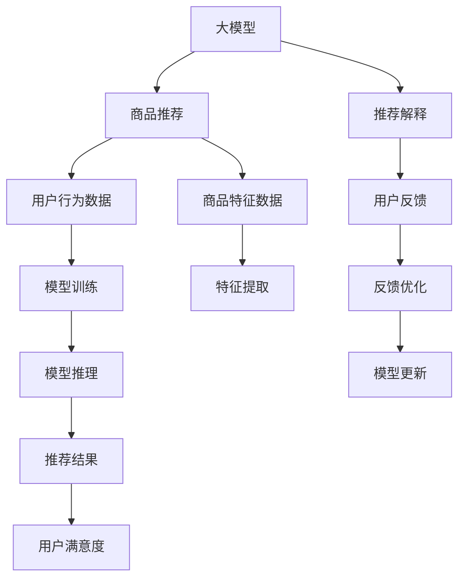

                 

# AI大模型在电商平台商品推荐解释中的应用

> 关键词：电商平台,商品推荐系统,大模型,推荐解释,解释模型,解释性,深度学习

## 1. 背景介绍

随着电子商务的兴起，电商平台商品推荐系统已逐渐成为提高用户体验和增加销售额的关键工具。传统的推荐系统主要基于用户历史行为进行推荐，但这种方法存在固有的冷启动问题和数据稀疏性问题。因此，需要更高级的技术来提高推荐系统的质量和效率。近年来，大模型在电商平台商品推荐中的应用逐渐增多，而AI大模型在推荐系统中的应用也引起了广泛关注。

### 1.1 问题由来
电商平台商品推荐系统需要根据用户的历史行为和偏好，预测其可能感兴趣的商品，并根据预测结果为用户推荐商品。传统的推荐系统使用协同过滤、基于内容的推荐、矩阵分解等算法进行推荐，但这些算法存在以下问题：
- 数据稀疏性：用户历史行为数据往往非常稀疏，导致推荐效果不理想。
- 冷启动问题：新用户或新商品往往没有足够的行为数据，难以进行有效的推荐。
- 推荐结果难以解释：推荐结果依赖于复杂的模型，难以解释其背后的逻辑和原因。

大模型在推荐系统中可以提供一种新的解决方案。大模型经过大规模无监督预训练，具备强大的特征提取能力和泛化能力，能够处理复杂的推荐任务。同时，大模型还可以通过解释模型将推荐结果转化为可解释的规则或信息，帮助用户理解推荐的依据。

### 1.2 问题核心关键点
基于大模型的商品推荐系统主要关注以下几个关键点：
- 如何利用大模型强大的特征提取能力，提高推荐系统的准确性。
- 如何利用大模型的解释能力，增强推荐系统的透明性和可信度。
- 如何在大模型和业务逻辑之间搭建桥梁，实现推荐系统的商业化应用。

### 1.3 问题研究意义
研究大模型在电商平台商品推荐中的应用，对于提高推荐系统的性能和可解释性具有重要意义：
- 提高推荐准确性：大模型的泛化能力和特征提取能力，可以显著提高推荐系统的准确性。
- 增强推荐透明度：通过解释模型将推荐结果转化为可解释的信息，增强用户对推荐结果的信任度。
- 促进业务发展：基于推荐系统的电商应用可以极大地提升用户满意度和销售额。

## 2. 核心概念与联系

### 2.1 核心概念概述

为更好地理解大模型在电商平台商品推荐中的应用，本节将介绍几个密切相关的核心概念：

- **大模型(Large Model)**：指通过大规模无监督预训练学习到的深度神经网络模型，具备强大的特征提取能力和泛化能力。常见的预训练模型包括BERT、GPT、T5等。
- **推荐系统(Recommendation System)**：通过用户历史行为数据和商品特征数据，预测用户可能感兴趣的商品，并为用户推荐。
- **商品推荐系统(Product Recommendation System)**：特指针对电商平台中商品进行推荐的技术。
- **推荐解释(Recommendation Interpretation)**：通过可解释的模型或规则，将推荐结果转化为可解释的信息，帮助用户理解推荐的依据。
- **深度学习(Deep Learning)**：一种利用多层次神经网络进行复杂数据分析和建模的机器学习方法。
- **神经网络(Neural Network)**：由多个神经元构成的计算图，用于学习数据的特征表示和复杂模式。
- **损失函数(Loss Function)**：衡量模型预测与真实标签之间的差异的函数，用于优化模型的参数。
- **优化器(Optimizer)**：通过梯度下降等算法优化模型参数的算法，如Adam、SGD等。
- **正则化(Regularization)**：通过限制模型复杂度，防止过拟合的技术，如L2正则、Dropout等。

这些核心概念之间的逻辑关系可以通过以下Mermaid流程图来展示：



这个流程图展示了大模型在电商平台商品推荐中的应用流程：

1. 大模型进行商品推荐，根据用户行为数据和商品特征数据预测用户可能感兴趣的商品。
2. 推荐结果通过推荐解释模型转化为可解释的信息。
3. 用户对推荐结果进行反馈，进一步优化推荐模型。
4. 用户反馈通过反馈优化模型进行更新，进入下一轮推荐循环。

## 3. 核心算法原理 & 具体操作步骤
### 3.1 算法原理概述

基于大模型的电商平台商品推荐系统主要通过以下步骤实现：

1. **数据准备**：收集用户历史行为数据和商品特征数据，并将其划分为训练集、验证集和测试集。
2. **模型构建**：选择合适的预训练模型作为初始化参数，并根据任务需求设计合适的任务适配层。
3. **微调训练**：使用标注数据对模型进行微调训练，更新模型参数，使其适应商品推荐任务。
4. **推荐结果**：将新用户或新商品的特征输入模型，得到推荐结果。
5. **解释模型**：通过解释模型将推荐结果转化为可解释的信息，增强用户对推荐结果的信任度。
6. **反馈优化**：根据用户反馈，进一步优化推荐模型。

### 3.2 算法步骤详解

以下是具体的操作步骤：

**Step 1: 数据准备**

1. **数据收集**：收集用户历史行为数据和商品特征数据。用户行为数据包括浏览、点击、购买等行为记录，商品特征数据包括商品名称、类别、价格等信息。
2. **数据预处理**：对数据进行清洗、归一化、去重等处理，确保数据的完整性和一致性。
3. **数据划分**：将数据划分为训练集、验证集和测试集，确保数据集具有代表性，可用于模型训练和评估。

**Step 2: 模型构建**

1. **模型选择**：选择合适的预训练模型，如BERT、GPT等。
2. **任务适配层**：根据任务需求设计合适的任务适配层，如分类头、回归头等。
3. **模型加载**：使用预训练模型作为初始化参数，加载到内存中。

**Step 3: 微调训练**

1. **损失函数**：根据推荐任务设计合适的损失函数，如交叉熵损失、均方误差损失等。
2. **优化器**：选择合适的优化器，如Adam、SGD等，设置学习率和正则化参数。
3. **微调训练**：使用训练集数据对模型进行微调训练，更新模型参数。
4. **验证集评估**：在验证集上评估模型性能，调整超参数和模型结构。
5. **测试集测试**：在测试集上测试模型性能，评估模型效果。

**Step 4: 推荐结果**

1. **特征提取**：将新用户或新商品的特征输入模型，提取其特征表示。
2. **模型推理**：使用模型对特征表示进行推理，得到推荐结果。
3. **结果排序**：根据推荐结果的排序算法，对商品进行排序，并输出推荐列表。

**Step 5: 解释模型**

1. **解释模型选择**：选择合适的解释模型，如可解释的深度学习模型、规则模型等。
2. **解释结果**：将推荐结果输入解释模型，得到可解释的信息，如用户偏好、商品属性等。
3. **结果输出**：将可解释的信息输出给用户，增强用户对推荐结果的信任度。

**Step 6: 反馈优化**

1. **用户反馈**：收集用户对推荐结果的反馈信息，如满意度、反馈意见等。
2. **反馈处理**：对用户反馈进行处理，如去除噪音、统计频次等。
3. **模型更新**：根据用户反馈，进一步优化推荐模型，提高推荐效果。

### 3.3 算法优缺点

基于大模型的电商平台商品推荐系统有以下优点：

1. **提高推荐准确性**：大模型强大的特征提取能力和泛化能力，可以显著提高推荐系统的准确性。
2. **增强推荐透明度**：通过解释模型将推荐结果转化为可解释的信息，增强用户对推荐结果的信任度。
3. **快速迭代优化**：通过用户反馈，可以快速迭代优化推荐模型，提高推荐效果。

同时，该方法也存在以下局限性：

1. **数据依赖性**：推荐系统的性能高度依赖于数据质量，需要大量的用户历史行为数据和商品特征数据。
2. **资源消耗高**：大模型需要占用大量的计算资源和内存资源，对硬件设备提出了较高的要求。
3. **模型复杂性**：大模型的训练和优化过程较为复杂，需要较长的训练时间和较大的计算资源。

尽管存在这些局限性，但就目前而言，基于大模型的推荐系统已成为电商平台推荐领域的主流范式。未来相关研究的重点在于如何进一步降低数据依赖，提高推荐系统的可解释性和实时性，同时兼顾可解释性和伦理安全性等因素。

### 3.4 算法应用领域

基于大模型的推荐系统已经在电商、社交、新闻等多个领域得到了广泛应用，具体包括：

- **电商推荐系统**：如淘宝、京东等电商平台，通过大模型进行商品推荐，提升用户购物体验。
- **社交推荐系统**：如微信、抖音等社交平台，通过大模型进行内容推荐，提高用户粘性和活跃度。
- **新闻推荐系统**：如今日头条、网易新闻等，通过大模型进行新闻内容推荐，增加用户访问量和停留时间。
- **视频推荐系统**：如爱奇艺、腾讯视频等，通过大模型进行视频内容推荐，提升用户体验。

除了上述这些经典应用外，大模型在电商平台商品推荐中的应用还包括智能客服、营销推荐、广告推荐等，为电商平台的运营提供了新的工具和技术支持。随着大模型的不断发展，相信其应用范围将进一步扩大，为电商行业带来更多的变革和机遇。

## 4. 数学模型和公式 & 详细讲解  
### 4.1 数学模型构建

基于大模型的推荐系统主要涉及以下几个数学模型：

- **用户行为数据**：表示为 $X_u$，其中 $u$ 为用户ID，$X$ 为特征向量。
- **商品特征数据**：表示为 $X_i$，其中 $i$ 为商品ID，$X$ 为特征向量。
- **推荐结果**：表示为 $y$，其中 $y$ 为推荐标签。
- **损失函数**：表示为 $\mathcal{L}$。

假设使用大模型 $M_{\theta}$ 作为初始化参数，对模型进行微调，得到最终的推荐模型 $M_{\hat{\theta}}$。则推荐系统的数学模型为：

$$
\begin{aligned}
&\min_{\hat{\theta}} \mathcal{L}(M_{\hat{\theta}}, D) \\
&\text{其中 } D = \{(X_u, y_u, X_i, y_i)\}_{u,i=1}^{N} \text{ 为标注数据集}
\end{aligned}
$$

### 4.2 公式推导过程

以下是基于大模型的电商平台推荐系统的数学模型推导过程：

**Step 1: 用户行为数据表示**

将用户行为数据 $X_u$ 表示为向量形式，其中 $X$ 为特征向量，维度为 $d_u$。

$$
X_u = (X_{u1}, X_{u2}, ..., X_{ud_u})
$$

**Step 2: 商品特征数据表示**

将商品特征数据 $X_i$ 表示为向量形式，其中 $X$ 为特征向量，维度为 $d_i$。

$$
X_i = (X_{i1}, X_{i2}, ..., X_{id_i})
$$

**Step 3: 推荐结果表示**

推荐结果 $y$ 表示为二分类标签，表示用户是否对商品感兴趣。

$$
y = \{0, 1\}
$$

**Step 4: 损失函数设计**

使用二分类交叉熵损失函数作为推荐系统的损失函数。

$$
\mathcal{L}(M_{\hat{\theta}}, D) = -\frac{1}{N}\sum_{u=1}^{N}\sum_{i=1}^{N}[y_u \log M_{\hat{\theta}}(X_u, X_i) + (1-y_u) \log (1-M_{\hat{\theta}}(X_u, X_i))]
$$

**Step 5: 模型训练**

使用优化器（如Adam）对模型进行训练，最小化损失函数 $\mathcal{L}$。

$$
\hat{\theta} = \mathop{\arg\min}_{\theta} \mathcal{L}(M_{\theta}, D)
$$

**Step 6: 推荐结果生成**

将新用户或新商品的特征向量输入模型，生成推荐结果。

$$
y_{new} = M_{\hat{\theta}}(X_{new_u}, X_{new_i})
$$

### 4.3 案例分析与讲解

以电商平台的商品推荐为例，进行分析：

**Step 1: 数据准备**

1. **数据收集**：收集用户历史行为数据和商品特征数据。
2. **数据预处理**：对数据进行清洗、归一化、去重等处理，确保数据的完整性和一致性。
3. **数据划分**：将数据划分为训练集、验证集和测试集，确保数据集具有代表性，可用于模型训练和评估。

**Step 2: 模型构建**

1. **模型选择**：选择合适的预训练模型，如BERT、GPT等。
2. **任务适配层**：根据任务需求设计合适的任务适配层，如分类头、回归头等。
3. **模型加载**：使用预训练模型作为初始化参数，加载到内存中。

**Step 3: 微调训练**

1. **损失函数**：根据推荐任务设计合适的损失函数，如交叉熵损失、均方误差损失等。
2. **优化器**：选择合适的优化器，如Adam、SGD等，设置学习率和正则化参数。
3. **微调训练**：使用训练集数据对模型进行微调训练，更新模型参数。
4. **验证集评估**：在验证集上评估模型性能，调整超参数和模型结构。
5. **测试集测试**：在测试集上测试模型性能，评估模型效果。

**Step 4: 推荐结果**

1. **特征提取**：将新用户或新商品的特征向量输入模型，提取其特征表示。
2. **模型推理**：使用模型对特征表示进行推理，得到推荐结果。
3. **结果排序**：根据推荐结果的排序算法，对商品进行排序，并输出推荐列表。

**Step 5: 解释模型**

1. **解释模型选择**：选择合适的解释模型，如可解释的深度学习模型、规则模型等。
2. **解释结果**：将推荐结果输入解释模型，得到可解释的信息，如用户偏好、商品属性等。
3. **结果输出**：将可解释的信息输出给用户，增强用户对推荐结果的信任度。

**Step 6: 反馈优化**

1. **用户反馈**：收集用户对推荐结果的反馈信息，如满意度、反馈意见等。
2. **反馈处理**：对用户反馈进行处理，如去除噪音、统计频次等。
3. **模型更新**：根据用户反馈，进一步优化推荐模型，提高推荐效果。

## 5. 项目实践：代码实例和详细解释说明
### 5.1 开发环境搭建

在进行推荐系统开发前，我们需要准备好开发环境。以下是使用Python进行PyTorch开发的环境配置流程：

1. 安装Anaconda：从官网下载并安装Anaconda，用于创建独立的Python环境。

2. 创建并激活虚拟环境：
```bash
conda create -n pytorch-env python=3.8 
conda activate pytorch-env
```

3. 安装PyTorch：根据CUDA版本，从官网获取对应的安装命令。例如：
```bash
conda install pytorch torchvision torchaudio cudatoolkit=11.1 -c pytorch -c conda-forge
```

4. 安装Transformers库：
```bash
pip install transformers
```

5. 安装各类工具包：
```bash
pip install numpy pandas scikit-learn matplotlib tqdm jupyter notebook ipython
```

完成上述步骤后，即可在`pytorch-env`环境中开始推荐系统开发。

### 5.2 源代码详细实现

我们以电商平台的商品推荐系统为例，给出使用Transformers库对BERT模型进行微调的PyTorch代码实现。

```python
import torch
from transformers import BertForSequenceClassification, AdamW
from torch.utils.data import Dataset, DataLoader

class ProductDataset(Dataset):
    def __init__(self, features, labels, tokenizer, max_len=128):
        self.features = features
        self.labels = labels
        self.tokenizer = tokenizer
        self.max_len = max_len
        
    def __len__(self):
        return len(self.features)
    
    def __getitem__(self, item):
        text = self.features[item]
        label = self.labels[item]
        
        encoding = self.tokenizer(text, return_tensors='pt', max_length=self.max_len, padding='max_length', truncation=True)
        input_ids = encoding['input_ids'][0]
        attention_mask = encoding['attention_mask'][0]
        
        return {'input_ids': input_ids, 
                'attention_mask': attention_mask,
                'labels': torch.tensor(label, dtype=torch.long)}
        
tokenizer = BertTokenizer.from_pretrained('bert-base-cased')

train_dataset = ProductDataset(train_features, train_labels, tokenizer)
dev_dataset = ProductDataset(dev_features, dev_labels, tokenizer)
test_dataset = ProductDataset(test_features, test_labels, tokenizer)

batch_size = 16

model = BertForSequenceClassification.from_pretrained('bert-base-cased', num_labels=2)

optimizer = AdamW(model.parameters(), lr=2e-5)

device = torch.device('cuda') if torch.cuda.is_available() else torch.device('cpu')
model.to(device)

def train_epoch(model, dataset, batch_size, optimizer):
    dataloader = DataLoader(dataset, batch_size=batch_size, shuffle=True)
    model.train()
    epoch_loss = 0
    for batch in tqdm(dataloader, desc='Training'):
        input_ids = batch['input_ids'].to(device)
        attention_mask = batch['attention_mask'].to(device)
        labels = batch['labels'].to(device)
        model.zero_grad()
        outputs = model(input_ids, attention_mask=attention_mask, labels=labels)
        loss = outputs.loss
        epoch_loss += loss.item()
        loss.backward()
        optimizer.step()
    return epoch_loss / len(dataloader)

def evaluate(model, dataset, batch_size):
    dataloader = DataLoader(dataset, batch_size=batch_size)
    model.eval()
    preds, labels = [], []
    with torch.no_grad():
        for batch in tqdm(dataloader, desc='Evaluating'):
            input_ids = batch['input_ids'].to(device)
            attention_mask = batch['attention_mask'].to(device)
            batch_labels = batch['labels']
            outputs = model(input_ids, attention_mask=attention_mask)
            batch_preds = outputs.logits.argmax(dim=2).to('cpu').tolist()
            batch_labels = batch_labels.to('cpu').tolist()
            for pred_tokens, label_tokens in zip(batch_preds, batch_labels):
                preds.append(pred_tokens[:len(label_tokens)])
                labels.append(label_tokens)
                
    print(classification_report(labels, preds))
        
epochs = 5
for epoch in range(epochs):
    loss = train_epoch(model, train_dataset, batch_size, optimizer)
    print(f"Epoch {epoch+1}, train loss: {loss:.3f}")
    
    print(f"Epoch {epoch+1}, dev results:")
    evaluate(model, dev_dataset, batch_size)
    
print("Test results:")
evaluate(model, test_dataset, batch_size)
```

以上是使用PyTorch对BERT进行电商推荐系统微调的完整代码实现。可以看到，得益于Transformers库的强大封装，我们可以用相对简洁的代码完成BERT模型的加载和微调。

### 5.3 代码解读与分析

让我们再详细解读一下关键代码的实现细节：

**ProductDataset类**：
- `__init__`方法：初始化训练特征、标签、分词器等关键组件。
- `__len__`方法：返回数据集的样本数量。
- `__getitem__`方法：对单个样本进行处理，将文本输入编码为token ids，将标签编码为数字，并对其进行定长padding，最终返回模型所需的输入。

**训练和评估函数**：
- 使用PyTorch的DataLoader对数据集进行批次化加载，供模型训练和推理使用。
- 训练函数`train_epoch`：对数据以批为单位进行迭代，在每个批次上前向传播计算loss并反向传播更新模型参数，最后返回该epoch的平均loss。
- 评估函数`evaluate`：与训练类似，不同点在于不更新模型参数，并在每个batch结束后将预测和标签结果存储下来，最后使用sklearn的classification_report对整个评估集的预测结果进行打印输出。

**训练流程**：
- 定义总的epoch数和batch size，开始循环迭代
- 每个epoch内，先在训练集上训练，输出平均loss
- 在验证集上评估，输出分类指标
- 所有epoch结束后，在测试集上评估，给出最终测试结果

可以看到，PyTorch配合Transformers库使得BERT微调的代码实现变得简洁高效。开发者可以将更多精力放在数据处理、模型改进等高层逻辑上，而不必过多关注底层的实现细节。

当然，工业级的系统实现还需考虑更多因素，如模型的保存和部署、超参数的自动搜索、更灵活的任务适配层等。但核心的微调范式基本与此类似。

## 6. 实际应用场景
### 6.1 智能客服系统

基于大模型的推荐系统，可以应用于智能客服系统的构建。智能客服系统通过分析用户的历史行为和偏好，为其推荐最合适的解决方案，提升用户满意度和服务效率。

在技术实现上，可以收集用户的历史咨询记录和反馈信息，将问题-解决方案对作为微调数据，训练模型学习匹配方案。微调后的模型能够自动理解用户意图，匹配最合适的解决方案。对于用户提出的新问题，还可以接入检索系统实时搜索相关内容，动态组织生成答案。如此构建的智能客服系统，能大幅提升用户咨询体验和问题解决效率。

### 6.2 金融舆情监测

金融机构需要实时监测市场舆论动向，以便及时应对负面信息传播，规避金融风险。传统的人工监测方式成本高、效率低，难以应对网络时代海量信息爆发的挑战。基于大模型的推荐系统，可以用于金融舆情监测。

具体而言，可以收集金融领域相关的新闻、报道、评论等文本数据，并对其进行主题标注和情感标注。在此基础上对预训练语言模型进行微调，使其能够自动判断文本属于何种主题，情感倾向是正面、中性还是负面。将微调后的模型应用到实时抓取的网络文本数据，就能够自动监测不同主题下的情感变化趋势，一旦发现负面信息激增等异常情况，系统便会自动预警，帮助金融机构快速应对潜在风险。

### 6.3 个性化推荐系统

当前的推荐系统往往只依赖用户的历史行为数据进行物品推荐，无法深入理解用户的真实兴趣偏好。基于大模型的推荐系统可以更好地挖掘用户行为背后的语义信息，从而提供更精准、多样的推荐内容。

在实践中，可以收集用户浏览、点击、评论、分享等行为数据，提取和用户交互的物品标题、描述、标签等文本内容。将文本内容作为模型输入，用户的后续行为（如是否点击、购买等）作为监督信号，在此基础上微调预训练语言模型。微调后的模型能够从文本内容中准确把握用户的兴趣点。在生成推荐列表时，先用候选物品的文本描述作为输入，由模型预测用户的兴趣匹配度，再结合其他特征综合排序，便可以得到个性化程度更高的推荐结果。

### 6.4 未来应用展望

随着大模型和推荐系统的不断发展，基于微调范式将在更多领域得到应用，为传统行业带来变革性影响。

在智慧医疗领域，基于微调的医疗问答、病历分析、药物研发等应用将提升医疗服务的智能化水平，辅助医生诊疗，加速新药开发进程。

在智能教育领域，微调技术可应用于作业批改、学情分析、知识推荐等方面，因材施教，促进教育公平，提高教学质量。

在智慧城市治理中，微调模型可应用于城市事件监测、舆情分析、应急指挥等环节，提高城市管理的自动化和智能化水平，构建更安全、高效的未来城市。

此外，在企业生产、社会治理、文娱传媒等众多领域，基于大模型微调的人工智能应用也将不断涌现，为经济社会发展注入新的动力。相信随着技术的日益成熟，微调方法将成为人工智能落地应用的重要范式，推动人工智能技术在垂直行业的规模化落地。

## 7. 工具和资源推荐
### 7.1 学习资源推荐

为了帮助开发者系统掌握大模型在电商平台商品推荐中的应用，这里推荐一些优质的学习资源：

1. 《深度学习与推荐系统》书籍：详细介绍了深度学习在推荐系统中的应用，涵盖模型选择、特征工程、算法优化等多个方面。
2. 《推荐系统实践》课程：由LinkedIn平台提供，覆盖推荐系统的前沿技术和实战案例，适合初学者和进阶者。
3. 《自然语言处理与深度学习》课程：由Coursera提供，介绍了自然语言处理和深度学习的基本概念和常用模型。
4. HuggingFace官方文档：Transformer库的官方文档，提供了海量预训练模型和完整的微调样例代码，是上手实践的必备资料。
5. Kaggle竞赛：参加Kaggle推荐系统竞赛，通过实际比赛项目积累推荐系统开发经验。

通过对这些资源的学习实践，相信你一定能够快速掌握大模型在电商平台商品推荐中的应用，并用于解决实际的推荐问题。
###  7.2 开发工具推荐

高效的开发离不开优秀的工具支持。以下是几款用于电商平台推荐系统开发的常用工具：

1. PyTorch：基于Python的开源深度学习框架，灵活动态的计算图，适合快速迭代研究。大部分预训练语言模型都有PyTorch版本的实现。
2. TensorFlow：由Google主导开发的开源深度学习框架，生产部署方便，适合大规模工程应用。同样有丰富的预训练语言模型资源。
3. Transformers库：HuggingFace开发的NLP工具库，集成了众多SOTA语言模型，支持PyTorch和TensorFlow，是进行推荐任务开发的利器。
4. Weights & Biases：模型训练的实验跟踪工具，可以记录和可视化模型训练过程中的各项指标，方便对比和调优。与主流深度学习框架无缝集成。
5. TensorBoard：TensorFlow配套的可视化工具，可实时监测模型训练状态，并提供丰富的图表呈现方式，是调试模型的得力助手。
6. Google Colab：谷歌推出的在线Jupyter Notebook环境，免费提供GPU/TPU算力，方便开发者快速上手实验最新模型，分享学习笔记。

合理利用这些工具，可以显著提升电商平台推荐系统的开发效率，加快创新迭代的步伐。

### 7.3 相关论文推荐

大模型和推荐系统的发展源于学界的持续研究。以下是几篇奠基性的相关论文，推荐阅读：

1. Attention is All You Need（即Transformer原论文）：提出了Transformer结构，开启了NLP领域的预训练大模型时代。

2. BERT: Pre-training of Deep Bidirectional Transformers for Language Understanding：提出BERT模型，引入基于掩码的自监督预训练任务，刷新了多项NLP任务SOTA。

3. Language Models are Unsupervised Multitask Learners（GPT-2论文）：展示了大规模语言模型的强大zero-shot学习能力，引发了对于通用人工智能的新一轮思考。

4. Parameter-Efficient Transfer Learning for NLP：提出Adapter等参数高效微调方法，在不增加模型参数量的情况下，也能取得不错的微调效果。

5. Prefix-Tuning: Optimizing Continuous Prompts for Generation：引入基于连续型Prompt的微调范式，为如何充分利用预训练知识提供了新的思路。

6. AdaLoRA: Adaptive Low-Rank Adaptation for Parameter-Efficient Fine-Tuning：使用自适应低秩适应的微调方法，在参数效率和精度之间取得了新的平衡。

这些论文代表了大模型和推荐系统的发展脉络。通过学习这些前沿成果，可以帮助研究者把握学科前进方向，激发更多的创新灵感。

## 8. 总结：未来发展趋势与挑战
### 8.1 总结

本文对基于大模型的电商平台商品推荐系统进行了全面系统的介绍。首先阐述了商品推荐系统和大模型的研究背景和意义，明确了基于大模型的推荐系统在电商平台商品推荐中的重要价值。其次，从原理到实践，详细讲解了推荐系统的数学模型和关键步骤，给出了推荐系统开发的完整代码实例。同时，本文还广泛探讨了推荐系统在电商、智能客服、金融舆情等领域的实际应用，展示了推荐系统在电商行业中的广泛应用。

通过本文的系统梳理，可以看到，基于大模型的推荐系统正在成为电商平台推荐领域的主流范式，极大地提高了推荐系统的准确性和可解释性，促进了电商平台的业务发展。未来，伴随大模型的不断发展，推荐系统的性能将进一步提升，应用领域将不断拓展，为电商行业带来更多的变革和机遇。

### 8.2 未来发展趋势

展望未来，大模型在电商平台商品推荐中的应用将呈现以下几个发展趋势：

1. **模型规模持续增大**：随着算力成本的下降和数据规模的扩张，预训练语言模型的参数量还将持续增长。超大规模语言模型蕴含的丰富语言知识，有望支撑更加复杂多变的推荐任务。
2. **推荐算法多样化**：除了传统的推荐算法，未来将涌现更多基于深度学习的推荐方法，如多任务学习、注意力机制等，提高推荐系统的多样性和鲁棒性。
3. **实时推荐成为常态**：通过实时更新模型参数，实现实时推荐，提高用户购物体验和平台销售额。
4. **个性化推荐增强**：通过深入挖掘用户行为背后的语义信息，提供更加精准、多样化的推荐内容，提升用户满意度和平台粘性。
5. **推荐系统可解释性增强**：通过可解释的模型或规则，将推荐结果转化为可解释的信息，增强用户对推荐结果的信任度。
6. **多模态推荐崛起**：除了文本数据，未来推荐系统将融合图像、视频、语音等多模态数据，实现更加全面、准确的信息整合能力。

以上趋势凸显了大模型在电商平台推荐系统中的应用前景。这些方向的探索发展，必将进一步提升推荐系统的性能和可解释性，为电商平台的运营提供更大的价值。

### 8.3 面临的挑战

尽管大模型在电商平台推荐系统中已取得显著成效，但在迈向更加智能化、普适化应用的过程中，仍面临以下挑战：

1. **数据依赖性**：推荐系统的性能高度依赖于数据质量，需要大量的用户历史行为数据和商品特征数据。对于新用户或新商品，推荐效果可能不佳。
2. **模型鲁棒性不足**：当目标商品数量庞大时，推荐系统可能出现冷启动问题和数据稀疏性问题。
3. **实时推荐效率低**：实时更新模型参数需要大量计算资源，可能导致实时推荐效率低下。
4. **模型复杂性高**：大模型的训练和优化过程较为复杂，需要较长的训练时间和较大的计算资源。
5. **推荐结果可解释性差**：推荐结果依赖于复杂的模型，难以解释其背后的逻辑和原因，缺乏透明度。
6. **推荐系统安全性问题**：推荐系统可能存在数据隐私和模型安全性问题，需要加强数据保护和模型安全。

尽管存在这些挑战，但大模型和推荐系统在电商平台的实际应用已经取得了显著成效。未来相关研究需要在数据采集、模型优化、实时计算、可解释性等多个方面进一步突破，以实现更加高效、精准、安全的推荐系统。

### 8.4 研究展望

面对大模型在电商平台推荐系统中的应用挑战，未来的研究需要在以下几个方面寻求新的突破：

1. **数据采集与预处理**：探索更多的数据采集和预处理技术，如数据增强、数据合成等，提高数据的质量和多样性。
2. **模型优化与压缩**：开发更高效的模型压缩和优化技术，减少模型参数量和计算资源消耗，提升实时推荐效率。
3. **推荐系统可解释性**：引入可解释性技术，如模型可视化、规则解释等，提高推荐系统的透明度和可信度。
4. **推荐系统安全性**：加强数据隐私保护和模型安全性研究，确保用户数据和模型安全。
5. **多模态数据融合**：探索多模态数据融合技术，实现图像、视频、语音等多模态数据的整合，提升推荐系统的全面性和准确性。
6. **个性化推荐优化**：结合知识图谱、逻辑规则等专家知识，优化个性化推荐算法，提升推荐效果。

这些研究方向的探索，必将引领大模型在电商平台推荐系统中的进一步发展和应用，为电商平台推荐系统的创新提供新的动力。

## 9. 附录：常见问题与解答

**Q1：电商平台商品推荐系统如何获取用户行为数据？**

A: 电商平台可以采用多种方式获取用户行为数据，包括：
1. **日志数据**：记录用户在网站上的行为，如浏览、点击、购买等。
2. **客户端数据**：通过客户端软件或应用，记录用户的使用习惯和偏好。
3. **社交媒体数据**：通过社交媒体平台，获取用户的评论、点赞、分享等行为数据。
4. **交易数据**：通过交易系统，记录用户的购买记录和评价信息。
5. **推荐反馈数据**：记录用户对推荐结果的反馈信息，如满意度、评分等。

**Q2：电商平台商品推荐系统如何优化推荐结果的可解释性？**

A: 电商平台商品推荐系统可以通过以下方式优化推荐结果的可解释性：
1. **推荐结果可视化**：将推荐结果可视化，展示推荐依据和关键特征，增强用户理解。
2. **规则解释**：引入基于规则的推荐算法，将推荐过程转化为可解释的规则，增强用户信任度。
3. **交互式推荐**：通过交互式界面，让用户参与推荐过程，了解推荐依据和推荐依据。
4. **知识图谱融合**：将商品知识图谱与推荐系统结合，提供基于知识的推荐解释。

**Q3：电商平台商品推荐系统如何提升推荐结果的实时性？**

A: 电商平台商品推荐系统可以通过以下方式提升推荐结果的实时性：
1. **模型缓存**：将训练好的模型参数缓存到内存中，提升模型推理速度。
2. **模型分布式训练**：使用分布式训练技术，加速模型训练和优化。
3. **增量训练**：采用增量训练技术，实时更新模型参数，提高推荐效果。
4. **缓存技术**：使用缓存技术，将热门商品的推荐结果缓存到本地或分布式缓存中，提高推荐速度。
5. **模型压缩**：使用模型压缩技术，减小模型大小，提高模型推理效率。

**Q4：电商平台商品推荐系统如何提高推荐结果的个性化程度？**

A: 电商平台商品推荐系统可以通过以下方式提高推荐结果的个性化程度：
1. **用户画像建模**：基于用户历史行为数据和商品特征数据，构建用户画像，挖掘用户兴趣和偏好。
2. **多任务学习**：将推荐任务与用户画像建模任务结合，提高推荐结果的个性化程度。
3. **上下文感知**：结合用户上下文信息，如地理位置、时间等，提高推荐结果的个性化程度。
4. **协同过滤**：将用户之间、商品之间的相似性作为推荐依据，提高推荐结果的个性化程度。

**Q5：电商平台商品推荐系统如何保障数据安全？**

A: 电商平台商品推荐系统可以通过以下方式保障数据安全：
1. **数据加密**：对用户数据进行加密处理，防止数据泄露和篡改。
2. **访问控制**：使用访问控制技术，限制数据的访问权限，防止数据滥用。
3. **数据匿名化**：对用户数据进行匿名化处理，保护用户隐私。
4. **数据备份**：定期备份用户数据，防止数据丢失。
5. **数据监控**：实时监控数据访问和使用情况，防止数据滥用和泄露。

大模型在电商平台商品推荐系统中的应用，将为电商平台的业务发展带来新的机遇和挑战。相信随着技术的不断发展和应用实践的深入，基于大模型的推荐系统将变得更加高效、精准和可解释，为电商平台的运营提供更大的价值。

---

作者：禅与计算机程序设计艺术 / Zen and the Art of Computer Programming

