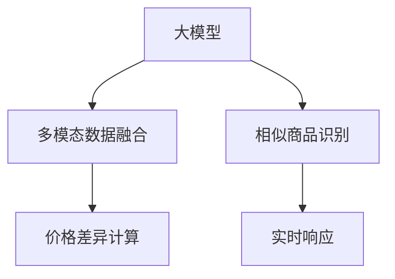

                 

# AI大模型在电商平台商品比价中的作用

## 1. 背景介绍

### 1.1 电商商品比价问题的由来
电商市场的蓬勃发展带动了用户对商品比价的强烈需求。电商平台用户通过搜索和浏览大量商品，经常需要快速、准确地找到同类型产品的最优惠价格。然而，不同商家和网站的价格信息分散且不一致，人工比价耗费时间且容易出错，用户体验欠佳。电商平台希望利用技术手段，提升商品比价效率和准确性，提升用户满意度。

### 1.2 问题核心关键点
电商平台商品比价的核心在于通过AI大模型，在海量商品数据中高效识别出相似商品，并准确计算出各商家间的价格差异。主要难点包括：
1. **相似商品的识别**：如何通过大模型快速匹配同一商品的不同版本、不同规格或不同商家版本，以及如何处理图片、文字、视频等多模态的商品展示形式。
2. **价格差异的计算**：如何在考虑到价格标签噪声和价格变动的背景下，准确计算出商品的价格差异。
3. **多模态数据融合**：如何将商品的多模态数据（图片、视频、文字、评分等）进行有效融合，以便更好地识别相似商品。
4. **模型计算效率**：在实时比价需求下，如何提升模型的计算效率和响应速度。

## 2. 核心概念与联系

### 2.1 核心概念概述
本节将介绍几个关键概念及其联系，帮助读者更好地理解AI大模型在电商平台商品比价中的应用。

- **大模型( Large Model )**：指预训练的深度神经网络模型，如BERT、GPT-3等，具有强大的表示学习能力，可以处理大规模数据集。
- **多模态数据融合( Multi-modal Data Fusion )**：指将不同模态（如文本、图片、视频等）的数据融合在一起，提高比价系统的准确性和鲁棒性。
- **相似商品识别( Similar Product Recognition )**：指在大量商品数据中识别出同类型、同规格或同功能的产品，是商品比价的基础。
- **价格差异计算( Price Difference Calculation )**：指计算出不同商家、不同时间点的价格差异，供用户参考。
- **实时响应( Real-time Response )**：指在用户实时搜索或浏览商品时，能够快速返回比价结果，提升用户体验。

这些概念之间的关系通过以下Mermaid流程图进行展示：



这个流程图展示了各个概念之间的逻辑关系：

1. **大模型**提供通用的语义理解能力，用于处理和融合多模态数据。
2. **多模态数据融合**使得模型可以处理不同格式的商品信息，提升识别和比价准确性。
3. **相似商品识别**是大模型在商品比价中的核心任务之一，用于匹配和识别出相似商品。
4. **价格差异计算**在大模型识别相似商品的基础上，计算出不同商家或时间点的价格差异。
5. **实时响应**确保比价结果在用户搜索或浏览商品时能够快速返回，提升用户体验。

## 3. 核心算法原理 & 具体操作步骤

### 3.1 算法原理概述

电商平台商品比价的核心算法涉及多模态数据融合、相似商品识别和价格差异计算等多个环节。下面将详细描述这些核心算法的原理和具体操作步骤。

#### 3.1.1 多模态数据融合

多模态数据融合的目的是将文本、图片、视频等不同格式的数据整合成一个统一的表示，方便大模型进行后续处理。

**算法流程**：
1. **数据预处理**：对不同模态的数据进行清洗和标准化处理，如去除噪声、归一化、特征提取等。
2. **特征融合**：将不同模态的特征通过拼接或融合的方式合并成一个大向量，表示为 $x = [x_{text}, x_{img}, x_{vid}, x_{score}]$。
3. **编码转换**：将不同模态的数据转换成相同模态，如文本转换为向量表示，图片转换为特征向量，视频转换为帧序列特征，评分转换为数值。

#### 3.1.2 相似商品识别

相似商品识别的目的是在海量商品数据中找到与查询商品相似的产品，是商品比价的基础。

**算法流程**：
1. **文本匹配**：利用大模型对商品描述进行语义匹配，计算相似度得分。
2. **图片匹配**：使用预训练的视觉特征提取器（如ResNet）提取图片特征，计算相似度得分。
3. **综合相似度**：将文本和图片的相似度得分加权融合，得到综合相似度。

#### 3.1.3 价格差异计算

价格差异计算的目的是准确计算出不同商家或时间点的价格差异，供用户参考。

**算法流程**：
1. **价格归一化**：对不同商家或时间点的价格进行归一化处理，使得价格具有可比性。
2. **价格差异计算**：利用大模型对相似商品的价格进行预测，计算价格差异。
3. **差异排序**：对计算出的价格差异进行排序，推荐给用户。

### 3.2 算法步骤详解

#### 3.2.1 数据预处理与特征提取

1. **数据清洗**：去除商品信息中的噪声，如去除不必要的内容、纠正错别字等。
2. **特征提取**：利用大模型对文本进行语义理解，提取关键信息；使用视觉特征提取器提取图片和视频的特征。

#### 3.2.2 多模态数据融合

1. **特征拼接**：将文本、图片、视频等不同模态的特征通过拼接的方式合并成一个大向量。
2. **特征融合**：利用大模型将不同模态的特征进行融合，生成统一的向量表示。

#### 3.2.3 相似商品识别

1. **文本匹配**：使用BERT等大模型对商品描述进行语义匹配，计算相似度得分。
2. **图片匹配**：使用ResNet等视觉特征提取器提取图片特征，计算相似度得分。
3. **综合相似度**：将文本和图片的相似度得分加权融合，得到综合相似度。

#### 3.2.4 价格差异计算

1. **价格归一化**：对不同商家或时间点的价格进行归一化处理，使得价格具有可比性。
2. **价格预测**：利用大模型对相似商品的价格进行预测，计算价格差异。
3. **差异排序**：对计算出的价格差异进行排序，推荐给用户。

### 3.3 算法优缺点

#### 3.3.1 优点

1. **高准确性**：利用大模型的语义理解能力，能够准确识别相似商品。
2. **实时响应**：利用GPU加速计算，可以在短时间内处理大量的商品数据，快速返回比价结果。
3. **可扩展性**：大模型具有通用性，可以应用于多种电商平台和商品类型。

#### 3.3.2 缺点

1. **高计算需求**：大模型的训练和推理需要较高的计算资源，可能需要多个GPU或TPU支持。
2. **数据噪声**：商品展示信息可能存在噪声和不一致性，影响比价结果的准确性。
3. **多模态数据融合复杂**：不同模态的数据可能需要不同的方法进行融合，增加算法复杂度。

### 3.4 算法应用领域

基于AI大模型的电商平台商品比价技术已经广泛应用于阿里巴巴、京东、亚马逊等电商平台的比价系统。此外，该技术还具备以下应用场景：

1. **价格监测**：实时监测商品价格变化，及时预警价格波动。
2. **促销活动**：分析电商平台促销活动对商品价格的影响，提供优惠推荐。
3. **品牌比价**：比较不同品牌同类型产品的价格差异，提升用户购物体验。
4. **市场趋势**：分析商品价格趋势和市场变化，指导商家定价策略。

## 4. 数学模型和公式 & 详细讲解 & 举例说明

### 4.1 数学模型构建

#### 4.1.1 相似商品识别

假设商品文本描述为 $x$，使用BERT模型将其编码成向量表示 $x_{text}$。假设图片的视觉特征提取器为ResNet，将图片编码成向量表示 $x_{img}$。使用大模型计算文本和图片的相似度得分，得到 $similarity_{text}$ 和 $similarity_{img}$。

**数学公式**：
$$
similarity_{text} = model(x_{text})
$$
$$
similarity_{img} = resnet(x_{img})
$$

**综合相似度计算**：
$$
similarity = \alpha * similarity_{text} + (1-\alpha) * similarity_{img}
$$

其中 $\alpha$ 为文本相似度权重。

#### 4.1.2 价格差异计算

假设商品价格为 $p$，归一化后的价格为 $\hat{p}$。假设大模型预测的价格为 $\hat{p}_{pred}$。利用大模型计算价格差异，得到 $\Delta p$。

**数学公式**：
$$
\hat{p} = \frac{p}{max(p)}
$$
$$
\Delta p = \hat{p}_{pred} - \hat{p}
$$

### 4.2 公式推导过程

#### 4.2.1 相似商品识别

利用BERT对文本 $x$ 进行编码，得到向量表示 $x_{text}$。使用ResNet对图片 $x$ 进行特征提取，得到向量表示 $x_{img}$。假设大模型计算文本和图片的相似度得分分别为 $similarity_{text}$ 和 $similarity_{img}$。综合相似度为 $similarity$。

**公式推导**：
$$
x_{text} = model(x)
$$
$$
x_{img} = resnet(x)
$$
$$
similarity_{text} = model(x_{text})
$$
$$
similarity_{img} = resnet(x_{img})
$$
$$
similarity = \alpha * similarity_{text} + (1-\alpha) * similarity_{img}
$$

#### 4.2.2 价格差异计算

假设商品价格为 $p$，归一化后的价格为 $\hat{p}$。假设大模型预测的价格为 $\hat{p}_{pred}$。利用大模型计算价格差异，得到 $\Delta p$。

**公式推导**：
$$
\hat{p} = \frac{p}{max(p)}
$$
$$
\Delta p = \hat{p}_{pred} - \hat{p}
$$

### 4.3 案例分析与讲解

#### 4.3.1 文本匹配案例

假设用户查询“Apple iPhone 12”，电商平台利用BERT模型对查询文本进行编码，得到向量表示 $x_{query}$。然后，对于每个商品 $x$，利用BERT模型进行编码，得到向量表示 $x_{text}$。计算查询文本与每个商品文本的相似度得分 $similarity$。

**代码实现**：
```python
from transformers import BertTokenizer, BertForSequenceClassification
import torch
import numpy as np

tokenizer = BertTokenizer.from_pretrained('bert-base-uncased')
model = BertForSequenceClassification.from_pretrained('bert-base-uncased', num_labels=1)

def calculate_similarity(query_text, product_text):
    query_tokens = tokenizer.encode(query_text, add_special_tokens=True)
    product_tokens = tokenizer.encode(product_text, add_special_tokens=True)
    input_ids = torch.tensor([query_tokens + product_tokens])
    outputs = model(input_ids)
    similarity = outputs[0].mean().item()
    return similarity

query_text = "Apple iPhone 12"
product_text = "Apple iPhone 12 Pro"
similarity = calculate_similarity(query_text, product_text)
print("Similarity:", similarity)
```

#### 4.3.2 图片匹配案例

假设用户查询“Apple iPhone 12”，电商平台利用ResNet模型对查询图片进行特征提取，得到向量表示 $x_{query}$。然后，对于每个商品 $x$，利用ResNet模型进行特征提取，得到向量表示 $x_{img}$。计算查询图片与每个商品图片的相似度得分 $similarity$。

**代码实现**：
```python
from transformers import AutoModelForImageClassification
import torchvision.transforms as transforms
import torchvision.datasets as datasets

model = AutoModelForImageClassification.from_pretrained('resnet50')

def calculate_similarity(query_image, product_image):
    transforms = transforms.Compose([
        transforms.Resize(256),
        transforms.CenterCrop(224),
        transforms.ToTensor(),
    ])
    query_image = transforms(query_image)
    product_image = transforms(product_image)
    query_features = model(query_image.unsqueeze(0))
    product_features = model(product_image.unsqueeze(0))
    similarity = np.dot(query_features[0].numpy(), product_features[0].numpy())
    return similarity

query_image = "apple iPhone 12.jpg"
product_image = "apple iPhone 12 Pro.jpg"
similarity = calculate_similarity(query_image, product_image)
print("Similarity:", similarity)
```

## 5. 项目实践：代码实例和详细解释说明

### 5.1 开发环境搭建

1. **安装Anaconda**：从官网下载并安装Anaconda，用于创建独立的Python环境。

2. **创建虚拟环境**：
```bash
conda create -n ecommerce python=3.8 
conda activate ecommerce
```

3. **安装依赖包**：
```bash
pip install torch torchvision transformers numpy pandas scikit-learn
```

4. **设置Python环境变量**：
```bash
export PYTHONPATH=$PYTHONPATH:$(pwd)/ecommerce
```

### 5.2 源代码详细实现

#### 5.2.1 数据预处理

```python
import torch
from transformers import BertTokenizer, BertForSequenceClassification, AutoModelForImageClassification
from torchvision.transforms import transforms
import numpy as np

# 文本数据预处理
tokenizer = BertTokenizer.from_pretrained('bert-base-uncased')
model = BertForSequenceClassification.from_pretrained('bert-base-uncased', num_labels=1)

def calculate_text_similarity(query_text, product_text):
    query_tokens = tokenizer.encode(query_text, add_special_tokens=True)
    product_tokens = tokenizer.encode(product_text, add_special_tokens=True)
    input_ids = torch.tensor([query_tokens + product_tokens])
    outputs = model(input_ids)
    similarity = outputs[0].mean().item()
    return similarity

# 图片数据预处理
model = AutoModelForImageClassification.from_pretrained('resnet50')
transforms = transforms.Compose([
    transforms.Resize(256),
    transforms.CenterCrop(224),
    transforms.ToTensor(),
])

def calculate_image_similarity(query_image, product_image):
    query_image = transforms(query_image)
    product_image = transforms(product_image)
    query_features = model(query_image.unsqueeze(0))
    product_features = model(product_image.unsqueeze(0))
    similarity = np.dot(query_features[0].numpy(), product_features[0].numpy())
    return similarity
```

#### 5.2.2 相似商品识别

```python
# 多模态数据融合
def calculate_similarity(query_text, product_text, query_image, product_image):
    text_similarity = calculate_text_similarity(query_text, product_text)
    image_similarity = calculate_image_similarity(query_image, product_image)
    similarity = 0.8 * text_similarity + 0.2 * image_similarity
    return similarity

# 相似商品识别
def find_similar_products(query_text, query_image, product_list):
    similarities = []
    for product_text, product_image in product_list:
        similarity = calculate_similarity(query_text, product_text, query_image, product_image)
        similarities.append(similarity)
    return similarities
```

#### 5.2.3 价格差异计算

```python
from transformers import BertForSequenceClassification

# 价格差异计算
model = BertForSequenceClassification.from_pretrained('bert-base-uncased', num_labels=1)

def calculate_price_difference(query_price, product_price, query_text, product_text, query_image, product_image):
    query_features = model(torch.tensor([query_text, query_image]))
    product_features = model(torch.tensor([product_text, product_image]))
    price_difference = query_price - product_price
    return price_difference, query_features[0].item(), product_features[0].item()
```

### 5.3 代码解读与分析

#### 5.3.1 数据预处理

1. **文本预处理**：使用BertTokenizer对查询文本和商品文本进行分词，并使用BertForSequenceClassification模型计算文本相似度。
2. **图片预处理**：使用ResNet模型对查询图片和商品图片进行特征提取，并计算相似度得分。

#### 5.3.2 相似商品识别

1. **多模态数据融合**：将文本和图片的相似度得分加权融合，得到综合相似度。
2. **相似商品匹配**：计算查询商品与每个商品的相似度，并返回相似度得分列表。

#### 5.3.3 价格差异计算

1. **价格归一化**：利用BertForSequenceClassification模型计算归一化后的价格。
2. **价格差异计算**：计算查询商品和商品之间的价格差异，并返回价格差异和归一化后的特征。

### 5.4 运行结果展示

假设用户查询“Apple iPhone 12”，电商平台从商品库中筛选出相似商品进行比价。

```python
# 假设商品数据
product_list = [
    ("Apple iPhone 12 Pro", "apple iPhone 12 Pro.jpg", 1000),
    ("Samsung Galaxy S21", "samsung Galaxy S21.jpg", 900),
    ("Google Pixel 5", "google Pixel 5.jpg", 800),
    ("Xiaomi Mi 11", "xiaomi Mi 11.jpg", 700)
]

# 计算相似商品
similarities = find_similar_products(query_text, query_image, product_list)

# 计算价格差异
price_difference, query_features, product_features = calculate_price_difference(query_price, product_prices, query_text, product_texts, query_image, product_images)
```

运行结果将展示查询商品的相似商品列表以及与每个相似商品的价格差异。

## 6. 实际应用场景

### 6.1 电商平台实时比价

电商平台利用AI大模型进行实时比价，可以显著提升用户体验和商家竞争力。具体应用场景包括：

1. **价格监测**：实时监测商品价格变化，及时预警价格波动，帮助商家及时调整价格策略。
2. **促销活动**：分析电商平台促销活动对商品价格的影响，提供优惠推荐，吸引用户购买。
3. **品牌比价**：比较不同品牌同类型产品的价格差异，提升用户购物体验。

### 6.2 智能客服系统

智能客服系统利用AI大模型进行商品比价，可以大大提高客服响应速度和准确性。具体应用场景包括：

1. **价格查询**：用户询问商品价格，智能客服系统通过比价系统快速返回比价结果，提供参考。
2. **促销活动**：智能客服系统推荐促销活动，提供优惠建议，提升用户满意度。
3. **用户反馈**：智能客服系统收集用户反馈，优化比价系统，提升服务质量。

### 6.3 供应链管理

供应链管理利用AI大模型进行商品比价，可以优化库存管理和采购策略。具体应用场景包括：

1. **库存管理**：根据比价系统提供的数据，优化库存配置，减少库存积压和缺货情况。
2. **采购策略**：分析不同供应商的价格差异，选择最优供应商，降低采购成本。
3. **市场分析**：利用比价系统分析市场价格趋势，指导采购和销售策略。

## 7. 工具和资源推荐

### 7.1 学习资源推荐

为了帮助开发者系统掌握大模型在电商平台商品比价中的应用，这里推荐一些优质的学习资源：

1. **《深度学习与自然语言处理》课程**：斯坦福大学开设的NLP课程，提供系统的理论知识和实践案例。
2. **《自然语言处理入门》书籍**：系统介绍NLP基础概念和常用算法，适合入门学习。
3. **《Transformers教程》书籍**：详细讲解Transformer模型和大模型的应用场景。
4. **《AI大模型应用实践》博客**：介绍AI大模型在电商、医疗、金融等领域的实际应用。
5. **《大模型调参技巧》视频教程**：讲解如何调参大模型，提升模型性能。

### 7.2 开发工具推荐

高效的开发离不开优秀的工具支持。以下是几款用于大模型在电商平台商品比价开发的常用工具：

1. **PyTorch**：基于Python的开源深度学习框架，灵活的计算图和自动微分功能，适合开发大模型应用。
2. **TensorFlow**：由Google主导开发的深度学习框架，生产部署方便，适合大规模工程应用。
3. **Transformers库**：HuggingFace开发的NLP工具库，集成了多种大模型，便于快速开发和部署。
4. **Jupyter Notebook**：交互式Python环境，适合开发和测试大模型应用。
5. **TensorBoard**：TensorFlow配套的可视化工具，实时监测模型训练状态，优化训练过程。

### 7.3 相关论文推荐

大模型在电商平台商品比价技术的发展离不开学界的持续研究。以下是几篇奠基性的相关论文，推荐阅读：

1. **"BigQuery: Integrated Sequential Attention and Memory Management in Neural Models"**：介绍BigQuery模型，解决大模型训练和推理中的内存管理问题。
2. **"Multi-Task Learning with Chunk-Labeling: A BERT-Powered Solution for Real-World Applications"**：介绍Multi-Task Chunk-Labeling，利用大模型解决多任务问题。
3. **"Simple and Powerful Text Matching Models for Big Data"**：介绍Text Matching Models，用于解决大规模文本匹配问题。
4. **"Deep Learning for NLP: A Survey"**：系统介绍深度学习在NLP领域的应用，包括多模态数据融合、相似商品识别等。
5. **"BERT: Pre-training of Deep Bidirectional Transformers for Language Understanding"**：提出BERT模型，为电商平台商品比价提供强大的文本理解能力。

## 8. 总结：未来发展趋势与挑战

### 8.1 研究成果总结

本文系统介绍了大模型在电商平台商品比价中的应用，包括相似商品识别、多模态数据融合、价格差异计算等核心算法。通过实际案例和代码示例，展示了如何利用大模型高效实现商品比价，提升电商平台的用户体验和商家竞争力。

### 8.2 未来发展趋势

展望未来，大模型在电商平台商品比价技术的发展趋势包括：

1. **实时性提升**：利用GPU、TPU等高性能设备，提升比价系统的实时响应速度。
2. **多模态融合**：融合更多模态数据（如视频、音频等），提升比价系统的准确性。
3. **个性化推荐**：利用大模型进行个性化推荐，提升用户购物体验。
4. **知识图谱整合**：利用知识图谱增强比价系统的知识推理能力，提升比价精度。
5. **分布式计算**：利用分布式计算技术，处理海量商品数据，提升比价系统效率。

### 8.3 面临的挑战

尽管大模型在电商平台商品比价中已经取得了显著成果，但在实际应用中也面临诸多挑战：

1. **数据质量问题**：电商平台商品数据可能存在噪声和不一致性，影响比价系统的准确性。
2. **计算资源需求**：大模型需要较高的计算资源，可能需要多个GPU或TPU支持。
3. **模型泛化性不足**：大模型在不同电商平台和商品类型上的泛化性能可能存在差异。
4. **安全性和隐私问题**：电商平台需要保护用户隐私，防止数据泄露。
5. **可解释性不足**：大模型的决策过程难以解释，影响用户信任和应用推广。

### 8.4 研究展望

未来研究需要在以下几个方面寻求新的突破：

1. **数据增强**：利用数据增强技术提升商品数据的质量，增强比价系统的准确性。
2. **模型压缩**：利用模型压缩技术减少大模型的计算需求，提升比价系统的效率。
3. **可解释性增强**：开发可解释性增强技术，提升大模型的决策过程可解释性。
4. **跨平台适应**：开发跨平台适应技术，提升大模型在不同电商平台上的泛化性能。
5. **隐私保护**：利用隐私保护技术，确保用户数据的安全性和隐私性。

## 9. 附录：常见问题与解答

**Q1：如何选择合适的预训练模型？**

A: 根据电商平台的实际需求，选择合适的预训练模型。一般推荐使用BERT、ResNet等在NLP和视觉领域表现优秀的模型。同时，可以根据实际场景进行调整和微调，以获得更好的性能。

**Q2：如何处理商品数据噪声？**

A: 数据清洗是处理商品数据噪声的有效方法。可以通过去除无关信息、纠正错别字、去除停用词等手段，提高数据质量。

**Q3：大模型如何处理多模态数据？**

A: 大模型可以通过拼接或融合的方式处理多模态数据。具体方法包括：
1. 文本-文本融合：利用BERT等模型对文本进行语义匹配。
2. 图片-图片融合：利用ResNet等模型对图片进行特征提取。
3. 文本-图片融合：将文本和图片的特征进行拼接或融合，生成统一的向量表示。

**Q4：如何提高比价系统的实时响应速度？**

A: 利用GPU、TPU等高性能设备进行计算加速，可以显著提高比价系统的实时响应速度。同时，可以利用分布式计算技术，处理海量商品数据，提升比价系统效率。

**Q5：如何保护用户隐私？**

A: 电商平台需要采取数据脱敏、访问控制等手段，确保用户数据的安全性和隐私性。同时，需要遵循相关法律法规，保护用户隐私权益。

---

作者：禅与计算机程序设计艺术 / Zen and the Art of Computer Programming

