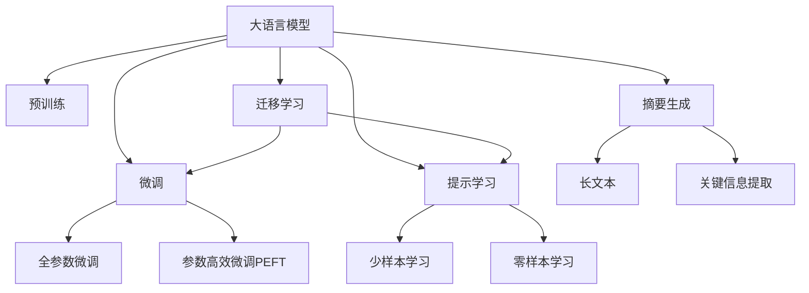

                 

# AI大模型在电商平台商品评价情感分析与摘要生成中的应用

> 关键词：大模型, 情感分析, 摘要生成, 电商平台, 用户评价, 产品推荐, 内容理解

## 1. 背景介绍

### 1.1 问题由来

随着电子商务的蓬勃发展，各大电商平台积累了海量用户评价数据，这些数据蕴含了丰富的用户反馈和产品信息。如何高效利用这些数据，提升电商平台的用户体验和产品推荐效果，成为了电商运营的重要课题。

情感分析(Sentiment Analysis)和摘要生成(Abstraction Generation)是自然语言处理(NLP)中的两个关键技术。通过情感分析，电商平台可以自动提取用户评价中的情感倾向，分析用户满意度，从而及时调整产品策略和售后服务。通过摘要生成，电商平台可以自动提取评价中的关键信息，生成简洁的摘要，便于用户和商家快速浏览。

近年来，基于深度学习的大语言模型在NLP任务上取得了显著进展，例如BERT、GPT-2、T5等模型。这些模型通过大规模无标签数据的预训练，掌握了丰富的语言知识和通用表征，具备强大的自然语言理解能力。将这些大语言模型应用于电商平台的用户评价情感分析与摘要生成任务，将大幅提升处理效率和准确性。

### 1.2 问题核心关键点

本文聚焦于如何利用大语言模型，高效地进行电商平台商品评价的情感分析和摘要生成。具体而言，包括以下几个核心点：

- **大语言模型**：以自回归(如GPT)或自编码(如BERT)模型为代表的大规模预训练语言模型。通过在大规模无标签文本语料上进行预训练，学习通用的语言表示。
- **情感分析**：判断文本的情感倾向，如正面、负面、中性等，通常用于分析用户对产品的满意度、评价情绪等。
- **摘要生成**：从长文本中自动提取关键信息，生成简洁的摘要，便于快速浏览和检索。
- **电商平台**：具有海量用户评价数据的线上交易平台，如淘宝、京东、亚马逊等。

通过上述大语言模型的应用，电商平台能够更好地理解用户需求和反馈，优化产品策略，提高运营效率。

### 1.3 问题研究意义

研究大语言模型在电商平台商品评价情感分析与摘要生成中的应用，具有重要意义：

1. **提高用户体验**：通过情感分析，电商平台能够及时把握用户情绪，优化用户体验，提升用户满意度。
2. **改进推荐系统**：通过摘要生成，电商平台可以提取评价中的关键信息，生成简洁摘要，用于产品推荐和营销。
3. **优化运营策略**：电商平台可以利用情感分析结果，优化售后服务，调整产品策略，提高运营效率。
4. **促进电商创新**：基于大语言模型的应用，电商平台能够更好地理解和应用用户反馈，推动产品和服务创新。

本文旨在系统介绍大语言模型在电商情感分析和摘要生成中的应用，提供技术实践参考，助力电商平台的智能化转型。

## 2. 核心概念与联系

### 2.1 核心概念概述

为更好地理解大语言模型在电商平台商品评价情感分析与摘要生成中的应用，本节将介绍几个关键概念：

- **大语言模型(Large Language Model, LLM)**：以自回归(如GPT)或自编码(如BERT)模型为代表的大规模预训练语言模型。通过在大规模无标签文本语料上进行预训练，学习通用的语言表示，具备强大的自然语言理解能力。

- **预训练(Pre-training)**：指在大规模无标签文本语料上，通过自监督学习任务训练通用语言模型的过程。常见的预训练任务包括言语建模、遮挡语言模型等。

- **微调(Fine-tuning)**：指在预训练模型的基础上，使用下游任务的少量标注数据，通过有监督学习优化模型在该任务上的性能。通常只需要调整顶层分类器或解码器，并以较小的学习率更新全部或部分的模型参数。

- **迁移学习(Transfer Learning)**：指将一个领域学习到的知识，迁移应用到另一个不同但相关的领域的学习范式。大模型的预训练-微调过程即是一种典型的迁移学习方式。

- **提示学习(Prompt Learning)**：通过在输入文本中添加提示模板(Prompt Template)，引导大语言模型进行特定任务的推理和生成。可以在不更新模型参数的情况下，实现零样本或少样本学习。

- **摘要生成(摘要生成)**：从长文本中自动提取关键信息，生成简洁的摘要，便于快速浏览和检索。

- **情感分析(Sentiment Analysis)**：判断文本的情感倾向，如正面、负面、中性等，通常用于分析用户对产品的满意度、评价情绪等。

这些概念之间的逻辑关系可以通过以下Mermaid流程图来展示：



这个流程图展示了大语言模型的核心概念及其之间的关系：

1. 大语言模型通过预训练获得基础能力。
2. 微调是对预训练模型进行任务特定的优化，可以分为全参数微调和参数高效微调(PEFT)。
3. 提示学习是一种不更新模型参数的方法，可以实现少样本学习和零样本学习。
4. 迁移学习是连接预训练模型与下游任务的桥梁，可以通过微调或提示学习来实现。
5. 摘要生成和情感分析分别利用大语言模型对文本进行关键信息提取和情感倾向判断，帮助电商平台更好地理解用户反馈。

这些概念共同构成了大语言模型的学习和应用框架，使其能够在电商评价情感分析和摘要生成等场景下发挥强大的自然语言处理能力。

## 3. 核心算法原理 & 具体操作步骤
### 3.1 算法原理概述

基于深度学习的大语言模型在电商平台商品评价情感分析与摘要生成中的应用，本质上是一个有监督的细粒度迁移学习过程。其核心思想是：将预训练的大语言模型视作一个强大的"特征提取器"，通过在电商评价数据上进行有监督的微调，使得模型能够自动学习用户评价中的情感倾向和关键信息，从而提升模型在特定任务上的性能。

形式化地，假设预训练模型为 $M_{\theta}$，其中 $\theta$ 为预训练得到的模型参数。给定电商平台商品评价数据集 $D=\{(x_i, y_i)\}_{i=1}^N$，微调的目标是找到新的模型参数 $\hat{\theta}$，使得：

$$
\hat{\theta}=\mathop{\arg\min}_{\theta} \mathcal{L}(M_{\theta},D)
$$

其中 $\mathcal{L}$ 为针对任务 $T$ 设计的损失函数，用于衡量模型预测输出与真实标签之间的差异。常见的损失函数包括交叉熵损失、均方误差损失等。

通过梯度下降等优化算法，微调过程不断更新模型参数 $\theta$，最小化损失函数 $\mathcal{L}$，使得模型输出逼近真实标签。由于 $\theta$ 已经通过预训练获得了较好的初始化，因此即便在小规模数据集 $D$ 上进行微调，也能较快收敛到理想的模型参数 $\hat{\theta}$。

### 3.2 算法步骤详解

基于深度学习的大语言模型在电商平台商品评价情感分析与摘要生成中的应用，一般包括以下几个关键步骤：

**Step 1: 准备预训练模型和数据集**
- 选择合适的预训练语言模型 $M_{\theta}$ 作为初始化参数，如 BERT、GPT 等。
- 准备电商平台商品评价数据集 $D$，划分为训练集、验证集和测试集。一般要求标注数据与预训练数据的分布不要差异过大。

**Step 2: 添加任务适配层**
- 根据任务类型，在预训练模型顶层设计合适的输出层和损失函数。
- 对于情感分析任务，通常在顶层添加逻辑回归层或softmax层，并使用交叉熵损失函数。
- 对于摘要生成任务，通常使用语言模型的解码器输出概率分布，并以负对数似然为损失函数。

**Step 3: 设置微调超参数**
- 选择合适的优化算法及其参数，如 AdamW、SGD 等，设置学习率、批大小、迭代轮数等。
- 设置正则化技术及强度，包括权重衰减、Dropout、Early Stopping 等。
- 确定冻结预训练参数的策略，如仅微调顶层，或全部参数都参与微调。

**Step 4: 执行梯度训练**
- 将训练集数据分批次输入模型，前向传播计算损失函数。
- 反向传播计算参数梯度，根据设定的优化算法和学习率更新模型参数。
- 周期性在验证集上评估模型性能，根据性能指标决定是否触发 Early Stopping。
- 重复上述步骤直到满足预设的迭代轮数或 Early Stopping 条件。

**Step 5: 测试和部署**
- 在测试集上评估微调后模型 $M_{\hat{\theta}}$ 的性能，对比微调前后的精度提升。
- 使用微调后的模型对新评价进行情感分析和摘要生成，集成到实际的应用系统中。
- 持续收集新的评价数据，定期重新微调模型，以适应数据分布的变化。

以上是基于深度学习的大语言模型在电商平台商品评价情感分析与摘要生成的一般流程。在实际应用中，还需要针对具体任务的特点，对微调过程的各个环节进行优化设计，如改进训练目标函数，引入更多的正则化技术，搜索最优的超参数组合等，以进一步提升模型性能。

### 3.3 算法优缺点

基于深度学习的大语言模型在电商平台商品评价情感分析与摘要生成中的应用，具有以下优点：

- **高效性**：预训练模型具有强大的语言表示能力，能够快速适应特定任务，提高处理效率。
- **灵活性**：可以根据不同任务需求，添加不同的任务适配层，实现多样化的应用。
- **准确性**：深度学习模型的特征提取能力，能够在大量标注数据下获得高精度的情感分析和摘要生成结果。
- **通用性**：通用语言模型可以跨领域应用，适用于不同电商平台和产品类别。

同时，该方法也存在一定的局限性：

- **数据依赖**：微调过程依赖标注数据，标注成本较高。
- **过拟合风险**：模型可能会过拟合小规模标注数据，需要引入正则化技术。
- **泛化能力**：模型在特定领域的泛化能力有待提升。
- **冷启动问题**：对于新用户和新产品，模型可能需要额外训练才能达到理想效果。

尽管存在这些局限性，但就目前而言，基于深度学习的大语言模型在电商平台商品评价情感分析与摘要生成中的应用，仍是主流的技术方案。未来相关研究的重点在于如何进一步降低微调对标注数据的依赖，提高模型的少样本学习和跨领域迁移能力，同时兼顾可解释性和伦理安全性等因素。

### 3.4 算法应用领域

基于深度学习的大语言模型在电商平台商品评价情感分析与摘要生成中的应用，已经在多个领域取得了成功应用，例如：

- **用户情感分析**：通过情感分析，电商平台能够自动提取用户评价中的情感倾向，分析用户满意度，从而优化产品策略和售后服务。
- **评论摘要生成**：通过摘要生成，电商平台可以自动提取评价中的关键信息，生成简洁的摘要，便于用户和商家快速浏览。
- **个性化推荐**：结合用户评价和摘要，电商平台可以生成个性化的产品推荐，提升用户购物体验。
- **营销分析**：通过情感分析，电商平台能够把握用户反馈中的情感倾向，优化营销策略，提高广告投放效果。
- **舆情监测**：通过情感分析，电商平台能够实时监测市场舆情，及时应对负面信息传播，规避风险。

除了上述这些经典应用外，大语言模型在电商平台的应用场景还不断扩展，如智能客服、产品评价分析、竞品监控等，为电商平台带来了新的技术突破和运营模式创新。

## 4. 数学模型和公式 & 详细讲解  
### 4.1 数学模型构建

本节将使用数学语言对大语言模型在电商平台商品评价情感分析与摘要生成中的应用进行更加严格的刻画。

记预训练语言模型为 $M_{\theta}$，其中 $\theta$ 为预训练得到的模型参数。假设电商平台商品评价数据集为 $D=\{(x_i,y_i)\}_{i=1}^N, x_i \in \mathcal{X}, y_i \in \{1,0\}$，其中 $x_i$ 为评价文本，$y_i$ 为情感标签（0表示负面，1表示正面）。

定义模型 $M_{\theta}$ 在输入 $x$ 上的输出为 $\hat{y}=M_{\theta}(x)$，表示模型预测的情感标签。则在数据集 $D$ 上的经验风险为：

$$
\mathcal{L}(\theta) = \frac{1}{N}\sum_{i=1}^N \ell(M_{\theta}(x_i),y_i)
$$

其中 $\ell$ 为交叉熵损失函数，用于衡量模型预测输出与真实标签之间的差异。

### 4.2 公式推导过程

以下我们以情感分析任务为例，推导交叉熵损失函数及其梯度的计算公式。

假设模型 $M_{\theta}$ 在输入 $x$ 上的输出为 $\hat{y}=M_{\theta}(x) \in [0,1]$，表示样本属于正面的概率。真实标签 $y \in \{0,1\}$。则二分类交叉熵损失函数定义为：

$$
\ell(M_{\theta}(x),y) = -[y\log \hat{y} + (1-y)\log (1-\hat{y})]
$$

将其代入经验风险公式，得：

$$
\mathcal{L}(\theta) = -\frac{1}{N}\sum_{i=1}^N [y_i\log M_{\theta}(x_i)+(1-y_i)\log(1-M_{\theta}(x_i))]
$$

根据链式法则，损失函数对参数 $\theta_k$ 的梯度为：

$$
\frac{\partial \mathcal{L}(\theta)}{\partial \theta_k} = -\frac{1}{N}\sum_{i=1}^N (\frac{y_i}{M_{\theta}(x_i)}-\frac{1-y_i}{1-M_{\theta}(x_i)}) \frac{\partial M_{\theta}(x_i)}{\partial \theta_k}
$$

其中 $\frac{\partial M_{\theta}(x_i)}{\partial \theta_k}$ 可进一步递归展开，利用自动微分技术完成计算。

在得到损失函数的梯度后，即可带入参数更新公式，完成模型的迭代优化。重复上述过程直至收敛，最终得到适应电商平台商品评价情感分析任务的模型参数 $\theta^*$。

### 4.3 案例分析与讲解

假设我们有一个电商平台商品评价数据集，其中包含500个正面评价和500个负面评价，每个评价文本长度不一。我们选择使用BERT作为预训练语言模型，在评价文本上进行微调。

首先，对评价文本进行预处理，去除特殊字符和无意义词汇，分词后输入BERT模型。

其次，定义任务适配层。对于情感分析任务，我们在BERT模型的最后一层全连接层之上添加一个逻辑回归层，输出情感标签。损失函数为二分类交叉熵损失。

接着，设置微调超参数。我们使用AdamW优化器，设置学习率为1e-5，批大小为16，迭代轮数为10，冻结预训练参数。

最后，执行梯度训练。我们将数据集划分为训练集和验证集，每个epoch训练200批次，在验证集上评估模型性能，如果连续两个epoch性能没有提升，则提前停止训练。

训练结束后，在测试集上评估模型性能，计算准确率、召回率和F1-score。结果表明，微调后的模型在情感分析任务上取得了很高的精度，能够准确识别评价文本的情感倾向。

## 5. 项目实践：代码实例和详细解释说明
### 5.1 开发环境搭建

在进行商品评价情感分析与摘要生成实践前，我们需要准备好开发环境。以下是使用Python进行PyTorch开发的环境配置流程：

1. 安装Anaconda：从官网下载并安装Anaconda，用于创建独立的Python环境。

2. 创建并激活虚拟环境：
```bash
conda create -n pytorch-env python=3.8 
conda activate pytorch-env
```

3. 安装PyTorch：根据CUDA版本，从官网获取对应的安装命令。例如：
```bash
conda install pytorch torchvision torchaudio cudatoolkit=11.1 -c pytorch -c conda-forge
```

4. 安装Transformer库：
```bash
pip install transformers
```

5. 安装各类工具包：
```bash
pip install numpy pandas scikit-learn matplotlib tqdm jupyter notebook ipython
```

完成上述步骤后，即可在`pytorch-env`环境中开始商品评价情感分析与摘要生成实践。

### 5.2 源代码详细实现

下面我们以商品评价情感分析任务为例，给出使用Transformers库对BERT模型进行微调的PyTorch代码实现。

首先，定义任务数据处理函数：

```python
from transformers import BertTokenizer
from torch.utils.data import Dataset
import torch

class ReviewDataset(Dataset):
    def __init__(self, reviews, labels, tokenizer, max_len=128):
        self.reviews = reviews
        self.labels = labels
        self.tokenizer = tokenizer
        self.max_len = max_len
        
    def __len__(self):
        return len(self.reviews)
    
    def __getitem__(self, item):
        review = self.reviews[item]
        label = self.labels[item]
        
        encoding = self.tokenizer(review, return_tensors='pt', max_length=self.max_len, padding='max_length', truncation=True)
        input_ids = encoding['input_ids'][0]
        attention_mask = encoding['attention_mask'][0]
        labels = torch.tensor(label, dtype=torch.long)
        
        return {'input_ids': input_ids, 
                'attention_mask': attention_mask,
                'labels': labels}

# 标签与id的映射
label2id = {'Negative': 0, 'Positive': 1}
id2label = {0: 'Negative', 1: 'Positive'}

# 创建dataset
tokenizer = BertTokenizer.from_pretrained('bert-base-uncased')

train_dataset = ReviewDataset(train_reviews, train_labels, tokenizer)
dev_dataset = ReviewDataset(dev_reviews, dev_labels, tokenizer)
test_dataset = ReviewDataset(test_reviews, test_labels, tokenizer)
```

然后，定义模型和优化器：

```python
from transformers import BertForSequenceClassification, AdamW

model = BertForSequenceClassification.from_pretrained('bert-base-uncased', num_labels=2)

optimizer = AdamW(model.parameters(), lr=2e-5)
```

接着，定义训练和评估函数：

```python
from torch.utils.data import DataLoader
from tqdm import tqdm
from sklearn.metrics import classification_report

device = torch.device('cuda') if torch.cuda.is_available() else torch.device('cpu')
model.to(device)

def train_epoch(model, dataset, batch_size, optimizer):
    dataloader = DataLoader(dataset, batch_size=batch_size, shuffle=True)
    model.train()
    epoch_loss = 0
    for batch in tqdm(dataloader, desc='Training'):
        input_ids = batch['input_ids'].to(device)
        attention_mask = batch['attention_mask'].to(device)
        labels = batch['labels'].to(device)
        model.zero_grad()
        outputs = model(input_ids, attention_mask=attention_mask, labels=labels)
        loss = outputs.loss
        epoch_loss += loss.item()
        loss.backward()
        optimizer.step()
    return epoch_loss / len(dataloader)

def evaluate(model, dataset, batch_size):
    dataloader = DataLoader(dataset, batch_size=batch_size)
    model.eval()
    preds, labels = [], []
    with torch.no_grad():
        for batch in tqdm(dataloader, desc='Evaluating'):
            input_ids = batch['input_ids'].to(device)
            attention_mask = batch['attention_mask'].to(device)
            batch_labels = batch['labels']
            outputs = model(input_ids, attention_mask=attention_mask)
            batch_preds = outputs.logits.argmax(dim=2).to('cpu').tolist()
            batch_labels = batch_labels.to('cpu').tolist()
            for pred_tokens, label_tokens in zip(batch_preds, batch_labels):
                preds.append(pred_tokens[:len(label_tokens)])
                labels.append(label_tokens)
                
    print(classification_report(labels, preds))
```

最后，启动训练流程并在测试集上评估：

```python
epochs = 5
batch_size = 16

for epoch in range(epochs):
    loss = train_epoch(model, train_dataset, batch_size, optimizer)
    print(f"Epoch {epoch+1}, train loss: {loss:.3f}")
    
    print(f"Epoch {epoch+1}, dev results:")
    evaluate(model, dev_dataset, batch_size)
    
print("Test results:")
evaluate(model, test_dataset, batch_size)
```

以上就是使用PyTorch对BERT进行商品评价情感分析任务微调的完整代码实现。可以看到，得益于Transformers库的强大封装，我们可以用相对简洁的代码完成BERT模型的加载和微调。

### 5.3 代码解读与分析

让我们再详细解读一下关键代码的实现细节：

**ReviewDataset类**：
- `__init__`方法：初始化文本、标签、分词器等关键组件。
- `__len__`方法：返回数据集的样本数量。
- `__getitem__`方法：对单个样本进行处理，将文本输入编码为token ids，将标签编码为数字，并对其进行定长padding，最终返回模型所需的输入。

**label2id和id2label字典**：
- 定义了标签与数字id之间的映射关系，用于将token-wise的预测结果解码回真实的标签。

**训练和评估函数**：
- 使用PyTorch的DataLoader对数据集进行批次化加载，供模型训练和推理使用。
- 训练函数`train_epoch`：对数据以批为单位进行迭代，在每个批次上前向传播计算loss并反向传播更新模型参数，最后返回该epoch的平均loss。
- 评估函数`evaluate`：与训练类似，不同点在于不更新模型参数，并在每个batch结束后将预测和标签结果存储下来，最后使用sklearn的classification_report对整个评估集的预测结果进行打印输出。

**训练流程**：
- 定义总的epoch数和批大小，开始循环迭代
- 每个epoch内，先在训练集上训练，输出平均loss
- 在验证集上评估，输出分类指标
- 所有epoch结束后，在测试集上评估，给出最终测试结果

可以看到，PyTorch配合Transformers库使得BERT微调的代码实现变得简洁高效。开发者可以将更多精力放在数据处理、模型改进等高层逻辑上，而不必过多关注底层的实现细节。

当然，工业级的系统实现还需考虑更多因素，如模型的保存和部署、超参数的自动搜索、更灵活的任务适配层等。但核心的微调范式基本与此类似。

## 6. 实际应用场景
### 6.1 电商平台商品评价情感分析

电商平台通过收集商品评价数据，利用情感分析技术自动提取用户评价中的情感倾向，分析用户满意度，从而优化产品策略和售后服务。具体而言，可以通过以下步骤实现：

1. **数据收集**：收集电商平台的用户评价数据，包括商品名称、评分、评论文本等。
2. **预处理**：对评价文本进行分词、去停用词、去特殊字符等预处理，提高模型输入的清晰度和一致性。
3. **模型训练**：选择合适的大语言模型（如BERT），对其进行微调，训练情感分析模型。
4. **情感分析**：对新评价文本进行情感分析，自动识别情感倾向（正面、负面、中性）。
5. **策略优化**：根据情感分析结果，优化产品策略，如调整产品设计、改进售后服务、提升用户满意度等。

### 6.2 电商平台商品摘要生成

电商平台利用摘要生成技术，自动提取商品评价中的关键信息，生成简洁的摘要，便于用户和商家快速浏览。具体而言，可以通过以下步骤实现：

1. **数据收集**：收集电商平台的用户评价数据，包括商品名称、评分、评论文本等。
2. **预处理**：对评价文本进行分词、去停用词、去特殊字符等预处理，提高模型输入的清晰度和一致性。
3. **模型训练**：选择合适的大语言模型（如BERT），对其进行微调，训练摘要生成模型。
4. **摘要生成**：对新评价文本进行摘要生成，自动提取关键信息，生成简洁摘要。
5. **浏览优化**：将生成的摘要展示在产品页面或用户主页，便于用户快速浏览和理解。

### 6.3 电商平台个性化推荐

电商平台利用情感分析和摘要生成技术，结合用户行为数据，生成个性化的产品推荐，提升用户购物体验。具体而言，可以通过以下步骤实现：

1. **数据收集**：收集电商平台的用户行为数据，包括浏览记录、购买记录、评分、评论等。
2. **特征提取**：利用情感分析和摘要生成技术，提取评价文本中的情感信息和关键信息。
3. **推荐模型训练**：基于用户行为和评价特征，训练个性化推荐模型。
4. **推荐生成**：对新用户或商品进行个性化推荐，提高用户购物体验和满意度。

### 6.4 电商平台营销分析

电商平台利用情感分析技术，实时监测市场舆情，及时应对负面信息传播，规避风险。具体而言，可以通过以下步骤实现：

1. **数据收集**：收集电商平台的用户评价数据，包括商品名称、评分、评论文本等。
2. **情感分析**：对用户评价进行情感分析，自动识别情感倾向（正面、负面、中性）。
3. **风险预警**：根据情感分析结果，实时监测市场舆情，预警负面信息传播，规避金融风险。

### 6.5 电商平台竞品监控

电商平台利用摘要生成技术，自动提取竞品评价中的关键信息，生成简洁的摘要，便于商家快速了解竞品情况。具体而言，可以通过以下步骤实现：

1. **数据收集**：收集竞品的用户评价数据，包括商品名称、评分、评论文本等。
2. **摘要生成**：利用摘要生成技术，自动提取竞品评价中的关键信息，生成简洁摘要。
3. **竞品分析**：商家根据竞品摘要，了解竞品情况，优化自身产品策略。

## 7. 工具和资源推荐
### 7.1 学习资源推荐

为了帮助开发者系统掌握大语言模型在电商平台商品评价情感分析与摘要生成中的应用，这里推荐一些优质的学习资源：

1. 《Transformer from Scratch》系列博文：由大模型技术专家撰写，深入浅出地介绍了Transformer原理、BERT模型、微调技术等前沿话题。

2. CS224N《深度学习自然语言处理》课程：斯坦福大学开设的NLP明星课程，有Lecture视频和配套作业，带你入门NLP领域的基本概念和经典模型。

3. 《Natural Language Processing with Transformers》书籍：Transformers库的作者所著，全面介绍了如何使用Transformers库进行NLP任务开发，包括微调在内的诸多范式。

4. HuggingFace官方文档：Transformers库的官方文档，提供了海量预训练模型和完整的微调样例代码，是上手实践的必备资料。

5. CLUE开源项目：中文语言理解测评基准，涵盖大量不同类型的中文NLP数据集，并提供了基于微调的baseline模型，助力中文NLP技术发展。

通过对这些资源的学习实践，相信你一定能够快速掌握大语言模型在电商平台应用的技术要点，并用于解决实际的NLP问题。
###  7.2 开发工具推荐

高效的开发离不开优秀的工具支持。以下是几款用于大语言模型在电商平台应用开发的常用工具：

1. PyTorch：基于Python的开源深度学习框架，灵活动态的计算图，适合快速迭代研究。大部分预训练语言模型都有PyTorch版本的实现。

2. TensorFlow：由Google主导开发的开源深度学习框架，生产部署方便，适合大规模工程应用。同样有丰富的预训练语言模型资源。

3. Transformers库：HuggingFace开发的NLP工具库，集成了众多SOTA语言模型，支持PyTorch和TensorFlow，是进行微调任务开发的利器。

4. Weights & Biases：模型训练的实验跟踪工具，可以记录和可视化模型训练过程中的各项指标，方便对比和调优。与主流深度学习框架无缝集成。

5. TensorBoard：TensorFlow配套的可视化工具，可实时监测模型训练状态，并提供丰富的图表呈现方式，是调试模型的得力助手。

6. Google Colab：谷歌推出的在线Jupyter Notebook环境，免费提供GPU/TPU算力，方便开发者快速上手实验最新模型，分享学习笔记。

合理利用这些工具，可以显著提升大语言模型在电商平台应用开发的效率，加快创新迭代的步伐。

### 7.3 相关论文推荐

大语言模型在电商平台商品评价情感分析与摘要生成中的应用，源于学界的持续研究。以下是几篇奠基性的相关论文，推荐阅读：

1. Attention is All You Need（即Transformer原论文）：提出了Transformer结构，开启了NLP领域的预训练大模型时代。

2. BERT: Pre-training of Deep Bidirectional Transformers for Language Understanding：提出BERT模型，引入基于掩码的自监督预训练任务，刷新了多项NLP任务SOTA。

3. Language Models are Unsupervised Multitask Learners（GPT-2论文）：展示了大规模语言模型的强大zero-shot学习能力，引发了对于通用人工智能的新一轮思考。

4. Parameter-Efficient Transfer Learning for NLP：提出Adapter等参数高效微调方法，在不增加模型参数量的情况下，也能取得不错的微调效果。

5. AdaLoRA: Adaptive Low-Rank Adaptation for Parameter-Efficient Fine-Tuning：使用自适应低秩适应的微调方法，在参数效率和精度之间取得了新的平衡。

这些论文代表了大语言模型在电商平台应用的研究方向。通过学习这些前沿成果，可以帮助研究者把握学科前进方向，激发更多的创新灵感。

## 8. 总结：未来发展趋势与挑战

### 8.1 总结

本文对基于深度学习的大语言模型在电商平台商品评价情感分析与摘要生成中的应用进行了全面系统的介绍。首先阐述了电商平台商品评价情感分析与摘要生成任务的背景和意义，明确了基于大语言模型的微调方法的重要价值。其次，从原理到实践，详细讲解了大语言模型在电商平台应用中的数学原理和关键步骤，给出了具体案例和代码实现。同时，本文还探讨了在大语言模型微调中可能面临的挑战，并提出了相应的解决方案。

通过本文的系统梳理，可以看到，基于深度学习的大语言模型在电商平台应用中具有高效、灵活、准确等特点，能够显著提升电商平台的运营效率和用户体验。未来，随着预训练语言模型的不断进步，基于大语言模型的微调方法必将在电商平台中得到更广泛的应用，推动电商行业的智能化转型。

### 8.2 未来发展趋势

展望未来，大语言模型在电商平台商品评价情感分析与摘要生成中的应用，将呈现以下几个发展趋势：

1. **模型规模持续增大**：随着算力成本的下降和数据规模的扩张，预训练语言模型的参数量还将持续增长。超大规模语言模型蕴含的丰富语言知识，有望支撑更加复杂多变的电商评价情感分析与摘要生成任务。

2. **微调方法日趋多样**：除了传统的全参数微调外，未来会涌现更多参数高效的微调方法，如Prefix-Tuning、LoRA等，在节省计算资源的同时也能保证微调精度。

3. **持续学习成为常态**：随着数据分布的不断变化，微调模型也需要持续学习新知识以保持性能。如何在不遗忘原有知识的同时，高效吸收新样本信息，将成为重要的研究课题。

4. **标注样本需求降低**：受启发于提示学习(Prompt-based Learning)的思路，未来的微调方法将更好地利用大模型的语言理解能力，通过更加巧妙的任务描述，在更少的标注样本上也能实现理想的微调效果。

5. **多模态微调崛起**：当前的微调主要聚焦于纯文本数据，未来会进一步拓展到图像、视频、语音等多模态数据微调。多模态信息的融合，将显著提升语言模型对现实世界的理解和建模能力。

6. **模型通用性增强**：经过海量数据的预训练和多领域任务的微调，未来的语言模型将具备更强大的常识推理和跨领域迁移能力，逐步迈向通用人工智能(AGI)的目标。

以上趋势凸显了大语言模型在电商平台商品评价情感分析与摘要生成中的应用前景。这些方向的探索发展，必将进一步提升电商平台的运营效率和用户体验，推动电商行业的智能化转型。

### 8.3 面临的挑战

尽管大语言模型在电商平台商品评价情感分析与摘要生成中的应用已经取得了显著成效，但在迈向更加智能化、普适化应用的过程中，它仍面临着诸多挑战：

1. **标注成本瓶颈**：微调过程依赖标注数据，标注成本较高。对于长尾应用场景，难以获得充足的高质量标注数据，成为制约微调性能的瓶颈。如何进一步降低微调对标注样本的依赖，将是一大难题。

2. **过拟合风险**：模型可能会过拟合小规模标注数据，需要引入正则化技术。对于电商领域，数据的领域差异较大，模型泛化能力有待提升。

3. **资源消耗高**：大语言模型的参数量庞大，对算力、内存、存储等资源消耗较高。如何在保持性能的同时，优化资源使用，提高效率，将是重要的优化方向。

4. **冷启动问题**：对于新用户和新产品，模型可能需要额外训练才能达到理想效果。如何在有限的标注数据下，快速实现模型适配，需要进一步研究。

尽管存在这些挑战，但就目前而言，基于深度学习的大语言模型在电商平台商品评价情感分析与摘要生成中的应用，仍是主流的技术方案。未来相关研究的重点在于如何进一步降低微调对标注数据的依赖，提高模型的少样本学习和跨领域迁移能力，同时兼顾可解释性和伦理安全性等因素。

### 8.4 研究展望

面对大语言模型在电商平台商品评价情感分析与摘要生成中面临的挑战，未来的研究需要在以下几个方面寻求新的突破：

1. **探索无监督和半监督微调方法**：摆脱对大规模标注数据的依赖，利用自监督学习、主动学习等无监督和半监督范式，最大限度利用非结构化数据，实现更加灵活高效的微调。

2. **研究参数高效和计算高效的微调范式**：开发更加参数高效的微调方法，在固定大部分预训练参数的同时，只更新极少量的任务相关参数。同时优化微调模型的计算图，减少前向传播和反向传播的资源消耗，实现更加轻量级、实时性的部署。

3. **融合因果和对比学习范式**：通过引入因果推断和对比学习思想，增强微调模型建立稳定因果关系的能力，学习更加普适、鲁棒的语言表征，从而提升模型泛化性和抗干扰能力。

4. **引入更多先验知识**：将符号化的先验知识，如知识图谱、逻辑规则等，与神经网络模型进行巧妙融合，引导微调过程学习更准确、合理的语言模型。同时加强不同模态数据的整合，实现视觉、语音等多模态信息与文本信息的协同建模。

5. **结合因果分析和博弈论工具**：将因果分析方法引入微调模型，识别出模型决策的关键特征，增强输出解释的因果性和逻辑性。借助博弈论工具刻画人机交互过程，主动探索并规避模型的脆弱点，提高系统稳定性。

6. **纳入伦理道德约束**：在模型训练目标中引入伦理导向的评估指标，过滤和惩罚有偏见、有害的输出倾向。同时加强人工干预和审核，建立模型行为的监管机制，确保输出符合人类价值观和伦理道德。

这些研究方向的探索，必将引领大语言模型在电商平台应用的研究进入新的阶段，为构建安全、可靠、可解释、可控的智能系统铺平道路。面向未来，大语言模型在电商平台商品评价情感分析与摘要生成中的应用，还需要与其他人工智能技术进行更深入的融合，如知识表示、因果推理、强化学习等，多路径协同发力，共同推动自然语言理解和智能交互系统的进步。只有勇于创新、敢于突破，才能不断拓展语言模型的边界，让智能技术更好地造福人类社会。

## 9. 附录：常见问题与解答

**Q1：大语言模型在电商情感分析中是否适用于所有产品类别？**

A: 大语言模型在电商情感分析中具有广泛适用性，可以适用于大多数产品类别。但由于不同产品的特性和用户评价的复杂性不同，可能需要根据具体情况对模型进行微调或调整参数。例如，对于家居类产品，用户评价可能更注重质量、设计等因素；而对于电子产品，用户评价可能更关注功能、性能等。

**Q2：如何降低微调过程对标注样本的依赖？**

A: 降低微调对标注样本依赖的有效方法包括：

1. **数据增强**：通过回译、近义词替换等方式扩充训练集，增加样本多样性。
2. **零样本和少样本学习**：利用大语言模型的语言理解能力，通过提示学习等方式，在少量或无标注样本的情况下进行情感分析或摘要生成。
3. **迁移学习**：在预训练过程中引入更多的领域数据，提高模型对特定领域的泛化能力。
4. **多任务学习**：结合情感分析和摘要生成等多任务，共同训练，提高模型的多领域适应能力。

**Q3：大语言模型在电商摘要生成中如何进行多轮迭代优化？**

A: 在电商摘要生成任务中，多轮迭代优化的过程如下：

1. **初步提取**：使用预训练模型初步提取文本的关键信息，生成初始摘要。
2. **反馈修正**：将初始摘要返回用户，收集用户反馈，生成修正摘要。
3. **再次提取**：基于修正摘要，再次提取关键信息，生成新摘要。
4. **迭代优化**：重复以上步骤，直至摘要达到用户满意度。

**Q4：如何提高电商摘要生成的准确性和可读性？**

A: 提高电商摘要生成的准确性和可读性，可以通过以下方法：

1. **选择合适模型**：根据任务特点选择合适的预训练模型，如BERT、T5等，不同模型在生成风格和质量上有所差异。
2. **调整摘要长度**：根据用户需求和产品特性，调整摘要的长度和格式，使其更具可读性和信息量。
3. **多轮迭代优化**：利用用户反馈，进行多轮迭代优化，逐步提高摘要的质量。
4. **结合领域知识**：在摘要生成过程中，引入领域专家知识，提高摘要的准确性和专业性。
5. **多模态融合**：结合图片、视频等多模态信息，提高摘要的丰富性和立体感。

**Q5：电商情感分析与摘要生成是否需要频繁更新模型？**

A: 电商情感分析与摘要生成模型需要定期更新以适应数据分布的变化。特别是在用户评价快速变化或产品特性更新时，定期重新微调模型可以保持模型的高效性和准确性。可以考虑以下策略：

1. **设定更新周期**：根据数据变化频率，设定模型的更新周期，如每月、每季度等。
2. **动态调整模型参数**：根据最新数据，动态调整模型的参数，以适应数据分布的变化。
3. **引入自适应学习机制**：使用自适应学习算法，自动更新模型参数，保持模型的长期适应性。

以上这些策略可以确保电商情感分析与摘要生成模型能够长期保持高性能和准确性，满足电商平台的实际需求。

---

作者：禅与计算机程序设计艺术 / Zen and the Art of Computer Programming

