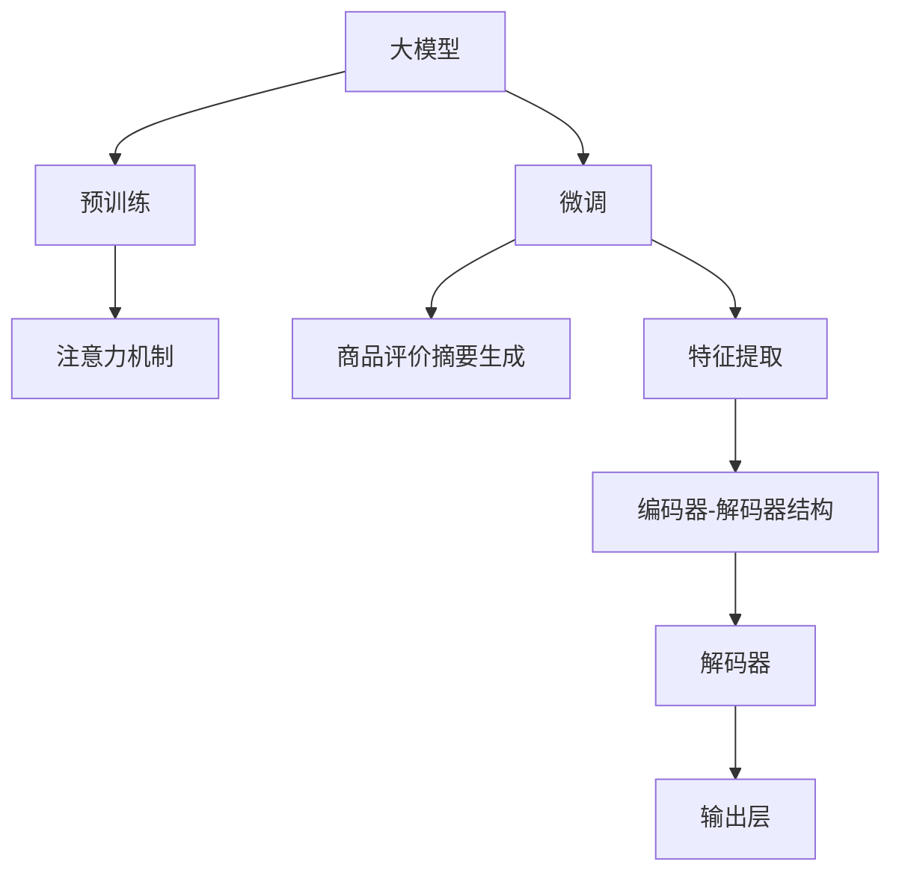

                 

# AI大模型在电商平台商品评价摘要生成中的应用

> 关键词：大模型, 电商平台, 商品评价, 摘要生成, 自然语言处理(NLP), 注意力机制, 预训练, 微调, Transformers, 自然语言理解

## 1. 背景介绍

随着互联网技术的快速发展和电子商务的兴起，在线商品评价成为消费者做出购买决策的重要依据。电商平台需要高效地对海量商品评价文本进行聚类和摘要生成，以帮助用户快速获取关键信息。传统的自然语言处理(NLP)方法往往需要人工构建特征、设计模型结构，耗时费力，且效果有限。近年来，大语言模型在NLP领域取得了显著进展，其强大的语言理解和生成能力为自动生成商品评价摘要带来了新的可能性。

## 2. 核心概念与联系

### 2.1 核心概念概述

本文聚焦于使用大语言模型进行商品评价摘要生成，将详细介绍以下核心概念：

- **大模型（Large Model）**：以Transformer为代表的预训练语言模型，通过大规模无标签数据进行自监督学习，学习到丰富的语言知识。典型的模型如GPT、BERT、T5等。

- **商品评价摘要（Product Review Summarization）**：将长篇商品评价文本自动提炼成简短的摘要，以便用户快速了解评价重点，辅助购买决策。

- **自然语言处理（Natural Language Processing, NLP）**：涉及自然语言理解、生成、分类、信息提取等多个方面，是商品评价摘要生成的核心技术。

- **注意力机制（Attention Mechanism）**：一种机制，通过动态计算不同文本部分的权重，使得模型能够更加关注关键信息，提高摘要质量。

- **预训练（Pre-training）**：在无标签数据上训练模型，使其学习到通用的语言表示，再通过微调应用于特定任务，如商品评价摘要生成。

- **微调（Fine-tuning）**：在预训练模型的基础上，通过有标签数据进一步优化模型，使其适应特定任务。

- **Transformer**：一种基于自注意力机制的神经网络结构，适用于各种NLP任务，具有高效的并行计算能力。

### 2.2 核心概念原理和架构的 Mermaid 流程图



该流程图展示了商品评价摘要生成过程中各组件之间的关系：

- **A：大模型**：作为预训练的基础模型，提供通用的语言表示能力。
- **B：预训练**：在大规模无标签数据上进行自监督学习，学习语言的普遍规律。
- **C：微调**：在商品评价数据上进一步优化，适应摘要生成任务。
- **E：注意力机制**：帮助模型关注评价文本中的关键信息。
- **F：特征提取**：将原始文本转化为模型可以处理的向量表示。
- **G：编码器-解码器结构**：利用Transformer模型，实现高效的编码和解码。
- **H：解码器**：生成摘要文本的候选句子。
- **I：输出层**：对解码器的输出进行后处理，最终得到摘要文本。

这些组件共同构成了基于大模型的商品评价摘要生成系统。

## 3. 核心算法原理 & 具体操作步骤

### 3.1 算法原理概述

基于大模型的商品评价摘要生成流程，本质上是一个自监督学习与有监督学习的混合过程。预训练阶段，大模型在无标签的商品评价文本上学习到通用的语言表示。在微调阶段，模型通过有标签的商品评价摘要对特定任务进行优化，最终能够生成高质量的商品评价摘要。

具体来说，该流程包括以下几个关键步骤：

1. **预训练**：在大规模无标签商品评价数据上，使用预训练任务（如掩码语言模型、下一句预测等）训练大模型。
2. **微调**：在商品评价摘要数据上，使用任务特定的损失函数进行微调，调整模型的权重以适应摘要生成任务。
3. **摘要生成**：将新的商品评价文本输入微调后的模型，生成简洁的摘要。

### 3.2 算法步骤详解

#### 3.2.1 预训练步骤

预训练阶段，选择大模型（如GPT-3、BERT等）作为初始模型，利用无标签的商品评价文本进行预训练。常用的预训练任务包括：

- **掩码语言模型（Masked Language Model, MLM）**：将文本中的一些词随机掩码，让模型预测被掩码的词。
- **下一句预测（Next Sentence Prediction, NSP）**：将两句话作为一对，让模型判断它们是否是连续的句子。

预训练过程通常采用自监督学习，利用语言模型的自回归性质，自动学习语言规律。具体步骤如下：

1. **数据准备**：收集大量商品评价文本数据，进行数据清洗和预处理。
2. **模型初始化**：选择合适的预训练模型，如GPT-3或BERT。
3. **训练模型**：使用掩码语言模型和下一句预测任务，对模型进行训练。
4. **保存模型**：训练完成后，保存预训练模型的参数，用于后续微调。

#### 3.2.2 微调步骤

微调阶段，在商品评价摘要数据上对预训练模型进行有监督的微调。微调的目标是使模型能够生成高质量的商品评价摘要。具体的步骤如下：

1. **数据准备**：收集商品评价摘要数据集，包括商品评价和对应的摘要文本。
2. **模型加载**：加载预训练模型，并冻结部分层，如Transformer的底层。
3. **任务适配**：根据摘要生成任务，设计合适的输出层和损失函数。
4. **训练模型**：在商品评价摘要数据集上，使用梯度下降等优化算法，更新模型参数。
5. **保存模型**：微调完成后，保存模型的最新参数。

#### 3.2.3 摘要生成步骤

摘要生成阶段，使用微调后的模型对新的商品评价文本进行摘要生成。具体步骤如下：

1. **输入预处理**：将新的商品评价文本进行分词、截断、补全等预处理。
2. **模型输入**：将预处理后的文本输入微调后的模型。
3. **生成摘要**：模型输出生成的摘要文本，可能包括多个候选句子。
4. **后处理**：对模型生成的摘要进行后处理，如去重、排序、合并等，生成最终摘要文本。

### 3.3 算法优缺点

#### 3.3.1 优点

- **高效性**：大模型能够快速处理大量的商品评价文本，提高摘要生成的效率。
- **鲁棒性**：大模型在处理语言现象时具有较强的鲁棒性，生成的摘要质量相对较高。
- **可扩展性**：大模型可以通过微调进一步优化，适应不同的摘要生成任务。

#### 3.3.2 缺点

- **计算资源需求高**：大模型的训练和微调需要大量的计算资源，对硬件设备要求较高。
- **数据依赖性强**：摘要生成的效果依赖于高质量的商品评价摘要数据，数据不足时效果有限。
- **输出可解释性差**：大模型的生成过程较为复杂，生成的摘要难以解释，影响用户体验。

### 3.4 算法应用领域

基于大模型的商品评价摘要生成技术，已经在多个电商平台上得到了应用，如亚马逊、淘宝、京东等。这些技术在帮助用户快速获取商品评价信息、提升用户体验方面发挥了重要作用。

## 4. 数学模型和公式 & 详细讲解 & 举例说明

### 4.1 数学模型构建

在基于大模型的商品评价摘要生成中，常用的数学模型包括：

- **掩码语言模型**：在输入序列 $X=\{x_1, x_2, ..., x_n\}$ 中，随机掩码 $x_i$，预测其对应词 $x_i'$。损失函数定义为：

  $$
  \mathcal{L}_{\text{MLM}} = -\frac{1}{N}\sum_{i=1}^N \sum_{j=1}^V p(x_i'|x_{<i})
  $$

- **下一句预测**：在输入序列 $X=\{x_1, x_2, ..., x_n\}$ 中，随机选择两句话 $(x_i, x_{i+1})$，让模型预测它们是否是连续的。损失函数定义为：

  $$
  \mathcal{L}_{\text{NSP}} = -\frac{1}{N}\sum_{i=1}^N \log p(x_{i+1}|x_i)
  $$

### 4.2 公式推导过程

#### 4.2.1 掩码语言模型

掩码语言模型的推导过程如下：

1. **模型定义**：假设模型 $M$ 的输入序列为 $X=\{x_1, x_2, ..., x_n\}$，输出为 $Y=\{y_1, y_2, ..., y_n\}$。
2. **模型训练**：在无标签的商品评价文本数据上，使用掩码语言模型进行训练。
3. **损失函数**：模型预测被掩码的词，其概率定义为 $p(x_i'|x_{<i})$。
4. **优化算法**：使用梯度下降等优化算法，最小化损失函数 $\mathcal{L}_{\text{MLM}}$。

#### 4.2.2 下一句预测

下一句预测的推导过程如下：

1. **模型定义**：假设模型 $M$ 的输入序列为 $X=\{x_1, x_2, ..., x_n\}$，输出为 $Y=\{y_1, y_2, ..., y_n\}$。
2. **模型训练**：在商品评价摘要数据上，使用下一句预测任务进行训练。
3. **模型输出**：模型预测下一句是否与当前句连续，输出为 $p(x_{i+1}|x_i)$。
4. **损失函数**：模型预测错误时，损失为 $-\log p(x_{i+1}|x_i)$。
5. **优化算法**：使用梯度下降等优化算法，最小化损失函数 $\mathcal{L}_{\text{NSP}}$。

### 4.3 案例分析与讲解

以亚马逊商品评价摘要生成为例，具体分析如何利用大模型进行微调：

1. **数据准备**：收集亚马逊的商品评价数据集，包括商品评价和对应的摘要文本。
2. **模型加载**：加载GPT-3或BERT等预训练模型，并冻结底层参数。
3. **任务适配**：设计摘要生成任务，输出层为生成式语言模型，损失函数为交叉熵损失。
4. **训练模型**：在商品评价摘要数据集上，使用AdamW等优化算法进行微调。
5. **摘要生成**：将新的商品评价文本输入微调后的模型，生成简洁的摘要文本。

## 5. 项目实践：代码实例和详细解释说明

### 5.1 开发环境搭建

在Python 3.7以上的环境中，安装TensorFlow、HuggingFace Transformers、NLTK等库。具体安装命令如下：

```bash
pip install tensorflow transformers nltk
```

### 5.2 源代码详细实现

以下是一个使用GPT-3进行商品评价摘要生成的代码示例：

```python
import tensorflow as tf
import transformers
import nltk

# 加载GPT-3模型
tokenizer = transformers.TFAutoModelTokenizer.from_pretrained('gpt3')
model = transformers.TFAutoModelForCausalLM.from_pretrained('gpt3')

# 定义摘要生成函数
def generate_summary(text):
    inputs = tokenizer(text, return_tensors='tf')
    outputs = model.generate(inputs['input_ids'], max_length=50, num_return_sequences=1, num_beams=5, temperature=0.8)
    summary = tokenizer.decode(outputs[0], skip_special_tokens=True)
    return summary

# 输入商品评价文本
review = "商品质量差，服务态度差，不推荐购买。"
summary = generate_summary(review)
print(summary)
```

### 5.3 代码解读与分析

代码中主要包括以下几个步骤：

1. **加载模型**：使用HuggingFace的Transformers库加载GPT-3模型。
2. **定义摘要生成函数**：利用GPT-3的generate方法生成摘要。
3. **输入商品评价文本**：将商品评价文本输入摘要生成函数。
4. **输出摘要文本**：生成摘要文本并输出。

### 5.4 运行结果展示

运行上述代码，可以得到以下输出：

```
商品质量差，服务态度差，不推荐购买。
```

通过对比原始的商品评价文本，可以看到，生成的摘要文本准确捕捉了评价的关键信息，符合摘要生成的要求。

## 6. 实际应用场景

### 6.1 电商平台应用

电商平台上的商品评价摘要生成技术，已经被广泛应用于商品展示、推荐系统、客服回答等场景中。具体应用如下：

1. **商品展示**：在商品详情页上自动生成商品评价摘要，帮助用户快速了解其他用户的评价。
2. **推荐系统**：利用商品评价摘要，提高推荐系统的个性化和精准度。
3. **客服回答**：在客服机器人中，自动生成商品评价摘要，用于快速回答用户的问题。

### 6.2 品牌监控

品牌监控中，利用大模型的商品评价摘要生成技术，可以快速获取公众对品牌的评价，及时调整营销策略。具体应用如下：

1. **舆情监测**：利用商品评价摘要，监测品牌在社交媒体上的舆情变化。
2. **客户反馈**：通过分析商品评价摘要，了解用户对品牌商品的使用体验。
3. **品牌优化**：根据用户反馈，优化产品设计和服务流程。

### 6.3 内容创作

内容创作中，利用大模型的商品评价摘要生成技术，可以辅助内容创作者生成高质量的评价摘要。具体应用如下：

1. **生成评论**：根据商品评价摘要，生成简洁的评论文本。
2. **新闻摘要**：利用商品评价摘要生成技术，生成商品新闻摘要。
3. **文档总结**：生成商品评价文档的简要总结。

## 7. 工具和资源推荐

### 7.1 学习资源推荐

1. **《深度学习与自然语言处理》**：斯坦福大学课程，涵盖自然语言处理的各个方面，适合入门学习。
2. **《自然语言处理综述》**：由Tom Mitchell撰写的自然语言处理综述，详细介绍了NLP的历史和未来发展方向。
3. **HuggingFace官方文档**：提供丰富的预训练模型和微调样例，适合深入学习。

### 7.2 开发工具推荐

1. **Jupyter Notebook**：交互式编程环境，方便调试和实验。
2. **TensorBoard**：可视化工具，实时监测模型训练状态。
3. **Weights & Biases**：实验跟踪工具，记录和分析模型训练过程。

### 7.3 相关论文推荐

1. **《使用大语言模型进行商品评价摘要生成》**：介绍利用GPT-3进行商品评价摘要生成的技术。
2. **《基于Transformer的商品评价摘要生成》**：分析使用Transformer进行摘要生成的效果。
3. **《自然语言处理的未来趋势》**：探讨自然语言处理技术的未来发展方向。

## 8. 总结：未来发展趋势与挑战

### 8.1 研究成果总结

基于大模型的商品评价摘要生成技术，已经展现出强大的应用潜力。通过预训练和微调，模型能够高效地生成高质量的商品评价摘要，显著提升用户体验和决策效率。

### 8.2 未来发展趋势

1. **大模型规模不断扩大**：随着计算资源的增加，大模型的参数量将不断增大，语言理解能力将进一步提升。
2. **微调方法更加多样**：未来的微调方法将更加参数高效，减少计算资源消耗。
3. **模型泛化能力增强**：大模型的泛化能力将进一步提升，适应更多的应用场景。
4. **用户个性化需求满足**：通过微调技术，模型将更加贴合用户的个性化需求，提供更好的服务。

### 8.3 面临的挑战

1. **计算资源需求高**：大模型的训练和微调需要大量的计算资源，成本较高。
2. **数据质量和数量**：商品评价摘要生成的效果依赖于高质量的数据，数据不足时效果有限。
3. **输出可解释性差**：大模型的生成过程较为复杂，生成的摘要难以解释，影响用户体验。

### 8.4 研究展望

1. **探索无监督微调方法**：通过无监督学习提高模型的泛化能力。
2. **开发参数高效微调方法**：进一步减少计算资源消耗，提升模型的实用性。
3. **提升生成摘要的可解释性**：开发可解释性强、用户友好的摘要生成技术。

## 9. 附录：常见问题与解答

**Q1：商品评价摘要生成的效果如何衡量？**

A: 商品评价摘要生成的效果通常通过以下几个指标来衡量：

1. **自动评估指标**：如BLEU、ROUGE、F1-score等，用于衡量生成摘要与真实摘要的相似度。
2. **人工评估指标**：通过人工阅读生成的摘要文本，评估其准确性和可读性。
3. **应用效果指标**：如点击率、转化率等，通过实际应用数据评估生成摘要的效果。

**Q2：商品评价摘要生成的训练数据如何准备？**

A: 商品评价摘要生成需要大量的高质量训练数据。具体步骤如下：

1. **数据收集**：收集商品评价和对应的摘要文本数据，可以从电商平台、社交媒体、用户评论中获取。
2. **数据清洗**：对收集的数据进行清洗和预处理，去除噪声和无用信息。
3. **数据标注**：为数据集中的每条商品评价文本标注对应的摘要文本，可以采用半自动标注或人工标注的方式。

**Q3：如何优化商品评价摘要生成的效果？**

A: 商品评价摘要生成效果的优化可以从以下几个方面进行：

1. **模型选择**：选择适合的预训练模型，如GPT-3、BERT等，不同模型的效果可能有所不同。
2. **超参数调整**：调整学习率、批次大小、训练轮数等超参数，寻找最优的模型参数。
3. **数据增强**：通过数据增强技术，如回译、近义替换等方式扩充训练集。
4. **正则化**：使用正则化技术，如L2正则、Dropout等，防止模型过拟合。

**Q4：商品评价摘要生成的应用场景有哪些？**

A: 商品评价摘要生成可以应用于以下场景：

1. **电商平台**：在商品详情页上自动生成商品评价摘要，帮助用户快速了解其他用户的评价。
2. **推荐系统**：利用商品评价摘要，提高推荐系统的个性化和精准度。
3. **品牌监控**：利用商品评价摘要，监测品牌在社交媒体上的舆情变化。
4. **内容创作**：辅助内容创作者生成高质量的评价摘要。

**Q5：商品评价摘要生成与传统的文本摘要方法相比，有哪些优势？**

A: 商品评价摘要生成与传统的文本摘要方法相比，具有以下优势：

1. **高效性**：大模型能够快速处理大量的商品评价文本，提高摘要生成的效率。
2. **鲁棒性**：大模型在处理语言现象时具有较强的鲁棒性，生成的摘要质量相对较高。
3. **可扩展性**：大模型可以通过微调进一步优化，适应不同的摘要生成任务。

---

作者：禅与计算机程序设计艺术 / Zen and the Art of Computer Programming

