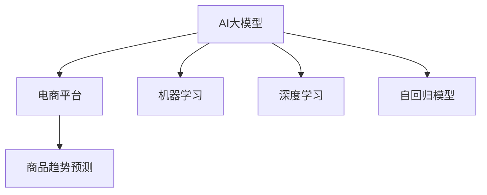

                 

# AI大模型在电商平台商品趋势预测中的应用

> 关键词：AI大模型,电商平台,商品趋势预测,机器学习,深度学习,自回归模型,神经网络

## 1. 背景介绍

### 1.1 问题由来
在当今数字化时代，电商平台已成为消费者购物的重要渠道之一。随着电商平台数据的激增，如何从海量数据中挖掘出商品销售趋势，预测未来销售动态，成为电商平台亟需解决的问题。传统的销售预测方法往往依赖于专家经验，难以捕捉数据中复杂的非线性关系和长尾效应。AI大模型在处理大规模非结构化数据方面具有卓越的能力，能够通过深度学习和自回归模型，精确捕捉数据中的模式和趋势。因此，AI大模型在电商平台商品趋势预测中具有广阔的应用前景。

### 1.2 问题核心关键点
AI大模型在电商平台商品趋势预测中的应用，主要集中在以下几个关键点：

- 数据获取：电商平台需要收集历史销售数据、用户行为数据、市场动态数据等，作为模型的输入。
- 模型选择：选择适合电商平台的预测模型，如自回归模型、神经网络模型等。
- 模型训练：通过训练模型，学习数据中的复杂非线性关系和趋势。
- 预测应用：将训练好的模型应用于商品销售预测，预测未来销售动态。

### 1.3 问题研究意义
AI大模型在电商平台商品趋势预测中的应用，具有以下研究意义：

- 提升销售预测精度：AI大模型能够精确捕捉数据中的模式和趋势，提升销售预测的精度和可靠性。
- 实时预测：AI大模型可以实时预测销售动态，帮助电商平台及时调整库存和营销策略，降低库存成本，提高运营效率。
- 智能决策支持：AI大模型可以提供基于数据的智能决策支持，帮助电商平台优化供应链和营销策略，提升用户体验和满意度。
- 成本效益：相较于传统的人工预测方法，AI大模型能够大幅度降低人力和时间成本，提升预测效率和准确性。

## 2. 核心概念与联系

### 2.1 核心概念概述

为更好地理解AI大模型在电商平台商品趋势预测中的应用，本节将介绍几个密切相关的核心概念：

- AI大模型：以深度神经网络为代表的AI大模型，通过大规模数据训练，具备强大的数据处理和模式识别能力。
- 电商平台：指利用互联网技术，提供在线购物服务的平台，如淘宝、京东、亚马逊等。
- 商品趋势预测：通过对历史销售数据和市场动态的建模，预测未来商品销售趋势，为电商平台提供决策支持。
- 机器学习：通过数据驱动的方式，让机器从数据中学习模式和规律，实现预测、分类、聚类等任务。
- 深度学习：机器学习的高级形式，通过多层次神经网络，提取数据中的高层次抽象特征。
- 自回归模型：一类通过时序数据预测未来的模型，能够捕捉数据中的时间依赖关系。

这些核心概念之间的逻辑关系可以通过以下Mermaid流程图来展示：



这个流程图展示了几大核心概念及其之间的关系：

1. AI大模型通过大规模数据训练，学习复杂的非线性关系和模式。
2. 电商平台通过收集用户行为数据、历史销售数据等，作为AI大模型的输入。
3. 商品趋势预测利用AI大模型的学习结果，进行未来的销售动态预测。
4. 机器学习和深度学习是AI大模型的重要组成部分，通过多层次网络提取特征。
5. 自回归模型是一种常用的预测方法，能够捕捉数据中的时间依赖关系。

这些概念共同构成了AI大模型在电商平台商品趋势预测的应用框架，使得预测过程高效、准确。

## 3. 核心算法原理 & 具体操作步骤
### 3.1 算法原理概述

AI大模型在电商平台商品趋势预测的应用，本质上是通过机器学习和深度学习技术，将历史销售数据和市场动态转化为未来销售趋势预测的过程。其核心思想是：利用AI大模型的自回归特性，通过对时序数据的建模，学习数据中的非线性关系和趋势，预测未来销售动态。

具体而言，假设历史销售数据为 $\{x_t\}_{t=1}^T$，其中 $x_t$ 表示在时间 $t$ 的销售量。利用AI大模型 $M_{\theta}$，通过时序数据 $\{x_t\}_{t=1}^T$ 进行预测，预测结果为 $\hat{y}_t$。预测过程如下：

$$
\hat{y}_t = M_{\theta}(x_{t-1}, x_{t-2}, ..., x_{t-k}, y_{t-1}, y_{t-2}, ..., y_{t-l})
$$

其中 $\{x_{t-k}, ..., x_{t-1}\}$ 表示历史销售数据，$\{y_{t-l}, ..., y_{t-1}\}$ 表示历史预测结果。$\theta$ 为AI大模型的参数，需要通过训练学习。

### 3.2 算法步骤详解

AI大模型在电商平台商品趋势预测的实现，通常包括以下几个关键步骤：

**Step 1: 数据预处理**

1. 收集电商平台的历史销售数据，并将其整理为时序数据集 $\{x_t\}_{t=1}^T$。
2. 对原始数据进行清洗和归一化处理，去除异常值和缺失值，确保数据质量。
3. 对时序数据进行拆分，划分出训练集、验证集和测试集，用于模型训练和评估。

**Step 2: 选择模型架构**

1. 选择适合的深度神经网络架构，如LSTM、GRU、Transformer等，用于建模时序数据。
2. 设计模型的输入和输出层，通常输入层采用时序数据的固定长度，输出层为预测结果的概率分布。
3. 设置模型的正则化技术，如L2正则、Dropout等，防止过拟合。

**Step 3: 训练模型**

1. 准备训练数据集和测试数据集，用于模型训练和评估。
2. 使用优化算法（如AdamW、SGD等）和损失函数（如均方误差损失）训练模型。
3. 在训练过程中，周期性在验证集上评估模型性能，避免过拟合。
4. 调整模型参数，如学习率、批大小等，直到模型收敛。

**Step 4: 预测应用**

1. 使用训练好的模型对新数据进行预测，得到未来的销售动态。
2. 对预测结果进行后处理，如平滑预测曲线、设置异常值检测等，提高预测精度。
3. 将预测结果应用于电商平台的库存管理、营销策略优化等实际业务场景中。

### 3.3 算法优缺点

AI大模型在电商平台商品趋势预测的应用，具有以下优点：

1. 预测精度高：AI大模型能够精确捕捉数据中的复杂非线性关系，预测精度高。
2. 实时性好：AI大模型可以实时处理和预测，满足电商平台对动态调整的需求。
3. 泛化能力强：AI大模型具有较强的泛化能力，能够适应不同电商平台的预测任务。
4. 自动化程度高：AI大模型的训练和预测过程自动化程度高，降低了人工干预的复杂度。

同时，该方法也存在以下局限性：

1. 对数据质量要求高：预测结果依赖于高质量的原始数据，数据噪声和缺失值会严重影响模型预测精度。
2. 模型复杂度高：深度神经网络模型参数量较大，计算资源消耗高，模型训练和推理速度较慢。
3. 模型可解释性差：AI大模型通常被视为"黑盒"，难以解释其内部工作机制和决策逻辑。
4. 模型训练成本高：AI大模型的训练需要大量的计算资源和标注数据，模型训练成本较高。

尽管存在这些局限性，但AI大模型在电商平台商品趋势预测中的应用，仍然具有较高的实用价值，能够提升预测精度和自动化水平，为电商平台提供重要的决策支持。

### 3.4 算法应用领域

AI大模型在电商平台商品趋势预测的应用，不仅局限于销售预测，还可以拓展到其他领域：

1. 库存管理：通过预测销售趋势，电商平台可以优化库存水平，避免缺货和积压。
2. 营销策略：预测用户购买行为，优化广告投放和促销策略，提升营销效果。
3. 商品推荐：根据预测结果，优化商品推荐算法，提升用户体验和销售转化率。
4. 风险管理：预测商品销量波动，及时调整库存和生产计划，降低经营风险。
5. 市场分析：通过分析销售趋势，洞察市场动态，为电商平台的业务决策提供依据。

## 4. 数学模型和公式 & 详细讲解 & 举例说明

### 4.1 数学模型构建

AI大模型在电商平台商品趋势预测的数学模型，通常采用深度神经网络的形式。这里以LSTM为例，介绍数学模型的构建过程。

假设历史销售数据为 $\{x_t\}_{t=1}^T$，其中 $x_t$ 表示在时间 $t$ 的销售量。利用LSTM模型 $M_{\theta}$，通过时序数据 $\{x_t\}_{t=1}^T$ 进行预测，预测结果为 $\hat{y}_t$。预测过程如下：

$$
\hat{y}_t = M_{\theta}(x_{t-1}, x_{t-2}, ..., x_{t-k}, y_{t-1}, y_{t-2}, ..., y_{t-l})
$$

其中 $\{x_{t-k}, ..., x_{t-1}\}$ 表示历史销售数据，$\{y_{t-l}, ..., y_{t-1}\}$ 表示历史预测结果。$\theta$ 为LSTM模型的参数，需要通过训练学习。

### 4.2 公式推导过程

以下我们以LSTM模型为例，推导预测公式和损失函数。

**预测公式**：
LSTM模型由输入门、遗忘门和输出门组成，可以捕捉数据中的时间依赖关系。假设LSTM模型的预测结果为 $\hat{y}_t = M_{\theta}(x_{t-1}, x_{t-2}, ..., x_{t-k}, y_{t-1}, y_{t-2}, ..., y_{t-l})$，则预测公式为：

$$
\hat{y}_t = f(x_{t-1}, x_{t-2}, ..., x_{t-k}, y_{t-1}, y_{t-2}, ..., y_{t-l})
$$

其中 $f$ 表示LSTM模型的预测函数。

**损失函数**：
LSTM模型的损失函数通常采用均方误差（MSE）损失，用于衡量模型预测结果与真实标签之间的差异。假设模型的真实预测结果为 $y_t$，则损失函数为：

$$
\mathcal{L}(\theta) = \frac{1}{N}\sum_{i=1}^N (y_i - \hat{y}_i)^2
$$

其中 $N$ 为数据集大小，$y_i$ 表示在时间 $i$ 的真实销售量，$\hat{y}_i$ 表示模型预测结果。

### 4.3 案例分析与讲解

假设某电商平台收集了过去一年的销售数据，包含每个时间点的销售量 $x_t$ 和标签 $y_t$。利用LSTM模型进行预测，步骤如下：

1. 数据预处理：对原始数据进行清洗和归一化处理，去除异常值和缺失值，将数据集划分为训练集、验证集和测试集。
2. 模型构建：使用LSTM模型作为预测模型，设置模型的输入层为时序数据，输出层为预测结果的概率分布。
3. 模型训练：使用优化算法（如AdamW）和均方误差损失函数训练模型，在训练过程中周期性在验证集上评估模型性能。
4. 模型评估：在测试集上评估模型的预测效果，对比模型预测结果与真实标签的差异。
5. 预测应用：使用训练好的模型对新数据进行预测，得到未来的销售趋势。

通过以上步骤，可以构建一个高效、准确的电商平台商品趋势预测系统。

## 5. 项目实践：代码实例和详细解释说明

### 5.1 开发环境搭建

在进行电商平台商品趋势预测的开发前，需要先准备好开发环境。以下是使用Python进行TensorFlow开发的流程：

1. 安装Anaconda：从官网下载并安装Anaconda，用于创建独立的Python环境。

2. 创建并激活虚拟环境：
```bash
conda create -n tf-env python=3.8 
conda activate tf-env
```

3. 安装TensorFlow：根据CUDA版本，从官网获取对应的安装命令。例如：
```bash
conda install tensorflow -c tensorflow -c conda-forge
```

4. 安装各类工具包：
```bash
pip install numpy pandas scikit-learn matplotlib tqdm jupyter notebook ipython
```

完成上述步骤后，即可在`tf-env`环境中开始开发。

### 5.2 源代码详细实现

下面我们以LSTM模型为例，给出使用TensorFlow进行电商平台商品趋势预测的PyTorch代码实现。

首先，定义数据处理函数：

```python
import tensorflow as tf
from tensorflow.keras.preprocessing.sequence import pad_sequences

def create_dataset(data, labels, seq_length):
    X = []
    y = []
    for i in range(len(data)-seq_length):
        X.append(data[i:i+seq_length])
        y.append(labels[i+seq_length])
    X = pad_sequences(X, maxlen=seq_length, padding='post')
    return X, y
```

然后，定义模型和训练函数：

```python
from tensorflow.keras.models import Sequential
from tensorflow.keras.layers import LSTM, Dense, Dropout

model = Sequential()
model.add(LSTM(units=64, input_shape=(seq_length, 1), return_sequences=True))
model.add(Dropout(0.2))
model.add(LSTM(units=64, return_sequences=False))
model.add(Dropout(0.2))
model.add(Dense(units=1))

model.compile(optimizer='adam', loss='mse')
```

接着，定义训练和评估函数：

```python
def train_epoch(model, X_train, y_train, batch_size, epochs, patience):
    history = model.fit(X_train, y_train, batch_size=batch_size, epochs=epochs, verbose=0)
    return history

def evaluate(model, X_test, y_test, batch_size):
    y_pred = model.predict(X_test)
    mse = tf.reduce_mean(tf.square(y_pred - y_test))
    return mse
```

最后，启动训练流程并在测试集上评估：

```python
seq_length = 30
X_train, y_train = create_dataset(train_data, train_labels, seq_length)
X_test, y_test = create_dataset(test_data, test_labels, seq_length)

epochs = 100
batch_size = 64
patience = 10

history = train_epoch(model, X_train, y_train, batch_size, epochs, patience)
mse = evaluate(model, X_test, y_test, batch_size)

print(f"Epochs: {epochs}, MSE: {mse:.4f}")
```

以上就是使用TensorFlow进行电商平台商品趋势预测的完整代码实现。可以看到，TensorFlow提供了丰富的深度学习模型和优化算法，使得模型构建和训练过程非常简单。

### 5.3 代码解读与分析

让我们再详细解读一下关键代码的实现细节：

**create_dataset函数**：
- 该函数用于将原始数据和标签转换为适合LSTM模型输入的格式。通过滑动窗口的方式，将历史数据划分为固定长度的时序序列，同时将标签转换为预测目标。
- 使用`pad_sequences`函数将时序序列进行填充，确保每个样本的序列长度一致。

**模型构建函数**：
- 该函数定义了LSTM模型的架构，包括输入层、LSTM层、Dropout层和输出层。
- 使用`units`参数设置LSTM层的大小，`input_shape`参数指定输入数据的维度。
- `return_sequences=True`表示输出序列，`return_sequences=False`表示输出单个时间步的预测结果。

**训练函数train_epoch**：
- 使用`fit`函数对模型进行训练，通过批量处理数据，每次迭代训练一个batch。
- 设置训练轮数`epochs`、批量大小`batch_size`和耐心值`patience`，用于防止过拟合。

**评估函数evaluate**：
- 使用`predict`函数对测试集进行预测，计算预测值和真实标签之间的均方误差。
- 返回均方误差，用于评估模型性能。

通过以上步骤，可以构建一个高效、准确的电商平台商品趋势预测系统。

## 6. 实际应用场景

### 6.1 智能库存管理

在电商平台中，智能库存管理是关键环节之一。通过商品趋势预测，电商平台可以实时调整库存水平，避免缺货和积压，提升运营效率。

具体而言，可以将预测结果应用于以下场景：

1. 自动补货：根据预测结果，电商平台可以自动调整库存水平，确保热门商品不断货，冷门商品不积压。
2. 促销策略：根据预测结果，电商平台可以优化促销策略，提升热门商品的销售量，减少滞销商品的库存。
3. 需求预测：通过预测结果，电商平台可以预测未来的需求趋势，及时调整供应链和生产计划。

### 6.2 精准营销

精准营销是电商平台的重要业务场景之一。通过商品趋势预测，电商平台可以优化广告投放和促销策略，提升营销效果。

具体而言，可以将预测结果应用于以下场景：

1. 广告投放：根据预测结果，电商平台可以优化广告投放渠道和时间，提升广告点击率和转化率。
2. 个性化推荐：通过预测结果，电商平台可以优化商品推荐算法，提升用户满意度和销售转化率。
3. 促销活动：根据预测结果，电商平台可以优化促销活动的设计和执行，提升促销效果和用户体验。

### 6.3 风险管理

风险管理是电商平台的重要业务环节之一。通过商品趋势预测，电商平台可以预测商品销量波动，及时调整库存和生产计划，降低经营风险。

具体而言，可以将预测结果应用于以下场景：

1. 库存管理：通过预测结果，电商平台可以及时调整库存水平，避免库存积压和缺货。
2. 生产计划：根据预测结果，电商平台可以优化生产计划，降低生产成本和风险。
3. 供应链管理：通过预测结果，电商平台可以优化供应链管理，确保供应链的稳定性和可靠性。

## 7. 工具和资源推荐

### 7.1 学习资源推荐

为了帮助开发者系统掌握AI大模型在电商平台商品趋势预测的理论基础和实践技巧，这里推荐一些优质的学习资源：

1. 《深度学习》系列书籍：由吴恩达、杨立昆等知名专家撰写，深入浅出地介绍了深度学习的原理和应用。
2. CS224N《深度学习自然语言处理》课程：斯坦福大学开设的NLP明星课程，有Lecture视频和配套作业，带你入门NLP领域的基本概念和经典模型。
3. 《机器学习实战》书籍：由Peter Harrington撰写，提供了大量实践案例和代码实现，适合初学者快速上手。
4. Kaggle平台：提供丰富的数据集和竞赛平台，可以帮助开发者学习和应用机器学习模型。

通过对这些资源的学习实践，相信你一定能够快速掌握AI大模型在电商平台商品趋势预测的精髓，并用于解决实际的电商业务问题。

### 7.2 开发工具推荐

高效的开发离不开优秀的工具支持。以下是几款用于AI大模型预测开发的常用工具：

1. TensorFlow：由Google主导开发的开源深度学习框架，生产部署方便，适合大规模工程应用。
2. PyTorch：基于Python的开源深度学习框架，灵活动态的计算图，适合快速迭代研究。
3. Scikit-learn：Python数据挖掘和机器学习库，提供丰富的模型和工具，适合处理小规模数据。
4. Weights & Biases：模型训练的实验跟踪工具，可以记录和可视化模型训练过程中的各项指标，方便对比和调优。
5. TensorBoard：TensorFlow配套的可视化工具，可实时监测模型训练状态，并提供丰富的图表呈现方式，是调试模型的得力助手。

合理利用这些工具，可以显著提升电商平台商品趋势预测任务的开发效率，加快创新迭代的步伐。

### 7.3 相关论文推荐

AI大模型在电商平台商品趋势预测的发展源于学界的持续研究。以下是几篇奠基性的相关论文，推荐阅读：

1. "Long Short-Term Memory"：Hochreiter和Schmidhuber于1997年提出的LSTM模型，是一种经典的递归神经网络，适用于处理时序数据。
2. "A Comparative Study of Recurrent Neural Network Architectures"：Hochreiter和Schmidhuber于1997年发表的论文，比较了LSTM、GRU等递归神经网络架构的性能。
3. "Deep Learning"：Goodfellow等专家于2016年出版的深度学习经典教材，全面介绍了深度学习的基本原理和应用。
4. "Neural Ordinary Differential Equations"：Chen等专家于2018年提出的神经微分方程模型，能够处理连续时间序列数据。

这些论文代表了大模型在电商平台商品趋势预测的发展脉络。通过学习这些前沿成果，可以帮助研究者把握学科前进方向，激发更多的创新灵感。

## 8. 总结：未来发展趋势与挑战

### 8.1 总结

本文对AI大模型在电商平台商品趋势预测的应用进行了全面系统的介绍。首先阐述了AI大模型和电商平台商品趋势预测的研究背景和意义，明确了预测在电商平台智能运营中的独特价值。其次，从原理到实践，详细讲解了AI大模型的预测过程和关键步骤，给出了电商平台预测任务开发的完整代码实例。同时，本文还广泛探讨了预测方法在库存管理、精准营销、风险管理等多个电商业务场景中的应用前景，展示了预测技术的广泛应用潜力。此外，本文精选了预测技术的各类学习资源，力求为读者提供全方位的技术指引。

通过本文的系统梳理，可以看到，AI大模型在电商平台商品趋势预测中具有广泛的应用前景，能够提升预测精度和自动化水平，为电商平台提供重要的决策支持。未来，伴随AI大模型和预测方法的不断演进，相信电商平台的智能化水平将进一步提升，带来更优质的用户体验和服务。

### 8.2 未来发展趋势

展望未来，AI大模型在电商平台商品趋势预测的应用将呈现以下几个发展趋势：

1. 模型规模持续增大：随着算力成本的下降和数据规模的扩张，AI大模型的参数量还将持续增长。超大规模语言模型蕴含的丰富知识，有望支撑更加复杂多变的预测任务。
2. 预测方法多样化和个性化：未来的预测方法将更加多样化，包括深度学习、神经网络、因果推断等，能够根据不同的电商业务场景，提供个性化的预测服务。
3. 实时性和动态性增强：AI大模型的实时预测能力将进一步提升，能够根据实时数据动态调整预测结果，满足电商平台对动态调整的需求。
4. 多模态融合：未来的预测方法将更多地融合多模态数据，包括文本、图像、视频、语音等，提供更加全面和准确的预测结果。
5. 模型解释性增强：未来的预测模型将更加注重解释性，能够提供透明的决策逻辑和依据，增强系统的可信度和可解释性。
6. 跨领域应用拓展：未来的预测技术将拓展到更多领域，包括金融、医疗、教育等，为各行各业提供智能决策支持。

以上趋势凸显了AI大模型在电商平台商品趋势预测的广阔前景。这些方向的探索发展，必将进一步提升预测精度和自动化水平，为电商平台提供更加智能、高效的决策支持。

### 8.3 面临的挑战

尽管AI大模型在电商平台商品趋势预测的应用取得了一定的成果，但在迈向更加智能化、普适化应用的过程中，仍面临诸多挑战：

1. 数据质量和数量：高质量的原始数据是预测模型的基础，数据噪声和缺失值会严重影响预测精度。如何在数据获取和预处理环节进行优化，获取更多高质量的数据，将是重要挑战。
2. 计算资源消耗：深度学习模型的计算资源消耗较大，需要高性能的硬件支持。如何优化模型结构，减少计算资源消耗，提升预测效率，将是关键问题。
3. 模型解释性：AI大模型的黑盒特性，难以解释其内部工作机制和决策逻辑。如何提高模型的解释性，增强系统可信度和可解释性，将是重要研究方向。
4. 应用场景适配：不同电商平台的业务场景和需求不同，预测模型需要根据具体场景进行优化。如何实现模型的跨平台适配，提升预测结果的准确性和可靠性，将是重要挑战。
5. 实时性要求：电商平台对实时预测的需求较高，预测模型需要能够快速处理和预测，满足实时性的要求。如何优化预测算法，提升预测速度，将是重要挑战。

### 8.4 研究展望

面对AI大模型在电商平台商品趋势预测所面临的挑战，未来的研究需要在以下几个方面寻求新的突破：

1. 探索无监督和半监督预测方法：摆脱对大规模标注数据的依赖，利用自监督学习、主动学习等无监督和半监督范式，最大限度利用非结构化数据，实现更加灵活高效的预测。
2. 研究参数高效和计算高效的预测范式：开发更加参数高效的预测方法，在固定大部分预训练参数的情况下，只更新极少量的任务相关参数。同时优化预测模型的计算图，减少前向传播和反向传播的资源消耗，实现更加轻量级、实时性的部署。
3. 引入因果推断和对比学习范式：通过引入因果推断和对比学习思想，增强预测模型建立稳定因果关系的能力，学习更加普适、鲁棒的语言表征，从而提升模型泛化性和抗干扰能力。
4. 结合符号化知识：将符号化的先验知识，如知识图谱、逻辑规则等，与神经网络模型进行巧妙融合，引导预测过程学习更准确、合理的语言模型。同时加强不同模态数据的整合，实现视觉、语音等多模态信息与文本信息的协同建模。
5. 纳入伦理道德约束：在预测目标中引入伦理导向的评估指标，过滤和惩罚有偏见、有害的输出倾向。同时加强人工干预和审核，建立模型行为的监管机制，确保输出符合人类价值观和伦理道德。

这些研究方向的探索，必将引领AI大模型在电商平台商品趋势预测技术迈向更高的台阶，为电商平台提供更加智能、高效、安全的决策支持。面向未来，AI大模型预测技术还需要与其他人工智能技术进行更深入的融合，如知识表示、因果推理、强化学习等，多路径协同发力，共同推动电商平台商品趋势预测技术的进步。

## 9. 附录：常见问题与解答

**Q1：AI大模型在电商平台商品趋势预测中是否需要考虑季节性因素？**

A: 是的，电商平台商品销售通常具有明显的季节性特点。例如，春节、双十一等大型促销活动期间，商品销售量会显著增加。因此，在构建预测模型时，需要考虑季节性因素，引入时间特征和季节性变量，以提高预测的准确性。

**Q2：如何选择合适的预测模型架构？**

A: 选择合适的预测模型架构需要考虑多个因素，包括数据特征、预测目标和计算资源等。一般来说，如果数据具有时间依赖性，可以考虑使用LSTM、GRU等递归神经网络模型；如果数据具有高维度特征，可以考虑使用多层感知机（MLP）或深度神经网络模型；如果数据具有分布式特性，可以考虑使用自编码器模型。同时，还需要注意模型的计算资源消耗，选择合适的架构进行训练和预测。

**Q3：如何处理异常值和缺失值？**

A: 异常值和缺失值会严重影响预测结果的准确性，需要进行处理。常见的方法包括：
1. 异常值检测：通过统计方法或机器学习模型，检测并处理异常值。
2. 数据插补：使用均值插补、KNN插补等方法，补充缺失值。
3. 数据降维：使用PCA等降维方法，降低数据的维度，减少噪声影响。
4. 数据增强：通过数据增强技术，生成新的训练样本，提高模型的鲁棒性。

通过以上步骤，可以有效地处理异常值和缺失值，提高预测模型的性能。

**Q4：如何评估预测模型的性能？**

A: 评估预测模型的性能通常需要考虑多个指标，包括均方误差（MSE）、平均绝对误差（MAE）、均方根误差（RMSE）等。其中，MSE和RMSE用于衡量预测值与真实值之间的差异，MAE用于衡量预测值的绝对误差。同时，还可以使用R-squared（决定系数）、MAPE（平均绝对百分比误差）等指标，评估模型的预测效果。

**Q5：预测模型需要调整哪些超参数？**

A: 预测模型的超参数包括学习率、批量大小、训练轮数、正则化系数等。这些超参数的设置，会直接影响模型的训练效果和预测性能。一般来说，学习率应该设置在合适的范围内，避免过小或过大的学习率。批量大小需要根据计算资源和数据规模进行调整，过小的批量大小会导致梯度更新不稳定，过大的批量大小会增加计算资源消耗。训练轮数需要根据模型复杂度和数据量进行调整，避免过拟合。正则化系数需要根据模型复杂度和数据噪声进行调整，避免过拟合和欠拟合。

通过以上步骤，可以构建一个高效、准确的电商平台商品趋势预测系统，为电商平台的运营提供重要的决策支持。

