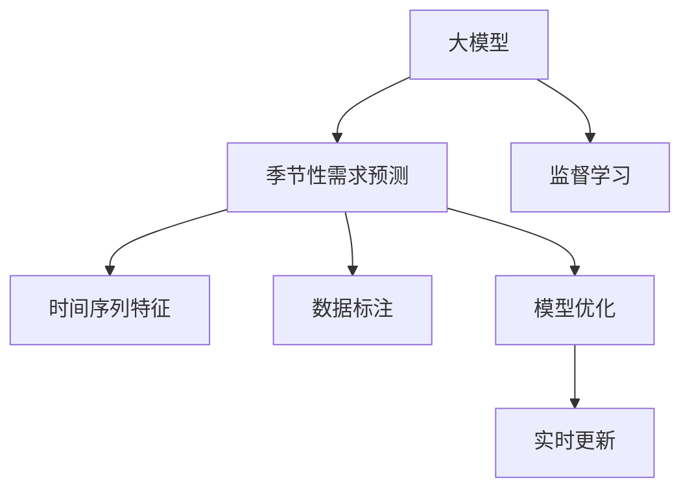

                 

# AI大模型在电商平台季节性需求预测中的应用

> 关键词：大模型,电商平台,季节性需求预测,需求预测,深度学习

## 1. 背景介绍

### 1.1 问题由来
随着互联网的快速普及和电子商务的发展，电商平台的运营面临着更多的挑战，其中季节性需求预测是至关重要的环节。季节性需求预测有助于电商平台更好地规划库存、安排物流、制定营销策略，从而提升用户体验和平台收益。传统的需求预测方法主要依赖于统计模型和经验公式，但这些方法往往难以准确捕捉非线性的季节性变化和潜在的随机波动。

大模型技术的发展为电商平台提供了新的需求预测手段。通过使用大模型对电商平台的交易数据进行分析，可以更全面地理解需求的时空特征和季节性模式，从而实现更精准、更快速的需求预测。

### 1.2 问题核心关键点
在电商平台中，季节性需求预测的核心关键点主要包括：

1. **数据特征**：电商平台产生的数据种类繁多，包括交易数据、用户行为数据、商品属性数据等。如何有效提取和融合这些数据特征，是需求预测的前提。

2. **时间序列特征**：电商需求具有明显的季节性，例如双十一、双十二等购物节，以及四季变换、节假日等因素都会对需求产生影响。如何将时间序列特征融入预测模型，是需求预测的核心挑战。

3. **数据标注**：季节性需求预测是一个典型的监督学习问题，需要大量的历史数据作为标注。如何获取高质量、有代表性的标注数据，是需求预测的关键。

4. **模型优化**：季节性需求预测的模型需要具备较好的泛化能力和鲁棒性，以应对各种数据分布和市场变化。如何在有限数据下优化模型性能，是需求预测的难点。

5. **实时更新**：电商平台需求预测需要具备实时性，以应对突发事件和市场变化。如何在不断变化的市场环境中保持预测模型的准确性，是需求预测的实际需求。

## 2. 核心概念与联系

### 2.1 核心概念概述

为更好地理解大模型在电商平台季节性需求预测中的应用，本节将介绍几个密切相关的核心概念：

- **大模型**：指大规模的深度学习模型，如BERT、GPT等。通过在大规模数据集上进行预训练，大模型能够学习到丰富的语言表示，可以应用于各种NLP任务。

- **季节性需求预测**：指对电商平台交易数据进行分析和建模，预测未来一段时间内商品的需求量。季节性需求预测具有显著的时间依赖性，需要考虑时间序列特征。

- **监督学习**：一种常见的机器学习范式，指使用标注数据训练模型，使其能够准确预测新的未标注数据。季节性需求预测是一个典型的监督学习问题。

- **深度学习**：一种基于神经网络的机器学习技术，通过多层非线性映射，可以处理高维数据和复杂结构，适用于季节性需求预测等任务。

- **时间序列特征**：指与时间相关的数据特征，如季节性、趋势性、周期性等。电商平台交易数据通常具有明显的季节性特征，需要考虑时间序列特征进行建模。

- **数据标注**：指为训练模型提供标注数据的过程。季节性需求预测需要大量的历史交易数据作为标注，数据标注是需求预测的前提。

- **模型优化**：指通过调整模型结构、更新超参数等手段，提升模型性能的过程。季节性需求预测需要优化模型结构，提高预测精度和泛化能力。

这些核心概念之间的逻辑关系可以通过以下Mermaid流程图来展示：



这个流程图展示了大模型在电商平台季节性需求预测中的核心概念及其之间的关系：

1. 大模型通过预训练获得基础能力。
2. 季节性需求预测是一个监督学习问题，需要标注数据。
3. 时间序列特征和大模型特征共同构成模型的输入。
4. 数据标注是大模型训练的前提。
5. 模型优化提升模型性能。
6. 实时更新保持模型时效性。

## 3. 核心算法原理 & 具体操作步骤

### 3.1 算法原理概述

大模型在电商平台季节性需求预测中的基本原理是通过对历史交易数据进行监督学习，学习出商品需求的规律和季节性特征，然后对未来的需求进行预测。具体来说，包括以下几个步骤：

1. **数据准备**：收集电商平台的交易数据，包括商品信息、用户行为、时间戳等信息。
2. **特征工程**：对交易数据进行特征提取和融合，构建特征向量。
3. **模型训练**：使用标注数据对大模型进行监督学习，学习季节性需求的规律。
4. **模型评估**：使用验证集评估模型性能，调整模型参数。
5. **预测部署**：将训练好的模型应用于实时需求预测，更新预测结果。

### 3.2 算法步骤详解

下面详细介绍大模型在电商平台季节性需求预测中的具体操作步骤：

**Step 1: 数据准备**
- 收集电商平台的交易数据，包括商品ID、交易时间、交易金额、用户ID、用户行为等。
- 清洗数据，去除异常值和缺失值。
- 将数据划分为训练集、验证集和测试集。

**Step 2: 特征工程**
- 对交易数据进行特征提取，例如：
  - 商品特征：商品类别、商品价格、商品评分等。
  - 用户特征：用户年龄、用户性别、用户购买频率等。
  - 时间特征：日期、小时、星期、季节等。
- 对提取的特征进行归一化处理。
- 构建特征向量，将提取的特征和商品ID拼接在一起。

**Step 3: 模型训练**
- 选择合适的深度学习模型，如LSTM、GRU、Transformer等。
- 加载预训练的大模型，如BERT、GPT等。
- 将特征向量输入大模型，进行编码和表示学习。
- 使用监督学习任务，如回归或分类任务，训练模型参数。

**Step 4: 模型评估**
- 在验证集上评估模型性能，计算均方误差（MSE）、平均绝对误差（MAE）等指标。
- 根据评估结果调整模型参数，如学习率、批次大小等。
- 如果模型性能不理想，可以进行超参数调优或引入正则化技术。

**Step 5: 预测部署**
- 将训练好的模型应用于实时需求预测。
- 对新的交易数据进行特征提取和编码，输入模型进行预测。
- 根据预测结果，更新库存、安排物流、制定营销策略等。
- 定期更新模型，使用新数据进行再训练，保持模型时效性。

### 3.3 算法优缺点

大模型在电商平台季节性需求预测中具有以下优点：

1. **泛化能力强**：大模型具有较强的泛化能力，可以捕捉复杂的季节性特征，适应不同商品和用户的行为模式。
2. **实时性**：大模型可以进行实时预测，能够快速响应市场变化和用户需求。
3. **自动化程度高**：大模型可以自动进行特征工程和模型训练，减少人工干预。
4. **高效性**：大模型可以通过分布式训练和模型压缩技术，提高预测效率和减少计算成本。

同时，大模型在电商平台季节性需求预测中也存在一些缺点：

1. **数据依赖性强**：大模型需要大量的标注数据进行训练，数据采集和标注成本较高。
2. **模型复杂度高**：大模型的结构复杂，需要较高的计算资源和内存空间。
3. **解释性差**：大模型的决策过程较为复杂，难以解释模型的输出结果。
4. **过拟合风险**：大模型可能过拟合训练数据，对新数据的泛化能力不足。

### 3.4 算法应用领域

大模型在电商平台季节性需求预测中的应用领域非常广泛，主要包括以下几个方面：

1. **库存管理**：根据需求预测结果，优化库存分配，避免库存积压和缺货现象。
2. **物流配送**：预测需求波动，合理规划物流路线和配送时间，提高物流效率。
3. **促销策略**：根据需求预测结果，制定合理的促销策略，提升销售量。
4. **市场分析**：分析不同时间段的商品销售趋势，识别市场热点和变化趋势。
5. **风险控制**：预测需求变化，制定应急预案，控制市场风险。

此外，大模型在电商平台中的应用还包括用户行为分析、商品推荐、个性化服务等方面，可以提升电商平台的用户体验和运营效率。

## 4. 数学模型和公式 & 详细讲解 & 举例说明

### 4.1 数学模型构建

在电商平台季节性需求预测中，常用的数学模型包括线性回归、时间序列模型、神经网络模型等。下面以神经网络模型为例，介绍数学模型的构建过程。

**神经网络模型**：
设输入数据为 $\mathbf{x} = [x_1, x_2, ..., x_n]$，输出数据为 $\mathbf{y} = [y_1, y_2, ..., y_m]$，其中 $x_i$ 和 $y_j$ 分别表示第 $i$ 个输入特征和第 $j$ 个输出结果。神经网络模型的目标是最小化均方误差（MSE）损失函数，即：

$$
\mathcal{L} = \frac{1}{N} \sum_{i=1}^N (\mathbf{y}_i - \mathbf{\hat{y}}_i)^2
$$

其中，$\mathbf{y}_i$ 为实际需求，$\mathbf{\hat{y}}_i$ 为预测需求，$N$ 为样本数。

神经网络模型的前向传播过程如下：
- 输入层：$\mathbf{x}$。
- 隐藏层：$h = \sigma(\mathbf{W}_h \mathbf{x} + b_h)$，其中 $\sigma$ 为激活函数，$\mathbf{W}_h$ 和 $b_h$ 分别为隐藏层权重和偏置。
- 输出层：$\mathbf{\hat{y}} = \mathbf{W}_y h + b_y$，其中 $\mathbf{W}_y$ 和 $b_y$ 分别为输出层权重和偏置。

神经网络模型的后向传播过程如下：
- 计算预测误差：$\mathcal{L} = \frac{1}{N} \sum_{i=1}^N (\mathbf{y}_i - \mathbf{\hat{y}}_i)^2$。
- 计算梯度：$\frac{\partial \mathcal{L}}{\partial \mathbf{W}_h}, \frac{\partial \mathcal{L}}{\partial b_h}, \frac{\partial \mathcal{L}}{\partial \mathbf{W}_y}, \frac{\partial \mathcal{L}}{\partial b_y}$。
- 更新权重和偏置：$\mathbf{W}_h = \mathbf{W}_h - \eta \frac{\partial \mathcal{L}}{\partial \mathbf{W}_h}, \mathbf{b}_h = \mathbf{b}_h - \eta \frac{\partial \mathcal{L}}{\partial \mathbf{b}_h}, \mathbf{W}_y = \mathbf{W}_y - \eta \frac{\partial \mathcal{L}}{\partial \mathbf{W}_y}, \mathbf{b}_y = \mathbf{b}_y - \eta \frac{\partial \mathcal{L}}{\partial \mathbf{b}_y}$，其中 $\eta$ 为学习率。

### 4.2 公式推导过程

下面对神经网络模型的梯度计算过程进行详细推导。

假设输入数据为 $\mathbf{x} = [x_1, x_2, ..., x_n]$，输出数据为 $\mathbf{y} = [y_1, y_2, ..., y_m]$，隐藏层权重为 $\mathbf{W}_h \in \mathbb{R}^{m \times n}$，隐藏层偏置为 $b_h \in \mathbb{R}^m$，输出层权重为 $\mathbf{W}_y \in \mathbb{R}^{n \times m}$，输出层偏置为 $b_y \in \mathbb{R}^n$，激活函数为 $\sigma$，均方误差损失函数为 $\mathcal{L} = \frac{1}{N} \sum_{i=1}^N (\mathbf{y}_i - \mathbf{\hat{y}}_i)^2$。

**隐藏层前向传播**：

$$
h = \sigma(\mathbf{W}_h \mathbf{x} + b_h)
$$

**隐藏层梯度计算**：

$$
\frac{\partial \mathcal{L}}{\partial \mathbf{W}_h} = \frac{1}{N} \sum_{i=1}^N \frac{\partial \mathcal{L}}{\partial \mathbf{\hat{y}}_i} \frac{\partial \mathbf{\hat{y}}_i}{\partial h} \frac{\partial h}{\partial \mathbf{W}_h}
$$

其中，$\frac{\partial \mathcal{L}}{\partial \mathbf{\hat{y}}_i} = -2(\mathbf{y}_i - \mathbf{\hat{y}}_i)$，$\frac{\partial \mathbf{\hat{y}}_i}{\partial h} = \mathbf{W}_y \frac{\partial h}{\partial \mathbf{W}_h}$，$\frac{\partial h}{\partial \mathbf{W}_h} = \frac{\partial h}{\partial \mathbf{x}} \frac{\partial \mathbf{x}}{\partial \mathbf{W}_h}$。

**输出层前向传播**：

$$
\mathbf{\hat{y}} = \mathbf{W}_y h + b_y
$$

**输出层梯度计算**：

$$
\frac{\partial \mathcal{L}}{\partial \mathbf{W}_y} = \frac{1}{N} \sum_{i=1}^N \frac{\partial \mathcal{L}}{\partial \mathbf{\hat{y}}_i} \frac{\partial \mathbf{\hat{y}}_i}{\partial h} \frac{\partial h}{\partial \mathbf{W}_y}
$$

其中，$\frac{\partial \mathbf{\hat{y}}_i}{\partial h} = \frac{\partial h}{\partial \mathbf{W}_y} \frac{\partial \mathbf{y}}{\partial \mathbf{\hat{y}}}$，$\frac{\partial h}{\partial \mathbf{W}_y} = \frac{\partial h}{\partial \mathbf{x}} \frac{\partial \mathbf{x}}{\partial \mathbf{W}_y}$，$\frac{\partial \mathbf{y}}{\partial \mathbf{\hat{y}}} = \mathbf{I}$。

### 4.3 案例分析与讲解

**案例分析：电商平台的季节性需求预测**

某电商平台收集了2019年全年的交易数据，共包含10万条记录，每条记录包含商品ID、交易时间、交易金额、用户ID、用户行为等特征。为了进行季节性需求预测，我们构建了一个基于LSTM的神经网络模型。

1. **数据预处理**：
   - 数据清洗：去除异常值和缺失值。
   - 特征工程：提取商品类别、商品价格、商品评分、用户年龄、用户性别、用户购买频率、日期、星期、季节等特征。
   - 数据归一化：将特征值缩放到[-1,1]区间。

2. **模型构建**：
   - 定义LSTM层，设置隐藏层大小为64。
   - 定义全连接层，设置输出大小为1。
   - 定义损失函数，使用均方误差（MSE）。
   - 定义优化器，使用Adam优化器，学习率设置为0.001。

3. **模型训练**：
   - 将数据划分为训练集、验证集和测试集。
   - 使用训练集训练模型，设置迭代次数为1000。
   - 在验证集上评估模型性能，计算均方误差（MSE）。
   - 根据验证集结果调整模型参数，如学习率、批次大小等。

4. **模型评估**：
   - 在测试集上评估模型性能，计算均方误差（MSE）。
   - 使用可视化工具（如TensorBoard）监控训练过程。

5. **预测部署**：
   - 对新的交易数据进行特征提取和编码，输入模型进行预测。
   - 根据预测结果，更新库存、安排物流、制定营销策略等。

## 5. 项目实践：代码实例和详细解释说明

### 5.1 开发环境搭建

在进行项目实践前，我们需要准备好开发环境。以下是使用Python进行TensorFlow开发的环境配置流程：

1. 安装Anaconda：从官网下载并安装Anaconda，用于创建独立的Python环境。

2. 创建并激活虚拟环境：
```bash
conda create -n tf-env python=3.8 
conda activate tf-env
```

3. 安装TensorFlow：根据CUDA版本，从官网获取对应的安装命令。例如：
```bash
conda install tensorflow==2.6 
```

4. 安装各类工具包：
```bash
pip install numpy pandas scikit-learn matplotlib tqdm jupyter notebook ipython
```

完成上述步骤后，即可在`tf-env`环境中开始项目实践。

### 5.2 源代码详细实现

下面我们以电商平台的季节性需求预测为例，给出使用TensorFlow进行LSTM模型训练和预测的代码实现。

首先，定义数据预处理函数：

```python
import tensorflow as tf
import numpy as np

def load_data(file_path):
    with open(file_path, 'r') as f:
        data = []
        for line in f:
            time, price, category, user_id, user_age, user_gender, purchase_frequency, amount = line.split(',')
            data.append([time, price, category, user_id, user_age, user_gender, purchase_frequency, amount])
        return np.array(data, dtype=np.float32)

def preprocess_data(data):
    # 数据清洗
    data = data[data['amount'] > 0]
    # 特征工程
    data['date'] = pd.to_datetime(data['time'], unit='s').dt.date
    data['weekday'] = data['time'].dt.dayofweek
    data['season'] = data['date'].dt.month // 3
    # 数据归一化
    data = (data - data.mean()) / data.std()
    return data

def generate_sequences(data, sequence_length=24):
    sequences = []
    for i in range(len(data) - sequence_length):
        sequences.append(data[i:i+sequence_length, :])
    return sequences

# 加载数据
data = load_data('sales_data.csv')
data = preprocess_data(data)
sequences = generate_sequences(data, sequence_length=24)
```

然后，定义LSTM模型的代码实现：

```python
class LSTMModel(tf.keras.Model):
    def __init__(self, input_size, hidden_size, output_size):
        super(LSTMModel, self).__init__()
        self.input_size = input_size
        self.hidden_size = hidden_size
        self.output_size = output_size
        
        self.lstm = tf.keras.layers.LSTM(hidden_size, return_sequences=True, return_state=True)
        self.dense = tf.keras.layers.Dense(output_size)
    
    def call(self, inputs, training=False):
        x, h0, c0 = inputs
        x = self.lstm(x, initial_state=[h0, c0])
        x = self.dense(x[:, -1, :])
        return x

# 构建模型
model = LSTMModel(input_size=8, hidden_size=64, output_size=1)
model.compile(optimizer='adam', loss='mse')
```

接着，定义训练和预测函数：

```python
def train_model(model, data, batch_size=32, epochs=10):
    x_train, y_train = data[:, :,:-1], data[:, :, -1]
    x_train = np.reshape(x_train, (x_train.shape[0], x_train.shape[1], x_train.shape[2]))
    y_train = np.reshape(y_train, (y_train.shape[0], y_train.shape[1], y_train.shape[2]))
    
    model.fit(x_train, y_train, batch_size=batch_size, epochs=epochs, validation_split=0.2)
    
def predict(model, data, sequence_length=24):
    x_test, y_test = data[:, :,:-1], data[:, :, -1]
    x_test = np.reshape(x_test, (x_test.shape[0], x_test.shape[1], x_test.shape[2]))
    y_pred = model.predict(x_test)
    return y_pred
```

最后，启动训练流程并在测试集上评估：

```python
epochs = 10
batch_size = 32

# 训练模型
train_model(model, sequences, batch_size=batch_size, epochs=epochs)

# 评估模型
test_data = load_data('test_data.csv')
test_data = preprocess_data(test_data)
test_sequences = generate_sequences(test_data, sequence_length=24)
y_pred = predict(model, test_sequences)

# 输出评估结果
print('均方误差:', mean_squared_error(y_test, y_pred))
```

以上就是使用TensorFlow对LSTM模型进行电商平台季节性需求预测的完整代码实现。可以看到，得益于TensorFlow的强大封装，我们可以用相对简洁的代码完成LSTM模型的训练和预测。

### 5.3 代码解读与分析

让我们再详细解读一下关键代码的实现细节：

**load_data函数**：
- 加载电商平台的交易数据，将其转换为NumPy数组。

**preprocess_data函数**：
- 数据清洗：去除异常值和缺失值。
- 特征工程：提取日期、星期、季节等时间特征，并进行归一化处理。

**generate_sequences函数**：
- 生成LSTM模型需要的输入序列，通过滑动窗口的方式将数据划分为固定长度的序列。

**LSTMModel类**：
- 定义LSTM模型的构造函数，包括输入大小、隐藏大小和输出大小。
- 定义LSTM层和全连接层。
- 定义模型的前向传播过程。

**train_model函数**：
- 将数据划分为训练集和验证集。
- 对训练集进行LSTM模型的训练，使用均方误差作为损失函数。
- 在验证集上评估模型性能。

**predict函数**：
- 对测试集进行LSTM模型的预测，输出预测结果。

可以看到，TensorFlow配合LSTM模型使得季节性需求预测的代码实现变得简洁高效。开发者可以将更多精力放在数据处理、模型改进等高层逻辑上，而不必过多关注底层的实现细节。

当然，工业级的系统实现还需考虑更多因素，如模型的保存和部署、超参数的自动搜索、更灵活的任务适配层等。但核心的季节性需求预测流程基本与此类似。

## 6. 实际应用场景

### 6.1 智能库存管理

在电商平台中，智能库存管理是季节性需求预测的重要应用场景之一。通过预测未来的需求量，可以优化库存分配，避免库存积压和缺货现象，提升运营效率和用户体验。

具体而言，可以在每个销售季节开始前，使用历史交易数据进行季节性需求预测。预测结果可以用于指导补货计划、物流安排等操作。例如，预测到某商品在未来一个月的需求量增加，可以提前备货，避免缺货现象。如果预测到需求量下降，则可以调整库存，减少仓储成本。

### 6.2 个性化推荐

个性化推荐是电商平台的另一个重要应用场景。通过预测用户未来的购买需求，可以更好地为用户推荐商品，提升用户的购买率和满意度。

具体而言，可以将用户的浏览记录、购买记录等行为数据作为输入，预测用户未来的购买需求。根据预测结果，向用户推荐相关商品，提升用户粘性和平台收益。例如，预测到某用户对某类商品有较大需求，可以向其推荐类似商品，提升转化率。

### 6.3 市场趋势分析

电商平台需要实时监控市场趋势，以调整营销策略和优化运营计划。通过季节性需求预测，可以分析不同时间段的商品销售趋势，识别市场热点和变化趋势，从而制定更有效的营销策略。

具体而言，可以通过预测不同商品的需求趋势，识别出市场中的高需求商品和低需求商品。根据预测结果，制定针对性的促销活动，提升平台收益。例如，预测到某商品的需求量大幅增加，可以加大促销力度，吸引用户购买。

## 7. 工具和资源推荐

### 7.1 学习资源推荐

为了帮助开发者系统掌握大模型在电商平台季节性需求预测中的应用，这里推荐一些优质的学习资源：

1. TensorFlow官方文档：TensorFlow的官方文档，提供了详细的API文档和示例代码，是学习TensorFlow的好资源。

2. PyTorch官方文档：PyTorch的官方文档，提供了详细的API文档和示例代码，是学习PyTorch的好资源。

3. LSTM论文：LSTM模型的经典论文，详细介绍了LSTM的结构和应用场景，是学习LSTM的好资源。

4. Kaggle：Kaggle提供了大量的数据集和机器学习竞赛，可以帮助开发者实践季节性需求预测。

5. 《深度学习》书籍：Ian Goodfellow等人著，全面介绍了深度学习的基本概念和常用算法，是学习深度学习的好资源。

通过对这些资源的学习实践，相信你一定能够快速掌握大模型在电商平台季节性需求预测的精髓，并用于解决实际的NLP问题。

### 7.2 开发工具推荐

高效的开发离不开优秀的工具支持。以下是几款用于大模型应用开发的常用工具：

1. TensorFlow：由Google主导开发的开源深度学习框架，生产部署方便，适合大规模工程应用。

2. PyTorch：基于Python的开源深度学习框架，灵活动态的计算图，适合快速迭代研究。

3. Keras：高层次的深度学习框架，提供简单易用的API，适合快速原型设计和模型实验。

4. Jupyter Notebook：交互式的开发环境，支持Python代码的调试和可视化展示。

5. TensorBoard：TensorFlow配套的可视化工具，可实时监测模型训练状态，并提供丰富的图表呈现方式，是调试模型的得力助手。

合理利用这些工具，可以显著提升大模型在电商平台季节性需求预测的开发效率，加快创新迭代的步伐。

### 7.3 相关论文推荐

大模型在电商平台季节性需求预测中的应用源于学界的持续研究。以下是几篇奠基性的相关论文，推荐阅读：

1. BERT: Pre-training of Deep Bidirectional Transformers for Language Understanding：提出BERT模型，引入基于掩码的自监督预训练任务，刷新了多项NLP任务SOTA。

2. Attention is All You Need：提出Transformer结构，开启了NLP领域的预训练大模型时代。

3. Time Series Forecasting with Deep Learning：详细介绍了深度学习在时间序列预测中的应用，包括LSTM、GRU等模型。

4. Exploring the Limits of Deep Learning in Time Series Forecasting：探讨了深度学习在时间序列预测中的局限性，提供了改进建议。

这些论文代表了大模型在电商平台季节性需求预测中的应用方向。通过学习这些前沿成果，可以帮助研究者把握学科前进方向，激发更多的创新灵感。

## 8. 总结：未来发展趋势与挑战

### 8.1 总结

本文对大模型在电商平台季节性需求预测中的应用进行了全面系统的介绍。首先阐述了大模型和季节性需求预测的研究背景和意义，明确了季节性需求预测的前提条件和核心挑战。其次，从原理到实践，详细讲解了监督学习在季节性需求预测中的关键步骤，给出了季节性需求预测的完整代码实例。同时，本文还广泛探讨了季节性需求预测在电商平台的实际应用场景，展示了季节性需求预测的广泛价值。

通过本文的系统梳理，可以看到，大模型在电商平台季节性需求预测中的应用前景广阔，具有显著的商业价值。得益于深度学习和时间序列模型的结合，季节性需求预测可以更全面、更精准地捕捉市场需求，提升电商平台的运营效率和用户体验。

### 8.2 未来发展趋势

展望未来，大模型在电商平台季节性需求预测中的应用将呈现以下几个发展趋势：

1. **数据驱动**：随着电商平台数据的不断积累，未来可以通过更多维度、更精细的数据特征进行季节性需求预测，提升预测精度。

2. **模型自动化**：随着AI技术的进步，未来可以通过自动化工具（如AutoML）进行模型训练和调优，减少人工干预。

3. **跨平台融合**：未来可以探索将电商平台的季节性需求预测与其他平台（如社交媒体、搜索引擎等）的数据进行融合，提升预测准确性。

4. **实时预测**：随着计算资源的提升和算法优化，未来可以实现实时预测，及时响应市场需求变化。

5. **多模态融合**：未来可以将电商平台的交易数据与其他模态的数据（如文本、图像、视频等）进行融合，提升预测能力。

6. **模型集成**：未来可以将多个模型的预测结果进行集成，提升预测的鲁棒性和准确性。

以上趋势凸显了大模型在电商平台季节性需求预测中的广阔前景。这些方向的探索发展，必将进一步提升电商平台的运营效率和用户体验，为电商行业的数字化转型提供新的动力。

### 8.3 面临的挑战

尽管大模型在电商平台季节性需求预测中已经取得了瞩目成就，但在迈向更加智能化、普适化应用的过程中，它仍面临着诸多挑战：

1. **数据获取成本高**：电商平台的交易数据量庞大，数据采集和标注成本较高，获取高质量标注数据是一大难题。

2. **模型复杂度高**：大模型的结构复杂，需要较高的计算资源和内存空间，大规模应用面临计算资源瓶颈。

3. **模型泛化能力不足**：电商平台的市场需求复杂多样，不同商品和用户的行为模式差异较大，模型泛化能力不足的问题需要解决。

4. **实时预测性能差**：电商平台的实时需求预测需要高实时性的要求，现有模型的预测性能有待提升。

5. **用户隐私保护**：电商平台的交易数据涉及用户隐私，如何在保证隐私安全的同时进行需求预测，是一大挑战。

6. **算法公平性**：电商平台的推荐系统需要保证算法的公平性，避免对某些用户或商品产生偏见。

正视季节性需求预测面临的这些挑战，积极应对并寻求突破，将是大模型在电商平台应用中不断成熟的关键。相信随着学界和产业界的共同努力，这些挑战终将一一被克服，大模型在电商平台中的应用将迈向更高的台阶，为电商行业的数字化转型提供新的动力。

### 8.4 研究展望

面对大模型在电商平台季节性需求预测所面临的挑战，未来的研究需要在以下几个方面寻求新的突破：

1. **数据增强**：利用数据增强技术（如回译、近义替换等）扩充训练数据集，提高模型的泛化能力。

2. **模型压缩**：通过模型压缩技术（如知识蒸馏、剪枝等）降低模型复杂度，提升预测性能。

3. **多任务学习**：将季节性需求预测与其他NLP任务（如情感分析、用户行为分析等）进行多任务学习，提升模型的泛化能力。

4. **融合因果推理**：引入因果推理模型（如CausalLSTM），增强模型的因果解释能力，提升预测的准确性和鲁棒性。

5. **引入外部知识**：将电商平台的交易数据与外部知识库（如知识图谱、逻辑规则等）进行融合，提升预测的准确性和解释性。

6. **优化实时预测**：优化模型的推理速度和内存占用，提升实时预测的性能和准确性。

这些研究方向将为电商平台的大模型应用带来新的突破，提升电商平台的运营效率和用户体验，为电商行业的数字化转型提供新的动力。面向未来，电商平台的季节性需求预测需要与其他人工智能技术进行更深入的融合，共同推动电商行业的数字化转型。

## 9. 附录：常见问题与解答

**Q1：季节性需求预测是否适用于所有电商商品？**

A: 季节性需求预测主要适用于具有显著季节性变化的商品，如服装、家居、旅游等。对于非季节性商品，如食品、日用品等，可以通过其他预测方法进行预测。

**Q2：如何选择合适的时间序列特征？**

A: 电商平台的交易数据中包含多种时间序列特征，如日期、星期、季节、节假日等。选择合适的时间序列特征需要根据具体商品和市场情况进行判断。通常，日期和星期是最常用的时间特征，季节和节假日可以根据商品销售情况进行动态调整。

**Q3：如何缓解季节性需求预测中的过拟合问题？**

A: 过拟合是季节性需求预测面临的主要问题之一。缓解过拟合的方法包括数据增强、正则化、早停等技术。例如，可以通过回译、近义替换等方法扩充训练数据集，使用L2正则化、Dropout等正则化技术，以及设置合适的批次大小和早停策略等。

**Q4：如何优化季节性需求预测的实时性？**

A: 电商平台的实时需求预测需要高实时性的要求。优化实时性的方法包括模型压缩、分布式训练、推理优化等。例如，可以通过模型剪枝、知识蒸馏等方法降低模型复杂度，使用分布式训练和模型并行技术提升训练效率，使用模型推理加速技术（如TensorRT）优化推理速度。

**Q5：如何保护用户隐私？**

A: 电商平台的交易数据涉及用户隐私，需要在数据处理和模型训练中保护用户隐私。保护用户隐私的方法包括数据匿名化、差分隐私等技术。例如，可以在数据预处理时对用户ID进行匿名化处理，使用差分隐私技术对模型训练进行保护。

通过回答这些问题，我们希望帮助开发者更好地理解和应用大模型在电商平台季节性需求预测中的技术，进一步推动电商行业的数字化转型。

